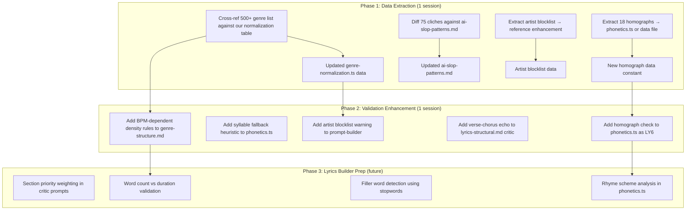

# Tech Review: claude-ai-music-skills

Repository: `claude-ai-music-skills` -- a 52-skill Claude Code plugin for Suno V5 album production. Reviewed against our freddie-ai prompt-builder architecture to identify extractable value.

---

## 1. Executive Summary

**Verdict: Useful pieces.** Not a gold mine, not irrelevant. The repo is a wide-but-shallow album production toolkit. It covers more surface area than we do (72 genre directories, artist blocklists, plagiarism detection) but lacks our depth in prompt engineering (no typed brackets, no tri-critic, no brain.db, no music cards, no deterministic builder).

The highest-value extractions are **data tables** -- curated lists that took real effort to assemble and are platform-agnostic. The algorithmic pieces (syllable counting, rhyme analysis) are worth evaluating against our existing CMU-based phonetics, but may not be upgrades. Their 13-point quality check has ideas we should absorb into our critic prompts, not replicate as code.

| Category | Value | Effort | Priority |
|----------|-------|--------|----------|
| Data tables (genre list, homographs, cliches, density rules) | High | Low | Extract first |
| Validation rules we lack (homographs, artist blocklist, section length by genre) | High | Medium | Integrate into prompt-builder Phase 1-2 |
| Algorithms (syllable counting, rhyme analysis) | Medium | Medium | Evaluate against our phonetics.ts |
| 13-point QC pattern | Medium | Low | Absorb into critic prompts |
| Vocal-first Style format | Low | Low | Test, do not adopt blindly |

---

## 2. What We Should Extract

### 2.1 Data Tables (HIGH priority)

These are curated datasets that save weeks of manual assembly.

#### 500+ Suno Genre List

We have genre normalization covering ~30-40 families in `craft-rules.md` and the prompt-builder plan calls for a `genre-normalization.ts` data file. Their 500+ genre list provides:
- Comprehensive genre name validation (is this even a Suno-recognized genre?)
- Alias discovery (names we might not have mapped)
- Coverage gap detection for our normalization table

**Action:** Cross-reference against our genre normalization table. Extract any genres/aliases we are missing. Do not replace our canonical family mapping -- supplement it.

#### 75 Ubiquitous Song Cliches

We have `ai-slop-patterns.md` in `vault/studio/references/lyrics/` with universal and genre-specific cliche tables. Their 75-phrase blocklist is a complementary set focused on ubiquity rather than AI-specificity.

**Action:** Diff against our `ai-slop-patterns.md`. Merge non-overlapping entries. Our format is better (pattern + why it's slop + better direction) -- adapt their entries to our format.

#### 18 High-Risk Homographs

We have **nothing** for homograph detection. This is a real gap. Words like `live`, `read`, `lead`, `wind`, `bass`, `tear`, `close`, `minute`, `bow`, `dove` have dual pronunciations that can derail Suno's vocal rendering.

**Action:** Extract the full homograph table with pronunciation options. This maps directly to a new validation step in the prompt-builder (Phase 2/3 lyrics builder) or as an enhancement to `phonetics.ts`.

#### 245 Stopwords (English function words + song filler)

Useful for density analysis -- separating meaningful content words from filler. We do not currently measure lyric density at the word level.

**Action:** Extract as a data file. Low urgency until Phase 2/3 lyrics builder.

#### 80+ Artist Name Blocklist with Sonic Alternatives

We have artist reference files (`artists-a-f.md` through `artists-s-z.md`) but no blocklist mechanism. Suno reportedly ignores or mangles certain artist name references.

**Action:** Extract the blocklist. Cross-reference against our artist reference files. Add a `blocked` flag to entries in our references, or create a validation step that warns when a blocked artist name appears in a Style block.

#### Genre-Specific Density Rules (BPM to Line Count)

We have `genre-structure.md` with lines/verse, syllables/line, and density ratings per genre. Their system adds a BPM-dependent dimension: "6 lines/verse at 110-120 BPM; 8 lines at 100-110 BPM". This is more granular than our static genre tables.

**Action:** Evaluate whether BPM-dependent line counts improve our genre structure guide. If validated, extend `genre-structure.md` with BPM-conditional rules. This feeds into the Phase 2/3 lyrics builder's section template engine.

#### Section Priority Mapping

Their chorus=3, bridge=2, verse=1 priority scheme for plagiarism/quality checks. We do not currently weight sections by importance.

**Action:** Extract as a data constant. Useful for the lyrics builder (Phase 2/3) and for critic prompt tuning -- tell critics to weight chorus quality higher than verse quality.

---

### 2.2 Validation Rules We Lack (HIGH priority)

#### Homograph Detection

No equivalent in our system. This belongs in the pre-generation validation pipeline.

**Where it fits:**

```
prompt-builder Phase 2/3 (lyrics builder)
  OR
phonetics.ts enhancement
  OR
new standalone check in validate-prompt.ts
```

**Recommendation:** Add to `phonetics.ts` as a new check type (LY6: homograph risk). The phonetics tool already uses CMU dict, which contains pronunciation variants. The 18 high-risk homographs become a curated fast-path; CMU dict covers the long tail.

#### Artist Name Blocklist Validation

No equivalent. Style blocks sometimes reference artist names for sonic direction.

**Where it fits:** `prompt-builder` Phase 1 conflict checks (if artist name appears in moods/textures/production fields) or as a warning in the builder output.

#### Verse-Chorus Echo Detection (QC point 12)

Detecting when verse lyrics accidentally repeat chorus phrasing. We have no automated check for this.

**Where it fits:** Critic prompt enhancement (`lyrics-structural.md`). Add as a specific check item: "Flag when verse lines duplicate or closely mirror chorus phrasing."

#### Length Check: Word Count vs Duration (QC point 8)

Validating that lyric length matches the expected duration. Too many words for a 2-minute Suno clip = rushed delivery.

**Where it fits:** Phase 2/3 lyrics builder. Use genre density rules + BPM + section count to estimate expected word count, flag overruns.

---

### 2.3 Algorithms (MEDIUM priority)

#### Syllable Counting

Their approach: vowel cluster heuristic + silent 'e' handling + consonant+'le' patterns. This is a rule-based fallback.

Our approach: CMU Pronouncing Dictionary lookup (exact phoneme counts). Falls back to nothing when word is not in CMU dict.

**Assessment:** Their heuristic is a useful **fallback** for words not in CMU dict. Our `phonetics.ts` currently returns `null` for unknown words. Adding their heuristic as a fallback would reduce the `wordsNotFound` count in phonetic reports.

**Action:** Extract their syllable counting heuristic. Add as the fallback path in `phonetics.ts` when `lookupPhonemes()` returns null. Mark heuristic-counted words in the report so the user knows the count is approximate.

#### Rhyme Scheme Analysis

Their approach: extract end words, compute rhyme tails, assign A/B/C labels, detect self-rhymes.

We have no automated rhyme analysis. Our critics (`lyrics-structural.md`) check for rhyme quality but rely on the LLM's judgment, not algorithmic detection.

**Assessment:** Algorithmic rhyme detection is complementary to LLM judgment. It catches self-rhymes and lazy patterns mechanically, freeing the critic to focus on subjective quality.

**Action:** Evaluate for Phase 3 lyrics builder or as a `phonetics.ts` enhancement. The CMU dict already provides the phoneme data needed for rhyme tail extraction. Medium-effort implementation, medium value.

#### Readability (Flesch Reading Ease)

Their approach: Flesch Reading Ease adapted for lyrics context.

**Assessment:** Low value for us. Readability scores are designed for prose, not lyrics. A dense rap verse and a sparse ambient verse have different "correct" readability scores. Genre-specific density rules (which we already have in `genre-structure.md`) are more useful than a single readability number.

**Action:** Skip.

---

### 2.4 Quality Check Patterns (MEDIUM priority)

Their 13-point lyric quality check vs our system:

| Their Check | Our Equivalent | Gap? |
|-------------|---------------|------|
| 1. Rhyme scheme (no self-rhymes, lazy patterns) | `lyrics-structural.md` critic | Partial -- we rely on LLM, they have algorithmic detection |
| 2. Prosody (stress alignment) | `phonetics.ts` LY2 check | **No gap** -- we have CMU-based stress analysis |
| 3. Pronunciation (homographs) | None | **Gap** -- extract their homograph list |
| 4. POV/Tense consistency | `lyrics-intentionality.md` critic | No gap -- critic handles this |
| 5. Source verification | None | Low value -- not relevant to our workflow |
| 6. Structure (section tags) | `genre-structure.md` + typed brackets | **No gap** -- our typed brackets are more precise |
| 7. Flow (syllable consistency, no filler) | `phonetics.ts` + `lyrics-structural.md` | Partial -- we check meter but not filler words |
| 8. Length check (word count vs duration) | None | **Gap** -- worth adding to lyrics builder |
| 9. Section length limits by genre | `genre-structure.md` | Partial -- we have static limits, they have BPM-dependent |
| 10. Rhyme scheme genre alignment | `genre-structure.md` (rhyme approach column) | No gap |
| 11. Density/pacing (Suno-specific line counts) | `genre-structure.md` | Partial -- BPM-dependent rules would improve |
| 12. Verse-chorus echo detection | None | **Gap** -- add to critic prompts |
| 13. Pitfalls checklist | `ai-slop-patterns.md` + `lyrics-structural.md` | No gap |

**Gaps to close:** Points 3, 7 (filler detection), 8, 9 (BPM-dependent), 12.

---

## 3. What We Already Do Better

| Capability | Our System | Their System | Why Ours Is Better |
|-----------|-----------|-------------|-------------------|
| **Typed bracket framework** | Unified typed brackets (Energy, Instrument, Mood, Texture, Vocal Style, modulate, Buildup, Callback, etc.) with pipe syntax for layering | Plain section tags only | Per-section control with type safety. Their system relies on LLM to format everything. |
| **Tri-critic** | Three independent LLMs (Gemini + MiniMax + Grok) with reconciliation table | Single 13-point checklist (no multi-model) | Three perspectives catch different failure modes. Their single-pass check misses subjective disagreements. |
| **brain.db** | SQLite + FTS5 + vector search over vault knowledge, decisions, references, project docs | Markdown state + JSON cache | Semantic search, decision tracking with confidence decay, entity relations, hybrid FTS5+KNN. |
| **Music cards** | Audio reference cards from YouTube (librosa analysis, BPM/key measurement, Gemini refinement, Suno/MiniMax translation) | Genre guides + artist references (no audio grounding) | Our references are grounded in measured audio properties, not just genre descriptions. |
| **Deterministic builder** | `prompt-builder.ts` with Zod validation, 11-slot assembly, auto-trim, conflict matrix (planned/approved) | LLM builds everything from scratch | Same input = same output. Testable, debuggable, no drift. |
| **Self-learning lifecycle** | reflect.ts -> inbox -> consolidate -> knowledge -> distill -> soul | No learning mechanism | Agents improve over time. Their system is static. |
| **Platform-aware strategies** | Suno slot-machine vs MiniMax prose-engine (different assembly strategies sharing modules) | Suno only | We handle multiple platforms with architecture that accounts for their differences. |
| **Vibe mapping** | Dangerous word table with Style-safe translations, tested against Suno behavior | No vibe safety | We catch words like "lazy", "cold", "muted" that Suno misinterprets. |

---

## 4. What We Should NOT Copy

### 72 Genre Directories

Their repo has 72 separate directories with per-genre guides. This is over-engineering for our architecture. We have:
- `genre-structure.md` (genre quick reference table with density, rhyme, structure)
- `craft-rules.md` (genre normalization, fusion strategy)
- Genre recipe stacks (`recipes-*.md`)
- brain.db references indexed for semantic search

Adding 72 directories would fragment our knowledge base and break our discovery/search model. Our approach (fewer files, richer content, indexed in brain.db) is architecturally superior.

### Python MCP Tools

Their analysis tools are Python MCP servers. We are TypeScript CLI tools with dual-mode registry. Porting Python to TypeScript is net-new work, and we already have `phonetics.ts` with CMU dict for the core use case (syllable/stress analysis). The marginal value of their Python implementations does not justify the porting cost.

### Album-Centric Workflow

Their system is designed for album production (multi-track sequencing, track ordering, thematic consistency across songs). We are single-track focused with the `/create-track` skill. Album workflows add complexity we do not need. If we ever want album support, it should be a higher-level orchestration layer on top of our single-track pipeline, not a port of their approach.

### Override System

Their config-driven override system (user overrides for lyric writing guide, suno preferences, pronunciation guide) maps to a problem we already solve differently:
- Agent files (`.claude/agents/`) define defaults
- Knowledge files (`memory/{agent}/knowledge/`) capture learned preferences
- brain.db decisions track what worked and what did not
- `reflect.ts` evolves behavior over time

Their override system is static config. Ours is dynamic learning. No need to regress.

### Plagiarism Detection via N-grams

Their 4-7 word n-gram extraction with section-priority ranking. This is a liability concern, not a generation quality concern. Our tri-critic and AI-slop patterns already catch derivative phrasing from a quality standpoint. N-gram plagiarism detection adds legal paranoia without improving the music.

### Readability Scoring

Flesch Reading Ease for lyrics. See section 2.3 -- genre-specific density rules are more useful than a single readability number.

---

## 5. Integration Plan



### Mapping to Prompt-Builder Sessions

| Extraction | Target Session | Target File(s) |
|-----------|---------------|----------------|
| Genre list cross-reference | Builder Session 1 (Data Model) | `src/libs/prompt-builder/data/genre-normalization.ts` |
| Conflict matrix supplementation | Builder Session 1 (Data Model) | `src/libs/prompt-builder/data/conflict-rules.ts` |
| Homograph data | Standalone (pre-builder or parallel) | `src/data/homographs.ts` |
| Cliche merge | Standalone | `vault/studio/references/lyrics/ai-slop-patterns.md` |
| Artist blocklist | Builder Session 1 or 2 | `src/libs/prompt-builder/data/artist-blocklist.ts` |
| Syllable fallback | Standalone | `src/libs/phonetics.ts` |
| BPM-dependent density | Builder Phase 2 (lyrics builder) | `src/libs/prompt-builder/data/genre-density.ts` |
| Section priority | Builder Phase 2 | `src/libs/prompt-builder/data/section-priority.ts` |
| Stopwords | Builder Phase 2/3 | `src/data/stopwords.ts` |

---

## 6. Specific Extractions

### 6.1 Genre List Cross-Reference

- **Source:** Their `genre_list.json` or equivalent genre directory structure (72 directories)
- **Target:** `src/libs/prompt-builder/data/genre-normalization.ts`
- **What to extract:** Genre names and aliases not present in our ~30-40 family table. Particularly subgenre names that Suno recognizes.
- **Adaptation:** Their format is directory names or JSON entries. Ours is a TypeScript `Map<string, { canonical: string; family: string }>`. Each new genre needs a canonical name and family assignment. Genres without a clear family map to themselves.
- **Risk:** Low. Additive only -- expanding coverage, not changing existing mappings.

### 6.2 Homograph Table

- **Source:** Their homograph detection module (18 high-risk entries)
- **Target:** `src/data/homographs.ts`
- **What to extract:** Full table: word, pronunciation options, example contexts, risk level.
- **Adaptation:** Python dict to TypeScript constant. Format:

```typescript
interface Homograph {
  word: string;
  pronunciations: { ipa: string; meaning: string; example: string }[];
  risk: "high" | "medium";
}

export const HOMOGRAPHS: Homograph[] = [
  {
    word: "live",
    pronunciations: [
      { ipa: "/lɪv/", meaning: "to exist", example: "I live here" },
      { ipa: "/laɪv/", meaning: "in person", example: "live performance" },
    ],
    risk: "high",
  },
  // ... 17 more
];
```

- **Integration:** New `checkHomographs(lyrics: string): HomographWarning[]` function in `phonetics.ts`. Returns warnings when a homograph appears without surrounding context that disambiguates pronunciation.

### 6.3 Cliche Merge

- **Source:** Their 75 ubiquitous song cliches list
- **Target:** `vault/studio/references/lyrics/ai-slop-patterns.md`
- **What to extract:** Cliche phrases not already in our file. Their list focuses on ubiquity (overused in real songs), ours focuses on AI-specificity (phrases LLMs default to). Complementary sets.
- **Adaptation:** Convert each entry to our three-column format: Pattern | Why it's slop | Better direction. Entries that overlap with ours are skipped.
- **Risk:** None. Additive to reference file. brain.db re-indexes on next sync.

### 6.4 Artist Blocklist

- **Source:** Their artist name blocklist (80+ entries with sonic alternatives per genre)
- **Target:** `src/libs/prompt-builder/data/artist-blocklist.ts`
- **What to extract:** Blocked artist names + per-genre sonic alternatives.
- **Adaptation:** TypeScript constant:

```typescript
interface BlockedArtist {
  name: string;
  reason: string;
  alternatives: Record<string, string>; // genre -> sonic description
}

export const BLOCKED_ARTISTS: BlockedArtist[] = [
  {
    name: "Drake",
    reason: "Suno ignores or produces generic output",
    alternatives: {
      "hip-hop": "moody male vocal, atmospheric trap production",
      "r&b": "introspective male vocal, minimalist beat",
    },
  },
  // ...
];
```

- **Integration:** `prompt-builder` checks `moods`, `textures`, and `production` fields for artist names. If found, emits warning with sonic alternative suggestion. Low-effort, high-value safety net.

### 6.5 Syllable Counting Fallback

- **Source:** Their syllable counting heuristic (vowel cluster + silent 'e' + consonant+'le')
- **Target:** `src/libs/phonetics.ts`, inside `syllableCount()` function
- **What to extract:** The heuristic algorithm as a fallback when CMU dict returns null.
- **Adaptation:** Python to TypeScript. The heuristic is simple string manipulation:

```typescript
function heuristicSyllableCount(word: string): number {
  const clean = word.toLowerCase().replace(/[^a-z]/g, "");
  // Count vowel clusters
  const vowelGroups = clean.match(/[aeiouy]+/g) || [];
  let count = vowelGroups.length;
  // Silent 'e' at end
  if (clean.endsWith("e") && count > 1) count--;
  // Consonant + 'le' at end
  if (clean.match(/[^aeiouy]le$/)) count++;
  return Math.max(1, count);
}
```

- **Integration:** In `syllableCount()`, when `getStresses()` returns null, call heuristic. Mark result as approximate in the report.

### 6.6 BPM-Dependent Density Rules

- **Source:** Their per-genre BPM-to-line-count tables
- **Target:** `vault/studio/references/lyrics/genre-structure.md` (reference update) and eventually `src/libs/prompt-builder/data/genre-density.ts` (Phase 2 builder)
- **What to extract:** The BPM thresholds and corresponding line count adjustments per genre.
- **Adaptation:** Extend our genre quick reference table with BPM-conditional columns. Example:

```
| Genre | Base Lines/Verse | BPM < 100 | BPM 100-120 | BPM > 120 |
|-------|-----------------|-----------|-------------|-----------|
| Pop   | 4-6             | 6         | 4-5         | 4         |
```

- **Risk:** Medium. Need to validate these rules against our own production experience. Their rules may not match Suno V5.5 behavior. Extract as advisory, test before codifying.

### 6.7 Verse-Chorus Echo Detection

- **Source:** Their QC point 12 logic
- **Target:** `vault/studio/references/lyrics/` or `.claude/critics/lyrics-structural.md`
- **What to extract:** The concept, not the code. Add a check item to our structural critic.
- **Adaptation:** Add to `lyrics-structural.md` critic prompt:

```
## Verse-Chorus Echo
Flag when verse lines duplicate or closely mirror chorus phrasing.
Acceptable: thematic callback (same concept, different words).
Unacceptable: literal repetition of chorus lines in verses, or
verses that paraphrase the chorus with minor word swaps.
```

- **Risk:** None. Enhances critic prompt. No code change required.

### 6.8 Section Priority Weighting

- **Source:** Their section priority mapping (chorus=3, bridge=2, verse=1)
- **Target:** `src/data/section-priority.ts` (for Phase 2/3 lyrics builder)
- **What to extract:** Priority values per section type.
- **Adaptation:**

```typescript
export const SECTION_PRIORITY: Record<string, number> = {
  chorus: 3,
  hook: 3,
  bridge: 2,
  "pre-chorus": 2,
  verse: 1,
  intro: 1,
  outro: 1,
  interlude: 1,
};
```

- **Integration:** Phase 2/3 lyrics builder uses this to allocate quality budget (more attention to high-priority sections). Also useful for telling critics which sections matter most.

---

## 7. Vocal-First Style Format: Assessment

Their recommendation: describe vocals BEFORE instrumentation in Style. Format: `[Vocal description]. [Genre/subgenre + modifiers]. [Instrumentation]. [Production/mood]`.

Our current approach (from prompt-builder-engine.md): genre at slot 2, vocal style at slot 1 for vocal tracks. This is already vocal-first for vocal tracks.

**Comparison:**

| Aspect | Their Format | Our Format |
|--------|-------------|-----------|
| Vocal position | First (before genre) | First (slot 1, before genre at slot 2) |
| Separator | Periods (sentences) | Commas (slot machine) |
| Genre position | Second | Slot 2 (second) |
| Instrumentation | Third | Slots 3-5 (third) |
| Production | Fourth | Slots 8-10 (later) |

**Assessment:** Our slot 1 for vocal tracks already achieves vocal-first ordering. The sentence/period separator format is worth testing -- Suno V5 may interpret periods differently than commas. But this is a micro-optimization, not an architectural change. File under "test when we have bandwidth."

**Action:** No immediate change. Note for testing during prompt-builder Session 2 integration tests.

---

## 8. Risk Assessment

| Extraction | Risk | Mitigation |
|-----------|------|-----------|
| Genre list expansion | Low | Additive only, existing mappings unchanged |
| Homograph detection | Low | New check, does not modify existing pipeline |
| Cliche merge | Low | Reference file update, brain.db re-indexes |
| Artist blocklist | Low | Warning only, does not block generation |
| Syllable fallback | Medium | Heuristic may miscount -- mark as approximate |
| BPM density rules | Medium | Their rules may not match V5.5 -- validate first |
| Vocal-first testing | Low | Test only, no production change |
| Rhyme analysis | Medium | Non-trivial implementation, defer to Phase 3 |

---

*Reviewed by McCall, 2026-03-31. This document is actionable -- each extraction has a source, target, format, and integration point. Prioritize data table extractions (6.1-6.4) for the prompt-builder Session 1 data model work.*
