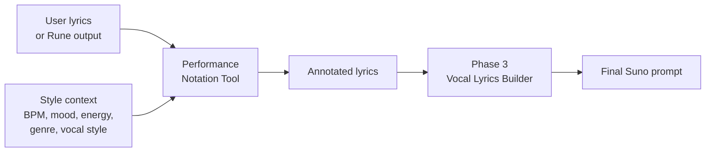
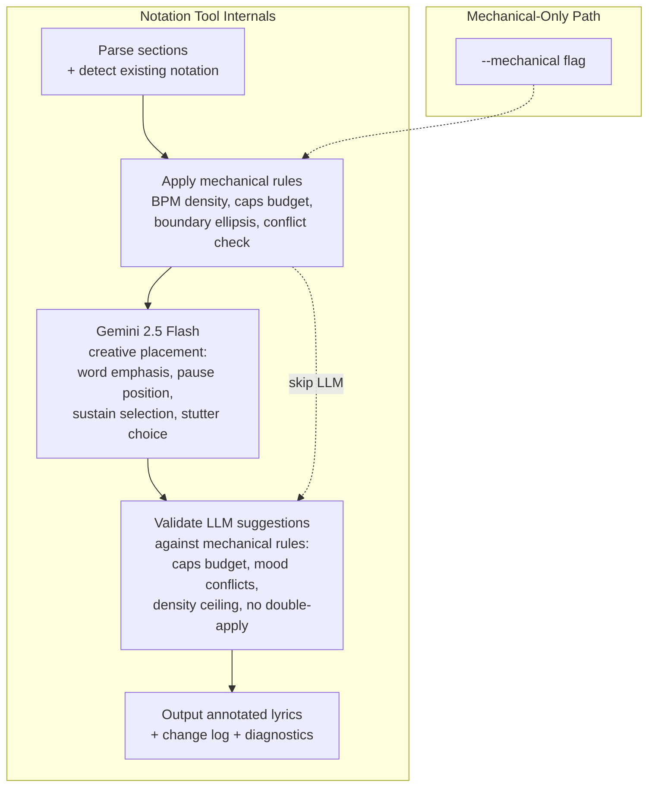
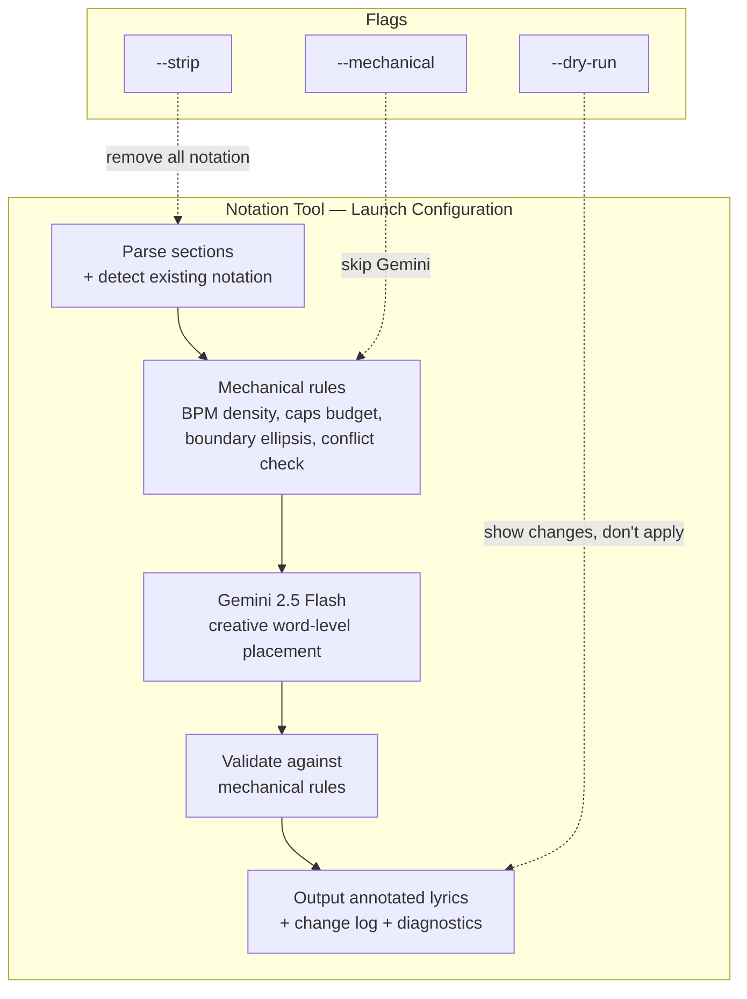

# Design Brief: Performance Notation Tool

## 1. Problem Statement

The Phase 3 Vocal Lyrics Builder wraps lyrics with bracket scaffolding -- section headers, Energy, Mood, Vocal Style, Instrument, Texture -- but never modifies the lyric text itself. This means if a user submits plain lyrics like:

```
I thought we had time
But you were already gone
And I stood there watching the door close
```

Suno interprets them flat. No pauses, no emphasis, no sustain, no breath. The words are sung but not *performed*.

When Rune writes lyrics from scratch, she bakes notation in naturally:

```
I thought we had... time
But you were ALREADY gone
And I stood there watching the door clo-o-ose
```

The ellipsis creates hesitation. The caps punch "already." The hyphenated vowel stretches "close" into a sustained note. These are small mechanical marks that dramatically change vocal delivery.

**The gap:** There is no tool that adds performance notation to existing lyrics. User-written lyrics arrive plain. The builder wraps them in brackets but the lyric lines stay flat. A post-pass tool that adds notation informed by Style context (BPM, mood, energy, genre) would close this gap.

---

## 2. Notation Taxonomy

All known Suno performance notation techniques, verified status, and usage context.

### Confirmed (Reliable)

| Notation | Suno Behavior | Example | When to Use |
|----------|--------------|---------|-------------|
| `...` Ellipsis | Pause / trailing off. More dots = longer pause. | `I thought we had... time` | Hesitation, breath, emotional weight, section transitions |
| `-` Hyphenated vowels | Syllable stretch / sustain. Repeat vowels with hyphens. | `lo-o-o-ove`, `clo-o-ose` | Sustained notes, emotional peaks, melodic hold points |
| `-` Hyphenated words | Syllable break / spell-out | `al-most`, `G-A-L-A-X-Y` | Deliberate articulation, dramatic delivery |
| `ALL CAPS` | Louder, more forceful delivery | `WE RISE together` | Emphasis on 1-3 key words per section max |
| `( )` Parentheses | Background/backing vocal layer (softer, echoed) | `(I'm still here)` | Echo lines, backing response, ad-lib layers |
| Typed stutters | Vocal breaks, cracks, repetition | `I, I miss you` / `No, no, no` | Emotional vulnerability, rhythmic emphasis |
| Short 2-word lines | Forces quiet, intimate delivery | `Don't move.` / `Stay here.` | Stripped sections, emotional turning points |

### Unverified (Use With Caution)

| Notation | Claimed Behavior | Example | Notes |
|----------|-----------------|---------|-------|
| `~` Tilde | Vibrato or note hold | `ho~me` | Single-source claim. Prefer hyphenated vowels for sustain. |
| `" "` Quotation marks | Spoken/whispered nudge | `"you were never there"` | Prefer explicit `[Spoken Word]` or `[Whispered]` tags. |

### Bracket-Based Performance (Not In-Line Notation)

These are bracket tags, not text-level notation. Included for completeness -- the tool should NOT add these (that is the builder's job).

| Tag | Purpose |
|-----|---------|
| `[Whispered]`, `[Belted]`, `[Falsetto]` etc. | Vocal delivery direction |
| `[adlib HEY]`, `[adlib YEAH]` etc. | Ad-lib interjections |
| `[Sobbing voice and choked up]` | Compound emotion performance |
| `(ad-lib)`, `(oh)`, `(yeah)` | Parenthetical ad-lib layer |

### Scream/Growl Notation

| Notation | Example | When to Use |
|----------|---------|-------------|
| ALL CAPS + stretched vowel | `AAAAAH`, `RAAAH!` | Metal, punk, hardcore screams |
| `[Scream]` / `[Growl]` + caps text | `[Scream]` then `AAAAGH!` | Paired tag + notation for reliability |

### Phonetic Performance Writing

| Sound | How to Write | Paired With |
|-------|-------------|-------------|
| Laughter | `HA HA HA HA HA` (caps) | `[Manic laughter]` |
| Crying | `hh... hh...` or stuttered words | `[Sobbing voice]` |
| Scream | `RAAAH!` / `AAAAGH!` (caps) | `[Scream]` |
| Sigh | `ahh...` (lowercase, trailing) | `[Tender]` / `[Vulnerable]` |
| Humming | `mmm... mmm...` / `Hmm... hmm...` | `[Gentle humming]` |

---

## 3. Style-Driven Rules

Performance notation density and type should be informed by the Style context. This is the core value proposition of the tool -- notation is not random decoration; it is shaped by the music.

### BPM -> Notation Density

```
BPM       Pause density    Sustain density    Emphasis density
< 80      High             High               Low (less needed, space does the work)
80-110    Medium           Medium             Medium
110-140   Low              Low                High (punchy, forward momentum)
> 140     Minimal          Minimal            High (caps on key beats, no room for pauses)
```

**Rationale:** Slow tempos have space between beats for pauses and sustains. Fast tempos don't -- stretching a syllable at 160 BPM fights the rhythm. At high BPM, emphasis (caps) on downbeats is the primary tool.

### Mood -> Notation Type Bias

| Mood Category | Primary Notation | Avoid |
|---------------|-----------------|-------|
| Vulnerable, intimate, tender | Ellipsis pauses, typed stutters, short lines | ALL CAPS (too aggressive) |
| Powerful, anthemic, triumphant | ALL CAPS on peaks, sustains on held notes | Excessive ellipsis (breaks momentum) |
| Aggressive, angry, raw | ALL CAPS clusters, stretched screams | Ellipsis (reads as hesitation, wrong register) |
| Melancholic, wistful, nostalgic | Ellipsis trailing, occasional sustain | ALL CAPS (too forceful for the mood) |
| Playful, bouncy, energetic | Parenthetical ad-libs, stutters | Long sustains (kills bounce) |

### Energy Arc -> Notation Placement

| Section Energy | Notation Behavior |
|---------------|-------------------|
| Low | Ellipsis pauses, short lines, no caps |
| Low-Medium | Light sustains on emotional words, occasional ellipsis |
| Medium | Balanced mix, emphasis on hook words |
| Medium-High | Sustains on melodic peaks, caps on 1-2 key words |
| High / Maximum | ALL CAPS on payoff words, parenthetical echo layers, scream notation if genre allows |

**Key principle:** Notation follows energy. A quiet verse with ALL CAPS is wrong. A climactic final chorus with no emphasis is a missed opportunity.

### Genre -> Notation Vocabulary

| Genre Family | Typical Notation | Atypical (Avoid Unless Intentional) |
|-------------|-----------------|--------------------------------------|
| Folk, Country | Sustains on vowels, ellipsis for storytelling pauses | Scream notation, heavy caps |
| Pop | Caps on hooks, parenthetical echoes, clean sustains | Stutters (too raw for polished pop) |
| R&B/Soul | Melismatic sustains (`lo-o-o-ove`), stutters for vulnerability | Heavy caps clusters |
| Hip-Hop/Rap | Caps for punchlines, ad-lib layers, typed stutters | Long sustains (breaks flow) |
| Rock | Caps on choruses, sustains on held notes, screams in hard rock | Excessive ellipsis |
| Metal/Punk | ALL CAPS blocks, stretched screams (`AAAAAH`), short punchy lines | Ellipsis pauses |
| Ambient/Lo-fi | Ellipsis, humming notation (`mmm...`), short lines | Caps, ad-libs |
| Jazz | Light notation, occasional sustain, conversational stutters | Heavy caps, screams |

### Vocal Style -> Notation Constraints

| Vocal Style | Allows | Disallows |
|-------------|--------|-----------|
| Whispered / Breathy | Ellipsis, short lines, `ahh...` | ALL CAPS (contradicts whisper) |
| Belted / Power | ALL CAPS, long sustains | (none -- belting supports most notation) |
| Spoken Word | Typed stutters, short lines, ellipsis | Sustains (spoken word doesn't hold notes) |
| Rapped | Caps for punchlines, stutters | Sustains (rap doesn't sustain syllables) |
| Falsetto | Light sustains, no caps (falsetto is delicate) | Scream notation |

---

## 4. Tool Shape

### Pipeline Position



The tool sits **between** lyric writing and bracket wrapping. It receives plain lyrics and style context, outputs lyrics with performance notation added. The builder then wraps those annotated lyrics with bracket scaffolding.

### Input

```typescript
interface NotationInput {
  lyrics: string;              // Raw lyrics with section headers (e.g., [Verse 1]\nlines...)
  bpm: number;                 // From Style decisions
  genre: string;               // Primary genre
  moods: string[];             // 1-2 mood words
  energyArc: string;           // "ascending" | "descending" | "plateau" | "wave"
  vocalStyle?: string;         // "whispered" | "belted" | "spoken word" | "rapped" | etc.
  sectionEnergies?: string[];  // Pre-computed per-section energy levels (if available from builder)
}
```

### Output

```typescript
interface NotationOutput {
  annotatedLyrics: string;     // Lyrics with notation added
  changes: NotationChange[];   // What was added and why (audit trail)
  diagnostics: Diagnostic[];   // Warnings about conflicts or skipped decisions
}

interface NotationChange {
  line: number;
  original: string;
  annotated: string;
  notation: string;            // "ellipsis" | "caps" | "sustain" | "stutter" | "parenthetical" | "short-line"
  reason: string;              // "BPM 72 + mood vulnerable = pause before emotional peak"
}
```

### CLI Interface

```bash
# Standalone: file-based
bun src/tools/notation.ts --file out/rune-draft.md --bpm 88 --genre folk --moods "wistful, nostalgic" --arc wave

# Standalone: inline text
bun src/tools/notation.ts --text "[Verse 1]\nI thought we had time..." --bpm 88 --genre folk

# With full style context from JSON
bun src/tools/notation.ts --input out/notation-context.json

# Dry run: show what would change without modifying
bun src/tools/notation.ts --file out/rune-draft.md --bpm 88 --genre folk --dry-run

# JSON output for programmatic use
bun src/tools/notation.ts --file out/rune-draft.md --bpm 88 --genre folk --json

# Strip all notation (clean slate)
bun src/tools/notation.ts --file out/rune-draft.md --strip

# Mechanical-only (skip LLM, apply only deterministic rules)
bun src/tools/notation.ts --file out/rune-draft.md --bpm 88 --genre folk --mechanical
```

### Usage Contexts

| Context | How It Is Called | Notes |
|---------|-----------------|-------|
| Standalone | User runs CLI directly on their lyrics | Needs BPM + genre at minimum |
| Rune post-pass | Rune calls after writing lyrics, before handing to builder | Full style context available |
| Builder integration | Builder calls as optional pre-step before bracket wrapping | Style context is already computed |

---

## 5. Relationship to Existing Tools

### Phonetics Tool (`phonetics.ts`)

**Complementary, not overlapping.** Phonetics analyzes *problems* (harsh clusters in soft sections, rhythmic dead zones). Notation adds *performance marks* (pauses, sustains, emphasis). They address different layers:

```
Phonetics: "Line 4 has 4 consecutive unstressed syllables -- rhythmic dead zone"
Notation:  "Line 4: adding ellipsis pause after 'silence' to break the monotone"
```

**Future integration (post-launch):** Phonetics output could *inform* notation decisions. A line flagged with a stress dead zone might benefit from an ellipsis break or a caps emphasis to create rhythmic variation. Deferred to post-launch tuning during Suno generation testing -- we need real output data to calibrate how phonetic signals should map to notation choices.

### Phase 3 Vocal Lyrics Builder (`suno-lyrics.ts` vocal strategy)

**Upstream consumer.** The builder wraps lyrics with brackets but never touches lyric text. Notation runs first, then builder wraps the annotated result. The builder's `VocalLyricsInput` would accept pre-annotated lyrics the same way it accepts Rune's raw output -- it does not care whether notation exists.

**Optional integration point:** The builder could expose a flag (`--with-notation`) to invoke the notation tool as a pre-step. This avoids requiring the caller to run two tools manually.

### Rune (`lyrics.md`)

**Rune already does this intuitively** when writing from scratch. The tool is for two cases:
1. User-provided lyrics that Rune did not write
2. Validation pass -- Rune can run the tool on her output to check if she missed notation opportunities

The tool should NOT override notation Rune already placed. If a line already contains ellipsis, caps, sustains, or parentheticals, the tool should detect and skip those lines (or at minimum not double-apply).

### Density Rules (`density-rules.ts`)

**Informs notation density.** The BPM section rules and genre density data directly feed the notation density calculations in Section 3 above. The tool should import from `prompt-data/` rather than duplicating these tables.

---

## 6. Mechanical + Creative Modes (Ship Together)

The tool ships with both modes at launch. Creative mode is not a future phase -- it is the primary value proposition. Mechanical-only notation (boundary ellipsis, caps budget) is useful but limited; the real gap is word-level creative placement that requires understanding lyrical meaning and emotional weight.

### Mechanical Mode (`--mechanical`)

Deterministic rules, no LLM call. Fast, predictable, zero cost.

| Decision | Rule | Example |
|----------|------|---------|
| Ellipsis at section boundaries | Last line of a verse before chorus gets `...` at slow BPM | `watching the door close...` |
| Caps budget enforcement | Max 1-3 caps words per section, 0 in Low energy | Flag if over budget |
| Sustain on section-final vowels | Long vowel at end of chorus line at < 100 BPM gets hyphenated stretch | `clo-o-ose` |
| Conflict detection | Caps in a `[Whispered]` section, sustain at 160 BPM | Diagnostic warning |
| Existing notation detection | Line already has `...` or caps -- skip it | No double-application |
| BPM-based density ceiling | Count total notation marks, cap per section based on BPM | Max 2 per section at high BPM |

### Creative Mode (Default)

LLM-assisted placement via Gemini 2.5 Flash. Runs after mechanical rules.

| Decision | Why It Needs Judgment | Example |
|----------|----------------------|---------|
| *Which* word to capitalize | Depends on lyrical meaning, not position | "we rise TOGETHER" vs "WE rise together" |
| *Where* to place pauses | Depends on emotional phrasing, not just line position | `I thought... we had time` vs `I thought we had... time` |
| Stutter placement | Depends on character voice and emotional register | `I, I miss you` -- which word to stutter? |
| Parenthetical echo choice | Which phrase to echo as backing vocal | `(still here)` vs `(I'm still here)` |
| Whether to add notation at all | Some lines are better left plain | Clean declarative statements need no decoration |

### Processing Flow



### Model Choice: Gemini 2.5 Flash

**Decision:** Gemini 2.5 Flash for creative notation placement.

| Criterion | Gemini 2.5 Flash | MiniMax M2.5 | Grok 4.1 Fast |
|-----------|-----------------|--------------|---------------|
| Cost per call | **$0.00** (free tier) | ~$0.002 | ~$0.001 |
| Lyrical understanding | Strong -- primary critic, proven on lyrics structural analysis | Medium -- secondary critic, intentionality focus | Medium -- wild card, creative but inconsistent |
| Musical context | Excellent -- handles BPM/key/energy in musiccard analysis | Good on generation side, weaker in chat reasoning | Untested on structured music-context tasks |
| Consistency | **High** -- same input produces structurally similar output | Medium -- chat quality varies | Lower -- explicitly chosen as wild card for divergence |
| Instruction adherence | **High** -- structural observations documented as "reliably good" | Acceptable | Lower -- creative interpretation over strict following |
| Integration | Existing lib, system-file + input-file pattern | Same | Same |

**Rationale:**
1. Zero cost enables unlimited iteration during launch tuning
2. Proven on the exact task shape: lyrics + musical context + structured rules = annotated output
3. Highest consistency -- pipeline tools need predictable output, not creative divergence
4. Mechanical validation layer catches any bad suggestions, making the choice lower-risk
5. Grok's wild-card divergence (valuable for critique) is a liability for a pipeline tool
6. MiniMax's strength (intentionality critique) does not map to the structured creative task here

### Safety: Mechanical Rules as Guardrail

Creative mode is safe to ship at launch because every LLM suggestion passes through mechanical validation:

1. Caps budget exceeded? Reject the excess.
2. Caps in a whispered section? Reject.
3. Sustain at high BPM? Reject.
4. Density ceiling breached? Reject lowest-confidence suggestions.
5. Notation on a line that already has notation? Skip.

The mechanical layer is not just a standalone mode -- it is the validation gate for creative output. This means creative mode cannot produce invalid notation. The worst case is it produces *less* notation than ideal (if many suggestions get rejected), not bad notation.

---

## 7. Resolved Questions

| # | Question | Resolution | Notes |
|---|----------|------------|-------|
| 1 | In-place or side-by-side diff? | **In-place** with `--dry-run` for review | Original default confirmed |
| 2 | Which model for creative mode? | **Gemini 2.5 Flash** | Zero cost, proven lyrical+musical understanding, highest consistency. See Section 6 model comparison. |
| 3 | Phonetics integration at launch? | **Deferred to post-launch** | Tune during Suno generation testing. Need real output data to calibrate phonetic-to-notation mapping. |
| 4 | Notation density ceiling? | **Start conservative, tune from testing** | 1-2 marks/section at high BPM, 2-4 at low BPM. Adjust based on Suno output quality. |
| 5 | Strip mode? | **Yes -- `--strip` flag** | Removes all notation marks. Useful for "start fresh" workflows. |
| 6 | Notation before or after tri-critic? | **Before tri-critic** | Critics evaluate the performed version, not the plain version. |
| 7 | Creative mode at launch? | **Yes -- ship both modes together** | Creative is the primary value. Mechanical-only is available via `--mechanical` flag but creative is the default. |

### New Open Questions

| # | Question | Impact | Default If Unanswered |
|---|----------|--------|-----------------------|
| 8 | Should the Gemini system prompt for creative mode be a critic file (`.claude/critics/`) or a tool-internal prompt? | Architecture consistency. Critics are model-agnostic system prompts. But this is not critique -- it is generation. | Tool-internal prompt in `src/tools/notation/` -- this is a generation task, not a critique task. Critics are for review, not creation. |
| 9 | How should the tool handle non-English lyrics? | Scope. Notation taxonomy is English-centric (caps, hyphens). Some notation (ellipsis, sustain) may work cross-language. | English-only at launch. Non-English lyrics pass through with only mechanical boundary rules applied (no creative placement). |
| 10 | Should `--with-notation` on the builder be opt-in or opt-out? | Workflow friction. Opt-in means callers must remember. Opt-out means every build gets notation. | Opt-in at launch. Once notation quality is proven, consider making it opt-out. |

---

## Summary



**What this tool is:** A style-aware notation applicator that bridges the gap between plain lyrics and performed lyrics, informed by the same Style decisions that drive the rest of the prompt. Ships with both mechanical rules and Gemini-powered creative placement.

**What this tool is not:** A lyric rewriter. It adds performance marks informed by musical context. It does not change words, reorder lines, or make creative choices about meaning. The mechanical validation layer ensures all creative suggestions respect the style-driven rules.
