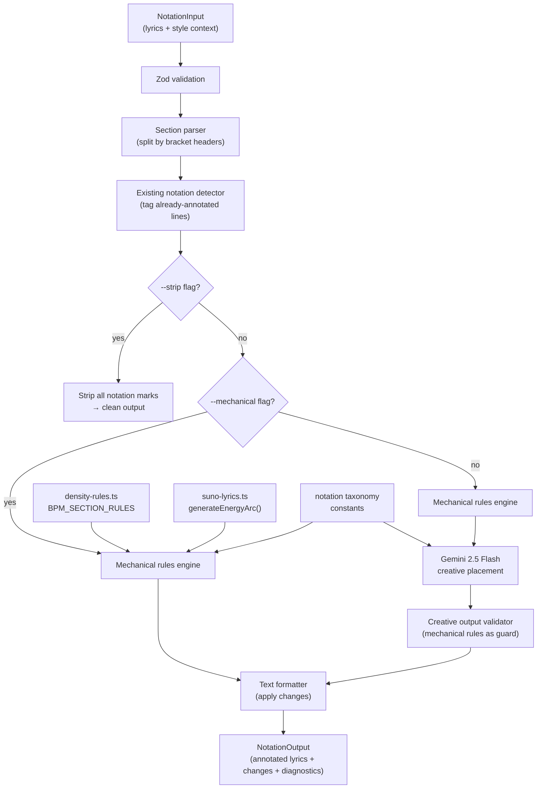
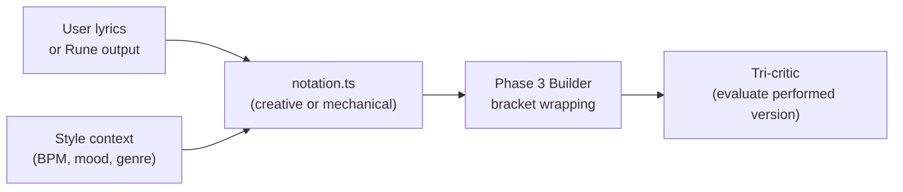

# Task: Performance Notation Tool

## Objective

Build a style-aware performance notation tool that adds vocal delivery marks (ellipsis pauses, caps emphasis, hyphenated sustains, typed stutters, parenthetical echoes) to existing lyrics, informed by Style context (BPM, mood, energy arc, genre, vocal style). The tool ships with both a deterministic mechanical rules engine and Gemini 2.5 Flash creative placement. Mechanical rules serve as both a standalone mode (`--mechanical`) and the validation guardrail for creative output. The tool sits between lyric writing and the Phase 3 Vocal Lyrics Builder in the pipeline.

## Scope

### In Scope

- `NotationInput`, `NotationOutput`, `NotationChange` types (Zod schemas + TypeScript)
- Notation taxonomy constants (confirmed marks, BPM density mappings, mood-notation bias, genre vocabulary, vocal style constraints)
- Section parser: split lyrics into section blocks by `[Section Tag]` headers
- Existing notation detector: identify lines that already have ellipsis, caps, sustains, parentheticals, stutters
- Mechanical rules engine: boundary ellipsis, caps budget, sustain on section-final vowels, conflict detection, density ceiling
- Creative mode: Gemini 2.5 Flash call with system prompt containing taxonomy + rules + style context
- Creative output validator: mechanical rules guard creative suggestions before application
- Text formatter: apply `NotationChange[]` to lyrics, produce annotated output
- Strip mode: `--strip` removes all notation marks from lyrics
- Dry-run mode: `--dry-run` shows changes without applying
- CLI entry point: dual-mode (CLI + `toolDef` registry export)
- JSON output mode: `--json` for programmatic use
- Unit tests and integration tests

### Out of Scope

- Phonetics integration (deferred to post-launch tuning)
- Non-English lyrics (English-only at launch; non-English passes through with mechanical boundary rules only)
- Builder integration flag (`--with-notation` on the builder is opt-in, wired separately)
- MiniMax notation (Suno-specific at launch)
- Bracket-level tags (`[Whispered]`, `[Belted]`, etc.) -- that is the builder's job
- Tilde notation (`~`) -- unverified, excluded from launch

## Prerequisites

All of these exist and are complete:

| Dependency | File | Status |
|-----------|------|--------|
| Energy arc engine | `src/libs/prompt-builder/strategies/suno-lyrics.ts` | Complete -- `generateEnergyArc()` exported |
| Density rules | `src/libs/prompt-data/density-rules.ts` | Complete -- `BPM_SECTION_RULES`, `GENRE_DENSITY` |
| Gemini SDK wrapper | `src/libs/gemini.ts` | Complete -- `generateText()` with usage tracking |
| Diagnostic type | `src/libs/prompt-builder/types.ts` | Complete -- `Diagnostic` interface |
| Phonetics tool pattern | `src/tools/phonetics.ts` | Complete -- dual-mode CLI + toolDef to follow |
| Prompt builder CLI pattern | `src/tools/prompt-builder.ts` | Complete -- flag parsing, JSON/file input pattern |
| Registry types | `src/registry/types.ts` | Complete -- `ToolDefinition`, `ToolResult` |
| Brain.db references | `references/suno/meta-tags-advanced.md` | Complete -- Lyric Formatting Symbols section covers full notation taxonomy |

---

## Architecture

### Data Flow



### Where Files Go

```
src/libs/notation/
  types.ts                          # NEW: NotationInput, NotationOutput, NotationChange, taxonomy constants
  constants.ts                      # NEW: Notation taxonomy data, BPM density mappings, mood bias, genre vocab, vocal constraints
  parser.ts                         # NEW: Section parser + existing notation detector
  mechanical.ts                     # NEW: Deterministic rules engine
  creative.ts                       # NEW: Gemini creative placement + output validator
  formatter.ts                      # NEW: Apply changes to lyrics text, strip mode
  index.ts                          # NEW: Barrel export, main `annotate()` and `strip()` pipeline functions
  system-prompt.md                  # NEW: Gemini system prompt template for creative mode
  __tests__/
    parser.test.ts                  # NEW: Section parsing + notation detection tests
    mechanical.test.ts              # NEW: Mechanical rules engine tests
    creative.test.ts                # NEW: Creative mode + validator tests
    formatter.test.ts               # NEW: Text formatting + strip tests
    pipeline.test.ts                # NEW: End-to-end annotate() tests

src/tools/notation.ts               # NEW: CLI entry point + toolDef (dual-mode)
```

### Decision: Lib Module, Not Inline Tool

The notation engine lives in `src/libs/notation/` with the CLI wrapper at `src/tools/notation.ts`. This matches the phonetics pattern (`src/libs/phonetics.ts` + `src/tools/phonetics.ts`) and the prompt-builder pattern (`src/libs/prompt-builder/` + `src/tools/prompt-builder.ts`). The engine is importable by the builder for future `--with-notation` integration.

### Decision: System Prompt as Markdown File

The Gemini system prompt for creative mode lives at `src/libs/notation/system-prompt.md` -- a markdown file read at runtime. This matches the pattern used by critic files (`.claude/critics/*.md`) and tool system prompts (`--system-file`). The prompt is NOT in `.claude/critics/` because this is a generation task, not a critique task.

---

## Input/Output Schemas

### NotationInput

```typescript
// src/libs/notation/types.ts

import { z } from "zod";

export const NotationInputSchema = z.object({
  lyrics: z.string().min(1),                    // Raw lyrics with section headers
  bpm: z.number().int().min(40).max(240),
  genre: z.string().min(1),                      // Primary genre
  moods: z.array(z.string()).min(1).max(3),
  energyArc: z.enum(["ascending", "descending", "plateau", "wave"]),
  vocalStyle: z.string().optional(),             // "whispered" | "belted" | "spoken word" | "rapped" | etc.
  sectionEnergies: z.array(z.string()).optional(), // Pre-computed per-section energy levels
});

export type NotationInput = z.infer<typeof NotationInputSchema>;
```

### NotationOutput

```typescript
export interface NotationOutput {
  annotatedLyrics: string;       // Lyrics with notation applied
  changes: NotationChange[];     // Audit trail of every change
  diagnostics: Diagnostic[];     // Warnings, conflicts, skipped decisions
  mode: "creative" | "mechanical"; // Which mode was used
  stats: {
    sectionsProcessed: number;
    linesAnnotated: number;
    linesSkipped: number;        // Already had notation
    changesApplied: number;
    changesRejected: number;     // Creative suggestions rejected by validator
  };
}
```

### NotationChange

```typescript
export type NotationType =
  | "ellipsis"
  | "caps"
  | "sustain"
  | "stutter"
  | "parenthetical"
  | "short-line";

export interface NotationChange {
  section: string;               // Section tag where change occurs (e.g. "Verse 1")
  line: number;                  // 1-based line number within section
  lineGlobal: number;           // 1-based line number in full lyrics
  original: string;             // Original line text
  annotated: string;            // Line after notation applied
  notation: NotationType;
  reason: string;               // "BPM 72 + mood vulnerable = pause before emotional peak"
  source: "mechanical" | "creative"; // Which engine suggested it
  confidence?: number;           // 0-1, creative mode only (from Gemini)
}
```

### ParsedSection (internal)

```typescript
export interface ParsedSection {
  tag: string;                   // e.g. "Verse 1", "Chorus", "Bridge"
  lines: string[];               // Lyric lines (no headers, no blank lines)
  lineOffset: number;            // Global line number of first lyric line
  energy: string;                // Energy level (from sectionEnergies or computed)
  existingNotation: Map<number, NotationType[]>; // line index -> detected notation types
}
```

---

## Implementation Plan

### Step 1: Types and Constants

**Files:** `src/libs/notation/types.ts`, `src/libs/notation/constants.ts`

**types.ts** -- Define all types listed above:
- `NotationInputSchema` (Zod) and `NotationInput`
- `NotationOutput`, `NotationChange`, `NotationType`, `ParsedSection`
- Re-export `Diagnostic` from `../prompt-builder/types.js`

**constants.ts** -- All notation taxonomy data as typed constants:

1. **`NOTATION_MARKS`** -- Regex patterns for each notation type used in detection:

```typescript
export const NOTATION_MARKS: Record<NotationType, RegExp> = {
  ellipsis: /\.{2,}/,                           // 2+ dots
  caps: /\b[A-Z]{2,}\b/,                        // 2+ consecutive uppercase letters as a word
  sustain: /\w-\w/,                              // hyphenated vowels/syllables (lo-o-ove, al-most)
  stutter: /\b(\w+),\s*\1\b/i,                  // "I, I" / "no, no" patterns
  parenthetical: /\([^)]+\)/,                    // (text in parens)
  "short-line": /.{0,15}$/,                      // Detection: NOT used for detection, only for application
};
```

Note: `short-line` is not detectable as existing notation (any short line could be intentional). It is only used in creative mode placement.

2. **`BPM_NOTATION_DENSITY`** -- Maps BPM ranges to per-notation-type density ceilings (marks per section):

```typescript
export interface BpmNotationDensity {
  readonly bpmRange: readonly [number, number];
  readonly maxPerSection: Readonly<Record<NotationType, number>>;
  readonly label: string;
}

export const BPM_NOTATION_DENSITY: readonly BpmNotationDensity[] = [
  {
    bpmRange: [40, 79],
    label: "slow",
    maxPerSection: { ellipsis: 3, caps: 1, sustain: 3, stutter: 1, parenthetical: 1, "short-line": 2 },
  },
  {
    bpmRange: [80, 110],
    label: "mid-slow",
    maxPerSection: { ellipsis: 2, caps: 2, sustain: 2, stutter: 1, parenthetical: 1, "short-line": 1 },
  },
  {
    bpmRange: [111, 140],
    label: "mid-fast",
    maxPerSection: { ellipsis: 1, caps: 2, sustain: 1, stutter: 1, parenthetical: 1, "short-line": 0 },
  },
  {
    bpmRange: [141, 240],
    label: "fast",
    maxPerSection: { ellipsis: 0, caps: 2, sustain: 0, stutter: 1, parenthetical: 1, "short-line": 0 },
  },
];
```

3. **`MOOD_NOTATION_BIAS`** -- Maps mood categories to preferred/avoided notation types:

```typescript
export interface MoodBias {
  readonly moods: readonly string[];             // Mood keywords that trigger this bias
  readonly prefer: readonly NotationType[];
  readonly avoid: readonly NotationType[];
}

export const MOOD_NOTATION_BIAS: readonly MoodBias[] = [
  { moods: ["vulnerable", "intimate", "tender"], prefer: ["ellipsis", "stutter", "short-line"], avoid: ["caps"] },
  { moods: ["powerful", "anthemic", "triumphant"], prefer: ["caps", "sustain"], avoid: ["ellipsis"] },
  { moods: ["aggressive", "angry", "raw"], prefer: ["caps"], avoid: ["ellipsis"] },
  { moods: ["melancholic", "wistful", "nostalgic"], prefer: ["ellipsis", "sustain"], avoid: ["caps"] },
  { moods: ["playful", "bouncy", "energetic"], prefer: ["parenthetical", "stutter"], avoid: ["sustain"] },
];
```

4. **`GENRE_NOTATION_VOCAB`** -- Maps genre families to typical/atypical notation:

```typescript
export interface GenreNotationVocab {
  readonly genre: string;
  readonly typical: readonly NotationType[];
  readonly atypical: readonly NotationType[];    // Avoid unless intentional
}

export const GENRE_NOTATION_VOCAB: readonly GenreNotationVocab[] = [
  { genre: "folk", typical: ["sustain", "ellipsis"], atypical: ["caps", "parenthetical"] },
  { genre: "pop", typical: ["caps", "parenthetical", "sustain"], atypical: ["stutter"] },
  { genre: "r&b", typical: ["sustain", "stutter"], atypical: ["caps"] },
  { genre: "hip-hop", typical: ["caps", "parenthetical", "stutter"], atypical: ["sustain"] },
  { genre: "rock", typical: ["caps", "sustain"], atypical: ["ellipsis"] },
  { genre: "metal", typical: ["caps"], atypical: ["ellipsis"] },
  { genre: "ambient", typical: ["ellipsis", "short-line"], atypical: ["caps", "parenthetical"] },
  { genre: "jazz", typical: ["sustain", "stutter"], atypical: ["caps"] },
];
```

5. **`VOCAL_STYLE_CONSTRAINTS`** -- Hard constraints per vocal style:

```typescript
export interface VocalStyleConstraint {
  readonly style: string;
  readonly allows: readonly NotationType[];
  readonly disallows: readonly NotationType[];
}

export const VOCAL_STYLE_CONSTRAINTS: readonly VocalStyleConstraint[] = [
  { style: "whispered", allows: ["ellipsis", "short-line", "stutter"], disallows: ["caps"] },
  { style: "breathy", allows: ["ellipsis", "short-line", "stutter"], disallows: ["caps"] },
  { style: "belted", allows: ["caps", "sustain", "parenthetical", "ellipsis", "stutter", "short-line"], disallows: [] },
  { style: "spoken word", allows: ["stutter", "short-line", "ellipsis"], disallows: ["sustain"] },
  { style: "rapped", allows: ["caps", "stutter", "parenthetical"], disallows: ["sustain"] },
  { style: "falsetto", allows: ["sustain", "ellipsis"], disallows: ["caps"] },
];
```

6. **`ENERGY_NOTATION_RULES`** -- Maps energy levels to notation behavior:

```typescript
export const ENERGY_NOTATION_RULES: Record<string, { allow: NotationType[]; maxTotal: number }> = {
  "Low":         { allow: ["ellipsis", "short-line"], maxTotal: 2 },
  "Low-Medium":  { allow: ["ellipsis", "sustain", "stutter"], maxTotal: 3 },
  "Medium":      { allow: ["ellipsis", "caps", "sustain", "stutter", "parenthetical"], maxTotal: 3 },
  "Medium-High": { allow: ["caps", "sustain", "parenthetical"], maxTotal: 4 },
  "High":        { allow: ["caps", "sustain", "parenthetical", "stutter"], maxTotal: 4 },
};
```

**Acceptance criteria:**
- `tsc --noEmit` passes
- `NotationInputSchema` rejects missing `lyrics`, invalid `bpm`, unknown `energyArc`
- All constants are `readonly` and exported
- No duplicated data from `density-rules.ts` -- BPM ranges here are notation-specific, not section-count-specific

### Step 2: Section Parser + Existing Notation Detector

**File:** `src/libs/notation/parser.ts`

Two exported functions:

```typescript
export function parseSections(
  lyrics: string,
  sectionEnergies?: string[],
  energyArc?: "ascending" | "descending" | "plateau" | "wave",
): ParsedSection[]

export function detectExistingNotation(line: string): NotationType[]
```

**`parseSections()` logic:**
1. Split lyrics by lines
2. Identify section headers: lines matching `^\[.+\]$` where the content is NOT a bracket-type tag like `[Energy: ...]`, `[Mood: ...]`, `[Instrument: ...]`, `[Texture: ...]`
3. Group lyric lines under their section header
4. Skip structural tags: `[Instrumental]`, `[No Vocals]`, `[End]`
5. Track global line offsets for each section
6. Assign energy levels:
   - If `sectionEnergies` provided, use index-matched values
   - Otherwise, call `generateEnergyArc(energyArc, sectionCount)` from `suno-lyrics.ts`
7. Run `detectExistingNotation()` on each lyric line, store in `existingNotation` map

**`detectExistingNotation()` logic:**
1. Test each line against `NOTATION_MARKS` regex patterns (except `short-line`)
2. Return array of detected `NotationType` values
3. Edge cases:
   - A line like `I thought we had... time` has `ellipsis`
   - A line like `WE RISE together` has `caps`
   - A line like `lo-o-o-ove` has `sustain`
   - A line like `I, I miss you` has `stutter`
   - A line like `(still here)` has `parenthetical`
   - Bracket tags like `[Verse 1]` are NOT section content -- never detected
   - ALL-CAPS section headers (e.g. a line that IS a section header) are excluded by the parser

**Import:** `import { generateEnergyArc } from "../prompt-builder/strategies/suno-lyrics.js";`

**Acceptance criteria:**
- Parses standard lyrics with `[Verse 1]`, `[Chorus]`, etc. headers
- Handles lyrics with bracket tags (Energy, Mood, etc.) -- these are skipped, not treated as section headers
- `detectExistingNotation("I thought we had... time")` returns `["ellipsis"]`
- `detectExistingNotation("WE RISE together")` returns `["caps"]`
- `detectExistingNotation("lo-o-o-ove you")` returns `["sustain"]`
- `detectExistingNotation("I, I miss you")` returns `["stutter"]`
- `detectExistingNotation("(still here)")` returns `["parenthetical"]`
- `detectExistingNotation("Just a plain line")` returns `[]`
- Energy levels assigned correctly from arc or explicit list
- Global line offsets are accurate

### Step 3: Mechanical Rules Engine

**File:** `src/libs/notation/mechanical.ts`

```typescript
export function applyMechanicalRules(
  sections: ParsedSection[],
  input: NotationInput,
): { changes: NotationChange[]; diagnostics: Diagnostic[] }
```

**Rules applied in order:**

1. **Skip already-annotated lines.** If `existingNotation` is non-empty for a line, skip it entirely. Emit `info` diagnostic: `EXISTING_NOTATION_SKIPPED`.

2. **Boundary ellipsis.** Last line of a verse/section before a chorus/hook gets `...` appended IF:
   - BPM < 111 (slow/mid-slow allows ellipsis)
   - Mood does not avoid ellipsis (check `MOOD_NOTATION_BIAS`)
   - Vocal style allows ellipsis (check `VOCAL_STYLE_CONSTRAINTS`)
   - The line does not already end with punctuation (`.`, `!`, `?`, `...`)
   - Notation: append `...` to end of line

3. **Caps budget enforcement.** Count existing caps words in section. If a section has energy "Medium-High" or "High" AND caps budget allows it AND mood/genre/vocal style don't avoid caps:
   - Identify the LAST content line of peak sections (Chorus, Hook, Final Chorus) as the candidate for caps emphasis
   - Apply caps to 1 word maximum per section (mechanical mode is conservative)
   - Word selection heuristic: last stressed word in the line (word with 2+ syllables, not a function word like "the", "and", "but", "or", "in", "on", "at", "to", "for")
   - Notation: uppercase the selected word

4. **Sustain on section-final vowels.** Last line of chorus/hook sections at BPM < 100:
   - Find the final word of the line
   - If it ends in a long vowel sound (words ending in: -ove, -ose, -ine, -ight, -ome, -one, -aze, -ire, -ore, -ow, -ay, -ee, -oo), apply hyphenated sustain
   - Notation: `close` -> `clo-o-ose`, `love` -> `lo-o-ove`, `time` -> `ti-i-ime`
   - Implementation: identify the stressed vowel, duplicate it with hyphens (1 repetition for BPM 80-99, 2 repetitions for BPM < 80)

5. **Conflict detection.** After applying rules 2-4, check for conflicts:
   - Caps in a section with vocal style "whispered" or "breathy" -> `warning` diagnostic: `CAPS_WHISPER_CONFLICT`
   - Sustain at BPM > 140 -> `warning` diagnostic: `SUSTAIN_HIGH_BPM`
   - Ellipsis in a section with mood "aggressive" or "angry" -> `warning` diagnostic: `ELLIPSIS_AGGRESSIVE_CONFLICT`
   - These are warnings, not rejections -- the rule shouldn't have fired (earlier checks prevent it), but this is a safety net

6. **Density ceiling.** After all changes are collected, count notation marks per section. If a section exceeds `maxTotal` from `ENERGY_NOTATION_RULES` for its energy level:
   - Remove the lowest-priority changes (priority: boundary ellipsis < sustain < caps)
   - Emit `info` diagnostic: `DENSITY_CEILING_TRIMMED`

**Function word list (do not capitalize):**

```typescript
const FUNCTION_WORDS = new Set([
  "a", "an", "the", "and", "but", "or", "nor", "for", "yet", "so",
  "in", "on", "at", "to", "by", "of", "up", "off", "out",
  "is", "am", "are", "was", "were", "be", "been", "being",
  "do", "does", "did", "has", "have", "had",
  "i", "me", "my", "we", "us", "our", "you", "your",
  "he", "him", "his", "she", "her", "it", "its", "they", "them", "their",
  "this", "that", "these", "those",
  "not", "no", "if", "then", "than", "as",
]);
```

**Sustain vowel patterns (long vowel endings):**

```typescript
const SUSTAIN_VOWEL_ENDINGS = [
  /ove$/, /ose$/, /ine$/, /ight$/, /ome$/, /one$/, /aze$/, /ire$/, /ore$/,
  /ow$/, /ay$/, /ee$/, /oo$/, /ue$/, /ie$/, /ey$/,
];
```

**Sustain application function:**

```typescript
function applySustain(word: string, repetitions: number): string
// "close" + 1 -> "clo-o-ose"
// "love" + 2 -> "lo-o-o-ove"
// "time" + 1 -> "ti-i-ime"
// Logic: find the stressed vowel cluster, duplicate it with hyphens
```

**Acceptance criteria:**
- Lines with existing notation are skipped (never double-applied)
- Boundary ellipsis only fires at BPM < 111 and respects mood/vocal constraints
- Caps budget never exceeds 1 word per section in mechanical mode
- Function words are never capitalized
- Sustain only applies to words with long vowel endings at BPM < 100
- Sustain produces correct hyphenation: `close` -> `clo-o-ose`, `love` -> `lo-o-ove`
- Conflict detection catches all 3 conflict types
- Density ceiling trims lowest-priority changes first
- Every change has a `reason` string explaining the rule + context

### Step 4: Creative Mode (Gemini Call)

**File:** `src/libs/notation/creative.ts`

```typescript
export async function applyCreativeNotation(
  sections: ParsedSection[],
  input: NotationInput,
  mechanicalChanges: NotationChange[],
): Promise<{ changes: NotationChange[]; diagnostics: Diagnostic[] }>

export function validateCreativeChanges(
  changes: NotationChange[],
  sections: ParsedSection[],
  input: NotationInput,
): { accepted: NotationChange[]; rejected: NotationChange[]; diagnostics: Diagnostic[] }
```

**`applyCreativeNotation()` logic:**

1. Build the Gemini prompt:
   - Read system prompt from `src/libs/notation/system-prompt.md`
   - Inject style context into the user prompt: BPM, genre, moods, energy arc, vocal style
   - Include the full lyrics with section headers
   - Include mechanical changes already applied (so Gemini doesn't duplicate them)
   - Include the notation taxonomy (confirmed marks only) as reference
   - Request structured JSON output

2. Call `generateText()` from `src/libs/gemini.ts`:
   - Model: `gemini-2.5-flash`
   - Temperature: `0.4` (low creativity -- we want consistent, tasteful placement, not wild experimentation)
   - Caller: `notation`
   - System prompt: loaded from `system-prompt.md`

3. Parse Gemini's JSON response into `NotationChange[]` objects
4. Pass through `validateCreativeChanges()` before returning

**Gemini response schema (requested in system prompt):**

```json
{
  "changes": [
    {
      "section": "Verse 1",
      "line": 2,
      "original": "But you were already gone",
      "annotated": "But you were ALREADY gone",
      "notation": "caps",
      "reason": "emphasis on the unexpected departure, energy Medium matches caps",
      "confidence": 0.85
    }
  ]
}
```

**`validateCreativeChanges()` logic:**

For each creative suggestion, check against mechanical rules:

1. **Caps in whispered/breathy section?** Reject. Diagnostic: `CREATIVE_CAPS_WHISPER_REJECTED`.
2. **Sustain at BPM > 140?** Reject. Diagnostic: `CREATIVE_SUSTAIN_HIGH_BPM_REJECTED`.
3. **Density ceiling breached?** Count mechanical + creative changes per section against `ENERGY_NOTATION_RULES.maxTotal`. If over, reject lowest-confidence creative suggestions first. Diagnostic: `CREATIVE_DENSITY_CEILING_REJECTED`.
4. **Line already has notation (existing or mechanical)?** Reject. Diagnostic: `CREATIVE_DOUBLE_APPLY_REJECTED`.
5. **Notation type disallowed by vocal style?** Reject. Diagnostic: `CREATIVE_VOCAL_STYLE_REJECTED`.
6. **Notation type atypical for genre?** Emit `warning` (not rejection): `CREATIVE_GENRE_ATYPICAL`.

Return accepted changes, rejected changes, and diagnostics.

**System Prompt (`src/libs/notation/system-prompt.md`):**

```markdown
# Performance Notation Assistant

You add vocal performance marks to song lyrics for Suno AI. Your marks control how the AI vocalist delivers the words.

## Available Notation

| Mark | Effect | Example |
|------|--------|---------|
| `...` (ellipsis) | Pause / trailing off | `I thought we had... time` |
| `ALL CAPS` (1-3 words max) | Louder, forceful delivery | `WE RISE together` |
| `-` hyphenated vowels | Syllable sustain | `lo-o-o-ove`, `clo-o-ose` |
| `I, I` typed stutters | Vocal break, repetition | `I, I miss you` |
| `(text)` parentheses | Background/backing vocal | `(I'm still here)` |

## Rules

1. **Never change words.** Only add notation marks. Do not rewrite, reorder, or remove words.
2. **Respect density ceilings.** Use the per-section limits provided in the context.
3. **Skip lines that already have notation.** If a line already contains `...`, caps, sustains, stutters, or parentheticals, do not add more.
4. **Leave some lines plain.** Not every line needs notation. Clean declarative statements are often better undecorated.
5. **Match the mood.** Vulnerable moods get pauses and stutters, not caps. Powerful moods get caps and sustains, not excessive pauses.
6. **Match the energy.** Low-energy sections get minimal notation. High-energy sections get emphasis and sustains.
7. **Match the genre.** Folk gets sustains on vowels. Hip-hop gets caps on punchlines. Ambient gets ellipsis and short lines.
8. **Caps rules:** Never capitalize function words (the, and, but, or, in, on, at, to, etc.). Only capitalize content words that carry emotional weight.
9. **Sustain rules:** Only stretch long vowel sounds. Never stretch consonant clusters.
10. **Stutter rules:** Only stutter on first-person pronouns or emotionally loaded single words.

## Output Format

Respond with ONLY a JSON object. No markdown fencing, no explanation.

{
  "changes": [
    {
      "section": "section tag here",
      "line": 1,
      "original": "exact original line",
      "annotated": "line with notation added",
      "notation": "ellipsis|caps|sustain|stutter|parenthetical",
      "reason": "brief explanation of why this notation fits here",
      "confidence": 0.85
    }
  ]
}

If no changes are needed, return: { "changes": [] }
```

**Acceptance criteria:**
- Gemini is called with correct model, temperature, and caller
- System prompt is loaded from file (not inline string)
- User prompt includes all style context and the lyrics
- Response is parsed as JSON with error handling for malformed output
- All creative changes pass through `validateCreativeChanges()`
- Rejected changes are logged with diagnostic codes
- If Gemini returns malformed JSON, emit `error` diagnostic and return empty changes (graceful degradation)

### Step 5: Text Formatter

**File:** `src/libs/notation/formatter.ts`

```typescript
export function applyChanges(
  lyrics: string,
  changes: NotationChange[],
): string

export function stripNotation(lyrics: string): string
```

**`applyChanges()` logic:**
1. Split lyrics into lines
2. For each change, find the line by `lineGlobal` (1-based)
3. Replace the line with `change.annotated`
4. If multiple changes target the same line (e.g., mechanical ellipsis + creative caps), apply them in order: sustain first, then caps, then ellipsis (leftmost to rightmost in the line)
5. Return the reassembled lyrics string

**`stripNotation()` logic:**
Remove all notation marks from lyrics:
1. Replace `...` (3+ dots) with empty string, clean up whitespace
2. Replace ALL CAPS words with lowercase (but preserve first-letter capitalization for line starts)
3. Replace hyphenated sustains: `lo-o-o-ove` -> `love`, `clo-o-ose` -> `close` (collapse repeated vowel-hyphen patterns)
4. Replace typed stutters: `I, I miss` -> `I miss` (remove the repeated word + comma)
5. Remove parenthetical content: `(still here)` -> empty (these are backing vocal layers, removing them removes the layer)
6. Clean up double spaces, trailing whitespace
7. Preserve section headers and bracket tags untouched

**Sustain collapse regex:**

```typescript
// Match patterns like lo-o-o-ove, clo-o-ose, ti-i-ime
// Captures: prefix + repeated (-vowel) groups + suffix
const SUSTAIN_PATTERN = /(\w+?)(-[aeiou])+(-\w+)/gi;
// Replacement: first capture + last capture (without leading hyphen)
```

**Acceptance criteria:**
- `applyChanges()` correctly replaces lines by global line number
- Multiple changes to the same line are composited correctly
- `stripNotation("I thought we had... time")` -> `"I thought we had time"`
- `stripNotation("WE RISE together")` -> `"We rise together"` (preserve sentence case)
- `stripNotation("lo-o-o-ove you")` -> `"love you"`
- `stripNotation("I, I miss you")` -> `"I miss you"`
- `stripNotation("Hello (still here)")` -> `"Hello"`
- Section headers `[Verse 1]` and bracket tags `[Energy: High]` are never modified
- No double spaces or trailing whitespace in output

### Step 6: Pipeline (index.ts)

**File:** `src/libs/notation/index.ts`

```typescript
export async function annotate(rawInput: unknown): Promise<NotationOutput>
export function strip(lyrics: string): string
```

**`annotate()` pipeline:**

```typescript
export async function annotate(rawInput: unknown): Promise<NotationOutput> {
  // 1. Zod validation
  const parsed = NotationInputSchema.safeParse(rawInput);
  // ... return diagnostics on failure (same pattern as buildStyle)

  const input = parsed.data;

  // 2. Parse sections + detect existing notation
  const sections = parseSections(input.lyrics, input.sectionEnergies, input.energyArc);

  // 3. Apply mechanical rules
  const mechanical = applyMechanicalRules(sections, input);

  // 4. If mechanical-only mode, skip creative
  // (mode is determined by the CLI layer, passed as a flag -- see Step 7)
  // For the lib, always run creative. CLI decides.

  // 5. Apply creative notation (Gemini)
  const creative = await applyCreativeNotation(sections, input, mechanical.changes);

  // 6. Validate creative output against mechanical rules
  const validated = validateCreativeChanges(creative.changes, sections, input);

  // 7. Merge changes: mechanical + accepted creative
  const allChanges = [...mechanical.changes, ...validated.accepted];

  // 8. Apply changes to lyrics text
  const annotatedLyrics = applyChanges(input.lyrics, allChanges);

  // 9. Merge diagnostics
  const diagnostics = [
    ...mechanical.diagnostics,
    ...creative.diagnostics,
    ...validated.diagnostics,
  ];

  // 10. Compute stats
  const stats = {
    sectionsProcessed: sections.length,
    linesAnnotated: new Set(allChanges.map(c => c.lineGlobal)).size,
    linesSkipped: countSkippedLines(sections),
    changesApplied: allChanges.length,
    changesRejected: validated.rejected.length,
  };

  return { annotatedLyrics, changes: allChanges, diagnostics, mode: "creative", stats };
}
```

**`strip()` is a simple re-export of `stripNotation()` from `formatter.ts`.**

**Also export a mechanical-only variant:**

```typescript
export function annotateMechanical(rawInput: unknown): NotationOutput
// Same as annotate() but skips steps 5-6, sets mode: "mechanical"
// Synchronous -- no async needed since no Gemini call
```

**Acceptance criteria:**
- `annotate()` returns a complete `NotationOutput` with all fields populated
- `annotateMechanical()` returns synchronously with only mechanical changes
- `strip()` removes all notation marks
- Zod validation errors produce structured diagnostics
- Mechanical + creative changes are merged without duplicates on the same line
- Stats accurately count all categories

### Step 7: CLI Entry Point

**File:** `src/tools/notation.ts`

Dual-mode tool following the `phonetics.ts` pattern:

```typescript
#!/usr/bin/env bun

import { z } from "zod";
import { readFileSync } from "fs";
import type { ToolDefinition, ToolResult } from "../registry/types.js";
import { annotate, annotateMechanical, strip } from "../libs/notation/index.js";

export const toolDef: ToolDefinition = {
  name: "notation",
  description:
    "Add performance notation (pauses, emphasis, sustains, stutters) to lyrics " +
    "informed by Style context (BPM, mood, energy, genre, vocal style). " +
    "Returns annotated lyrics with change log and diagnostics.",
  inputSchema: z.object({
    lyrics: z.string().optional().describe("Lyrics text (inline)"),
    file: z.string().optional().describe("Path to lyrics file"),
    input: z.string().optional().describe("Path to JSON input file (NotationInput)"),
    bpm: z.number().optional().describe("BPM (required unless --input used)"),
    genre: z.string().optional().describe("Primary genre"),
    moods: z.string().optional().describe("Comma-separated moods"),
    arc: z.string().optional().describe("Energy arc: ascending|descending|plateau|wave"),
    vocalStyle: z.string().optional().describe("Vocal style constraint"),
    mechanical: z.boolean().optional().describe("Mechanical-only mode (no Gemini)"),
    strip: z.boolean().optional().describe("Strip all notation marks"),
    dryRun: z.boolean().optional().describe("Show changes without applying"),
    json: z.boolean().optional().describe("Output as JSON"),
  }),
  tags: ["creative", "quality", "suno"],
  execute: async (args) => { /* ... */ },
};
```

**CLI flags:**

```
Usage:
  bun src/tools/notation.ts --file <path> --bpm <n> --genre <g> --moods "m1, m2" --arc <arc>
  bun src/tools/notation.ts --text "<lyrics>" --bpm <n> --genre <g>
  bun src/tools/notation.ts --input <path.json>
  bun src/tools/notation.ts --file <path> --strip
  bun src/tools/notation.ts --file <path> --bpm <n> --genre <g> --mechanical
  bun src/tools/notation.ts --file <path> --bpm <n> --genre <g> --dry-run
  bun src/tools/notation.ts --file <path> --bpm <n> --genre <g> --json

Flags:
  --file <path>          Path to lyrics file
  --text "<lyrics>"      Inline lyrics text
  --input <path.json>    Full NotationInput as JSON file
  --bpm <number>         BPM (required unless --input or --strip)
  --genre <string>       Primary genre (required unless --input or --strip)
  --moods "m1, m2"       Comma-separated mood words
  --arc <arc>            Energy arc (default: plateau)
  --vocal-style <style>  Vocal style constraint
  --mechanical           Skip Gemini, apply only deterministic rules
  --strip                Remove all notation marks
  --dry-run              Show what would change without applying
  --json                 Output full NotationOutput as JSON

Output:
  Default: annotated lyrics to stdout, diagnostics to stderr
  --json: full NotationOutput as JSON to stdout
  --dry-run: change list to stdout, no file modification

Exit codes:
  0  success
  1  errors (validation failure, Gemini failure with no fallback)
```

**CLI behavior:**

1. **`--strip` path:** Read lyrics from `--file` or `--text`, call `strip()`, output clean lyrics. No BPM/genre required.
2. **`--mechanical` path:** Build `NotationInput` from flags, call `annotateMechanical()`, format output.
3. **Default (creative) path:** Build `NotationInput` from flags, call `annotate()`, format output.
4. **`--dry-run`:** Run the chosen path but output the changes list instead of the annotated lyrics. Format:

```
--- Changes (dry-run) ---
  [Verse 1] L3: "watching the door close" → "watching the door close..." (ellipsis, mechanical)
    Reason: BPM 72 boundary ellipsis before Chorus
  [Chorus] L2: "we rise together" → "we RISE together" (caps, creative, conf: 0.82)
    Reason: emphasis on action word at energy Medium-High
--- 2 changes, 0 rejected ---
```

5. **`--json`:** Output full `NotationOutput` as JSON to stdout.
6. **Default text output:**

```
[annotated lyrics to stdout]

--- Notation Summary ---    [to stderr]
Mode: creative
Sections: 5 | Lines annotated: 4 | Skipped: 2 | Applied: 6 | Rejected: 1
Warnings: 1
```

**Acceptance criteria:**
- `bun src/tools/notation.ts --file out/test-lyrics.md --bpm 88 --genre folk --moods "wistful" --arc wave` produces annotated output
- `bun src/tools/notation.ts --file out/test-lyrics.md --strip` removes all notation
- `bun src/tools/notation.ts --file out/test-lyrics.md --bpm 88 --genre folk --mechanical` runs without Gemini call
- `bun src/tools/notation.ts --file out/test-lyrics.md --bpm 88 --genre folk --dry-run` shows changes without applying
- `bun src/tools/notation.ts --file out/test-lyrics.md --bpm 88 --genre folk --json` outputs valid JSON
- `--input out/notation-context.json` reads full NotationInput from file
- Exit code 0 on success, 1 on errors
- `toolDef` is exported and functional via registry

---

## Test Plan

### Unit Tests

**`src/libs/notation/__tests__/parser.test.ts`:**

| Test | Assertion |
|------|-----------|
| Parse standard sections | `[Verse 1]\nline1\nline2` -> 1 section, 2 lines |
| Parse multiple sections | 3 sections with headers -> 3 `ParsedSection` objects |
| Skip bracket tags | `[Energy: High]` not treated as section header |
| Skip structural tags | `[Instrumental]`, `[No Vocals]`, `[End]` excluded |
| Detect ellipsis | `"had... time"` -> `["ellipsis"]` |
| Detect caps | `"WE RISE"` -> `["caps"]` |
| Detect sustain | `"lo-o-ove"` -> `["sustain"]` |
| Detect stutter | `"I, I miss"` -> `["stutter"]` |
| Detect parenthetical | `"(still here)"` -> `["parenthetical"]` |
| Detect multiple | `"WE had... TIME"` -> `["ellipsis", "caps"]` |
| Plain line | `"Just walking home"` -> `[]` |
| Energy from arc | 5 sections + arc "ascending" -> 5 ascending energy levels |
| Energy from explicit | `sectionEnergies: ["Low", "High"]` used when provided |
| Global line offsets | Line offsets correct across multi-section lyrics |

**`src/libs/notation/__tests__/mechanical.test.ts`:**

| Test | Assertion |
|------|-----------|
| Boundary ellipsis at slow BPM | Last verse line before chorus gets `...` at BPM 72 |
| No boundary ellipsis at fast BPM | BPM 150 -> no ellipsis added |
| No ellipsis if line has punctuation | Line ending in `.` or `!` -> no ellipsis |
| Caps on peak section | Chorus at energy High -> 1 caps word |
| No caps in whispered section | vocalStyle "whispered" -> 0 caps changes |
| No caps on function words | "the", "and", "but" never capitalized |
| Sustain at slow BPM | BPM 72, chorus final word "close" -> `clo-o-ose` |
| No sustain at fast BPM | BPM 150 -> no sustain changes |
| Sustain on correct vowels | "love" -> `lo-o-ove`, "time" -> `ti-i-ime` |
| No sustain on consonant endings | "rock" -> no sustain |
| Skip already-annotated | Line with `...` -> no changes, diagnostic emitted |
| Density ceiling | Excess changes trimmed, lowest priority first |
| Conflict: caps + whispered | Warning diagnostic emitted |
| Conflict: sustain + high BPM | Warning diagnostic emitted |
| Determinism | Same input 50 times -> identical output |

**`src/libs/notation/__tests__/creative.test.ts`:**

| Test | Assertion |
|------|-----------|
| Validator rejects caps in whispered | Creative caps change in whispered section -> rejected |
| Validator rejects sustain at high BPM | Creative sustain at 160 BPM -> rejected |
| Validator rejects double-apply | Creative change on already-annotated line -> rejected |
| Validator respects density ceiling | Over-ceiling creative changes trimmed by confidence |
| Validator warns genre-atypical | Caps in ambient genre -> warning (not rejection) |
| Malformed Gemini JSON | Graceful degradation, error diagnostic, empty changes |
| System prompt loaded | System prompt file exists and is non-empty |

**`src/libs/notation/__tests__/formatter.test.ts`:**

| Test | Assertion |
|------|-----------|
| Apply single change | Line replaced at correct position |
| Apply multiple changes to different lines | All replacements correct |
| Apply multiple changes to same line | Composited correctly |
| Strip ellipsis | `"had... time"` -> `"had time"` |
| Strip caps | `"WE RISE together"` -> `"We rise together"` |
| Strip sustain | `"lo-o-o-ove"` -> `"love"` |
| Strip stutter | `"I, I miss"` -> `"I miss"` |
| Strip parenthetical | `"Hello (still here)"` -> `"Hello"` |
| Strip preserves headers | `[Verse 1]` untouched |
| Strip preserves bracket tags | `[Energy: High]` untouched |
| No double spaces after strip | Clean whitespace |

**`src/libs/notation/__tests__/pipeline.test.ts`:**

| Test | Assertion |
|------|-----------|
| Full mechanical pipeline | Valid input -> `annotateMechanical()` -> non-empty output |
| Zod rejects missing lyrics | -> validation error diagnostic |
| Zod rejects invalid BPM | BPM 0 -> error |
| Strip pipeline | `strip()` removes all notation |
| Stats accuracy | Stats match actual change counts |
| Mechanical mode has no creative changes | All changes have `source: "mechanical"` |

### Edge Cases

| Edge Case | Expected Behavior |
|-----------|-------------------|
| Lyrics with no section headers | Treated as single implicit section |
| Empty lyrics | Validation error |
| Lyrics already fully annotated | All lines skipped, 0 changes, info diagnostics |
| Single-line lyrics | Processes the one line |
| Lyrics with only bracket tags (no lyric text) | 0 changes |
| BPM at boundary (e.g., 111) | Uses the range that includes 111 (mid-fast) |
| Unknown genre | Falls through to no genre-specific bias, all notation types available |
| Unknown vocal style | No vocal style constraints applied |
| Gemini timeout | Graceful degradation to mechanical-only, warning diagnostic |
| Gemini returns non-JSON | Graceful degradation to mechanical-only, error diagnostic |

---

## Integration Points

### Rune (lyrics.md)

Rune can use the notation tool in two ways:

1. **Post-pass on user-provided lyrics:** User submits plain lyrics, Rune runs notation before handing to the builder.
2. **Self-check:** Rune runs the tool on her own output to verify notation quality and find missed opportunities.

The tool respects existing notation (Rune's natural placement), so running it on already-annotated lyrics is safe -- it will skip annotated lines and only add to plain lines.

### Phase 3 Vocal Lyrics Builder

The builder calls notation as an optional pre-step. The pipeline:



The builder's `VocalLyricsInput` accepts pre-annotated lyrics the same way it accepts raw lyrics -- it does not inspect or modify notation marks. Future `--with-notation` flag on the builder would call `annotate()` internally before bracket wrapping.

### Tri-Critic Pipeline

Notation runs BEFORE tri-critic, per the design brief decision. Critics evaluate the performed version of the lyrics, not the plain version. This means critics can flag bad notation (e.g., "caps emphasis on a weak word") as part of their normal review.

### Prompt Builder CLI

The notation tool is a standalone CLI tool, not integrated into `prompt-builder.ts`. It has its own entry point at `src/tools/notation.ts`. This keeps the prompt builder focused on Style/Lyrics blocks and avoids coupling two distinct concerns. The builder can import from `src/libs/notation/` for the future `--with-notation` integration.

---

## File Summary

| File | Type | Description |
|------|------|-------------|
| `src/libs/notation/types.ts` | NEW | Zod schemas, TypeScript types, re-export Diagnostic |
| `src/libs/notation/constants.ts` | NEW | Notation taxonomy, BPM density, mood bias, genre vocab, vocal constraints, energy rules |
| `src/libs/notation/parser.ts` | NEW | Section parser, existing notation detector |
| `src/libs/notation/mechanical.ts` | NEW | Deterministic rules engine |
| `src/libs/notation/creative.ts` | NEW | Gemini creative placement + validator |
| `src/libs/notation/formatter.ts` | NEW | Apply changes to text, strip notation |
| `src/libs/notation/index.ts` | NEW | Pipeline orchestration: `annotate()`, `annotateMechanical()`, `strip()` |
| `src/libs/notation/system-prompt.md` | NEW | Gemini system prompt for creative mode |
| `src/libs/notation/__tests__/parser.test.ts` | NEW | Parser + detector tests |
| `src/libs/notation/__tests__/mechanical.test.ts` | NEW | Mechanical rules tests |
| `src/libs/notation/__tests__/creative.test.ts` | NEW | Creative mode + validator tests |
| `src/libs/notation/__tests__/formatter.test.ts` | NEW | Formatter + strip tests |
| `src/libs/notation/__tests__/pipeline.test.ts` | NEW | End-to-end pipeline tests |
| `src/tools/notation.ts` | NEW | CLI entry point + toolDef |
