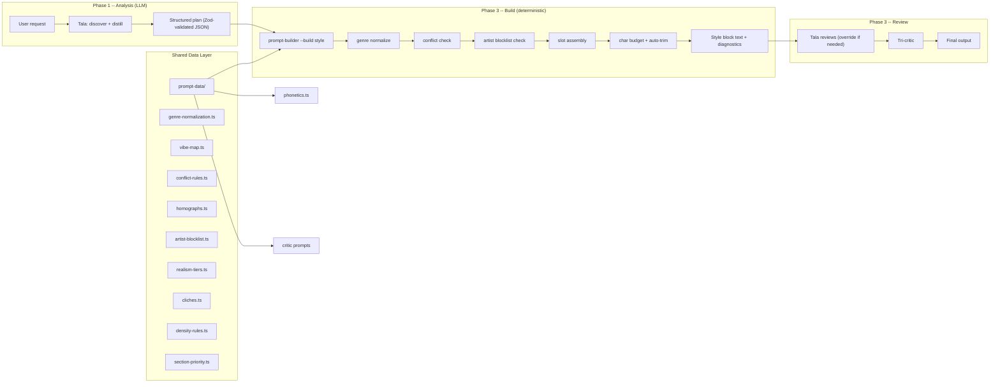
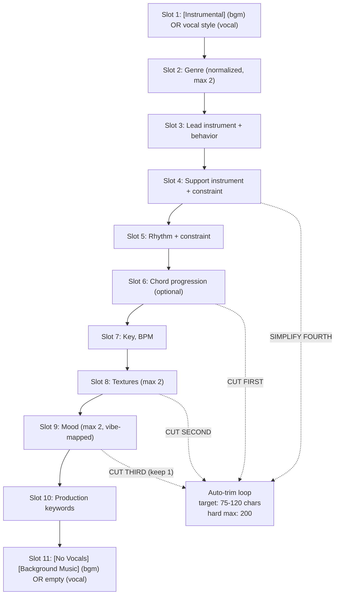
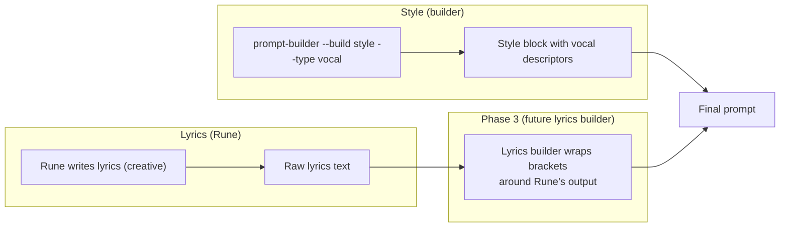

# Tech Approach: Prompt Builder Engine (v3 -- Final)

## Problem

Tala (LLM sub-agent) reads rules from brain.db and constructs Style blocks and Lyrics structural brackets manually each run. This applies to all track types -- BGM and vocal alike. This causes four compounding issues:

| Issue | Impact | Example |
|-------|--------|---------|
| **Style drift** | Same inputs produce different Style blocks across runs | Genre order flips, instrument constraints worded differently |
| **Rule forgetting** | Sub-agent skips rules under token pressure | Misses char budget, omits `clean mix separated instruments`, wrong slot order |
| **No testability** | Cannot unit test LLM output | Style block bugs only caught by tri-critic (expensive, late) |
| **Wasted tokens** | LLM re-reads and re-interprets mechanical rules every time | 11-slot formula, genre normalization, vibe map re-parsed per run |

The external repo review (`claude-ai-music-skills-review.md`) surfaced additional data gaps: no homograph detection, no artist blocklist, no BPM-dependent density rules, no syllable counting fallback for words missing from CMU dict. These are mechanical checks that belong in code, not in LLM context.

## Solution

A deterministic `prompt-builder.ts` tool that constructs Style blocks for all Suno track types (BGM and vocal) from structured input. The LLM handles creative decisions (what to build). The tool handles mechanical construction (how to format it).

The builder subsumes the conflict checks, char budget validation, and genre normalization currently performed by `validate-prompt.ts`. These become internal pipeline steps rather than a separate tool call. `validate-prompt.ts` remains as a legacy safety net during transition, then gets deprecated once the builder has proven stable in production.

A new **shared data layer** (`src/libs/prompt-data/`) provides curated data tables extracted from our existing references AND the external repo review. This data layer is consumed by the builder, the phonetics tool, and critic prompts -- not duplicated across consumers.

---

## Architecture

### System Position



### Builder Subsumes validate-prompt

The following checks move from `validate-prompt.ts` into the builder's internal pipeline:

```mermaid
flowchart TD
    subgraph "BEFORE: separate tool calls"
        A1["prompt-builder --build style"] --> A2["validate-prompt (separate call)"]
        A2 --> A3[Tri-critic]
    end

    subgraph "AFTER: integrated pipeline"
        B1["prompt-builder --build style"] --> B2["genre normalization (internal)"]
        B2 --> B3["conflict check (internal)"]
        B3 --> B3b["artist blocklist (internal)"]
        B3b --> B4["slot assembly (internal)"]
        B4 --> B5["char budget (internal)"]
        B5 --> B6["output + warnings/errors"]
        B6 --> B7[Tri-critic]
    end

    style A2 fill:#f99,stroke:#333
    style B2 fill:#9f9,stroke:#333
    style B3 fill:#9f9,stroke:#333
    style B3b fill:#9f9,stroke:#333
    style B5 fill:#9f9,stroke:#333
```



| Check | Was | Now |
|-------|-----|-----|
| Mood/genre conflicts | `validate-prompt.ts` | Builder internal step (`prompt-data/conflict-rules.ts`) |
| Char budget | `charcount` tool + `validate-prompt.ts` | Builder internal step (auto-trim loop) |
| Genre normalization | Tala manual | Builder internal step (`prompt-data/genre-normalization.ts`) |
| BPM/genre range | `validate-prompt.ts` | Builder internal step (tempo ranges in genre normalization) |
| Production conflicts | `validate-prompt.ts` | Builder internal step |
| Artist blocklist | None | Builder internal step (`prompt-data/artist-blocklist.ts`) |
| Section flow | `validate-prompt.ts` | Deferred to Phase 2 (lyrics builder) |
| Cross-prompt coherence | `validate-prompt.ts` | Stays in `validate-prompt.ts` during transition (builder only sees one prompt at a time) |

**Transition plan:** `validate-prompt.ts` stays callable as a safety net. Once the builder runs clean for 20+ tracks without validate-prompt catching anything the builder missed, deprecate it.

### Tool Shape

Dual-mode like all tools in this repo:

- **CLI**: `bun src/tools/prompt-builder.ts --build style --input out/style-input.json`
- **Registry**: exports `toolDef` with `name: "prompt_builder"`, callable via `registry.call()`
- **Tags**: `creative`, `suno`, `minimax`, `deterministic`

### File Layout

```
src/libs/prompt-data/                  # SHARED data layer (Phase 0)
  index.ts                             # barrel export
  genre-normalization.ts               # canonical genre table (~30-40 families + external 500+ cross-ref)
  vibe-map.ts                          # dangerous word translations (from craft-rules.md)
  conflict-rules.ts                    # mood/genre/production conflict matrices (from validate-prompt.ts)
  realism-tiers.ts                     # acoustic realism descriptor sets (from craft-rules.md)
  homographs.ts                        # 18 high-risk homographs (from external repo)
  artist-blocklist.ts                  # 80+ blocked artist names + sonic alternatives (from external repo)
  cliches.ts                           # merged AI-slop + ubiquitous cliche patterns
  density-rules.ts                     # BPM-dependent section density (from external repo + genre-structure.md)
  section-priority.ts                  # section importance weights (chorus=3, bridge=2, verse=1)
  syllable-heuristic.ts               # vowel-cluster syllable fallback for CMU dict gaps

src/tools/prompt-builder.ts            # CLI + toolDef (entry point)
src/libs/prompt-builder/
  index.ts                             # buildStyle() export, platform strategy dispatch
  types.ts                             # Input/output schemas (Zod + TS interfaces)
  shared.ts                            # SharedModules implementation (wraps prompt-data/)
  strategies/
    suno.ts                            # Suno slot-machine strategy
    minimax.ts                         # MiniMax prose-engine strategy (Phase 4)
```

No JSON data files. All config is TypeScript constants -- type-checked, importable, testable.

---

## Style Builder

### Input Schema

```typescript
// Validated with Zod at parse time. Schema violations produce
// actionable error messages: "genres: expected max 2 items, got 3"

const StyleInputSchema = z.object({
  platform: z.enum(["suno", "minimax"]),
  type: z.enum(["bgm", "vocal"]),       // BGM: adds [Instrumental]/[No Vocals]
                                          // Vocal: adds vocal style descriptors instead
  genres: z.array(z.string()).max(2),     // raw (will be normalized)
  instruments: z.object({
    lead: z.object({ name: z.string(), behavior: z.string() }),
    support: z.object({ name: z.string(), constraint: z.string() }).optional(),
    rhythm: z.object({ name: z.string(), constraint: z.string() }).optional(),
  }),
  vocal: z.object({                       // required when type: "vocal", ignored for bgm
    style: z.string(),                    // e.g. "breathy female vocal", "raspy baritone"
    technique: z.string().optional(),     // e.g. "falsetto", "belt", "whisper"
  }).optional(),
  key: z.string(),                        // e.g. "G Major"
  bpm: z.number().int().min(40).max(240),
  moods: z.array(z.string()).max(5).optional(),
  textures: z.array(z.string()).max(2).optional(),
  chords: z.string().optional(),          // cut first when over budget
  production: z.array(z.string()).optional(),
  realism: z.number().int().min(0).max(3).optional(),
});

type StyleInput = z.infer<typeof StyleInputSchema>;
```

**Type-driven behavior:**

| Field | `type: "bgm"` | `type: "vocal"` |
|-------|---------------|-----------------|
| Slot 1 | `[Instrumental]` | Vocal style descriptor (e.g. `breathy female vocal`) |
| Slot 11 | `[No Vocals] [Background Music]` | Omitted (no instrumental metatags) |
| `vocal` field | Ignored (warning if provided) | Required (error if missing) |
| Char budget | Same 75-120 target | Same 75-120 target |

### JSON Handoff: How Tala Produces Input

Tala writes a JSON file to `out/style-input.json` using the Write tool. The builder validates it with the Zod schema above on parse.

**On validation failure**, the builder returns a structured error with:
- Which field failed
- What was provided
- What was expected
- Example of correct format

```
ERROR: genres[0] - "lofi hip hop" contains spaces.
  Provided: "lofi hip hop"
  Expected: raw genre string (normalization handles aliases)
  Example:  "lo-fi" or "lofi" or "jazz"
  Note:     Multi-word genres are fine ("hip-hop", "city pop").
            The builder normalizes -- pass the raw name.
```

This eliminates the "Tala passes bad JSON, builder silently breaks" failure mode.

### Slot Assembly (Suno Strategy)

The Suno strategy walks the 11-slot formula from `craft-rules.md` in fixed order. Slots 1 and 11 are type-dependent:



### Processing Steps

1. **Zod validation.** Parse input against `StyleInputSchema`. On failure, return structured error with field name, provided value, expected type, and example. No generic "invalid input" messages.

2. **Genre normalization.** Map raw input through the canonical table in `prompt-data/genre-normalization.ts`. `"lofi hip hop"` becomes `"lo-fi"`. `"jazzhop"` becomes `"lo-fi (jazz-colored)"`. Cultural labels rejected with error and suggestion (`"Japanese folk"` -> error, suggest `"jazz shamisen fusion"`). **Unknown genres pass through with an info-level warning.** The table covers ~30-40 known families plus supplementary coverage from the external 500+ genre list cross-reference. Tala handles edge cases -- the builder does not try to be exhaustive.

3. **BPM range check.** If the genre has a known tempo range (e.g. lo-fi: 70-95), validate that the provided BPM falls within it. Out of range emits a warning, not an error -- Tala may be intentionally breaking convention.

4. **Conflict check.** Run the input against the conflict matrix in `prompt-data/conflict-rules.ts` (extracted from current `validate-prompt.ts` + supplemented). Mood/genre conflicts (e.g. "aggressive" + "ambient"), production conflicts (e.g. "distorted" + "clean mix"), instrument/genre mismatches. Conflicts produce warnings with explanation.

5. **Artist blocklist check.** Scan `moods`, `textures`, and `production` fields for artist names in `prompt-data/artist-blocklist.ts`. If found, emit a warning with the sonic alternative suggestion for the given genre. Warning only -- does not block generation.

6. **Instrument formatting.** Lead gets `name + behavior` (e.g. `shamisen melodic plucks`). Support gets `name + constraint` with explicit register and role (e.g. `harp low-register pad chords, no melody`). Rhythm gets `name + constraint` (e.g. `brushed drums sparse`). Texture and groove words in instrument slots are flagged as slot bleed.

7. **Vibe mapping.** Each mood word is checked against the dangerous words table in `prompt-data/vibe-map.ts`. Matched words are translated to their Style-safe equivalent. `"lazy"` becomes `"laid-back"`. `"dark"` becomes `"moody, shadowed"`. Unmatched words pass through.

8. **Type-dependent elements.**
   - `clean mix, separated instruments` is always appended to slot 10 (both types).
   - **BGM** (`type: "bgm"`): `[Instrumental]` at slot 1, `[No Vocals] [Background Music]` at slot 11.
   - **Vocal** (`type: "vocal"`): Vocal style descriptor at slot 1 (e.g. `breathy female vocal`), vocal technique appended if provided (e.g. `breathy female vocal, falsetto`). Slot 11 is empty -- no instrumental metatags.

9. **Slot assembly.** Concatenate slots in order, comma-separated. Suno strategy uses the 11-slot formula. MiniMax strategy (Phase 4) uses descriptive prose.

10. **Char budget enforcement.** After assembly, measure total chars. If over 120: cut slot 6 (chords). Still over: cut slot 8 (textures). Still over: reduce slot 9 to 1 mood. Still over: simplify slot 4 (shorter constraint). If over 200: error, cannot auto-trim further.

11. **Realism tiers.** If `realism > 0` and genre family is acoustic (folk, jazz, blues, classical, singer-songwriter): inject tier-appropriate descriptors into slots 8 and 10. Tier 1: `close mic, natural dynamics`. Tier 2: adds `breath detail, short room reverb`. Tier 3: adds `fret squeak, tape saturation, one-take`.

### Vocal-First Ordering Note (Test Hypothesis)

The external repo recommends describing vocals BEFORE instrumentation in Style. Our slot 1 for vocal tracks already achieves vocal-first ordering. Their sentence/period separator format is worth testing -- Suno V5 may interpret periods differently than commas. This is a micro-optimization, not an architectural change.

**Action:** Do not adopt. File under "test during Session 2 integration tests." If period separators produce measurably better output across 5+ vocal tracks, refactor `suno.ts` strategy to use periods between major groups. Track via `reflect.ts`.

### Output Schema

```typescript
interface StyleOutput {
  text: string;              // ready-to-paste Style block
  charCount: number;         // exact character count
  elementCount: number;      // comma-separated element count
  slotMap: Record<number, string>; // which text went into which slot (Suno only)
  trimmed: string[];         // slots that were cut during auto-trim
  warnings: string[];        // non-fatal: vibe translations, BPM range, conflict flags, artist blocklist hits
  errors: string[];          // fatal: schema violation, char hard max exceeded
}
```

### CLI Examples

**BGM track:**

```bash
bun src/tools/prompt-builder.ts --build style \
  --platform suno \
  --type bgm \
  --genres "lo-fi, jazz" \
  --lead "shamisen" --lead-behavior "melodic plucks" \
  --support "harp" --support-constraint "low-register pad chords, no melody" \
  --rhythm "brushed drums" --rhythm-constraint "sparse" \
  --key "G Major" --bpm 88 \
  --moods "warm, lazy" \
  --textures "vinyl crackle"
```

Output:

```
[Instrumental] lo-fi (jazz-colored), shamisen melodic plucks, harp low-register pad chords no melody, brushed drums sparse, G Major, 88 BPM, vinyl crackle, warm, laid-back, clean mix, separated instruments [No Vocals] [Background Music]

--- Validation ---
Chars: 118 (target: 75-120)  OK
Elements: 8 (target: 3-7)  WARNING: at upper bound
Trimmed: none
Conflicts: none
Warnings:
  - Mood "lazy" translated to "laid-back" (dangerous vibe word)
Errors: none
```

**Vocal track:**

```bash
bun src/tools/prompt-builder.ts --build style \
  --platform suno \
  --type vocal \
  --genres "r-and-b, soul" \
  --vocal-style "breathy female vocal" \
  --vocal-technique "falsetto" \
  --lead "electric piano" --lead-behavior "Rhodes chords, warm attack" \
  --support "upright bass" --support-constraint "low-register walking lines" \
  --rhythm "brushed snare" --rhythm-constraint "laid-back groove" \
  --key "Eb Major" --bpm 72 \
  --moods "intimate, warm"
```

Output:

```
breathy female vocal, falsetto, r&b (soul-inflected), electric piano Rhodes chords warm attack, upright bass low-register walking lines, brushed snare laid-back groove, Eb Major, 72 BPM, intimate, warm, clean mix, separated instruments

--- Validation ---
Chars: 112 (target: 75-120)  OK
Elements: 8 (target: 3-7)  WARNING: at upper bound
Trimmed: none
Conflicts: none
Warnings: none
Errors: none
```

Note the differences: no `[Instrumental]` at start, no `[No Vocals] [Background Music]` at end. Vocal style descriptor occupies slot 1 instead.

---

## Lyrics Builder (Phase 2-3, Design Only)

The lyrics builder handles structural bracket construction -- NOT lyric content. For vocal tracks, Rune writes the words. The builder wraps them in platform-correct brackets. For BGM tracks, the builder generates the full bracket scaffold (no words needed).

### BGM Lyrics Builder (Phase 2)

Section templates with BPM-dependent density rules. The builder generates complete Lyrics blocks for instrumental tracks: section tags, energy arc, instrument brackets, texture brackets.

**BPM-dependent density rules** (from external repo, validated against genre-structure.md):

| Genre Family | BPM < 100 | BPM 100-120 | BPM > 120 |
|-------------|-----------|-------------|-----------|
| lo-fi | 4-6 sections, long sustains | 5-6 sections, standard | N/A (genre ceiling ~95) |
| jazz | 5-7 sections, rubato feel | 5-7 sections, swing | 6-8 sections, bebop density |
| pop | 5-6 sections, ballad pacing | 5-7 sections, standard | 6-8 sections, dance-pop density |
| rock | 4-6 sections, doom/sludge | 5-7 sections, standard | 6-8 sections, punk density |
| electronic | 4-5 sections, ambient | 5-7 sections, house | 6-8 sections, DnB density |
| hip-hop | 5-6 sections, boom bap | 5-7 sections, standard | 6-8 sections, drill density |

These rules inform section count and energy distribution. Stored in `prompt-data/density-rules.ts`.

**Section tag enum:** Closed set of known-reliable Suno tags. The builder rejects unknown tags with a warning. This prevents the "creative section name that Suno ignores" failure mode.

```typescript
const RELIABLE_SECTIONS = [
  "Short Instrumental Intro", "Short Fade In",
  "Verse", "Verse 2", "Chorus", "Hook",
  "Catchy Hook", "Pre-Chorus", "Bridge", "melodic interlude",
  "Build", "Drop", "Breakdown", "Solo", "Big Finish",
  "Final Chorus", "Outro", "Short Instrumental Outro", "End"
] as const;
```

### Vocal Lyrics Builder (Phase 3)

Bracket scaffolding around Rune's output. Rune remains the creative author -- she writes the words, meter, rhyme, and meaning. The lyrics builder automates the mechanical wrapping:

- Section tag insertion (matching Rune's section markers to the closed enum)
- Pipe-stacked bracket formatting for instrument/vocal technique shifts
- Energy/Mood/Texture brackets per section based on the Style builder's analysis
- Voice description headers per section (if vocal character changes)
- Energy arc validation (section order matches the intended dynamic flow)

This replaces the manual bracket wrapping Tala does today after receiving Rune's output.

### Section Priority Weighting

Extracted from external repo. Used by the lyrics builder to allocate quality budget and by critic prompts to weight evaluation:

```typescript
export const SECTION_PRIORITY: Record<string, number> = {
  chorus: 3,
  hook: 3,
  bridge: 2,
  "pre-chorus": 2,
  verse: 1,
  intro: 1,
  outro: 1,
  interlude: 1,
};
```

Higher priority sections get more bracket detail (more energy/mood/texture tags) and stricter critic scrutiny.

---

## Platform Strategy

### Suno: Slot Machine (11-Slot Formula)

Suno is a fixed-order comma-separated tag system. The builder walks 11 slots in priority order. Char budget is tight (75-120 target, 200 hard max). Front-loading matters: first tag gets ~60% influence, second ~25%, third ~10%.

The 11-slot formula, cut order, front-load rules, and validation gate are defined in `craft-rules.md` and codified in `strategies/suno.ts`.

### MiniMax: Prose Engine (Phase 4)

MiniMax uses descriptive prose paragraphs, not comma-separated tags. Vocal-forward formatting (voice description first). Looser char budget (100-200 target, 300 hard max). No mandatory "clean mix" tag. Different instrument formatting (descriptive sentences, not constraint clauses).

### Strategy Pattern, Not Shared Slot Array

Suno and MiniMax are fundamentally different engines. A shared `SlotDef[]` array does not fit both. The strategy pattern lets each platform implement `assembleStyle()` in its native idiom while sharing the normalization, vibe mapping, and conflict-checking modules.

```typescript
interface BuildStrategy {
  name: "suno" | "minimax";

  // Style construction
  charTarget: [number, number];       // [min, max] target range
  charHardMax: number;                // absolute maximum
  maxGenres: number;
  maxInstruments: number;
  maxMoods: number;
  mandatoryTags: string[];            // always appended (e.g. "clean mix, separated instruments")
  bgmTags: { start: string; end: string[] };
  vocalTags: { style: string[] };     // vocal style descriptors

  // The core build method -- each platform implements differently
  assembleStyle(input: StyleInput, shared: SharedModules): StyleOutput;
}
```

### 10-Field Config

Ten config fields on `BuildStrategy`. The `assembleStyle` method is where the platform divergence lives. The `bgmTags` and `vocalTags` fields control the type-specific elements injected at assembly time.

### Shared Modules

Genre normalization, vibe mapping, and conflict checking are platform-agnostic. They live in `prompt-data/` and are passed to strategies via a `SharedModules` object:

```typescript
interface SharedModules {
  normalizeGenre(raw: string): { canonical: string; family: string } | null;
  mapVibe(mood: string): { safe: string; warning?: string };
  checkConflicts(input: StyleInput): ConflictResult[];
  checkArtistBlocklist(fields: string[]): BlocklistWarning[];
  getTempoRange(genre: string): { min: number; max: number } | null;
  getRealismDescriptors(tier: 0 | 1 | 2 | 3): string[];
}
```

### Pipeline (Both Platforms)

Every `buildStyle()` call runs through the same logical pipeline regardless of platform. The strategy only controls step 5 (assembly format):

```
1. Validate input    (Zod parse, reject malformed JSON with actionable errors)
2. Normalize         (genre normalization, vibe mapping -- shared modules)
3. Check conflicts   (mood/genre/production conflict matrix -- shared modules)
4. Check blocklist   (artist name scan -- shared modules, warning only)
5. Assemble          (platform-specific: Suno slots vs MiniMax prose)
6. Enforce budget    (char count, auto-trim -- strategy-specific trim order)
7. Emit output       (text + diagnostics + warnings + errors)
```

If step 1 fails, the error message tells Tala exactly which field is wrong and what format is expected. No generic "invalid input" messages.

---

## Data Extractions

All shared data lives in `src/libs/prompt-data/`. These are TypeScript constants -- type-checked, importable, testable. No JSON files.

### Genre Normalization Table (`genre-normalization.ts`)

**Source:** `craft-rules.md` (30-40 families) + external repo 500+ genre list cross-reference.

Our canonical table maps raw user input to `{ canonical, family }` pairs:

```typescript
interface GenreEntry {
  canonical: string;
  family: string;
  aliases: string[];
  tempoRange?: { min: number; max: number };
}

// ~30-40 families from craft-rules.md
// + supplementary aliases from external 500+ list
export const GENRE_TABLE: Map<string, GenreEntry> = new Map([
  ["lo-fi", { canonical: "lo-fi", family: "lo-fi", aliases: ["lofi", "lo-fi hip-hop", "lofi hip hop", "study beats"] }],
  ["lo-fi (jazz-colored)", { canonical: "lo-fi (jazz-colored)", family: "lo-fi", aliases: ["jazzhop", "jazz hop", "lo-fi jazz"] }],
  ["lo-fi (chillhop)", { canonical: "lo-fi (chillhop)", family: "lo-fi", aliases: ["chillhop", "chill hop"] }],
  ["hip-hop", { canonical: "hip-hop", family: "hip-hop", aliases: ["boom bap", "boom-bap"] }],
  // ... ~35 more families
]);

// Cultural label rejection table
export const CULTURAL_LABELS: Map<string, string> = new Map([
  ["japanese folk", "jazz shamisen fusion"],
  ["celtic folk", "folk bodhran fusion"],
  ["african percussion", "jazz djembe fusion"],
  ["middle eastern", "ambient oud fusion"],
  ["indian classical", "lo-fi sitar fusion"],
]);
```

The external 500+ genre list supplements our table with additional aliases and subgenre names that Suno recognizes. We do NOT add 500 new canonical entries -- we cross-reference to discover aliases we missed and assign them to existing families.

**Unknown genre behavior:** Pass through with info-level warning. The table does not try to be exhaustive. Tala handles edge cases.

### Homograph Database (`homographs.ts`)

**Source:** External repo (18 high-risk entries). We have no equivalent today -- this is a new data file.

```typescript
interface Homograph {
  word: string;
  pronunciations: { ipa: string; meaning: string; example: string }[];
  risk: "high" | "medium";
}

export const HOMOGRAPHS: Homograph[] = [
  {
    word: "live",
    pronunciations: [
      { ipa: "/l\u026Av/", meaning: "to exist", example: "I live here" },
      { ipa: "/la\u026Av/", meaning: "in person", example: "live performance" },
    ],
    risk: "high",
  },
  {
    word: "read",
    pronunciations: [
      { ipa: "/ri\u02D0d/", meaning: "present tense", example: "I read books" },
      { ipa: "/r\u025Bd/", meaning: "past tense", example: "I read it yesterday" },
    ],
    risk: "high",
  },
  {
    word: "lead",
    pronunciations: [
      { ipa: "/li\u02D0d/", meaning: "to guide", example: "lead the way" },
      { ipa: "/l\u025Bd/", meaning: "metal", example: "lead pipe" },
    ],
    risk: "high",
  },
  // + wind, bass, tear, close, minute, bow, dove, wound, desert,
  //   object, present, record, refuse, contest, conduct, content
];
```

**Integration (Phase 5):** New `checkHomographs(lyrics: string): HomographWarning[]` function in `phonetics.ts`. Returns warnings when a homograph appears without surrounding context that disambiguates pronunciation. Also used by the lyrics builder (Phases 2-3) as a pre-generation check.

### Artist Blocklist (`artist-blocklist.ts`)

**Source:** External repo (80+ entries with sonic alternatives per genre). We have no equivalent today.

```typescript
interface BlockedArtist {
  name: string;
  reason: string;
  alternatives: Record<string, string>; // genre -> sonic description
}

export const BLOCKED_ARTISTS: BlockedArtist[] = [
  {
    name: "Drake",
    reason: "Suno ignores or produces generic output",
    alternatives: {
      "hip-hop": "moody male vocal, atmospheric trap production",
      "r&b": "introspective male vocal, minimalist beat",
    },
  },
  // ... 79+ more
];
```

**Integration (Phase 1):** Builder checks `moods`, `textures`, and `production` fields for artist names. If found, emits warning with sonic alternative for the given genre. Warning only -- does not block generation.

### Cliche/AI-Slop Merge List (`cliches.ts`)

**Source:** Our `ai-slop-patterns.md` (AI-specific patterns) + external repo 75 ubiquitous cliches.

Our existing file uses a three-column format: Pattern | Why it's slop | Better direction. The external list focuses on ubiquity (overused in real songs), ours focuses on AI-specificity (phrases LLMs default to). Complementary sets.

```typescript
interface ClicheEntry {
  pattern: string;
  source: "ai-slop" | "ubiquitous" | "both";
  whyBad: string;
  betterDirection: string;
  genreExceptions?: string[];  // genres where this pattern is acceptable
}

export const CLICHES: ClicheEntry[] = [
  // ... merged from both sources, de-duplicated
];
```

**Integration:** Used by critic prompts (lyrics-structural.md, lyrics-intentionality.md) and eventually by the lyrics builder (Phases 2-3) for pre-generation cliche scanning.

### BPM-Dependent Density Rules (`density-rules.ts`)

**Source:** External repo per-genre BPM-to-line-count tables + our `genre-structure.md`.

```typescript
interface DensityRule {
  genreFamily: string;
  bpmRanges: {
    range: [number, number];
    linesPerVerse: [number, number];
    sectionsPerTrack: [number, number];
    notes: string;
  }[];
}

export const DENSITY_RULES: DensityRule[] = [
  {
    genreFamily: "pop",
    bpmRanges: [
      { range: [60, 99], linesPerVerse: [5, 6], sectionsPerTrack: [5, 6], notes: "ballad pacing" },
      { range: [100, 120], linesPerVerse: [4, 5], sectionsPerTrack: [5, 7], notes: "standard pop" },
      { range: [121, 160], linesPerVerse: [3, 4], sectionsPerTrack: [6, 8], notes: "dance-pop density" },
    ],
  },
  // ... one entry per genre family
];
```

**Risk:** Medium. These rules need validation against Suno V5.5 behavior. Extract as advisory, test before codifying as hard constraints. Stored in prompt-data but flagged as `advisory: true` until validated.

### Vibe Map (`vibe-map.ts`)

**Source:** `craft-rules.md` lines 74-87.

```typescript
interface VibeTranslation {
  dangerous: string;
  problem: string;
  styleReplacement: string;
  lyricsReplacement: string;
}

export const VIBE_MAP: Map<string, VibeTranslation> = new Map([
  ["lazy", { dangerous: "lazy", problem: "Aimless meandering", styleReplacement: "laid-back", lyricsReplacement: "unhurried, gentle" }],
  ["cold", { dangerous: "cold", problem: "Over-dampens all instruments", styleReplacement: "cool, crisp", lyricsReplacement: "still, quiet" }],
  ["muted", { dangerous: "muted", problem: "Compresses frequency range", styleReplacement: "soft, restrained", lyricsReplacement: "subdued, hushed" }],
  ["distant", { dangerous: "distant", problem: "Pushes instruments too far back", styleReplacement: "spacious", lyricsReplacement: "far-off, fading" }],
  ["dark", { dangerous: "dark", problem: "Suno reads as minor key + heavy", styleReplacement: "moody, shadowed", lyricsReplacement: "dimly-lit, late-night" }],
  ["floating", { dangerous: "floating", problem: "No positional info for instruments", styleReplacement: "sustained, legato", lyricsReplacement: "drifting, weightless" }],
  ["dreamy", { dangerous: "dreamy", problem: "Adds too much reverb/wash", styleReplacement: "ethereal, soft-focus", lyricsReplacement: "hazy, half-remembered" }],
  ["raw", { dangerous: "raw", problem: "Can trigger distortion/grit", styleReplacement: "organic, unpolished", lyricsReplacement: "honest, stripped" }],
]);
```

Words not in the map pass through unchanged ("warm", "bright", "driving" are already production language).

### Syllable Fallback Heuristic (`syllable-heuristic.ts`)

**Source:** External repo syllable counting algorithm. Our `phonetics.ts` uses CMU Pronouncing Dictionary lookup but returns null for words not in the dictionary. This heuristic fills the gap.

```typescript
/**
 * Vowel-cluster syllable count heuristic.
 * Fallback for words not in CMU dict.
 * Mark results as approximate in reports.
 */
export function heuristicSyllableCount(word: string): number {
  const clean = word.toLowerCase().replace(/[^a-z]/g, "");
  if (clean.length === 0) return 0;
  // Count vowel clusters
  const vowelGroups = clean.match(/[aeiouy]+/g) || [];
  let count = vowelGroups.length;
  // Silent 'e' at end
  if (clean.endsWith("e") && count > 1) count--;
  // Consonant + 'le' at end (e.g. "table", "little")
  if (clean.match(/[^aeiouy]le$/)) count++;
  return Math.max(1, count);
}
```

**Integration (Phase 5):** In `phonetics.ts`, when `lookupPhonemes()` returns null, call `heuristicSyllableCount()`. Mark heuristic-counted words in the report with `(approx)` so the user knows the count is estimated.

---

## Integration

### How the Builder Fits /create-track Workflow

```mermaid
flowchart TD
    subgraph "CURRENT (LLM-driven)"
        A1[P3-002: Tala reads craft-rules] --> A2[Tala builds Style from scratch]
        A2 --> A3[charcount tool validates]
        A3 --> A4[validate-prompt checks]
        A4 --> A5[Tri-critic reviews]
    end

    subgraph "NEW (builder-driven)"
        B1["P1: Tala produces StyleInput JSON"] --> B2["Zod validates JSON"]
        B2 --> B3["prompt-builder --build style<br/>(normalize + conflict + blocklist + assemble + trim)"]
        B3 --> B4["Tala reviews + optional override"]
        B4 --> B5[Tri-critic reviews]
    end

    style A1 fill:#f9f,stroke:#333
    style B1 fill:#9f9,stroke:#333
```



### What Changes in the Workflow

| Phase | Before | After |
|-------|--------|-------|
| P1 (Analysis) | Unchanged | Unchanged -- LLM still decides what to build |
| P3-002 (Style) | Tala writes Style manually | Tala writes `StyleInput` JSON, calls `prompt-builder --build style` |
| P3-003 (Charcount) | Separate `charcount` tool call | Subsumed -- builder measures and enforces char budget internally |
| P3-007 (Validate) | `validate-prompt` runs | Subsumed -- conflict checks, genre validation, BPM range, artist blocklist all internal to builder. `validate-prompt.ts` stays as safety net during transition. |
| P3-007b (Tri-critic) | Still runs | Still runs on final output |

### Tala's Role (Creative Decisions Only)

The builder is a floor, not a ceiling. Tala retains full override authority on builder output. The builder produces a mechanically correct starting point. Tala can modify any part of it before passing to tri-critic.

Tala's responsibilities:
- Genre choice, instrument selection, mood interpretation (creative judgment)
- Producing the `StyleInput` JSON (structured creative decisions)
- Reviewing builder output against creative intent
- Overriding any slot if the mechanical output does not match the artistic vision
- Music card interpretation, fusion strategy

**Override tracking:** `reflect.ts` post-task reflections log when Tala overrides builder output. If Tala rewrites >50% of slots across 10+ tracks, that signals the builder's configs need iteration -- not that the builder should be removed.

### Rune's Role (Vocal Lyrics)

For vocal tracks, the builder and Rune have distinct responsibilities:



| Component | Responsible | Phase |
|-----------|------------|-------|
| Style block (vocal descriptors, genre, instruments, production) | Builder | Phase 1 (committed) |
| Lyrics content (words, meter, rhyme, meaning) | Rune (LLM) | Already exists |
| Bracket scaffolding around Rune's lyrics (section tags, pipe stacking) | Lyrics builder | Phase 3 (future) |

In Phase 1, the builder handles Style for vocal tracks. Rune writes lyrics independently. Tala manually wraps brackets around Rune's output as she does today. Phase 3 automates that bracket wrapping.

### validate-prompt.ts Migration Path

1. **Phase 0-1 (now):** `validate-prompt.ts` stays callable. Builder runs in parallel. Compare outputs.
2. **Stabilization (20+ tracks):** If builder catches everything validate-prompt catches (minus cross-prompt coherence), stop calling validate-prompt.
3. **Deprecation:** Remove validate-prompt from the workflow docs. Keep the file as archived reference for conflict matrix data.
4. **Cross-prompt coherence** (Style + Lyrics together) moves to the lyrics builder (Phase 2-3) or stays as a standalone light check.

### Tri-Critic Still Validates Final Output

The tri-critic (Gemini + MiniMax + Grok) remains the final quality gate. The builder handles mechanical correctness. The critics handle musical and creative quality. These are complementary, not redundant.

**Verse-chorus echo detection** (from external repo QC point 12) is added to the `lyrics-structural.md` critic prompt:

```
## Verse-Chorus Echo
Flag when verse lines duplicate or closely mirror chorus phrasing.
Acceptable: thematic callback (same concept, different words).
Unacceptable: literal repetition of chorus lines in verses, or
verses that paraphrase the chorus with minor word swaps.
```

---

## What Stays LLM-Only

The builder does not replace creative judgment. These remain exclusively LLM territory:

| Capability | Why It Stays LLM |
|-----------|-----------------|
| Genre choice | User intent interpretation, vibe-to-genre mapping |
| Instrument selection | Creative matching, frequency register awareness |
| Mood interpretation | Ambiguous user language to concrete descriptors |
| Emotional arc design | Narrative judgment, section energy flow |
| Vocal style choice | Matching voice character to genre and mood |
| Vocal lyrics writing (Rune) | Creative writing, meter, rhyme, meaning |
| Music card interpretation | Extracting relevant constraints from reference cards |
| Critic evaluation | Subjective quality assessment, reconciliation |
| Vibe translation (ambiguous) | When user says "something that sounds like Sunday morning" |
| Fusion strategy | Deciding which tradition maps to which role |

The builder handles the **mechanical** side: slot ordering, char budgets, genre normalization, vibe word safety, conflict detection, artist blocklist, auto-trimming, and Zod-validated input.

---

## Phases

### Phase 0: Shared Data Extraction (1 session, ~2-3 hours)

**Pre-work before the builder.** Extract all shared data tables into `src/libs/prompt-data/`. This data layer is consumed by the builder, phonetics tool, and critic prompts.

| Task | Output File | Source | Priority |
|------|-------------|--------|----------|
| Extract genre normalization table (~30-40 families) | `prompt-data/genre-normalization.ts` | `craft-rules.md` + external 500+ cross-ref | CRITICAL |
| Extract vibe map (dangerous words) | `prompt-data/vibe-map.ts` | `craft-rules.md` lines 74-87 | CRITICAL |
| Extract conflict matrices | `prompt-data/conflict-rules.ts` | `validate-prompt.ts` lines 19-76 | CRITICAL |
| Extract realism tier descriptors | `prompt-data/realism-tiers.ts` | `craft-rules.md` lines 196-204 | HIGH |
| Extract 18 homographs | `prompt-data/homographs.ts` | External repo review | HIGH |
| Extract 80+ artist blocklist | `prompt-data/artist-blocklist.ts` | External repo review | HIGH |
| Merge cliches (AI-slop + 75 ubiquitous) | `prompt-data/cliches.ts` | `ai-slop-patterns.md` + external repo | MEDIUM |
| Extract BPM-dependent density rules | `prompt-data/density-rules.ts` | External repo + `genre-structure.md` | MEDIUM |
| Extract section priority weighting | `prompt-data/section-priority.ts` | External repo review | MEDIUM |
| Extract syllable fallback heuristic | `prompt-data/syllable-heuristic.ts` | External repo review | MEDIUM |
| Barrel export | `prompt-data/index.ts` | -- | CRITICAL |

**Genre normalization cross-reference process:**
1. Load our ~30-40 families from `craft-rules.md`
2. Load external 500+ genre list
3. For each external genre: does it map to an existing family? If yes, add as alias. If no, skip (we do not add new canonical families from external data without validation).
4. Result: same ~30-40 families, but with more aliases per family.

**Acceptance criteria:**
- All files compile with `tsc --noEmit`
- Genre table covers all entries in `craft-rules.md` + discovered aliases from external cross-ref
- Conflict matrix matches current `validate-prompt.ts` coverage
- Homograph table has all 18 entries with pronunciations and examples
- Artist blocklist has 80+ entries with at least one genre alternative each
- Cliche list is de-duplicated (no entry appears in both `ai-slop` and `ubiquitous` without being tagged `both`)
- All files export typed constants (no `any`, no untyped arrays)

### Phase 1: Suno Style Builder (3 sessions, ~7-10 hours) -- COMMITTED

**Depends on Phase 0 completion.** The builder imports from `prompt-data/` -- it does not duplicate data.

#### Session 1: Types + Shared Modules (~2-3 hours)

| Task | Output File |
|------|-------------|
| Define `StyleInput`, `StyleOutput`, `BuildStrategy`, `SharedModules` types + Zod schemas | `src/libs/prompt-builder/types.ts` |
| Implement shared modules wrapping prompt-data (normalize, vibeMap, conflicts, blocklist, tempoRange, realism) | `src/libs/prompt-builder/shared.ts` |

**Acceptance criteria:**
- All types compile with `tsc --noEmit`
- Zod schemas reject bad input with field-specific error messages
- `type: "vocal"` with missing `vocal` field produces actionable error
- Shared modules correctly wrap all prompt-data exports

#### Session 2: Suno Strategy + Tests (~3-4 hours)

| Task | Output File |
|------|-------------|
| Implement Suno strategy (11-slot assembly, trim loop, mandatory tags, type-dependent slots) | `src/libs/prompt-builder/strategies/suno.ts` |
| Implement `buildStyle()` pipeline (validate -> normalize -> conflict -> blocklist -> assemble -> trim) | `src/libs/prompt-builder/index.ts` |
| Unit tests: slot assembly, normalization, vibe mapping, trim order, conflicts, determinism, BGM vs vocal | `src/libs/prompt-builder/__tests__/` |

**Key test: determinism proof.** Take 5 known-good tracks from `vault/studio/tracks/`, extract their inputs as JSON, run through builder 100 times, assert zero diff.

**Key test: conflict detection.** Port the conflict test cases from `validate-prompt.ts`. Builder must catch everything validate-prompt catches (except cross-prompt coherence).

**Key test: type divergence.** Same genre/instrument/mood input with `type: "bgm"` vs `type: "vocal"` produces correct slot 1/11 differences.

**Vocal-first ordering test:** Build 5 vocal tracks with period separators vs comma separators. Compare readability and note for future Suno A/B testing.

**Acceptance criteria:**
- `bun test src/libs/prompt-builder/` passes
- Builder output for 5 known-good tracks matches expected Style blocks (or is demonstrably better)
- Same input always produces same output (determinism)
- Conflict checks catch all cases from validate-prompt.ts
- Both BGM and vocal outputs are correct

#### Session 3: CLI + Workflow Integration (~2-3 hours)

| Task | Output File |
|------|-------------|
| Implement CLI entry point + `toolDef` | `src/tools/prompt-builder.ts` |
| Add to tool registry | `src/registry/` |
| Update `/create-track` workflow doc (P3-002, P3-003, P3-007 changes) | Workflow doc |
| Integration tests: JSON in -> Style out -> valid for tri-critic | `src/tools/prompt-builder.test.ts` |
| Update Tala agent file with builder instructions | `.claude/agents/suno.md` |

**Acceptance criteria:**
- `bun src/tools/prompt-builder.ts --build style --input out/style-input.json` works end-to-end
- Tala can write JSON -> call builder -> review output -> proceed to tri-critic
- Integration test: builder output passes validate-prompt with no errors (proving subsumption)

### Phase 2: BGM Lyrics Builder (Future)

Structural brackets only -- section templates by genre, energy arc mapping, instrument arrangement defaults, bracket formatting (pipe vs stack). No lyrics content (BGM has no words). BPM-dependent density rules from `prompt-data/density-rules.ts` control section count and energy distribution. Section priority weighting from `prompt-data/section-priority.ts` allocates bracket detail.

### Phase 3: Vocal Lyrics Builder (Future)

Bracket scaffolding around Rune's lyrics. Rune writes the words; the builder wraps them in section tags, pipe-stacked brackets, and voice description headers. Section tag matching against the closed enum. Energy arc validation.

### Phase 4: MiniMax Strategy (Future)

MiniMax prose-engine strategy. Different formatting, different constraints, potentially different input schema extensions. The `BuildStrategy` interface is already defined to support this.

### Phase 5: Phonetics Integration (Future)

- Syllable fallback heuristic integrated into `phonetics.ts` (data extracted in Phase 0)
- Homograph detection as new LY6 check in `phonetics.ts` (data extracted in Phase 0)
- Filler word detection using stopwords list (future data extraction)
- Rhyme scheme analysis via CMU dict phoneme tails (algorithmic, not data)

---

## Testing Strategy

### Unit Tests

Every deterministic operation gets a unit test. The builder's primary value proposition IS determinism -- same input, same output, every time.

| Test Suite | What It Covers | Example Assertions |
|-----------|----------------|-------------------|
| **Slot assembly** | Each of 11 slots emits correct text | Slot 2 for `["lo-fi", "jazz"]` outputs `lo-fi (jazz-colored)` |
| **Genre normalization** | Raw input -> canonical | `"lofi hip hop"` -> `"lo-fi"`, `"boom-bap"` -> `"hip-hop"` |
| **Unknown genre passthrough** | Unmapped genres pass with warning | `"vapor-trap"` -> `"vapor-trap"` + info warning |
| **Cultural label rejection** | Flagged as error | `"Japanese folk"` -> error with suggestion |
| **Vibe mapping** | Dangerous words translated | `"lazy"` -> `"laid-back"`, `"dark"` -> `"moody, shadowed"` |
| **Conflict detection** | Mood/genre/production conflicts caught | `"aggressive"` + `"ambient"` -> warning |
| **Artist blocklist** | Names in text fields detected | `"Drake"` in moods -> warning with alternatives |
| **BPM range** | Genre tempo validation | `"lo-fi"` + `150 BPM` -> warning |
| **Char budget** | Target range enforcement | 75-120 for Suno, auto-trim fires at 121+ |
| **Auto-trim order** | Correct slots cut in order | Chords first, then textures, then mood, then support |
| **Hard max rejection** | Error at 200+ chars | Trimmed but still 201 chars -> error |
| **Mandatory tags** | Always present | `"clean mix"` and `"separated instruments"` in every Suno Style |
| **BGM metatags** | Correct placement for bgm type | `[Instrumental]` at start, `[No Vocals]` at end |
| **Vocal slot 1** | Vocal style descriptor at slot 1 for vocal type | `"breathy female vocal"` at start, no `[Instrumental]` |
| **Vocal slot 11** | No instrumental metatags for vocal type | Slot 11 empty, no `[No Vocals]`, no `[Background Music]` |
| **Vocal field validation** | `type: "vocal"` requires `vocal` field | Missing `vocal` -> actionable error |
| **Zod validation** | Bad input -> actionable error | Missing `genres` -> error with field name and expected type |
| **Determinism proof** | Same input -> same output | Run 100 times, diff output, zero changes |
| **Homograph data** | Table integrity | All 18 entries have 2+ pronunciations |
| **Cliche dedup** | No duplicates across sources | `ai-slop` and `ubiquitous` entries do not overlap without `both` tag |

### Integration Tests

| Test | What It Proves |
|------|---------------|
| **Builder catches what validate-prompt catches** | Conflict matrix parity -- same inputs that fail validate-prompt also produce warnings from builder |
| **Known-good track roundtrip** | Extract input from 5 real tracks, run through builder, output matches or improves on original |
| **Full pipeline** | JSON file -> CLI -> Style text -> parseable, within char budget, no errors |
| **BGM vs vocal same input** | Same genres/instruments/moods with different `type` produce correct structural differences |
| **Data layer imports** | All prompt-data/ modules importable and correctly typed |

### Test Runner

```bash
bun test src/libs/prompt-data/     # data layer tests (Phase 0)
bun test src/libs/prompt-builder/  # builder unit tests (Phase 1)
bun test src/tools/prompt-builder.test.ts  # CLI integration tests (Phase 1)
```

---

## Contingency

The builder is a floor, not a ceiling. Three safety nets:

1. **Tala review.** Tala sees the builder output before it goes to tri-critic. If the output does not match creative intent, Tala modifies it. The builder is advisory to Tala, not authoritative.

2. **Tri-critic.** Three independent LLM critics evaluate the final output. This is the last gate before the user sees anything.

3. **validate-prompt (transitional).** During the transition period, `validate-prompt.ts` can still be called as a secondary check. Once the builder has run clean for 20+ tracks, this safety net is removed.

**Override tracking:** `reflect.ts` logs every time Tala overrides builder output. Metrics to watch:

| Metric | Threshold | Action |
|--------|-----------|--------|
| Override rate | >50% of slots across 10+ tracks | Builder configs need iteration |
| Conflict false positives | >3 per session | Conflict matrix is too aggressive, loosen rules |
| Genre passthrough rate | >30% of inputs | Genre table needs expansion |
| Trim frequency | >80% of builds | Tala is consistently over-specifying, adjust input guidance |
| Artist blocklist false positives | >5 per session | Blocklist matching is too broad, tighten name matching |

**What if the data extractions are wrong?**
- Genre normalization and vibe map are extracted from our own authoritative references. Low risk.
- Homographs, artist blocklist, density rules are from the external repo. Medium risk -- these are advisory (warnings, not errors) and can be corrected without code changes (just update the TypeScript constants).
- BPM-dependent density rules are flagged as advisory until validated against 10+ real tracks.

---

## Decisions Log

All architecture decisions made during this session, with rationale.

| # | Decision | Alternatives Considered | Rationale |
|---|----------|------------------------|-----------|
| 1 | **Subsume validate-prompt into builder** | Expand validate-prompt separately; keep both as peers | Builder already does genre normalization, conflict checks, char budget. Duplicating in a separate tool creates drift. Keep validate-prompt as transitional safety net only. |
| 2 | **Strategy pattern over shared SlotDef[]** | Shared slot array with platform overrides; platform flags on each slot | Suno is a slot machine, MiniMax is prose. Forcing both into a shared array produces an abstraction that fits neither. Strategy pattern lets each platform implement assembly in its native idiom. |
| 3 | **10-field BuildStrategy config** | 14 fields (original brainstorm); 6 fields (minimal) | 10 fields cover both platforms without over-specifying. Reduced from 14 by moving shared logic to SharedModules. |
| 4 | **~30-40 genre families, unknown passthrough** | Exhaustive 500+ genre coverage; strict whitelist | Exhaustive coverage is maintenance burden. Unknown passthrough with info warning lets Tala handle edge cases. External 500+ list supplements as aliases, not new families. |
| 5 | **All Suno track types in Phase 1** | BGM only in Phase 1, vocal in Phase 2 | Same 11-slot formula with type-dependent slots 1 and 11. Minimal additional complexity. Covers 100% of Suno tracks from day one. |
| 6 | **Builder output is advisory, not authoritative** | Builder output is final; Tala has no override | Creative judgment cannot be fully codified. Override tracking via reflect.ts catches config drift. |
| 7 | **Zod validation with actionable errors** | JSON Schema validation; manual parsing | Zod is already in the codebase. Actionable errors eliminate the "Tala passes bad JSON, builder silently breaks" failure mode. |
| 8 | **Closed section tag enum for lyrics builder** | Free-form section names | Suno bracket reliability varies by tag. Creative section names get ignored. Closed enum enforces known-reliable tags. |
| 9 | **New shared data layer (prompt-data/)** | Inline data in builder; data in reference .md files only | Multiple consumers (builder, phonetics, critics) need the same data. Shared TypeScript module prevents duplication and ensures type safety. |
| 10 | **Phase 0 as explicit pre-work** | Inline data extraction in Session 1 | Data extraction is a distinct task from builder implementation. Separating it reduces Session 1 scope and produces a reusable data layer. |
| 11 | **Homographs as new data file, not inline in phonetics** | Inline constant in phonetics.ts; reference .md file | Homograph data may be consumed by both phonetics and lyrics builder. Shared data module prevents duplication. |
| 12 | **Artist blocklist as warning only** | Block generation; require user confirmation | Blocklist data is from external source, not validated against Suno V5.5. Warning gives Tala information without blocking creative decisions. |
| 13 | **BPM density rules flagged as advisory** | Hard constraints from day one | External data, not validated against our production experience. Advisory status lets us use them for guidance while collecting our own data. |
| 14 | **Syllable heuristic as fallback, not replacement** | Replace CMU dict with heuristic; ignore unknown words | CMU dict is more accurate. Heuristic fills the gap for unknown words. Marked as approximate in reports so users know the precision level. |
| 15 | **Verse-chorus echo as critic prompt enhancement** | Code-based detection; ignore | Simple to add to critic prompt. Algorithmic detection is overkill for a subjective check that LLMs handle well. |
| 16 | **Vocal-first ordering: test, do not adopt** | Adopt immediately; ignore | Our slot 1 already achieves vocal-first. Period vs comma separator is a micro-optimization worth testing, not committing to blind. |
| 17 | **Do NOT copy 72 genre directories** | Port genre directories as reference files | Fragments knowledge base, breaks discovery/search model. Our fewer-files-richer-content approach with brain.db indexing is architecturally superior. |
| 18 | **Do NOT port Python MCP tools** | Port syllable/rhyme analysis from Python | We already have phonetics.ts with CMU dict. Marginal value does not justify porting cost. Extract the heuristic algorithm only. |
| 19 | **Do NOT implement plagiarism detection** | N-gram plagiarism scanning | Legal paranoia, not generation quality. Tri-critic and AI-slop patterns catch derivative phrasing from a quality standpoint. |
| 20 | **Do NOT implement readability scoring** | Flesch Reading Ease for lyrics | Designed for prose, not lyrics. Genre-specific density rules are more useful than a single readability number. |

---

*v3 -- Final. McCall, 2026-03-31. This document is the implementation contract for Phase 0 (data extraction) and Phase 1 (Style builder). No further revisions. Phases 2-5 are design direction only -- they get their own tech approach documents when committed.*
