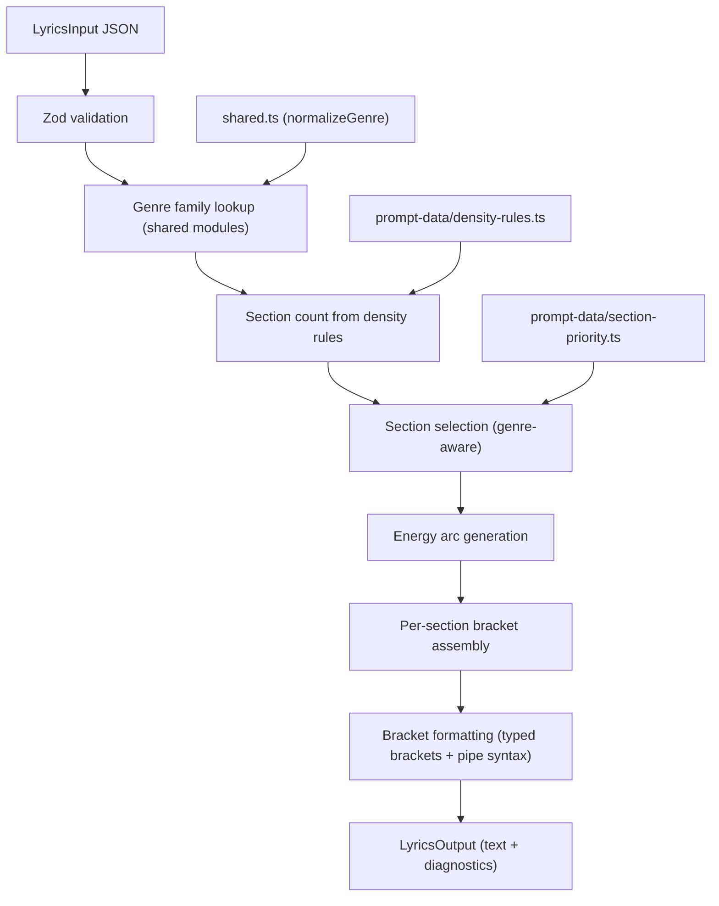
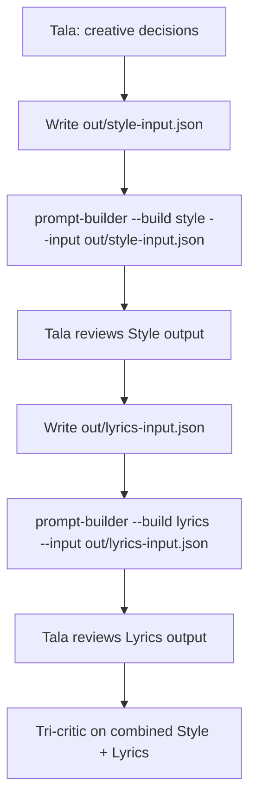

# Task: Prompt Builder Phase 2 -- BGM Lyrics Builder

## Objective

Build a deterministic BGM Lyrics constructor that generates complete Lyrics blocks for instrumental Suno tracks. The builder produces the full bracket scaffold -- section tags, energy arc, mood tags, instrument arrangement brackets, and texture brackets -- from structured JSON input. No lyric content (BGM has no words). This eliminates the manual bracket construction Tala currently performs for every instrumental track, making BGM Lyrics output deterministic, testable, and consistent.

## Scope

### In Scope

- `buildLyrics()` function for BGM tracks only (`type: "bgm"`)
- `LyricsInput` and `LyricsOutput` Zod schemas and TypeScript types
- `LyricsStrategy` interface (mirrors `BuildStrategy` pattern from Phase 1)
- Suno BGM lyrics strategy implementing section selection, energy arc, and bracket formatting
- BPM-dependent section count using existing `prompt-data/density-rules.ts`
- Section priority weighting using existing `prompt-data/section-priority.ts`
- Closed section tag enum (reliable tags only)
- Typed bracket formatting: `[Energy:]`, `[Mood:]`, `[Instrument:]`, `[Texture:]`
- Pipe syntax for instrument stacking (`|` = "play together")
- Energy arc validation (monotonic-ish flow with controlled rises)
- CLI extension: `--build lyrics` alongside existing `--build style`
- Unit tests and integration tests
- Diagnostics output (same pattern as `StyleOutput`)

### Out of Scope

- Vocal lyrics (Phase 3 -- Rune's words + bracket wrapping)
- MiniMax lyrics strategy (Phase 4)
- Lyric content generation (words, meter, rhyme)
- Homograph checking (Phase 5)
- Cliche scanning (Phase 5)
- Cross-prompt coherence (Style + Lyrics together)

## Prerequisites

All of these exist and are complete:

| Dependency | File | Status |
|-----------|------|--------|
| Shared data layer | `src/libs/prompt-data/` (barrel: `index.ts`) | Complete (Phase 0) |
| Density rules | `src/libs/prompt-data/density-rules.ts` | Complete -- `GENRE_DENSITY[]` with per-genre line/syllable/rhyme targets |
| Section priority | `src/libs/prompt-data/section-priority.ts` | Complete -- `SECTION_PRIORITY[]` and `SECTION_PRIORITY_LOOKUP` map |
| Style builder | `src/libs/prompt-builder/index.ts` (`buildStyle()`) | Complete (Phase 1) |
| Types + shared modules | `src/libs/prompt-builder/types.ts`, `shared.ts` | Complete (Phase 1) |
| Suno strategy pattern | `src/libs/prompt-builder/strategies/suno.ts` | Complete (Phase 1) -- pattern to follow |
| CLI entry point | `src/tools/prompt-builder.ts` | Complete (Phase 1) -- extend with `--build lyrics` |
| Test infrastructure | `src/libs/prompt-builder/__tests__/` | Complete -- 3 test files to follow pattern from |

---

## Architecture

### Data Flow



### Where Files Go

```
src/libs/prompt-builder/
  types.ts                          # ADD: LyricsInput, LyricsOutput, LyricsStrategy, Section types
  index.ts                          # ADD: buildLyrics() export
  shared.ts                         # ADD: getSectionCount(), getGenreDensity() to SharedModules
  strategies/
    suno.ts                         # ADD: sunoLyricsStrategy (or new file -- see decision below)
    suno-lyrics.ts                  # NEW: Suno BGM lyrics strategy (preferred -- see rationale)
  __tests__/
    suno-lyrics.test.ts             # NEW: BGM lyrics unit tests
    lyrics-pipeline.test.ts         # NEW: buildLyrics() pipeline tests

src/tools/prompt-builder.ts         # MODIFY: add --build lyrics path
```

### Decision: Separate File for Lyrics Strategy

The Style strategy (`suno.ts`) is already 414 lines. Adding lyrics assembly to the same file would push it past 600+ lines and mix two distinct concerns (comma-separated Style tags vs. multi-line bracket scaffolds). Separate file: `strategies/suno-lyrics.ts`.

**Rationale:** Style and Lyrics strategies share the `SharedModules` dependency but have zero shared assembly logic. Different output shapes, different formatting rules, different trim strategies. Coupling them in one file gains nothing.

---

## Input/Output Schemas

### LyricsInput

```typescript
const LyricsInputSchema = z.object({
  platform: z.enum(["suno"]),                   // minimax: Phase 4
  type: z.literal("bgm"),                       // vocal: Phase 3

  // Genre context (used for section selection + density)
  genres: z.array(z.string().min(1)).min(1).max(2),
  bpm: z.number().int().min(40).max(240),

  // Instruments (carried from StyleInput -- same shape)
  instruments: z.object({
    lead: z.object({ name: z.string(), behavior: z.string() }),
    support: z.object({ name: z.string(), constraint: z.string() }).optional(),
    rhythm: z.object({ name: z.string(), constraint: z.string() }).optional(),
  }),

  // Mood/texture context (used for per-section [Mood:] and [Texture:] brackets)
  moods: z.array(z.string()).max(5).optional(),
  textures: z.array(z.string()).max(3).optional(),

  // Energy arc override (optional -- builder generates default if omitted)
  energyArc: z.enum([
    "ascending",       // Low -> High (standard build)
    "descending",      // High -> Low (fade-out feel)
    "plateau",         // Low -> Medium, hold, fade (most BGM)
    "wave",            // Low -> High -> Low -> Medium (dynamic)
  ]).optional(),       // default: "plateau"

  // Section overrides (optional -- builder uses genre defaults if omitted)
  sectionOverrides: z.array(z.object({
    tag: z.string(),                             // must be in RELIABLE_SECTIONS
    energy: z.string().optional(),               // e.g. "Low", "Medium", "Rising"
    mood: z.string().optional(),                 // override mood for this section
    instrumentOverride: z.string().optional(),    // full instrument bracket text
    textureOverride: z.string().optional(),       // full texture bracket text
  })).optional(),
});

type LyricsInput = z.infer<typeof LyricsInputSchema>;
```

### LyricsOutput

```typescript
interface LyricsSection {
  tag: string;                    // e.g. "Short Instrumental Intro", "Verse", "Hook"
  energy: string;                 // e.g. "Low", "Low-Medium", "Medium"
  mood: string;                   // e.g. "Warm, intimate"
  instrument: string;             // full bracket content after "Instrument: "
  texture: string;                // full bracket content after "Texture: "
  isOverridden: boolean;          // true if sectionOverrides was used
}

interface LyricsOutput {
  text: string;                   // ready-to-paste Lyrics block (multi-line)
  sections: LyricsSection[];      // structured section data
  sectionCount: number;           // number of sections (excluding [Instrumental], [No Vocals], [End])
  energyArc: string;              // which arc was used
  diagnostics: Diagnostic[];      // reuses Diagnostic type from types.ts
}
```

### Example: Input -> Output

**Input:**

```json
{
  "platform": "suno",
  "type": "bgm",
  "genres": ["lo-fi", "jazz"],
  "bpm": 88,
  "instruments": {
    "lead": { "name": "shamisen", "behavior": "melodic plucks" },
    "support": { "name": "Rhodes", "constraint": "warm pad chords underneath" },
    "rhythm": { "name": "brushed snare", "constraint": "gentle groove" }
  },
  "moods": ["warm", "gentle", "morning calm"],
  "textures": ["natural", "mellow"]
}
```

**Output text:**

```
[Instrumental]

[Short Instrumental Intro]
[Energy: Low]
[Mood: Warm, still]
[Instrument: Shamisen sparse melodic plucks alone]
[Texture: Natural, intimate]

[Verse]
[Energy: Low-Medium]
[Mood: Gentle, unhurried]
[Instrument: Shamisen melodic plucks leading | Rhodes warm pad chords underneath | Brushed snare gentle groove]
[Texture: Natural, mellow]

[Hook]
[Energy: Medium]
[Mood: Warm, morning calm]
[Instrument: Shamisen melodic plucks leading | Rhodes warm pad chords fuller | Brushed snare steady pulse]
[Texture: Warm, open]

[Verse 2]
[Energy: Low-Medium]
[Mood: Gentle, settling]
[Instrument: Shamisen sparse plucks | Rhodes sustained chords underneath | Brushed snare barely there]
[Texture: Natural, mellow]

[melodic interlude]
[Energy: Low]
[Mood: Still, reflective]
[Instrument: Rhodes warm pad chords alone | Brushed snare faint texture]
[Texture: Spacious, mellow]

[Outro]
[Energy: Low]
[Mood: Warm, fading]
[Instrument: Shamisen sparse plucks trailing alone]
[Texture: Natural, intimate]

[No Vocals]
[End]
```

---

## Implementation Plan

### Step 1: Types and Constants

**Files:** `src/libs/prompt-builder/types.ts`

Add the following types alongside existing Style types:

1. `LyricsInputSchema` (Zod) and `LyricsInput` type
2. `LyricsSection` interface
3. `LyricsOutput` interface
4. `LyricsStrategy` interface:

```typescript
interface LyricsStrategy {
  name: "suno" | "minimax";

  // Section tag whitelist
  reliableSections: readonly string[];

  // Assembly
  assembleLyrics(input: LyricsInput, shared: SharedModules): LyricsOutput;
}
```

5. `RELIABLE_SECTIONS` constant array:

```typescript
const RELIABLE_SECTIONS = [
  "Short Instrumental Intro",
  "Short Fade In",
  "Verse",
  "Verse 2",
  "Chorus",
  "Hook",
  "Catchy Hook",
  "Pre-Chorus",
  "Bridge",
  "melodic interlude",
  "Build",
  "Drop",
  "Breakdown",
  "Solo",
  "Big Finish",
  "Final Chorus",
  "Outro",
  "Short Instrumental Outro",
  "End",
] as const;
```

Note: `melodic interlude` is intentionally lowercase -- Suno processes it more reliably that way (ref: track 072015-shamisen-at-dusk critic digest, Grok accepted capitalized form but existing tracks use lowercase).

**Acceptance criteria:**
- `tsc --noEmit` passes
- `LyricsInputSchema` rejects `type: "vocal"` with actionable error
- `LyricsInputSchema` rejects unknown `energyArc` values
- All types are exported from `types.ts`

### Step 2: SharedModules Extensions

**File:** `src/libs/prompt-builder/shared.ts`

Add two new methods to the `SharedModules` interface (in `types.ts`) and implement them:

```typescript
// Add to SharedModules interface:
getSectionCount(genreFamily: string, bpm: number): [number, number];
getGenreDensity(genre: string): GenreDensity | null;
```

Implementation:

- `getSectionCount(genreFamily, bpm)`: Look up `GENRE_DENSITY` for the genre. Cross-reference with BPM to determine section count range. The architecture doc's BPM-dependent density table (Phase 2 section) provides the mapping. If genre not found, return default `[5, 7]`.
- `getGenreDensity(genre)`: Direct lookup into `GENRE_DENSITY` array by genre name (case-insensitive). Returns the full `GenreDensity` record or null.

**Note on density-rules.ts gap:** The existing `GENRE_DENSITY` in `density-rules.ts` has per-genre line/syllable counts but does NOT have BPM-dependent section counts. The architecture doc specifies BPM-dependent ranges (e.g., lo-fi BPM<100: 4-6 sections, jazz BPM>120: 6-8 sections). This data needs to be added to `density-rules.ts` as a new export:

```typescript
// NEW export in density-rules.ts
export interface BpmSectionRule {
  readonly genreFamily: string;
  readonly ranges: readonly {
    readonly bpmRange: readonly [number, number];
    readonly sections: readonly [number, number];
    readonly notes: string;
  }[];
}

export const BPM_SECTION_RULES: readonly BpmSectionRule[] = [
  {
    genreFamily: "lo-fi",
    ranges: [
      { bpmRange: [40, 99], sections: [4, 6], notes: "long sustains" },
      { bpmRange: [100, 120], sections: [5, 6], notes: "standard" },
    ],
  },
  {
    genreFamily: "jazz",
    ranges: [
      { bpmRange: [40, 99], sections: [5, 7], notes: "rubato feel" },
      { bpmRange: [100, 120], sections: [5, 7], notes: "swing" },
      { bpmRange: [121, 240], sections: [6, 8], notes: "bebop density" },
    ],
  },
  // ... pop, rock, electronic, hip-hop per architecture doc table
] as const;
```

**Acceptance criteria:**
- `getSectionCount("lo-fi", 88)` returns `[4, 6]`
- `getSectionCount("jazz", 150)` returns `[6, 8]`
- `getSectionCount("unknown", 100)` returns `[5, 7]` (default)
- `getGenreDensity("Pop")` returns the Pop entry from `GENRE_DENSITY`
- `getGenreDensity("nonexistent")` returns `null`
- New `BPM_SECTION_RULES` exported from `density-rules.ts` barrel

### Step 3: Energy Arc Engine

**File:** `src/libs/prompt-builder/strategies/suno-lyrics.ts`

Build the energy arc generator as a pure function inside the strategy file. The arc maps section indices to energy levels.

**Energy levels (ordered):** `"Low"`, `"Low-Medium"`, `"Medium"`, `"Medium-High"`, `"High"`

**Arc shapes:**

| Arc | Pattern (6 sections) | When to Use |
|-----|---------------------|-------------|
| `plateau` (default) | Low, Low-Medium, Medium, Low-Medium, Low, Low | Most BGM -- gentle hill |
| `ascending` | Low, Low-Medium, Medium, Medium-High, High, High | Build tracks, EDM |
| `descending` | Medium, Low-Medium, Low-Medium, Low, Low, Low | Fade-out, ambient |
| `wave` | Low, Medium, Low-Medium, Medium-High, Low-Medium, Low | Dynamic, jazz |

The function signature:

```typescript
function generateEnergyArc(
  arc: "ascending" | "descending" | "plateau" | "wave",
  sectionCount: number
): string[]
```

Returns an array of energy level strings, one per section. The function interpolates between anchor points to fill any section count from 4-8.

**Transition descriptors:** Between certain energy levels, use descriptive modifiers:
- Rising transitions: `"Rising"`, `"Rising slightly"`, `"Building"`
- Falling transitions: `"Settling"`, `"Fading"`, `"Easing"`

These are used when the energy changes direction (e.g., from Medium back to Low-Medium) to give Suno directional cues.

**Acceptance criteria:**
- `generateEnergyArc("plateau", 6)` returns 6 strings, peaks at index 2-3
- `generateEnergyArc("ascending", 4)` returns 4 strings, monotonically increasing
- `generateEnergyArc("descending", 5)` starts at Medium or higher, ends at Low
- All returned strings are valid energy level values
- Section count 4-8 all produce valid arcs

### Step 4: Section Selection

**File:** `src/libs/prompt-builder/strategies/suno-lyrics.ts`

Select which sections to use based on genre family, section count, and energy arc. Pure function:

```typescript
function selectSections(
  genreFamily: string,
  sectionCount: number,
  arc: string,
): string[]
```

**Section templates by genre family:**

| Genre Family | Typical Pattern (6 sections) |
|-------------|------------------------------|
| lo-fi / ambient | Intro, Verse, Hook, Verse 2, melodic interlude, Outro |
| jazz | Intro, Verse, Chorus, Verse 2, Bridge, Outro |
| pop / rock | Intro, Verse, Chorus, Verse 2, Bridge, Final Chorus |
| electronic | Intro, Build, Drop, Breakdown, Build, Drop |
| hip-hop | Intro, Verse, Hook, Verse 2, Bridge, Outro |
| default | Intro, Verse, Hook, Verse 2, melodic interlude, Outro |

**Rules:**
- Always start with a section from `["Short Instrumental Intro", "Short Fade In"]`
- Always end with a section from `["Outro", "Short Instrumental Outro", "Big Finish", "End"]`
- The `[End]` tag is always appended as the final line (not counted in sectionCount)
- `[Instrumental]` is always the first line (not counted in sectionCount)
- `[No Vocals]` is always the second-to-last line (not counted in sectionCount)
- Never use the same section tag twice in a row (except Verse/Verse 2 which are distinct)
- All tags must be in `RELIABLE_SECTIONS`
- Higher-priority sections (weight 3: Hook, Chorus) get more bracket detail
- If sectionCount is 4, drop the interlude/bridge. If 8, add extra verses or a Solo

**Acceptance criteria:**
- Returns only tags from `RELIABLE_SECTIONS`
- First tag is an intro variant
- Last tag is an outro/ending variant
- No consecutive duplicate tags
- Section count matches the requested count (within 1)
- Genre-appropriate patterns (lo-fi gets Hook not Chorus, electronic gets Build/Drop)

### Step 5: Per-Section Bracket Assembly

**File:** `src/libs/prompt-builder/strategies/suno-lyrics.ts`

The core assembly function. For each section, generate 4 typed brackets:

```typescript
function assembleSectionBrackets(
  section: { tag: string; energy: string; index: number },
  input: LyricsInput,
  sectionCount: number,
): LyricsSection
```

**Bracket rules from observed tracks:**

1. **`[Energy: ...]`** -- Energy level from the arc engine. Add directional modifiers when energy changes direction relative to the previous section.

2. **`[Mood: ...]`** -- Select 1-2 mood words from input `moods[]`. Vary across sections -- do not repeat the exact same mood pair in consecutive sections. Intro gets quieter moods. Peak sections get the primary mood. Outro gets fading moods.

3. **`[Instrument: ...]`** -- Pipe-separated instrument staging. Rules:
   - Lead instrument always listed first with `"leading"` or behavior descriptor
   - Support instrument uses `"underneath"` / `"behind"` / `"background"` language
   - Rhythm instrument uses constraint from input
   - **Intro:** Lead instrument alone (or lead + one support, sparse)
   - **Verse:** All instruments, lead prominent
   - **Hook/Chorus (peak):** All instruments, fuller descriptors
   - **Interlude/Bridge:** Reduced instrumentation (1-2 instruments)
   - **Outro:** Lead instrument alone, fading language
   - Use pipe `|` between simultaneous instruments

4. **`[Texture: ...]`** -- Select from input `textures[]` plus contextual additions. Intro gets `"intimate"` / `"dry"`. Peak gets `"warm"` / `"open"`. Outro gets `"fading"` / `"intimate"`.

**Section overrides:** If `input.sectionOverrides` contains an entry matching this section's tag, use the override values instead of generated ones. Mark `isOverridden: true`.

**Acceptance criteria:**
- Every section has all 4 bracket types
- Instrument brackets use pipe syntax correctly
- Lead instrument is always first in pipe chain
- Intro has 1-2 instruments, peak has all, outro has 1
- Mood words vary across sections (no exact repeats in consecutive sections)
- Section overrides replace generated content when provided

### Step 6: Text Formatter

**File:** `src/libs/prompt-builder/strategies/suno-lyrics.ts`

Format the assembled sections into the final multi-line text:

```typescript
function formatLyricsText(sections: LyricsSection[]): string
```

**Format rules (from observed tracks):**

```
[Instrumental]
                              <-- blank line after [Instrumental]
[{section tag}]
[Energy: {energy}]
[Mood: {mood}]
[Instrument: {instrument}]
[Texture: {texture}]
                              <-- blank line between sections
[{next section tag}]
...
                              <-- blank line before closing
[No Vocals]
[End]
```

- `[Instrumental]` is always line 1
- Blank line after `[Instrumental]`
- Blank line between each section block
- `[No Vocals]` then `[End]` as final lines
- No trailing newline

**Acceptance criteria:**
- Output matches the bracket format from real tracks (see examples in Context section)
- Blank lines in correct positions
- `[Instrumental]` first, `[No Vocals]` + `[End]` last
- No double blank lines

### Step 7: Suno Lyrics Strategy (Wire It Together)

**File:** `src/libs/prompt-builder/strategies/suno-lyrics.ts`

Export `sunoLyricsStrategy` implementing `LyricsStrategy`:

```typescript
export const sunoLyricsStrategy: LyricsStrategy = {
  name: "suno",
  reliableSections: RELIABLE_SECTIONS,

  assembleLyrics(input: LyricsInput, shared: SharedModules): LyricsOutput {
    const diagnostics: Diagnostic[] = [];

    // 1. Normalize genres (reuse shared.normalizeGenre)
    // 2. Get section count from BPM + genre family
    // 3. Select sections for genre pattern
    // 4. Generate energy arc
    // 5. Assemble brackets per section
    // 6. Apply section overrides
    // 7. Format text
    // 8. Validate (section tag whitelist, energy arc coherence)
    // 9. Return LyricsOutput

    return { text, sections, sectionCount, energyArc, diagnostics };
  }
};
```

**Diagnostics to emit:**
- `UNKNOWN_GENRE` (info) -- genre not in density rules, using defaults
- `BPM_SECTION_RANGE` (info) -- which BPM range was matched
- `SECTION_OVERRIDE_APPLIED` (info) -- override used for section X
- `ENERGY_ARC_MISMATCH` (warning) -- override energy conflicts with arc direction
- `SECTION_TAG_UNKNOWN` (error) -- sectionOverride tag not in `RELIABLE_SECTIONS`
- `NO_INSTRUMENTS` (error) -- no instruments provided
- `MOOD_REPETITION` (warning) -- same mood phrase in consecutive sections (post-assembly check)

**Acceptance criteria:**
- `sunoLyricsStrategy.assembleLyrics(input, shared)` returns valid `LyricsOutput`
- Output text matches expected bracket format
- Section count respects BPM-dependent density rules
- Energy arc matches requested shape
- Diagnostics report all relevant conditions

### Step 8: buildLyrics() Pipeline

**File:** `src/libs/prompt-builder/index.ts`

Add `buildLyrics()` alongside existing `buildStyle()`:

```typescript
export function buildLyrics(rawInput: unknown): LyricsOutput {
  // 1. Zod validation (LyricsInputSchema)
  // 2. Get strategy (only "suno" for now)
  // 3. Create shared modules
  // 4. Delegate to strategy.assembleLyrics()
  return strategy.assembleLyrics(input, shared);
}
```

Mirror the exact error handling pattern from `buildStyle()` -- Zod failures return structured diagnostics with field names and suggestions.

**Acceptance criteria:**
- `buildLyrics({...valid input...})` returns `LyricsOutput` with non-empty text
- `buildLyrics({})` returns diagnostics listing missing fields
- `buildLyrics({platform: "minimax", ...})` returns `UNSUPPORTED_PLATFORM` error
- Export `buildLyrics`, `LyricsInput`, `LyricsOutput`, `LyricsInputSchema` from `index.ts`

### Step 9: CLI Extension

**File:** `src/tools/prompt-builder.ts`

Extend the CLI to handle `--build lyrics`:

1. Update the `--build` flag to accept `"style" | "lyrics"`
2. When `--build lyrics`:
   - Read input from `--input` file, `--input-json`, or individual flags
   - Call `buildLyrics()`
   - Output: text to stdout (the Lyrics block), diagnostics to stderr
   - `--json` flag outputs full `LyricsOutput` as JSON
3. Add lyrics-specific CLI flags:
   - `--energy-arc <ascending|descending|plateau|wave>`
   - Instrument flags reuse existing `--lead-name`, `--lead-behavior`, etc.
   - Genre/BPM reuse existing flags

4. Update `toolDef` schema: add `build: z.enum(["style", "lyrics"])` and corresponding execute path
5. Update HELP text

**Acceptance criteria:**
- `bun src/tools/prompt-builder.ts --build lyrics --input out/lyrics-input.json` works
- `bun src/tools/prompt-builder.ts --build lyrics --json --input-json '{...}'` outputs JSON
- Exit code 0 on success, 1 on errors
- Diagnostics on stderr, lyrics text on stdout

---

## Test Plan

### Unit Tests (`src/libs/prompt-builder/__tests__/suno-lyrics.test.ts`)

| Test | Assertion |
|------|-----------|
| **Section count: lo-fi slow** | `genres: ["lo-fi"], bpm: 80` -> 4-6 sections |
| **Section count: jazz fast** | `genres: ["jazz"], bpm: 150` -> 6-8 sections |
| **Section count: unknown genre** | `genres: ["vapor-trap"], bpm: 100` -> 5-7 (default) |
| **Energy arc: plateau shape** | `energyArc: "plateau"`, 6 sections -> peaks at middle, low at ends |
| **Energy arc: ascending** | All energy levels non-decreasing |
| **Energy arc: descending** | First energy >= last energy |
| **Section tags: all reliable** | Every tag in output is in `RELIABLE_SECTIONS` |
| **Section tags: intro first** | First section is an intro variant |
| **Section tags: outro last** | Last content section is an outro variant |
| **Section tags: no consecutive duplicates** | No tag repeats back-to-back |
| **Bracket format: 4 per section** | Each section has Energy, Mood, Instrument, Texture brackets |
| **Pipe syntax** | Multi-instrument sections use `\|` separator |
| **Instrument staging: intro** | Intro has 1-2 instruments |
| **Instrument staging: peak** | Hook/Chorus has all instruments, fuller descriptions |
| **Instrument staging: outro** | Outro has 1 instrument + fading language |
| **Lead first** | Lead instrument name appears first in every `[Instrument:]` bracket |
| **Mood variation** | No two consecutive sections have identical mood strings |
| **Text format: bookends** | Starts with `[Instrumental]`, ends with `[No Vocals]\n[End]` |
| **Text format: blank lines** | Blank line after `[Instrumental]`, between sections |
| **Section override** | Override replaces generated content, `isOverridden: true` |
| **Override bad tag** | Override with non-reliable tag -> error diagnostic |
| **Determinism** | Same input 100 times -> identical output |
| **Diagnostics: unknown genre** | Info diagnostic emitted for unknown genre |
| **Diagnostics: missing instruments** | Error diagnostic for empty instruments |

### Pipeline Tests (`src/libs/prompt-builder/__tests__/lyrics-pipeline.test.ts`)

| Test | Assertion |
|------|-----------|
| **Zod rejects vocal type** | `type: "vocal"` -> validation error |
| **Zod rejects missing genres** | -> error with field name |
| **Full pipeline** | Valid JSON -> `buildLyrics()` -> non-empty text, 0 errors |
| **Unsupported platform** | `platform: "minimax"` -> `UNSUPPORTED_PLATFORM` |
| **Real track roundtrip** | Extract inputs from 3 real BGM tracks, run through builder, compare section structure |

### Edge Cases

| Edge Case | Expected Behavior |
|-----------|-------------------|
| Only lead instrument, no support/rhythm | All `[Instrument:]` brackets show only lead |
| Empty moods array | `[Mood:]` brackets use genre-default mood words |
| Empty textures array | `[Texture:]` brackets use genre-default texture words |
| BPM at genre boundary (e.g., lo-fi at 100) | Uses the range that includes 100 |
| 2 genres from different families | Uses primary genre's family for section selection |
| All sections overridden | All `isOverridden: true`, no generated content |

---

## Integration Points

### CLI Usage by Tala

Tala's workflow after Phase 2:



The `LyricsInput` JSON is a subset of the creative decisions Tala already makes. The structured fields map directly to what Tala writes today in bracket form:

| Tala Decides | Maps To |
|-------------|---------|
| Genre + BPM | `genres`, `bpm` -> section count + pattern |
| Instruments + roles | `instruments` -> `[Instrument:]` brackets |
| Mood words | `moods` -> `[Mood:]` brackets |
| Texture words | `textures` -> `[Texture:]` brackets |
| Energy shape | `energyArc` -> `[Energy:]` brackets |
| Per-section tweaks | `sectionOverrides` -> targeted overrides |

### Tala Override Authority

Same principle as Style builder: the builder output is a floor, not a ceiling. Tala can modify the generated Lyrics block before passing to tri-critic. `reflect.ts` tracks override frequency.

### Future Phase 3 Extension Point

The `LyricsStrategy` interface and `type: "bgm"` constraint are designed so Phase 3 adds `type: "vocal"` support with additional input fields (Rune's lyric text, vocal technique shifts) without changing the BGM path.

---

## Reference: Observed BGM Bracket Patterns

From real tracks (March 28-31), the consistent pattern is:

```
[Instrumental]

[{Section Tag}]
[Energy: {level}]
[Mood: {1-3 descriptors}]
[Instrument: {lead behavior} | {support role} | {rhythm role}]
[Texture: {1-2 descriptors}]

...more sections...

[No Vocals]
[End]
```

Source tracks analyzed:
- `vault/studio/tracks/2026-03-29/001830-soft-brush-taps.md` (7 sections, descending arc)
- `vault/studio/tracks/2026-03-29/072015-shamisen-at-dusk.md` (7 sections, plateau arc)
- `vault/studio/tracks/2026-03-31/041347-morning-mist-lifts.md` (6 sections, plateau arc)
