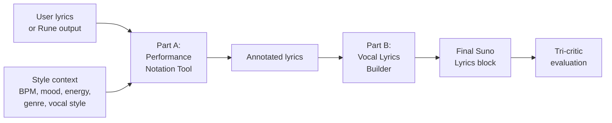
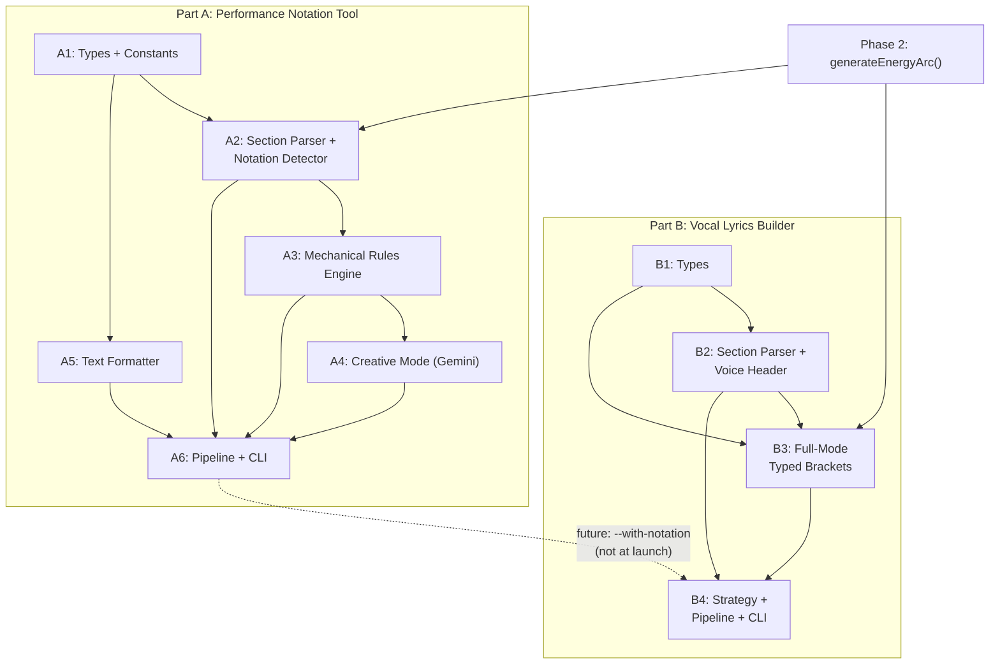
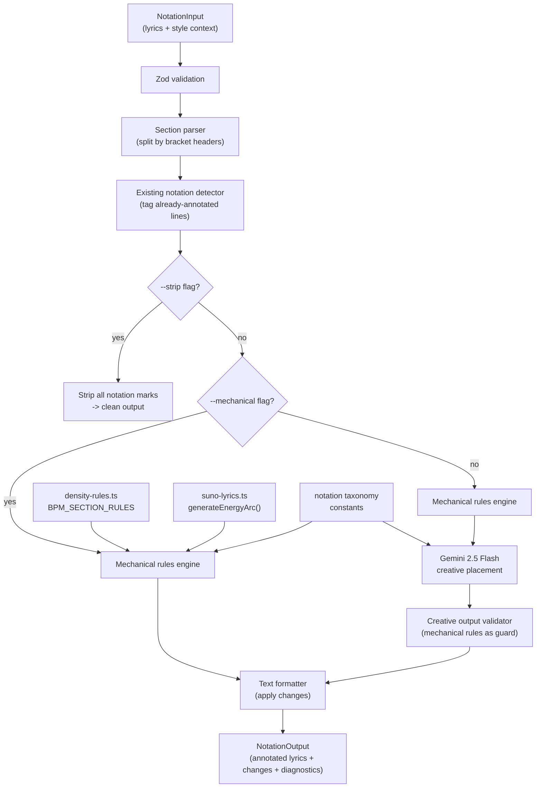
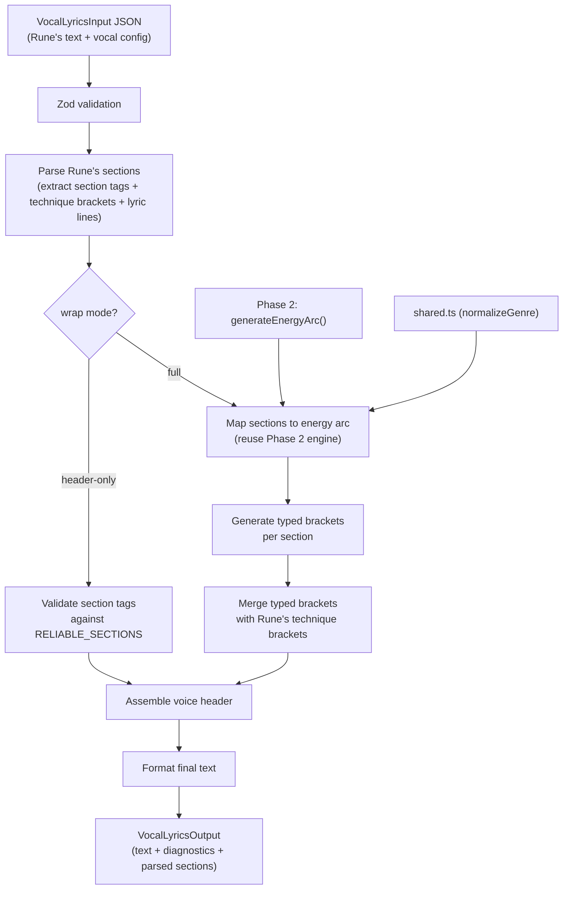
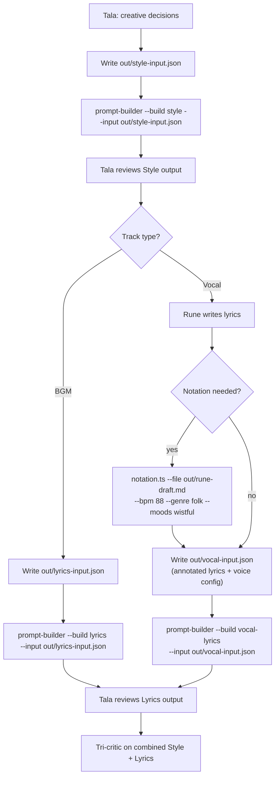

# Task: Prompt Builder Phase 3 -- Performance Notation + Vocal Lyrics Builder

## Objective

Build two complementary tools that close the gap between raw lyrics and platform-ready Suno vocal prompts:

1. **Performance Notation Tool (Part A):** A style-aware notation applicator that adds vocal delivery marks (ellipsis pauses, caps emphasis, hyphenated sustains, typed stutters, parenthetical echoes) to existing lyrics, informed by Style context (BPM, mood, energy arc, genre, vocal style). Ships with both a deterministic mechanical rules engine and Gemini 2.5 Flash creative placement.

2. **Vocal Lyrics Builder (Part B):** A deterministic vocal lyrics formatter that wraps Rune's raw lyric output (optionally pre-annotated by the notation tool) with platform-correct bracket scaffolding for Suno AI -- voice description headers, typed brackets (Energy, Mood, Vocal Style, Instrument, Texture), section tag validation, and energy arc assignment.

Together these form the complete vocal lyrics pipeline: raw lyrics enter, notation adds performance marks, the builder wraps with bracket scaffolding, and the result is a ready-to-paste Suno Lyrics block.

### Pipeline Position



### Build Order Rationale

Part A is built first because:
- It is a **standalone tool** with no dependency on the builder
- The builder accepts pre-annotated lyrics transparently (it wraps, never inspects notation marks)
- Building notation first means the builder's `--with-notation` integration point (future opt-in flag) has an import target ready

Part B is built second because:
- It can optionally call notation as a pre-step (future `--with-notation` flag)
- Its section parser shares no code with the notation parser (different input shapes, different concerns)
- It imports `generateEnergyArc()` from Phase 2, not from Part A

At launch, the two tools are independent CLI tools. The builder does NOT call notation automatically -- that is an opt-in integration deferred to post-launch.

## Scope

### In Scope

**Part A -- Performance Notation Tool:**
- `NotationInput`, `NotationOutput`, `NotationChange` types (Zod schemas + TypeScript)
- Notation taxonomy constants (confirmed marks, BPM density mappings, mood-notation bias, genre vocabulary, vocal style constraints)
- Section parser: split lyrics into section blocks by `[Section Tag]` headers
- Existing notation detector: identify lines that already have ellipsis, caps, sustains, parentheticals, stutters
- Mechanical rules engine: boundary ellipsis, caps budget, sustain on section-final vowels, conflict detection, density ceiling
- Creative mode: Gemini 2.5 Flash call with system prompt containing taxonomy + rules + style context
- Creative output validator: mechanical rules guard creative suggestions before application
- Text formatter: apply `NotationChange[]` to lyrics, produce annotated output
- Strip mode: `--strip` removes all notation marks from lyrics
- Dry-run mode: `--dry-run` shows changes without applying
- CLI entry point: dual-mode (CLI + `toolDef` registry export)
- JSON output mode: `--json` for programmatic use
- Unit tests and integration tests

**Part B -- Vocal Lyrics Builder:**
- `VocalLyricsInput` schema extending `LyricsInput` with Rune's text + vocal fields
- `VocalLyricsOutput` output type extending `LyricsOutput` with voice header and per-section lyrics
- Suno vocal lyrics strategy implementing section parsing, bracket wrapping, and voice header generation
- Section tag parsing from Rune's raw text (map to `RELIABLE_SECTIONS` closed enum)
- Voice description header assembly (voice description + vocal range + exclude)
- Per-section typed bracket insertion: `[Energy:]`, `[Mood:]`, `[Vocal Style:]`, `[Instrument:]`, `[Texture:]`
- Rune's existing informal technique brackets preserved as `[Vocal Style:]` content
- Energy arc assignment to parsed sections (reuse Phase 2 arc engine)
- Section tag validation and normalization (Rune's tags -> RELIABLE_SECTIONS)
- Diagnostic output for unmapped sections, technique bracket conflicts, voice header issues
- CLI extension: `--build vocal-lyrics` alongside existing `--build style` and `--build lyrics`
- Unit tests and integration tests
- Passthrough mode: sections Rune already wrapped with typed brackets are preserved, not double-wrapped

### Out of Scope

- Phonetics integration with notation (deferred to post-launch tuning)
- Non-English lyrics for notation (English-only at launch; non-English passes through with mechanical boundary rules only)
- Builder `--with-notation` auto-invocation (opt-in flag wired separately, post-launch)
- MiniMax notation or vocal lyrics strategy (Phase 4)
- Lyric content generation (words, meter, rhyme -- that is Rune's domain)
- BGM lyrics (Phase 2 -- already complete)
- Homograph checking (Phase 5)
- Cliche scanning (Phase 5)
- Cross-prompt coherence (Style + Lyrics together)
- Tilde notation (`~`) -- unverified on Suno, excluded from launch
- Bracket-level delivery tags (`[Whispered]`, `[Belted]`, etc.) -- that is the builder's bracket layer, not in-line notation
- Modifying Rune's lyric lines -- the builder wraps, never rewrites; notation adds marks but preserves words

## Prerequisites

All of these exist and are complete:

| Dependency | File | Status |
|-----------|------|--------|
| Shared data layer | `src/libs/prompt-data/` (barrel: `index.ts`) | Complete (Phase 0) |
| BGM lyrics builder | `src/libs/prompt-builder/strategies/suno-lyrics.ts` | Complete (Phase 2) |
| Energy arc engine | `suno-lyrics.ts` (`generateEnergyArc()`) | Complete (Phase 2) -- reused by both Part A and Part B |
| Density rules | `src/libs/prompt-data/density-rules.ts` | Complete -- `BPM_SECTION_RULES`, `GENRE_DENSITY` |
| Types + shared modules | `src/libs/prompt-builder/types.ts`, `shared.ts` | Complete (Phase 1) |
| Gemini SDK wrapper | `src/libs/gemini.ts` | Complete -- `generateText()` with usage tracking |
| Diagnostic type | `src/libs/prompt-builder/types.ts` | Complete -- `Diagnostic` interface |
| Phonetics tool pattern | `src/tools/phonetics.ts` | Complete -- dual-mode CLI + toolDef to follow |
| Prompt builder CLI pattern | `src/tools/prompt-builder.ts` | Complete (Phase 1+2) -- extend with `--build vocal-lyrics` |
| Registry types | `src/registry/types.ts` | Complete -- `ToolDefinition`, `ToolResult` |
| Brain.db references | `references/suno/meta-tags-advanced.md` | Complete -- Lyric Formatting Symbols section covers notation taxonomy |
| Rune's output format | Lyrics variation files in `vault/studio/lyrics/` | Observable pattern (see Part B Analysis) |
| Vocal track format | Track variation files in `vault/studio/tracks/` | Observable pattern (see Part B Analysis) |

### Internal Dependencies (Build Order)



**Sequential constraint:** Part A must be complete before Part B begins. While they share no code at launch, the build order ensures the notation tool is importable if the builder needs it during development or testing.

---

# Part A: Performance Notation Tool

## Architecture

### Data Flow



### Where Files Go

```
src/libs/notation/
  types.ts                          # NEW: NotationInput, NotationOutput, NotationChange, taxonomy constants
  constants.ts                      # NEW: Notation taxonomy data, BPM density mappings, mood bias, genre vocab, vocal constraints
  parser.ts                         # NEW: Section parser + existing notation detector
  mechanical.ts                     # NEW: Deterministic rules engine
  creative.ts                       # NEW: Gemini creative placement + output validator
  formatter.ts                      # NEW: Apply changes to lyrics text, strip mode
  index.ts                          # NEW: Barrel export, main annotate() and strip() pipeline functions
  system-prompt.md                  # NEW: Gemini system prompt template for creative mode
  __tests__/
    parser.test.ts                  # NEW: Section parsing + notation detection tests
    mechanical.test.ts              # NEW: Mechanical rules engine tests
    creative.test.ts                # NEW: Creative mode + validator tests
    formatter.test.ts               # NEW: Text formatting + strip tests
    pipeline.test.ts                # NEW: End-to-end annotate() tests

src/tools/notation.ts               # NEW: CLI entry point + toolDef (dual-mode)
```

### Design Decisions

**Lib module, not inline tool.** The notation engine lives in `src/libs/notation/` with the CLI wrapper at `src/tools/notation.ts`. Matches the phonetics pattern (`src/libs/phonetics.ts` + `src/tools/phonetics.ts`) and the prompt-builder pattern (`src/libs/prompt-builder/` + `src/tools/prompt-builder.ts`). The engine is importable by the builder for future `--with-notation` integration.

**System prompt as markdown file.** The Gemini system prompt for creative mode lives at `src/libs/notation/system-prompt.md` -- a markdown file read at runtime. Matches the pattern used by critic files (`.claude/critics/*.md`) and tool system prompts (`--system-file`). The prompt is NOT in `.claude/critics/` because this is a generation task, not a critique task.

**Gemini 2.5 Flash for creative mode.** Zero cost (free tier), proven lyrical+musical understanding from critic/musiccard work, highest consistency of the three models. MiniMax rejected (chat model less proven for structured creative tasks). Grok rejected (wild-card divergence is liability for pipeline tool needing predictable output). Mechanical validation layer catches any bad suggestions.

---

## Input/Output Schemas

### NotationInput

```typescript
// src/libs/notation/types.ts

import { z } from "zod";

export const NotationInputSchema = z.object({
  lyrics: z.string().min(1),                    // Raw lyrics with section headers
  bpm: z.number().int().min(40).max(240),
  genre: z.string().min(1),                      // Primary genre
  moods: z.array(z.string()).min(1).max(3),
  energyArc: z.enum(["ascending", "descending", "plateau", "wave"]),
  vocalStyle: z.string().optional(),             // "whispered" | "belted" | "spoken word" | "rapped" | etc.
  sectionEnergies: z.array(z.string()).optional(), // Pre-computed per-section energy levels
});

export type NotationInput = z.infer<typeof NotationInputSchema>;
```

### NotationOutput

```typescript
export interface NotationOutput {
  annotatedLyrics: string;       // Lyrics with notation applied
  changes: NotationChange[];     // Audit trail of every change
  diagnostics: Diagnostic[];     // Warnings, conflicts, skipped decisions
  mode: "creative" | "mechanical"; // Which mode was used
  stats: {
    sectionsProcessed: number;
    linesAnnotated: number;
    linesSkipped: number;        // Already had notation
    changesApplied: number;
    changesRejected: number;     // Creative suggestions rejected by validator
  };
}
```

### NotationChange

```typescript
export type NotationType =
  | "ellipsis"
  | "caps"
  | "sustain"
  | "stutter"
  | "parenthetical"
  | "short-line";

export interface NotationChange {
  section: string;               // Section tag where change occurs (e.g. "Verse 1")
  line: number;                  // 1-based line number within section
  lineGlobal: number;           // 1-based line number in full lyrics
  original: string;             // Original line text
  annotated: string;            // Line after notation applied
  notation: NotationType;
  reason: string;               // "BPM 72 + mood vulnerable = pause before emotional peak"
  source: "mechanical" | "creative"; // Which engine suggested it
  confidence?: number;           // 0-1, creative mode only (from Gemini)
}
```

### ParsedSection (internal)

```typescript
export interface ParsedSection {
  tag: string;                   // e.g. "Verse 1", "Chorus", "Bridge"
  lines: string[];               // Lyric lines (no headers, no blank lines)
  lineOffset: number;            // Global line number of first lyric line
  energy: string;                // Energy level (from sectionEnergies or computed)
  existingNotation: Map<number, NotationType[]>; // line index -> detected notation types
}
```

---

## Part A Implementation Plan

### Step A1: Types and Constants

**Files:** `src/libs/notation/types.ts`, `src/libs/notation/constants.ts`

**types.ts** -- Define all types listed above:
- `NotationInputSchema` (Zod) and `NotationInput`
- `NotationOutput`, `NotationChange`, `NotationType`, `ParsedSection`
- Re-export `Diagnostic` from `../prompt-builder/types.js`

**constants.ts** -- All notation taxonomy data as typed constants:

1. **`NOTATION_MARKS`** -- Regex patterns for each notation type used in detection:

```typescript
export const NOTATION_MARKS: Record<NotationType, RegExp> = {
  ellipsis: /\.{2,}/,                           // 2+ dots
  caps: /\b[A-Z]{2,}\b/,                        // 2+ consecutive uppercase letters as a word
  sustain: /\w-\w/,                              // hyphenated vowels/syllables (lo-o-ove, al-most)
  stutter: /\b(\w+),\s*\1\b/i,                  // "I, I" / "no, no" patterns
  parenthetical: /\([^)]+\)/,                    // (text in parens)
  "short-line": /.{0,15}$/,                      // Detection: NOT used for detection, only for application
};
```

Note: `short-line` is not detectable as existing notation (any short line could be intentional). It is only used in creative mode placement.

2. **`BPM_NOTATION_DENSITY`** -- Maps BPM ranges to per-notation-type density ceilings (marks per section):

```typescript
export interface BpmNotationDensity {
  readonly bpmRange: readonly [number, number];
  readonly maxPerSection: Readonly<Record<NotationType, number>>;
  readonly label: string;
}

export const BPM_NOTATION_DENSITY: readonly BpmNotationDensity[] = [
  {
    bpmRange: [40, 79],
    label: "slow",
    maxPerSection: { ellipsis: 3, caps: 1, sustain: 3, stutter: 1, parenthetical: 1, "short-line": 2 },
  },
  {
    bpmRange: [80, 110],
    label: "mid-slow",
    maxPerSection: { ellipsis: 2, caps: 2, sustain: 2, stutter: 1, parenthetical: 1, "short-line": 1 },
  },
  {
    bpmRange: [111, 140],
    label: "mid-fast",
    maxPerSection: { ellipsis: 1, caps: 2, sustain: 1, stutter: 1, parenthetical: 1, "short-line": 0 },
  },
  {
    bpmRange: [141, 240],
    label: "fast",
    maxPerSection: { ellipsis: 0, caps: 2, sustain: 0, stutter: 1, parenthetical: 1, "short-line": 0 },
  },
];
```

3. **`MOOD_NOTATION_BIAS`** -- Maps mood categories to preferred/avoided notation types:

```typescript
export interface MoodBias {
  readonly moods: readonly string[];
  readonly prefer: readonly NotationType[];
  readonly avoid: readonly NotationType[];
}

export const MOOD_NOTATION_BIAS: readonly MoodBias[] = [
  { moods: ["vulnerable", "intimate", "tender"], prefer: ["ellipsis", "stutter", "short-line"], avoid: ["caps"] },
  { moods: ["powerful", "anthemic", "triumphant"], prefer: ["caps", "sustain"], avoid: ["ellipsis"] },
  { moods: ["aggressive", "angry", "raw"], prefer: ["caps"], avoid: ["ellipsis"] },
  { moods: ["melancholic", "wistful", "nostalgic"], prefer: ["ellipsis", "sustain"], avoid: ["caps"] },
  { moods: ["playful", "bouncy", "energetic"], prefer: ["parenthetical", "stutter"], avoid: ["sustain"] },
];
```

4. **`GENRE_NOTATION_VOCAB`** -- Maps genre families to typical/atypical notation:

```typescript
export interface GenreNotationVocab {
  readonly genre: string;
  readonly typical: readonly NotationType[];
  readonly atypical: readonly NotationType[];
}

export const GENRE_NOTATION_VOCAB: readonly GenreNotationVocab[] = [
  { genre: "folk", typical: ["sustain", "ellipsis"], atypical: ["caps", "parenthetical"] },
  { genre: "pop", typical: ["caps", "parenthetical", "sustain"], atypical: ["stutter"] },
  { genre: "r&b", typical: ["sustain", "stutter"], atypical: ["caps"] },
  { genre: "hip-hop", typical: ["caps", "parenthetical", "stutter"], atypical: ["sustain"] },
  { genre: "rock", typical: ["caps", "sustain"], atypical: ["ellipsis"] },
  { genre: "metal", typical: ["caps"], atypical: ["ellipsis"] },
  { genre: "ambient", typical: ["ellipsis", "short-line"], atypical: ["caps", "parenthetical"] },
  { genre: "jazz", typical: ["sustain", "stutter"], atypical: ["caps"] },
];
```

5. **`VOCAL_STYLE_CONSTRAINTS`** -- Hard constraints per vocal style:

```typescript
export interface VocalStyleConstraint {
  readonly style: string;
  readonly allows: readonly NotationType[];
  readonly disallows: readonly NotationType[];
}

export const VOCAL_STYLE_CONSTRAINTS: readonly VocalStyleConstraint[] = [
  { style: "whispered", allows: ["ellipsis", "short-line", "stutter"], disallows: ["caps"] },
  { style: "breathy", allows: ["ellipsis", "short-line", "stutter"], disallows: ["caps"] },
  { style: "belted", allows: ["caps", "sustain", "parenthetical", "ellipsis", "stutter", "short-line"], disallows: [] },
  { style: "spoken word", allows: ["stutter", "short-line", "ellipsis"], disallows: ["sustain"] },
  { style: "rapped", allows: ["caps", "stutter", "parenthetical"], disallows: ["sustain"] },
  { style: "falsetto", allows: ["sustain", "ellipsis"], disallows: ["caps"] },
];
```

6. **`ENERGY_NOTATION_RULES`** -- Maps energy levels to notation behavior:

```typescript
export const ENERGY_NOTATION_RULES: Record<string, { allow: NotationType[]; maxTotal: number }> = {
  "Low":         { allow: ["ellipsis", "short-line"], maxTotal: 2 },
  "Low-Medium":  { allow: ["ellipsis", "sustain", "stutter"], maxTotal: 3 },
  "Medium":      { allow: ["ellipsis", "caps", "sustain", "stutter", "parenthetical"], maxTotal: 3 },
  "Medium-High": { allow: ["caps", "sustain", "parenthetical"], maxTotal: 4 },
  "High":        { allow: ["caps", "sustain", "parenthetical", "stutter"], maxTotal: 4 },
};
```

**Acceptance criteria:**
- `tsc --noEmit` passes
- `NotationInputSchema` rejects missing `lyrics`, invalid `bpm`, unknown `energyArc`
- All constants are `readonly` and exported
- No duplicated data from `density-rules.ts` -- BPM ranges here are notation-specific, not section-count-specific

### Step A2: Section Parser + Existing Notation Detector

**File:** `src/libs/notation/parser.ts`

Two exported functions:

```typescript
export function parseSections(
  lyrics: string,
  sectionEnergies?: string[],
  energyArc?: "ascending" | "descending" | "plateau" | "wave",
): ParsedSection[]

export function detectExistingNotation(line: string): NotationType[]
```

**`parseSections()` logic:**
1. Split lyrics by lines
2. Identify section headers: lines matching `^\[.+\]$` where the content is NOT a bracket-type tag like `[Energy: ...]`, `[Mood: ...]`, `[Instrument: ...]`, `[Texture: ...]`
3. Group lyric lines under their section header
4. Skip structural tags: `[Instrumental]`, `[No Vocals]`, `[End]`
5. Track global line offsets for each section
6. Assign energy levels:
   - If `sectionEnergies` provided, use index-matched values
   - Otherwise, call `generateEnergyArc(energyArc, sectionCount)` from `suno-lyrics.ts`
7. Run `detectExistingNotation()` on each lyric line, store in `existingNotation` map

**`detectExistingNotation()` logic:**
1. Test each line against `NOTATION_MARKS` regex patterns (except `short-line`)
2. Return array of detected `NotationType` values
3. Edge cases:
   - A line like `I thought we had... time` has `ellipsis`
   - A line like `WE RISE together` has `caps`
   - A line like `lo-o-o-ove` has `sustain`
   - A line like `I, I miss you` has `stutter`
   - A line like `(still here)` has `parenthetical`
   - Bracket tags like `[Verse 1]` are NOT section content -- never detected
   - ALL-CAPS section headers (e.g. a line that IS a section header) are excluded by the parser

**Import:** `import { generateEnergyArc } from "../prompt-builder/strategies/suno-lyrics.js";`

**Acceptance criteria:**
- Parses standard lyrics with `[Verse 1]`, `[Chorus]`, etc. headers
- Handles lyrics with bracket tags (Energy, Mood, etc.) -- these are skipped, not treated as section headers
- `detectExistingNotation("I thought we had... time")` returns `["ellipsis"]`
- `detectExistingNotation("WE RISE together")` returns `["caps"]`
- `detectExistingNotation("lo-o-o-ove you")` returns `["sustain"]`
- `detectExistingNotation("I, I miss you")` returns `["stutter"]`
- `detectExistingNotation("(still here)")` returns `["parenthetical"]`
- `detectExistingNotation("Just a plain line")` returns `[]`
- Energy levels assigned correctly from arc or explicit list
- Global line offsets are accurate

### Step A3: Mechanical Rules Engine

**File:** `src/libs/notation/mechanical.ts`

```typescript
export function applyMechanicalRules(
  sections: ParsedSection[],
  input: NotationInput,
): { changes: NotationChange[]; diagnostics: Diagnostic[] }
```

**Rules applied in order:**

1. **Skip already-annotated lines.** If `existingNotation` is non-empty for a line, skip it entirely. Emit `info` diagnostic: `EXISTING_NOTATION_SKIPPED`.

2. **Boundary ellipsis.** Last line of a verse/section before a chorus/hook gets `...` appended IF:
   - BPM < 111 (slow/mid-slow allows ellipsis)
   - Mood does not avoid ellipsis (check `MOOD_NOTATION_BIAS`)
   - Vocal style allows ellipsis (check `VOCAL_STYLE_CONSTRAINTS`)
   - The line does not already end with punctuation (`.`, `!`, `?`, `...`)
   - Notation: append `...` to end of line

3. **Caps budget enforcement.** Count existing caps words in section. If a section has energy "Medium-High" or "High" AND caps budget allows it AND mood/genre/vocal style don't avoid caps:
   - Identify the LAST content line of peak sections (Chorus, Hook, Final Chorus) as the candidate for caps emphasis
   - Apply caps to 1 word maximum per section (mechanical mode is conservative)
   - Word selection heuristic: last stressed word in the line (word with 2+ syllables, not a function word like "the", "and", "but", "or", "in", "on", "at", "to", "for")
   - Notation: uppercase the selected word

4. **Sustain on section-final vowels.** Last line of chorus/hook sections at BPM < 100:
   - Find the final word of the line
   - If it ends in a long vowel sound (words ending in: -ove, -ose, -ine, -ight, -ome, -one, -aze, -ire, -ore, -ow, -ay, -ee, -oo), apply hyphenated sustain
   - Notation: `close` -> `clo-o-ose`, `love` -> `lo-o-ove`, `time` -> `ti-i-ime`
   - Implementation: identify the stressed vowel cluster, duplicate it with hyphens (1 repetition for BPM 80-99, 2 repetitions for BPM < 80)

5. **Conflict detection.** After applying rules 2-4, check for conflicts:
   - Caps in a section with vocal style "whispered" or "breathy" -> `warning` diagnostic: `CAPS_WHISPER_CONFLICT`
   - Sustain at BPM > 140 -> `warning` diagnostic: `SUSTAIN_HIGH_BPM`
   - Ellipsis in a section with mood "aggressive" or "angry" -> `warning` diagnostic: `ELLIPSIS_AGGRESSIVE_CONFLICT`
   - These are warnings, not rejections -- the rule shouldn't have fired (earlier checks prevent it), but this is a safety net

6. **Density ceiling.** After all changes are collected, count notation marks per section. If a section exceeds `maxTotal` from `ENERGY_NOTATION_RULES` for its energy level:
   - Remove the lowest-priority changes (priority: boundary ellipsis < sustain < caps)
   - Emit `info` diagnostic: `DENSITY_CEILING_TRIMMED`

**Function word list (do not capitalize):**

```typescript
const FUNCTION_WORDS = new Set([
  "a", "an", "the", "and", "but", "or", "nor", "for", "yet", "so",
  "in", "on", "at", "to", "by", "of", "up", "off", "out",
  "is", "am", "are", "was", "were", "be", "been", "being",
  "do", "does", "did", "has", "have", "had",
  "i", "me", "my", "we", "us", "our", "you", "your",
  "he", "him", "his", "she", "her", "it", "its", "they", "them", "their",
  "this", "that", "these", "those",
  "not", "no", "if", "then", "than", "as",
]);
```

**Sustain vowel patterns (long vowel endings):**

```typescript
const SUSTAIN_VOWEL_ENDINGS = [
  /ove$/, /ose$/, /ine$/, /ight$/, /ome$/, /one$/, /aze$/, /ire$/, /ore$/,
  /ow$/, /ay$/, /ee$/, /oo$/, /ue$/, /ie$/, /ey$/,
];
```

**Sustain application function:**

```typescript
function applySustain(word: string, repetitions: number): string
// "close" + 1 -> "clo-o-ose"
// "love" + 2 -> "lo-o-o-ove"
// "time" + 1 -> "ti-i-ime"
// Logic: find the stressed vowel cluster, duplicate it with hyphens
```

**Acceptance criteria:**
- Lines with existing notation are skipped (never double-applied)
- Boundary ellipsis only fires at BPM < 111 and respects mood/vocal constraints
- Caps budget never exceeds 1 word per section in mechanical mode
- Function words are never capitalized
- Sustain only applies to words with long vowel endings at BPM < 100
- Sustain produces correct hyphenation: `close` -> `clo-o-ose`, `love` -> `lo-o-ove`
- Conflict detection catches all 3 conflict types
- Density ceiling trims lowest-priority changes first
- Every change has a `reason` string explaining the rule + context

### Step A4: Creative Mode (Gemini Call)

**File:** `src/libs/notation/creative.ts`

```typescript
export async function applyCreativeNotation(
  sections: ParsedSection[],
  input: NotationInput,
  mechanicalChanges: NotationChange[],
): Promise<{ changes: NotationChange[]; diagnostics: Diagnostic[] }>

export function validateCreativeChanges(
  changes: NotationChange[],
  sections: ParsedSection[],
  input: NotationInput,
): { accepted: NotationChange[]; rejected: NotationChange[]; diagnostics: Diagnostic[] }
```

**`applyCreativeNotation()` logic:**

1. Build the Gemini prompt:
   - Read system prompt from `src/libs/notation/system-prompt.md`
   - Inject style context into the user prompt: BPM, genre, moods, energy arc, vocal style
   - Include the full lyrics with section headers
   - Include mechanical changes already applied (so Gemini doesn't duplicate them)
   - Include the notation taxonomy (confirmed marks only) as reference
   - Request structured JSON output

2. Call `generateText()` from `src/libs/gemini.ts`:
   - Model: `gemini-2.5-flash`
   - Temperature: `0.4` (low creativity -- consistent, tasteful placement)
   - Caller: `notation`
   - System prompt: loaded from `system-prompt.md`

3. Parse Gemini's JSON response into `NotationChange[]` objects
4. Pass through `validateCreativeChanges()` before returning

**Gemini response schema (requested in system prompt):**

```json
{
  "changes": [
    {
      "section": "Verse 1",
      "line": 2,
      "original": "But you were already gone",
      "annotated": "But you were ALREADY gone",
      "notation": "caps",
      "reason": "emphasis on the unexpected departure, energy Medium matches caps",
      "confidence": 0.85
    }
  ]
}
```

**`validateCreativeChanges()` logic:**

For each creative suggestion, check against mechanical rules:

1. **Caps in whispered/breathy section?** Reject. Diagnostic: `CREATIVE_CAPS_WHISPER_REJECTED`.
2. **Sustain at BPM > 140?** Reject. Diagnostic: `CREATIVE_SUSTAIN_HIGH_BPM_REJECTED`.
3. **Density ceiling breached?** Count mechanical + creative changes per section against `ENERGY_NOTATION_RULES.maxTotal`. If over, reject lowest-confidence creative suggestions first. Diagnostic: `CREATIVE_DENSITY_CEILING_REJECTED`.
4. **Line already has notation (existing or mechanical)?** Reject. Diagnostic: `CREATIVE_DOUBLE_APPLY_REJECTED`.
5. **Notation type disallowed by vocal style?** Reject. Diagnostic: `CREATIVE_VOCAL_STYLE_REJECTED`.
6. **Notation type atypical for genre?** Emit `warning` (not rejection): `CREATIVE_GENRE_ATYPICAL`.

Return accepted changes, rejected changes, and diagnostics.

**System Prompt (`src/libs/notation/system-prompt.md`):**

```markdown
# Performance Notation Assistant

You add vocal performance marks to song lyrics for Suno AI. Your marks control how the AI vocalist delivers the words.

## Available Notation

| Mark | Effect | Example |
|------|--------|---------|
| `...` (ellipsis) | Pause / trailing off | `I thought we had... time` |
| `ALL CAPS` (1-3 words max) | Louder, forceful delivery | `WE RISE together` |
| `-` hyphenated vowels | Syllable sustain | `lo-o-o-ove`, `clo-o-ose` |
| `I, I` typed stutters | Vocal break, repetition | `I, I miss you` |
| `(text)` parentheses | Background/backing vocal | `(I'm still here)` |

## Rules

1. **Never change words.** Only add notation marks. Do not rewrite, reorder, or remove words.
2. **Respect density ceilings.** Use the per-section limits provided in the context.
3. **Skip lines that already have notation.** If a line already contains `...`, caps, sustains, stutters, or parentheticals, do not add more.
4. **Leave some lines plain.** Not every line needs notation. Clean declarative statements are often better undecorated.
5. **Match the mood.** Vulnerable moods get pauses and stutters, not caps. Powerful moods get caps and sustains, not excessive pauses.
6. **Match the energy.** Low-energy sections get minimal notation. High-energy sections get emphasis and sustains.
7. **Match the genre.** Folk gets sustains on vowels. Hip-hop gets caps on punchlines. Ambient gets ellipsis and short lines.
8. **Caps rules:** Never capitalize function words (the, and, but, or, in, on, at, to, etc.). Only capitalize content words that carry emotional weight.
9. **Sustain rules:** Only stretch long vowel sounds. Never stretch consonant clusters.
10. **Stutter rules:** Only stutter on first-person pronouns or emotionally loaded single words.

## Output Format

Respond with ONLY a JSON object. No markdown fencing, no explanation.

{
  "changes": [
    {
      "section": "section tag here",
      "line": 1,
      "original": "exact original line",
      "annotated": "line with notation added",
      "notation": "ellipsis|caps|sustain|stutter|parenthetical",
      "reason": "brief explanation of why this notation fits here",
      "confidence": 0.85
    }
  ]
}

If no changes are needed, return: { "changes": [] }
```

**Acceptance criteria:**
- Gemini is called with correct model, temperature, and caller
- System prompt is loaded from file (not inline string)
- User prompt includes all style context and the lyrics
- Response is parsed as JSON with error handling for malformed output
- All creative changes pass through `validateCreativeChanges()`
- Rejected changes are logged with diagnostic codes
- If Gemini returns malformed JSON, emit `error` diagnostic and return empty changes (graceful degradation)

### Step A5: Text Formatter

**File:** `src/libs/notation/formatter.ts`

```typescript
export function applyChanges(
  lyrics: string,
  changes: NotationChange[],
): string

export function stripNotation(lyrics: string): string
```

**`applyChanges()` logic:**
1. Split lyrics into lines
2. For each change, find the line by `lineGlobal` (1-based)
3. Replace the line with `change.annotated`
4. If multiple changes target the same line (e.g., mechanical ellipsis + creative caps), apply them in order: sustain first, then caps, then ellipsis (leftmost to rightmost in the line)
5. Return the reassembled lyrics string

**`stripNotation()` logic:**
Remove all notation marks from lyrics:
1. Replace `...` (3+ dots) with empty string, clean up whitespace
2. Replace ALL CAPS words with lowercase (but preserve first-letter capitalization for line starts)
3. Replace hyphenated sustains: `lo-o-o-ove` -> `love`, `clo-o-ose` -> `close` (collapse repeated vowel-hyphen patterns)
4. Replace typed stutters: `I, I miss` -> `I miss` (remove the repeated word + comma)
5. Remove parenthetical content: `(still here)` -> empty (these are backing vocal layers, removing them removes the layer)
6. Clean up double spaces, trailing whitespace
7. Preserve section headers and bracket tags untouched

**Sustain collapse regex:**

```typescript
// Match patterns like lo-o-o-ove, clo-o-ose, ti-i-ime
// Captures: prefix + repeated (-vowel) groups + suffix
const SUSTAIN_PATTERN = /(\w+?)(-[aeiou])+(-\w+)/gi;
// Replacement: first capture + last capture (without leading hyphen)
```

**Acceptance criteria:**
- `applyChanges()` correctly replaces lines by global line number
- Multiple changes to the same line are composited correctly
- `stripNotation("I thought we had... time")` -> `"I thought we had time"`
- `stripNotation("WE RISE together")` -> `"We rise together"` (preserve sentence case)
- `stripNotation("lo-o-o-ove you")` -> `"love you"`
- `stripNotation("I, I miss you")` -> `"I miss you"`
- `stripNotation("Hello (still here)")` -> `"Hello"`
- Section headers `[Verse 1]` and bracket tags `[Energy: High]` are never modified
- No double spaces or trailing whitespace in output

### Step A6: Pipeline + CLI

**Files:** `src/libs/notation/index.ts`, `src/tools/notation.ts`

**index.ts -- Pipeline orchestration:**

```typescript
export async function annotate(rawInput: unknown): Promise<NotationOutput>
export function annotateMechanical(rawInput: unknown): NotationOutput
export function strip(lyrics: string): string
```

**`annotate()` pipeline:**

```typescript
export async function annotate(rawInput: unknown): Promise<NotationOutput> {
  // 1. Zod validation
  const parsed = NotationInputSchema.safeParse(rawInput);
  // ... return diagnostics on failure (same pattern as buildStyle)

  const input = parsed.data;

  // 2. Parse sections + detect existing notation
  const sections = parseSections(input.lyrics, input.sectionEnergies, input.energyArc);

  // 3. Apply mechanical rules
  const mechanical = applyMechanicalRules(sections, input);

  // 4. Apply creative notation (Gemini)
  const creative = await applyCreativeNotation(sections, input, mechanical.changes);

  // 5. Validate creative output against mechanical rules
  const validated = validateCreativeChanges(creative.changes, sections, input);

  // 6. Merge changes: mechanical + accepted creative
  const allChanges = [...mechanical.changes, ...validated.accepted];

  // 7. Apply changes to lyrics text
  const annotatedLyrics = applyChanges(input.lyrics, allChanges);

  // 8. Merge diagnostics
  const diagnostics = [
    ...mechanical.diagnostics,
    ...creative.diagnostics,
    ...validated.diagnostics,
  ];

  // 9. Compute stats
  const stats = {
    sectionsProcessed: sections.length,
    linesAnnotated: new Set(allChanges.map(c => c.lineGlobal)).size,
    linesSkipped: countSkippedLines(sections),
    changesApplied: allChanges.length,
    changesRejected: validated.rejected.length,
  };

  return { annotatedLyrics, changes: allChanges, diagnostics, mode: "creative", stats };
}
```

**`annotateMechanical()` -- Same as `annotate()` but skips Gemini, sets `mode: "mechanical"`. Synchronous.**

**`strip()` -- Simple re-export of `stripNotation()` from `formatter.ts`.**

**notation.ts -- CLI entry point (dual-mode):**

```typescript
export const toolDef: ToolDefinition = {
  name: "notation",
  description:
    "Add performance notation (pauses, emphasis, sustains, stutters) to lyrics " +
    "informed by Style context (BPM, mood, energy, genre, vocal style). " +
    "Returns annotated lyrics with change log and diagnostics.",
  inputSchema: z.object({
    lyrics: z.string().optional().describe("Lyrics text (inline)"),
    file: z.string().optional().describe("Path to lyrics file"),
    input: z.string().optional().describe("Path to JSON input file (NotationInput)"),
    bpm: z.number().optional().describe("BPM (required unless --input used)"),
    genre: z.string().optional().describe("Primary genre"),
    moods: z.string().optional().describe("Comma-separated moods"),
    arc: z.string().optional().describe("Energy arc: ascending|descending|plateau|wave"),
    vocalStyle: z.string().optional().describe("Vocal style constraint"),
    mechanical: z.boolean().optional().describe("Mechanical-only mode (no Gemini)"),
    strip: z.boolean().optional().describe("Strip all notation marks"),
    dryRun: z.boolean().optional().describe("Show changes without applying"),
    json: z.boolean().optional().describe("Output as JSON"),
  }),
  tags: ["creative", "quality", "suno"],
  execute: async (args) => { /* ... */ },
};
```

**CLI flags:**

```
Usage:
  bun src/tools/notation.ts --file <path> --bpm <n> --genre <g> --moods "m1, m2" --arc <arc>
  bun src/tools/notation.ts --text "<lyrics>" --bpm <n> --genre <g>
  bun src/tools/notation.ts --input <path.json>
  bun src/tools/notation.ts --file <path> --strip
  bun src/tools/notation.ts --file <path> --bpm <n> --genre <g> --mechanical
  bun src/tools/notation.ts --file <path> --bpm <n> --genre <g> --dry-run
  bun src/tools/notation.ts --file <path> --bpm <n> --genre <g> --json

Flags:
  --file <path>          Path to lyrics file
  --text "<lyrics>"      Inline lyrics text
  --input <path.json>    Full NotationInput as JSON file
  --bpm <number>         BPM (required unless --input or --strip)
  --genre <string>       Primary genre (required unless --input or --strip)
  --moods "m1, m2"       Comma-separated mood words
  --arc <arc>            Energy arc (default: plateau)
  --vocal-style <style>  Vocal style constraint
  --mechanical           Skip Gemini, apply only deterministic rules
  --strip                Remove all notation marks
  --dry-run              Show what would change without applying
  --json                 Output full NotationOutput as JSON

Output:
  Default: annotated lyrics to stdout, diagnostics to stderr
  --json: full NotationOutput as JSON to stdout
  --dry-run: change list to stdout, no file modification

Exit codes:
  0  success
  1  errors (validation failure, Gemini failure with no fallback)
```

**CLI behavior:**

1. **`--strip` path:** Read lyrics from `--file` or `--text`, call `strip()`, output clean lyrics. No BPM/genre required.
2. **`--mechanical` path:** Build `NotationInput` from flags, call `annotateMechanical()`, format output.
3. **Default (creative) path:** Build `NotationInput` from flags, call `annotate()`, format output.
4. **`--dry-run`:** Run the chosen path but output the changes list instead of the annotated lyrics. Format:

```
--- Changes (dry-run) ---
  [Verse 1] L3: "watching the door close" -> "watching the door close..." (ellipsis, mechanical)
    Reason: BPM 72 boundary ellipsis before Chorus
  [Chorus] L2: "we rise together" -> "we RISE together" (caps, creative, conf: 0.82)
    Reason: emphasis on action word at energy Medium-High
--- 2 changes, 0 rejected ---
```

5. **`--json`:** Output full `NotationOutput` as JSON to stdout.
6. **Default text output:**

```
[annotated lyrics to stdout]

--- Notation Summary ---    [to stderr]
Mode: creative
Sections: 5 | Lines annotated: 4 | Skipped: 2 | Applied: 6 | Rejected: 1
Warnings: 1
```

**Acceptance criteria:**
- `bun src/tools/notation.ts --file out/test-lyrics.md --bpm 88 --genre folk --moods "wistful" --arc wave` produces annotated output
- `bun src/tools/notation.ts --file out/test-lyrics.md --strip` removes all notation
- `bun src/tools/notation.ts --file out/test-lyrics.md --bpm 88 --genre folk --mechanical` runs without Gemini call
- `bun src/tools/notation.ts --file out/test-lyrics.md --bpm 88 --genre folk --dry-run` shows changes without applying
- `bun src/tools/notation.ts --file out/test-lyrics.md --bpm 88 --genre folk --json` outputs valid JSON
- `--input out/notation-context.json` reads full NotationInput from file
- Exit code 0 on success, 1 on errors
- `toolDef` is exported and functional via registry

---

## Part A Test Plan

### Unit Tests

**`src/libs/notation/__tests__/parser.test.ts`:**

| Test | Assertion |
|------|-----------|
| Parse standard sections | `[Verse 1]\nline1\nline2` -> 1 section, 2 lines |
| Parse multiple sections | 3 sections with headers -> 3 `ParsedSection` objects |
| Skip bracket tags | `[Energy: High]` not treated as section header |
| Skip structural tags | `[Instrumental]`, `[No Vocals]`, `[End]` excluded |
| Detect ellipsis | `"had... time"` -> `["ellipsis"]` |
| Detect caps | `"WE RISE"` -> `["caps"]` |
| Detect sustain | `"lo-o-ove"` -> `["sustain"]` |
| Detect stutter | `"I, I miss"` -> `["stutter"]` |
| Detect parenthetical | `"(still here)"` -> `["parenthetical"]` |
| Detect multiple | `"WE had... TIME"` -> `["ellipsis", "caps"]` |
| Plain line | `"Just walking home"` -> `[]` |
| Energy from arc | 5 sections + arc "ascending" -> 5 ascending energy levels |
| Energy from explicit | `sectionEnergies: ["Low", "High"]` used when provided |
| Global line offsets | Line offsets correct across multi-section lyrics |

**`src/libs/notation/__tests__/mechanical.test.ts`:**

| Test | Assertion |
|------|-----------|
| Boundary ellipsis at slow BPM | Last verse line before chorus gets `...` at BPM 72 |
| No boundary ellipsis at fast BPM | BPM 150 -> no ellipsis added |
| No ellipsis if line has punctuation | Line ending in `.` or `!` -> no ellipsis |
| Caps on peak section | Chorus at energy High -> 1 caps word |
| No caps in whispered section | vocalStyle "whispered" -> 0 caps changes |
| No caps on function words | "the", "and", "but" never capitalized |
| Sustain at slow BPM | BPM 72, chorus final word "close" -> `clo-o-ose` |
| No sustain at fast BPM | BPM 150 -> no sustain changes |
| Sustain on correct vowels | "love" -> `lo-o-ove`, "time" -> `ti-i-ime` |
| No sustain on consonant endings | "rock" -> no sustain |
| Skip already-annotated | Line with `...` -> no changes, diagnostic emitted |
| Density ceiling | Excess changes trimmed, lowest priority first |
| Conflict: caps + whispered | Warning diagnostic emitted |
| Conflict: sustain + high BPM | Warning diagnostic emitted |
| Determinism | Same input 50 times -> identical output |

**`src/libs/notation/__tests__/creative.test.ts`:**

| Test | Assertion |
|------|-----------|
| Validator rejects caps in whispered | Creative caps change in whispered section -> rejected |
| Validator rejects sustain at high BPM | Creative sustain at 160 BPM -> rejected |
| Validator rejects double-apply | Creative change on already-annotated line -> rejected |
| Validator respects density ceiling | Over-ceiling creative changes trimmed by confidence |
| Validator warns genre-atypical | Caps in ambient genre -> warning (not rejection) |
| Malformed Gemini JSON | Graceful degradation, error diagnostic, empty changes |
| System prompt loaded | System prompt file exists and is non-empty |

**`src/libs/notation/__tests__/formatter.test.ts`:**

| Test | Assertion |
|------|-----------|
| Apply single change | Line replaced at correct position |
| Apply multiple changes to different lines | All replacements correct |
| Apply multiple changes to same line | Composited correctly |
| Strip ellipsis | `"had... time"` -> `"had time"` |
| Strip caps | `"WE RISE together"` -> `"We rise together"` |
| Strip sustain | `"lo-o-o-ove"` -> `"love"` |
| Strip stutter | `"I, I miss"` -> `"I miss"` |
| Strip parenthetical | `"Hello (still here)"` -> `"Hello"` |
| Strip preserves headers | `[Verse 1]` untouched |
| Strip preserves bracket tags | `[Energy: High]` untouched |
| No double spaces after strip | Clean whitespace |

**`src/libs/notation/__tests__/pipeline.test.ts`:**

| Test | Assertion |
|------|-----------|
| Full mechanical pipeline | Valid input -> `annotateMechanical()` -> non-empty output |
| Zod rejects missing lyrics | -> validation error diagnostic |
| Zod rejects invalid BPM | BPM 0 -> error |
| Strip pipeline | `strip()` removes all notation |
| Stats accuracy | Stats match actual change counts |
| Mechanical mode has no creative changes | All changes have `source: "mechanical"` |

### Part A Edge Cases

| Edge Case | Expected Behavior |
|-----------|-------------------|
| Lyrics with no section headers | Treated as single implicit section |
| Empty lyrics | Validation error |
| Lyrics already fully annotated | All lines skipped, 0 changes, info diagnostics |
| Single-line lyrics | Processes the one line |
| Lyrics with only bracket tags (no lyric text) | 0 changes |
| BPM at boundary (e.g., 111) | Uses the range that includes 111 (mid-fast) |
| Unknown genre | Falls through to no genre-specific bias, all notation types available |
| Unknown vocal style | No vocal style constraints applied |
| Gemini timeout | Graceful degradation to mechanical-only, warning diagnostic |
| Gemini returns non-JSON | Graceful degradation to mechanical-only, error diagnostic |

### Part A File Summary

| File | Type | Description |
|------|------|-------------|
| `src/libs/notation/types.ts` | NEW | Zod schemas, TypeScript types, re-export Diagnostic |
| `src/libs/notation/constants.ts` | NEW | Notation taxonomy, BPM density, mood bias, genre vocab, vocal constraints, energy rules |
| `src/libs/notation/parser.ts` | NEW | Section parser, existing notation detector |
| `src/libs/notation/mechanical.ts` | NEW | Deterministic rules engine |
| `src/libs/notation/creative.ts` | NEW | Gemini creative placement + validator |
| `src/libs/notation/formatter.ts` | NEW | Apply changes to text, strip notation |
| `src/libs/notation/index.ts` | NEW | Pipeline orchestration: `annotate()`, `annotateMechanical()`, `strip()` |
| `src/libs/notation/system-prompt.md` | NEW | Gemini system prompt for creative mode |
| `src/libs/notation/__tests__/parser.test.ts` | NEW | Parser + detector tests |
| `src/libs/notation/__tests__/mechanical.test.ts` | NEW | Mechanical rules tests |
| `src/libs/notation/__tests__/creative.test.ts` | NEW | Creative mode + validator tests |
| `src/libs/notation/__tests__/formatter.test.ts` | NEW | Formatter + strip tests |
| `src/libs/notation/__tests__/pipeline.test.ts` | NEW | End-to-end pipeline tests |
| `src/tools/notation.ts` | NEW | CLI entry point + toolDef |

---

# Part B: Vocal Lyrics Builder

## Analysis: Rune's Output Format

From observed lyrics files (`vault/studio/lyrics/2026-03-26/033159-celtic-tavern-dwarven-forge/`), Rune's raw output follows this structure inside a code fence:

```
[Short Instrumental Intro]
[Group humming, Deep, Ancient]
Hmm... hmm... hmm...

[Verse 1]
[Spoken word, Deep baritone, Gravelly]
His hands were wider than the anvil face.
My father. And his father before.

[Pre-Chorus]
[Building, Group chanting joins, Deeper]
Down... down... the mine road

[Chorus]
[Powerful chanting, Full group vocals, Stomping rhythm]
Hammer and dawn, hammer and dawn
...

[Bridge]
[Spoken word, Deep baritone, Stripped back, Vulnerable]
The ceiling wasn't low...

[Final Chorus]
[Full chanting, Maximum power, Stomping, Ancient]
HAMMER AND DAWN, HAMMER AND DAWN
...

[Big Finish]
[Group humming, Fading into stone]
Hmm... hmm...
```

**Key observations:**

1. **Section headers are already RELIABLE_SECTIONS tags** -- `[Verse 1]`, `[Chorus]`, `[Bridge]`, `[Final Chorus]`, `[Big Finish]`, `[Short Instrumental Intro]`. Rune knows the enum.
2. **Technique brackets are informal** -- `[Spoken word, Gravelly, Vulnerable]` is NOT a typed bracket. It is a comma-separated vocal direction tag that Suno processes reliably.
3. **No typed brackets present** -- Rune does NOT emit `[Energy: ...]`, `[Mood: ...]`, `[Instrument: ...]`, or `[Texture: ...]`. Those are Tala's job (and now the builder's).
4. **Section numbering varies** -- `[Verse 1]`, `[Verse 2]` but also sometimes just `[Verse]`. The builder must normalize these.
5. **Lyric lines are plain text** -- no brackets around sung/spoken words (except occasional `(Hey! Hey!)` for ad-libs).
6. **Some sections have multiple technique brackets** mid-section (e.g., a technique shift within a Bridge).

### What Tala Currently Adds Manually

Comparing Rune's output to the final track Lyrics block:

1. **Voice description header** (3 lines at top):
   ```
   [Deep bass-baritone male vocal, gravelly texture, chest voice only]
   [Vocal range: E2-E4]
   [Exclude: falsetto, soprano register, head voice, bright tenor, high notes, light vocals, airy]
   ```
2. **Rune's lyrics used AS-IS** -- section tags and technique brackets preserved exactly.
3. **No typed brackets added** -- in current workflow, Tala relies on Rune's informal technique brackets rather than adding formal typed brackets.

### Design Decision: Two Wrap Modes

| Mode | Behavior | When to Use |
|------|----------|-------------|
| `wrap: "header-only"` | Add voice header, validate section tags, preserve Rune's text as-is | Simple vocal tracks where Rune's technique brackets suffice |
| `wrap: "full"` | Add voice header + typed brackets per section (Energy, Mood, Vocal Style, Instrument, Texture) | Complex vocal tracks needing energy arc control and instrument staging |

**Default: `"header-only"`** -- matches current working pattern. `"full"` is opt-in for tracks that need finer dynamic control.

## Architecture

### Data Flow



### Where Files Go

```
src/libs/prompt-builder/
  types.ts                          # ADD: VocalLyricsInput, VocalLyricsOutput, VocalSection
  index.ts                          # ADD: buildVocalLyrics() export
  strategies/
    suno-lyrics.ts                  # EXISTING: export generateEnergyArc (already exported)
    suno-vocal-lyrics.ts            # NEW: Suno vocal lyrics strategy
  __tests__/
    suno-vocal-lyrics.test.ts       # NEW: Vocal lyrics unit tests

src/tools/prompt-builder.ts         # MODIFY: add --build vocal-lyrics path
```

### Design Decision: Separate File for Vocal Lyrics Strategy

The BGM strategy (`suno-lyrics.ts`) handles a fundamentally different concern: generating ALL bracket content from scratch. The vocal strategy parses existing text and wraps it. Different input, different pipeline, different output shape. Separate file: `strategies/suno-vocal-lyrics.ts`.

**What IS shared:**
- `generateEnergyArc()` from `suno-lyrics.ts` (imported, not duplicated)
- `RELIABLE_SECTIONS` from `types.ts`
- `SharedModules` from `shared.ts`
- `Diagnostic` type from `types.ts`

**What is NOT shared:**
- Section selection (BGM selects sections; vocal parses them from Rune's text)
- Bracket assembly (BGM generates instrument/mood/texture from config; vocal wraps existing text)
- Text formatting (BGM emits pure brackets; vocal interleaves brackets with lyric lines)

---

## Input/Output Schemas

### VocalLyricsInput

```typescript
const VocalLyricsInputSchema = z.object({
  platform: z.enum(["suno"]),                   // minimax: Phase 4
  type: z.literal("vocal"),

  // Rune's raw lyrics text (the code fence content from her variation file)
  lyrics: z.string().min(1),

  // Voice description header fields
  voice: z.object({
    description: z.string().min(1),             // e.g. "Deep bass-baritone male vocal, gravelly texture, chest voice only"
    range: z.string().min(1),                   // e.g. "E2-E4"
    exclude: z.array(z.string()).min(1),        // e.g. ["falsetto", "soprano register", "head voice"]
  }),

  // Genre context (for energy arc + section validation)
  genres: z.array(z.string().min(1)).min(1).max(2),
  bpm: z.number().int().min(40).max(240),

  // Wrap mode
  wrap: z.enum(["header-only", "full"]).default("header-only"),

  // --- Fields below only used when wrap: "full" ---

  // Instruments (for [Instrument:] brackets in full mode)
  instruments: z.object({
    lead: z.object({ name: z.string().min(1), behavior: z.string().min(1) }),
    support: z.object({ name: z.string().min(1), constraint: z.string().min(1) }).optional(),
    rhythm: z.object({ name: z.string().min(1), constraint: z.string().min(1) }).optional(),
  }).optional(),

  moods: z.array(z.string()).max(5).optional(),
  textures: z.array(z.string()).max(3).optional(),

  energyArc: z.enum(["ascending", "descending", "plateau", "wave"]).optional(),

  // Per-section overrides (only in full mode)
  sectionOverrides: z.array(z.object({
    tag: z.string(),
    energy: z.string().optional(),
    mood: z.string().optional(),
    vocalStyle: z.string().optional(),          // override Rune's technique bracket
    instrumentOverride: z.string().optional(),
    textureOverride: z.string().optional(),
  })).optional(),
});

type VocalLyricsInput = z.infer<typeof VocalLyricsInputSchema>;
```

### VocalLyricsOutput

```typescript
interface VocalSection {
  tag: string;                    // e.g. "Verse 1", "Chorus" (from RELIABLE_SECTIONS)
  originalTag: string;            // Rune's original tag text (before normalization)
  techniqueBrackets: string[];    // Rune's informal technique brackets (preserved)
  lyricLines: string[];           // Rune's lyric lines (never modified)

  // Only populated in wrap: "full" mode
  energy?: string;
  mood?: string;
  vocalStyle?: string;            // derived from Rune's technique bracket or override
  instrument?: string;
  texture?: string;

  isOverridden: boolean;
  wasNormalized: boolean;         // true if tag was remapped to RELIABLE_SECTIONS
}

interface VoiceHeader {
  description: string;
  range: string;
  exclude: string[];
}

interface VocalLyricsOutput {
  text: string;                   // ready-to-paste Lyrics block
  voiceHeader: VoiceHeader;       // structured voice header data
  sections: VocalSection[];       // parsed section data
  sectionCount: number;           // number of sections
  wrap: "header-only" | "full";
  energyArc?: string;             // only in full mode
  diagnostics: Diagnostic[];
}
```

### Example: header-only Mode (Input -> Output)

**Input:**

```json
{
  "platform": "suno",
  "type": "vocal",
  "lyrics": "[Short Instrumental Intro]\n[Group humming, Deep, Ancient]\nHmm... hmm... hmm...\n\n[Verse 1]\n[Spoken word, Deep baritone, Gravelly]\nHis hands were wider than the anvil face.\nMy father. And his father before.\n\n[Chorus]\n[Powerful chanting, Full group vocals, Stomping rhythm]\nHammer and dawn, hammer and dawn\nWe struck before the light came on\n\n[Bridge]\n[Spoken word, Deep baritone, Stripped back, Vulnerable]\nThe ceiling wasn't low...\n\n[Big Finish]\n[Group humming, Fading into stone]\nHmm... hmm...",
  "voice": {
    "description": "Deep bass-baritone male vocal, gravelly texture, chest voice only",
    "range": "E2-E4",
    "exclude": ["falsetto", "soprano register", "head voice", "bright tenor", "high notes"]
  },
  "genres": ["celtic folk"],
  "bpm": 78,
  "wrap": "header-only"
}
```

**Output text:**

```
[Deep bass-baritone male vocal, gravelly texture, chest voice only]
[Vocal range: E2-E4]
[Exclude: falsetto, soprano register, head voice, bright tenor, high notes]

[Short Instrumental Intro]
[Group humming, Deep, Ancient]
Hmm... hmm... hmm...

[Verse 1]
[Spoken word, Deep baritone, Gravelly]
His hands were wider than the anvil face.
My father. And his father before.

[Chorus]
[Powerful chanting, Full group vocals, Stomping rhythm]
Hammer and dawn, hammer and dawn
We struck before the light came on

[Bridge]
[Spoken word, Deep baritone, Stripped back, Vulnerable]
The ceiling wasn't low...

[Big Finish]
[Group humming, Fading into stone]
Hmm... hmm...

[End]
```

### Example: full Mode (Input -> Output)

**Output text (same input but `wrap: "full"` with instruments/moods/textures):**

```
[Deep bass-baritone male vocal, gravelly texture, chest voice only]
[Vocal range: E2-E4]
[Exclude: falsetto, soprano register, head voice, bright tenor, high notes]

[Short Instrumental Intro]
[Energy: Low]
[Mood: Ancient, still]
[Instrument: Bodhran faint pulse alone]
[Texture: Intimate, dry]
[Group humming, Deep, Ancient]
Hmm... hmm... hmm...

[Verse 1]
[Energy: Low-Medium]
[Mood: Earthy, hushed]
[Vocal Style: Spoken word, Deep baritone, Gravelly]
[Instrument: Bodhran stomping pulse | Low strings harmonic bed]
[Texture: Natural, spacious]
His hands were wider than the anvil face.
My father. And his father before.

[Chorus]
[Energy: Medium-High]
[Mood: Ancient, powerful]
[Vocal Style: Powerful chanting, Full group vocals, Stomping rhythm]
[Instrument: Bodhran stomping pulse leading | Low strings harmonic bed fuller]
[Texture: Warm, open]
Hammer and dawn, hammer and dawn
We struck before the light came on

[Bridge]
[Energy: Low]
[Mood: Vulnerable, stripped]
[Vocal Style: Spoken word, Deep baritone, Stripped back, Vulnerable]
[Instrument: Bodhran faint pulse alone]
[Texture: Intimate, spacious]
The ceiling wasn't low...

[Big Finish]
[Energy: Low]
[Mood: Ancient, fading]
[Instrument: Bodhran faint pulse trailing alone]
[Texture: Fading, intimate]
[Group humming, Fading into stone]
Hmm... hmm...

[End]
```

**Key difference from BGM:** In `full` mode, Rune's technique bracket becomes the `[Vocal Style:]` typed bracket content. The builder extracts it from Rune's text and promotes it. In `header-only` mode, Rune's technique brackets stay as informal brackets (no `[Vocal Style:]` prefix).

---

## Part B Implementation Plan

### Step B1: Types

**File:** `src/libs/prompt-builder/types.ts`

Add alongside existing types:

1. `VocalLyricsInputSchema` (Zod) and `VocalLyricsInput` type
2. `VocalSection` interface
3. `VoiceHeader` interface
4. `VocalLyricsOutput` interface
5. `VocalLyricsStrategy` interface:

```typescript
interface VocalLyricsStrategy {
  name: "suno" | "minimax";
  reliableSections: readonly string[];
  assembleVocalLyrics(input: VocalLyricsInput, shared: SharedModules): VocalLyricsOutput;
}
```

6. Section tag normalization map (handles Rune's variations):

```typescript
const SECTION_TAG_ALIASES: Record<string, string> = {
  "Verse 1": "Verse",
  "Verse 3": "Verse",         // rare but possible
  "Verse 4": "Verse",
  "Intro": "Short Instrumental Intro",
  "Instrumental Intro": "Short Instrumental Intro",
  "Instrumental Outro": "Short Instrumental Outro",
  "Fade In": "Short Fade In",
  "Fade Out": "Short Instrumental Outro",
  "Interlude": "melodic interlude",
  "Melodic Interlude": "melodic interlude",
  "Catchy hook": "Catchy Hook",
  "final chorus": "Final Chorus",
  "big finish": "Big Finish",
};
```

Note: `Verse 2` is already in `RELIABLE_SECTIONS` and should NOT be aliased. `Verse 1` normalizes to `Verse` because `RELIABLE_SECTIONS` uses `Verse` (unnumbered) for the first verse.

**Acceptance criteria:**
- `tsc --noEmit` passes
- `VocalLyricsInputSchema` rejects `type: "bgm"`
- `VocalLyricsInputSchema` requires `lyrics` and `voice` fields
- `VocalLyricsInputSchema` defaults `wrap` to `"header-only"`
- `VocalLyricsInputSchema` accepts both `"header-only"` and `"full"` wrap modes
- All new types exported from `types.ts`

### Step B2: Section Parser + Voice Header Assembly

**File:** `src/libs/prompt-builder/strategies/suno-vocal-lyrics.ts`

**Section Parser:**

```typescript
interface ParsedSection {
  originalTag: string;            // exact text from Rune's bracket
  normalizedTag: string;          // mapped to RELIABLE_SECTIONS
  techniqueBrackets: string[];    // e.g. ["Spoken word, Deep baritone, Gravelly"]
  lyricLines: string[];           // plain text lines (no brackets)
  wasNormalized: boolean;
}

function parseRuneSections(lyrics: string): {
  sections: ParsedSection[];
  diagnostics: Diagnostic[];
}
```

**Parsing rules:**

1. Split on lines matching `^\[([A-Z][^\]]*)\]$` where the content matches a known section tag or alias
2. A section tag line is recognized by:
   - Starts with `[` and ends with `]`
   - Content matches `RELIABLE_SECTIONS` or `SECTION_TAG_ALIASES` (case-insensitive comparison for alias matching)
   - Does NOT contain a colon (which would be a typed bracket like `[Energy: ...]`)
   - Does NOT match known technique patterns (comma-separated lowercase descriptors)
3. Lines immediately after a section tag that are bracketed but NOT section tags are technique brackets
4. Non-bracketed lines are lyric lines
5. Blank lines are preserved as part of the lyric content (they control section spacing)

**Heuristic for distinguishing section tags from technique brackets:**

```
[Verse 1]                           -> section tag (matches RELIABLE_SECTIONS)
[Spoken word, Gravelly, Vulnerable] -> technique bracket (comma-separated, lowercase words)
[Building, Group chanting joins]    -> technique bracket (not in RELIABLE_SECTIONS)
[Energy: Low]                       -> typed bracket (contains colon)
```

Decision: A bracket is a **section tag** if its content (trimmed, case-normalized) matches `RELIABLE_SECTIONS` or `SECTION_TAG_ALIASES`. Everything else that is bracketed is a **technique bracket** or **typed bracket**.

**Edge cases:**

| Input | Classification | Reason |
|-------|---------------|--------|
| `[Verse 1]` | Section tag | In alias map -> "Verse" |
| `[Verse 2]` | Section tag | Directly in RELIABLE_SECTIONS |
| `[Chorus]` | Section tag | Directly in RELIABLE_SECTIONS |
| `[Spoken word, Gravelly]` | Technique bracket | Not in RELIABLE_SECTIONS or aliases |
| `[Deep choir, Distant, Mournful]` | Technique bracket | Not in RELIABLE_SECTIONS or aliases |
| `[Energy: Low]` | Typed bracket (passthrough) | Contains colon -> already typed |
| `[Full chanting, Maximum power]` | Technique bracket | Not in RELIABLE_SECTIONS |
| `[instrumental break saxophone]` | Technique bracket | Lowercase "instrumental" != "Short Instrumental Intro" |

**Voice Header Assembly:**

```typescript
function assembleVoiceHeader(voice: VoiceHeader): string[]
```

Produces the 3-line voice description header:

```
[{description}]
[Vocal range: {range}]
[Exclude: {exclude items joined with ", "}]
```

**Validation:**
- `voice.description` must not be empty
- `voice.range` must match pattern like `E2-E4`, `C3-C6` (letter + octave + dash + letter + octave)
- `voice.exclude` must have at least 1 item

**Acceptance criteria (parser):**
- Parses the Hammer and Dawn lyrics into correct sections
- `[Verse 1]` normalizes to `Verse`, `wasNormalized: true`
- `[Verse 2]` stays as `Verse 2`, `wasNormalized: false`
- Technique brackets preserved in `techniqueBrackets[]` array
- Lyric lines preserved exactly (no modification)
- Emits `SECTION_TAG_UNKNOWN` warning for tags not in RELIABLE_SECTIONS or aliases
- Handles repeated section tags (two `[Chorus]` blocks -> two separate sections)

**Acceptance criteria (voice header):**
- Produces exactly 3 lines
- Range format validated (warns on invalid format, does not block)
- Exclude items comma-separated
- No trailing/leading whitespace issues

### Step B3: Full-Mode Typed Bracket Generator

**File:** `src/libs/prompt-builder/strategies/suno-vocal-lyrics.ts`

Only active when `wrap: "full"`. For each parsed section, generate typed brackets using the same energy arc engine from Phase 2 and similar mood/instrument/texture logic.

```typescript
function generateTypedBrackets(
  section: ParsedSection,
  index: number,
  totalSections: number,
  input: VocalLyricsInput,
  shared: SharedModules,
  energyArc: string[],
): {
  energy: string;
  mood: string;
  vocalStyle: string;
  instrument: string;
  texture: string;
}
```

**Key differences from BGM bracket assembly:**

| Concern | BGM (Phase 2) | Vocal (Phase 3) |
|---------|--------------|-----------------|
| `[Vocal Style:]` | Not emitted | Derived from Rune's technique bracket |
| `[Instrument:]` | Always emitted | Emitted (instruments are behind vocals, not leading) |
| Section tags | Generated by engine | Parsed from Rune's text |
| Lyric content | None (all brackets) | Rune's lines follow the brackets |
| Technique bracket | N/A | Promoted to `[Vocal Style:]` content |

**Vocal Style derivation:** Take Rune's first technique bracket for the section and use its content as the `[Vocal Style:]` value. If Rune has multiple technique brackets in a section, only the first becomes `[Vocal Style:]` -- the rest are preserved as-is between `[Vocal Style:]` and the lyrics.

**Instrument staging for vocal tracks:** Instruments play a supporting role. The staging logic from BGM applies but with vocal-aware labels:
- Lead instrument never says "leading" (the voice leads)
- Peak sections: instruments "supporting" not "leading"
- Bridge/interludes: instruments may drop out entirely (`"near silence"` or single instrument)

**Acceptance criteria:**
- Energy values come from `generateEnergyArc()`
- `[Vocal Style:]` content matches Rune's first technique bracket for the section
- Instrument brackets use supporting language, not leading
- Mood and texture follow same variation rules as BGM
- Section overrides work the same way as BGM

### Step B4: Strategy + Pipeline + CLI

**Files:** `src/libs/prompt-builder/strategies/suno-vocal-lyrics.ts`, `src/libs/prompt-builder/index.ts`, `src/tools/prompt-builder.ts`

**Suno Vocal Lyrics Strategy:**

Export `sunoVocalLyricsStrategy` implementing `VocalLyricsStrategy`:

```typescript
export const sunoVocalLyricsStrategy: VocalLyricsStrategy = {
  name: "suno",
  reliableSections: RELIABLE_SECTIONS,

  assembleVocalLyrics(input: VocalLyricsInput, shared: SharedModules): VocalLyricsOutput {
    const diagnostics: Diagnostic[] = [];

    // 1. Validate voice fields
    // 2. Parse Rune's sections
    // 3. Validate section tags (all must be in RELIABLE_SECTIONS or aliases)
    // 4. Assemble voice header
    // 5. If wrap === "full":
    //    a. Normalize genres, get energy arc
    //    b. Validate instruments are provided (error if missing)
    //    c. Generate typed brackets per section
    //    d. Merge technique brackets
    // 6. Format text
    // 7. Return VocalLyricsOutput

    return { text, voiceHeader, sections, sectionCount, wrap, energyArc, diagnostics };
  }
};
```

**Text Formatter:**

```typescript
function formatVocalLyricsText(
  voiceHeader: string[],
  sections: VocalSection[],
  wrap: "header-only" | "full",
): string
```

**header-only format:**

```
[{voice description}]
[Vocal range: {range}]
[Exclude: {excludes}]

[{section tag}]
[{technique bracket}]            <-- Rune's original, untouched
{lyric lines}                    <-- Rune's original, untouched

[{next section tag}]
...

[End]
```

**full format:**

```
[{voice description}]
[Vocal range: {range}]
[Exclude: {excludes}]

[{section tag}]
[Energy: {energy}]
[Mood: {mood}]
[Vocal Style: {technique}]      <-- promoted from Rune's bracket
[Instrument: {instruments}]
[Texture: {texture}]
{additional technique brackets}  <-- Rune's 2nd+ brackets, if any
{lyric lines}                    <-- Rune's original, untouched

[{next section tag}]
...

[End]
```

**Format rules:**
- Voice header always first (3 lines)
- Blank line after voice header
- Blank line between section blocks
- `[End]` always last line
- No `[Instrumental]` tag (that is BGM-only)
- No `[No Vocals]` tag (that is BGM-only)
- Rune's lyric lines are NEVER modified -- whitespace, punctuation, ALL CAPS, everything preserved exactly
- If Rune's text already has `[End]` as the last line, don't double it

**Diagnostics to emit:**

| Code | Level | Condition |
|------|-------|-----------|
| `SECTION_TAG_NORMALIZED` | info | Rune's tag was aliased to a RELIABLE_SECTIONS tag |
| `SECTION_TAG_UNKNOWN` | warning | Rune's tag not in RELIABLE_SECTIONS or aliases (preserved but flagged) |
| `VOICE_RANGE_FORMAT` | warning | Voice range doesn't match expected pattern |
| `NO_SECTIONS_FOUND` | error | Parser found 0 section tags in Rune's text |
| `NO_LYRICS_IN_SECTION` | warning | A section has technique brackets but no lyric lines |
| `NO_VOICE` | error | Voice description missing |
| `FULL_MODE_NO_INSTRUMENTS` | error | `wrap: "full"` but no instruments provided |
| `TECHNIQUE_BRACKET_PROMOTED` | info | Technique bracket promoted to `[Vocal Style:]` (full mode) |
| `DUPLICATE_SECTION_TAG` | info | Same section tag appears multiple times (valid but noted) |
| `END_TAG_PRESENT` | info | Rune's text already contained `[End]` -- not duplicated |
| `TYPED_BRACKET_PASSTHROUGH` | info | Existing typed bracket in Rune's text preserved as-is |

**buildVocalLyrics() Pipeline:**

**File:** `src/libs/prompt-builder/index.ts`

```typescript
export function buildVocalLyrics(rawInput: unknown): VocalLyricsOutput {
  // 1. Zod validation (VocalLyricsInputSchema)
  // 2. Get strategy (only "suno" for now)
  // 3. Create shared modules
  // 4. Delegate to strategy.assembleVocalLyrics()
  return strategy.assembleVocalLyrics(input, shared);
}
```

Mirror error handling from `buildStyle()` and `buildLyrics()`.

**CLI Extension:**

**File:** `src/tools/prompt-builder.ts`

Extend CLI to handle `--build vocal-lyrics`:

1. Update `--build` to accept `"style" | "lyrics" | "vocal-lyrics"`
2. When `--build vocal-lyrics`:
   - Read input from `--input` file, `--input-json`, or flag assembly
   - Call `buildVocalLyrics()`
   - Output: text to stdout, diagnostics to stderr
   - `--json` outputs full `VocalLyricsOutput` as JSON
3. Add vocal-specific CLI flags:
   - `--lyrics-file <path>` -- read Rune's lyrics from a file (extracts code fence content)
   - `--voice-description <text>`
   - `--voice-range <range>`
   - `--voice-exclude "<items>"`
   - `--wrap <header-only|full>`
   - Reuse existing `--genres`, `--bpm`, `--lead-name`, etc.
4. Update `toolDef` schema and HELP text

**Code fence extraction for `--lyrics-file`:** When reading Rune's variation file, extract the content between the first ` ``` ` and closing ` ``` ` in the `### Lyrics` section. This is the raw lyrics text to pass to the builder.

**Acceptance criteria:**
- `sunoVocalLyricsStrategy.assembleVocalLyrics(input, shared)` returns valid `VocalLyricsOutput`
- `header-only` mode produces text matching current manual workflow
- `full` mode produces text with typed brackets interleaved with Rune's lyrics
- Section count matches number of parsed sections
- Diagnostics report all relevant conditions
- Rune's lyric lines are byte-identical in output
- `buildVocalLyrics({...valid input...})` returns `VocalLyricsOutput` with non-empty text
- `buildVocalLyrics({})` returns diagnostics listing missing fields
- `buildVocalLyrics({platform: "minimax", ...})` returns `UNSUPPORTED_PLATFORM` error
- Export `buildVocalLyrics`, `VocalLyricsInput`, `VocalLyricsOutput`, `VocalLyricsInputSchema` from `index.ts`
- `bun src/tools/prompt-builder.ts --build vocal-lyrics --input out/vocal-input.json` works
- `bun src/tools/prompt-builder.ts --build vocal-lyrics --lyrics-file path/to/variation.md --voice-description "..." --voice-range "E2-E4" --voice-exclude "falsetto, head voice" --genres "celtic folk" --bpm 78` works
- `--json` outputs full VocalLyricsOutput
- Exit code 0 on success, 1 on errors
- Diagnostics on stderr, lyrics text on stdout

---

## Part B Test Plan

### Unit Tests (`src/libs/prompt-builder/__tests__/suno-vocal-lyrics.test.ts`)

#### Section Parser Tests

| Test | Assertion |
|------|-----------|
| **Parse Hammer and Dawn** | Parses into correct number of sections with matching tags |
| **Parse Ash and Oath** | Handles mid-section technique shifts (multiple technique brackets) |
| **Section tag recognition** | `[Verse 1]` -> section tag, `[Spoken word, Gravelly]` -> technique bracket |
| **Tag normalization** | `[Verse 1]` -> `Verse`, `wasNormalized: true` |
| **Tag passthrough** | `[Verse 2]` -> `Verse 2`, `wasNormalized: false` |
| **Typed bracket passthrough** | `[Energy: Low]` preserved as-is, not parsed as section tag |
| **Unknown tag** | `[Weird Custom Section]` -> preserved with `SECTION_TAG_UNKNOWN` warning |
| **Repeated sections** | Two `[Chorus]` blocks -> two separate parsed sections |
| **Empty lyrics** | Empty string -> `NO_SECTIONS_FOUND` error |
| **Technique bracket extraction** | `[Spoken word, Deep baritone, Gravelly]` lands in `techniqueBrackets[]` |
| **Multiple technique brackets** | Section with 2+ technique brackets -> all captured |
| **Lyric lines preserved** | ALL CAPS, ellipsis, punctuation, ad-libs `(Hey!)` preserved exactly |

#### Voice Header Tests

| Test | Assertion |
|------|-----------|
| **Valid header** | Produces 3 lines in correct format |
| **Range format validation** | `"E2-E4"` -> valid, `"bass range"` -> warning |
| **Exclude formatting** | Array of 5 items -> comma-separated string |

#### header-only Mode Tests

| Test | Assertion |
|------|-----------|
| **Voice header first** | First 3 lines are voice description, range, exclude |
| **Rune's text preserved** | Every lyric line in output matches input exactly |
| **Section tags preserved** | All of Rune's section tags present in output |
| **Technique brackets preserved** | Informal brackets like `[Spoken word, Gravelly]` unchanged |
| **[End] appended** | Last line is `[End]` |
| **No [Instrumental]** | `[Instrumental]` not present (vocal track) |
| **No [No Vocals]** | `[No Vocals]` not present (vocal track) |
| **Blank line spacing** | Blank line after header, between sections |
| **No double blank lines** | Output contains no `\n\n\n` |
| **Existing [End] not duplicated** | If Rune's text ends with `[End]`, only one `[End]` in output |

#### full Mode Tests

| Test | Assertion |
|------|-----------|
| **Typed brackets present** | Each section has Energy, Mood, Vocal Style, Instrument, Texture |
| **Bracket order** | Energy -> Mood -> Vocal Style -> Instrument -> Texture -> lyrics |
| **Vocal Style from technique** | `[Vocal Style: Spoken word, Deep baritone, Gravelly]` derived from Rune's bracket |
| **Energy arc applied** | Energy values match `generateEnergyArc()` output |
| **Instrument brackets supporting** | No "leading" language (voice leads) |
| **Full mode requires instruments** | Missing instruments -> `FULL_MODE_NO_INSTRUMENTS` error |
| **Section overrides work** | Override replaces generated brackets, `isOverridden: true` |
| **Additional technique brackets preserved** | 2nd+ technique brackets appear after `[Texture:]`, before lyrics |

#### Determinism Tests

| Test | Assertion |
|------|-----------|
| **Same input 100 times** | Identical output every run |
| **header-only deterministic** | Parse + format is lossless round-trip |

#### Diagnostic Tests

| Test | Assertion |
|------|-----------|
| **Unknown section tag** | Warning diagnostic emitted |
| **Normalized tag** | Info diagnostic emitted |
| **Missing voice** | Error diagnostic |
| **Full mode no instruments** | Error diagnostic |
| **Empty section (no lyrics)** | Warning diagnostic |

### Part B Edge Cases

| Edge Case | Expected Behavior |
|-----------|-------------------|
| Rune uses `[Intro]` not `[Short Instrumental Intro]` | Alias map normalizes it, info diagnostic |
| Section with only technique brackets, no lyric lines | Preserved (it is an instrumental break) with `NO_LYRICS_IN_SECTION` warning |
| ALL CAPS lyrics in `[Final Chorus]` | Preserved exactly -- builder never modifies lyric text |
| Mid-section technique shift (2 technique brackets) | Both captured; first -> `[Vocal Style:]` in full mode, second preserved as-is |
| Rune already included typed brackets | Passthrough -- not re-wrapped, info diagnostic |
| `[End]` already in Rune's text | Not duplicated |
| Very long lyrics (20+ sections) | Parser handles all, energy arc interpolates to any count |
| Section with ad-libs `(Hey! Hey!)` | Treated as lyric lines, preserved |
| Rune uses `[melodic interlude]` (lowercase) | Directly in RELIABLE_SECTIONS, no normalization needed |
| Blank lines within a section | Preserved as part of lyric lines |

### Part B File Summary

| File | Type | Description |
|------|------|-------------|
| `src/libs/prompt-builder/types.ts` | MODIFY | Add VocalLyricsInput, VocalLyricsOutput, VocalSection, VoiceHeader, VocalLyricsStrategy, SECTION_TAG_ALIASES |
| `src/libs/prompt-builder/strategies/suno-vocal-lyrics.ts` | NEW | Section parser, voice header, typed bracket generator, strategy, text formatter |
| `src/libs/prompt-builder/index.ts` | MODIFY | Add buildVocalLyrics() export |
| `src/libs/prompt-builder/__tests__/suno-vocal-lyrics.test.ts` | NEW | Vocal lyrics unit tests |
| `src/tools/prompt-builder.ts` | MODIFY | Add --build vocal-lyrics path |

---

## Integration Points

### Complete Vocal Pipeline After Phase 3



### Rune's Output -> Notation -> Builder Mapping

| Step | Tool | Input | Output |
|------|------|-------|--------|
| 1. Rune writes lyrics | Rune agent | User brief | Raw lyrics in code fence |
| 2. (Optional) Add notation | `notation.ts` | Raw lyrics + BPM/genre/mood | Annotated lyrics with performance marks |
| 3. Wrap with brackets | `prompt-builder --build vocal-lyrics` | Annotated/raw lyrics + voice config | Ready-to-paste Suno Lyrics block |
| 4. Evaluate | Tri-critic | Style + Lyrics blocks | Pass/fail with notes |

### Tala Override Authority

Same principle as Style and BGM builders: the builder output is a floor, not a ceiling. Tala can modify the wrapped Lyrics block before passing to tri-critic. In `header-only` mode, the builder adds minimal scaffolding (voice header + validation), so overrides are rare. In `full` mode, Tala may override typed bracket values just as with BGM.

### Future Extension Points

- **`--with-notation` on the builder (post-launch):** The builder calls `annotate()` from `src/libs/notation/` as an optional pre-step before bracket wrapping. Opt-in at launch, consider opt-out once notation quality is proven.
- **Phase 4 MiniMax strategies:** Both `VocalLyricsStrategy` and the notation tool can be extended with MiniMax-specific strategies without changing the Suno paths.
- **Phonetics -> Notation integration (post-launch):** Phonetics output informs notation decisions -- stress dead zones suggest ellipsis breaks, harsh consonant clusters suggest avoiding sustains.

---

## Reference: Observed Track Patterns

### Vocal Track Pattern (March 26-27)

```
[{voice description}]
[Vocal range: {range}]
[Exclude: {register exclusions}]

[{Section Tag}]
[{technique bracket}]
{lyric lines}

...more sections...

[{Final section}]
[{technique bracket}]
{lyric lines}
```

No `[End]` tag in current manual workflow, but the architecture doc specifies it. The builder adds it.
No `[Instrumental]` or `[No Vocals]` tags in vocal tracks (those are BGM-only structural tags).

Source tracks analyzed:
- `vault/studio/tracks/2026-03-27/035452-hammer-and-dawn/tavern-stone.md`
- `vault/studio/lyrics/2026-03-26/033159-celtic-tavern-dwarven-forge/hammer-and-dawn.md`
- `vault/studio/lyrics/2026-03-26/033159-celtic-tavern-dwarven-forge/ash-and-oath.md`

### BGM Track Pattern (March 28-31)

```
[Instrumental]

[{Section Tag}]
[Energy: {level}]
[Mood: {1-3 descriptors}]
[Instrument: {lead behavior} | {support role} | {rhythm role}]
[Texture: {1-2 descriptors}]

...more sections...

[No Vocals]
[End]
```

Source tracks analyzed:
- `vault/studio/tracks/2026-03-29/001830-soft-brush-taps.md`
- `vault/studio/tracks/2026-03-29/072015-shamisen-at-dusk.md`
- `vault/studio/tracks/2026-03-31/041347-morning-mist-lifts.md`
