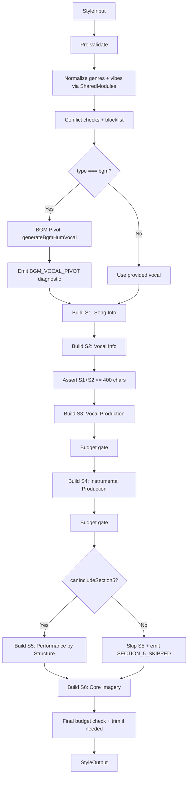
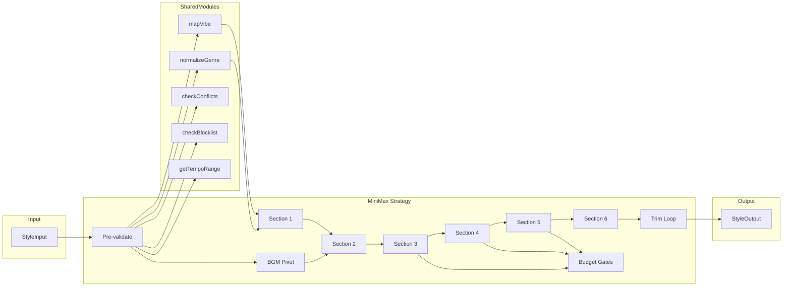

# Phase 4 — MiniMax Style Strategy

## Overview

Add MiniMax platform support to the prompt-builder engine via a new `BuildStrategy` implementation. MiniMax produces natural-language prose paragraphs (6 sections) instead of Suno's comma-separated slot tags. The strategy uses additive assembly with budget gates — each section is built incrementally and checked against the character budget before proceeding.



## Components

### File: `src/libs/prompt-builder/strategies/minimax.ts`

Single file exporting `minimaxStrategy: BuildStrategy`. Contains:

| Export / Internal | Name | Purpose |
|-------------------|------|---------|
| Named export | `minimaxStrategy` | `BuildStrategy` implementation |
| Private helper | `generateBgmHumVocal(family: string)` | Genre-family hum lookup for BGM pivot |
| Private helper | `buildSection1(input, normalizedGenres, mappedMoods)` | Song Information paragraph |
| Private helper | `buildSection2(vocal, genreFamily)` | Vocal Information paragraph |
| Private helper | `buildSection3(production, genreFamily)` | Vocal Production paragraph |
| Private helper | `buildSection4(instruments, production, genreFamily)` | Instrumental Production paragraph |
| Private helper | `buildSection5(genreFamily, instruments)` | Performance by Structure paragraph |
| Private helper | `buildSection6(moods, textures, genreFamily)` | Core Imagery sentence |
| Constant | `BGM_HUM_LOOKUP` | Genre-family to hum-style map |
| Constant | `SECTION_5_STRUCTURES` | Genre-family to structure template map |
| Constant | `SECTION_NAMES` | `Record<number, string>` for slotMap documentation |

### File: `src/libs/prompt-builder/__tests__/minimax-strategy.test.ts`

Full test suite — see Test Plan section below.

### File: `src/libs/prompt-builder/index.ts`

Three-line change — uncomment the import, add to `STRATEGIES` map.

## Data Flow



## Interface Definitions

### BuildStrategy Implementation

```typescript
export const minimaxStrategy: BuildStrategy = {
  name: "minimax",
  charTarget: [800, 1600],
  charHardMax: 2000,
  maxGenres: 2,
  maxInstruments: 5,     // MiniMax supports richer instrument detail
  maxMoods: 5,
  mandatoryTags: [],     // MiniMax uses prose, not appended tags

  bgmTags: {
    start: [],           // No metatags — BGM pivot handles vocal insertion
    end: [],
  },

  vocalSlot1(vocal) {
    // Returns vocal prose fragment for Section 2
    if (vocal.technique) {
      return `${vocal.style} with ${vocal.technique} delivery`;
    }
    return vocal.style;
  },

  assembleStyle(input: StyleInput, shared: SharedModules): StyleOutput {
    // 1. Pre-validate (vocal required for vocal type, BGM pivot)
    // 2. Normalize genres, map vibes, run conflict checks
    // 3. Build sections 1-6 additively with budget gates
    // 4. Trim if over budget (section shortening, not slot removal)
    // 5. Return StyleOutput with slotMap keys 1-6
  },
};
```

### slotMap Semantics

`StyleOutput.slotMap` is `Record<number, string>` for both platforms. The semantic meaning differs:

| Key | Suno | MiniMax |
|-----|------|---------|
| 1 | Metatag/vocal slot | Section 1: Song Information paragraph |
| 2 | Genre slot | Section 2: Vocal Information paragraph |
| 3 | Lead instrument slot | Section 3: Vocal Production paragraph |
| 4 | Support instrument slot | Section 4: Instrumental Production paragraph |
| 5 | Rhythm slot | Section 5: Performance by Structure paragraph |
| 6 | Chords slot | Section 6: Core Imagery sentence |
| 7-11 | Key/BPM, textures, moods, production, end metatags | (unused) |

### Section Priority and Budget

| Section | slotMap Key | Priority | Min Chars | Content Source |
|---------|-------------|----------|-----------|----------------|
| 1. Song Info | 1 | Required | ~100 | genres, moods, textures, bpm |
| 2. Vocal Info | 2 | Required | ~150 | vocal.style, vocal.technique, genre defaults |
| 3. Vocal Production | 3 | High | ~80 | production tags, genre defaults |
| 4. Instrumental Production | 4 | High | ~120 | instruments (lead/support/rhythm), production |
| 5. Performance by Structure | 5 | Conditional | ~200 | genre family structure template, instruments |
| 6. Core Imagery | 6 | Required | ~40 | moods, textures, genre atmosphere |

**Voice-first invariant:** Sections 1+2 combined must be in the first 400 characters. An explicit runtime check after S1+S2 assembly enforces this. If exceeded, emit a `VOICE_FIRST_OVERFLOW` warning diagnostic and trim S1 (reduce scenario detail).

### BGM Auto-Pivot

When `input.type === "bgm"`, the strategy auto-generates a vocal field using genre-family lookup. If `input.vocal` is also provided, it is overridden with a `BGM_VOCAL_OVERRIDE` info diagnostic.

```typescript
const BGM_HUM_LOOKUP: Record<string, { style: string; technique: string }> = {
  jazz:        { style: "warm scat-like vocal murmur, breathy and improvisational", technique: "distant, soft reverb" },
  folk:        { style: "gentle female humming, soft and organic", technique: "close-mic, dry" },
  electronic:  { style: "ethereal vocal chants, processed and atmospheric", technique: "heavy reverb, wide stereo" },
  rock:        { style: "distant male humming, raw and understated", technique: "room reverb, slightly compressed" },
  classical:   { style: "wordless soprano, legato and reverent", technique: "cathedral reverb, centered" },
  "hip-hop":   { style: "rhythmic vocal hum, lo-fi and mellow", technique: "vinyl warmth, intimate" },
  "r&b":       { style: "smooth vocal hum with runs, soulful", technique: "plate reverb, warm compression" },
  pop:         { style: "bright vocal ooh and aah, polished and warm", technique: "studio reverb, centered" },
  country:     { style: "gentle male humming, warm and steady", technique: "small room, natural" },
  blues:       { style: "low vocal hum, smoky and worn", technique: "tube warmth, close-mic" },
  default:     { style: "ethereal female humming, ooh and aah syllables, distant and reverb-heavy", technique: "medium plate reverb" },
};
```

### Section 5 Structure Templates

Section 5 content adapts to genre family instead of assuming Verse/Chorus/Bridge universally:

| Family | Structure Template |
|--------|-------------------|
| pop, rock, country, folk, r&b | Verse / Chorus / Bridge |
| electronic | Intro / Build / Drop / Breakdown |
| jazz | Head / Solo / Head |
| classical | Exposition / Development / Recapitulation |
| hip-hop | Verse / Hook / Verse / Hook |
| default | Opening / Middle / Resolution |

### Section 5 Inclusion Threshold

Proportional budget check, not fixed char count:

```typescript
const SECTION_5_BUDGET_RATIO = 0.20;
const section5Budget = Math.floor(this.charTarget[0] * SECTION_5_BUDGET_RATIO); // 160
const budgetRemaining = this.charHardMax - charsUsed;
const canIncludeSection5 =
  section5Budget <= budgetRemaining &&
  (charsUsed + section5Budget + 40) <= this.charHardMax; // 40 = min S6
```

### Trimming Strategy

MiniMax uses **section shortening** (grammatically safe simplification templates) instead of Suno's slot removal. Each section has a "simplified" variant that is grammatically complete but shorter.

**Trim order (lowest priority first):**

1. **Section 5 dropped** entirely — saves ~200 chars
2. **Section 6 shortened** to a single sensory phrase — saves ~20 chars
3. **Section 4 simplified** — instrument names + technique only, drop spatial/stereo — saves ~60 chars
4. **Section 3 simplified** — single spatial sentence, drop dynamics/stereo — saves ~30 chars

Each simplified variant is a pre-defined template, not character truncation. The `trimmed` array records which sections were shortened (e.g., `["Section 5: Performance by Structure", "Section 4: Instrumental Production"]`).

**Hard max fallback:** If after all trimming the output still exceeds 2000 chars, truncate at the last complete sentence before the limit and emit a `CHAR_HARD_MAX` error diagnostic.

### Realism Handling

MiniMax strategy emits `REALISM_NOT_APPLICABLE` info diagnostic when `realism > 0`. No prose translation. MiniMax handles production fidelity internally — injecting explicit realism descriptors risks contradicting the model's trained behavior.

### MiniMax-Specific Diagnostics

| Code | Level | Trigger |
|------|-------|---------|
| `BGM_VOCAL_PIVOT` | info | Auto-pivoting BGM to vocal hum |
| `BGM_VOCAL_OVERRIDE` | info | User-provided vocal overridden by BGM pivot |
| `REALISM_NOT_APPLICABLE` | info | Realism tier > 0 on MiniMax |
| `SECTION_5_SKIPPED` | info | Performance-by-structure dropped for budget |
| `SECTION_5_STRUCTURE_DEFAULT` | info | Genre family not in structure template, using default |
| `PROSE_SHORTENED` | info | Section was shortened during trim |
| `VOICE_FIRST_OVERFLOW` | warning | Sections 1+2 exceeded 400 chars, S1 trimmed |
| `CHAR_HARD_MAX` | error | Output exceeds 2000 after all trimming |

## Council Analysis

### Reconciliation Table

| Dimension | Gemini | Grok | MiniMax | Decision |
|-----------|--------|------|---------|----------|
| **Template vs LLM (Q1)** | Template. LLM adds complexity for negligible gain at 40 chars | Template. Zero-cost, deterministic, testable | Template. 40 chars is too short for LLM to add value | **Template-only. Unanimous.** |
| **BGM hum granularity (Q2)** | Start family-level, refine later if needed | Family-level sufficient, over-granularity risks inconsistency | Family-level only. Dark ambient vs ambient pop both use ethereal hum | **Family-level only. Add canonical overrides later if quality feedback warrants it.** |
| **Section 5 threshold (Q3)** | Percentage-based or dynamic calc | Fixed 300 is fine, percentage adds complexity | Percentage of target (20% ratio) with budget formula | **Proportional threshold (20% of charTarget[0]). MiniMax's formula is clean and scales.** |
| **Realism field (Q4)** | Translate to prose descriptors | Ignore entirely, info diagnostic | Ignore entirely, info diagnostic | **Ignore with diagnostic. 2:1 consensus. MiniMax handles fidelity internally.** |
| **Sparse input handling** | Important: templates must handle missing fields gracefully | Minor: add null coalescing defaults | Not raised | **Add conditional clauses and fallback phrases in every template. Test with sparse inputs.** |
| **Voice-first 400-char check** | Important: add runtime check after S1+S2 | Not raised | Not raised | **Add explicit check. Emit VOICE_FIRST_OVERFLOW warning if exceeded, trim S1.** |
| **BGM + vocal field conflict** | Important: define behavior, emit diagnostic | Not raised | Important: override vocal, emit BGM_VOCAL_OVERRIDE | **Override with diagnostic. Both Gemini and MiniMax flagged this.** |
| **Section 5 structure** | Not raised | Not raised | Important: genre-family structure templates, not universal V/C/B | **Genre-family structure map. Strong insight from MiniMax council.** |
| **Trim grammar safety** | Prose quality with sparse input | Unhandled undefined could produce garbage | Simplified template per section, not character truncation | **Pre-defined simplification templates per section. Never truncate mid-sentence.** |

## Decisions

| ID | Decision | Alternatives Considered | Rationale |
|----|----------|------------------------|-----------|
| D1 | Deterministic template assembly for all 6 sections | LLM call for Section 6 (synthesis) | Testable, zero-cost, deterministic. 40 chars is too short for LLM advantage. Unanimous council. |
| D2 | Genre-family level BGM hum lookup | Canonical-genre level | Family level provides sufficient differentiation. Canonical adds complexity without quality gain. |
| D3 | Proportional Section 5 threshold (20% of charTarget min) | Fixed 300 chars | Scales with budget changes. MiniMax council provided clean formula. |
| D4 | Ignore realism with info diagnostic | Translate to prose descriptors | 2:1 council consensus. MiniMax handles fidelity internally. Prose translation risks contradiction. |
| D5 | No StyleOutput schema extension | Add outputFormat/slotMapMetadata fields | Phase constraint: no schema changes. Consumers use strategy.name to disambiguate. |
| D6 | Genre-family structure templates for Section 5 | Universal Verse/Chorus/Bridge | Prevents mismatched structure descriptions for non-pop genres. MiniMax council insight. |
| D7 | Pre-defined simplification templates for trimming | Character truncation | Guarantees grammatically complete output. Never truncate mid-sentence. |
| D8 | Override user vocal on BGM pivot with diagnostic | Ignore/use user vocal | BGM type implies hum/chant intent. Override is explicit with BGM_VOCAL_OVERRIDE diagnostic. |

## Test Plan

### `src/libs/prompt-builder/__tests__/minimax-strategy.test.ts`

| # | Test Case | Input | Assertion |
|---|-----------|-------|-----------|
| 1 | Basic vocal track | Full input with vocal, 2 genres, 3 instruments | Valid prose, 6 sections in slotMap, charCount within 800-1600 |
| 2 | BGM auto-pivot | type: "bgm", no vocal | BGM_VOCAL_PIVOT diagnostic, hum-style vocal in S2 |
| 3 | BGM with vocal field | type: "bgm", vocal provided | BGM_VOCAL_OVERRIDE diagnostic, hum replaces vocal |
| 4 | Char budget compliance | Standard input | charCount >= 800 and <= 1600 |
| 5 | Hard max enforcement | Max-density input (all fields maxed) | charCount <= 2000, trimmed array non-empty |
| 6 | Section 5 included | Short input leaving >160 chars budget | slotMap[5] populated |
| 7 | Section 5 skipped | Dense input leaving <160 chars budget | slotMap[5] empty, SECTION_5_SKIPPED diagnostic |
| 8 | Voice-first validation | Any input | First 400 chars contain vocal description |
| 9 | Genre normalization | "lofi hip hop" genre | Normalized to canonical form in prose |
| 10 | Vibe translation | Dangerous mood word | Translated in prose, VIBE_TRANSLATED diagnostic |
| 11 | Mood conflict | Contradictory moods | MOOD_CONFLICT warning |
| 12 | Genre conflict | Contradictory genres | GENRE_CONFLICT warning |
| 13 | Artist blocklist | Blocked name in moods | ARTIST_BLOCKLIST warning |
| 14 | Realism diagnostic | realism: 2 | REALISM_NOT_APPLICABLE info diagnostic |
| 15 | slotMap structure | Full build | Keys 1-6 present, all strings |
| 16 | Genre-family hum lookup | BGM with jazz genre | Jazz-specific hum style in S2 |
| 17 | No vocal for vocal type | type: "vocal", no vocal field | VOCAL_REQUIRED error, empty output |
| 18 | Trim order | Over-budget input | Sections trimmed in correct priority order |
| 19 | Sparse input | Minimal input (1 genre, lead only) | Valid prose, no undefined/null in text |
| 20 | Section 5 structure by family | Electronic genre | S5 uses Intro/Build/Drop/Breakdown |
| 21 | Max-density pathological | All fields at maximum values | No crash, valid output, charCount <= 2000 |

## Risks

| Risk | Likelihood | Impact | Mitigation |
|------|-----------|--------|------------|
| Template prose sounds generic/robotic | Medium | Medium | Iterate on template phrasing post-launch. Rich conditionals per genre family. |
| Sparse input produces awkward prose | Medium | Low | Conditional clauses with fallback phrases. Test case #19 validates. |
| Section 5 structure mismatch for niche genres | Low | Low | Default "Opening/Middle/Resolution" is safe. SECTION_5_STRUCTURE_DEFAULT diagnostic. |
| slotMap consumers assume Suno semantics | Low | Medium | Document in code comments. Consumers check strategy.name. |

## Out of Scope

- **Lyrics strategies** — deferred to Phase 4B (both BGM lyrics and vocal lyrics for MiniMax)
- **StyleOutput schema extensions** — no new fields
- **LLM-based prose generation** — all sections use deterministic templates
- **Canonical-genre hum overrides** — family-level only
- **Prose quality monitoring/feedback loop** — operational concern for Phase 5
- **MiniMax JSON output method** — NL-only this phase

## Wiring (index.ts changes)

```typescript
// Line 6: uncomment
import { minimaxStrategy } from "./strategies/minimax.js";

// Line 18: add to STRATEGIES
const STRATEGIES = {
  suno: sunoStrategy,
  minimax: minimaxStrategy,
} as const;
```
