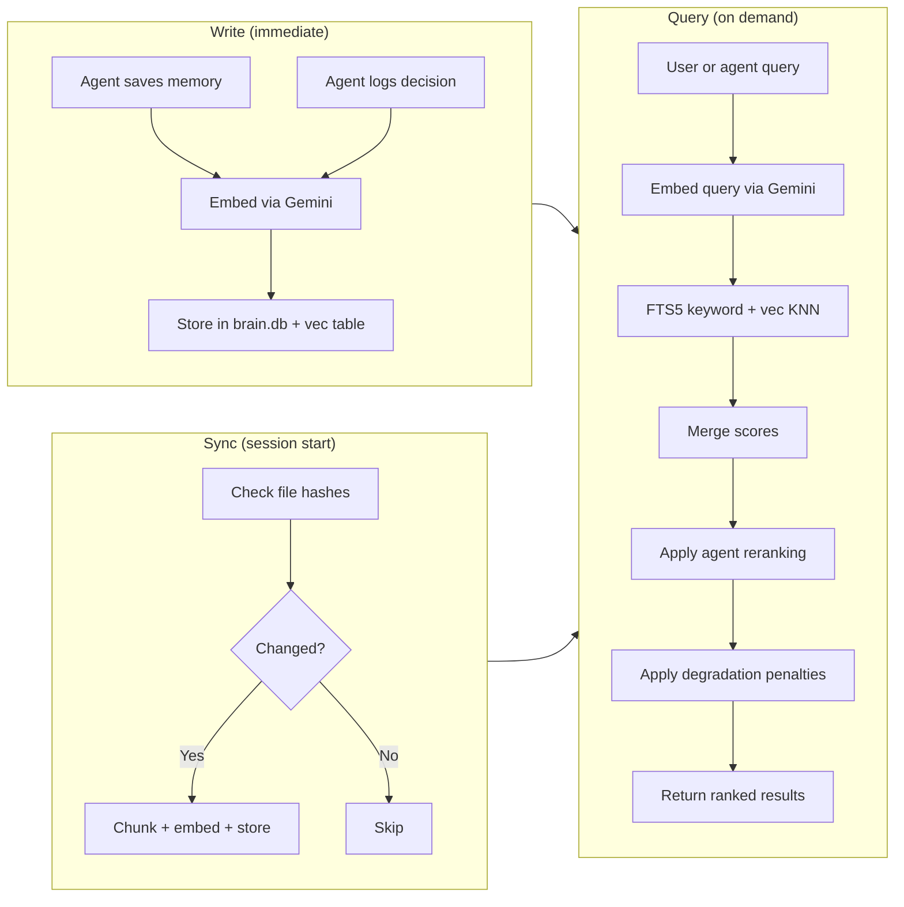

# Tech Approach: Semantic Discovery via Embeddings

## Problem

All knowledge lookup in the system — discovery, memory recall, decision search — uses keyword matching. This works for exact terms but misses semantic relationships:

- **Discovery:** Searching "warm acoustic feel" won't find "analog warmth, tape saturation, fingerpicked guitar"
- **Memory recall:** "that chill track approach" won't match a memory titled "laid-back lo-fi production technique"
- **Decision search:** "how did we handle the mix issue" won't find a decision about "frequency collision resolution"
- **Cross-agent learning:** Wick's implementation patterns can't inform McCall's architecture reviews unless the exact same keywords appear

The three knowledge stores (references, memories, decisions) all have the same limitation — FTS5 keyword search only.

## Proposed Solution

Add **Gemini embedding-001** vectors to **all three knowledge stores** in brain.db with **sqlite-vec** for KNN search. Hybrid search (FTS5 + vector similarity) becomes the default query method across the entire system.

| Knowledge Store | Volume | Embed When | Chunking |
|----------------|--------|-----------|----------|
| **References** | ~50 files, ~500 sections | On sync (hash change) | H2/H3 sections |
| **Memories** | ~30 files, growing | On write (save/consolidate) | Whole file |
| **Decisions** | ~50 rows, growing | On write (logDecision) | Whole row |

## Scope

This is a **system-wide upgrade** — every agent, skill, and interactive session benefits.

| Consumer | Current | After |
|----------|---------|-------|
| **Freddie** (main session) | Manual keyword queries, limited recall | Semantic search across all knowledge — "find that thing we did" works |
| **Tala** (/create-track) | discover.ts keyword scan → load matched sections | Hybrid search → ranked chunks with relevance scores |
| **Rune** (/lyrics) | discover.ts keyword scan | Same hybrid search for lyrics references |
| **Sol** (/minimax-music) | discover.ts keyword scan | Same hybrid search for MiniMax references |
| **McCall** (/architect, /code-review) | brain.ts --query-refs (FTS5) | Hybrid search across references + past decisions + Wick's patterns |
| **Ryan** (/create-brief, /create-prd) | brain.ts --hybrid (FTS5 + JSON cosine on memories only) | sqlite-vec KNN across memories + references + decisions |
| **Wick** (/dev-start) | brain.ts --recall (FTS5) | Semantic recall of implementation patterns |
| **Echo** (/code-review) | brain.ts --recall | Semantic recall of past review patterns |
| **All agents** (reflect.ts) | brain.ts --decide (FTS5 on decisions) | Semantic decision search — past outcomes inform current choices |
| **Consolidate** (memory lifecycle) | Keyword dedup | Semantic similarity for dedup + contradiction detection |

## Architecture

### System Overview

```mermaid
graph TB
    subgraph Consumers["Consumers (Agents & Skills)"]
        FREDDIE[Freddie — main session]
        TALA[Tala — /create-track]
        RUNE[Rune — /lyrics]
        SOL[Sol — /minimax-music]
        MCCALL[McCall — /architect, /code-review]
        RYAN[Ryan — /create-brief, /create-prd]
        WICK[Wick — /dev-start]
        ECHO[Echo — /code-review 2nd opinion]
    end

    subgraph QueryLayer["Query Layer"]
        DISCOVER[discover.ts — hybrid search + keyword fallback]
        BRAIN_CLI[brain.ts CLI — --search-refs, --search-all, --hybrid]
        SEARCH_ALL[searchAll — cross-store unified search]
    end

    subgraph HybridEngine["Hybrid Search Engine"]
        FTS5[FTS5 — keyword matching]
        VEC_SEARCH[sqlite-vec — KNN vector similarity]
        RERANK[Agent-Context Reranker — per-agent boost profiles]
        MERGE[Score Merge — 0.3 FTS + 0.7 vector]
    end

    subgraph Storage["brain.db (SQLite)"]
        subgraph VectorTables["Vector Tables (sqlite-vec)"]
            VEC_CHUNKS[vec_chunks — reference sections]
            VEC_MEM[vec_memories — agent learnings]
            VEC_DEC[vec_decisions — past decisions]
            VEC_PROJ[vec_projects — project docs]
        end

        subgraph DataTables["Data Tables"]
            REF_CHUNKS[reference_chunks — H2/H3 sections with embeddings]
            MEMORIES[memories — agent knowledge files]
            DECISIONS[decisions — logged decisions with outcomes]
            PROJ_CHUNKS[project_chunks — BRIEF, PRD, ARCHITECT sections]
        end

        subgraph FTSTables["FTS5 Tables"]
            CHUNKS_FTS[chunks_fts — reference text index]
            MEM_FTS[memories_fts — memory text index]
            DEC_FTS[decisions_fts — decision text index]
        end

        SYNC_META[sync_meta — file hashes for incremental sync]
    end

    subgraph WritePath["Write Path (embed-on-write)"]
        REMEMBER[remember.ts --save]
        LOG_DEC[logDecision]
        CONSOLIDATE[consolidate-memory.ts]
        REFLECT[reflect.ts]
    end

    subgraph EmbedService["Embedding Service"]
        GEMINI_EMB[Gemini embedding-001 — 768 dims]
        EMB_CACHE[Query embedding cache — session-scoped]
    end

    subgraph SyncPath["Sync Path (session start)"]
        VAULT_REFS[vault/studio/references/]
        VAULT_MEM[vault/studio/memory/]
        VAULT_PROJ[vault/studio/projects/]
        CHUNKER[H2/H3 Chunker]
        HASH_CHECK[Hash Check — skip unchanged files]
    end

    subgraph Degradation["Degradation Layer"]
        STALE[Knowledge Staleness — 90/180 day penalty]
        DECAY[Decision Confidence Decay — 90 day linear]
        PROJ_STATUS[Project Status Filter — completed = 0.5x]
        EMB_VERSION[Embedding Freshness — model version tracking]
    end

    %% Consumer → Query
    FREDDIE --> SEARCH_ALL
    TALA --> DISCOVER
    RUNE --> DISCOVER
    SOL --> DISCOVER
    MCCALL --> BRAIN_CLI
    RYAN --> BRAIN_CLI
    WICK --> BRAIN_CLI
    ECHO --> BRAIN_CLI

    %% Query → Engine
    DISCOVER --> FTS5
    DISCOVER --> VEC_SEARCH
    BRAIN_CLI --> FTS5
    BRAIN_CLI --> VEC_SEARCH
    SEARCH_ALL --> FTS5
    SEARCH_ALL --> VEC_SEARCH
    FTS5 --> MERGE
    VEC_SEARCH --> MERGE
    MERGE --> RERANK
    RERANK --> Degradation

    %% Engine → Storage
    FTS5 --> FTSTables
    VEC_SEARCH --> VectorTables

    %% Write Path
    REMEMBER --> GEMINI_EMB
    LOG_DEC --> GEMINI_EMB
    CONSOLIDATE --> GEMINI_EMB
    REFLECT --> LOG_DEC
    GEMINI_EMB --> VEC_MEM
    GEMINI_EMB --> VEC_DEC
    REMEMBER --> MEMORIES
    LOG_DEC --> DECISIONS

    %% Sync Path
    VAULT_REFS --> HASH_CHECK
    VAULT_MEM --> HASH_CHECK
    VAULT_PROJ --> HASH_CHECK
    HASH_CHECK --> CHUNKER
    CHUNKER --> GEMINI_EMB
    GEMINI_EMB --> VEC_CHUNKS
    GEMINI_EMB --> VEC_PROJ
    CHUNKER --> REF_CHUNKS
    CHUNKER --> PROJ_CHUNKS
    HASH_CHECK --> SYNC_META

    %% Query embedding
    VEC_SEARCH --> EMB_CACHE
    EMB_CACHE --> GEMINI_EMB
```



### Data Flow Summary



### Embedding Model

**Gemini embedding-001** (text-embedding-004 successor)
- MTEB score: 68.32 (best in class, retrieval: 67.71)
- Dimensions: 768 (configurable, down from default 3072 — quality loss is minimal)
- Cost: $0.15/1M tokens → ~$0.03 for full corpus sync
- Rate limit: 10M tokens/min, 1500 RPM (far above our needs)
- SDK: `@google/genai` (already in project)

### Vector Storage

**sqlite-vec** — pure C SQLite extension
- KNN search via `vec0` virtual tables
- Works with `bun:sqlite` natively
- Supports float32 and int8 quantized vectors
- ~50KB dependency
- Install: `bun add sqlite-vec`

### Chunking Strategy

Different stores need different chunking — one size doesn't fit all.

#### References → Section-level chunks (H2/H3 boundaries)

Why sections, not whole files:
- A single reference file (e.g., `instrument-tags.md`) contains 10+ distinct topics
- Whole-file embedding would average all topics into one vector — too coarse
- Section-level matches how agents already consume references (load section, not file)

**Chunking rules:**
1. Split on `## ` (H2) headers — primary chunk boundary
2. If an H2 section is >1000 tokens, sub-split on `### ` (H3) headers
3. Each chunk gets: `{ title, content, source_path, section_name, line_start, line_end, collection, tags }`
4. Frontmatter is attached to the first chunk of each file
5. Music cards are single chunks (they're already concise and structured)

#### Memories → Whole file

Why no chunking:
- Memory files are small (typically 200-500 tokens)
- Each file is a single coherent learning/observation
- Splitting would lose context

Embed the full markdown content. One vector per memory file.

#### Decisions → Whole row

Why no chunking:
- Each decision is a single statement + context
- Concatenate `decision + context + alternatives + outcome` as the embed text
- One vector per decision row

### Schema Changes

**New table: `reference_chunks`**

```sql
CREATE TABLE reference_chunks (
  id INTEGER PRIMARY KEY AUTOINCREMENT,
  reference_id INTEGER NOT NULL,           -- FK to references.id
  collection TEXT NOT NULL,                 -- suno, minimax, lyrics, shared
  source_path TEXT NOT NULL,                -- Original file path
  section_name TEXT NOT NULL,               -- H2/H3 header text
  content TEXT NOT NULL,                    -- Section content (markdown)
  line_start INTEGER NOT NULL,             -- Line number in source file
  line_end INTEGER NOT NULL,               -- End line number
  tags TEXT,                                -- Inherited from file + section-specific
  token_count INTEGER,                     -- Approximate token count
  embedding BLOB,                          -- 768-dim float32 vector (3072 bytes)
  file_hash TEXT NOT NULL,                 -- From parent file (for sync tracking)
  created_at TEXT NOT NULL,
  updated_at TEXT NOT NULL
);

CREATE INDEX idx_chunks_collection ON reference_chunks(collection);
CREATE INDEX idx_chunks_source ON reference_chunks(source_path);
CREATE INDEX idx_chunks_hash ON reference_chunks(file_hash);
```

**New virtual table: `vec_chunks` (sqlite-vec)**

```sql
CREATE VIRTUAL TABLE vec_chunks USING vec0(
  chunk_id INTEGER PRIMARY KEY,
  embedding float[768]
);
```

**New FTS5 table: `chunks_fts`**

```sql
CREATE VIRTUAL TABLE chunks_fts USING fts5(
  section_name, content, tags,
  content='reference_chunks',
  content_rowid='id'
);
```

**Extend `sync_meta`:** No changes needed — already tracks `source_path` + `file_hash`. Chunks inherit the parent file's hash.

### Memory Vector Tables

**New virtual table: `vec_memories` (sqlite-vec)**

```sql
CREATE VIRTUAL TABLE vec_memories USING vec0(
  memory_id INTEGER PRIMARY KEY,
  embedding float[768]
);
```

The existing `embedding TEXT` column on `memories` stores JSON-stringified vectors. Migration path:
1. Add `vec_memories` virtual table
2. On sync: for each memory with existing JSON embedding, parse and insert into `vec_memories`
3. For new memories: embed via Gemini, store in both `vec_memories` (binary) and `embedding` (JSON, backward compat)
4. Phase 3 deprecates the JSON column

### Decision Vector Tables

**New virtual table: `vec_decisions` (sqlite-vec)**

```sql
CREATE VIRTUAL TABLE vec_decisions USING vec0(
  decision_id INTEGER PRIMARY KEY,
  embedding float[768]
);
```

Same migration pattern as memories. Decisions embed the concatenation of `decision + context + alternatives + outcome`.

### Embed-on-Write

Unlike references (which embed on sync), memories and decisions embed **immediately when created**:

| Operation | Embed Trigger |
|-----------|--------------|
| `remember.ts --save` | Embed the new memory file, insert into `vec_memories` |
| `logDecision()` | Embed the decision row, insert into `vec_decisions` |
| `consolidate-memory.ts` | Re-embed consolidated knowledge files (old inbox files archived) |
| `updateOutcome()` | Re-embed the decision (context changed with outcome) |

This ensures every piece of knowledge is semantically searchable the moment it's created — no waiting for a sync cycle.

**Batch fallback:** If Gemini API is unavailable during write, store without embedding and flag for batch embedding on next sync. The `embedding` column being NULL signals "needs embedding".

## Sync Flow

### Reference Sync (batch, on session start)

**Initial sync:**
```
1. Check if reference_chunks table exists → create if not
2. For each reference file in vault/studio/references/:
   a. Check sync_meta hash — if unchanged, skip
   b. Parse file into sections (H2/H3 chunking)
   c. DELETE existing chunks for this source_path
   d. INSERT new chunks with content, metadata
   e. Batch embed: collect all new chunk contents
   f. Call Gemini embedding API (batch of up to 100 chunks)
   g. Store embeddings in reference_chunks.embedding + vec_chunks
   h. Update sync_meta hash
3. Rebuild chunks_fts index
4. Report: "Synced {N} files → {M} chunks, {K} embeddings generated"
```

**Incremental sync:**
```
1. For each reference file:
   a. Compute file hash
   b. Check sync_meta — if hash matches, SKIP entirely
   c. If hash changed:
      - DELETE old chunks for this source_path
      - DELETE old vec_chunks entries
      - Re-chunk the file
      - Re-embed changed chunks only
      - INSERT new chunks + vectors
      - Update sync_meta
2. Orphan cleanup: remove chunks for deleted files
3. Report: "Incremental sync: {N} files changed, {M} chunks updated, {K} unchanged"
```

### Memory Sync (on write + batch catch-up)

**On write (immediate):**
```
1. remember.ts --save writes file to inbox/
2. Sync file to memories table (existing flow)
3. Call Gemini embedding API for the new file
4. INSERT into vec_memories
5. If Gemini unavailable: store without embedding, flag for catch-up
```

**On consolidate (re-embed):**
```
1. consolidate-memory.ts merges inbox → knowledge, archives originals
2. Sync deletes archived memories, inserts consolidated knowledge files
3. Re-embed all changed knowledge files
4. Update vec_memories (delete old, insert new)
```

**Batch catch-up (on session sync):**
```
1. Query memories WHERE embedding IS NULL
2. Batch embed all unembedded memories
3. Insert into vec_memories
```

### Decision Sync (on write)

**On logDecision (immediate):**
```
1. Insert decision row (existing flow)
2. Build embed text: "{decision}. Context: {context}. Alternatives: {alternatives}"
3. Call Gemini embedding API
4. INSERT into vec_decisions
5. If Gemini unavailable: flag for catch-up
```

**On updateOutcome (re-embed):**
```
1. Update decision row with outcome + new confidence
2. Re-build embed text (now includes outcome)
3. Re-embed via Gemini
4. UPDATE vec_decisions
```

### Cost Model

| Operation | Tokens | Cost |
|-----------|--------|------|
| Full reference sync (50 files, ~500 sections) | ~200K | ~$0.03 |
| Full memory sync (30 files) | ~15K | ~$0.002 |
| Full decision sync (50 rows) | ~25K | ~$0.004 |
| **Total full sync** | **~240K** | **~$0.036** |
| Incremental ref sync (5 changed files) | ~20K | ~$0.003 |
| Single memory embed (on write) | ~300 | ~$0.00005 |
| Single decision embed (on write) | ~500 | ~$0.00008 |
| Single query embedding | ~50 | ~$0.000008 |
| Daily usage (20 queries + 5 writes + 2 ref changes) | ~25K | ~$0.004 |

**Monthly estimate:** < $0.15

### Sync Triggers

| Trigger | What Syncs | Embedding |
|---------|-----------|-----------|
| Session start (`init.ts`) | References (hash check) + memory catch-up | Batch embed changed refs + unembedded memories |
| `remember.ts --save` | Single memory file | Immediate embed |
| `logDecision()` | Single decision row | Immediate embed |
| `updateOutcome()` | Single decision row | Re-embed |
| `consolidate-memory.ts` | Changed memory files | Re-embed consolidated |
| Manual (`/brain sync`) | All stores | Full or incremental |
| Manual (`/brain sync --full`) | All stores | Full rebuild + re-embed all |

## Hybrid Search

### Query Flow

```
User query: "warm lo-fi feel with Rhodes piano"
                    ↓
         ┌─────────┴─────────┐
         │                   │
    FTS5 search         Embed query
    (keyword match)     (Gemini API)
         │                   │
    chunks_fts          vec_chunks
    MATCH query         KNN search
         │                   │
    Top 20 results      Top 20 results
    (BM25 ranked)       (cosine similarity)
         │                   │
         └─────────┬─────────┘
                   │
            Merge + re-rank
            (weighted blend)
                   │
            Top N results
            (deduplicated, scored)
```

### Scoring

```
combined_score = (fts_score_normalized × fts_weight) + (vec_score_normalized × vec_weight)

Default weights:
  fts_weight = 0.3   (keyword precision)
  vec_weight = 0.7   (semantic relevance)
```

For exact keyword matches (BPM, key, genre names), FTS5 still wins. For conceptual queries ("warm feel", "dark atmosphere"), vectors dominate. The blend catches both.

### API

```typescript
// ── Reference chunk search ─────────────────────────────────
function hybridSearchChunks(
  query: string,
  opts?: {
    collection?: string;      // filter by collection
    limit?: number;           // default 10
    ftsWeight?: number;       // default 0.3
    vecWeight?: number;       // default 0.7
    minScore?: number;        // filter low-relevance results
  }
): ChunkSearchResult[]

interface ChunkSearchResult {
  chunkId: number;
  sourcePath: string;
  collection: string;
  sectionName: string;
  content: string;
  lineStart: number;
  lineEnd: number;
  tags: string | null;
  ftsScore: number;           // normalized 0-1
  vecScore: number;           // cosine similarity 0-1
  combinedScore: number;      // weighted blend
}

// ── Memory search (upgraded) ───────────────────────────────
// Replaces existing hybridSearchMemories() with sqlite-vec backend
function hybridSearchMemories(
  query: string,
  opts?: {
    agent?: string;
    tier?: string;            // inbox, knowledge, root
    memoryType?: string;
    limit?: number;
    ftsWeight?: number;       // default 0.3
    vecWeight?: number;       // default 0.7
  }
): MemorySearchResult[]

// ── Decision search (upgraded) ─────────────────────────────
// Replaces existing searchDecisions() with hybrid option
function hybridSearchDecisions(
  query: string,
  opts?: {
    agent?: string;
    project?: string;
    limit?: number;
    ftsWeight?: number;       // default 0.3
    vecWeight?: number;       // default 0.7
    minConfidence?: number;   // filter by decayed confidence
  }
): DecisionSearchResult[]

// ── Unified search (cross-store) ───────────────────────────
// Search across all three stores in one call
function searchAll(
  query: string,
  opts?: {
    stores?: ("refs" | "memories" | "decisions")[];  // default: all
    limit?: number;           // per store, default 5
  }
): {
  references: ChunkSearchResult[];
  memories: MemorySearchResult[];
  decisions: DecisionSearchResult[];
}
```

The `searchAll()` function is new — it lets any agent search across all knowledge in one call. Useful for McCall querying "how have we handled this before" (decisions) + "what does the architecture say" (references) + "what did we learn" (memories) simultaneously.

## Discovery Integration

### discover.ts Changes

```typescript
// Current: keyword-only file scanning
function discover(skill: string, query: string): string

// After: hybrid search with file-scan fallback
function discover(skill: string, query: string): string {
  // 1. Check if chunks are synced (reference_chunks has rows)
  // 2. If synced: hybrid search → format results
  // 3. If not synced: fall back to current keyword scan
  // 4. Always include: BPM/key suggestions, genre family lookup (static)
}
```

**Key principle:** Discover always works — if embeddings aren't ready, it falls back to the current keyword scan. No hard dependency on embeddings being synced.

### Output Format Changes

Current discover output uses `[music-card]`, `[section]`, `[full]` markers. Add relevance scores:

```
MATCHED CHUNKS (semantic + keyword):
  [0.92] references/suno/production-tags.md → Warm Textures (line 45-72)
    "analog warmth, tape saturation, vinyl crackle, dusty..."
  [0.87] references/suno/instruments.md → Keys & Piano (line 120-155)
    "Rhodes, Wurlitzer, electric piano, warm keys..."
  [0.85] references/shared/music-cards/lofi-rain.md [music-card]
    "Profile: 75 BPM, C Minor, warm lo-fi..."
  [0.71] references/suno/mood-energy-tags.md → Calm & Relaxing (line 30-48)
    "chill, mellow, laid-back, soothing..."
```

### brain.ts CLI Changes

```bash
# Existing commands work unchanged
bun src/tools/brain.ts --query-refs "warm acoustic"  # FTS5 (backward compat)

# New: semantic search on chunks
bun src/tools/brain.ts --search-refs "warm acoustic feel"  # Hybrid (FTS5 + vector)

# New: embed/sync commands
bun src/tools/brain.ts --sync --embed  # Sync + generate embeddings
bun src/tools/brain.ts --embed-refs    # Generate embeddings for unembedded chunks
bun src/tools/brain.ts --embed-stats   # Show embedding coverage
```

## Agent Integration

### How Agents Use It

Existing CLI commands keep working (backward compat). New commands added for hybrid search. The upgrade is mostly transparent — agents get better results from the same calls.

| Agent Call | Before | After |
|-----------|--------|-------|
| `bun src/tools/discover.ts --skill suno "warm acoustic"` | Keyword scan | Hybrid search (if synced) or keyword fallback |
| `bun src/tools/brain.ts --query-refs "architecture patterns"` | FTS5 only | FTS5 (unchanged, backward compat) |
| `bun src/tools/brain.ts --search-refs "architecture patterns"` | N/A | **New:** hybrid search on reference chunks |
| `bun src/tools/brain.ts --search-all "frequency collision"` | N/A | **New:** cross-store search (refs + memories + decisions) |
| `bun src/tools/brain.ts --hybrid "term" --agent mccall` | FTS5 + JS cosine (memories only) | sqlite-vec KNN (memories, faster + consistent) |
| `bun src/tools/brain.ts --recall --agent wick` | FTS5 on decisions | Hybrid search on decisions (semantic matching) |
| `remember.ts --save` | Write to inbox, sync later | Write to inbox + **immediate embed** |
| `logDecision()` | Insert row | Insert row + **immediate embed** |

### Cross-Store Search

The `searchAll()` function is the biggest win for interactive sessions. When you or I ask "how did we handle X before", it searches:
- **References** — what does the knowledge base say?
- **Memories** — what did agents learn from experience?
- **Decisions** — what was decided, with what outcome?

All in one call, ranked by relevance. No need to know which store has the answer.

## Implementation Plan

### Phase 1 — Infrastructure
1. Add `sqlite-vec` dependency
2. Build Gemini embedding client (`src/libs/embeddings.ts`)
   - `embedText(text: string): Promise<number[]>` — single text
   - `embedBatch(texts: string[]): Promise<number[][]>` — batch (up to 100)
   - 768-dim output, error handling, retry logic
3. Create `reference_chunks` table + `vec_chunks` + `chunks_fts`
4. Create `vec_memories` + `vec_decisions` virtual tables
5. Build chunking logic (H2/H3 splitter for references)
6. Extend reference sync: chunk + embed on hash change
7. Add `--embed-stats` CLI command (coverage report across all stores)

### Phase 2 — Memory & Decision Embeddings
1. Wire `remember.ts --save` to embed on write
2. Wire `logDecision()` to embed on write
3. Wire `updateOutcome()` to re-embed
4. Wire `consolidate-memory.ts` to re-embed consolidated files
5. Batch catch-up: embed all unembedded memories/decisions on sync
6. Fallback: store without embedding if Gemini unavailable, flag for catch-up

### Phase 3 — Hybrid Search
1. Implement `hybridSearchChunks()` in queries.ts (references)
2. Upgrade `hybridSearchMemories()` to use `vec_memories` (replace JS cosine)
3. Implement `hybridSearchDecisions()` (new)
4. Implement `searchAll()` (cross-store unified search)
5. Add `--search-refs`, `--search-all` CLI commands
6. Wire discover.ts to use hybrid search (with keyword fallback)

### Phase 4 — Semantic Dedup in Consolidation
1. During `consolidate-memory.ts`, compute cosine similarity between inbox items and existing knowledge
2. Flag items with >0.85 similarity as potential duplicates — present to Gemini consolidator with both texts
3. Flag items with 0.7-0.85 similarity as potential updates/refinements — Gemini decides merge vs keep both
4. Below 0.7 = distinct, consolidate normally
5. This replaces keyword-based dedup with meaning-based dedup — catches "Suno averages conflicting moods" and "mood conflicts produce muddy output" as the same learning

### Phase 5 — Agent-Context Reranking
1. Each agent gets a reranking profile: weighted boost per collection/store
2. Profile applied as a multiplier on combined scores after hybrid search

| Agent | References Boost | Memories Boost | Decisions Boost | Collection Boost |
|-------|-----------------|----------------|-----------------|------------------|
| Tala | 1.0 | 1.2 (own knowledge) | 0.8 | suno: 1.5, shared: 1.0 |
| Rune | 1.0 | 1.2 | 0.8 | lyrics: 1.5, shared: 1.0 |
| Sol | 1.0 | 1.2 | 0.8 | minimax: 1.5, shared: 1.0 |
| McCall | 0.8 | 1.0 | 1.5 (architecture decisions) | — |
| Ryan | 0.8 | 1.0 | 1.3 | — |
| Wick | 0.6 | 1.3 (implementation patterns) | 1.2 | — |
| Echo | 1.0 | 1.0 | 1.0 (neutral — second opinion) | — |

3. Profiles stored as config, not hardcoded — tunable as agents learn what works
4. Pass `--agent` flag to hybrid search → applies profile automatically
5. Neutral profile (all 1.0) used when no agent specified (Freddie, interactive)

### Phase 6 — Cross-Project Search
1. Index `vault/studio/projects/` — each project's docs (BRIEF.md, PRD.md, ARCHITECT.md, task docs)
2. New table: `project_chunks` — same chunking as references (H2/H3 sections)
3. New virtual table: `vec_projects` — sqlite-vec KNN
4. Scoped search: `--project {slug}` filters to one project, omit for cross-project
5. Use cases:
   - McCall querying past architecture docs: "how did we structure the MCP server?"
   - Ryan finding prior briefs/PRDs with similar problem domains
   - Wick finding implementation patterns from completed tasks
   - Freddie recalling project context: "what was the decision on that auth approach?"
6. Sync: same hash-based incremental pattern, triggered on session start
7. Cross-project search is opt-in: `--search-projects "query"` or included in `searchAll()` when `stores: ["projects"]` specified

### Phase 7 — Data Degradation & Freshness

Stale knowledge and completed project noise degrade search quality over time.

**Knowledge staleness:**
1. Track `last_reinforced_at` on memory knowledge files — updated when a new consolidation references/reinforces the learning
2. If a knowledge file hasn't been reinforced in 90 days, apply a staleness penalty (0.7× multiplier on search score)
3. 180 days without reinforcement → 0.5× multiplier
4. Never auto-delete — stale knowledge may still be correct, just less likely to be current
5. Consolidation resets the clock — if a new inbox item confirms an existing knowledge file, `last_reinforced_at` is bumped

**Decision confidence decay (existing, extended):**
1. Current: linear decay to 0.3 floor over 90 days — keep as-is
2. Add: decisions with `outcome: "failed"` or `outcome: "wrong"` decay faster (45-day half-life instead of 90)
3. Add: decisions reinforced by a newer decision on the same topic get their confidence bumped

**Project status filtering:**
1. Project docs with `status: completed` in frontmatter get a 0.5× boost in cross-project search
2. When searching within a specific project (`--project slug`), no penalty applied
3. Active projects (`status: active` or no status) get full weight

**Embedding freshness:**
1. Track `embedded_at` timestamp + `embed_model` version on every vector
2. When the Gemini embedding model is updated, flag all embeddings as stale
3. `bun src/tools/brain.ts --sync --re-embed` re-embeds all stale vectors
4. Incremental: only re-embed if `embed_model !== current_model`

**Orphan cleanup (existing, extended):**
1. Current: files deleted from disk are removed from DB on sync — keep
2. Add: chunks/vectors for deleted references are cleaned up in same pass
3. Add: `vec_memories` / `vec_decisions` entries for deleted rows are cleaned up

### Phase 8 — Integration & Polish
1. Test with real queries across all reference collections
2. Test agent workflows end-to-end (Tala, McCall, Ryan)
3. Query embedding cache (avoid re-embedding repeated queries within a session)
4. Update CLAUDE.md architecture section
5. Update brain.ts tool description in agent files
6. Performance benchmarks vs current FTS5-only

## Dependencies

| Package | Purpose | Size |
|---------|---------|------|
| `sqlite-vec` | Vector search extension for SQLite | ~50KB |

No other new dependencies. Gemini SDK already in project.

## Risks & Mitigations

| Risk | Mitigation |
|------|-----------|
| Gemini API down | Fallback to FTS5 keyword search (always available). Embed-on-write flags for batch catch-up |
| Embedding quality drift (model updates) | Track `embed_model` version, `--re-embed` command for bulk refresh |
| sqlite-vec Bun compatibility | Pure C extension, tested with bun:sqlite, low risk |
| Cost overrun | Corpus is tiny (~200K tokens), monthly cost < $0.15 |
| Chunking too coarse/fine | Start with H2, sub-split >1000 tokens at H3, tunable |
| Stale knowledge polluting results | Staleness penalty (90/180 day tiers), completed project downweight |
| Orphan vectors after file deletion | Cleanup pass on every sync removes orphaned chunks + vectors |
| Failed decision bias | Failed/wrong outcomes decay faster (45-day half-life vs 90) |

## Out of Scope

- Multi-modal embeddings (audio from music cards) — text-only for now
- Multi-project context blending — each search is scoped to one project or all, no weighted cross-project relevance
- Embedding generated output (tracks, lyrics, images) — only knowledge stores (references, memories, decisions)
