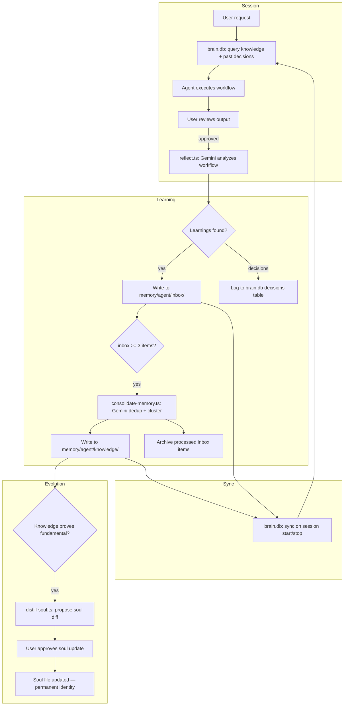
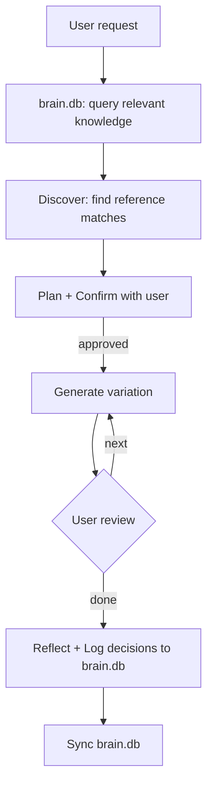

# brain.db — SQLite + FTS5 Memory & Reference Engine

Fast query layer over vault memory and references. MD files remain source of truth — brain.db is a read-optimized index with full-text search.

## Goals

- Sub-millisecond lookups across all agent memory and reference files
- Decision logging with confidence tracking (agents learn from outcomes)
- Session boot/shutdown sync hooks
- Replace file-traversal lookups in agent workflows

## Architecture

```
vault/studio/brain.db              <- single SQLite file, iCloud-synced
vault/studio/memory/               <- MD files remain source of truth
vault/studio/references/           <- indexed separately (heavier, less frequent)
```

### Stack

| Layer | Choice | Why |
|-------|--------|-----|
| SQLite driver | `bun:sqlite` | Built into Bun, zero npm deps, fastest option |
| ORM | `drizzle-orm` | TypeScript-first schemas, works with bun:sqlite natively, no codegen |
| Migrations | `drizzle-kit` (dev) | Auto-generates SQL from schema changes |
| FTS | Raw SQL via `bun:sqlite` | Drizzle has no FTS5 abstraction — use raw for virtual tables |

### Dependencies

```json
{
  "dependencies": {
    "drizzle-orm": "^0.44.0"
  },
  "devDependencies": {
    "drizzle-kit": "^0.31.0"
  }
}
```

### File Structure

```
src/libs/
├── sqlite.ts                <- connection manager (singleton, WAL, pragmas)
├── brain/
│   ├── schema.ts            <- Drizzle table definitions (memories, references, decisions)
│   ├── fts.ts               <- FTS5 virtual tables + triggers (raw SQL)
│   ├── queries.ts           <- reusable query functions (search, decide, recall)
│   ├── sync.ts              <- file hash diffing, memory + reference indexing
│   └── index.ts             <- barrel export

src/tools/
└── brain.ts                 <- CLI + toolDef wrapper (thin layer over libs/brain/)

.claude/skills/brain/
└── SKILL.md                 <- /brain skill for manual sync + query
```

## Schema (Drizzle)

### `src/libs/sqlite.ts` — Connection Manager

```typescript
import { Database } from "bun:sqlite";
import { drizzle } from "drizzle-orm/bun-sqlite";
import * as schema from "./brain/schema";

let _db: ReturnType<typeof drizzle> | null = null;
let _raw: Database | null = null;

export function getDbPath(): string {
  // resolve vault/studio/brain.db via paths.ts
}

export function getDb() {
  if (!_db) {
    _raw = new Database(getDbPath());
    _raw.exec("PRAGMA journal_mode=WAL");
    _raw.exec("PRAGMA busy_timeout=5000");
    _raw.exec("PRAGMA foreign_keys=ON");
    _db = drizzle(_raw, { schema });
  }
  return _db;
}

/** Raw bun:sqlite handle for FTS5 queries that Drizzle can't express */
export function getRawDb(): Database {
  if (!_raw) getDb(); // ensures init
  return _raw!;
}

export function closeDb() {
  if (_raw) { _raw.close(); _raw = null; _db = null; }
}
```

### `src/libs/brain/schema.ts` — Drizzle Tables

```typescript
import { sqliteTable, text, integer, real } from "drizzle-orm/sqlite-core";

export const memories = sqliteTable("memories", {
  id: integer("id").primaryKey({ autoIncrement: true }),
  agent: text("agent").notNull(),
  tier: text("tier").notNull(),           // inbox | knowledge | archive
  title: text("title").notNull(),
  content: text("content").notNull(),
  tags: text("tags"),                     // comma-separated
  sourcePath: text("source_path").notNull().unique(),
  fileHash: text("file_hash").notNull(),
  createdAt: text("created_at").notNull(),
  updatedAt: text("updated_at").notNull(),
});

export const references = sqliteTable("references", {
  id: integer("id").primaryKey({ autoIncrement: true }),
  collection: text("collection").notNull(),  // suno, minimax, lyrics, shared
  title: text("title").notNull(),
  content: text("content").notNull(),
  tags: text("tags"),
  frontmatter: text("frontmatter"),          // JSON blob
  sourcePath: text("source_path").notNull().unique(),
  fileHash: text("file_hash").notNull(),
  updatedAt: text("updated_at").notNull(),
});

export const decisions = sqliteTable("decisions", {
  id: integer("id").primaryKey({ autoIncrement: true }),
  agent: text("agent").notNull(),
  decision: text("decision").notNull(),
  context: text("context").notNull(),
  alternatives: text("alternatives"),
  outcome: text("outcome"),
  confidence: real("confidence").default(0.5),
  tags: text("tags"),
  createdAt: text("created_at").notNull(),
  updatedAt: text("updated_at").notNull(),
});

export const syncMeta = sqliteTable("sync_meta", {
  sourcePath: text("source_path").primaryKey(),
  fileHash: text("file_hash").notNull(),
  tableName: text("table_name").notNull(),   // memories | references
  syncedAt: text("synced_at").notNull(),
});
```

### `src/libs/brain/fts.ts` — FTS5 Virtual Tables (Raw SQL)

Drizzle can't model FTS5 — these are created via raw SQL on init.

```sql
-- FTS5 virtual tables (content-sync with base tables)
CREATE VIRTUAL TABLE IF NOT EXISTS memories_fts USING fts5(
  title, content, tags,
  content=memories, content_rowid=id
);

CREATE VIRTUAL TABLE IF NOT EXISTS references_fts USING fts5(
  title, content, tags,
  content=references, content_rowid=id
);

CREATE VIRTUAL TABLE IF NOT EXISTS decisions_fts USING fts5(
  decision, context, outcome, tags,
  content=decisions, content_rowid=id
);

-- Auto-sync triggers (insert, update, delete for each table)
-- Keeps FTS index in sync without manual management
```

### `src/libs/brain/queries.ts` — Query Functions

```typescript
export function searchMemories(query: string, opts?: { agent?: string; tier?: string; limit?: number });
export function searchReferences(query: string, opts?: { collection?: string; limit?: number });
export function searchDecisions(query: string, opts?: { agent?: string; limit?: number });

export function logDecision(input: { agent: string; decision: string; context: string; alternatives?: string; tags?: string });
export function updateOutcome(id: number, outcome: string, confidence: number);
export function getDecisionHistory(agent: string, opts?: { limit?: number });
```

### `src/libs/brain/sync.ts` — File Sync Engine

```typescript
/** Scan memory files, hash-compare with sync_meta, upsert changed rows */
export async function syncMemories(opts?: { full?: boolean });

/** Scan reference files, hash-compare, upsert changed (separate cycle) */
export async function syncReferences(opts?: { full?: boolean });

/** Quick check — returns { memoriesChanged: number, refsChanged: number } */
export async function checkSync(): Promise<SyncStatus>;

/** Parse MD file → { title, content, tags, frontmatter } */
function parseMemoryFile(path: string): ParsedFile;
function parseReferenceFile(path: string): ParsedFile;
```

## Tool: `brain.ts`

Dual-mode: CLI + toolDef export. Registered in tool registry.

### Commands

| Command | Description |
|---------|-------------|
| `--sync` | Full rebuild — re-index all memory files |
| `--sync-refs` | Full rebuild — re-index all reference files |
| `--check` | Hash diff — sync only changed memory files (fast) |
| `--check-refs` | Hash diff — sync only changed reference files |
| `--query "term"` | FTS5 search across memories (BM25 ranked) |
| `--query-refs "term"` | FTS5 search across references |
| `--decide --agent X --decision "..." --context "..."` | Log a decision |
| `--recall --agent X --pattern "..."` | Search past decisions |
| `--outcome --id N --outcome "..." --confidence 0.8` | Update decision outcome |
| `--stats` | Show counts, last sync time, index health |

### MCP Exposure

Register in freddie-tools MCP server (stdio transport):

| MCP Tool | Maps to |
|----------|---------|
| `brain_query` | `searchMemories()` |
| `brain_query_refs` | `searchReferences()` |
| `brain_decide` | `logDecision()` |
| `brain_recall` | `searchDecisions()` |
| `brain_sync` | `syncMemories() + syncReferences()` |

## Hooks

| Hook | Trigger | Action |
|------|---------|--------|
| Session boot | `user-prompt-submit` (first invocation) | `brain.ts --check` |
| Session exit | before exit | `brain.ts --check` |
| Manual sync | `/brain sync` skill | `brain.ts --sync --sync-refs` |
| On prompt | `user-prompt-submit` | `brain.ts --check` (fast — no-op if hashes match) |

## Decision Logging in reflect.ts

Wire into existing `libs/reflect.ts` post-workflow call:

```typescript
import { logDecision } from "./brain/queries";

// After reflection generates learnings, also extract decisions
const decisions = extractDecisions(reflectionOutput);
for (const d of decisions) {
  await logDecision({
    agent: agentName,
    decision: d.decision,
    context: d.context,
    alternatives: d.alternatives,
    tags: d.tags,
  });
}
```

## .claude/rules/ (new)

Move always-on rules from CLAUDE.md into path-scoped rule files:

```
.claude/rules/
├── memory-boundaries.md     -- globs: ["vault/studio/memory/**"]
├── style-conventions.md     -- globs: ["vault/studio/tracks/**"]
└── output-standards.md      -- globs: ["vault/studio/**"]
```

Rules load automatically when Claude edits files matching their glob patterns.

## The Thinking + Self-Learning Loop

The full autonomous learning cycle, from task execution through soul evolution:



**Three layers, fully autonomous except soul commits:**

| Layer | Trigger | Tool | Output |
|-------|---------|------|--------|
| **1. Reflection** | After every workflow | `reflect.ts` via Gemini | inbox/ files + brain.db decisions |
| **2. Consolidation** | inbox >= 3 items | `consolidate-memory.ts` via Gemini | knowledge/ files (deduped, clustered) |
| **3. Soul Distillation** | Manual / scheduled | `distill-soul.ts` | Proposed diff to soul file (user approves) |

**brain.db's role:** Fast query layer that closes the loop. Agents query past decisions and knowledge *before* making new ones. Decisions accumulate confidence scores over time (tried 3x, worked 2x = 0.67). The learning is not just remembered — it's *used*.

## Agent Decomposition (post brain.db)

Once brain.db enables fast lookups, extract inline knowledge from large agent files:

| Agent file | Current | Target | Extracted to |
|-----------|---------|--------|-------------|
| suno.md | 1711 lines | ~300 lines | vault/studio/references/suno/ (indexed by brain.db) |
| lyrics.md | 748 lines | ~200 lines | vault/studio/references/lyrics/ (indexed by brain.db) |
| minimax.md | 370 lines | ~200 lines | vault/studio/references/minimax/ (already lean) |

Agents query brain.db for platform knowledge instead of carrying it inline.

## Mermaid Workflows in Skills (post decomposition)

Add workflow diagrams to SKILL.md files:



## Implementation Order

### Phase 1: Foundation (libs)
1. [ ] Install `drizzle-orm` + `drizzle-kit`
2. [ ] Create `src/libs/sqlite.ts` — singleton connection, WAL, pragmas, raw handle
3. [ ] Create `src/libs/brain/schema.ts` — Drizzle table definitions
4. [ ] Create `src/libs/brain/fts.ts` — FTS5 virtual tables + triggers (raw SQL)
5. [ ] Create `src/libs/brain/sync.ts` — MD file parser, hash diffing, upsert logic
6. [ ] Create `src/libs/brain/queries.ts` — search, decide, recall, outcome
7. [ ] Create `src/libs/brain/index.ts` — barrel export + init function
8. [ ] Drizzle migration: generate + apply initial schema

### Phase 2: Tool + MCP
9. [ ] Create `src/tools/brain.ts` — CLI + toolDef (all commands)
10. [ ] Register brain tools in MCP server (stdio transport)
11. [ ] Test: full sync of memory files, query, verify BM25 ranking
12. [ ] Test: full sync of reference files, query across collections
13. [ ] Test: decision log + recall + outcome update

### Phase 3: Hooks + integration
14. [ ] Create `/brain` skill (`SKILL.md`) for manual sync + query
15. [ ] Add session boot hook (`user-prompt-submit` → `--check`)
16. [ ] Add session exit hook → `--check`
17. [ ] Wire decision logging into `libs/reflect.ts`
18. [ ] Test: end-to-end workflow — generate track → reflect → decisions in brain.db

### Phase 4: Rules + decomposition
19. [ ] Create `.claude/rules/` with path-scoped rules
20. [ ] Extract suno.md knowledge → reference files (verify brain.db indexes them)
21. [ ] Extract lyrics.md knowledge → reference files
22. [ ] Update agent workflows to query brain.db instead of inline knowledge
23. [ ] Verify agents work correctly with decomposed knowledge

### Phase 5: Workflows + docs
24. [ ] Add mermaid workflow diagrams to each SKILL.md
25. [ ] Document the full thinking + self-learning loop
26. [ ] Update CLAUDE.md architecture section with brain.db
