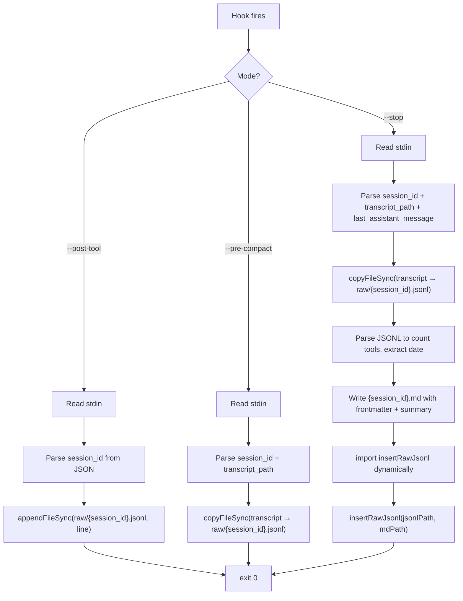

# Capture Raw Hook Script

## Objective

Create `.claude/hooks/capture-raw.ts` -- a single hook script with three modes that automatically captures Claude Code session transcripts to `vault/studio/memory/raw/`. This replaces manual `/save-raw` and `/bye` Phase 1 capture with crash-safe, automatic hook-based capture.

The PostToolUse path is the hot path -- it fires after every tool call and must complete in under 50ms. No brain.db imports, no embedding, no DB writes. Just `appendFileSync`.

## Scope

### Files to create

| File | Action |
|------|--------|
| `.claude/hooks/capture-raw.ts` | **NEW** -- core hook script |

### Dependencies (read-only, do not modify)

| File | Why |
|------|-----|
| `src/libs/paths.ts` | `fromRoot()` for resolving RAW_DIR |
| `src/libs/brain/raw.ts` | `insertRawJsonl()` called from Stop mode (Task OT-0011 creates this; stub-safe -- see notes) |
| `.claude/hooks/tool-call-counter.ts` | Reference pattern for PostToolUse hooks |
| `.claude/hooks/pre-compact-save.ts` | Reference pattern for PreCompact hooks |

## Architecture



## Implementation Details

### CLI interface

```typescript
#!/usr/bin/env bun
// capture-raw.ts -- Auto-capture Claude Code transcripts to memory/raw/
// Three modes: --post-tool, --pre-compact, --stop

const mode = process.argv[2]; // "--post-tool" | "--pre-compact" | "--stop"
```

### Shared constants (top-level, no imports except fs/path and fromRoot)

```typescript
import { appendFileSync, copyFileSync, writeFileSync, mkdirSync, readFileSync, existsSync } from "fs";
import { join } from "path";
import { fromRoot } from "../../src/libs/paths.js";

const RAW_DIR = fromRoot("vault", "studio", "memory", "raw");
mkdirSync(RAW_DIR, { recursive: true });
```

### PostToolUse mode (`--post-tool`)

**Critical: this is the hot path. Must be under 50ms.**

1. Read stdin via `await Bun.stdin.text()`. Claude Code sends a JSON object to stdin on PostToolUse hooks containing tool_name, tool_input, tool_use_id, and session_id.
2. Parse only enough to extract `session_id`. Use `JSON.parse()` -- the input is small.
3. Append the raw stdin line (untouched) to `RAW_DIR/{session_id}.jsonl` using `appendFileSync`.
4. `process.exit(0)` immediately. No stderr output (hooks with stderr on exit 0 are suppressed but still waste time).

```typescript
// PostToolUse stdin shape (from Claude Code docs):
interface PostToolUseInput {
  session_id: string;
  tool_name: string;
  tool_input: Record<string, unknown>;
  tool_use_id: string;
}
```

**Rules:**
- No dynamic imports in this path.
- No brain.db access.
- No embedding.
- No console.log/stderr.
- If stdin parse fails, exit 0 silently (never block Claude Code).

### PreCompact mode (`--pre-compact`)

1. Read stdin via `await Bun.stdin.text()`. PreCompact hooks receive session_id and transcript_path.
2. Parse to extract `session_id` and `transcript_path`.
3. `copyFileSync(transcript_path, join(RAW_DIR, session_id + ".jsonl"))` -- overwrites any partial file from PostToolUse appends with the complete transcript.
4. `process.exit(0)`.

```typescript
// PreCompact stdin shape:
interface PreCompactInput {
  session_id: string;
  transcript_path: string;
}
```

**Rules:**
- If transcript_path doesn't exist or stdin parse fails, exit 0 silently.
- This replaces the partial PostToolUse appends with a complete copy.

### Stop mode (`--stop`)

This is the heavy path. Runs once when the session ends. Acceptable latency: 10-30 seconds.

1. Read stdin via `await Bun.stdin.text()`.
2. Parse to extract `session_id`, `transcript_path`, and `last_assistant_message`.

```typescript
// Stop stdin shape:
interface StopInput {
  session_id: string;
  transcript_path: string;
  last_assistant_message: string;
}
```

3. Copy transcript: `copyFileSync(transcript_path, join(RAW_DIR, session_id + ".jsonl"))`.
4. Parse the JSONL file to build metadata:
   - Count tool calls by tool_name (scan for lines with `"type": "tool_use"` or equivalent).
   - Extract the first message timestamp for `date`.
   - Build `tools_used` as a JSON array of `{ name, count }` objects.
5. Generate `{session_id}.md` with YAML frontmatter:

```markdown
---
ts: {epoch seconds}
date: {YYYY-MM-DD}
session_id: {session_id}
agents: ["freddie"]
skill: null
tags: [auto-captured]
tools_used: [{name: "Read", count: 5}, ...]
format: jsonl
---

# Session {session_id}

{last_assistant_message or "Session ended without summary."}
```

6. Dynamic import brain modules and call indexing:

```typescript
const { initBrain } = await import("../../src/libs/brain/index.js");
const { insertRawJsonl } = await import("../../src/libs/brain/raw.js");
initBrain();
const jsonlPath = join(RAW_DIR, session_id + ".jsonl");
const mdPath = join(RAW_DIR, session_id + ".md");
await insertRawJsonl(jsonlPath, mdPath);
```

7. `process.exit(0)`.

**Rules:**
- Dynamic import of brain modules -- never top-level (would slow PostToolUse if the file were re-evaluated).
- If `insertRawJsonl` doesn't exist yet (Task OT-0011 not complete), catch the import error and log to stderr, exit 0. Do not block.
- Wrap the entire Stop path in try/catch. Exit 0 on any error. Hooks must never block Claude Code.

### Error handling (all modes)

```typescript
try {
  // mode-specific logic
} catch (err) {
  // Never block Claude Code. Silently fail.
  process.exit(0);
}
```

### JSONL parsing helper (Stop mode only)

```typescript
interface ToolCount { name: string; count: number; }

function countToolsFromJsonl(jsonlPath: string): ToolCount[] {
  const content = readFileSync(jsonlPath, "utf-8");
  const counts = new Map<string, number>();
  for (const line of content.split("\n")) {
    if (!line.trim()) continue;
    try {
      const obj = JSON.parse(line);
      // Adapt to actual JSONL structure -- tool_use blocks may be nested
      if (obj.tool_name) {
        counts.set(obj.tool_name, (counts.get(obj.tool_name) ?? 0) + 1);
      }
    } catch { /* skip malformed lines */ }
  }
  return [...counts.entries()].map(([name, count]) => ({ name, count }));
}
```

## Acceptance Criteria

- [ ] PostToolUse mode completes in under 50ms (no brain imports, no DB)
- [ ] PostToolUse appends each tool event as a line to `memory/raw/{session_id}.jsonl`
- [ ] PreCompact copies the full transcript, overwriting partial appends
- [ ] Stop copies transcript, generates `.md` with frontmatter, and calls `insertRawJsonl()`
- [ ] All three modes exit 0 on any error (never block Claude Code)
- [ ] No top-level imports of brain modules (dynamic import in Stop only)
- [ ] File uses `fromRoot()` from `src/libs/paths.ts` for RAW_DIR
- [ ] JSONL file appears in `memory/raw/` after a session with tool calls
- [ ] `.md` file appears in `memory/raw/` after normal session end (Stop)
- [ ] If `insertRawJsonl` is not yet available (OT-0011), Stop still writes files and exits 0
