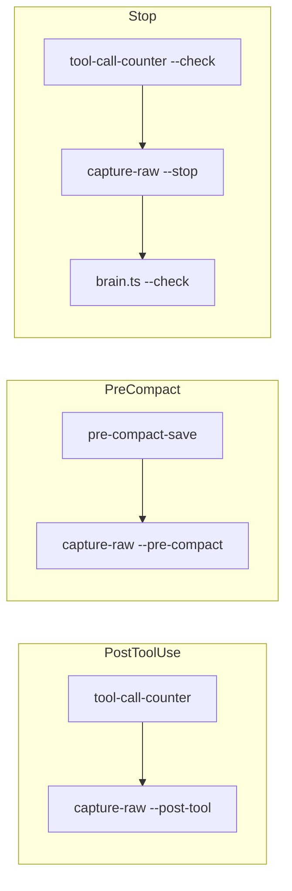

# Hook Registration in settings.json

## Objective

Register the new `capture-raw.ts` hook in `.claude/settings.json` for all three hook events: PostToolUse, PreCompact, and Stop. Order matters -- capture-raw must run before `brain.ts --check` in Stop so the files it writes get indexed in the same brain sync.

## Scope

### Files to modify

| File | Action |
|------|--------|
| `.claude/settings.json` | **MODIFY** -- add capture-raw hook to three events |

## Current State

The current hooks configuration:

```json
"hooks": {
  "SessionStart": [
    { "matcher": "", "hooks": [
      { "type": "command", "command": "bun \"$CLAUDE_PROJECT_DIR/.claude/hooks/tool-call-counter.ts\" --reset" },
      { "type": "command", "command": "bun \"$CLAUDE_PROJECT_DIR/src/tools/brain.ts\" --check" }
    ]}
  ],
  "PostToolUse": [
    { "matcher": "", "hooks": [
      { "type": "command", "command": "bun \"$CLAUDE_PROJECT_DIR/.claude/hooks/tool-call-counter.ts\"" }
    ]}
  ],
  "Stop": [
    { "matcher": "", "hooks": [
      { "type": "command", "command": "bun \"$CLAUDE_PROJECT_DIR/.claude/hooks/tool-call-counter.ts\" --check" },
      { "type": "command", "command": "bun \"$CLAUDE_PROJECT_DIR/src/tools/brain.ts\" --check" }
    ]}
  ],
  "PreCompact": [
    { "matcher": "", "hooks": [
      { "type": "command", "command": "bun \"$CLAUDE_PROJECT_DIR/.claude/hooks/pre-compact-save.ts\"" }
    ]}
  ]
}
```

## Target State

```json
"hooks": {
  "SessionStart": [
    { "matcher": "", "hooks": [
      { "type": "command", "command": "bun \"$CLAUDE_PROJECT_DIR/.claude/hooks/tool-call-counter.ts\" --reset" },
      { "type": "command", "command": "bun \"$CLAUDE_PROJECT_DIR/src/tools/brain.ts\" --check" }
    ]}
  ],
  "PostToolUse": [
    { "matcher": "", "hooks": [
      { "type": "command", "command": "bun \"$CLAUDE_PROJECT_DIR/.claude/hooks/tool-call-counter.ts\"" },
      { "type": "command", "command": "bun \"$CLAUDE_PROJECT_DIR/.claude/hooks/capture-raw.ts\" --post-tool" }
    ]}
  ],
  "Stop": [
    { "matcher": "", "hooks": [
      { "type": "command", "command": "bun \"$CLAUDE_PROJECT_DIR/.claude/hooks/tool-call-counter.ts\" --check" },
      { "type": "command", "command": "bun \"$CLAUDE_PROJECT_DIR/.claude/hooks/capture-raw.ts\" --stop" },
      { "type": "command", "command": "bun \"$CLAUDE_PROJECT_DIR/src/tools/brain.ts\" --check" }
    ]}
  ],
  "PreCompact": [
    { "matcher": "", "hooks": [
      { "type": "command", "command": "bun \"$CLAUDE_PROJECT_DIR/.claude/hooks/pre-compact-save.ts\"" },
      { "type": "command", "command": "bun \"$CLAUDE_PROJECT_DIR/.claude/hooks/capture-raw.ts\" --pre-compact" }
    ]}
  ]
}
```

## Implementation Details

### Hook ordering rationale



**PostToolUse:** capture-raw runs after tool-call-counter. Both are fast (<50ms). Order doesn't strictly matter, but counter first is consistent with existing behavior.

**PreCompact:** capture-raw runs after pre-compact-save. Both are fast. pre-compact-save preserves session state; capture-raw copies the transcript.

**Stop (order is critical):**
1. `tool-call-counter.ts --check` -- may emit compact warning (fast)
2. `capture-raw.ts --stop` -- writes .jsonl + .md files to memory/raw/ and indexes to brain.db
3. `brain.ts --check` -- syncs brain.db, which will pick up the new raw files

capture-raw MUST come before brain.ts --check. If reversed, brain.ts would sync without the new raw files, and they'd only be indexed on the next session start.

### Changes to make

1. In the `PostToolUse` array, add a second hook entry after tool-call-counter:
   ```json
   { "type": "command", "command": "bun \"$CLAUDE_PROJECT_DIR/.claude/hooks/capture-raw.ts\" --post-tool" }
   ```

2. In the `PreCompact` array, add a second hook entry after pre-compact-save:
   ```json
   { "type": "command", "command": "bun \"$CLAUDE_PROJECT_DIR/.claude/hooks/capture-raw.ts\" --pre-compact" }
   ```

3. In the `Stop` array, insert a new hook entry BETWEEN tool-call-counter --check and brain.ts --check:
   ```json
   { "type": "command", "command": "bun \"$CLAUDE_PROJECT_DIR/.claude/hooks/capture-raw.ts\" --stop" }
   ```

### Do NOT change

- SessionStart hooks -- capture-raw does not run on session start
- The `permissions` section -- no changes needed
- Existing hook commands -- keep all existing hooks exactly as they are

## Acceptance Criteria

- [ ] PostToolUse has two hooks: tool-call-counter then capture-raw --post-tool
- [ ] PreCompact has two hooks: pre-compact-save then capture-raw --pre-compact
- [ ] Stop has three hooks in order: tool-call-counter --check, capture-raw --stop, brain.ts --check
- [ ] SessionStart is unchanged
- [ ] All hook commands use `$CLAUDE_PROJECT_DIR` path prefix with quoted paths
- [ ] JSON is valid (run `bun -e "JSON.parse(require('fs').readFileSync('.claude/settings.json','utf-8'))"` to verify)
- [ ] No other sections of settings.json are modified
