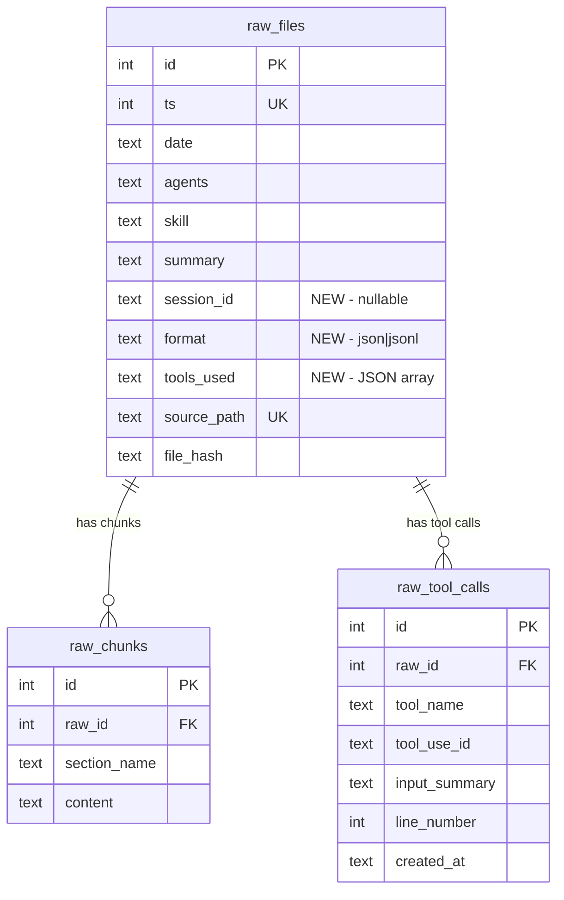

# Schema Evolution for Raw Context

## Objective

Extend brain.db schema to support JSONL-based raw files and per-tool-call indexing. Add new columns to `raw_files`, create new `raw_tool_calls` table, and add idempotent ALTER TABLE migrations. All changes must preserve existing data.

## Scope

### Files to modify

| File | Action | What changes |
|------|--------|-------------|
| `src/libs/brain/schema.ts` | **MODIFY** | Add `rawToolCalls` table definition, add new columns to `rawFiles` |
| `src/libs/brain/index.ts` | **MODIFY** | Add `raw_tool_calls` CREATE TABLE, add ALTER TABLE migrations |

## Implementation Details

### 1. schema.ts -- New columns on rawFiles

Add three new columns to the existing `rawFiles` table definition. Place them after the existing `summary` column, before `sourcePath`:

```typescript
export const rawFiles = sqliteTable("raw_files", {
  id: integer("id").primaryKey({ autoIncrement: true }),
  ts: integer("ts").notNull().unique(),
  date: text("date").notNull(),
  agents: text("agents").notNull(),
  skill: text("skill"),
  tags: text("tags"),
  summary: text("summary"),
  // --- NEW COLUMNS ---
  sessionId: text("session_id"),           // Claude Code session UUID
  format: text("format").default("json"),  // "json" | "jsonl"
  toolsUsed: text("tools_used"),           // JSON: [{ name: "Read", count: 5 }, ...]
  // --- END NEW ---
  sourcePath: text("source_path").notNull().unique(),
  fileHash: text("file_hash").notNull(),
  createdAt: text("created_at").notNull(),
});
```

**Notes:**
- `sessionId` is nullable -- old `.json` files don't have it.
- `format` defaults to `"json"` so existing rows are consistent.
- `toolsUsed` is a JSON string. Not normalized -- tool-level queries go through `raw_tool_calls`.

### 2. schema.ts -- New rawToolCalls table

Add after the `rawChunks` definition:

```typescript
/** Individual tool calls extracted from raw JSONL sessions */
export const rawToolCalls = sqliteTable("raw_tool_calls", {
  id: integer("id").primaryKey({ autoIncrement: true }),
  rawId: integer("raw_id").notNull(),             // FK to raw_files.id
  toolName: text("tool_name").notNull(),           // e.g. "Read", "Bash", "Write"
  toolUseId: text("tool_use_id"),                  // Claude's tool_use block ID
  inputSummary: text("input_summary"),             // truncated first ~200 chars of input
  lineNumber: integer("line_number"),              // line index in the .jsonl file
  createdAt: text("created_at").notNull(),
});
```

### 3. index.ts -- CREATE TABLE for raw_tool_calls

Add after the raw_chunks CREATE TABLE block (around line 202):

```sql
CREATE TABLE IF NOT EXISTS raw_tool_calls (
  id INTEGER PRIMARY KEY AUTOINCREMENT,
  raw_id INTEGER NOT NULL,
  tool_name TEXT NOT NULL,
  tool_use_id TEXT,
  input_summary TEXT,
  line_number INTEGER,
  created_at TEXT NOT NULL
);
```

Add indexes after the CREATE:

```sql
CREATE INDEX IF NOT EXISTS idx_raw_tool_calls_tool ON raw_tool_calls(tool_name);
CREATE INDEX IF NOT EXISTS idx_raw_tool_calls_raw_id ON raw_tool_calls(raw_id);
```

**Placement:** After line 204 (`CREATE INDEX IF NOT EXISTS idx_raw_chunks_source ON raw_chunks(file_hash);`), before the migrations section.

### 4. index.ts -- ALTER TABLE migrations

Add to the migrations block (after line 217, where existing ALTER TABLE statements are):

```typescript
// Raw files schema evolution — JSONL support
try { raw.exec("ALTER TABLE raw_files ADD COLUMN session_id TEXT"); } catch {}
try { raw.exec("ALTER TABLE raw_files ADD COLUMN format TEXT DEFAULT 'json'"); } catch {}
try { raw.exec("ALTER TABLE raw_files ADD COLUMN tools_used TEXT"); } catch {}
```

**Pattern:** Matches the existing migration style -- each ALTER wrapped in try/catch for idempotency. SQLite throws if column already exists; catch silences it.

### 5. index.ts -- Unique index on session_id

Add after the raw_files indexes (around line 183):

```sql
CREATE UNIQUE INDEX IF NOT EXISTS idx_raw_files_session ON raw_files(session_id) WHERE session_id IS NOT NULL;
```

This is a partial unique index -- only enforced when session_id is non-null. Old `.json` files with null session_id are unaffected.

## Data flow diagram



## Constraints

- **Do NOT modify existing table structures.** Only add columns via ALTER TABLE.
- **Do NOT drop or recreate raw_files.** Existing data must survive.
- **All migrations must be idempotent.** Running initBrain() twice must not error.
- **Column defaults must be backward-compatible.** `format` defaults to `"json"` so existing rows describe their actual format.

## Acceptance Criteria

- [ ] `rawToolCalls` table defined in schema.ts with all columns matching SQL
- [ ] `rawFiles` in schema.ts has `sessionId`, `format`, and `toolsUsed` columns
- [ ] `raw_tool_calls` CREATE TABLE in index.ts with both indexes
- [ ] Three ALTER TABLE migrations for raw_files new columns, each in try/catch
- [ ] Partial unique index on raw_files.session_id (WHERE session_id IS NOT NULL)
- [ ] `initBrain()` runs without error on a fresh database
- [ ] `initBrain()` runs without error on an existing database with old raw_files data
- [ ] No existing table structures are dropped or recreated
