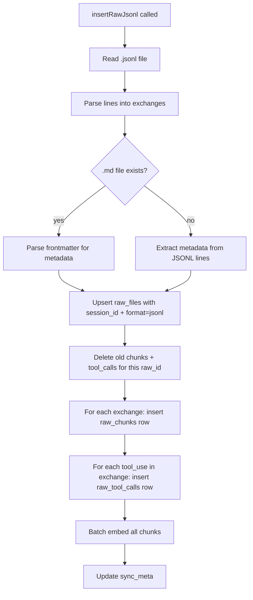

# JSONL Indexing with Exchange-Level Chunking

## Objective

Add `insertRawJsonl()` to `src/libs/brain/raw.ts` -- the indexing function for `.jsonl` raw files. Groups JSONL lines into exchanges (user turn + all assistant responses until next user turn), creates one `raw_chunks` row per exchange, and populates `raw_tool_calls` for each tool_use block found.

Also update `findRawFiles()` and `syncRaw()` to handle both `.json` and `.jsonl` formats.

## Scope

### Files to modify

| File | Action | What changes |
|------|--------|-------------|
| `src/libs/brain/raw.ts` | **MODIFY** | Add `insertRawJsonl()`, update `findRawFiles()`, update `syncRaw()` |

### Dependencies (read-only)

| File | Why |
|------|-----|
| `src/libs/brain/schema.ts` | `rawToolCalls` table definition (from OT-0010) |
| `src/libs/brain/index.ts` | `raw_tool_calls` CREATE TABLE (from OT-0010) |
| `src/libs/embeddings.ts` | `embedBatch()`, `vectorToBuffer()`, `EMBEDDING_CONFIG` |
| `src/libs/sqlite.ts` | `getRawDb()` |

## Architecture



## Implementation Details

### 1. Exchange grouping logic

An "exchange" is one user turn plus all subsequent assistant content until the next user turn. This groups related conversation into meaningful searchable units.

```typescript
interface Exchange {
  index: number;           // 0-based exchange number
  userContent: string;     // user's message text
  assistantContent: string; // concatenated assistant responses
  toolCalls: ToolCallInfo[];
  lineStart: number;       // first JSONL line index
  lineEnd: number;         // last JSONL line index
}

interface ToolCallInfo {
  toolName: string;
  toolUseId: string | null;
  inputSummary: string;    // first ~200 chars of stringified input
  lineNumber: number;
}
```

**Parsing logic:**

```typescript
function parseExchanges(jsonlContent: string): Exchange[] {
  const lines = jsonlContent.split("\n").filter(l => l.trim());
  const exchanges: Exchange[] = [];
  let current: Exchange | null = null;

  for (let i = 0; i < lines.length; i++) {
    let obj: any;
    try { obj = JSON.parse(lines[i]); } catch { continue; }

    // Adapt to Claude Code's actual JSONL structure:
    // Lines may have { type: "user", message: { ... } } or similar.
    // The exact structure depends on Claude Code's transcript format.
    // Key heuristic: if the line represents a user turn, start a new exchange.
    
    if (isUserTurn(obj)) {
      if (current) exchanges.push(current);
      current = {
        index: exchanges.length,
        userContent: extractUserText(obj),
        assistantContent: "",
        toolCalls: [],
        lineStart: i,
        lineEnd: i,
      };
    } else if (current) {
      current.lineEnd = i;
      if (isAssistantText(obj)) {
        current.assistantContent += extractAssistantText(obj) + "\n";
      }
      if (isToolUse(obj)) {
        current.toolCalls.push({
          toolName: extractToolName(obj),
          toolUseId: extractToolUseId(obj),
          inputSummary: extractInputSummary(obj),
          lineNumber: i,
        });
      }
    }
  }
  if (current) exchanges.push(current);
  return exchanges;
}
```

**Important:** The exact JSONL line structure depends on Claude Code's transcript format. Wick must inspect an actual `.jsonl` transcript file (from PostToolUse appends or a Claude Code session file) to determine the correct field names. The logic above is the structural pattern -- field access needs adaptation.

**Fallback:** If the JSONL structure can't be reliably parsed (unknown format), fall back to treating each line as its own chunk (one `raw_chunks` row per line). This ensures forward compatibility.

### 2. insertRawJsonl() function signature

```typescript
export async function insertRawJsonl(
  jsonlPath: string,
  mdPath?: string,
  opts?: { skipEmbed?: boolean }
): Promise<{
  rawId: number;
  chunksCreated: number;
  chunksEmbedded: number;
  toolCallsIndexed: number;
}>
```

### 3. insertRawJsonl() implementation steps

Follow the same pattern as `insertRawFile()` (lines 102-233 of raw.ts):

**Step 1 -- Read and hash:**
```typescript
const jsonlContent = readFileSync(jsonlPath, "utf-8");
const hash = hashFile(jsonlContent);
const sourcePath = relative(VAULT_STUDIO, jsonlPath).replace(/\\/g, "/");
```

**Step 2 -- Check sync_meta for unchanged files:**
```typescript
const existing = rawDb.prepare("SELECT id, file_hash FROM raw_files WHERE source_path = ?")
  .get(sourcePath) as { id: number; file_hash: string } | null;
if (existing && existing.file_hash === hash) {
  return { rawId: existing.id, chunksCreated: 0, chunksEmbedded: 0, toolCallsIndexed: 0 };
}
```

**Step 3 -- Extract metadata:**

If `mdPath` exists, parse YAML frontmatter for `ts`, `date`, `session_id`, `agents`, `skill`, `tags`, `summary`, `tools_used`. Use a simple frontmatter parser (split on `---` lines, parse key-value).

If no `.md` file, extract from JSONL:
- `ts`: epoch seconds from first line's timestamp, or file mtime
- `date`: derived from `ts`
- `session_id`: extract from filename (pattern: `{session_id}.jsonl`)
- `agents`: default to `["freddie"]`
- `tools_used`: computed from exchange tool calls

**Step 4 -- Upsert raw_files:**
```typescript
rawDb.prepare(`
  INSERT INTO raw_files (ts, date, agents, skill, tags, summary, session_id, format, tools_used, source_path, file_hash, created_at)
  VALUES (?, ?, ?, ?, ?, ?, ?, 'jsonl', ?, ?, ?, ?)
  ON CONFLICT(source_path) DO UPDATE SET
    ts=excluded.ts, date=excluded.date, agents=excluded.agents,
    skill=excluded.skill, tags=excluded.tags, summary=excluded.summary,
    session_id=excluded.session_id, format=excluded.format, tools_used=excluded.tools_used,
    file_hash=excluded.file_hash
`).run(fileTs, date, agents, skill, tagsStr, summary, sessionId, toolsUsedJson, sourcePath, hash, ts);
```

**Note on ts UNIQUE constraint:** The `ts` column has a UNIQUE constraint. For JSONL files, use the epoch seconds from the first JSONL line timestamp. If that collides with an existing row, increment by 1 until unique (same collision-resolution pattern as `src/libs/raw.ts` line 97-106, but for the integer ts value).

**Step 5 -- Get raw_id and clean old data:**
```typescript
const row = rawDb.prepare("SELECT id FROM raw_files WHERE source_path = ?").get(sourcePath);
const rawId = row.id;

// Delete old chunks
rawDb.exec("DELETE FROM raw_chunks WHERE raw_id = ?", [rawId]);
// Delete old vec_raw entries (get chunk IDs first, then delete)
// Delete old tool calls
rawDb.exec("DELETE FROM raw_tool_calls WHERE raw_id = ?", [rawId]);
```

**Step 6 -- Parse exchanges and insert chunks:**
```typescript
const exchanges = parseExchanges(jsonlContent);
const pendingEmbeds: { chunkId: number; content: string }[] = [];

for (const ex of exchanges) {
  const searchText = [ex.userContent, ex.assistantContent].filter(Boolean).join("\n");
  if (!searchText.trim()) continue;

  const sectionName = `exchange-${ex.index}`;
  const chunkResult = rawDb.prepare(`
    INSERT INTO raw_chunks (raw_id, section_name, content, line_start, line_end, token_count, file_hash, created_at, updated_at)
    VALUES (?, ?, ?, ?, ?, ?, ?, ?, ?)
  `).run(rawId, sectionName, searchText, ex.lineStart, ex.lineEnd, Math.ceil(searchText.length / 4), hash, ts, ts);

  const chunkId = Number(chunkResult.lastInsertRowid);
  pendingEmbeds.push({ chunkId, content: searchText });
}
```

**Step 7 -- Insert raw_tool_calls:**
```typescript
let toolCallsIndexed = 0;
for (const ex of exchanges) {
  for (const tc of ex.toolCalls) {
    rawDb.prepare(`
      INSERT INTO raw_tool_calls (raw_id, tool_name, tool_use_id, input_summary, line_number, created_at)
      VALUES (?, ?, ?, ?, ?, ?)
    `).run(rawId, tc.toolName, tc.toolUseId, tc.inputSummary, tc.lineNumber, ts);
    toolCallsIndexed++;
  }
}
```

**Step 8 -- Batch embed:** Same pattern as `insertRawFile()` lines 203-229.

**Step 9 -- Update sync_meta:** Same pattern as `insertRawFile()` lines 193-198.

### 4. Update findRawFiles()

Current implementation (line 56-60) only finds `.json` files. Update to find both:

```typescript
function findRawFiles(): { path: string; format: "json" | "jsonl" }[] {
  if (!existsSync(RAW_DIR)) return [];
  return readdirSync(RAW_DIR, { withFileTypes: true })
    .filter(e => e.isFile() && (e.name.endsWith(".json") || e.name.endsWith(".jsonl")))
    .map(e => ({
      path: join(RAW_DIR, e.name),
      format: e.name.endsWith(".jsonl") ? "jsonl" as const : "json" as const,
    }));
}
```

### 5. Update syncRaw()

Current implementation (line 241-278) calls `insertRawFile()` for everything. Update to dispatch by format:

```typescript
export async function syncRaw(opts?: { full?: boolean }): Promise<RawSyncResult> {
  const rawDb = getRawDb();
  const files = findRawFiles();

  if (opts?.full) {
    rawDb.exec("DELETE FROM raw_chunks");
    rawDb.exec("DELETE FROM vec_raw");
    rawDb.exec("DELETE FROM raw_files");
    rawDb.exec("DELETE FROM raw_tool_calls");  // NEW: also clear tool calls
    rawDb.exec("DELETE FROM sync_meta WHERE table_name = 'raw_files'");
  }

  let filesProcessed = 0;
  let chunksCreated = 0;
  let chunksEmbedded = 0;
  let chunksFailed = 0;

  for (const file of files) {
    const content = readFileSync(file.path, "utf-8");
    const hash = hashFile(content);
    const sourcePath = relative(VAULT_STUDIO, file.path).replace(/\\/g, "/");

    const existing = rawDb.prepare("SELECT file_hash FROM sync_meta WHERE source_path = ?")
      .get(sourcePath) as { file_hash: string } | null;
    if (existing && existing.file_hash === hash && !opts?.full) continue;

    try {
      if (file.format === "jsonl") {
        // Look for companion .md file
        const mdPath = file.path.replace(/\.jsonl$/, ".md");
        const mdExists = existsSync(mdPath) ? mdPath : undefined;
        const result = await insertRawJsonl(file.path, mdExists);
        chunksCreated += result.chunksCreated;
        chunksEmbedded += result.chunksEmbedded;
      } else {
        const result = await insertRawFile(file.path);
        chunksCreated += result.chunksCreated;
        chunksEmbedded += result.chunksEmbedded;
      }
      filesProcessed++;
    } catch {
      chunksFailed++;
    }
  }

  return { filesProcessed, chunksCreated, chunksEmbedded, chunksFailed };
}
```

### 6. Do NOT modify insertRawFile()

The existing `insertRawFile()` function (lines 102-233) handles `.json` files. It must remain unchanged for backward compatibility. Old `.json` raw files continue to index through this path.

## Constraints

- **Backward compatibility is mandatory.** Existing `.json` files must still sync correctly via `insertRawFile()`.
- **Exchange grouping is best-effort.** If JSONL structure is unexpected, fall back to per-line chunking rather than failing.
- **Input summary truncation:** `inputSummary` in `raw_tool_calls` should be truncated to 200 characters max. Don't store full tool inputs.
- **Batch embedding:** Use the same `embedBatch()` + `vectorToBuffer()` pattern as `insertRawFile()`. Don't introduce new embedding patterns.

## Acceptance Criteria

- [ ] `insertRawJsonl(jsonlPath, mdPath?, opts?)` exported from raw.ts
- [ ] Exchange-level chunking: user turn + assistant responses grouped as one chunk
- [ ] `raw_tool_calls` populated for each tool_use block in the JSONL
- [ ] `raw_files` row has `session_id`, `format='jsonl'`, `tools_used` populated
- [ ] `findRawFiles()` returns both `.json` and `.jsonl` files with format tag
- [ ] `syncRaw()` dispatches to correct function by format
- [ ] `syncRaw({ full: true })` also clears `raw_tool_calls`
- [ ] Existing `insertRawFile()` is NOT modified
- [ ] Old `.json` files in memory/raw/ still index correctly through syncRaw
- [ ] Companion `.md` file is used for metadata when present
- [ ] Input summaries truncated to 200 chars
- [ ] Embeddings created for all exchange chunks via `embedBatch()`
