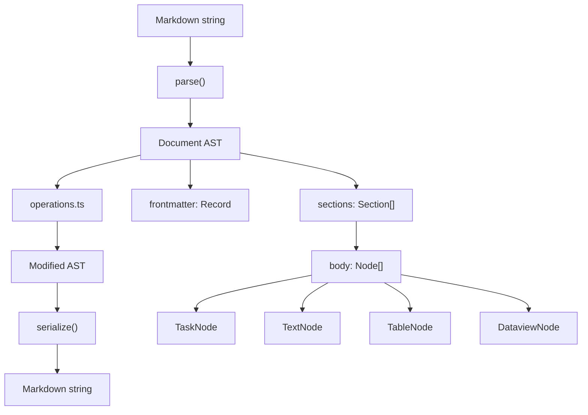

# Obsidian-Flavored Markdown Parsing Library

## Objective

Build `src/libs/obsidian-md/` -- a zero-dependency, roundtrip-safe parser/serializer for the project's Obsidian vault markdown. Three layers: parse/serialize, typed models, AST operations. This is a NEW library -- the existing `src/libs/sections.ts` and `src/tools/obsidian/*.ts` stay untouched. Migration is a separate task.

## Architecture

```
src/libs/obsidian-md/
  index.ts          -- re-exports everything
  types.ts          -- all interfaces, types, enums
  parser.ts         -- parse(markdown) -> Document
  serializer.ts     -- serialize(Document) -> markdown
  operations.ts     -- section ops, task ops, carry-forward
```



## Constraints

- **Zero external dependencies.** No remark, marked, yaml, etc. Use the existing `src/libs/frontmatter.ts` for frontmatter parsing/serialization (it already handles YAML frontmatter, inline arrays, multi-line lists, wikilink quoting).
- **Roundtrip-safe.** `serialize(parse(text)) === text` for unchanged documents. Every node stores its `raw` source line(s). Serializer emits `raw` unless the node was mutated (tracked via a `dirty` flag).
- **TypeScript, Bun runtime.** No browser compat needed.
- **All patterns from actual vault notes must parse correctly.** See "Markdown Patterns" section below.

## Markdown Patterns (observed in vault)

These are the actual patterns found in daily notes, weekly summaries, and meeting notes. The parser MUST handle all of them.

### Frontmatter

```yaml
---
id: daily-20260401
title: 2026-04-01
tags: [daily]
connected:
  - "[[notes/daily/2026-03-31]]"
---
```

Reuse `parseFrontmatter()` and `serializeFrontmatter()` from `src/libs/frontmatter.ts`. Do NOT reimplement.

### Headings

```markdown
## Tasks
## Log
## Session Work
### Odelon Miranda
```

Level 2 (`##`) are section boundaries. Level 3 (`###`) are subsection headers within a section body.

### Tasks with bracket IDs

```markdown
- [ ] [1] Task text
- [x] [6] Completed task ✅ 2026-03-31
- [/] [3] In-progress task
- [>] [1] ~~Deferred text~~ → [[notes/daily/2026-04-01|04-01]]
- [-] [10] [log] Cancelled task ❌ 2026-03-31 - reason
- [!] [2] Urgent task
- [?] [4] Question task
```

### Sub-tasks (indented, dotted IDs)

```markdown
- [ ] [5] Parent task
  - [ ] [5.1] Sub-task one
  - [x] [5.2] Sub-task two
  - [ ] [5.3] Sub-task three
```

Two-space indent. IDs are `{parent}.{child}` format. Sub-tasks can have carry-forward links and doc links just like top-level tasks.

### Group labels (bold, non-checkbox)

```markdown
- **[3] OT-1598: Continue working on auth**
- **[4] ~~Moved group~~ → [[notes/daily/2026-03-24|03-24]]**
```

These are task group headers. They use bold `**`, have bracket IDs, but no checkbox. They can have sub-tasks beneath them.

### Doc link references

```markdown
- [x] [9] Task text (📄 [[notes/docs/prompt-builder-engine|1]] [[notes/docs/prompt-builder-phase1-session2|5]])
```

The `(📄 ...)` block contains numbered wikilinks. Multiple docs are space-separated inside the parens.

### Carry-forward chains

```markdown
- [ ] [1] Task text ← [[notes/daily/2026-03-24|03-24]] ← [[notes/daily/2026-03-25|03-25]]
```

Each `← [[path|alias]]` is a history entry showing which daily note the task was carried from. Forward arrows `→ [[path|alias]]` indicate where a deferred task was sent.

### Deferred tasks (strikethrough + arrow)

```markdown
- [>] [1] ~~Original text ← [[...]] ← [[...]]~~ → [[notes/daily/2026-04-01|04-01]]
```

The entire content is wrapped in `~~strikethrough~~`, followed by `→` and the target link.

### Completion markers

```markdown
- [x] [9] Task text ✅ 2026-03-31
- [-] [10] Cancelled task ❌ 2026-03-31 - reason
```

Completion date after checkmark emoji. Cancellation uses ❌ with optional reason after ` - `.

### Dataview inline JS

```markdown
| Tasks completed | `$= const t = dv.current().file.tasks.where(t => t.section.subpath === "Tasks"); dv.span(t.where(t => t.completed).length + "/" + t.length)` |
```

These are backtick-wrapped JS expressions starting with `$=`. They appear inside table cells. The parser must preserve them verbatim.

### Wikilinks

```markdown
[[notes/daily/2026-03-31]]
[[notes/daily/2026-03-31|03-31]]
[[notes/meetings/2026-03-23-skill-demo-mike-sev]]
```

Path only, or path with `|alias`.

### Tables

```markdown
| Metric | Count |
|--------|-------|
| Tasks completed | value |
```

Standard markdown tables. Preserve alignment and cell content exactly.

### Regular list items

```markdown
- 7:54 AM — Dev session: freddie-ai — description
- CLI-only for all tool calls — detail
- **Test result — description:** detail text
```

Non-task list items (no checkbox). Used in Log, Decisions, Learned, Notes sections.

### Subsection headers within sections

```markdown
## Session Work
### Tested /create-track pipeline end-to-end
### Dev session: Phase 1 Suno Style Builder
```

### Focus areas line

```markdown
**Focus areas:** (pending)
**Focus areas:** Suno vocal production, music cards
```

Special bold line in Summary section.

### Meeting note patterns

```markdown
## Action Items
- [ ] **Odelon** — Submit PR for 60-min token refresh cycle
- [ ] **Team** — Investigate locking AirTable view
```

Bold name prefix on action items.

## File-by-File Spec

### 1. `types.ts`

All types and interfaces. No logic, no imports beyond TypeScript built-ins.

```typescript
// ── Status ────────────────────────────────────────────────────────────

export type TaskStatus = 'todo' | 'done' | 'in_progress' | 'deferred' | 'cancelled' | 'urgent' | 'question';

export const STATUS_CHARS: Record<string, TaskStatus> = {
  ' ': 'todo',
  'x': 'done',
  'X': 'done',
  '/': 'in_progress',
  '>': 'deferred',
  '-': 'cancelled',
  '!': 'urgent',
  '?': 'question',
};

export const STATUS_TO_CHAR: Record<TaskStatus, string> = {
  todo: ' ',
  done: 'x',
  in_progress: '/',
  deferred: '>',
  cancelled: '-',
  urgent: '!',
  question: '?',
};

// ── Wikilinks ─────────────────────────────────────────────────────────

export interface Wikilink {
  path: string;        // "notes/daily/2026-03-31"
  alias?: string;      // "03-31"
}

export interface DocLink {
  path: string;        // "notes/docs/prompt-builder-engine"
  number: number;      // 1
}

// ── Nodes ─────────────────────────────────────────────────────────────

export type NodeType = 'task' | 'text' | 'heading' | 'table' | 'blank';

export interface BaseNode {
  type: NodeType;
  line: number;        // 1-based source line number
  raw: string;         // original line text (or multi-line for tables)
  dirty: boolean;      // true if mutated since parse
}

export interface Task extends BaseNode {
  type: 'task';
  id: string;              // "5", "5.3" — from [N] or [N.M] bracket. Empty string if no bracket ID.
  status: TaskStatus;
  content: string;         // text after the bracket (without doc links, carry links)
  subtasks: Task[];        // nested children
  indent: number;          // character count of leading whitespace
  links: DocLink[];        // (📄 [[...]]) refs
  history: Wikilink[];     // ← [[...]] chain (carried-from)
  forward?: Wikilink;      // → [[...]] (deferred-to)
  completion?: string;     // "2026-03-31" from ✅
  cancellation?: string;   // "2026-03-31" from ❌
  cancelReason?: string;   // text after " - " following ❌ date
  isLabel: boolean;        // true for group labels: - **[N] text**
  isStrikethrough: boolean; // true if content is wrapped in ~~
}

export interface TextNode extends BaseNode {
  type: 'text';
  content: string;         // the line text
}

export interface HeadingNode extends BaseNode {
  type: 'heading';
  level: number;           // 3 for ###
  content: string;         // heading text
}

export interface TableNode extends BaseNode {
  type: 'table';
  headers: string[];       // column headers
  rows: string[][];        // cell values (preserve dataview expressions verbatim)
  rawLines: string[];      // all original lines for roundtrip
}

export interface BlankNode extends BaseNode {
  type: 'blank';
}

export type Node = Task | TextNode | HeadingNode | TableNode | BlankNode;

// ── Section ───────────────────────────────────────────────────────────

export interface Section {
  heading: string;         // "Tasks", "Log", "Session Work"
  level: number;           // 2 for ##
  body: Node[];            // child nodes
  line: number;            // 1-based line of the ## heading
  raw: string;             // original heading line
}

// ── Document ──────────────────────────────────────────────────────────

export interface Document {
  frontmatter: Record<string, any>;  // parsed YAML
  frontmatterRaw: string;            // original --- block for roundtrip
  preamble: Node[];                  // nodes between frontmatter and first ##
  sections: Section[];
  raw: string;                       // full original text
}

// ── Filters ───────────────────────────────────────────────────────────

export interface TaskFilter {
  status?: TaskStatus | TaskStatus[];
  search?: string;                   // case-insensitive substring
  hasDocLinks?: boolean;
  hasHistory?: boolean;
}

export interface MoveOpts {
  under?: string;     // reparent under this task ID
  toTop?: boolean;    // promote sub-task to top-level
  before?: string;    // insert before this task ID
  after?: string;     // insert after this task ID
}
```

### 2. `parser.ts`

Single export: `parse(markdown: string): Document`

**Algorithm:**

1. Split input into lines. Store as `raw` on the Document.
2. Detect frontmatter: find first `---` and second `---`. Extract raw block. Parse via `parseFrontmatter()` from `src/libs/frontmatter.ts`.
3. Walk remaining lines. Track current section (null until first `##`).
4. For each line, classify:
   - `## Heading` → start new Section (level 2). Close previous section.
   - `### Heading` → HeadingNode inside current section body (level 3+).
   - Blank line → BlankNode.
   - `| ... |` → start or continue a TableNode (consecutive pipe lines form one table).
   - `- [x] ...` / `- [ ] ...` etc. → Task node (parse status, ID, content, links).
   - `  - [x] ...` → Sub-task. Attach to the most recent top-level task or label.
   - `- **[N] ...**` → Label task (isLabel: true).
   - Everything else → TextNode.
5. Lines before the first `##` (after frontmatter) go into `preamble`.

**Task line parsing** (the most complex part):

```
Pattern: /^(\s*)- (\[(.)\] )?(\*\*)?(?:\[(\d+(?:\.\d+)*)\]\s*)?(.+?)(\*\*)?$/
```

But this is too brittle for a single regex. Instead, use sequential extraction:

1. Measure indent (`indent`).
2. Check for label: starts with `- **[`.
3. Extract checkbox: `- [X] ` where X is any char. Map to TaskStatus.
4. Extract bracket ID: `[5]` or `[5.3]`.
5. Extract doc links: `(📄 [[path|N]] [[path|N]])`.
6. Extract carry-forward history: all `← [[path|alias]]` occurrences.
7. Extract forward link: `→ [[path|alias]]`.
8. Extract completion: `✅ YYYY-MM-DD`.
9. Extract cancellation: `❌ YYYY-MM-DD` with optional ` - reason`.
10. Detect strikethrough: content wrapped in `~~`.
11. Remaining text after all extractions = `content`.

**Key implementation notes:**

- Parse wikilinks with regex: `/\[\[([^\]|]+)(?:\|([^\]]+))?\]\]/g`
- Doc link block regex: `/\(📄\s*((?:\[\[[^\]]+\]\]\s*)+)\)/`
- History links regex: `/←\s*\[\[([^\]|]+)(?:\|([^\]]+))?\]\]/g`
- Forward link regex: `/→\s*\[\[([^\]|]+)(?:\|([^\]]+))?\]\]/`
- Completion regex: `/✅\s*(\d{4}-\d{2}-\d{2})/`
- Cancellation regex: `/❌\s*(\d{4}-\d{2}-\d{2})(?:\s*-\s*(.+))?/`
- Strikethrough regex: `/^~~(.+)~~$/` on the content after ID extraction
- Table detection: line starts with `|`. Consecutive `|` lines are grouped. First `|` line = headers, second = separator (skip), rest = data rows.

**Sub-task attachment:** When a task has indent > 0, find the last top-level task (indent 0) or label in the current section and push to its `subtasks[]`. If no parent exists, treat as standalone (defensive).

### 3. `serializer.ts`

Single export: `serialize(doc: Document): string`

**Algorithm:**

1. If doc is not dirty at all (no node has `dirty: true` and frontmatter unchanged), return `doc.raw`.
2. Otherwise, rebuild line by line:
   a. Emit frontmatter: if frontmatter changed, use `serializeFrontmatter()` from `src/libs/frontmatter.ts`. Otherwise emit `doc.frontmatterRaw`.
   b. Emit preamble nodes.
   c. For each section: emit heading line, then each body node.
3. For each node:
   - If `!node.dirty`, emit `node.raw`.
   - If `node.dirty`, reconstruct from structured fields:
     - **Task:** `{indent}- [{statusChar}] {labelOpen}[{id}] {content}{strikethrough}{docLinks}{history}{forward}{completion}{cancellation}{labelClose}`
     - **Text:** `- {content}` or just `{content}` depending on original format.
     - **Heading:** `{'#'.repeat(level)} {content}`
     - **Table:** reconstruct from headers + rows with pipe alignment.
     - **Blank:** empty string.
4. After emitting subtasks of a task (which come right after the parent in section body ordering), maintain original blank-line boundaries.

**Task serialization detail:**

```typescript
function serializeTask(task: Task): string {
  const indent = ' '.repeat(task.indent);
  const statusChar = STATUS_TO_CHAR[task.status];
  
  if (task.isLabel) {
    // - **[N] content**
    let line = `${indent}- **[${task.id}] ${task.content}`;
    if (task.forward) line += ` → [[${task.forward.path}${task.forward.alias ? '|' + task.forward.alias : ''}]]`;
    line += '**';
    return line;
  }
  
  let line = `${indent}- [${statusChar}] `;
  if (task.id) line += `[${task.id}] `;
  
  let content = task.content;
  if (task.isStrikethrough) content = `~~${content}~~`;
  line += content;
  
  // Doc links
  if (task.links.length > 0) {
    const refs = task.links.map(l => `[[${l.path}|${l.number}]]`).join(' ');
    line += ` (📄 ${refs})`;
  }
  
  // History
  for (const h of task.history) {
    line += ` ← [[${h.path}${h.alias ? '|' + h.alias : ''}]]`;
  }
  
  // Forward
  if (task.forward) {
    line += ` → [[${task.forward.path}${task.forward.alias ? '|' + task.forward.alias : ''}]]`;
  }
  
  // Completion/cancellation
  if (task.completion) line += ` ✅ ${task.completion}`;
  if (task.cancellation) {
    line += ` ❌ ${task.cancellation}`;
    if (task.cancelReason) line += ` - ${task.cancelReason}`;
  }
  
  return line;
}
```

**Roundtrip guarantee:** The key mechanism is the `dirty` flag. Parse sets `dirty: false` on every node. Operations that mutate a node set `dirty: true`. Serializer uses `raw` for clean nodes, reconstructs only dirty nodes. This means formatting, whitespace, and any unrecognized syntax within clean nodes is preserved exactly.

### 4. `operations.ts`

Functions that take and return `Document`. All mutations create new objects (immutable pattern) and set `dirty: true` on modified nodes.

**Imports:** types from `types.ts`, `parse` from `parser.ts` (for content string → node conversion).

#### Section operations

```typescript
export function findSection(doc: Document, name: string): Section | undefined
```
Case-insensitive match on `section.heading`.

```typescript
export function appendToSection(doc: Document, name: string, content: string): Document
```
Parse `content` as node(s). Append to section body (before trailing blank nodes). If section doesn't exist, create it at the end with level 2.

```typescript
export function replaceSectionContent(doc: Document, name: string, content: string): Document
```
Parse `content` as nodes. Replace all body nodes in the section. Preserve the heading.

#### Task operations

```typescript
export function findTask(doc: Document, id: string): Task | undefined
```
Recursive search across all sections. Checks top-level tasks and their subtasks. Match on `task.id === id`.

```typescript
export function listTasks(doc: Document, filter?: TaskFilter): Task[]
```
Flatten all tasks (including subtasks) across the document. Apply filter if provided:
- `status` — match single or array of statuses
- `search` — case-insensitive substring match on content
- `hasDocLinks` — true if links.length > 0
- `hasHistory` — true if history.length > 0

```typescript
export function addTask(doc: Document, content: string, parent?: string): Document
```
If `parent` is provided, find parent task and add as subtask with next dotted ID. Otherwise add as top-level task in "Tasks" section with next integer ID. Creates the Tasks section if it doesn't exist.

```typescript
export function setTaskStatus(doc: Document, id: string, status: TaskStatus): Document
```
Find task by ID, update its status, set `dirty: true`.

```typescript
export function completeTask(doc: Document, id: string): Document
```
Set status to `done`. Add `completion` date (today's date in YYYY-MM-DD). Set `dirty: true`.

```typescript
export function moveTask(doc: Document, id: string, opts: MoveOpts): Document
```
Handle three cases:
- `opts.under` — remove task from current position, add as subtask under target parent. Reassign ID to `{parent}.{nextSub}`.
- `opts.toTop` — remove subtask, add as new top-level task. Assign next integer ID.
- `opts.before` / `opts.after` — reorder within the same level.

```typescript
export function linkDoc(doc: Document, taskId: string, docPath: string): Document
```
Find task. Add DocLink with next number. Set `dirty: true`.

```typescript
export function unlinkDoc(doc: Document, taskId: string, docPath: string): Document
```
Find task. Remove matching DocLink. Renumber remaining links. Set `dirty: true`.

```typescript
export function getNextTaskId(doc: Document, parentId?: string): string
```
If `parentId`, scan subtasks of that parent and return `{parentId}.{max+1}`. Otherwise scan all top-level tasks and labels for max integer ID, return `max+1` as string.

#### Carry-forward

```typescript
export function carryForward(source: Document, target: Document, targetDate: string): Document
```
1. Find all incomplete tasks (status `todo`, `in_progress`, `urgent`, `question`) in source's Tasks section. Include labels with incomplete subtasks.
2. In source: set status to `deferred`, wrap content in strikethrough, add forward link `→ [[notes/daily/{targetDate}|{MM-DD}]]`. Mark dirty.
3. In target: add each task with new sequential IDs, strip old bracket IDs from content, add history link `← [[notes/daily/{sourceDate}|{MM-DD}]]`. Preserve existing history chain.
4. Return the modified target document. Caller is responsible for serializing both source and target.

Note: this function also needs to return the modified source. Signature should be:

```typescript
export function carryForward(
  source: Document, 
  target: Document, 
  targetDate: string
): { source: Document; target: Document }
```

### 5. `index.ts`

```typescript
export * from './types.js';
export { parse } from './parser.js';
export { serialize } from './serializer.js';
export {
  findSection,
  appendToSection,
  replaceSectionContent,
  findTask,
  listTasks,
  addTask,
  setTaskStatus,
  completeTask,
  moveTask,
  linkDoc,
  unlinkDoc,
  getNextTaskId,
  carryForward,
} from './operations.js';
```

## Edge Cases

| Case | Expected behavior |
|------|-------------------|
| No frontmatter | `frontmatter = {}`, `frontmatterRaw = ""`, body starts at line 1 |
| Frontmatter only (no body) | Sections = [], preamble = [] |
| Empty section (just `## Heading` followed by `## Next`) | Section with empty body |
| Task with no bracket ID | `id = ""`, still parseable. `getNextTaskId` ignores these. |
| Task with no checkbox (just `- text`) | Parsed as TextNode, not Task |
| Sub-task with no parent above it | Treat as top-level task (defensive, log warning) |
| Consecutive blank lines | Each is a separate BlankNode, preserved in roundtrip |
| Table with dataview expressions | Cells contain `$= ...` backtick expressions. Stored verbatim in `rows[][]`. |
| Wikilink inside regular text | TextNode stores raw line. Wikilinks not extracted from non-task nodes. |
| Mixed `\r\n` and `\n` line endings | Normalize to `\n` on parse. Serialize always uses `\n`. |
| Label with nested sub-tasks | Label's `subtasks[]` populated. Labels have no checkbox but do have IDs. |
| Deferred task with long history chain | All `← [[...]]` entries captured in `history[]` in order |
| Task with both doc links AND history | Doc links extracted first (they appear before history in the line) |
| Trailing newline at end of file | Preserved as final BlankNode |
| Content between frontmatter and first `##` | Stored in `preamble` (observed: none in current vault, but handle defensively) |

## Acceptance Criteria

1. **Roundtrip identity.** For every daily note in `vault/notes/daily/`, `serialize(parse(readFile(path))) === readFile(path)` after normalizing line endings to `\n`.
2. **Task parsing accuracy.** Parse `2026-04-01.md` and verify:
   - 7 top-level tasks found (IDs 1-7)
   - Task 5 has 3 subtasks (5.1, 5.2, 5.3)
   - Task 6 has status `done` (was `[x]`)
   - Task 1 has 8 history entries (carry-forward chain)
   - Task 4 has 1 doc link
   - Task 6 has 1 doc link
3. **Status mapping.** All 7 status characters map correctly and roundtrip.
4. **Section operations.** `findSection`, `appendToSection`, `replaceSectionContent` work on parsed documents and produce correct output when serialized.
5. **Task mutations.** `addTask`, `setTaskStatus`, `completeTask` produce correct output. Only the mutated node's line changes; all other lines remain identical.
6. **Doc link operations.** `linkDoc` adds with correct numbering. `unlinkDoc` removes and renumbers.
7. **Label parsing.** `- **[3] OT-1598: ...**` parsed as Task with `isLabel: true`.
8. **Deferred task parsing.** Strikethrough content, forward link, and history all extracted correctly.
9. **Table preservation.** Dataview `$= ...` expressions in table cells survive roundtrip unchanged.
10. **Zero dependencies.** Only imports from `src/libs/frontmatter.ts` and TypeScript built-ins.

## Execution Order

Build and verify incrementally. Each step must pass before the next.

| Step | File | Deliverable | Depends on |
|------|------|-------------|------------|
| 1 | `types.ts` | All interfaces, types, constants | nothing |
| 2 | `parser.ts` | `parse()` function | types.ts, frontmatter.ts |
| 3 | `serializer.ts` | `serialize()` function | types.ts, frontmatter.ts |
| 4 | roundtrip test | Verify `serialize(parse(text)) === text` on real vault files | parser.ts, serializer.ts |
| 5 | `operations.ts` | All section + task + carry-forward ops | parser.ts, serializer.ts |
| 6 | `index.ts` | Re-exports | all above |
| 7 | operations tests | Verify mutations produce correct output | operations.ts |

**Step 4 is the gate.** Do not proceed to operations until roundtrip is proven on at least 3 daily notes (2026-04-01, 2026-03-31, 2026-03-29), 1 weekly (2026-W13), and 1 meeting note (2026-03-24-ops-checkin).

## Testing Strategy

Tests should use real vault file content as fixtures (copy the content into test strings, do not read from disk at test time -- keep tests self-contained). Key test categories:

1. **Roundtrip tests** -- parse then serialize, assert identity
2. **Parse structure tests** -- assert correct node counts, types, task IDs, statuses
3. **Task field extraction tests** -- doc links, history chains, completion dates, labels
4. **Operation tests** -- addTask, setTaskStatus, completeTask, linkDoc, unlinkDoc, moveTask
5. **Edge case tests** -- no frontmatter, empty sections, sub-task without parent, mixed line endings

## Notes

- The `dirty` flag pattern is critical for roundtrip safety. Do not skip it. The alternative (always reconstructing from fields) will break on any unrecognized syntax or unusual whitespace.
- The parser does NOT need to understand wikilinks in arbitrary text. It only extracts structured wikilinks from task lines (doc links, history, forward). All other wikilinks are preserved as raw text.
- Meeting notes have action items with bold name prefixes (`- [ ] **Name** — text`). These parse as regular tasks with the bold markup inside `content`. No special handling needed -- the content field preserves the original formatting.
- The `preamble` field handles the (currently theoretical) case of content between frontmatter and first section. In practice all vault notes go straight from frontmatter to `## Summary`, but the parser should be defensive.
