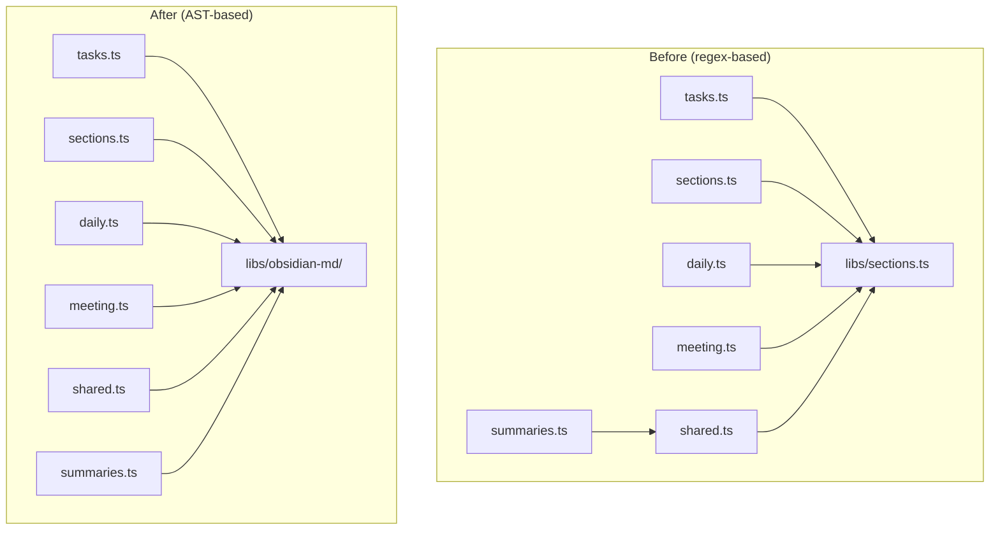
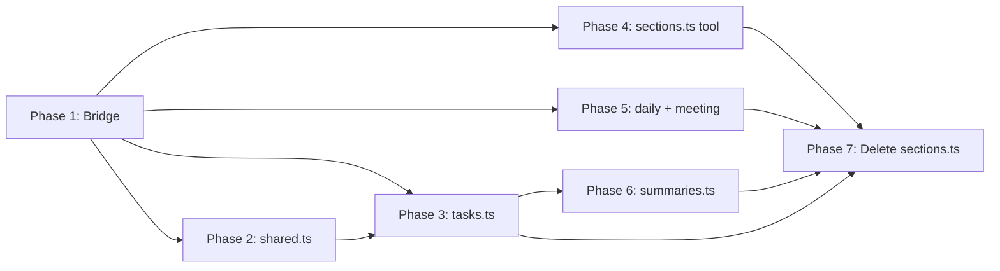

# OT-0014: Migrate Obsidian Tools to obsidian-md Library

## Objective

Replace all hand-rolled regex-based markdown parsing in the Obsidian CLI tools with the new `src/libs/obsidian-md/` library (OT-0013). The library provides `parse()`, `serialize()`, and typed AST operations that replace the string-splitting approach in `src/libs/sections.ts` and `src/tools/obsidian/shared.ts`.

**Critical constraint:** All CLI tools keep their exact argument interface and output format. Agents and skills consume these outputs — any change breaks downstream.

## Architecture

## Import Dependency Map

Current `libs/sections.ts` consumers and what they import:

| Consumer | Imports from `libs/sections.ts` |
|----------|-------------------------------|
| `tools/obsidian/tasks.ts` | `appendToSection`, `countItems`, `listPendingTasks`, `toggleTask`, `setTaskStatus`, `getTaskStatuses`, `findSection`, `editTaskText` |
| `tools/obsidian/sections.ts` | `appendToSection`, `findSection`, `editLineInSection`, `replaceSectionContent` |
| `tools/obsidian/daily.ts` | `appendToSection`, `countItems` |
| `tools/obsidian/meeting.ts` | `appendToSection` |
| `tools/obsidian/shared.ts` | `appendToSection` |

Current `tools/obsidian/shared.ts` consumers:

| Consumer | Imports from `shared.ts` |
|----------|------------------------|
| `tasks.ts` | `getNextTaskNumber`, `getNextSubTaskNumber`, `addSubTask`, `initializeDailyWithCarryForward`, `flag`, `hasFlag` |
| `sections.ts` | `initializeDailyWithCarryForward`, `flag` |
| `daily.ts` | `initializeDailyWithCarryForward`, `flag` |
| `meeting.ts` | `createDailyTemplate`, `flag` |
| `search.ts` | `flag` |
| `summaries.ts` | `parseMetricTable`, `sumMetric`, `flag` |

## Function Migration Map

### libs/sections.ts -- every function

| Function | Replacement | Notes |
|----------|-------------|-------|
| `findSection(content, heading)` | `obsidian-md.findSection(parse(content), heading)` | Old returns `{start, end, body: string}`. New returns `Section \| undefined` with typed nodes. Callers that use `.body` as a string need `serialize()` of the section body or reworked logic. |
| `appendToSection(content, heading, line)` | `serialize(obsidian-md.appendToSection(parse(content), heading, line))` | Old takes/returns raw string. New takes/returns Document. Wrap with parse/serialize. |
| `toggleTask(content, query)` | `obsidian-md.findTask(doc, id)` + `obsidian-md.completeTask(doc, id)` | Old does fuzzy substring match + number match. New uses stable IDs. Need adapter for fuzzy text matching. |
| `setTaskStatus(content, query, status)` | `obsidian-md.setTaskStatus(doc, id, status)` | Same fuzzy-match concern. New uses typed `TaskStatus`. |
| `getTaskStatuses()` | `STATUS_TO_CHAR` / `STATUS_CHARS` from `obsidian-md/types.ts` | Direct constant replacement. |
| `countItems(content)` | `obsidian-md.listTasks(doc)` + counting by status | Rewrite using AST. Also counts logs/notes/decisions by section — needs `findSection()` + node counting. |
| `listPendingTasks(content)` | `obsidian-md.listTasks(doc, { status: 'todo' })` | Filter by status, format output. |
| `editTaskText(content, query, newText)` | Find task by ID in AST, mutate `.content`, serialize. | No direct operation in obsidian-md — add or inline. |
| `editLineInSection(content, section, match, newText)` | `findSection()` + iterate nodes, find matching text, mutate. | No direct operation — implement using AST traversal. |
| `replaceSectionContent(content, section, newContent)` | `obsidian-md.replaceSectionContent(doc, section, content)` | Direct match. |

### tools/obsidian/shared.ts -- function-by-function

| Function | Disposition | Notes |
|----------|-------------|-------|
| `SECTION_NAMES` | **Keep** in shared.ts | Application constant, not a parsing concern. |
| `createDailyTemplate(date)` | **Keep** in shared.ts | Template generation, not parsing. |
| `getNextTaskNumber(content)` | **Replace** with `obsidian-md.getNextTaskId(doc)` | New version works on Document, returns string. Old works on raw string, returns number. |
| `getNextSubTaskNumber(content, parent)` | **Replace** with `obsidian-md.getNextTaskId(doc, parentId)` | Same — returns `"N.M"` string. |
| `addSubTask(content, parent, text)` | **Replace** with `obsidian-md.addTask(doc, text, parent)` | New version handles subtask creation via `parent` arg. |
| `getPreviousDate(date)` | **Keep** in shared.ts | File listing, not parsing. |
| `carryForwardTasks(targetDate)` | **Replace** with `obsidian-md.carryForward(source, target, date)` | Major simplification. New version handles source marking + target building in one call. |
| `initializeDailyWithCarryForward(date)` | **Keep** in shared.ts but rewire internals | Still orchestrates template creation + carry-forward, but uses obsidian-md internally. |
| `parseMetricTable(content)` | **Rewrite** using `parse()` + `TableNode` | The AST provides structured `TableNode.headers` and `TableNode.rows`. |
| `sumMetric(values, key)` | **Keep** in shared.ts | Pure arithmetic, no parsing. |
| `flag(args, name)` / `hasFlag(args, name)` | **Keep** in shared.ts | CLI helpers, unrelated to parsing. |

## File-by-File Migration Plan

### Phase 1: Bridge Layer (no behavior change)

**File: `src/libs/sections.ts`**

Convert to a thin bridge that delegates to `obsidian-md` internally while keeping the exact same function signatures and return types. This lets all consumers migrate incrementally.

Functions to bridge:
- `findSection(content, heading)` -- parse, find, return `{start, end, body}` format
- `appendToSection(content, heading, line)` -- parse, append, serialize
- `toggleTask(content, query)` -- parse, find task by fuzzy match, complete, serialize
- `setTaskStatus(content, query, status)` -- parse, find task, set status, serialize
- `getTaskStatuses()` -- return map built from `STATUS_TO_CHAR`
- `countItems(content)` -- parse, count tasks by status per section, count list items
- `listPendingTasks(content)` -- parse, filter, format
- `editTaskText(content, query, newText)` -- parse, find, mutate, serialize
- `editLineInSection(content, section, match, newText)` -- parse, find, mutate, serialize
- `replaceSectionContent(content, section, newContent)` -- parse, replace, serialize

**Key challenge: fuzzy matching.** The old `toggleTask` and `setTaskStatus` find tasks by substring match on the raw line text. The new library finds tasks by stable ID. The bridge must implement a `findTaskByQuery(doc, query)` helper that:
1. If query is a number pattern (`/^\d+(\.\d+)*$/`), match by task `.id`
2. Otherwise, case-insensitive substring search on task `.content`
3. For text match, prefer shorter content (more specific match) -- same as old behavior

**Acceptance criteria for Phase 1:**
- [ ] All existing imports from `libs/sections.ts` compile without changes
- [ ] All return types unchanged: `findSection` returns `{start, end, body}`, toggle/setStatus return `{updated, matched}`
- [ ] `libs/sections.ts` no longer contains any regex-based line splitting for task/section parsing
- [ ] Round-trip fidelity: `appendToSection(content, h, line)` produces identical output to old version

### Phase 2: Migrate `shared.ts` internals

**File: `src/tools/obsidian/shared.ts`**

Changes:
- Remove import of `appendToSection` from `libs/sections.ts`
- Import `parse`, `serialize`, `addTask`, `getNextTaskId`, `carryForward`, `findSection` from `obsidian-md`
- Delete `getNextTaskNumber(content)` -- callers switch to `getNextTaskId(parse(content))`
- Delete `getNextSubTaskNumber(content, parent)` -- callers switch to `getNextTaskId(parse(content), parent)`
- Delete `addSubTask(content, parent, text)` -- callers switch to `serialize(addTask(parse(content), text, parent))`
- Rewrite `carryForwardTasks(targetDate)` to use `obsidian-md.carryForward()`
- Rewrite `initializeDailyWithCarryForward(date)` to use new carryForward
- Rewrite `parseMetricTable(content)` to use `parse()` + iterate for `TableNode`
- Keep: `SECTION_NAMES`, `createDailyTemplate`, `getPreviousDate`, `sumMetric`, `flag`, `hasFlag`

**Acceptance criteria for Phase 2:**
- [ ] `initializeDailyWithCarryForward` produces identical daily notes (same task numbering, same carry links, same frontmatter)
- [ ] `parseMetricTable` returns identical key-value pairs from summary tables
- [ ] No imports from `libs/sections.ts` remain in `shared.ts`

### Phase 3: Migrate `tasks.ts`

**File: `src/tools/obsidian/tasks.ts`**

This is the largest migration. Every function touches parsing.

Changes:
- Remove all imports from `libs/sections.ts`
- Remove imports of `getNextTaskNumber`, `getNextSubTaskNumber`, `addSubTask` from `shared.ts`
- Import `parse`, `serialize`, `findTask`, `listTasks`, `addTask`, `completeTask`, `setTaskStatus`, `moveTask`, `linkDoc`, `unlinkDoc`, `getNextTaskId`, `findSection` from `obsidian-md`
- Import `TaskStatus`, `STATUS_TO_CHAR` from `obsidian-md/types`

Function-by-function:

| Function | Migration |
|----------|-----------|
| `addTask(args)` | Use `obsidian-md.addTask(doc, content, parent?)` + serialize. Output format: `confirm("Task [N] added", date, content)` -- get task ID from the returned doc. |
| `completeTask(args)` | Use fuzzy-match helper to find task ID, then `obsidian-md.completeTask(doc, id)`. Output: `confirm("Task completed", date, matched)`. Must still show fallback pending list on no-match. |
| `setStatus(args)` | Use fuzzy-match helper + `obsidian-md.setTaskStatus(doc, id, status)`. Validate status against `STATUS_TO_CHAR`. Same output format. |
| `editTask(args)` | Find task by fuzzy match, mutate `.content` directly on AST, serialize. |
| `moveTask(args)` | **Largest rewrite.** Currently 100+ lines of line-index manipulation. Replace with: (a) `to_top` / `under` -- use `obsidian-md.moveTask(doc, id, opts)`, (b) `to_date` -- use `obsidian-md.carryForward` or manual cross-file move with parse/serialize on both files. |
| `linkDoc(args)` | Use `obsidian-md.linkDoc(doc, taskId, docPath)` + serialize. |
| `unlinkDoc(args)` | Use `obsidian-md.unlinkDoc(doc, taskId, docPath)` + serialize. |
| `listTasks(args)` | Use `parse()` + `obsidian-md.listTasks(doc, filter)` + format. Must preserve the exact output: status counts header + formatted task lines. The filter/search logic and `STATUS_GROUPS` mapping need to translate to `TaskFilter`. |
| `taskSummary(args)` | Rewrite `countItems` using AST (moved to Phase 1 bridge). |

**Acceptance criteria for Phase 3:**
- [ ] Every CLI command produces identical output for the same input note
- [ ] `tasks.ts add --content "test"` creates numbered task with `[N]` bracket
- [ ] `tasks.ts complete --task 3` toggles status and shows matched text
- [ ] `tasks.ts move --task 2 --to-top` promotes subtask correctly
- [ ] `tasks.ts move --task 1 --to-date 2026-04-02` marks source deferred with strikethrough + forward link, creates numbered copy in target
- [ ] `tasks.ts link --task 1 --doc "notes/docs/foo"` adds `(📄 [[path|N]])` ref
- [ ] `tasks.ts list` defaults to open filter, shows counts header
- [ ] `tasks.ts list --filter all --search "deploy"` filters correctly
- [ ] No imports from `libs/sections.ts` remain

### Phase 4: Migrate `sections.ts` (CLI tool)

**File: `src/tools/obsidian/sections.ts`**

Changes:
- Remove all imports from `libs/sections.ts`
- Import from `obsidian-md` directly
- `readSection` -- use `parse()` + `findSection()`, serialize section body
- `appendSection` -- use `parse()` + `appendToSection()` + `serialize()`
- `edit` -- three cases:
  1. Section + match: parse, find section, iterate nodes for text match, mutate, serialize
  2. Section only (replace): use `replaceSectionContent()`
  3. Match only (global): parse, iterate all nodes for match, mutate, serialize
- Convenience appenders (`addDecision`, etc.) -- unchanged (they call `appendSection`)

**Acceptance criteria for Phase 4:**
- [ ] `sections.ts read --name Tasks` returns same body text
- [ ] `sections.ts append --name Log --content "test"` inserts at correct position
- [ ] `sections.ts edit --section Notes --match "old text" --text "new text"` finds and replaces
- [ ] `sections.ts edit --section Tasks --text "replacement"` replaces entire section content
- [ ] No imports from `libs/sections.ts` remain

### Phase 5: Migrate `daily.ts` and `meeting.ts`

**File: `src/tools/obsidian/daily.ts`**

Changes:
- Remove imports from `libs/sections.ts`
- Import from `obsidian-md`
- `daily()` status action: use `parse()` + `listTasks()` to build counts instead of `countItems()`
- `daily()` add_note/add_log: use `parse()` + `appendToSection()` + `serialize()`

**File: `src/tools/obsidian/meeting.ts`**

Changes:
- Remove import of `appendToSection` from `libs/sections.ts`
- Import from `obsidian-md`
- Single usage: appending meeting link to daily note's Log section

**Acceptance criteria for Phase 5:**
- [ ] `daily.ts` status output unchanged
- [ ] `daily.ts --action add_log --content "test"` appends with timestamp
- [ ] `meeting.ts` creates meeting note and links to daily correctly

### Phase 6: Migrate `summaries.ts`

**File: `src/tools/obsidian/summaries.ts`**

This file does heavy section-by-section extraction from daily/weekly/monthly notes. Currently uses raw line splitting.

Changes:
- Import `parse`, `findSection`, `listTasks` from `obsidian-md`
- `weekly()`: Parse each daily note with `parse()`. Use `findSection()` to get typed sections. Use `listTasks()` with status filter instead of regex matching. Extract session headers from `HeadingNode` children of "Session Work" section. Extract decisions/learned/meetings from section body nodes.
- `monthly()` / `yearly()`: Parse weekly/monthly notes. Use `TableNode` for metric extraction (replaces `parseMetricTable`). Use section body nodes for digest/carried/meetings.

**Acceptance criteria for Phase 6:**
- [ ] `summaries.ts weekly` produces identical markdown output
- [ ] `summaries.ts monthly` aggregates metrics correctly
- [ ] Metric table parsing works via `TableNode` instead of regex

### Phase 7: Delete `libs/sections.ts`

After all consumers migrated:
- Delete `src/libs/sections.ts`
- Run `grep -r "libs/sections" src/` to confirm zero imports
- Remove any remaining bridge code

**Acceptance criteria for Phase 7:**
- [ ] `src/libs/sections.ts` deleted
- [ ] Zero references to `libs/sections` anywhere in `src/`
- [ ] All CLI tools pass their acceptance tests from prior phases

## Execution Order and Dependencies

Phase 1 must go first -- it ensures nothing breaks while the rest migrates. Phases 2-6 can proceed in the order shown (2 before 3 because tasks.ts imports from shared.ts). Phase 7 is the final cleanup.

**Recommended Wick dispatch:** Sequential, single-Wick. Every phase touches overlapping files (`shared.ts` is imported by 6 files, `sections.ts` by 5). Parallel worktrees would create merge conflicts.

## Risk Areas

### 1. Round-trip fidelity
The obsidian-md serializer must produce byte-identical output for unchanged content. The `dirty` flag pattern handles this -- only mutated nodes get re-serialized. **Test:** Parse a real daily note, serialize without mutations, diff against original. Must be empty diff.

### 2. Fuzzy task matching
The old code matches tasks by substring on the raw line. The new code uses stable IDs. The bridge must implement fuzzy matching that behaves identically:
- Number query: match by task `.id` (exact)
- Text query: case-insensitive substring on `.content`, prefer shorter matches
- Must search both top-level and subtasks
- Must skip group labels (`isLabel: true`) for checkbox operations but include them for move/link

### 3. countItems section-awareness
`countItems()` currently counts items by section name ("Tasks", "Log", "Meetings", "Notes", etc.). The new `listTasks()` counts across all sections. The replacement must filter tasks to only the "Tasks" section, and count list items in other sections separately.

### 4. Move-to-date cross-file operation
`moveTask` with `--to-date` reads/writes two files and applies carry-forward formatting (strikethrough, forward links). The `obsidian-md.carryForward()` operation handles this pattern but applies to ALL incomplete tasks. The single-task move needs either:
- A targeted version of carryForward, or
- Manual AST manipulation on both files (find task in source, mark deferred with forward link, create copy in target with history link)

### 5. Output format regression
The biggest risk. Every string returned by CLI functions is consumed by agents. Key formats to preserve:
- `confirm("Task [N] added", date, content)` -- exact wording
- `counts(date, c)` -- the StatusCounts interface must match
- `formatTaskLines(body)` -- expects raw markdown string, not AST nodes
- Task fallback messages with pending list

### 6. Section body as string vs nodes
Old `findSection` returns `.body` as a trimmed string. Several callers use this directly (`readSection` returns it, `listTasks` operates on it). The new `Section.body` is `Node[]`. Need `serializeSectionBody(section)` helper or use `serialize()` on a synthetic doc.

## Files Touched

| File | Phase | Change Type |
|------|-------|-------------|
| `src/libs/sections.ts` | 1, 7 | Rewrite as bridge, then delete |
| `src/tools/obsidian/shared.ts` | 2 | Remove parsing functions, rewire carry-forward |
| `src/tools/obsidian/tasks.ts` | 3 | Full internal rewrite |
| `src/tools/obsidian/sections.ts` | 4 | Import swap + parse/serialize |
| `src/tools/obsidian/daily.ts` | 5 | Import swap + parse/serialize |
| `src/tools/obsidian/meeting.ts` | 5 | Import swap (single function) |
| `src/tools/obsidian/summaries.ts` | 6 | Rewrite extraction logic with AST |
| `src/libs/obsidian-md/operations.ts` | 3 (if needed) | May need `editTaskContent()` operation |
| `src/libs/obsidian-md/index.ts` | 3 (if needed) | Export new operations |

## Out of Scope

- `src/tools/obsidian/search.ts` -- only imports `flag` from shared.ts, no parsing
- `src/libs/format.ts` -- output formatting, not parsing. `countItems` replacement must still produce `StatusCounts` that format.ts expects
- `src/libs/vault.ts`, `src/libs/frontmatter.ts` -- unrelated to markdown section/task parsing
- CLI argument parsing (`flag`, `hasFlag`) -- stays in shared.ts
- Template generation (`createDailyTemplate`) -- stays in shared.ts
