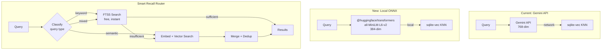
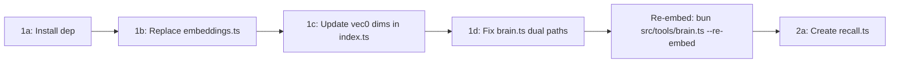

# OT-0015: Local ONNX Embeddings + Smart Recall Router

## Summary

Replace Gemini API-based embeddings with local ONNX inference using `all-MiniLM-L6-v2` (384 dimensions), and add a smart recall router that classifies queries and routes to FTS5 keyword search first, only escalating to vector search when needed.

**Why:** Every semantic search operation (`--recall-all`, `--search-all`, `--search-raw`, `--hybrid`, `--search-refs`) currently makes a network round-trip to Google's embedding API. This adds latency to every recall operation and requires an API key. Local inference eliminates both problems.

## Architecture



## Impact Analysis

```
| File                              | Change Type    | Risk  |
|-----------------------------------|----------------|-------|
| src/libs/embeddings.ts            | REPLACE        | HIGH  |
| src/libs/brain/index.ts           | MODIFY (schema)| HIGH  |
| src/libs/brain/schema.ts          | NO CHANGE      | -     |
| src/libs/brain/queries.ts         | NO CHANGE      | -     |
| src/libs/brain/sync.ts            | NO CHANGE      | -     |
| src/libs/brain/raw.ts             | NO CHANGE      | -     |
| src/libs/brain/degradation.ts     | NO CHANGE      | -     |
| src/tools/brain.ts                | MODIFY (fix)   | MED   |
| src/tools/recall.ts               | NEW            | LOW   |
| package.json                      | ADD dep        | LOW   |
```

**Key observation:** Because all consumers import from `src/libs/embeddings.ts` and use the same function signatures (`embedText`, `embedBatch`, `vectorToBuffer`, `bufferToVector`, `EMBEDDING_CONFIG`), swapping the internals of that one file propagates to every consumer with zero import changes. The only exception is `src/tools/brain.ts` which also imports `generateEmbedding` from `src/libs/gemini.ts` -- those two call sites must be migrated to use `embedText` from `embeddings.ts`.

## Consumers of embeddings.ts (must continue working)

```
| Consumer                             | Imports Used                              |
|--------------------------------------|-------------------------------------------|
| src/libs/brain/queries.ts            | vectorToBuffer, embedText, EMBEDDING_CONFIG|
| src/libs/brain/sync.ts               | embedBatch, vectorToBuffer, estimateTokens, EMBEDDING_CONFIG |
| src/libs/brain/raw.ts                | embedBatch, vectorToBuffer, EMBEDDING_CONFIG |
| src/libs/brain/degradation.ts        | EMBEDDING_CONFIG                          |
| src/libs/brain/chunker.ts            | estimateTokens                            |
| src/tools/brain.ts                   | embedText, EMBEDDING_CONFIG               |
| src/tools/brain.ts (ALSO)            | generateEmbedding from gemini.ts (MUST MIGRATE) |
| src/tools/consolidate-memory.ts      | embedBatch                                |
| src/tools/discover.ts                | embedText                                 |
| src/tools/remember.ts                | embedText, EMBEDDING_CONFIG (dynamic import) |
```

---

## Task 1: Replace Gemini Embeddings with Local ONNX

### 1a. Install dependency

**File: `package.json`**

Add `@huggingface/transformers` as a dependency:

```bash
bun add @huggingface/transformers
```

This package bundles the ONNX runtime and tokenizer. The `all-MiniLM-L6-v2` model files (~22MB) are auto-downloaded on first use and cached at `~/.cache/huggingface/` (standard HF cache location).

### 1b. Replace embeddings.ts

**File: `src/libs/embeddings.ts`**

Replace the entire Gemini implementation with local ONNX inference. Preserve all exports exactly.

**Exports to preserve (identical signatures):**

```typescript
// ── Config (updated values) ──────────────────────────────────────

export const EMBEDDING_CONFIG = {
  model: "all-MiniLM-L6-v2",
  dimensions: 384,
  maxBatchSize: 100,
} as const;

// ── Buffer conversion (UNCHANGED) ────────────────────────────────

/** Convert number[] to Buffer (float32) for sqlite-vec storage */
export function vectorToBuffer(embedding: number[]): Buffer;

/** Convert Buffer (float32) back to number[] */
export function bufferToVector(buf: Buffer): number[];

/** Approximate token count (rough: 1 token ~ 4 chars) */
export function estimateTokens(text: string): number;

// ── Embedding (new implementation, same signature) ───────────────

export interface BatchEmbedResult {
  embeddings: (number[] | null)[];
  succeeded: number;
  failed: number;
  totalTokens: number;
}

/**
 * Embed a single text string using local ONNX model.
 * Lazy-loads the pipeline on first call, caches for reuse.
 *
 * @param text - Text to embed
 * @param caller - Who's calling (for usage tracking)
 * @returns 384-dim float array
 */
export async function embedText(text: string, caller?: string): Promise<number[]>;

/**
 * Embed multiple texts in batches using local ONNX model.
 *
 * @param texts - Array of texts to embed
 * @param caller - Who's calling (for usage tracking)
 * @returns Array of embeddings (null for failed items)
 */
export async function embedBatch(texts: string[], caller?: string): Promise<BatchEmbedResult>;
```

**Implementation requirements:**

1. **Lazy pipeline initialization.** Use a module-level `_pipeline` variable. On first `embedText`/`embedBatch` call, initialize via `@huggingface/transformers`:

```typescript
import { pipeline, type FeatureExtractionPipeline } from "@huggingface/transformers";

let _pipeline: FeatureExtractionPipeline | null = null;

async function getPipeline(): Promise<FeatureExtractionPipeline> {
  if (_pipeline) return _pipeline;
  _pipeline = await pipeline("feature-extraction", "Xenova/all-MiniLM-L6-v2", {
    // Use ONNX quantized model for fastest inference
  });
  return _pipeline;
}
```

Note: The model identifier must be `"Xenova/all-MiniLM-L6-v2"` (the ONNX-converted version from Hugging Face Hub). Verify this works with `@huggingface/transformers` -- if the library uses a different convention, adjust accordingly.

2. **embedText implementation:**
   - Call `getPipeline()` to get/init the model
   - Run inference: `const output = await pipe(text, { pooling: "mean", normalize: true })`
   - Extract the float array from the output tensor (`.tolist()` or `.data` depending on tensor API)
   - The result must be a `number[]` of length 384
   - Track usage via `trackUsage()` with `provider: "local"`, `model: "all-MiniLM-L6-v2"`, `costUsd: 0`
   - No retry logic needed (local inference does not have transient failures)

3. **embedBatch implementation:**
   - Process in chunks of `EMBEDDING_CONFIG.maxBatchSize` (100)
   - For each batch, call the pipeline with the array of texts
   - The pipeline should support batch input: `await pipe(batchTexts, { pooling: "mean", normalize: true })`
   - Map results to `(number[] | null)[]` -- wrap individual failures in try/catch and set null
   - Track usage once per batch call

4. **Usage tracking changes:**
   - The current code passes `cost` but `trackUsage` expects `costUsd`. Fix this mapping.
   - The current code does not pass `provider`. Add `provider: "local"`.
   - Cost is always 0 for local inference.

```typescript
trackUsage({
  provider: "local",
  model: EMBED_MODEL,
  inputTokens: tokens,
  outputTokens: 0,
  caller,
  costUsd: 0,
});
```

5. **Remove all Google/Gemini dependencies:**
   - Remove `import { GoogleGenAI } from "@google/genai"` 
   - Remove `getClient()`, `_client`, API key check
   - Remove `sleep()` helper and retry logic (not needed for local inference)

6. **Keep unchanged:**
   - `vectorToBuffer` -- identical implementation
   - `bufferToVector` -- identical implementation
   - `estimateTokens` -- identical implementation

### 1c. Update vec0 virtual table dimensions in brain/index.ts

**File: `src/libs/brain/index.ts`**

The `CREATE VIRTUAL TABLE` statements hardcode `float[768]`. These must change to `float[384]`.

**Lines to change (5 virtual tables):**

```sql
-- Line ~248: vec_chunks
CREATE VIRTUAL TABLE IF NOT EXISTS vec_chunks USING vec0(
  chunk_id INTEGER PRIMARY KEY,
  embedding float[384]   -- was float[768]
);

-- Line ~254: vec_memories
CREATE VIRTUAL TABLE IF NOT EXISTS vec_memories USING vec0(
  memory_id INTEGER PRIMARY KEY,
  embedding float[384]   -- was float[768]
);

-- Line ~260: vec_decisions
CREATE VIRTUAL TABLE IF NOT EXISTS vec_decisions USING vec0(
  decision_id INTEGER PRIMARY KEY,
  embedding float[384]   -- was float[768]
);

-- Line ~266: vec_projects
CREATE VIRTUAL TABLE IF NOT EXISTS vec_projects USING vec0(
  chunk_id INTEGER PRIMARY KEY,
  embedding float[384]   -- was float[768]
);

-- Line ~272: vec_raw
CREATE VIRTUAL TABLE IF NOT EXISTS vec_raw USING vec0(
  chunk_id INTEGER PRIMARY KEY,
  embedding float[384]   -- was float[768]
);
```

**CRITICAL: Migration path.** `CREATE VIRTUAL TABLE IF NOT EXISTS` will not alter existing tables. On an existing database with 768-dim vec tables, inserting 384-dim vectors will fail (dimension mismatch). The migration must:

1. Drop all existing vec0 virtual tables before recreating them:

```typescript
// Add this BEFORE the CREATE VIRTUAL TABLE statements, guarded by a migration check
const dimCheck = raw.prepare(
  "SELECT sql FROM sqlite_master WHERE type='table' AND name='vec_chunks'"
).get() as { sql: string } | null;

if (dimCheck?.sql?.includes("768")) {
  // Dimension migration: drop old vec tables, they'll be recreated below
  for (const table of ["vec_chunks", "vec_memories", "vec_decisions", "vec_projects", "vec_raw"]) {
    try { raw.exec(`DROP TABLE IF EXISTS ${table}`); } catch {}
  }
  console.error("[brain] Migrated vec tables from 768 to 384 dimensions. Run --re-embed to regenerate vectors.");
}
```

2. After the migration, all existing vector data is gone. The `--re-embed` command regenerates it.

### 1d. Fix dual embedding paths in brain.ts

**File: `src/tools/brain.ts`**

Two functions use `generateEmbedding` from `gemini.ts` instead of `embedText` from `embeddings.ts`:

1. **`runEmbed()` (line ~321-349):** Replace `generateEmbedding(text, "brain-embed")` with `embedText(text, "brain-embed")`. The return type changes from `{ embedding }` to direct `number[]`:

```typescript
// BEFORE:
const { embedding } = await generateEmbedding(text, "brain-embed");
setMemoryEmbedding(row.source_path, embedding);

// AFTER:
const embedding = await embedText(text, "brain-embed");
setMemoryEmbedding(row.source_path, embedding);
```

2. **`runHybridQuery()` (line ~351-373):** Same pattern:

```typescript
// BEFORE:
const { embedding: queryEmbedding } = await generateEmbedding(query, "brain-query");

// AFTER:
const queryEmbedding = await embedText(query, "brain-query");
```

3. **Remove the import:** Delete `import { generateEmbedding } from "../libs/gemini.js";` (line 45). The `embedText` import on line 46 already exists.

### 1e. Schema file -- no changes needed

**File: `src/libs/brain/schema.ts`**

No changes required. The Drizzle schema uses `text("embedding")` columns (JSON-stringified vectors) -- these are dimension-agnostic. The dimension is only enforced by the vec0 virtual tables (handled in 1c above).

---

## Task 2: Smart Recall Router

### 2a. New file: `src/tools/recall.ts`

**CLI interface:**

```
bun src/tools/recall.ts "query string" [--agent NAME] [--skill SKILL] [--limit N]
```

**Module structure:**

```typescript
#!/usr/bin/env bun
/**
 * recall.ts -- Smart recall router for brain.db
 *
 * Classifies queries and routes to the cheapest effective search mode:
 * 1. FTS5 keyword search (always, free and instant)
 * 2. Semantic vector search (only when FTS5 results are insufficient)
 *
 * Replaces direct use of --recall-all, --search-all, --hybrid for agents.
 */

import { initBrain } from "../libs/brain/index.js";
import {
  searchMemories,
  searchReferences,
  searchDecisions,
  searchRecall,
  hybridSearchChunks,
  type SearchResult,
  type MemoryResult,
  type ReferenceResult,
  type DecisionResult,
  type RecallResult,
} from "../libs/brain/index.js";
import { embedText } from "../libs/embeddings.js";

// ── Query Classification ─────────────────────────────────────

type QueryType = "keyword" | "semantic" | "mixed";

interface ClassificationResult {
  type: QueryType;
  reason: string;
}

/**
 * Classify a query to determine optimal search strategy.
 *
 * Heuristics:
 * - keyword: 1-3 words, proper nouns, no question words
 * - semantic: natural language, question words, descriptive phrases
 * - mixed: has both specific terms and descriptive context
 */
export function classifyQuery(query: string): ClassificationResult;

// ── FTS5 Confidence Check ────────────────────────────────────

interface FtsCheckResult {
  sufficient: boolean;
  results: {
    memories: MemoryResult[];
    references: ReferenceResult[];
    decisions: DecisionResult[];
  };
  totalHits: number;
}

/**
 * Run FTS5 search across all stores and assess result quality.
 *
 * "Sufficient" means:
 * - At least 1 result found
 * - Top result has strong FTS rank (rank < -5.0, meaning good token overlap)
 * - For keyword queries: any results = sufficient
 * - For mixed queries: 3+ results = sufficient
 */
function checkFts(
  query: string,
  opts?: { agent?: string; limit?: number },
): FtsCheckResult;

// ── Recall Execution ─────────────────────────────────────────

export interface RecallOutput {
  strategy: "fts-only" | "fts+semantic" | "semantic-only";
  classification: ClassificationResult;
  results: RecallResult;
  ftsHits: number;
  semanticUsed: boolean;
}

/**
 * Execute smart recall: classify, search FTS5, optionally escalate to semantic.
 */
export async function recall(
  query: string,
  opts?: { agent?: string; skill?: string; limit?: number },
): Promise<RecallOutput>;
```

**Classification heuristics (implement in `classifyQuery`):**

```typescript
const QUESTION_WORDS = /^(how|what|when|where|why|which|who|does|did|is|are|was|were|can|could|should|would)\b/i;
const words = query.trim().split(/\s+/);
const wordCount = words.length;
const hasQuestionWord = QUESTION_WORDS.test(query);
const hasProperNoun = words.some(w => /^[A-Z][a-z]/.test(w)); // Capitalized non-first word
const isShort = wordCount <= 3;

if (isShort && !hasQuestionWord) {
  return { type: "keyword", reason: "short query without question words" };
}
if (hasQuestionWord || wordCount >= 6) {
  return { type: "semantic", reason: hasQuestionWord ? "question-form query" : "long descriptive query" };
}
// 4-5 words, no question word
if (hasProperNoun) {
  return { type: "mixed", reason: "mid-length with proper nouns" };
}
return { type: "mixed", reason: "mid-length query" };
```

**FTS5 sufficiency check (implement in `checkFts`):**

```typescript
function checkFts(query: string, opts?: { agent?: string; limit?: number }): FtsCheckResult {
  const limit = opts?.limit ?? 10;
  const memResults = searchMemories(query, { agent: opts?.agent, limit });
  const refResults = searchReferences(query, { limit });
  const decResults = searchDecisions(query, { agent: opts?.agent, limit });

  const totalHits = memResults.length + refResults.length + decResults.length;

  // Strong hit = FTS rank below threshold (more negative = better match)
  const hasStrongHit = [
    ...memResults.map(r => r.rank),
    ...refResults.map(r => r.rank),
    ...decResults.map(r => r.rank),
  ].some(rank => rank < -5.0);

  return {
    sufficient: totalHits > 0 && hasStrongHit,
    results: { memories: memResults, references: refResults, decisions: decResults },
    totalHits,
  };
}
```

**Execution flow (implement in `recall`):**

```typescript
export async function recall(
  query: string,
  opts?: { agent?: string; skill?: string; limit?: number },
): Promise<RecallOutput> {
  initBrain();
  const classification = classifyQuery(query);
  const limit = opts?.limit ?? 10;

  // Step 1: Always try FTS5 first (free, instant)
  const fts = checkFts(query, { agent: opts?.agent, limit });

  // Step 2: Decide whether to escalate to semantic
  const shouldEscalate =
    classification.type === "semantic" ||
    (classification.type === "mixed" && !fts.sufficient) ||
    (classification.type === "keyword" && fts.totalHits === 0);

  if (!shouldEscalate && fts.totalHits > 0) {
    // Return FTS-only results, formatted as RecallResult
    return {
      strategy: "fts-only",
      classification,
      results: {
        references: [],  // FTS refs are ReferenceResult, not ChunkSearchResult -- map or omit
        memories: fts.results.memories.map(m => ({
          id: m.id,
          title: m.title,
          sourcePath: m.sourcePath,
          agent: m.agent,
          ftsRank: m.rank,
          similarity: null,
          combinedScore: Math.abs(m.rank),  // Normalize for display
        })),
        decisions: fts.results.decisions.map(d => ({
          id: d.id,
          agent: d.agent,
          decision: d.decision,
          context: d.context,
          outcome: d.outcome,
          confidence: d.confidence,
          tags: d.tags,
          ftsScore: 1.0,
          vecScore: 0,
          combinedScore: 1.0,
        })),
        projects: [],
        raw: [],
      },
      ftsHits: fts.totalHits,
      semanticUsed: false,
    };
  }

  // Step 3: Escalate to full semantic recall
  const queryEmbedding = await embedText(query, "recall-router");
  const results = searchRecall(query, queryEmbedding, {
    agent: opts?.agent,
    skill: opts?.skill,
    limit,
  });

  return {
    strategy: fts.totalHits > 0 ? "fts+semantic" : "semantic-only",
    classification,
    results,
    ftsHits: fts.totalHits,
    semanticUsed: true,
  };
}
```

**CLI entry point:**

```typescript
if (import.meta.main) {
  const args = process.argv.slice(2);

  // Extract query (first non-flag argument)
  const query = args.find(a => !a.startsWith("--"));
  if (!query) {
    console.error("Usage: bun src/tools/recall.ts \"query\" [--agent NAME] [--skill SKILL] [--limit N]");
    process.exit(1);
  }

  function flagValue(name: string): string | undefined {
    const idx = args.indexOf(`--${name}`);
    if (idx < 0 || idx + 1 >= args.length) return undefined;
    return args[idx + 1];
  }

  try {
    const result = await recall(query, {
      agent: flagValue("agent"),
      skill: flagValue("skill"),
      limit: flagValue("limit") ? parseInt(flagValue("limit")!) : undefined,
    });

    // Output header
    console.log(`Strategy: ${result.strategy} | Classification: ${result.classification.type} (${result.classification.reason})`);
    console.log(`FTS hits: ${result.ftsHits} | Semantic: ${result.semanticUsed ? "yes" : "no"}`);
    console.log("");

    // Output results in same format as brain.ts search output
    const r = result.results;
    if (r.references.length > 0) {
      console.log("-- References --");
      for (const ref of r.references) {
        console.log(`  [${ref.combinedScore.toFixed(2)}] ${ref.sourcePath} > ${ref.sectionName}`);
      }
    }
    if (r.memories.length > 0) {
      console.log("-- Memories --");
      for (const mem of r.memories) {
        console.log(`  [${mem.combinedScore.toFixed(2)}] ${mem.sourcePath} (${mem.agent})`);
      }
    }
    if (r.decisions.length > 0) {
      console.log("-- Decisions --");
      for (const dec of r.decisions) {
        console.log(`  [${dec.combinedScore.toFixed(2)}] ${dec.decision} (${dec.agent})`);
      }
    }
    if (r.projects.length > 0) {
      console.log("-- Projects --");
      for (const proj of r.projects) {
        console.log(`  [${proj.combinedScore.toFixed(2)}] ${proj.sourcePath} > ${proj.sectionName}`);
      }
    }
    if (r.raw.length > 0) {
      console.log("-- Raw --");
      for (const raw of r.raw) {
        const skillLabel = raw.skill ? ` [${raw.skill}]` : "";
        console.log(`  [${raw.combinedScore.toFixed(2)}] ${raw.ts} (${raw.date})${skillLabel} > ${raw.sectionName}`);
      }
    }

    const totalResults = r.references.length + r.memories.length + r.decisions.length + r.projects.length + r.raw.length;
    if (totalResults === 0) {
      console.log("No results found.");
    }
  } catch (err: any) {
    console.error(`[recall error] ${err.message}`);
    process.exit(1);
  }
}
```

**The `recall` function must also be exported** so other tools can import and use it programmatically without shelling out.

---

## Execution Order

Tasks must be implemented in this sequence:



Task 1 subtasks (1a-1d) are sequential -- each depends on the prior. Task 2 (recall.ts) depends on Task 1 being complete (it imports `embedText`).

## Constraints

- **No breaking changes to exports.** Every function signature in `embeddings.ts` must remain identical. The dimension change from 768 to 384 is the only observable difference.
- **No changes to queries.ts, sync.ts, raw.ts, degradation.ts, chunker.ts, schema.ts.** These consume embeddings via the stable interface and do not need modification.
- **No changes to discover.ts, consolidate-memory.ts, remember.ts.** They import `embedText`/`embedBatch` and will pick up the new implementation automatically.
- **Model files cache.** The HF transformers library auto-downloads model files (~22MB) on first use. Do not bundle model files in the repo. Cache location: `~/.cache/huggingface/`.
- **Bun compatibility.** `@huggingface/transformers` must work with Bun's runtime. If the ONNX runtime native bindings have issues on Windows/Bun, fall back to the WASM backend. The library supports both -- the pipeline constructor may need a `device: "cpu"` or similar hint.

## Contingency: Bun + ONNX Runtime Compatibility

If `@huggingface/transformers` ONNX native bindings fail under Bun on Windows:

1. **First try:** Force WASM backend via `env: { ONNX_WASM: "1" }` or library-specific config
2. **Second try:** Use `onnxruntime-web` (pure WASM, no native bindings) with manual tokenizer from `@huggingface/transformers`
3. **Last resort:** Use `onnxruntime-node` with explicit binary path -- but this requires Node.js N-API compatibility in Bun

Document which path was taken as a comment in the file header.

## Acceptance Criteria

- [ ] `bun add @huggingface/transformers` succeeds
- [ ] `embedText("hello world")` returns a `number[]` of length 384 with zero network calls
- [ ] `embedBatch(["a", "b", "c"])` returns `BatchEmbedResult` with 3 non-null embeddings locally
- [ ] `EMBEDDING_CONFIG.model` equals `"all-MiniLM-L6-v2"` and `EMBEDDING_CONFIG.dimensions` equals `384`
- [ ] No `GOOGLE_API_KEY` required for embeddings (Gemini still needed for gemini.ts, critics, etc.)
- [ ] `import { generateEmbedding } from "../libs/gemini.js"` is removed from `brain.ts`
- [ ] All 5 vec0 tables in `brain/index.ts` declare `float[384]`
- [ ] Dimension migration: opening an existing DB with 768-dim vec tables triggers drop+recreate
- [ ] `bun src/tools/brain.ts --re-embed` regenerates all vectors with the new model
- [ ] `bun src/tools/brain.ts --search-all "vocal layering"` works (uses local embeddings)
- [ ] `bun src/tools/brain.ts --recall-all "shirozen"` works (uses local embeddings)
- [ ] `bun src/tools/recall.ts "shirozen"` returns FTS5 results without hitting embeddings
- [ ] `bun src/tools/recall.ts "how did we handle vocal layering"` uses semantic search
- [ ] `bun src/tools/recall.ts "typed brackets"` returns FTS5 results (keyword match)
- [ ] All existing brain.ts CLI flags still work: `--sync --embed`, `--search-refs`, `--search-all`, `--hybrid`, `--recall-all`, `--search-raw`, `--get-context`, `--re-embed`
- [ ] Usage tracking logs show `provider: "local"` and `costUsd: 0` for embedding calls
