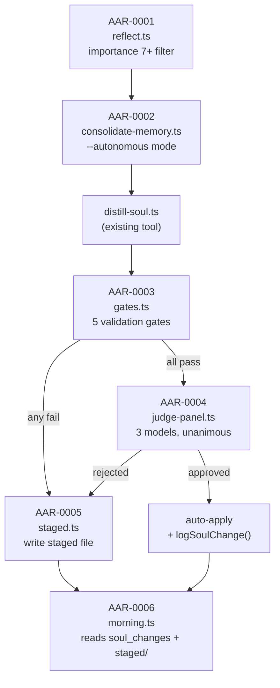
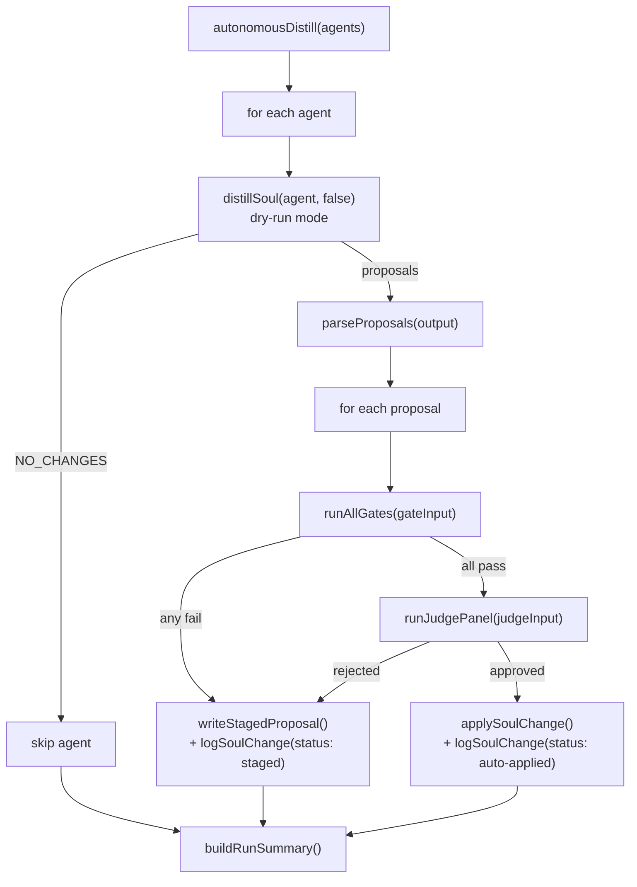
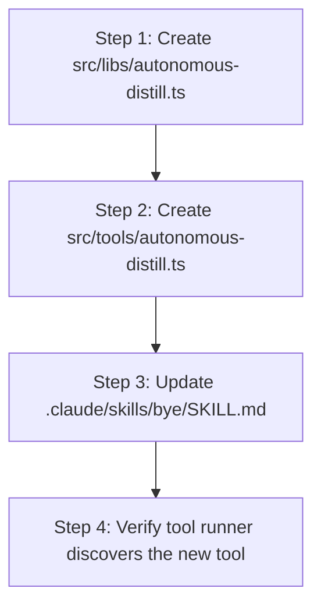

# AAR-0007: Orchestration Wiring

## Objective

Wire the 6 independent AAR Phase 1 components into a single end-to-end pipeline: after a session ends, high-importance reflections are consolidated, distilled into soul proposals, validated through 5 gates, judged by 3 models, and either auto-applied or staged for human review. A summary is written for the morning briefing to read.

This is the integration task. No new algorithms, no new tables, no new AI logic. Just plumbing.

## Context

AAR-0001 through AAR-0006 built these components in isolation:



**What does not exist yet:** The function that chains D -> G -> J -> apply/stage. That is this task.

**What already exists and must not be re-implemented:**
- `distillSoul()` in `src/tools/distill-soul.ts` -- calls Gemini, returns proposal text with `PROPOSALS:` blocks and `FULL_SOUL:` content
- `runAllGates()` in `src/libs/gates.ts` -- accepts `GateInput`, returns `AllGatesResult`
- `runJudgePanel()` in `src/libs/judge-panel.ts` -- accepts `JudgePanelInput`, returns `JudgePanelResult`
- `writeStagedProposal()` in `src/libs/staged.ts` -- writes a markdown file to `staged/`
- `logSoulChange()` in `src/libs/brain/queries.ts` -- logs to `soul_changes` table
- `shouldConsolidate()` with `{ autonomous: true }` in `src/libs/reflect.ts`

## Architecture Decision

### Why a new library, not a hook script

The Stop hook runs on session end and must complete quickly (it already runs `capture-raw.ts`, `tool-call-counter.ts`, and `brain --check`). The autonomous distill pipeline involves multiple Gemini calls (distill + Gate 1 constitution + Gate 2 regression confirmation), 3 parallel judge API calls, and file writes. This takes 15-30 seconds.

**Decision:** Create a standalone pipeline function in `src/libs/autonomous-distill.ts` and a thin CLI tool in `src/tools/autonomous-distill.ts`. Wire it into the `/bye` skill workflow (where it belongs conceptually -- session-end housekeeping), not the Stop hook (which must be fast and non-blocking).

**Rationale:** The `/bye` skill is user-triggered and already takes a few seconds (reflect + consolidate + daily log). Adding the distill pipeline there is expected latency. The Stop hook is implicit and should never take >2 seconds.

### Pipeline flow



### Partial failure handling

Each proposal is independent. If agent `tala` has 2 proposals, proposal 1 can pass and auto-apply while proposal 2 fails gates and gets staged. The pipeline processes proposals sequentially within an agent (soul file changes are not parallelizable -- each subsequent proposal needs the updated soul content).

Across agents, the pipeline runs sequentially too. This is simpler and avoids soul file write contention. Cost: ~30s per agent with proposals. Acceptable for a session-end task.

## File-by-File Spec

### 1. `src/libs/autonomous-distill.ts` (NEW FILE)

This is the core pipeline. No CLI concerns, no stdout formatting -- pure logic that returns structured results.

#### Types

```typescript
import type { AllGatesResult, ProposedChange, GateInput } from "./gates.js";
import type { JudgePanelResult, JudgePanelInput } from "./judge-panel.js";
import type { StagedProposal } from "./staged.js";

/** Result for a single proposal within an agent */
export interface ProposalOutcome {
  agent: string;
  proposalTitle: string;
  proposedChange: ProposedChange;
  gateResults: AllGatesResult;
  judgeResults: JudgePanelResult | null;  // null if gates failed
  action: "auto-applied" | "staged";
  reason: string;  // why it was applied or staged
}

/** Result for an entire agent's distillation run */
export interface AgentDistillResult {
  agent: string;
  skipped: boolean;          // true if distill returned NO_CHANGES
  skipReason?: string;
  proposals: ProposalOutcome[];
  error?: string;            // if the entire agent run failed
}

/** Result for the full pipeline run across all agents */
export interface PipelineResult {
  agents: AgentDistillResult[];
  summary: PipelineSummary;
}

export interface PipelineSummary {
  totalProposals: number;
  autoApplied: number;
  staged: number;
  skippedAgents: number;
  errors: number;
  durationMs: number;
}
```

#### Proposal Parser

The existing `distillSoul()` returns a string with `=== PROPOSAL N: {title} ===` blocks. This parser extracts structured data from that output.

```typescript
/**
 * Parse the text output of distillSoul() into structured ProposedChange objects.
 *
 * Expected format from distill-soul.ts:
 *   === PROPOSAL N: {title} ===
 *   TYPE: add | modify | remove
 *   SECTION: {section name}
 *   CONFIDENCE: high | medium
 *   EVIDENCE: {text}
 *
 *   CONTENT:
 *   {the actual text}
 *   === END PROPOSAL ===
 *
 * Also extracts the FULL_SOUL block for apply-mode.
 */
export function parseDistillOutput(output: string): {
  proposals: ParsedProposal[];
  fullSoul: string | null;
  summary: string | null;
} {
  // ... implementation below
}

export interface ParsedProposal {
  title: string;
  type: "add" | "remove" | "modify";
  section: string;
  confidence: "high" | "medium";
  evidence: string;
  content: string;
}
```

**Implementation:**

```typescript
export function parseDistillOutput(output: string): {
  proposals: ParsedProposal[];
  fullSoul: string | null;
  summary: string | null;
} {
  // Check for NO_CHANGES
  if (output.includes("NO_CHANGES") || output.includes("No knowledge qualifies")) {
    return { proposals: [], fullSoul: null, summary: null };
  }

  // Extract summary
  const summaryMatch = output.match(/SUMMARY:\n([\s\S]*?)(?=\nPROPOSALS:)/);
  const summary = summaryMatch ? summaryMatch[1].trim() : null;

  // Extract proposals
  const proposalRegex = /===\s*PROPOSAL\s*\d+:\s*(.*?)\s*===\n([\s\S]*?)===\s*END PROPOSAL\s*===/g;
  const proposals: ParsedProposal[] = [];
  let match;
  while ((match = proposalRegex.exec(output)) !== null) {
    const title = match[1].trim();
    const body = match[2].trim();

    // Parse structured fields from body
    const typeMatch = body.match(/^TYPE:\s*(.+)$/m);
    const sectionMatch = body.match(/^SECTION:\s*(.+)$/m);
    const confidenceMatch = body.match(/^CONFIDENCE:\s*(.+)$/m);
    const evidenceMatch = body.match(/^EVIDENCE:\s*(.+)$/m);
    const contentMatch = body.match(/CONTENT:\n([\s\S]*?)$/);

    proposals.push({
      title,
      type: (typeMatch?.[1]?.trim().toLowerCase() as "add" | "remove" | "modify") ?? "add",
      section: sectionMatch?.[1]?.trim() ?? "Unknown",
      confidence: (confidenceMatch?.[1]?.trim().toLowerCase() as "high" | "medium") ?? "medium",
      evidence: evidenceMatch?.[1]?.trim() ?? "",
      content: contentMatch?.[1]?.trim() ?? "",
    });
  }

  // Extract full soul
  const fullSoulMatch = output.match(/FULL_SOUL:\n([\s\S]*?)$/);
  const fullSoul = fullSoulMatch
    ? fullSoulMatch[1].replace(/^```markdown?\n?/, "").replace(/```\s*$/, "").trim()
    : null;

  return { proposals, fullSoul, summary };
}
```

**Note:** This parser duplicates extraction logic from `distillSoul()` in `src/tools/distill-soul.ts` (lines 176-210). That is intentional -- the tool function returns a formatted string, not structured data. Refactoring `distillSoul()` to return structured data is a future improvement but out of scope for this task, because it would change the tool's CLI output format and require updating the toolDef.

#### Core Pipeline Function

```typescript
import { readFileSync, writeFileSync, existsSync } from "fs";
import { join } from "path";
import { fromRoot } from "./paths.js";
import { runAllGates } from "./gates.js";
import { runJudgePanel } from "./judge-panel.js";
import { writeStagedProposal } from "./staged.js";
import { initBrain, logSoulChange } from "./brain/index.js";
import dayjs from "./dayjs.js";

const SOULS_DIR = fromRoot(".claude", "souls");

/** Agents eligible for autonomous distillation. */
const DISTILL_AGENTS = ["tala", "rune", "sol", "echo", "penny"];

/**
 * Run the autonomous distillation pipeline for one or more agents.
 *
 * For each agent:
 *   1. Call distillSoul() in dry-run mode to get proposals
 *   2. Parse proposals into structured data
 *   3. For each proposal: run gates -> if pass, run judges -> if approved, apply
 *   4. Failed proposals get staged for human review
 *
 * @param agents - Agent names to process. Defaults to all eligible agents.
 * @returns Structured result with per-agent, per-proposal outcomes.
 */
export async function autonomousDistill(
  agents?: string[]
): Promise<PipelineResult> {
  const start = Date.now();
  const targetAgents = agents ?? DISTILL_AGENTS;
  const results: AgentDistillResult[] = [];

  initBrain();

  for (const agent of targetAgents) {
    try {
      const result = await processAgent(agent);
      results.push(result);
    } catch (err: any) {
      results.push({
        agent,
        skipped: false,
        proposals: [],
        error: err.message ?? String(err),
      });
    }
  }

  const summary = buildPipelineSummary(results, Date.now() - start);
  return { agents: results, summary };
}
```

#### Per-Agent Processor

```typescript
/**
 * Process a single agent through the distill -> gates -> judge pipeline.
 *
 * Important: proposals are processed sequentially because each auto-applied
 * change modifies the soul file, and subsequent proposals must see the updated
 * content.
 */
async function processAgent(agent: string): Promise<AgentDistillResult> {
  const soulPath = join(SOULS_DIR, `${agent}.md`);
  if (!existsSync(soulPath)) {
    return { agent, skipped: true, skipReason: `Soul file not found: ${soulPath}`, proposals: [] };
  }

  // Step 1: Run distillSoul in dry-run mode
  // Import dynamically to avoid circular dependency (distill-soul.ts is a tool, not a lib)
  const { distillSoul } = await import("../tools/distill-soul.js");
  const distillOutput = await distillSoul(agent, false);

  // Step 2: Parse proposals
  const parsed = parseDistillOutput(distillOutput);
  if (parsed.proposals.length === 0) {
    return { agent, skipped: true, skipReason: "No proposals from distillation", proposals: [] };
  }

  const today = dayjs().format("YYYY-MM-DD");
  const outcomes: ProposalOutcome[] = [];

  // Step 3: Process each proposal sequentially
  for (const proposal of parsed.proposals) {
    // Re-read soul file before each proposal (may have been updated by previous proposal)
    const currentSoul = readFileSync(soulPath, "utf-8");

    const proposedChange: ProposedChange = {
      type: proposal.type,
      section: proposal.section,
      content: proposal.content,
      evidence: proposal.evidence,
    };

    const gateInput: GateInput = {
      agent,
      currentSoul,
      proposedDiff: [proposedChange],
    };

    // Step 3a: Run validation gates
    const gateResults = await runAllGates(gateInput);

    if (!gateResults.passed) {
      // Gates failed -> stage for human review
      const reason = `Gate failure: ${gateResults.failedGates.join(", ")}`;

      writeStagedProposal({
        agent,
        date: today,
        proposedChange: proposal.content,
        section: proposal.section,
        changeType: proposal.type,
        evidence: proposal.evidence,
        gateResults,
        judgeResults: null,
        reason,
        status: "pending",
      });

      logSoulChange({
        agent,
        date: today,
        linesAdded: countLines(proposal.content, proposal.type === "add"),
        linesRemoved: countLines(proposal.content, proposal.type === "remove"),
        changeSummary: `[staged] ${proposal.title}: ${reason}`,
        gateResults: JSON.stringify(gateResults),
        judgeResults: undefined,
        status: "staged",
      });

      outcomes.push({
        agent,
        proposalTitle: proposal.title,
        proposedChange,
        gateResults,
        judgeResults: null,
        action: "staged",
        reason,
      });

      continue;
    }

    // Step 3b: Gates passed -> run judge panel
    const judgeInput: JudgePanelInput = {
      agent,
      currentSoul,
      proposedDiff: formatProposalForJudge(proposal),
      evidence: proposal.evidence,
      gateResults,
    };

    const judgeResults = await runJudgePanel(judgeInput);

    if (!judgeResults.approved) {
      // Judges rejected -> stage for human review
      const reason = `Judge dissent: ${judgeResults.dissents.join(", ")}`;

      writeStagedProposal({
        agent,
        date: today,
        proposedChange: proposal.content,
        section: proposal.section,
        changeType: proposal.type,
        evidence: proposal.evidence,
        gateResults,
        judgeResults,
        reason,
        status: "pending",
      });

      logSoulChange({
        agent,
        date: today,
        linesAdded: countLines(proposal.content, proposal.type === "add"),
        linesRemoved: countLines(proposal.content, proposal.type === "remove"),
        changeSummary: `[staged] ${proposal.title}: ${reason}`,
        gateResults: JSON.stringify(gateResults),
        judgeResults: JSON.stringify(judgeResults),
        status: "staged",
      });

      outcomes.push({
        agent,
        proposalTitle: proposal.title,
        proposedChange,
        gateResults,
        judgeResults,
        action: "staged",
        reason,
      });

      continue;
    }

    // Step 3c: Judges approved -> auto-apply the change
    applySoulChange(agent, soulPath, proposal, parsed.fullSoul);

    logSoulChange({
      agent,
      date: today,
      linesAdded: countLines(proposal.content, proposal.type === "add"),
      linesRemoved: countLines(proposal.content, proposal.type === "remove"),
      changeSummary: `[auto-applied] ${proposal.title} (${judgeResults.votes.length} judges approved)`,
      gateResults: JSON.stringify(gateResults),
      judgeResults: JSON.stringify(judgeResults),
      status: "auto-applied",
    });

    outcomes.push({
      agent,
      proposalTitle: proposal.title,
      proposedChange,
      gateResults,
      judgeResults,
      action: "auto-applied",
      reason: `All gates passed, all judges approved`,
    });
  }

  return { agent, skipped: false, proposals: outcomes };
}
```

#### Apply Function

```typescript
/**
 * Apply a soul change to the agent's soul file.
 *
 * Strategy:
 *   - If the distill output included a FULL_SOUL block and this is the ONLY
 *     proposal (or the first proposal), use the full soul content.
 *   - Otherwise, for "add" type changes, append the content to the target section.
 *   - For "remove" type changes, remove the content from the soul file.
 *   - "modify" type changes should never reach here (Gate 3 blocks them).
 *
 * The full-soul approach is preferred because Gemini produced it with
 * all proposals integrated. But when processing proposals individually
 * (e.g., proposal 1 passes but proposal 2 fails), we must apply
 * incrementally.
 *
 * IMPORTANT: fullSoul should only be used when ALL proposals from the
 * distill run are being applied. If any proposal is filtered out by gates
 * or judges, the fullSoul contains changes that were not approved.
 * Therefore, this function NEVER uses fullSoul. It always applies
 * incrementally.
 */
function applySoulChange(
  agent: string,
  soulPath: string,
  proposal: ParsedProposal,
  _fullSoul: string | null,  // reserved for future bulk-apply optimization
): void {
  const current = readFileSync(soulPath, "utf-8");

  if (proposal.type === "add") {
    // Find the target section and append after its last line
    const updated = appendToSection(current, proposal.section, proposal.content);
    writeFileSync(soulPath, updated, "utf-8");
  } else if (proposal.type === "remove") {
    // Remove the content from the soul file
    const updated = current.replace(proposal.content.trim(), "").replace(/\n{3,}/g, "\n\n");
    writeFileSync(soulPath, updated, "utf-8");
  }
  // "modify" never reaches here -- Gate 3 (Size) blocks modifications
}

/**
 * Append content to a named section in a markdown file.
 * Finds the ## heading matching the section name, then appends
 * the content before the next ## heading (or end of file).
 */
function appendToSection(content: string, section: string, addition: string): string {
  const sectionLower = section.toLowerCase();
  const lines = content.split("\n");
  let insertIndex = -1;

  // Find the section heading
  for (let i = 0; i < lines.length; i++) {
    if (lines[i].startsWith("## ") && lines[i].slice(3).trim().toLowerCase().includes(sectionLower)) {
      // Found the section -- now find the end of it
      for (let j = i + 1; j < lines.length; j++) {
        if (lines[j].startsWith("## ")) {
          insertIndex = j; // insert before next section
          break;
        }
      }
      if (insertIndex === -1) insertIndex = lines.length; // append at end
      break;
    }
  }

  if (insertIndex === -1) {
    // Section not found -- append at end of file
    return content.trimEnd() + "\n\n" + addition.trim() + "\n";
  }

  // Insert the content with a blank line before and after
  lines.splice(insertIndex, 0, "", addition.trim(), "");
  return lines.join("\n");
}
```

#### Helpers

```typescript
/** Count non-empty lines in content for the soul_changes log. */
function countLines(content: string, shouldCount: boolean): number {
  if (!shouldCount) return 0;
  return content.split("\n").filter(l => l.trim().length > 0).length;
}

/** Format a proposal as a human-readable diff description for the judge panel. */
function formatProposalForJudge(proposal: ParsedProposal): string {
  return [
    `Type: ${proposal.type}`,
    `Section: ${proposal.section}`,
    `Confidence: ${proposal.confidence}`,
    "",
    "Proposed text:",
    proposal.content,
  ].join("\n");
}

/** Build aggregate summary of a pipeline run. */
function buildPipelineSummary(
  results: AgentDistillResult[],
  durationMs: number,
): PipelineSummary {
  let totalProposals = 0;
  let autoApplied = 0;
  let staged = 0;
  let errors = 0;
  let skippedAgents = 0;

  for (const r of results) {
    if (r.error) { errors++; continue; }
    if (r.skipped) { skippedAgents++; continue; }
    for (const p of r.proposals) {
      totalProposals++;
      if (p.action === "auto-applied") autoApplied++;
      if (p.action === "staged") staged++;
    }
  }

  return { totalProposals, autoApplied, staged, skippedAgents, errors, durationMs };
}
```

#### Summary Writer

```typescript
import { mkdirSync } from "fs";

const SUMMARIES_DIR = fromRoot("out");

/**
 * Write a pipeline run summary to out/autonomous-distill-summary.md.
 *
 * This file is overwritten each run. The morning briefing does NOT read
 * this file -- it reads soul_changes and staged/ directly. This summary
 * is for debugging and session-end display only.
 */
export function writePipelineSummary(result: PipelineResult): string {
  mkdirSync(SUMMARIES_DIR, { recursive: true });
  const filePath = join(SUMMARIES_DIR, "autonomous-distill-summary.md");

  const lines: string[] = [];
  const s = result.summary;

  lines.push("# Autonomous Distill Summary");
  lines.push("");
  lines.push(`**Run:** ${dayjs().format("YYYY-MM-DD HH:mm:ss")}`);
  lines.push(`**Duration:** ${(s.durationMs / 1000).toFixed(1)}s`);
  lines.push(`**Proposals:** ${s.totalProposals} total, ${s.autoApplied} applied, ${s.staged} staged`);
  lines.push(`**Agents:** ${s.skippedAgents} skipped, ${s.errors} errors`);
  lines.push("");

  for (const agent of result.agents) {
    lines.push(`## ${agent.agent}`);
    if (agent.error) {
      lines.push(`Error: ${agent.error}`);
      lines.push("");
      continue;
    }
    if (agent.skipped) {
      lines.push(`Skipped: ${agent.skipReason}`);
      lines.push("");
      continue;
    }
    for (const p of agent.proposals) {
      const icon = p.action === "auto-applied" ? "+" : "?";
      lines.push(`  ${icon} ${p.proposalTitle} -- ${p.action}`);
      lines.push(`    ${p.reason}`);
      if (p.gateResults.failedGates.length > 0) {
        lines.push(`    Failed gates: ${p.gateResults.failedGates.join(", ")}`);
      }
      if (p.judgeResults && p.judgeResults.dissents.length > 0) {
        lines.push(`    Dissents: ${p.judgeResults.dissents.join(", ")}`);
      }
    }
    lines.push("");
  }

  writeFileSync(filePath, lines.join("\n"), "utf-8");
  return filePath;
}
```

#### Exports

```typescript
export {
  autonomousDistill,
  parseDistillOutput,
  writePipelineSummary,
};

export type {
  ProposalOutcome,
  AgentDistillResult,
  PipelineResult,
  PipelineSummary,
  ParsedProposal,
};
```

### 2. `src/tools/autonomous-distill.ts` (NEW FILE)

Thin CLI wrapper and tool registry entry. Calls the lib function and formats output.

#### Imports

```typescript
import { autonomousDistill, writePipelineSummary } from "../libs/autonomous-distill.js";
import type { PipelineResult } from "../libs/autonomous-distill.js";
import { z } from "zod";
import type { ToolDefinition } from "../registry/types.js";
```

#### CLI Mode

```typescript
if (import.meta.main) {
  const args = process.argv.slice(2);
  let agents: string[] | undefined;
  let writeSummary = true;

  for (let i = 0; i < args.length; i++) {
    if (args[i] === "--agent") agents = [args[++i]];
    else if (args[i] === "--agents") agents = args[++i].split(",");
    else if (args[i] === "--no-summary") writeSummary = false;
    else if (args[i] === "--help") {
      console.log(`Usage: bun run tool autonomous-distill [--agent name | --agents a,b,c] [--no-summary]

Run the autonomous distillation pipeline. Proposes soul changes, validates
through 5 gates and 3 judges, auto-applies approved changes, stages rejected
ones for human review.

Options:
  --agent name       Process a single agent
  --agents a,b,c     Process specific agents (comma-separated)
  --no-summary       Skip writing out/autonomous-distill-summary.md
  (no args)          Process all eligible agents`);
      process.exit(0);
    }
  }

  try {
    const result = await autonomousDistill(agents);

    if (writeSummary) {
      writePipelineSummary(result);
    }

    // Print structured result for caller consumption
    console.log(formatCLIOutput(result));
  } catch (err: any) {
    console.error(`[autonomous-distill error] ${err.message}`);
    process.exit(1);
  }
}
```

#### Output Formatter

```typescript
function formatCLIOutput(result: PipelineResult): string {
  const s = result.summary;
  const lines: string[] = [];

  lines.push("=== AUTONOMOUS DISTILL ===");
  lines.push(`  Duration: ${(s.durationMs / 1000).toFixed(1)}s`);
  lines.push(`  Proposals: ${s.totalProposals}`);
  lines.push(`  Auto-applied: ${s.autoApplied}`);
  lines.push(`  Staged: ${s.staged}`);
  lines.push(`  Skipped agents: ${s.skippedAgents}`);
  if (s.errors > 0) lines.push(`  Errors: ${s.errors}`);
  lines.push("");

  for (const agent of result.agents) {
    if (agent.skipped) continue;
    if (agent.error) {
      lines.push(`  ${agent.agent}: ERROR — ${agent.error}`);
      continue;
    }
    for (const p of agent.proposals) {
      const icon = p.action === "auto-applied" ? "[APPLIED]" : "[STAGED]";
      lines.push(`  ${agent.agent}: ${icon} ${p.proposalTitle}`);
    }
  }

  if (s.totalProposals === 0) {
    lines.push("  No proposals from any agent. Nothing to do.");
  }

  lines.push("=== END ===");
  return lines.join("\n");
}
```

#### Tool Definition

```typescript
export const toolDef: ToolDefinition = {
  name: "autonomous_distill",
  description: "Run the autonomous soul distillation pipeline. Validates proposals through 5 gates and 3-model judge panel, auto-applies approved changes, stages rejected ones.",
  inputSchema: z.object({
    agent: z.string().optional().describe("Single agent to process. Omit for all eligible agents."),
    agents: z.array(z.string()).optional().describe("List of agents to process."),
    writeSummary: z.boolean().optional().describe("Write summary to out/ (default: true)"),
  }),
  tags: ["memory"],
  execute: async (args) => {
    try {
      const targetAgents = args.agent ? [args.agent] : args.agents ?? undefined;
      const result = await autonomousDistill(targetAgents);

      if (args.writeSummary !== false) {
        writePipelineSummary(result);
      }

      return { output: formatCLIOutput(result) };
    } catch (err: any) {
      return { output: `[autonomous_distill error] ${err.message}`, isError: true };
    }
  },
};
```

### 3. `.claude/skills/bye/SKILL.md` (MODIFY)

Add the autonomous distill step as Phase 2.5, between consolidation and daily log.

**Current Phase 2:**

```
### Phase 2 -- Sync & Consolidate
bun run tool brain --check
bun run tool consolidate-memory --list
bun run tool consolidate-memory --auto
```

**Updated Phase 2:**

```
### Phase 2 -- Sync & Consolidate
bun run tool brain --check
bun run tool consolidate-memory --auto --autonomous

### Phase 2.5 -- Autonomous Distill
bun run tool autonomous-distill
```

Remove the `--list` check from Phase 2. With `--autonomous` mode, the consolidation tool handles the threshold logic internally. The `--list` step was a manual guard that is now unnecessary.

**Changes to the SKILL.md file:**
1. Replace the Phase 2 block (three commands) with the two-command version above
2. Add the Phase 2.5 block after Phase 2
3. Update the Phase 4 sign-off template to include distill results:

```
  Distill: {applied} applied, {staged} staged (or "no proposals")
```

**Do not change Phase 1 (Reflect) or Phase 3 (Daily Log).**

### 4. `.claude/settings.json` (NO CHANGE)

The autonomous distill pipeline runs from the `/bye` skill, not from a hook. No changes to `settings.json` are needed.

This is documented here explicitly because the initial design considered adding a Stop hook entry. That approach was rejected (see Architecture Decision above).

## Execution Order

This task must execute in the following order. Ryan should not parallelize these steps.



| Step | Action | Verification |
|------|--------|-------------|
| 1 | Create `src/libs/autonomous-distill.ts` with all types, parser, pipeline, helpers, and summary writer | File compiles: `bun build src/libs/autonomous-distill.ts --no-bundle` |
| 2 | Create `src/tools/autonomous-distill.ts` with CLI wrapper and tool definition | Help output: `bun run tool autonomous-distill --help` |
| 3 | Update `.claude/skills/bye/SKILL.md` Phase 2 + add Phase 2.5 | Read file, verify new phases present |
| 4 | Verify tool discovery | `bun run tool --list` shows `autonomous-distill` |

## Acceptance Criteria

1. **`autonomousDistill()` processes all eligible agents.** Calling with no args processes tala, rune, sol, echo, penny.
2. **`autonomousDistill(["tala"])` processes a single agent.** Agent filtering works.
3. **`parseDistillOutput()` extracts proposals.** Given raw distill output, returns structured `ParsedProposal[]` with type, section, content, evidence.
4. **`parseDistillOutput()` handles NO_CHANGES.** Returns empty proposals array.
5. **Gate failure stages the proposal.** When `runAllGates()` returns `passed: false`, `writeStagedProposal()` is called and `logSoulChange()` logs with status `"staged"`.
6. **Judge rejection stages the proposal.** When gates pass but `runJudgePanel()` returns `approved: false`, the proposal is staged.
7. **Full approval auto-applies.** When gates pass AND judges approve, the soul file is modified and `logSoulChange()` logs with status `"auto-applied"`.
8. **Proposals processed sequentially within an agent.** Each proposal reads the current soul file before running gates, so earlier changes are visible.
9. **Partial failure handled.** If proposal 1 passes and proposal 2 fails, proposal 1 is applied and proposal 2 is staged. No rollback of proposal 1.
10. **Summary file written.** `out/autonomous-distill-summary.md` contains a human-readable run summary.
11. **CLI tool works.** `bun run tool autonomous-distill` runs the full pipeline and prints structured output.
12. **`/bye` skill updated.** Phase 2 uses `--autonomous` flag, Phase 2.5 calls `autonomous-distill`.
13. **Agent errors don't crash the pipeline.** If one agent's distill fails, the pipeline continues to the next agent and reports the error in the summary.
14. **`fullSoul` is never used for apply.** The `applySoulChange()` function always applies incrementally, never uses the FULL_SOUL block (because partial approval means the full soul contains unapproved changes).

## Constraints

- Do NOT modify `src/tools/distill-soul.ts`. Call its exported `distillSoul()` function as-is, in dry-run mode only.
- Do NOT modify `src/libs/gates.ts`, `src/libs/judge-panel.ts`, or `src/libs/staged.ts`. Call their exported functions.
- Do NOT modify `src/libs/brain/queries.ts` or `src/libs/brain/index.ts`. Use `logSoulChange()` and `initBrain()` as-is.
- Do NOT add this to the Stop hook in `.claude/settings.json`. The pipeline runs from the `/bye` skill.
- Do NOT add retry logic. A failed Gemini/MiniMax/Grok call results in a staged proposal. The user reviews it next morning.
- The `DISTILL_AGENTS` list must match the agents that `distill-soul.ts` supports (line 34: `["tala", "rune", "sol", "echo", "penny"]`). Do not add freddie, mccall, ryan, or wick -- their soul files have different governance.
- All temp/scratch output goes to `out/`, never `tmp/` or system temp.
- Use dynamic `import()` for `distill-soul.ts` to avoid circular dependency between lib and tool layers.

## Design Decisions

### Why dynamic import for distillSoul?

`src/libs/autonomous-distill.ts` (a lib) needs to call `distillSoul()` from `src/tools/distill-soul.ts` (a tool). The convention is libs don't import tools. Dynamic `import()` at call time keeps the module graph clean -- the lib has no static dependency on the tool.

### Why never use FULL_SOUL for apply?

When `distillSoul()` runs, Gemini generates a `FULL_SOUL` block that incorporates ALL proposals. But the gates and judges might approve some proposals and reject others. Applying the FULL_SOUL would include rejected proposals. Incremental `appendToSection()` / removal is the only safe approach.

### Why sequential per-agent, not parallel?

Each proposal can modify the soul file. Proposal 2 might add content to a section that Proposal 1 also added to. Sequential processing ensures each proposal sees the current state. The cost (~30s per agent) is acceptable for a session-end workflow.

### Why not modify the Stop hook?

The Stop hook runs on every session end, including session crashes, timeouts, and compact cycles. It must complete quickly. The autonomous distill pipeline takes 15-30 seconds and requires API calls that might timeout. The `/bye` skill is user-initiated, expected to take time, and only runs when the user explicitly ends a session.

## Out of Scope

- Refactoring `distillSoul()` to return structured data instead of formatted strings
- Adding `mccall`, `ryan`, `wick`, or `freddie` to the autonomous distill list
- Rollback mechanism for auto-applied changes (the soul_changes log + git history provide recovery)
- Configurable agent lists (hardcoded to the 5 creative agents)
- Rate limiting or cost budgets for the pipeline
- Integration with `/dev-end` skill (only `/bye` is wired in this task)
- Interactive confirmation for any step (the entire point is autonomous operation)
