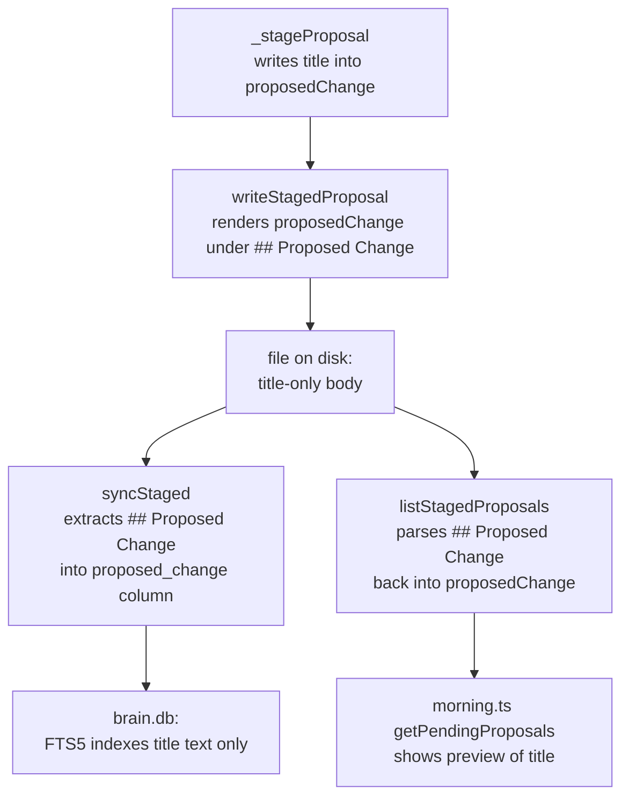

# AAR-0008: Fix Staged Proposal Content-Persistence Bug + Add Title Field

## Objective

The autonomous distill pipeline has been wiping the body of every staged proposal since AAR-0007 shipped. 77 staged files currently contain a one-line title in their `## Proposed Change` section instead of the actual proposed soul edit. The bug is a single-line type error in `_stageProposal()`. The fix is small, but it requires a coordinated change across the staging type, the file format, the brain.db schema, and the morning briefing — because the consumers all assume `proposedChange` IS the body, and we need to surface `title` as a separate field so reviewers can see both.

This task is the cleanup pass: fix the bug at its source, evolve the data model so title and content are independent, migrate the corrupted files out of the way, and pin the regression with a round-trip test.

## Context

### The bug

`src/libs/autonomous-distill.ts` line 625, inside `_stageProposal()`:

```typescript
const stagedProposal: StagedProposal = {
  agent,
  date: today,
  proposedChange: proposal.title,    // ← BUG — should be proposal.content
  section: proposal.section,
  ...
};
```

`ParsedProposal` has both `title: string` and `content: string`. `parseDistillOutput()` populates both correctly from Gemini's `=== PROPOSAL N: {title} ===` line and `CONTENT:` block. Gates and judges receive `proposal.content` correctly. Only the staging path drops it on the floor and substitutes the title.

### Downstream blast radius



Every consumer downstream of the bug treats `proposedChange` as if it were the content because that's what the type contract says. The bug is the *only* thing wrong — fix it and the contract is honest again. But while we're here, the type contract itself is impoverished: there is no way for a reviewer to see the title separately from the body. After the fix, `proposedChange` will contain a multi-line content block; the morning briefing's "first line" preview will be the first line of content, which may not match what Gemini called the proposal. The 77 staged files have already proven this matters — when Holmes and the user looked at them, they saw 77 useful titles and zero useful bodies.

**Conclusion:** the type needs both fields.

### Constraints (Postmortem reflexes)

1. **Knight Capital — dormant code is a live grenade.** The buggy line 625 has run 77 times producing 77 corrupted files. Until it's deleted, every future pipeline run produces more. The fix must land before AAR-0009 begins or the optimization work will be done on top of a broken contract.
2. **AWS — blast radius.** The change touches the type, the writer, the reader, the syncer, the schema, and the morning briefing. Every consumer that destructures `StagedProposal` must be updated in lockstep. No partial migration.
3. **Cloudflare — validate the limit at deploy time, not crash time.** The reason this bug ran for two days is that there was no round-trip test. We add one. A staged proposal must survive `write → read → parse` with both fields intact, or CI fails.

### Migration of the 77 corrupted files

These files cannot be recovered. The `content` field was never written to disk and is not in any backup. They have value only as forensic evidence of how the bug behaved.

| Option | Decision |
|---|---|
| Leave in place | **Rejected.** They will continue to confuse the morning briefing and FTS5 search will keep returning title-only matches. |
| Delete outright | **Rejected.** Loses forensic value; user explicitly asked for archival. |
| Archive to `vault/studio/memory/{agent}/staged/archive-pre-fix/` and re-sync | **ACCEPTED.** Files preserved for inspection, removed from the live `staged/` scan path, brain.db `staged_proposals` rows orphaned and cleaned up by the existing orphan-removal pass in `syncStaged()`. |

The migration is a one-shot script that runs once after the code changes land. It is NOT part of the pipeline. Ryan writes it as a CLI tool (`src/tools/migrate-staged-pre-fix.ts`) and the user invokes it manually.

## Architecture Decision

### ADR — Add `title` as a first-class field on `StagedProposal`

**Context:** The bug forces us to touch every consumer of the staging path. Once we're in the file, surfacing `title` separately costs almost nothing extra and yields a real UX win for the morning briefing and (eventually) the human review tool.

**Options considered:**

| Option | Pros | Cons |
|---|---|---|
| A. Fix only the bug (assign content, keep one field) | Smallest diff. | Reviewers lose the human-readable title that Gemini emits. Morning briefing has to guess a label from the first line of content. |
| B. Add `title` field, keep `proposedChange` as content | Title and content both first-class. Morning briefing gets clean labels. FTS5 can index title separately. | Touches type, writer, reader, syncer, schema, queries, morning. (Already touching all of them.) |
| C. Rename `proposedChange` → `content` and add `title` | Cleanest naming. | Larger diff for no behavioural gain; more rename churn across consumers. |

**Decision:** Option B. Add `title: string` to `StagedProposal`. Keep the existing field name `proposedChange` (its meaning becomes "the content body" — which is what the original AAR-0005 spec implied when it said "the text to be added/removed/modified"). Renaming is cosmetic debt; we tolerate it.

**Consequences:**
- `staged_proposals` table needs a new `title TEXT NOT NULL` column. The 77 archived files won't be indexed, so we don't need a backfill.
- The on-disk file format gains a `title` field in frontmatter. Existing files (after archival) won't conform; new files will.
- FTS5 should index `title` alongside `proposed_change` and `reason` so reviewers can search by Gemini's headline.

### ADR — Round-trip test as the regression pin

**Context:** The bug existed because no test exercised the `write → read → field equality` path.

**Decision:** Add `src/libs/__tests__/staged-roundtrip.test.ts` (Bun test). It constructs a synthetic `StagedProposal` with distinct title and content, calls `writeStagedProposal()`, then `listStagedProposals()`, and asserts both fields survive. It runs in a temporary directory under `out/` so it doesn't pollute the real vault.

**Note:** Bun test has known instability on Windows (see `feedback_bun_test_broken`). If `bun test` segfaults, fall back to a runtime smoke script at `src/tools/__smoke__/staged-roundtrip.ts` that asserts via `process.exit(1)` on failure. Ryan picks the path that works on his machine and documents which one.

## File-by-File Spec

### 1. `src/libs/staged.ts`

**Type change:**

```typescript
export interface StagedProposal {
  agent: string;
  date: string;
  title: string;                         // NEW — Gemini's "=== PROPOSAL N: {title} ===" headline
  proposedChange: string;                // unchanged name, semantics now = content body
  section: string;
  changeType: "add" | "remove" | "modify";
  evidence: string;
  gateResults: AllGatesResult;
  judgeResults: JudgePanelResult | null;
  reason: string;
  status: "pending" | "approved" | "rejected";
}
```

**`writeStagedProposal()` changes:**

The slug for the filename should come from `proposal.title` (short, human-meaningful), not `proposal.proposedChange` (long content body). This is a behaviour improvement — current filenames are slugs of titles by accident, new filenames are slugs of titles by intent.

```typescript
const slug = toSlug(proposal.title, 40);
```

The frontmatter gains a `title` field. Title strings can contain colons, quotes, and other YAML hazards — escape them with the same rule the existing `reason` field uses (replace `"` with `'`, wrap in `"`):

```typescript
const safeTitle = proposal.title.replace(/"/g, "'");

const content = `---
type: staged_proposal
agent: ${proposal.agent}
date: ${proposal.date}
title: "${safeTitle}"
section: "${proposal.section}"
change_type: ${proposal.changeType}
status: ${proposal.status}
reason: "${proposal.reason.replace(/"/g, "'")}"
created: ${createdAt}
---

# ${proposal.title}

## Proposed Change

${proposal.proposedChange}

## Evidence

${proposal.evidence}

## Gate Results

${formatGateResults(proposal.gateResults)}

## Judge Results

${formatJudgeResults(proposal.judgeResults)}

## Reason for Staging

${proposal.reason}

## Decision

Status: ${proposal.status}
`;
```

The H1 `# ${proposal.title}` heading is added so the file is self-describing when opened in Obsidian. The existing files have no H1 — that was an oversight in AAR-0005 that we correct here.

**`listStagedProposals()` changes:**

Pull `title` out of frontmatter. Fall back to the H1 if frontmatter is missing it. Fall back to empty string only as a last resort (and log a warning to stderr — that means we hit a corrupted file).

```typescript
const fm = parseFm(rawContent);

const titleFromFm = fm.title ?? "";
const h1Match = rawContent.match(/^#\s+(.+)$/m);
const titleFromH1 = h1Match ? h1Match[1].trim() : "";
const title = titleFromFm || titleFromH1 || "";

if (!title) {
  process.stderr.write(`[staged] warning: no title in ${filePath}\n`);
}

// ... rest of parsing unchanged ...

const proposal: StagedProposal = {
  agent: fm.agent ?? agentName,
  date: fm.date ?? "",
  title,                                 // NEW
  proposedChange,
  section: fm.section ?? "",
  changeType: (fm.change_type as StagedProposal["changeType"]) ?? "modify",
  evidence,
  gateResults,
  judgeResults,
  reason: fm.reason ?? "",
  status: (fm.status as StagedProposal["status"]) ?? "pending",
};
```

### 2. `src/libs/autonomous-distill.ts`

**`_stageProposal()` — the bug fix:**

```typescript
const stagedProposal: StagedProposal = {
  agent,
  date: today,
  title: proposal.title,                 // NEW — pass the Gemini headline through
  proposedChange: proposal.content,      // FIXED — was proposal.title
  section: proposal.section,
  changeType: proposal.type,
  evidence: proposal.evidence,
  gateResults,
  judgeResults,
  reason,
  status: "pending",
};
```

No other changes in this file. The pipeline already has `proposal.title` and `proposal.content` correctly populated by `parseDistillOutput()`.

### 3. `src/libs/brain/schema.ts`

Add `title` column to the Drizzle definition:

```typescript
export const stagedProposals = sqliteTable("staged_proposals", {
  id: integer("id").primaryKey({ autoIncrement: true }),
  agent: text("agent").notNull(),
  title: text("title").notNull().default(""),  // NEW
  section: text("section").notNull(),
  changeType: text("change_type").notNull(),
  proposedChange: text("proposed_change").notNull(),
  reason: text("reason").notNull(),
  status: text("status").notNull(),
  sourcePath: text("source_path").notNull().unique(),
  fileHash: text("file_hash").notNull(),
  embedding: text("embedding"),
  embedModel: text("embed_model"),
  embeddedAt: text("embedded_at"),
  createdAt: text("created_at").notNull(),
  updatedAt: text("updated_at").notNull(),
});
```

The `default("")` is required because brain.db is live and there may be stray rows from a half-archived state. Default lets the migration ALTER TABLE succeed without rejecting NULL on existing rows.

### 4. `src/libs/brain/index.ts`

Two changes inside `initBrain()`:

**a. Update the `CREATE TABLE` to include `title`** (for fresh databases):

```sql
CREATE TABLE IF NOT EXISTS staged_proposals (
  id INTEGER PRIMARY KEY AUTOINCREMENT,
  agent TEXT NOT NULL,
  title TEXT NOT NULL DEFAULT '',
  section TEXT NOT NULL,
  change_type TEXT NOT NULL,
  proposed_change TEXT NOT NULL,
  reason TEXT NOT NULL,
  status TEXT NOT NULL,
  source_path TEXT NOT NULL UNIQUE,
  file_hash TEXT NOT NULL,
  embedding TEXT,
  embed_model TEXT,
  embedded_at TEXT,
  created_at TEXT NOT NULL,
  updated_at TEXT NOT NULL
);
```

**b. Add an idempotent ALTER for existing databases.** Drop this immediately after the CREATE TABLE block:

```typescript
// Migration: add title column if missing (added in AAR-0008)
try {
  const cols = raw.prepare("PRAGMA table_info(staged_proposals)").all() as { name: string }[];
  const hasTitle = cols.some(c => c.name === "title");
  if (!hasTitle) {
    raw.exec("ALTER TABLE staged_proposals ADD COLUMN title TEXT NOT NULL DEFAULT ''");
  }
} catch {
  // table doesn't exist yet — CREATE TABLE above handles fresh DBs
}
```

The migration must also drop and recreate the `staged_fts` virtual table because FTS5 content tables can't have columns added at runtime — the FTS schema is fixed at creation:

```typescript
// staged_fts must be rebuilt to include title (AAR-0008)
try {
  const ftsHasTitle = raw
    .prepare("SELECT sql FROM sqlite_master WHERE type='table' AND name='staged_fts'")
    .get() as { sql: string } | null;
  if (ftsHasTitle && !ftsHasTitle.sql.includes("title")) {
    raw.exec("DROP TABLE IF EXISTS staged_fts");
    // initFts() below will recreate it with the new column set
  }
} catch {}
```

The drop must happen BEFORE `initFts(raw)` is called, so the recreated virtual table picks up the new column list.

### 5. `src/libs/brain/fts.ts`

Add `title` to the staged FTS5 column list:

```typescript
db.exec(`
  CREATE VIRTUAL TABLE IF NOT EXISTS staged_fts USING fts5(
    title, proposed_change, reason,
    content=staged_proposals, content_rowid=id
  );
`);

createSyncTriggers(db, "staged_proposals", "staged_fts", ["title", "proposed_change", "reason"]);
```

### 6. `src/libs/brain/sync.ts`

Inside `syncStaged()`, parse `title` from frontmatter and pass it through to the INSERT. Two changes:

**a. After the `fmMatch` parse loop, extract title:**

```typescript
const title = fm.title ?? "";
```

**b. Update the INSERT statement and parameters:**

```typescript
raw.exec(`
  INSERT INTO staged_proposals (
    agent, title, section, change_type, proposed_change, reason,
    status, source_path, file_hash, created_at, updated_at
  )
  VALUES (?, ?, ?, ?, ?, ?, ?, ?, ?, ?, ?)
  ON CONFLICT(source_path) DO UPDATE SET
    agent=excluded.agent, title=excluded.title, section=excluded.section,
    change_type=excluded.change_type, proposed_change=excluded.proposed_change,
    reason=excluded.reason, status=excluded.status,
    file_hash=excluded.file_hash, updated_at=excluded.updated_at
`.trim(), [agent, title, section, changeType, proposedChange, reason, status, sourcePath, hash, createdAt, ts] as any);
```

### 7. `src/libs/brain/queries.ts`

The `searchStaged()` function (line ~1258) selects from `staged_proposals`. Add `title` to the SELECT and the returned row shape. The `StagedResult` interface (find it nearby in the file) needs a new `title` field. The FTS5 MATCH already covers the new column because it's listed in the virtual table.

```typescript
let sqlStr = `
  SELECT sp.id, sp.agent, sp.title, sp.section, sp.change_type, sp.proposed_change,
         sp.reason, sp.status, sp.source_path, sp.created_at,
         rank
  FROM staged_fts
  JOIN staged_proposals sp ON sp.id = staged_fts.rowid
  WHERE staged_fts MATCH ?
`;
```

Map `r.title` into the returned `title` field.

### 8. `src/tools/morning.ts`

The pending-soul-changes block (line 185-197) currently builds a preview from `p.proposedChange.split("\n")[0]`. After the fix that produces a content snippet, which is OK but not as informative as a title. Use title when available, fall back to content first line:

```typescript
try {
  const proposals = getPendingProposals();
  for (const f of proposals) {
    const p = f.proposal;
    const label = p.title || (p.proposedChange.split(/\r?\n/)[0] ?? "");
    const preview = label.length > 40 ? label.slice(0, 40) + "…" : label;
    const reason = p.reason.length > 60 ? p.reason.slice(0, 60) + "…" : p.reason;
    result.pending.push(`? ${capitalize(p.agent)}: "${preview}" — ${reason}`);
  }
} catch {
  // silently omit on error
}
```

### 9. `src/libs/__tests__/staged-roundtrip.test.ts` (NEW)

```typescript
import { test, expect } from "bun:test";
import { writeStagedProposal, listStagedProposals } from "../staged.js";
import type { StagedProposal } from "../staged.js";
import { mkdirSync, rmSync, existsSync } from "fs";
import { join } from "path";
import { fromRoot } from "../paths.js";

// Round-trip a staged proposal through write → list → field equality.
// Pins AAR-0008: title and proposedChange must both survive disk persistence.
test("staged proposal round-trip preserves title and content", () => {
  // Use a synthetic agent under the real memory root so listStagedProposals
  // discovers it through its normal scan path. Clean up after.
  const TEST_AGENT = "__roundtrip_test__";
  const stagedDir = fromRoot("vault", "studio", "memory", TEST_AGENT, "staged");
  mkdirSync(stagedDir, { recursive: true });

  try {
    const input: StagedProposal = {
      agent: TEST_AGENT,
      date: "2026-04-07",
      title: "Always run regression after embed model swap",
      proposedChange: "When the embedding model changes, the entire vector index must be re-embedded.\nNo partial swaps. Run `brain --re-embed` after any model upgrade.",
      section: "Hard Rules",
      changeType: "add",
      evidence: "Confirmed in 3 separate workflow logs (2026-04-02, -03, -05)",
      gateResults: { passed: false, results: [], failedGates: ["constitution"] },
      judgeResults: null,
      reason: "Constitution gate flagged identity drift",
      status: "pending",
    };

    writeStagedProposal(input);
    const found = listStagedProposals(TEST_AGENT);

    expect(found.length).toBe(1);
    const out = found[0].proposal;
    expect(out.title).toBe(input.title);
    expect(out.proposedChange).toBe(input.proposedChange);
    expect(out.section).toBe(input.section);
    expect(out.changeType).toBe(input.changeType);
    expect(out.reason).toBe(input.reason);
    expect(out.status).toBe(input.status);
  } finally {
    if (existsSync(stagedDir)) {
      rmSync(join(stagedDir, ".."), { recursive: true, force: true });
    }
  }
});
```

If `bun test` segfaults on Windows, copy the body of this test into `src/tools/__smoke__/staged-roundtrip.ts` with `process.exit(1)` on assertion failure and run via `bun src/tools/__smoke__/staged-roundtrip.ts`.

### 10. `src/tools/migrate-staged-pre-fix.ts` (NEW — one-shot migration)

```typescript
#!/usr/bin/env bun
/**
 * One-shot: archive the 77 corrupted pre-AAR-0008 staged proposals.
 *
 * Walks vault/studio/memory/{agent}/staged/*.md, moves each file to
 * vault/studio/memory/{agent}/staged/archive-pre-fix/, then re-runs
 * brain --check to let syncStaged()'s orphan-removal pass clean up
 * the corresponding rows in staged_proposals.
 *
 * Idempotent — running it after the corrupted files are archived is a no-op.
 *
 * Usage:
 *   bun run tool migrate-staged-pre-fix --dry-run
 *   bun run tool migrate-staged-pre-fix --apply
 */

import { readdirSync, mkdirSync, renameSync, existsSync, statSync } from "fs";
import { join } from "path";
import { fromRoot } from "../libs/paths.js";

const MEMORY_ROOT = fromRoot("vault", "studio", "memory");

async function main() {
  const args = process.argv.slice(2);
  const apply = args.includes("--apply");

  if (!existsSync(MEMORY_ROOT)) {
    console.error(`Memory root not found: ${MEMORY_ROOT}`);
    process.exit(1);
  }

  let total = 0;
  for (const agent of readdirSync(MEMORY_ROOT)) {
    const stagedDir = join(MEMORY_ROOT, agent, "staged");
    if (!existsSync(stagedDir) || !statSync(stagedDir).isDirectory()) continue;

    const archiveDir = join(stagedDir, "archive-pre-fix");
    const files = readdirSync(stagedDir).filter(f => f.endsWith(".md"));
    if (files.length === 0) continue;

    if (apply) mkdirSync(archiveDir, { recursive: true });

    for (const f of files) {
      const src = join(stagedDir, f);
      const dst = join(archiveDir, f);
      if (apply) renameSync(src, dst);
      console.log(`${apply ? "MOVED" : "DRY-RUN"} ${src} -> ${dst}`);
      total++;
    }
  }

  console.log(`\n${apply ? "Migrated" : "Would migrate"} ${total} files.`);
  if (apply) {
    console.log("Now run: bun run tool brain --check");
    console.log("This will orphan-remove the stale staged_proposals rows.");
  }
}

main().catch(err => {
  console.error(err);
  process.exit(1);
});
```

Register it as a tool by exporting `toolDef` if Ryan wants the tool runner to pick it up. A bare CLI script is acceptable for one-shot migrations — register if trivial, skip if it adds friction.

## Sequencing within the task

Ryan executes in this order. Each step compiles cleanly before moving on.

```mermaid
graph LR
  S1[1. staged.ts<br/>type + write + read] --> S2[2. autonomous-distill.ts<br/>fix line 625]
  S2 --> S3[3. schema.ts]
  S3 --> S4[4. brain/index.ts<br/>+ALTER migration]
  S4 --> S5[5. brain/fts.ts]
  S5 --> S6[6. brain/sync.ts]
  S6 --> S7[7. queries.ts]
  S7 --> S8[8. morning.ts]
  S8 --> S9[9. round-trip test]
  S9 --> S10[10. migrate-staged-pre-fix tool]
  S10 --> S11[11. user runs migration manually]
```



The migration tool is the LAST step and runs once, manually. Ryan does not invoke it on the user's behalf.

## Acceptance Criteria

1. **`StagedProposal` type has `title: string` and `proposedChange: string`.** Both required.
2. **`_stageProposal()` passes `proposal.title` and `proposal.content` separately.** Confirm by reading the new `_stageProposal` source — no `proposal.title` may appear as the value of `proposedChange`, anywhere.
3. **`writeStagedProposal()` produces a file with `title:` in frontmatter, `# {title}` H1, and full content body under `## Proposed Change`.**
4. **`listStagedProposals()` returns objects with both `title` and `proposedChange` populated.** Verified by the round-trip test.
5. **brain.db `staged_proposals` table has a `title` column.** Verified by `PRAGMA table_info(staged_proposals)` returning a row with `name = 'title'`.
6. **`staged_fts` virtual table indexes `title`.** Verified by `SELECT sql FROM sqlite_master WHERE name='staged_fts'` containing the substring `title`.
7. **`searchStaged()` returns `title` in result objects.** Manual: `bun run tool brain --search-staged "test"` shows the title in output.
8. **Round-trip test passes** (or smoke script exits 0): writing a `StagedProposal` with distinct `title` and `proposedChange`, then reading it back via `listStagedProposals()`, yields field equality on both fields.
9. **`migrate-staged-pre-fix --dry-run` lists 77 files.** Verified by counting output lines.
10. **After `--apply` and `brain --check`:** the live `staged/` dirs are empty, `archive-pre-fix/` dirs contain the originals, and `SELECT COUNT(*) FROM staged_proposals` is 0 (or only contains rows from new pipeline runs the user has performed since).
11. **Morning briefing previews use title when present.** Verified by running `bun run tool morning` after the migration and a fresh staging run — pending proposals show titles, not first lines of content.
12. **No new `bun run tool` invocations are introduced inside library code.** Migration runs once, by the user. Pipeline code does not auto-migrate.

## Constraints

- **Sequential only.** This task must complete and merge before AAR-0009 starts. AAR-0009 builds on the corrected `StagedProposal` type. No worktree parallelism.
- **No backfill of the 77 archived files.** Their content is unrecoverable. Do not write fake content.
- **Don't change the slug logic to use content.** Filename slug stays derived from the title — that's what was happening accidentally and it was correct accidentally.
- **The ALTER TABLE migration must be idempotent.** Re-running `initBrain()` on a DB that already has the column must not error. Check with `PRAGMA table_info` first.
- **The FTS5 drop-and-recreate is the only safe migration.** SQLite FTS5 contentless and content-rowid tables cannot be altered in place. Dropping is safe because triggers (recreated by `initFts()`) repopulate from `staged_proposals`. The next `syncStaged()` rebuilds everything.
- **Round-trip test must clean up after itself.** Use a synthetic agent name with double underscores so it's obviously test-only, and `rmSync` the synthetic dir in a `finally` block.
- **Do not delete the 77 files.** Archive only.
- **Do not regenerate proposals from old reflection logs.** The 77 originals are gone; the next pipeline run will produce new (correct) ones organically.

## Out of Scope

- Building a human review tool / approval UI. The frontmatter-edit workflow from AAR-0005 still applies.
- Vector embeddings on `staged_proposals`. FTS5 is still sufficient.
- Backfilling `title` for the 77 archived files (impossible — title was preserved but the bug means content is gone, and there's no value in re-indexing title-only stubs).
- Changing the gate or judge contracts. They already see correct content.
- Renaming `proposedChange` to `content`. Cosmetic debt. Tolerated.
- Performance work. That's AAR-0009.

## Failure Modes

| Failure | Detection | Mitigation |
|---|---|---|
| ALTER TABLE fails because brain.db is locked by another process | `initBrain()` throws on next `--check` | Stop the offending process, retry. Migration is idempotent. |
| FTS5 drop succeeds but recreate fails | `syncStaged()` errors on next run | Triggers in `createSyncTriggers()` are recreated by `initFts()`. Worst case: re-run `initBrain()`. |
| Round-trip test fails on Windows (Bun test segfault) | `bun test` exits non-zero with no useful trace | Fall back to `src/tools/__smoke__/staged-roundtrip.ts` runtime script. Document which path Ryan used. |
| Migration moves files but `brain --check` doesn't clean orphans | `SELECT COUNT(*) FROM staged_proposals` still > 0 after migration | Existing `syncStaged()` orphan-removal pass handles this — if it doesn't, that's a pre-existing bug that surfaces here and gets a follow-up task. |
| User runs the migration twice | Second run finds zero files | Idempotent by design — `--dry-run` reports 0, `--apply` is a no-op. |
