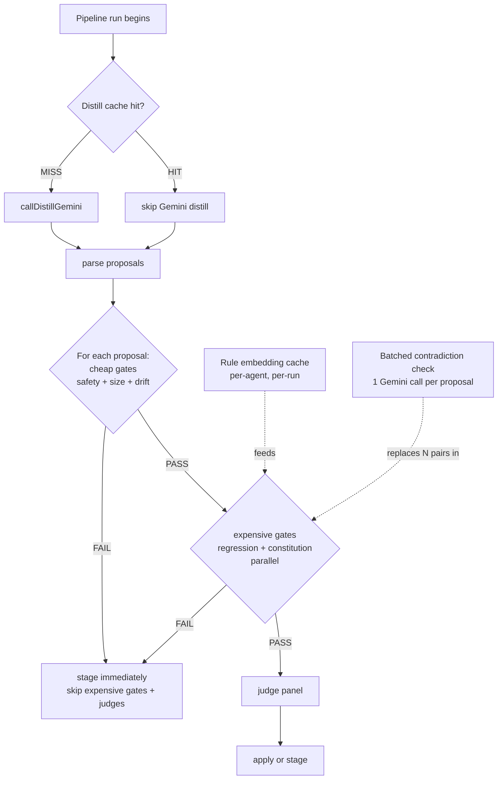
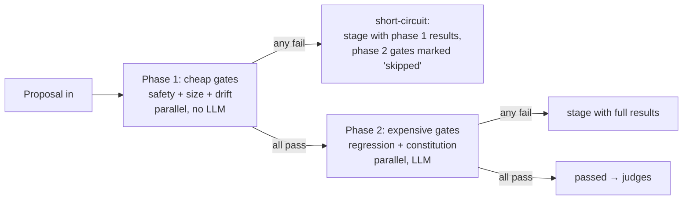
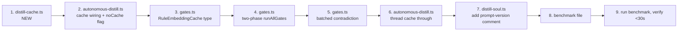

# AAR-0009: Distill Pipeline Optimization Phase 1

## Objective

Cut the autonomous distill pipeline runtime by skipping work that doesn't need to happen. The current pipeline takes ~8.7 minutes to process 21 proposals across 5 agents. Most of that time is repeated Gemini calls for distillation that hasn't changed and gate checks that fire even when cheaper checks have already failed. This task lands four optimizations in one sequenced pass:

1. **Distill cache** — skip `callDistillGemini()` when the agent's knowledge files and soul file haven't changed since the last run
2. **Two-phase gate ordering** — run cheap deterministic gates first, short-circuit on failure, then run expensive LLM gates
3. **Per-run rule embedding cache** — embed each agent's soul rules once per pipeline invocation, reuse across all proposals for that agent
4. **Batched contradiction check** — collapse N per-pair Gemini calls in `runRegressionGate()` into one batched call

Target: a no-op rerun (cache hit on all 5 agents, no proposals to process) completes in **under 30 seconds**, vs ~520 seconds today. A live rerun with all 5 agents reprocessing fresh proposals should drop from ~520s to ~200-280s.

This is an optimization pass. **Correctness must not change.** Gates and judges must see the same content they see today. Failure semantics (which proposal gets staged vs auto-applied) must be identical.

## Context

### Current bottleneck breakdown (profiled, do not re-investigate)

```
Total: 524500ms for 21 proposals across 5 agents
```

| Stage | Cost per call | Calls per run | Total | Optimizable? |
|---|---|---|---|---|
| `callDistillGemini` (full knowledge prompt to Gemini) | 30-60s | 5 (1/agent) | 150-300s | YES — cache by content hash |
| `runConstitutionGate` (Gemini) | 5-10s | 21 (1/proposal) | 105-210s | PARTIAL — short-circuit on prior gate failure |
| `runRegressionGate` per-pair Gemini contradiction check | 1-3s × N pairs | unbounded | 30-100s | YES — batch into single call per proposal |
| `runRegressionGate` `embedBatch(rules)` | <1s (local ONNX) | 21 (1/proposal) | ~10s | YES — cache per agent per run |
| `runJudgePanel` (3 LLM judges in parallel) | 5-10s (slowest wins) | 21 (1/proposal) | 105-210s | NO — already parallel, judge content is novel each time |
| File I/O, parsing, brain.db writes | <100ms each | varies | <5s | NO — not the bottleneck |

**Important constraint:** Embeddings are **local ONNX** (`embeddings.ts`, line 26: `pipeline("feature-extraction", "Xenova/all-MiniLM-L6-v2")`). They are CPU/WASM inference, not network calls. The per-agent rule embedding cache saves CPU-seconds per proposal, not API dollars. It's still worth doing because it's cheap to implement, but the headline savings come from the Gemini-side optimizations.

### Why these four, in this order



The cache wins on no-ops. The gate ordering wins on failing proposals. The embedding cache wins on every proposal an agent has past the first. The batched contradiction check wins when a proposal has multiple high-similarity rule matches. The four are independent — if any one fails to land, the others still ship value.

### Constraints (Postmortem reflexes)

1. **Knight Capital — caches are dormant code unless the invalidation key is bulletproof.** A stale distill cache hit means we skip Gemini and miss real proposals. The cache key MUST include every input that affects Gemini's output: agent knowledge dir hash, shared knowledge dir hash, soul file hash, and the prompt template version. If any of those change, the key changes. No partial keys.
2. **AWS — cache is a single point of failure.** If the cache returns garbage, the entire pipeline produces garbage. Defensive read: validate the cache entry's structure on load, fall through to live Gemini on any parse failure. Never trust a cache file.
3. **Cloudflare — validate the limit at deploy time.** Add the benchmark file. If the cache hit no-op run is not under 30s in CI, fail the build. We don't ship optimizations we can't measure.

### What stays the same

- Pipeline structure: distill → gates → judges → apply/stage
- Failure modes: any gate fail = stage; any judge dissent = stage; apply throw = stage
- Data flowing through: gates and judges see exactly the same `GateInput` / `JudgePanelInput` they see today
- The "all gates always run on success" property: when a proposal passes, the human review path still gets full results from all 5 gates. Short-circuit ONLY fires when at least one gate has already failed.
- Sequential processing per agent (soul file mutates) and sequential across agents (avoid rate limits) — no parallelism added in this pass

## Architecture Decisions

### ADR-1 — Cache location: file system, not brain.db

**Context:** The distill cache stores raw Gemini output keyed by a content hash. It is read at the start of every pipeline run.

**Options:**

| Option | Pros | Cons |
|---|---|---|
| A. File system at `vault/studio/usage/distill-cache/{agent}-{hash}.json` | Trivial to debug (cat the file). No DB schema changes. Survives DB rebuilds. Easy to manually invalidate (rm). | Not indexed, but we don't need indexing — keyed lookup only. |
| B. brain.db `distill_cache` table | Centralized. Already have sync infrastructure. | Adds schema, FTS isn't needed, embeddings aren't needed, and the cache is hot-path on every run — DB locks become a tail-latency risk. |
| C. In-memory only | Fastest on cache hit. | Lost between pipeline runs — defeats the purpose entirely. |

**Decision:** Option A. File system. The cache is per-agent and small (one JSON per agent, contents are the raw distill output ~5-20KB). Listing the directory and reading one file by name is faster than a SQLite open + query for a hot-path read.

**Consequences:**
- New directory: `vault/studio/usage/distill-cache/`. Add to `.gitignore` if not already covered (the `vault/` root is gitignored, so it inherits).
- Cache files are throwaway. Wiping the directory forces a full re-distill. Document this in the cache module.

### ADR-2 — Cache key construction

The cache hit predicate must be: "would `callDistillGemini()` produce the exact same Gemini call (same prompt) right now?" The prompt is built from:

1. The current soul file content
2. Every `.md` file in `vault/studio/memory/{agent}/knowledge/`
3. Every `.md` file in `vault/studio/memory/shared/knowledge/`
4. The prompt template inside `callDistillGemini()` itself

If any of those change, the cache must miss.

**Key formula:**

```typescript
function buildCacheKey(agent: string): string {
  const soulHash = sha256(readFileSync(soulPath));
  const agentKnowledgeHash = hashDirectoryContents(agentKnowledgeDir);
  const sharedKnowledgeHash = hashDirectoryContents(sharedKnowledgeDir);
  const promptVersion = DISTILL_PROMPT_VERSION; // bump manually when prompt changes
  const composite = `${soulHash}:${agentKnowledgeHash}:${sharedKnowledgeHash}:${promptVersion}`;
  return sha256(composite).slice(0, 16);
}

function hashDirectoryContents(dir: string): string {
  if (!existsSync(dir)) return "empty";
  const files = readdirSync(dir).filter(f => f.endsWith(".md")).sort();
  const h = createHash("sha256");
  for (const f of files) {
    h.update(f);                                  // filename — order matters for invalidation
    h.update(readFileSync(join(dir, f)));         // content
  }
  return h.digest("hex");
}
```

**Sorting filenames is mandatory** — `readdirSync` order is filesystem-dependent on Windows vs Linux, and a non-deterministic order produces a non-deterministic hash. The sort makes the hash stable.

**Prompt version bump rule:** any edit to the prompt string inside `callDistillGemini()` requires bumping `DISTILL_PROMPT_VERSION` (a constant exported from `distill-cache.ts`). Document this rule next to the constant.

### ADR-3 — TTL: none. Hash-only invalidation.

**Context:** Should cache entries expire after some time?

**Decision:** No TTL. The cache is invalidated only by content changes. Reasoning: Gemini's output is a deterministic function of the inputs (modulo temperature, which we accept as cache-acceptable noise — the consolidation and judging steps catch real drift). Time-based expiration would cause needless re-distills with no quality gain.

**Escape hatch:** Add a `--no-cache` flag to the pipeline CLI for the rare case where the user wants a forced re-run without manually nuking the cache directory.

### ADR-4 — Two-phase gates: short-circuit only on failure

**Context:** AAR-0003 explicitly stated "all gates always run — no short-circuit — to collect full results for human review." That property is valuable when a proposal passes (the human reviewer wants to see the full picture). It is wasted work when a proposal fails (we already know it's getting staged).

**Decision:** Split `runAllGates()` into two phases. Phase 1 runs the deterministic gates (safety, size, drift). Phase 2 runs the expensive gates (regression, constitution).



**Critical:** when phase 1 short-circuits, the staged proposal still needs all 5 gates represented in the output for the human reviewer. Phase 2 gates get a synthetic `GateResult` with `pass: false, reason: "skipped — phase 1 failure"` so the staged file doesn't have missing rows. This preserves the AAR-0005 file format and the AAR-0006 morning briefing display.

```typescript
// Synthetic skipped result when phase 1 short-circuits
function skippedGateResult(name: string): GateResult {
  return { gate: name, pass: false, reason: "skipped — phase 1 failure" };
}
```

The `failedGates` array on `AllGatesResult` should NOT include skipped gates — only the gates that actually failed. Otherwise the morning briefing's "failed gates" list will be misleading.

### ADR-5 — Per-agent rule embedding cache: lifetime = single pipeline run

**Context:** `runRegressionGate()` calls `embedBatch(rules)` for every proposal. The rules come from the same soul file across all proposals for an agent.

**Decision:** A `Map<string, EmbeddingMap>` parameter passed into `runAllGates()` (or held inside `runRegressionGate()` via a context object). Lifetime = single pipeline run. Created at the start of `autonomousDistill()`, passed down, garbage collected when the pipeline returns.

**Why not persist across runs:** The soul file mutates between proposals (auto-apply path). The cache key would have to be the soul file hash, and that means recomputing the hash on every iteration. Cheaper to just re-embed when the soul changes. Within a single pipeline run for a single agent, the soul file CAN change (after each auto-apply) — so the cache key for the embedding cache is the soul file content hash, scoped to the pipeline run.

```typescript
interface RuleEmbeddingCache {
  // key: sha256 of the soul file content used to extract rules
  // value: parallel arrays of rule strings and their embeddings
  get(soulHash: string): { rules: string[]; embeddings: (number[] | null)[] } | null;
  set(soulHash: string, rules: string[], embeddings: (number[] | null)[]): void;
}
```

### ADR-6 — Batched contradiction check: one Gemini call per proposal

**Context:** `runRegressionGate()` currently does:

```typescript
for each rule:
  for each change:
    if (cosineSim(rule, change) > 0.85):
      callGemini("CONTRADICTION or COMPATIBLE?")
```

For a proposal with 1 change and N high-similarity rules, that's N Gemini calls. Each is small (256 tokens) but they serialize because there's no `Promise.all` around the inner loop.

**Decision:** Collect all `(rule, change)` high-similarity pairs into a list, then issue ONE Gemini call that asks about all of them at once. Parse a structured response.

**Prompt format:**

```
You are reviewing a proposed soul file change against existing rules. For each pair below, label it CONTRADICTION or COMPATIBLE. Reply with one label per line, in order.

Pair 1:
  Existing rule: {rule_a}
  Proposed change: {change_a}

Pair 2:
  Existing rule: {rule_b}
  Proposed change: {change_a}

...

Reply format (one line per pair, in order):
1. CONTRADICTION | COMPATIBLE
2. CONTRADICTION | COMPATIBLE
...
```

**Parsing:** split response by lines, regex match `^\d+\.\s*(CONTRADICTION|COMPATIBLE)`, fallback to per-pair `sim > 0.92` heuristic on parse failure (matches current fallback behaviour).

**Edge cases:**
- Zero high-similarity pairs → don't call Gemini at all, return `pass: true` early
- More than 20 high-similarity pairs → cap at 20, batch the rest in a follow-up call (or just take the top 20 by similarity — document the choice)
- Gemini returns wrong number of lines → fall back to per-pair similarity heuristic for missing entries

### ADR-7 — Benchmarks are mandatory acceptance criteria

**Context:** "Faster" is not a verifiable claim without numbers.

**Decision:** Add `src/libs/__benchmarks__/autonomous-distill.bench.ts` that runs the pipeline twice in a row against a synthetic agent with mocked Gemini responses (or a real cache hit on a real agent if the user has one available). Print before/after timing and assert the second run completes in under 30 seconds. The benchmark is invoked manually by Ryan during AC validation, not on every CI run.

## File-by-File Spec

### 1. `src/libs/distill-cache.ts` (NEW)

```typescript
/**
 * distill-cache.ts — File-system cache for callDistillGemini() output.
 *
 * Cache key = sha256(soul + agent knowledge + shared knowledge + prompt version).
 * Cache value = the RawDistillResult that callDistillGemini() would have returned.
 *
 * Lifetime: indefinite. Invalidated only by content hash changes.
 * Manual invalidation: rm vault/studio/usage/distill-cache/.
 *
 * BUMP DISTILL_PROMPT_VERSION whenever the prompt template inside
 * callDistillGemini() changes. Forgetting to bump is the only way to ship
 * a stale cache.
 */

import { existsSync, readFileSync, writeFileSync, mkdirSync, readdirSync } from "fs";
import { join } from "path";
import { createHash } from "crypto";
import { fromRoot } from "./paths.js";
import type { RawDistillResult } from "../tools/distill-soul.js";

export const DISTILL_PROMPT_VERSION = "v1-2026-04-07";

const CACHE_ROOT = fromRoot("vault", "studio", "usage", "distill-cache");
const SOULS_DIR = fromRoot(".claude", "souls");
const MEMORY_ROOT = fromRoot("vault", "studio", "memory");

interface CacheEntry {
  version: string;          // matches DISTILL_PROMPT_VERSION at write time
  agent: string;
  key: string;
  createdAt: string;
  result: RawDistillResult;
}

/** Build the deterministic cache key for an agent. */
export function buildCacheKey(agent: string): string {
  const soulPath = join(SOULS_DIR, `${agent}.md`);
  const agentKnowledgeDir = join(MEMORY_ROOT, agent, "knowledge");
  const sharedKnowledgeDir = join(MEMORY_ROOT, "shared", "knowledge");

  const soulContent = existsSync(soulPath) ? readFileSync(soulPath) : Buffer.from("missing");
  const soulHash = createHash("sha256").update(soulContent).digest("hex");

  const agentKnowledgeHash = hashDirectoryContents(agentKnowledgeDir);
  const sharedKnowledgeHash = hashDirectoryContents(sharedKnowledgeDir);

  const composite = `${soulHash}:${agentKnowledgeHash}:${sharedKnowledgeHash}:${DISTILL_PROMPT_VERSION}`;
  return createHash("sha256").update(composite).digest("hex").slice(0, 16);
}

function hashDirectoryContents(dir: string): string {
  if (!existsSync(dir)) return "empty";
  const files = readdirSync(dir).filter(f => f.endsWith(".md")).sort();
  if (files.length === 0) return "empty";
  const h = createHash("sha256");
  for (const f of files) {
    h.update(f);
    h.update(readFileSync(join(dir, f)));
  }
  return h.digest("hex");
}

/** Read a cached distill result. Returns null on miss or any read error. */
export function readDistillCache(agent: string, key: string): RawDistillResult | null {
  try {
    const path = join(CACHE_ROOT, `${agent}-${key}.json`);
    if (!existsSync(path)) return null;
    const raw = readFileSync(path, "utf-8");
    const entry = JSON.parse(raw) as CacheEntry;

    // Defensive validation — cache files are untrusted input
    if (!entry || entry.version !== DISTILL_PROMPT_VERSION) return null;
    if (entry.agent !== agent || entry.key !== key) return null;
    if (!entry.result || typeof entry.result.rawOutput !== "string") return null;

    return entry.result;
  } catch {
    return null;
  }
}

/** Write a distill result to the cache. Failures are non-fatal. */
export function writeDistillCache(agent: string, key: string, result: RawDistillResult): void {
  try {
    mkdirSync(CACHE_ROOT, { recursive: true });
    const entry: CacheEntry = {
      version: DISTILL_PROMPT_VERSION,
      agent,
      key,
      createdAt: new Date().toISOString(),
      result,
    };
    writeFileSync(join(CACHE_ROOT, `${agent}-${key}.json`), JSON.stringify(entry, null, 2), "utf-8");
  } catch {
    // Cache write failure is non-fatal — pipeline continues
  }
}

/** Wipe the entire distill cache. Used by --no-cache and as a manual escape hatch. */
export function clearDistillCache(): number {
  if (!existsSync(CACHE_ROOT)) return 0;
  let count = 0;
  for (const f of readdirSync(CACHE_ROOT)) {
    if (f.endsWith(".json")) {
      try {
        const { rmSync } = require("fs");
        rmSync(join(CACHE_ROOT, f));
        count++;
      } catch {}
    }
  }
  return count;
}
```

### 2. `src/tools/distill-soul.ts`

The cache lives outside `callDistillGemini()` because we don't want to taint the dry-run / apply CLI paths with cache state. The autonomous pipeline is the only consumer that should hit the cache.

**No changes to `callDistillGemini()` itself.** The autonomous pipeline wraps it.

If the prompt template inside `callDistillGemini()` ever changes, the developer must bump `DISTILL_PROMPT_VERSION` in `src/libs/distill-cache.ts`. **Add a comment at the top of the prompt block** in `distill-soul.ts` to remind future editors:

```typescript
// IMPORTANT: If you edit this prompt, bump DISTILL_PROMPT_VERSION
// in src/libs/distill-cache.ts to invalidate cached results.
const prompt = `You are a soul distillation engine...`;
```

### 3. `src/libs/autonomous-distill.ts`

**a. Wrap `callDistillGemini()` with the cache:**

In the per-agent loop, replace:

```typescript
const { callDistillGemini } = await import("../tools/distill-soul.js");
const result = await callDistillGemini(agent);
```

with:

```typescript
const { callDistillGemini } = await import("../tools/distill-soul.js");
const { buildCacheKey, readDistillCache, writeDistillCache } = await import("./distill-cache.js");

let result: RawDistillResult;
const cacheKey = buildCacheKey(agent);
const cached = noCache ? null : readDistillCache(agent, cacheKey);
if (cached) {
  result = cached;
  // Optional: log cache hit for observability
  process.stderr.write(`[autonomous-distill] cache HIT ${agent} (key=${cacheKey})\n`);
} else {
  result = await callDistillGemini(agent);
  writeDistillCache(agent, cacheKey, result);
  process.stderr.write(`[autonomous-distill] cache MISS ${agent} (key=${cacheKey})\n`);
}
```

The `RawDistillResult` type lives in `src/tools/distill-soul.ts` — import it.

**Critical:** when a proposal is auto-applied, the soul file changes. The NEXT agent's distill cache key is independent (different soul file), so no invalidation needed. The same agent processed within the same pipeline run cannot have its distill called twice, so no in-loop invalidation needed either.

**b. Add `noCache` parameter:**

```typescript
export interface AutonomousDistillOptions {
  noCache?: boolean;
}

export async function autonomousDistill(
  agents?: string[],
  opts?: AutonomousDistillOptions,
): Promise<PipelineResult> {
  const noCache = opts?.noCache ?? false;
  // ... existing logic, threading noCache through to the cache calls
}
```

**c. Build a per-run rule embedding cache and pass it to gates:**

```typescript
import type { RuleEmbeddingCache } from "./gates.js";

const ruleCache: RuleEmbeddingCache = createRuleEmbeddingCache();

// ... inside the per-proposal loop:
const gateInput: GateInput = {
  agent,
  currentSoul,
  proposedDiff: [...],
  ruleEmbeddingCache: ruleCache,   // NEW field
};
```

**d. CLI wiring** (if `src/tools/autonomous-distill.ts` exists — confirmed in AAR-0007):

Add `--no-cache` flag handling. Pass `{ noCache: true }` when present.

### 4. `src/libs/gates.ts`

**a. Extend `GateInput` with the optional rule embedding cache:**

```typescript
export interface RuleEmbeddingCache {
  get(soulHash: string): CachedRuleEmbeddings | null;
  set(soulHash: string, value: CachedRuleEmbeddings): void;
}

interface CachedRuleEmbeddings {
  rules: string[];
  embeddings: (number[] | null)[];
}

export function createRuleEmbeddingCache(): RuleEmbeddingCache {
  const store = new Map<string, CachedRuleEmbeddings>();
  return {
    get: (k) => store.get(k) ?? null,
    set: (k, v) => store.set(k, v),
  };
}

export interface GateInput {
  agent: string;
  currentSoul: string;
  proposedDiff: ProposedChange[];
  ruleEmbeddingCache?: RuleEmbeddingCache;  // NEW — optional, opt-in
}
```

**b. Use the cache inside `runRegressionGate()`:**

```typescript
async function runRegressionGate(input: GateInput): Promise<GateResult> {
  // ... existing guards ...

  // Cached rule embeddings
  const soulHash = createHash("sha256").update(input.currentSoul).digest("hex");
  let rules: string[];
  let ruleEmbeddings: (number[] | null)[];

  const cached = input.ruleEmbeddingCache?.get(soulHash);
  if (cached) {
    rules = cached.rules;
    ruleEmbeddings = cached.embeddings;
  } else {
    rules = extractRuleSentences(input.currentSoul);
    if (rules.length === 0) {
      return { gate: "regression", pass: true, reason: "No rule sentences found in soul — skipping regression check" };
    }
    try {
      const ruleResult = await embedBatch(rules, "gate-regression");
      ruleEmbeddings = ruleResult.embeddings;
    } catch (err: any) {
      return { gate: "regression", pass: true, reason: `Embedding unavailable (${err.message}) — regression check skipped` };
    }
    input.ruleEmbeddingCache?.set(soulHash, { rules, embeddings: ruleEmbeddings });
  }

  // Embed proposed changes (always — these are unique per proposal)
  const changeParts = input.proposedDiff
    .filter(c => c.content?.trim())
    .map(c => `[${c.type}] ${c.content.trim()}`);
  if (changeParts.length === 0) {
    return { gate: "regression", pass: true, reason: "No change content to embed" };
  }

  let changeEmbeddings: (number[] | null)[];
  try {
    const changeResult = await embedBatch(changeParts, "gate-regression");
    changeEmbeddings = changeResult.embeddings;
  } catch (err: any) {
    return { gate: "regression", pass: true, reason: `Embedding unavailable (${err.message}) — regression check skipped` };
  }

  // Collect all (changeIdx, ruleIdx, similarity) where similarity > threshold
  const candidates: Array<{ ci: number; ri: number; sim: number }> = [];
  for (let ci = 0; ci < changeParts.length; ci++) {
    const changeEmb = changeEmbeddings[ci];
    if (!changeEmb) continue;
    for (let ri = 0; ri < rules.length; ri++) {
      const ruleEmb = ruleEmbeddings[ri];
      if (!ruleEmb) continue;
      const sim = cosineSimilarity(changeEmb, ruleEmb);
      if (sim > REGRESSION_SIMILARITY_THRESHOLD) {
        candidates.push({ ci, ri, sim });
      }
    }
  }

  if (candidates.length === 0) {
    return { gate: "regression", pass: true, reason: "No high-similarity rule matches" };
  }

  // Cap to 20 highest-similarity pairs to bound prompt size
  candidates.sort((a, b) => b.sim - a.sim);
  const top = candidates.slice(0, 20);

  // Batched Gemini contradiction check
  const verdicts = await batchedContradictionCheck(top, changeParts, rules);

  const contradictions: string[] = [];
  for (let i = 0; i < top.length; i++) {
    const { ci, ri, sim } = top[i];
    const verdict = verdicts[i];
    if (verdict === "CONTRADICTION") {
      contradictions.push(
        `Change "${changeParts[ci].slice(0, 60)}..." contradicts rule "${rules[ri].slice(0, 60)}..." (similarity ${sim.toFixed(2)})`
      );
    }
  }

  if (contradictions.length > 0) {
    return { gate: "regression", pass: false, reason: contradictions.join("; ") };
  }
  return { gate: "regression", pass: true, reason: `${top.length} high-similarity pairs checked, no contradictions` };
}
```

**c. New helper `batchedContradictionCheck()`:**

```typescript
/**
 * Issue ONE Gemini call to label N (rule, change) pairs as CONTRADICTION or COMPATIBLE.
 * Returns verdicts in the same order as `pairs`.
 *
 * Fallback: if Gemini fails or returns the wrong number of lines, fall back to
 * the per-pair sim > 0.92 heuristic that the old code used.
 */
async function batchedContradictionCheck(
  pairs: Array<{ ci: number; ri: number; sim: number }>,
  changeParts: string[],
  rules: string[],
): Promise<Array<"CONTRADICTION" | "COMPATIBLE">> {
  if (pairs.length === 0) return [];

  const promptLines: string[] = [
    "You are reviewing a proposed soul file change against existing rules.",
    "For each numbered pair below, label it CONTRADICTION or COMPATIBLE.",
    "Reply with one label per line, in order, prefixed by the pair number.",
    "",
  ];
  pairs.forEach((p, i) => {
    promptLines.push(`Pair ${i + 1}:`);
    promptLines.push(`  Existing rule: ${rules[p.ri]}`);
    promptLines.push(`  Proposed change: ${changeParts[p.ci]}`);
    promptLines.push("");
  });
  promptLines.push("Reply format (one line per pair, in order):");
  promptLines.push("1. CONTRADICTION");
  promptLines.push("2. COMPATIBLE");
  promptLines.push("...");

  const fallback = (): Array<"CONTRADICTION" | "COMPATIBLE"> =>
    pairs.map(p => p.sim > 0.92 ? "CONTRADICTION" : "COMPATIBLE");

  try {
    const result = await generateText(promptLines.join("\n"), {
      model: "gemini-2.5-flash",
      temperature: 0.2,
      maxOutputTokens: 1024,
      caller: "gate-regression-batched",
    });

    const lines = result.text.split("\n").map(l => l.trim()).filter(Boolean);
    const verdicts: Array<"CONTRADICTION" | "COMPATIBLE"> = [];
    for (let i = 0; i < pairs.length; i++) {
      // Look for "N. CONTRADICTION" or "N. COMPATIBLE"
      const expected = new RegExp(`^${i + 1}\\.\\s*(CONTRADICTION|COMPATIBLE)`, "i");
      const found = lines.find(l => expected.test(l));
      if (found) {
        verdicts.push(/contradiction/i.test(found) ? "CONTRADICTION" : "COMPATIBLE");
      } else {
        // Missing line — fall back to similarity heuristic for this pair
        verdicts.push(pairs[i].sim > 0.92 ? "CONTRADICTION" : "COMPATIBLE");
      }
    }
    return verdicts;
  } catch {
    return fallback();
  }
}
```

**d. Two-phase gate orchestration in `runAllGates()`:**

```typescript
export async function runAllGates(input: GateInput): Promise<AllGatesResult> {
  // ... existing input validation ...

  // Phase 1: cheap deterministic gates (parallel, no LLM)
  const [safety, size, drift] = await Promise.allSettled([
    runSafetyGate(input),
    runSizeGate(input),
    runDriftGate(input),
  ]);

  const safetyResult = unwrap(safety, "safety");
  const sizeResult = unwrap(size, "size");
  const driftResult = unwrap(drift, "drift");

  const phase1Failed = !safetyResult.pass || !sizeResult.pass || !driftResult.pass;

  if (phase1Failed) {
    // Short-circuit: skip phase 2 entirely. Return synthetic skipped results
    // for regression and constitution so the file format stays consistent.
    const results: GateResult[] = [
      safetyResult,
      sizeResult,
      driftResult,
      { gate: "regression", pass: false, reason: "skipped — phase 1 failure" },
      { gate: "constitution", pass: false, reason: "skipped — phase 1 failure" },
    ];
    // failedGates lists ONLY the phase 1 failures (skipped doesn't count as failed)
    const failedGates = [safetyResult, sizeResult, driftResult]
      .filter(r => !r.pass)
      .map(r => r.gate);
    return { passed: false, results, failedGates };
  }

  // Phase 2: expensive LLM gates (parallel)
  const [regression, constitution] = await Promise.allSettled([
    runRegressionGate(input),
    runConstitutionGate(input),
  ]);

  const regressionResult = unwrap(regression, "regression");
  const constitutionResult = unwrap(constitution, "constitution");

  const results: GateResult[] = [
    safetyResult,
    sizeResult,
    driftResult,
    regressionResult,
    constitutionResult,
  ];
  const failedGates = results.filter(r => !r.pass).map(r => r.gate);

  return {
    passed: failedGates.length === 0,
    results,
    failedGates,
  };
}
```

The `unwrap` helper stays as-is.

### 5. `src/libs/__benchmarks__/autonomous-distill.bench.ts` (NEW)

```typescript
#!/usr/bin/env bun
/**
 * Manual benchmark for AAR-0009. Run with:
 *   bun src/libs/__benchmarks__/autonomous-distill.bench.ts
 *
 * Strategy: pick a real agent (default: echo — small soul, small knowledge),
 * run the pipeline once with --no-cache to populate, then run again to hit
 * the cache. Report both timings.
 *
 * Acceptance: the second run must complete in under 30 seconds.
 *
 * NOTE: this benchmark calls real Gemini on the first run (cache miss).
 * It is NOT a hermetic test. Run it manually after changes, not in CI.
 */

import { autonomousDistill } from "../autonomous-distill.js";
import { clearDistillCache } from "../distill-cache.js";

const TARGET_AGENT = process.argv[2] ?? "echo";
const TARGET_MS = 30_000;

console.log(`[bench] target agent: ${TARGET_AGENT}`);
console.log(`[bench] clearing cache...`);
const cleared = clearDistillCache();
console.log(`[bench] cleared ${cleared} cache files`);

console.log(`[bench] cold run (cache miss expected)...`);
const t1 = Date.now();
const result1 = await autonomousDistill([TARGET_AGENT]);
const cold = Date.now() - t1;
console.log(`[bench] cold: ${cold}ms (${result1.summary.totalProposals} proposals)`);

console.log(`[bench] hot run (cache hit expected)...`);
const t2 = Date.now();
const result2 = await autonomousDistill([TARGET_AGENT]);
const hot = Date.now() - t2;
console.log(`[bench] hot:  ${hot}ms (${result2.summary.totalProposals} proposals)`);

console.log(``);
console.log(`[bench] speedup: ${(cold / hot).toFixed(1)}x`);
console.log(`[bench] target:  hot run < ${TARGET_MS}ms`);

if (hot >= TARGET_MS) {
  console.error(`[bench] FAIL: hot run took ${hot}ms, target was <${TARGET_MS}ms`);
  process.exit(1);
}
console.log(`[bench] PASS`);
```

### 6. `src/libs/brain/schema.ts` & `src/libs/brain/index.ts`

**No changes.** The cache lives outside brain.db. This task does not add a `distill_cache` table.

(If Ryan reads the file scope at the top and assumes brain.db changes are needed because they're listed there — they are listed defensively in case the cache strategy needs DB support. ADR-1 confirmed file system, so the brain.db files are NOT modified in this task. Skip them.)

### 7. `src/libs/brain/queries.ts`

**No changes.** Listed in file scope only because the original investigation considered indexing cache hits for observability. Defer.

## Sequencing within the task



After step 8, run the benchmark. If it doesn't hit the target, profile which optimization underperformed before declaring done. Don't ship a benchmark that doesn't pass.

## Acceptance Criteria

1. **`buildCacheKey()` is deterministic.** Calling it twice in a row with no filesystem changes returns the same string. Verified by a quick manual `console.log(buildCacheKey("echo")); console.log(buildCacheKey("echo"));`.
2. **`buildCacheKey()` changes when soul changes.** Modify a soul file, re-run, key differs. Revert, key matches.
3. **`buildCacheKey()` changes when knowledge changes.** Same test with a knowledge file edit.
4. **Cache miss writes a file.** First run for an agent creates `vault/studio/usage/distill-cache/{agent}-{key}.json`.
5. **Cache hit skips Gemini.** Second run with same inputs reads from disk. Verify by tailing usage logs (`vault/studio/usage/`) — no `distill-soul` Gemini call appears for the cached agent.
6. **`--no-cache` flag forces miss.** `bun run tool autonomous-distill --no-cache` ignores existing cache files.
7. **Stale cache entry is rejected.** Manually edit a cache file to set `version: "stale"`, re-run, cache miss reported.
8. **Phase 1 short-circuit works.** Construct a proposal that violates the size gate (>6 added lines). Run gates. Confirm constitution gate is NOT called (check usage logs — no `gate-constitution` entry for that proposal). The result still has 5 entries in `results[]`.
9. **`failedGates` excludes skipped gates.** The same test: `failedGates` contains `["size"]`, NOT `["size", "regression", "constitution"]`.
10. **Phase 1 pass runs phase 2.** A proposal that passes safety/size/drift triggers regression and constitution as expected.
11. **Rule embedding cache hits within an agent run.** Process an agent with 3+ proposals. The first proposal triggers `embedBatch(rules)`. Subsequent proposals reuse the cached embeddings — verify by counting `gate-regression` embedding calls in the usage log (should be 1 + N change-embed calls, not 2N).
12. **Rule cache invalidates when soul changes within a run.** When a proposal auto-applies and the soul mutates, the next proposal's regression gate sees a different soul hash and re-embeds. Verify with a contrived test: 2 proposals, both auto-applied, check that 2 rule-embedding calls fired (not 1).
13. **Batched contradiction check fires once per proposal.** A proposal with N high-similarity pairs produces 1 `gate-regression-batched` Gemini call, not N `gate-regression` calls.
14. **Batched check fallback works.** Mock Gemini to throw. Confirm verdicts fall back to the `sim > 0.92` heuristic and the gate still returns a result (pass or fail based on the heuristic).
15. **Benchmark passes.** `bun src/libs/__benchmarks__/autonomous-distill.bench.ts echo` exits 0 with hot run < 30000ms.
16. **Correctness preserved.** Run the pipeline on a real agent before and after this task. The set of `(proposal title, action)` tuples must match between runs (modulo Gemini temperature noise — re-run if a single proposal differs and verify the diff is within expected variance).
17. **Per-agent results unchanged for failing proposals.** A proposal that was staged before this task is still staged after, with the same gate results listed (allowing for the new "skipped — phase 1 failure" reason for short-circuited phase 2 gates).
18. **No new dependencies.** No npm installs. Cache uses Node `crypto` (built-in via `bun:crypto` or `node:crypto`).

## Constraints

- **Sequential after AAR-0008.** This task depends on the corrected `StagedProposal` type and the round-trip test from AAR-0008. Do not start until AAR-0008 has merged.
- **No parallelism added in this pass.** Do not parallelize proposals within an agent. Do not parallelize across agents. Both are deferred to AAR Phase 2 — concurrency safety analysis is non-trivial and would dilute this task.
- **No changes to gate failure semantics.** A proposal that fails today must fail tomorrow with the same `failedGates` list (modulo: `failedGates` no longer accidentally includes phase 2 gates that were skipped — that's a correctness improvement, not a regression).
- **No changes to the on-disk staged file format from AAR-0008.** Phase 1 short-circuits still write all 5 gate results to the file (with synthetic "skipped" entries for phase 2).
- **Cache files are throwaway.** Never read a cache file in non-pipeline code. Never commit them. Never embed them in brain.db.
- **Bump `DISTILL_PROMPT_VERSION` whenever the prompt template changes.** This is a manual discipline. Document it in a comment at the top of the prompt block in `distill-soul.ts`.
- **Don't introduce a TTL.** Hash-based invalidation only. Time-based expiration is anti-pattern here.
- **Local embeddings are CPU-bound, not API-bound.** Don't over-claim the rule embedding cache savings — they are real (skipping ONNX inference per proposal) but small (~50-100ms each). The headline savings come from the distill cache and the gate ordering.
- **Benchmark must run against a real agent.** No mocked Gemini in the benchmark. The whole point is to measure real-world latency.

## Out of Scope

- Parallel proposals within an agent
- Parallel agents across the pipeline
- Caching gate results between runs (the inputs change too often — soul mutates, proposals are unique)
- Caching judge results (judges see novel content each time)
- Distilling at chunk granularity (would change Gemini's prompt structure entirely)
- Streaming Gemini responses (no win at 16K maxOutputTokens)
- Replacing Gemini with a smaller/faster model for the regression check (model selection is its own task)
- Adding observability dashboards for cache hit rates
- Persisting the rule embedding cache across pipeline runs

## Failure Modes

| Failure | Detection | Mitigation |
|---|---|---|
| Stale cache returns wrong proposals | Real proposals don't appear in pipeline output despite knowledge updates | Bump `DISTILL_PROMPT_VERSION`; user runs `--no-cache` once; clear cache directory manually |
| Cache file is corrupted (truncated, invalid JSON) | `readDistillCache()` returns null | Fall through to live Gemini call; corrupted file is overwritten by `writeDistillCache()` |
| Phase 1 short-circuit hides a constitution failure | A proposal that should fail constitution gets staged with reason "size" instead | Acceptable — the proposal is still staged, the human reviewer sees it. Constitution failure can be re-checked manually. |
| Batched contradiction check returns malformed response | `verdicts[]` has wrong length or wrong labels | Per-pair fallback to `sim > 0.92` heuristic; gate still returns a result |
| Rule embedding cache holds stale embeddings after soul mutation | Soul-hash key changes after auto-apply, forcing re-embed | By design — cache key IS the soul hash, mutations invalidate automatically |
| Benchmark passes once, regresses on next change | Manual run only — no CI gate | Document the benchmark in `.claude/skills/dev-start/workflow.md` as a required check before merging optimization PRs (out of scope for this task; raise as follow-up) |
| `vault/studio/usage/distill-cache/` doesn't exist on first run | `mkdirSync({ recursive: true })` in `writeDistillCache()` creates it | Built into the helper. No action needed. |
