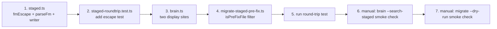

# AAR-0008B: Review Findings Cleanup

## Objective

Three low-risk findings from the AAR-0008 self-review must be fixed before the work is committed. All three are bundled into the **same commit as AAR-0008** — this is a follow-up patch on uncommitted code, not a separate ship.

1. **Migration over-archives on re-runs.** `migrate-staged-pre-fix.ts` archives every `*.md` in `staged/`, including correct post-fix files. Filter by absence of `title:` in frontmatter.
2. **`brain --search-staged` CLI doesn't show title.** Two display sites preview `proposedChange` only. Surface the title that AAR-0008 made available.
3. **Frontmatter escape only handles double-quotes.** `staged.ts` writer is fragile to newlines and backslashes. Harden the escape contract.

## Context

### How we got here

AAR-0008 introduced the `title` field on `StagedProposal` and a one-shot migration tool to archive 77 corrupted pre-fix files. During my own code review of Ryan's implementation I flagged three small but real issues that don't block AAR-0008's correctness on the happy path but degrade behaviour on edge cases. None warrant a separate task on their own; bundled together they are one tight cleanup pass.

The user has not committed AAR-0008 yet. The code is on disk. AAR-0008B layers on top, then both ship in a single commit.

### Why these three together

| Finding | File | Risk if shipped as-is |
|---|---|---|
| 1. Over-archive on re-run | `migrate-staged-pre-fix.ts` | User runs migration once correctly. On a second run after a fresh pipeline, it would silently archive new valid proposals. Data loss path. |
| 2. CLI display ignores title | `brain.ts` | UX regression — the whole point of AAR-0008's title field was to give reviewers a human label, and the CLI search path that reviewers use to triage staged proposals doesn't show it. |
| 3. Quote-only escape | `staged.ts` | Latent. Today's pipeline produces single-line titles and code-generated reasons. A future change to either path could introduce a multi-line value that silently corrupts the frontmatter. |

### Constraints (Postmortem reflexes)

1. **Knight Capital — dormant code is a live grenade.** Finding 1 is the highest-risk: a re-run of a one-shot migration on a now-mixed directory would archive correct files. The fix must be defensive (filter explicitly), not relying on user discipline.
2. **Cloudflare — validate at deploy time.** Finding 3 is latent today. Pin it with a round-trip test for the chosen escape scheme so the contract is enforced by CI, not by hope.
3. **AWS — blast radius.** All three changes are surgical: 1 file, 1 file, 1 file + 1 test. No type changes ripple downstream because `title` is already on `StagedProposal` and `StagedResult`.

## Architecture Decisions

### ADR-1 — Filter migration files by absence of `title:` field

**Context:** The migration tool archives every `*.md` file under `staged/`. Pre-fix files have no `title:` field in frontmatter (the field didn't exist yet). Post-fix files always have one (the AAR-0008 writer always emits it on a single line).

**Options:**

| Option | Pros | Cons |
|---|---|---|
| A. No filter (current) | Simplest. | Re-run after fresh pipeline = data loss. |
| B. Filter by absence of `title:` regex match in frontmatter block | Cheap, no parser dep, matches the established staged.ts/sync.ts pattern of regex frontmatter parsing. | Regex must correctly bound the frontmatter block. |
| C. Filter by file mtime (pre-AAR-0008 timestamp) | No content read. | Brittle — depends on user's local clock and the moment AAR-0008 lands. |
| D. Filter by parsing frontmatter via YAML lib | Most robust. | Adds dependency for a one-shot tool. Rejected. |

**Decision:** Option B. Read each file, extract the frontmatter block via the same `^---\r?\n([\s\S]*?)\r?\n---` regex used in `staged.ts:parseFm()`, and look for a line that matches `^title\s*:` inside that block. If absent, the file is pre-fix. If present, it's post-fix and skipped.

**Consequences:**
- Migration tool reads each candidate file (cheap — at most a few KB each, dozens of files).
- Files with no frontmatter at all (no `---` delimiters) are treated as pre-fix and archived. This catches the worst-corrupted state, where the writer was so broken it didn't even produce valid frontmatter.
- The output of `--dry-run` lists exactly the files that will move on `--apply`. The two are guaranteed to match because the filter is deterministic on file content.

### ADR-2 — Show title in CLI search results, content as secondary snippet

**Context:** Two display sites in `brain.ts` (cross-store recall block at ~661, dedicated `--search-staged` block at ~709) preview proposals as `r.proposedChange.slice(0, 80)`. The `title` field is in `StagedResult` but unused.

**Decision:** Update both sites to use a 3-line layout:

```
[pending] penny/Signature Moves — Daily Log Style
  Content: Brief formatting guidelines for daily notes emphasizing...
  Reason: Judges rejected: gemini
  → memory/penny/staged/20260407-094337-daily-log-style.md
```

- Header line: `[status] agent/section — title` (title becomes the human label)
- Content snippet: capped at 100 chars with ellipsis, prefixed `Content: `
- Reason: capped at 100 chars with ellipsis, prefixed `Reason: `
- Path arrow

For the cross-store recall block (line 661), the existing format is denser (no path arrow on the same level as other stores). The simplest minimal change there is to add `title` to the header line and keep the existing one-line dense format. The dedicated `--search-staged` block (line 709) gets the full 4-line layout because that's where reviewers triage.

**Fallback:** If `r.title` is empty (defensive — shouldn't happen post-fix because the writer always emits it, but legacy archive-pre-fix files re-imported by accident could lack it), fall back to a 80-char content snippet as the header.

### ADR-3 — Frontmatter escape: Option B (JSON.stringify writer + parseFm upgrade)

**Context:** `staged.ts:writeStagedProposal()` escapes only `"` → `'` for `title` and `reason`. This breaks on:
- Embedded `\n` / `\r` (parseFm splits on `\n`, the value bleeds into the next line)
- Backslashes (no current consequence, but YAML treats `\` specially in double-quoted scalars)
- Mixed quote types in a single string

The current pipeline guarantees these inputs are safe (Gemini emits single-line `=== PROPOSAL N: title ===`, `reason` is code-generated). But the schema doesn't enforce it, and AAR-0009's pipeline rework could easily introduce a multi-line reason.

**Options recap (from review):**

| Option | Approach | Verdict |
|---|---|---|
| A. Strict single-line normalization | Strip `\n`/`\r`, collapse whitespace, replace `"` with `'`. Cheapest. | Acceptable but lossy. |
| B. JSON.stringify writer + parseFm upgrade | Use `JSON.stringify(value)` to write. Upgrade `parseFm` to detect leading `"` and parse via `JSON.parse`. Legacy fallback to existing quote-strip. | Robust, durable, handles all edge cases. |
| C. YAML block scalars | `\|`-style multiline. Requires real YAML parser. | Rejected. |

**Decision:** Option B.

**One-sentence justification:** JSON.stringify gives us correct escaping for newlines, quotes, and backslashes for free in 6 lines of code, AAR-0009 may introduce multi-line reasons, and the legacy fallback path means we don't break any pre-AAR-0008B file that might still be on disk.

**Why not A:** Lossy normalization is fine today, but the moment a multi-line value matters we'd be back here writing the same fix. Doing it once now avoids the second visit.

**Why not C:** A YAML dependency for one writer/reader pair is outsized. The whole staged.ts module deliberately uses regex parsing to avoid this.

**Consequences:**
- `parseFm` becomes a tiny bit more complex — one branch for JSON-encoded values, one for legacy.
- All new staged files use JSON-encoded values for `title`, `section`, `reason`. The plain `change_type`, `status`, `agent`, `date`, `created` fields stay unquoted (no escape hazards).
- Legacy files (any that survived AAR-0008's archival pass) still parse correctly via the existing `'` / `"` strip fallback.
- Round-trip test from AAR-0008 still passes. One new round-trip case is added with a multi-line reason.

## File-by-File Spec

### 1. `src/tools/migrate-staged-pre-fix.ts`

**Add a content-aware filter.** The current `for (const f of files)` loop unconditionally archives. Replace with a filter step:

```typescript
import { readFileSync } from "fs";

/**
 * Returns true if the file is a pre-AAR-0008 corrupted staged proposal.
 * Pre-fix files have no `title:` field in frontmatter. Post-fix files always do.
 * Files with no frontmatter at all (no `---` delimiters) are treated as pre-fix
 * (deeply corrupted state).
 */
function isPreFixFile(filePath: string): boolean {
  let content: string;
  try {
    content = readFileSync(filePath, "utf-8");
  } catch {
    // Unreadable file — treat as pre-fix and archive
    return true;
  }
  const fmMatch = content.match(/^---\r?\n([\s\S]*?)\r?\n---/);
  if (!fmMatch) {
    // No frontmatter at all = corrupted = archive
    return true;
  }
  const fmBlock = fmMatch[1];
  // Look for a `title:` field at the start of any line in the frontmatter block
  return !/^title\s*:/m.test(fmBlock);
}
```

**Update the per-agent loop:**

```typescript
const allFiles = readdirSync(stagedDir).filter(f => f.endsWith(".md"));
const files = allFiles.filter(f => isPreFixFile(join(stagedDir, f)));
const skipped = allFiles.length - files.length;

if (files.length === 0 && skipped === 0) continue;

if (apply && files.length > 0) mkdirSync(archiveDir, { recursive: true });

for (const f of files) {
  const src = join(stagedDir, f);
  const dst = join(archiveDir, f);
  if (apply) renameSync(src, dst);
  console.log(`${apply ? "MOVED" : "DRY-RUN"} ${src} -> ${dst}`);
  total++;
}

if (skipped > 0) {
  console.log(`  (skipped ${skipped} post-fix file(s) in ${stagedDir})`);
}
```

**Acceptance for this file:**
1. `isPreFixFile()` returns `true` for: file with no frontmatter; file with frontmatter but no `title:` line.
2. `isPreFixFile()` returns `false` for: file with `title: "..."` line in frontmatter; file with `title: bare-value` line.
3. Running `--dry-run` on a directory containing 77 pre-fix + 5 post-fix files prints 77 `DRY-RUN` lines and a `(skipped 5 post-fix file(s))` summary line.
4. Running `--apply` on the same directory moves exactly 77 files; the 5 post-fix files remain in place.
5. Re-running `--dry-run` after a successful `--apply` reports 0 files (idempotent).
6. Re-running `--dry-run` on a fresh agent dir containing only post-fix files reports 0 files and exits cleanly (zero count, no error).

### 2. `src/tools/brain.ts`

**Two display sites to update.** Find them by looking at the existing slices: search for `r.proposedChange.slice(0, 80)`. Both occurrences are in this file.

**Helper — add at the top of the file or inline at first use site.** A small formatter avoids duplication:

```typescript
function formatStagedSnippet(text: string, max: number): string {
  const oneLine = text.replace(/\r?\n/g, " ").trim();
  if (oneLine.length <= max) return oneLine;
  return oneLine.slice(0, max) + "…";
}
```

(Place at module top with the other helpers, or inline above the first display site — Ryan's call.)

**Site 1 — cross-store recall block (~line 661).** Currently:

```typescript
lines.push(`  [${r.status}] ${r.agent}/${r.section} — ${r.proposedChange.slice(0, 80).replace(/\n/g, " ")}`);
lines.push(`    → ${r.sourcePath}`);
```

Change to:

```typescript
const label = r.title || formatStagedSnippet(r.proposedChange, 80);
lines.push(`  [${r.status}] ${r.agent}/${r.section} — ${label}`);
lines.push(`    → ${r.sourcePath}`);
```

(One-line dense format preserved; only the label source changes. This is the cross-store recall path so density matters more than reviewer triage detail.)

**Site 2 — dedicated `--search-staged` block (~line 709).** Currently:

```typescript
console.log(`[${r.status}] ${r.agent}/${r.section} — ${r.proposedChange.slice(0, 80).replace(/\n/g, " ")}`);
console.log(`  Reason: ${r.reason.slice(0, 100).replace(/\n/g, " ")}`);
console.log(`  → ${r.sourcePath}`);
```

Change to the full 4-line layout:

```typescript
const header = r.title || formatStagedSnippet(r.proposedChange, 80);
console.log(`[${r.status}] ${r.agent}/${r.section} — ${header}`);
if (r.title) {
  console.log(`  Content: ${formatStagedSnippet(r.proposedChange, 100)}`);
}
console.log(`  Reason: ${formatStagedSnippet(r.reason, 100)}`);
console.log(`  → ${r.sourcePath}`);
```

The `Content:` line is conditional — only printed when `r.title` is non-empty (the title became the header, so content is the secondary detail). For empty-title fallback, the header IS the content snippet, so a separate Content line would be redundant.

**Acceptance for this file:**
1. `bun run tool brain --search-staged "<term>"` shows `title` as the header label for every result that has a non-empty title.
2. Content snippet on the secondary `Content:` line is capped at 100 chars with `…` ellipsis.
3. Reason on the `Reason:` line is capped at 100 chars with `…` ellipsis.
4. Newlines in any field are collapsed to spaces — no multi-line bleed.
5. If a result has empty `title` (legacy/defensive case), the header is a 80-char content snippet and no separate `Content:` line is printed.
6. The cross-store recall block (`--recall-all` path) shows title in the dense one-line format. (Note: `--search-all` does NOT include staged proposals — that path is unchanged.)
7. All other CLI output paths in `brain.ts` are untouched — grep for `proposedChange` after the change should yield only the two display sites (now updated) and any non-display references.

### 3. `src/libs/staged.ts`

**Three changes: a new escape helper, the writer, and `parseFm`.**

**a. Add a JSON-escape writer helper near `toSlug()`:**

```typescript
/**
 * Encode a frontmatter value as a JSON string literal.
 * Handles newlines, quotes, backslashes, and unicode automatically.
 * The reader (parseFm) detects leading `"` and parses via JSON.parse.
 */
function fmEscape(value: string): string {
  return JSON.stringify(value);
}
```

**b. Update `writeStagedProposal()` frontmatter rendering.** Replace the existing `safeTitle` line and the inline `proposal.reason.replace(...)` with `fmEscape()`:

```typescript
const content = `---
type: staged_proposal
agent: ${proposal.agent}
date: ${proposal.date}
title: ${fmEscape(proposal.title)}
section: ${fmEscape(proposal.section)}
change_type: ${proposal.changeType}
status: ${proposal.status}
reason: ${fmEscape(proposal.reason)}
created: ${createdAt}
---

# ${proposal.title}

## Proposed Change

${proposal.proposedChange}

## Evidence

${proposal.evidence}

## Gate Results

${formatGateResults(proposal.gateResults)}

## Judge Results

${formatJudgeResults(proposal.judgeResults)}

## Reason for Staging

${proposal.reason}

## Decision

Status: ${proposal.status}
`;
```

Note: `fmEscape()` already produces a quoted string (e.g. `"My Title"`), so the inline `"` wrapping is removed. Compare:

- Before: `title: "${safeTitle}"`
- After: `title: ${fmEscape(proposal.title)}`

The plain fields (`type`, `agent`, `date`, `change_type`, `status`, `created`) remain unquoted because they are guaranteed safe (enum-like or ISO timestamps).

**c. Upgrade `parseFm()` to handle JSON-encoded values + legacy fallback.** The current implementation:

```typescript
if ((val.startsWith('"') && val.endsWith('"')) || (val.startsWith("'") && val.endsWith("'"))) {
  val = val.slice(1, -1);
}
```

Replace with:

```typescript
// JSON-encoded value (AAR-0008B writer): leading `"`, parses cleanly via JSON.parse.
// Falls back to legacy quote-strip for files written before AAR-0008B.
if (val.startsWith('"')) {
  try {
    val = JSON.parse(val);
  } catch {
    // Malformed JSON — fall back to legacy strip (best effort).
    if (val.endsWith('"')) val = val.slice(1, -1);
  }
} else if (val.startsWith("'") && val.endsWith("'")) {
  val = val.slice(1, -1);
}
```

**Important constraint:** `parseFm` reads the frontmatter block by splitting on `\n`. JSON.stringify can produce values containing `\n` literally encoded as `\\n` (two characters: backslash + n) — that does NOT introduce a real newline in the source line. The source line stays single-line, and `JSON.parse` decodes the `\n` escape into a real newline at parse time. This is exactly the property we want and is why Option B works without modifying the line-splitting logic.

**Sanity check:** A title with a real newline `"Line 1\nLine 2"` becomes the source-file line `title: "Line 1\nLine 2"` (literal backslash-n in the file). `parseFm` reads that single line, extracts the value `"Line 1\nLine 2"`, and `JSON.parse` returns `Line 1\nLine 2` with a real newline. Round-trip preserved.

**Function signatures (no changes):**

```typescript
export function writeStagedProposal(proposal: StagedProposal): string
export function listStagedProposals(agent?: string): StagedFile[]
function parseFm(content: string): Record<string, string>
function fmEscape(value: string): string  // NEW
```

**Acceptance for this file:**
1. `fmEscape("simple")` returns `"simple"` (with the quotes — JSON literal).
2. `fmEscape('with "quotes"')` returns `"with \"quotes\""`.
3. `fmEscape("with\nnewline")` returns `"with\\nnewline"` (the `\n` is the two-char escape, not a real newline).
4. `parseFm` correctly decodes a frontmatter line `title: "with \"quotes\""` → `with "quotes"`.
5. `parseFm` correctly decodes a frontmatter line `title: "line1\nline2"` → `line1\nline2` with a real newline.
6. `parseFm` legacy path: a frontmatter line `title: 'old style'` → `old style`.
7. `parseFm` malformed-JSON fallback: `title: "broken value` → `broken value` (best-effort, no exception).
8. A `StagedProposal` with a multi-line `reason` round-trips through `writeStagedProposal` → `listStagedProposals` with the reason intact.

### 4. `src/libs/__tests__/staged-roundtrip.test.ts`

**Add one new test case for the escape scheme.** The existing test is preserved unchanged (it's the regression pin from AAR-0008). The new case exercises the multi-line and quote-bearing path:

```typescript
test("staged proposal round-trip preserves multi-line reason and quoted title", () => {
  const TEST_AGENT = "__roundtrip_escape_test__";
  const stagedDir = fromRoot("vault", "studio", "memory", TEST_AGENT, "staged");
  mkdirSync(stagedDir, { recursive: true });

  try {
    const input: StagedProposal = {
      agent: TEST_AGENT,
      date: "2026-04-07",
      title: 'Title with "quotes" and a colon: tricky',
      proposedChange: "Body content is unaffected by the escape scheme — it lives outside frontmatter.",
      section: 'Section with "quotes"',
      changeType: "modify",
      evidence: "n/a",
      gateResults: { passed: false, results: [], failedGates: [] },
      judgeResults: null,
      reason: "Multi-line reason:\nLine two of the reason\nLine three with a \"quoted\" word",
      status: "pending",
    };

    writeStagedProposal(input);
    const found = listStagedProposals(TEST_AGENT);

    expect(found.length).toBe(1);
    const out = found[0].proposal;
    expect(out.title).toBe(input.title);
    expect(out.section).toBe(input.section);
    expect(out.reason).toBe(input.reason);
    expect(out.proposedChange).toBe(input.proposedChange);
  } finally {
    if (existsSync(stagedDir)) {
      rmSync(join(stagedDir, ".."), { recursive: true, force: true });
    }
  }
});
```

**Note on the existing test:** It uses `__roundtrip_test__` as the agent. Use a different name (`__roundtrip_escape_test__`) so the two tests don't collide if Bun runs them concurrently.

**Acceptance for this file:**
1. Existing AAR-0008 round-trip test still passes unchanged.
2. New escape round-trip test passes: title with quotes survives, multi-line reason survives, section with quotes survives.
3. Both tests clean up their synthetic agent dirs in `finally` blocks.
4. If `bun test` segfaults on Windows (per `feedback_bun_test_broken`), Ryan falls back to a runtime smoke script alongside the AAR-0008 fallback.

## Sequencing within the task



Order matters: the escape upgrade in `staged.ts` must land before the new test or the test fails on the very behaviour it's pinning. The migration filter goes last because it has no dependency on the others.

**No production data should be touched by Ryan during this task.** The user runs the actual migration once, manually, after AAR-0008 + AAR-0008B are committed.

## Sequencing across tasks (commit boundary)

This is the critical sequencing note for Ryan:

**AAR-0008B is bundled into the AAR-0008 commit.**

- AAR-0008 implementation is on disk, uncommitted.
- Ryan applies AAR-0008B changes on top of the same working tree.
- Ryan does **not** create a separate commit for AAR-0008B.
- When the user is ready to commit, both task IDs are referenced in the single commit message (e.g. `AAR-0008 + AAR-0008B: staged content bug fix + review findings`).

This is a deliberate departure from the usual one-task-one-commit pattern because AAR-0008B is a same-day patch on uncommitted code. Treating it as a separate commit would split the regression fix across two commits with the second commit fixing review findings on the first — strictly worse history.

## Acceptance Criteria

1. **`migrate-staged-pre-fix --dry-run` filters by `title:` absence.** A mixed dir (some pre-fix, some post-fix) reports only the pre-fix files.
2. **Migration is safe to re-run.** Second invocation reports 0 files when there's nothing left to archive.
3. **Migration handles malformed frontmatter as pre-fix.** Files with no `---` delimiters are archived.
4. **`brain --search-staged` shows title in every result header.** Verified by running against any seeded staged file with a title.
5. **`brain --search-staged` content snippet is capped at 100 chars with ellipsis.** Verified by inspecting output against a long-content file.
6. **Empty-title fallback works.** A staged file with no `title:` (synthetic test) shows the content snippet as the header and omits the secondary `Content:` line.
7. **Cross-store recall (`--recall-all`) shows title in the staged section.** Verified by output inspection. (`--search-all` does not include staged.)
8. **`fmEscape()` uses JSON.stringify.** Source inspection.
9. **`parseFm()` detects leading `"` and parses via `JSON.parse`.** Source inspection.
10. **`parseFm()` legacy fallback (single quotes, malformed JSON) still works.** Verified by the round-trip test on a synthetic legacy file (optional: include in test if Ryan judges it valuable; not required).
11. **AAR-0008 round-trip test still passes.**
12. **New escape round-trip test passes:** quoted title, multi-line reason, quoted section all survive write → read.
13. **No new dependencies.** No YAML parser, no escape lib. JSON is built-in.
14. **No production data touched by Ryan.** Migration is manually invoked by the user.
15. **Bundled into the AAR-0008 commit.** Ryan does not create a separate commit.

## Constraints

- **Sequential to AAR-0008.** Ryan executes after AAR-0008's code is on disk. Both bundle into one commit.
- **No new dependencies.** Use built-in `JSON` for escaping, regex for filtering.
- **Don't introduce a YAML parser.** The whole staged module deliberately avoids YAML deps.
- **Don't break legacy parse path.** Files written by AAR-0005 / AAR-0008 (pre-AAR-0008B) use single-quote-stripped values; the upgraded `parseFm` must still read them.
- **Don't change `StagedProposal` or `StagedResult` types.** AAR-0008 already added `title`. AAR-0008B is presentation + persistence robustness only.
- **Don't change brain.db schema.** No migration needed — title column already exists from AAR-0008.
- **Round-trip test cleanup must be defensive.** Use a unique synthetic agent name (`__roundtrip_escape_test__`), `rmSync` with `{ recursive: true, force: true }` in `finally`.
- **Migration filter must be content-aware, not mtime-aware.** Don't use file timestamps — they are unreliable across machines and after git operations.

## Out of Scope

- Renaming `proposedChange` to `content`. Cosmetic debt, deferred indefinitely.
- Adding a YAML parser. Rejected by ADR-3.
- Vector embeddings on staged proposals. AAR-0009 territory if at all.
- Backfilling title or content into the 77 archived pre-fix files. Impossible.
- A proper human review UI for staged proposals. Out of phase.
- Refactoring the two display sites in `brain.ts` into a shared formatter beyond the small `formatStagedSnippet` helper. Premature abstraction; only two call sites.
- Touching `syncStaged()` in `src/libs/brain/sync.ts`. The orphan-removal pass already handles archived files correctly because the `staged/` scan is non-recursive and skips subdirectories.

## Failure Modes

| Failure | Detection | Mitigation |
|---|---|---|
| `JSON.parse` throws on a frontmatter line that looks JSON-encoded but isn't | Test failure or runtime error in `parseFm` | Try/catch wrapper falls back to legacy strip — no exception bubbles up. |
| Filter regex `^title\s*:` matches a title-bearing line in a body block (false positive) | Migration skips a file that should be archived | The regex runs only on the frontmatter block extracted by `^---\r?\n([\s\S]*?)\r?\n---`, not the whole file. Body content cannot match. |
| Pre-fix file has frontmatter with unrelated `title:` for some reason | Migration skips it | Pre-fix files were written by the AAR-0007 pipeline which never emitted `title:`. The chance is zero unless the user hand-edited a file. Acceptable risk. |
| New round-trip test fails on Windows due to Bun test segfault | `bun test` non-zero exit | Same fallback as AAR-0008: copy test body into a runtime smoke script with `process.exit(1)` on assertion failure. |
| Empty-title legacy file in `--search-staged` output looks weird | Visual inspection | The fallback header is the 80-char content snippet, which is what the pre-AAR-0008 CLI printed anyway. No regression. |
| User runs migration on a dir with ONLY post-fix files | Dry-run prints nothing useful | Tool exits cleanly with `Would migrate 0 files.` and a summary skip count if any files were filtered. |

## Notes for Ryan

- The migration tool is already registered with the tool runner (`bun run tool migrate-staged-pre-fix`). No registry changes needed.
- The two `brain.ts` display sites are around lines 661 and 709 in the post-AAR-0008 file. Find them by grepping for `r.proposedChange.slice(0, 80)` — both occurrences are display sites.
- `StagedResult` already has `title: string` (added in AAR-0008). No type change needed in `queries.ts`.
- The `formatStagedSnippet` helper is small enough to inline at the first use site or hoist to module top — Ryan's call.
- If the round-trip test reveals any issue with `parseFm`'s JSON decoding, the most common mistake is forgetting that JSON.stringify returns a string with surrounding quotes — make sure the writer template doesn't add another set of quotes.
