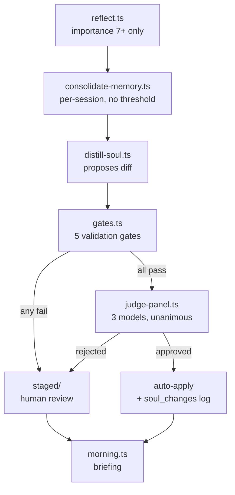
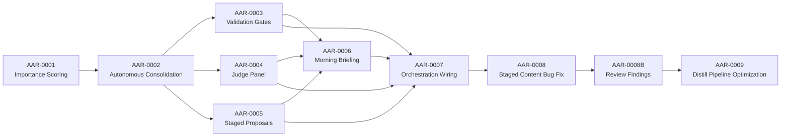

# AAR Phase 1: Self-Learning Autonomy

## Architecture Overview

Evolve the reflect-consolidate-distill pipeline to autonomous operation. Routine soul file refinements auto-apply through 5 validation gates and a 3-model judge panel. Unusual changes stage for human review. Morning briefing reports both.

## Execution Order

| Wave | Tasks | Constraint |
|------|-------|-----------|
| 1 (sequential) | AAR-0001, AAR-0002 | Both touch `src/libs/reflect.ts` — must be sequential |
| 2 (parallel) | AAR-0003, AAR-0004, AAR-0005 | Independent files — can run in parallel worktrees |
| 3 | AAR-0006 | Depends on soul_changes table + staged files existing |
| 4 | AAR-0007 | Depends on ALL prior tasks — wires them into end-to-end pipeline |
| 5 (sequential) | AAR-0008, AAR-0008B, AAR-0009 | All touch the staging path — sequential, no parallelism. AAR-0008B is a same-day cleanup of self-review findings, bundled into the AAR-0008 commit. AAR-0009 builds on the AAR-0008 type changes. |

## Task Table

| ID | Title | Priority | Status | Files | Depends On |
|----|-------|----------|--------|-------|------------|
| AAR-0001 | Importance Scoring in reflect.ts | P1 | complete | `src/libs/reflect.ts`, `src/tools/reflect.ts` | none |
| AAR-0002 | Autonomous Consolidation | P1 | complete | `src/libs/reflect.ts`, `src/tools/consolidate-memory.ts` | AAR-0001 |
| AAR-0003 | Validation Gates | P2 | complete | `src/libs/gates.ts` (new), `src/libs/brain/schema.ts`, `src/libs/brain/index.ts`, `src/libs/brain/fts.ts` | AAR-0002 |
| AAR-0004 | LLM Judge Panel | P2 | complete | `src/libs/judge-panel.ts` (new) | AAR-0002 |
| AAR-0005 | Staged Proposals Storage + brain.db Integration | P2 | complete | `src/libs/brain/schema.ts`, `src/libs/brain/index.ts`, `src/libs/brain/fts.ts`, `src/libs/brain/sync.ts`, `src/libs/brain/queries.ts`, `src/tools/brain.ts` | AAR-0002 |
| AAR-0006 | Morning Briefing Integration | P3 | complete | `src/tools/morning.ts` | AAR-0003, AAR-0004, AAR-0005 |
| AAR-0007 | Orchestration Wiring | P1 | complete | `src/libs/autonomous-distill.ts` (new), `src/tools/autonomous-distill.ts` (new), `.claude/skills/bye/SKILL.md` | AAR-0001 through AAR-0006 |
| AAR-0008 | Staged Content Bug Fix + Title Field | P1 | pending | `src/libs/autonomous-distill.ts`, `src/libs/staged.ts`, `src/libs/brain/sync.ts`, `src/libs/brain/schema.ts`, `src/libs/brain/index.ts`, `src/libs/brain/fts.ts`, `src/libs/brain/queries.ts`, `src/tools/morning.ts`, `src/libs/__tests__/staged-roundtrip.test.ts` (new), `src/tools/migrate-staged-pre-fix.ts` (new) | AAR-0007 |
| AAR-0008B | Review Findings: Migration Filter, CLI Title Display, Frontmatter Escape | P1 | pending | `src/tools/migrate-staged-pre-fix.ts`, `src/tools/brain.ts`, `src/libs/staged.ts`, `src/libs/__tests__/staged-roundtrip.test.ts` | AAR-0008 |
| AAR-0009 | Distill Pipeline Optimization Phase 1 | P2 | pending | `src/libs/distill-cache.ts` (new), `src/libs/autonomous-distill.ts`, `src/libs/gates.ts`, `src/tools/distill-soul.ts`, `src/libs/__benchmarks__/autonomous-distill.bench.ts` (new) | AAR-0008B |

## Phase 1.5 Notes (post-ship cleanup)

AAR-0001 through AAR-0007 shipped 2026-04-05. AAR-0008, AAR-0008B, and AAR-0009 are post-ship corrections discovered during Phase 1 operation:

- **AAR-0008** fixes a content-persistence bug in `_stageProposal()` that wiped 77 staged proposals down to title-only. Adds a `title` field to `StagedProposal` so reviewers can see both title and content. Pins the regression with a round-trip test.
- **AAR-0008B** is a same-day cleanup of three findings from McCall's self-review of AAR-0008: migration tool now filters by absence of `title:` in frontmatter (no over-archive on re-run), `brain --search-staged` CLI surfaces title in result headers, and `staged.ts` frontmatter escape uses `JSON.stringify` to handle newlines, quotes, and backslashes robustly. **Bundled into the AAR-0008 commit** — not a separate ship.
- **AAR-0009** brings the pipeline runtime from ~520s to <30s on cache-hit reruns through a distill cache, two-phase gate ordering, per-run rule embedding cache, and batched contradiction checks.

All three must run sequentially. AAR-0008B layers on top of AAR-0008 (same working tree, same commit). AAR-0009 depends on the corrected `StagedProposal` type and the hardened persistence path. No worktree parallelism — all three touch the staging path.
