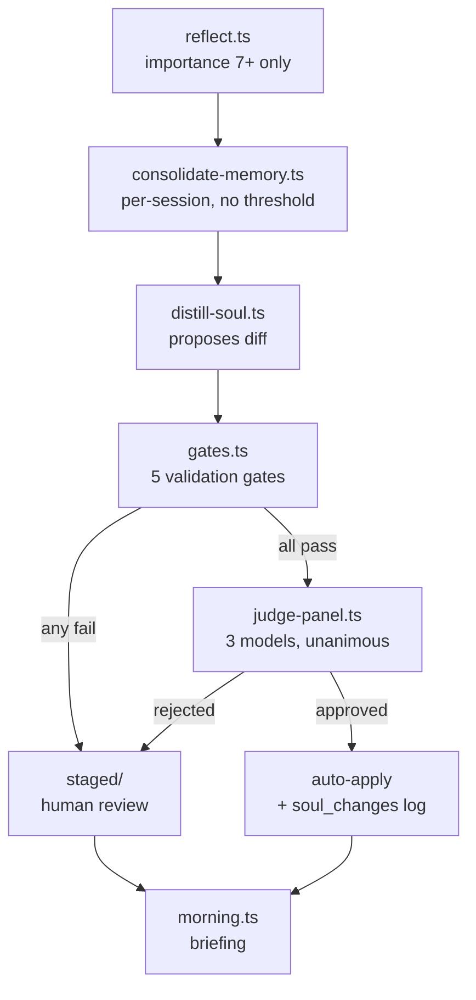
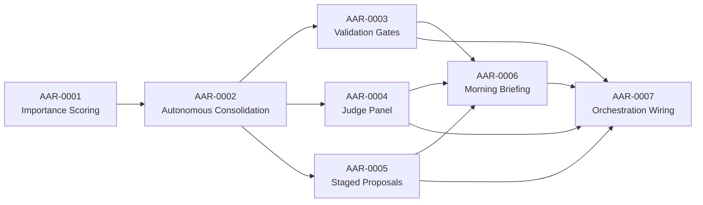

# AAR Phase 1: Self-Learning Autonomy

## Architecture Overview

Evolve the reflect-consolidate-distill pipeline to autonomous operation. Routine soul file refinements auto-apply through 5 validation gates and a 3-model judge panel. Unusual changes stage for human review. Morning briefing reports both.

## Execution Order

| Wave | Tasks | Constraint |
|------|-------|-----------|
| 1 (sequential) | AAR-0001, AAR-0002 | Both touch `src/libs/reflect.ts` — must be sequential |
| 2 (parallel) | AAR-0003, AAR-0004, AAR-0005 | Independent files — can run in parallel worktrees |
| 3 | AAR-0006 | Depends on soul_changes table + staged files existing |
| 4 | AAR-0007 | Depends on ALL prior tasks — wires them into end-to-end pipeline |

## Task Table

| ID | Title | Priority | Status | Files | Depends On |
|----|-------|----------|--------|-------|------------|
| AAR-0001 | Importance Scoring in reflect.ts | P1 | pending | `src/libs/reflect.ts`, `src/tools/reflect.ts` | none |
| AAR-0002 | Autonomous Consolidation | P1 | pending | `src/libs/reflect.ts`, `src/tools/consolidate-memory.ts` | AAR-0001 |
| AAR-0003 | Validation Gates | P2 | pending | `src/libs/gates.ts` (new), `src/libs/brain/schema.ts`, `src/libs/brain/index.ts`, `src/libs/brain/fts.ts` | AAR-0002 |
| AAR-0004 | LLM Judge Panel | P2 | pending | `src/libs/judge-panel.ts` (new) | AAR-0002 |
| AAR-0005 | Staged Proposals Storage + brain.db Integration | P2 | pending | `src/libs/brain/schema.ts`, `src/libs/brain/index.ts`, `src/libs/brain/fts.ts`, `src/libs/brain/sync.ts`, `src/libs/brain/queries.ts`, `src/tools/brain.ts` | AAR-0002 |
| AAR-0006 | Morning Briefing Integration | P3 | pending | `src/tools/morning.ts` | AAR-0003, AAR-0004, AAR-0005 |
| AAR-0007 | Orchestration Wiring | P1 | pending | `src/libs/autonomous-distill.ts` (new), `src/tools/autonomous-distill.ts` (new), `.claude/skills/bye/SKILL.md` | AAR-0001 through AAR-0006 |
