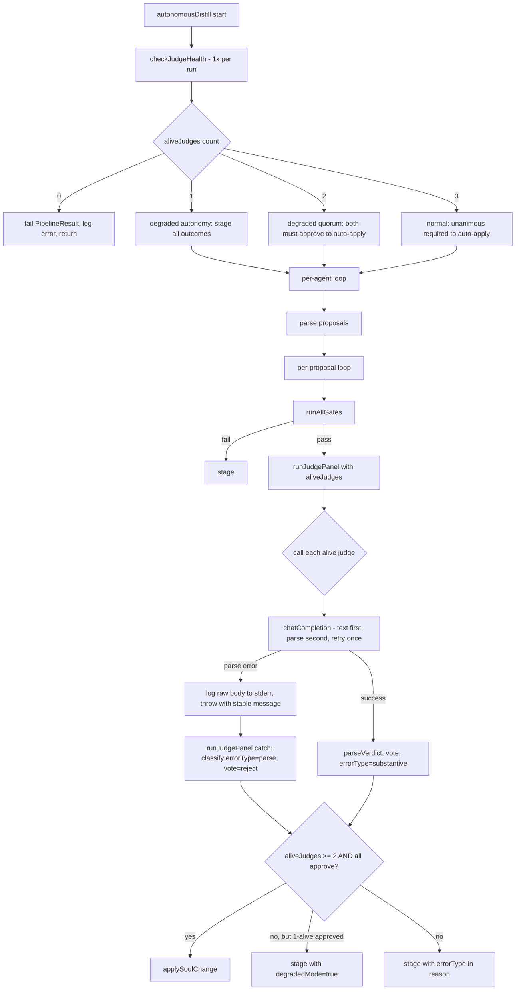

# ASL-0001 — MiniMax Judge Parser Fix + Judge Health Check

## TL;DR

MiniMax judge calls intermittently throw `Failed to parse JSON` from inside `chatCompletion`. The error propagates through `runJudgePanel`'s `Promise.allSettled` catch path and is recorded as a `reject` vote, blocking unanimous approval even when Gemini and Grok approved substantively. We can't reproduce the failure on demand, so the fix is layered:

1. Make `chatCompletion` defensively read body as text, log the raw bytes when parse fails, and retry once on transient errors (forensic evidence + transient recovery).
2. Add a `checkJudgeHealth()` pre-flight that runs once per pipeline invocation and tells `runJudgePanel` which judges are alive.
3. Adjust quorum math to require unanimous approval **among alive judges** — and **downgrade autonomy** in 1-judge-alive mode (single judge cannot trigger auto-apply, all outcomes are staged).
4. Tag verdicts with `errorType` so staged files distinguish parse errors from substantive rejections.

The pipeline keeps working when 1-2 judges are dead, infrastructure failures stop masquerading as substantive dissent, and when the bug fires next we have raw body bytes in stderr to debug from.

## Architecture Diagram



## ADR — Degradation Policy (1-alive mode)

**Decision:** When only 1 judge survives the health check, that judge's vote is captured for transparency, but the pipeline **never auto-applies** in 1-alive mode. Even an APPROVE vote results in the proposal being staged for human review. `JudgePanelResult.degradedMode = true` signals this case to callers.

**Alternatives considered:**

| Option | Rationale | Why rejected |
|---|---|---|
| 1-of-1 approval auto-applies (permissive) | Symmetry with 2-of-2 and 3-of-3 quorum | Single-judge signal is too noisy to trust for autonomous mutation of a soul file. A judge having a bad day, a prompt-injection in the evidence, or a model regression all become single-point failures. |
| 1-alive mode is fatal (skip the run) | Conservative — no risk of bad data reaching the pipeline | Throws away the distillation work and the gate signals. The proposal is still useful evidence for a human reviewer; staging captures it without applying it. |
| **1-alive captures vote, always stages (chosen)** | Preserves the work, surfaces the proposal for human review, marks the degraded provenance explicitly | Single-point-of-failure protection for soul files without throwing away pipeline work. |

**Quorum table (final rules):**

| Alive judges | Quorum rule | Auto-apply possible? | `degradedMode` flag |
|---|---|---|---|
| 3 | Unanimous (3-of-3) | Yes | `false` |
| 2 | Unanimous (2-of-2) | Yes | `false` |
| 1 | Single judge captured for transparency, vote recorded | **No — always staged** | `true` |
| 0 | `runJudgePanel` throws; `autonomousDistill` returns `errors: 1` | No | n/a |

**Consequence:** A 1-alive APPROVE vote becomes a "high-confidence stage" — the proposal survives gates AND got an approval, but the autonomy floor (≥2 independent judges) prevents auto-apply. The morning briefing shows it as a normal staged proposal with a degraded-mode tag in the reason line for triage.

**Why not flag this as a hard failure:** Distillation, gate runs, and the captured vote are all costly and useful. Throwing them away because of degraded health would punish the pipeline for infrastructure problems it can't control. Staging is the right shock absorber.

## Investigation Findings (from prior session — DO NOT REDO)

| Finding | Source | Implication |
|---------|--------|-------------|
| Bun's `response.json()` throws `Failed to parse JSON` on bad bodies | Bun docs + reproduction | Error message we observe in staged files matches |
| `chatCompletion` has NO timeout | `src/libs/minimax.ts:206-218` (current code) | Hangs indefinitely on stalled connections; music/image/video calls all have timeouts |
| MiniMax M2.5 reasoning tokens consume 300-500 on real judge prompts | Empirical | The comment at `judge-panel.ts:120-122` says "100-150" — wrong by 3-4×. Budget pressure is real, but `JUDGE_MAX_TOKENS=1024` is sufficient headroom |
| No raw body logging on parse failure | `chatCompletion` source | Zero forensic evidence when bug fires |
| No retry on transient failure | `chatCompletion` source | Single network blip = guaranteed pipeline degradation |
| `response.ok` is true for rate-limit responses (HTTP 200 + `base_resp.status_code != 0`) | MiniMax API contract | Existing post-parse `base_resp` check stays in place |

The fix is well-scoped to 3 source files + 2 test files. **Do not** attempt to find the root cause of the parser failure as part of this task — that's what the raw-body logging is FOR. The next time the bug fires, we'll have evidence.

## Files in Scope

| Path | Action | Purpose |
|------|--------|---------|
| `src/libs/minimax.ts` | MODIFY | `chatCompletion` defensive parsing + 60s timeout + retry-once + export `MINIMAX_PARSE_ERROR_MSG` constant |
| `src/libs/judge-panel.ts` | MODIFY | `checkJudgeHealth()`, `aliveJudges` support, `errorType` classification, `degradedMode` flag, import `MINIMAX_PARSE_ERROR_MSG` |
| `src/libs/autonomous-distill.ts` | MODIFY | Call `checkJudgeHealth()` once at startup, thread `aliveJudges` through, propagate `degradedMode` into stage reason |
| `src/libs/__tests__/minimax-chat.test.ts` | CREATE | Unit test: mock fetch with bad JSON body, assert defensive throw |
| `src/libs/__tests__/judge-panel.test.ts` | CREATE | Unit test: `parseVerdict` errorType classification + degradedMode behavior |
| `out/minimax-debug.ts` | LEAVE AS-IS | Already a forensic diagnostic — keep working as a manual smoke tool |

**Out of scope (do not touch):**
- `src/libs/gemini.ts`, `src/libs/grok.ts` — only the MiniMax client is broken
- Judge prompt content (`buildJudgePrompt`) — only transport layer changes
- `src/libs/staged.ts` schema — frontmatter doesn't change. The `errorType` and `degradedMode` flow through via the rendered Reason text via the existing `formatJudgeResults` table and `_stageProposal` reason string
- `src/libs/gates.ts`, `src/libs/distill-soul.ts`, `src/libs/distill-cache.ts`
- `src/tools/morning.ts` — already shows pending staged proposals; degraded-mode stages are normal staged proposals and require no special hiding/filtering
- The daemon, task queue, agent_lifecycle tables (those are ASL-0002+)

## Detailed Spec

### Part 1 — `src/libs/minimax.ts` `chatCompletion` defensive parsing

**Update `ChatConfig`** to add an optional retry flag:

```ts
export interface ChatConfig {
  model?: "MiniMax-M2.7" | "MiniMax-M2.5";
  messages: Array<{ role: "system" | "user" | "assistant"; content: string }>;
  temperature?: number;
  maxTokens?: number;
  caller?: string;
  /** Retry once on parse error or timeout. Default: true. */
  retryOnParseError?: boolean;
  /** Override timeout in ms. Default: 60_000. */
  timeoutMs?: number;
}
```

**Stable error messages — exported constants** (downstream pattern-matches on these strings — do not change without updating callers):

```ts
/** Exact error message thrown when chatCompletion fails to parse a JSON response.
 * Exported so downstream code (judge-panel.ts) can pattern-match on it without
 * duplicating the string literal. A future edit to this constant automatically
 * propagates to every importer. */
export const MINIMAX_PARSE_ERROR_MSG = "MiniMax response parse error — see stderr for raw body";

/** Exact error message thrown when chatCompletion times out. Same export rationale
 * as MINIMAX_PARSE_ERROR_MSG. */
export const MINIMAX_TIMEOUT_ERROR_MSG = "MiniMax request timeout — see stderr for context";
```

**Both constants are EXPORTED.** `judge-panel.ts` imports them and pattern-matches against `err.message` for classification — the string literal is never duplicated.

**New private helper `_chatCompletionOnce(config)`** that does a single attempt:

1. Build `body` and headers as today
2. Call `fetch(url, { ..., signal: AbortSignal.timeout(config.timeoutMs ?? 60_000) })`
3. If the fetch throws and the cause is an AbortError:
   - Log to stderr: `[minimax-chat] TIMEOUT after ${timeoutMs}ms — caller=${caller} model=${model}`
   - Throw `new Error(MINIMAX_TIMEOUT_ERROR_MSG)` (with original cause attached via `{ cause: err }` if useful)
4. If `!response.ok`:
   - Throw `new Error(\`MiniMax API error: HTTP ${response.status} ${response.statusText}\`)` (current behavior, keep)
5. **Read body as text first**:
   ```ts
   const rawText = await response.text();
   ```
6. **Parse defensively**:
   ```ts
   let json: any;
   try {
     json = JSON.parse(rawText);
   } catch (parseErr: any) {
     const contentType = response.headers.get("content-type") ?? "(none)";
     const bodyPreview = rawText.slice(0, 2048);
     process.stderr.write(
       `[minimax-chat] PARSE ERROR — caller=${config.caller ?? "unknown"} model=${model} ` +
       `status=${response.status} content-type=${contentType} body-length=${rawText.length}\n` +
       `[minimax-chat] raw body (first 2KB):\n${bodyPreview}\n` +
       `[minimax-chat] end raw body\n`
     );
     throw new Error(MINIMAX_PARSE_ERROR_MSG);
   }
   ```
7. The rest of the function continues unchanged: check `base_resp.status_code`, extract text, track usage, return.

**Public `chatCompletion(config)`** wraps `_chatCompletionOnce` with retry-once-on-transient logic:

```ts
export async function chatCompletion(config: ChatConfig): Promise<ChatResult> {
  const retryEnabled = config.retryOnParseError ?? true;
  try {
    return await _chatCompletionOnce(config);
  } catch (err: any) {
    const msg = err?.message ?? "";
    const isTransient =
      msg === MINIMAX_PARSE_ERROR_MSG || msg === MINIMAX_TIMEOUT_ERROR_MSG;
    if (!retryEnabled || !isTransient) throw err;

    process.stderr.write(
      `[minimax-chat] retrying once after transient failure: ${msg}\n`
    );
    await new Promise(r => setTimeout(r, 2000));
    return await _chatCompletionOnce(config);
  }
}
```

**Hard rules:**
- Do NOT change the existing `base_resp.status_code` post-parse error handling — that path is for valid JSON with MiniMax-level errors
- Do NOT change how `text` is extracted from `json.choices[0].message.content`
- Do NOT change usage tracking (`trackUsage`)
- Do NOT swallow errors — always rethrow if retry exhausted
- The retry happens at the `chatCompletion` boundary, not inside `_chatCompletionOnce` (single responsibility)
- `MINIMAX_PARSE_ERROR_MSG` and `MINIMAX_TIMEOUT_ERROR_MSG` are the **only** sources of these strings — never inline-duplicate them anywhere in `minimax.ts` or `judge-panel.ts`

### Part 2 — `src/libs/judge-panel.ts` `checkJudgeHealth()`

**Import the named constants** at the top of `judge-panel.ts`:

```ts
import {
  chatCompletion as minimaxChat,
  MINIMAX_PARSE_ERROR_MSG,
  MINIMAX_TIMEOUT_ERROR_MSG,
} from "./minimax.js";
```

**New exported types:**

```ts
export type JudgeErrorType = "timeout" | "parse" | "api" | "substantive";

export interface JudgeHealthResult {
  alive: string[];                  // subset of ["gemini", "minimax", "grok"]
  dead: Array<{
    model: string;
    reason: string;
    errorType: Exclude<JudgeErrorType, "substantive">;
  }>;
  checkedAt: string;                // ISO timestamp for logging
}
```

**New constant:**

```ts
const HEALTH_CHECK_PROMPT = "Reply with exactly the word PING and nothing else.";
const HEALTH_CHECK_TIMEOUT_MS = 10_000;
```

**New exported function:**

```ts
export async function checkJudgeHealth(): Promise<JudgeHealthResult>
```

Behavior:

1. Run all 3 judge pings in parallel via `Promise.allSettled`
2. Each ping uses the SAME judge call functions but with the trivial prompt and a 10s timeout. Add an internal helper `_pingJudge(model: "gemini" | "minimax" | "grok"): Promise<{ ok: true } | { ok: false; reason: string; errorType: ... }>`
3. For MiniMax: pass `timeoutMs: HEALTH_CHECK_TIMEOUT_MS` and `retryOnParseError: false` (we want fast-fail in health checks — retries belong in real calls)
4. For Gemini: use existing `geminiGenerate` with `maxOutputTokens: 32`, no native timeout knob, but wrap in `Promise.race` with a 10s timer that resolves to a timeout result
5. For Grok: use existing `grokChat` similarly — confirm whether `grok.ts` accepts a `timeoutMs` option and if not wrap with `Promise.race`
6. Pass criteria — judge is **alive** if and only if:
   - The call resolves without throwing AND
   - The returned `text.toUpperCase().includes("PING")`
7. Failure classification (use the imported constants for MiniMax matches):
   - Caught error message `=== MINIMAX_PARSE_ERROR_MSG` → `errorType: "parse"`
   - Caught error message `=== MINIMAX_TIMEOUT_ERROR_MSG` OR contains `"timeout"` (or AbortError for non-MiniMax judges) → `errorType: "timeout"`
   - Anything else (HTTP error, base_resp error, no PING in response) → `errorType: "api"` with `reason` containing the actual error message or `"response did not contain PING"`
8. Returns the `JudgeHealthResult`. **Never throws** — caller decides how to react.
9. Log to stderr at the end: `[judge-panel] health check: alive=[gemini,grok] dead=[minimax (parse error)]`

### Part 3 — `runJudgePanel` `aliveJudges` support + `errorType` classification + `degradedMode`

**Update `JudgeVerdict`** to include `errorType`:

```ts
export interface JudgeVerdict {
  model: string;
  vote: JudgeVote;
  reason: string;
  latencyMs: number;
  errorType?: JudgeErrorType;       // default "substantive" for real APPROVE/REJECT votes
}
```

**Update `JudgePanelResult`** to add the degraded-mode flag:

```ts
export interface JudgePanelResult {
  approved: boolean;          // true ONLY when alive >= 2 AND all alive voted approve
  votes: JudgeVerdict[];
  unanimous: boolean;         // semantic: every alive judge voted approve (regardless of count)
  dissents: string[];         // model names that voted reject (transport or substantive)
  /** True when fewer than 2 judges were alive — even an "approval" cannot trigger
   * auto-apply. Callers MUST stage when this is true, regardless of `approved`. */
  degradedMode?: boolean;
}
```

**Semantic note on `approved` vs `unanimous`:**
- `unanimous = true` means "every alive judge voted approve" (could be 1-of-1)
- `approved = true` means "auto-apply is allowed" — requires `unanimous && aliveJudges.length >= 2`
- When `aliveJudges.length === 1` and the judge approves: `unanimous = true`, `approved = false`, `degradedMode = true`
- The caller (`autonomous-distill.ts`) reads `approved` to decide auto-apply vs stage. It does NOT need to re-check `degradedMode` for routing — that flag is for transparency in the staged record only.

**Update `JudgePanelInput`** to add optional alive list:

```ts
export interface JudgePanelInput {
  agent: string;
  currentSoul: string;
  proposedDiff: string;
  evidence: string;
  gateResults: AllGatesResult;
  /** If provided, only these judges are called. Quorum math adjusts to this set.
   * An empty array is fatal — runJudgePanel throws "All judges are dead". */
  aliveJudges?: string[];
}
```

**Update `parseVerdict`** to set `errorType: "substantive"` on successful approve/reject branches and on the "could not parse" fallback set `errorType: "api"`. The fallback path is for when a judge responded with garbage but the network call succeeded — it's an API-level format violation, not a parse error in our transport.

**Update `runJudgePanel`** logic:

1. If `input.aliveJudges` is provided AND empty → throw `new Error("All judges are dead — cannot run panel")` (this is fatal because the caller asked us to run a panel with zero judges; `autonomousDistill` catches this upstream via the health check, so this throw is a safety net)
2. If `input.aliveJudges` is provided → only call those judges. Otherwise default to all 3 (back-compat for any non-pipeline caller)
3. Build the `Promise.allSettled` array dynamically based on the alive set:

   ```ts
   const allJudgeNames = ["gemini", "minimax", "grok"] as const;
   const aliveSet = new Set(input.aliveJudges ?? allJudgeNames);
   const calls: Array<Promise<JudgeVerdict>> = [];
   const calledModels: string[] = [];
   for (const name of allJudgeNames) {
     if (!aliveSet.has(name)) continue;
     calledModels.push(name);
     calls.push(
       name === "gemini" ? callGeminiJudge(prompt) :
       name === "minimax" ? callMinimaxJudge(prompt) :
       callGrokJudge(prompt)
     );
   }
   const results = await Promise.allSettled(calls);
   ```

4. Map results to verdicts. On rejection, classify the error using the **named constants** for MiniMax matches:

   ```ts
   const errMsg = (result.reason as Error)?.message ?? "unknown error";
   const errorType: JudgeErrorType =
     errMsg === MINIMAX_PARSE_ERROR_MSG || errMsg.includes("parse error") ? "parse" :
     errMsg === MINIMAX_TIMEOUT_ERROR_MSG || errMsg.includes("timeout") ? "timeout" :
     "api";
   return {
     model: calledModels[i],
     vote: "reject" as JudgeVote,
     reason: `${errorType === "parse" ? "Parse error" : errorType === "timeout" ? "Timeout" : "API error"}: ${errMsg}`,
     latencyMs: 0,
     errorType,
   };
   ```

   The `=== MINIMAX_PARSE_ERROR_MSG` exact match handles the canonical case from MiniMax. The `.includes("parse error")` fallback catches stray non-MiniMax sources (e.g., a future Gemini parser fix) without code changes. Same pattern for timeouts.

5. **Quorum math (FINAL RULES):**

   ```ts
   const aliveCount = calledModels.length;       // 1, 2, or 3
   const allAliveApproved = votes.every(v => v.vote === "approve");
   const unanimous = allAliveApproved;            // semantic: every alive judge said yes
   const degradedMode = aliveCount < 2;           // true ONLY when 1 alive
   const approved = unanimous && aliveCount >= 2; // auto-apply requires >= 2 alive
   ```

   - **3 alive:** `approved = (3 approves)`, `degradedMode = false`
   - **2 alive:** `approved = (2 approves)`, `degradedMode = false`
   - **1 alive:** `approved = false UNCONDITIONALLY`, `degradedMode = true`. The single judge's vote is still in `votes[]` for transparency.
   - **0 alive:** unreachable (step 1 throws)

6. Return:

   ```ts
   return {
     approved,
     votes,
     unanimous,
     dissents: votes.filter(v => v.vote === "reject").map(v => v.model),
     degradedMode,
   };
   ```

**Hard rules:**
- A panel result with `votes.length === 0` should never happen — that's the "all dead, throw" path at step 1.
- `approved` is the SOLE field the caller reads to decide auto-apply vs stage. Don't make callers re-check `degradedMode` for the routing decision — degradedMode is purely informational.
- Never use the `MiniMax response parse error...` string literal anywhere — always import and reference `MINIMAX_PARSE_ERROR_MSG`.

### Part 4 — `src/libs/autonomous-distill.ts` integration

Add at the **top of `autonomousDistill()`**, after `startTime` and `targetAgents` setup, BEFORE the per-agent loop:

```ts
import { checkJudgeHealth } from "./judge-panel.js";
// ... (other existing imports)

const health = await checkJudgeHealth();
if (health.alive.length === 0) {
  process.stderr.write(
    `[autonomous-distill] FATAL: all 3 judges are dead — cannot run pipeline.\n` +
    health.dead.map(d => `  - ${d.model}: ${d.errorType} — ${d.reason}`).join("\n") +
    `\n`
  );
  return {
    agents: [],
    summary: {
      totalProposals: 0,
      autoApplied: 0,
      staged: 0,
      skippedAgents: 0,
      errors: 1,
      durationMs: Date.now() - startTime,
    },
  };
}

if (health.alive.length < 3) {
  const mode = health.alive.length === 1 ? "DEGRADED AUTONOMY (1 alive — all outcomes will be staged)" : "DEGRADED QUORUM";
  process.stderr.write(
    `[autonomous-distill] ${mode}: running with ${health.alive.length} alive judges ` +
    `(skipped: ${health.dead.map(d => `${d.model} — ${d.errorType}`).join(", ")})\n`
  );
}
```

Then, **wherever `runJudgePanel` is called** (one site, line ~550 currently), thread the alive list through:

```ts
const judgeInput: JudgePanelInput = {
  agent,
  currentSoul,
  proposedDiff: formatProposalForJudge(proposal),
  evidence: proposal.evidence,
  gateResults,
  aliveJudges: health.alive,        // ADD THIS LINE
};
const judgeResults = await runJudgePanel(judgeInput);
```

**Stage reason — degraded mode marker:**

When `judgeResults.degradedMode === true`, the proposal will always be staged (because `judgeResults.approved === false` in that mode). Surface the degraded provenance in the stage reason string so the morning briefing shows it clearly:

```ts
if (judgeResults.degradedMode) {
  const onlyJudge = judgeResults.votes[0]; // there's exactly one
  const verdict = onlyJudge.vote === "approve" ? "approved" : "rejected";
  const reason = `degraded mode: only 1 judge alive (${onlyJudge.model} ${verdict})`;
  // ... pass `reason` to _stageProposal / logSoulChange
} else if (!judgeResults.approved) {
  // existing dissent reason path
  const reason = `Judges rejected: ${judgeResults.dissents.join(", ")}`;
  // ...
}
```

The morning briefing already shows pending staged proposals via `getPendingProposals` — no changes needed in `src/tools/morning.ts`. Degraded-mode stages appear in the existing list with their `degraded mode: only 1 judge alive (...)` reason text, which is enough for triage.

**Hard rules:**
- `checkJudgeHealth()` is called EXACTLY ONCE per `autonomousDistill()` invocation. Do not call it per-agent or per-proposal.
- If all judges dead → return a `PipelineResult` with `errors: 1` and an empty agents array. Do NOT throw — the caller (CLI tool, daemon, hook) should handle the failure gracefully via the normal return path.
- Degraded mode log fires ONCE at the top, not per proposal.
- The returned `PipelineResult` shape is unchanged — no new fields. Health info is only logged to stderr.
- Do NOT filter degraded-mode stages out of any list. They are normal staged proposals with a more verbose reason string.

### Part 5 — Distinguish parse errors in staged files

The `JudgeVerdict.errorType` field is the new source of truth for "what KIND of reject was this." It flows naturally to staged files because:

- `_stageProposal` already serializes `judgeResults` via `formatJudgeResults` in `staged.ts`
- The current Reason column shows `${v.reason}` which is now prefixed with "Parse error:" / "Timeout:" / "API error:" by the verdict construction in §3 step 4
- `JudgePanelResult.degradedMode` is also visible in the rendered judge results section: when serializing the panel result, include a one-line marker like `degradedMode: true (only 1 judge alive — outcome staged regardless of vote)` in the `formatJudgeResults` output. This is a small addition to the existing render path in `judge-panel.ts` (or wherever `formatJudgeResults` lives) — keep it to ~5 lines.

**Optional polish (do this if it's a 5-line change):** in `_stageProposal`, when building the `reason` string for the `logSoulChange` call, prefix dissents with their errorType:

```ts
const reason = `Judges rejected: ${judgeResults.dissents.map(name => {
  const v = judgeResults.votes.find(v => v.model === name);
  return v?.errorType && v.errorType !== "substantive" ? `${name} (${v.errorType})` : name;
}).join(", ")}`;
```

If this turns into more than ~10 lines, skip it — the table in the staged file already shows the prefixed reason text and that's enough for the user to triage.

### Part 6 — Tests

#### `src/libs/__tests__/minimax-chat.test.ts` (NEW)

Use Bun's built-in fetch-mocking via `globalThis.fetch` override pattern. Bun does not have a built-in mock library, so do it manually:

```ts
import { test, expect, beforeEach, afterEach } from "bun:test";
import { chatCompletion, MINIMAX_PARSE_ERROR_MSG } from "../minimax.js";

const realFetch = globalThis.fetch;

beforeEach(() => {
  process.env.MINIMAX_API_KEY = "test-key-123";
});

afterEach(() => {
  globalThis.fetch = realFetch;
});

test("chatCompletion throws stable parse-error message on invalid JSON body", async () => {
  let attempts = 0;
  globalThis.fetch = (async () => {
    attempts++;
    return new Response("<html>503 Service Unavailable</html>", {
      status: 200,
      headers: { "content-type": "text/html" },
    });
  }) as any;

  try {
    await chatCompletion({
      messages: [{ role: "user", content: "test" }],
      retryOnParseError: false,
    });
    throw new Error("expected throw");
  } catch (err: any) {
    // Exact match against the exported constant — no string duplication
    expect(err.message).toBe(MINIMAX_PARSE_ERROR_MSG);
  }
  expect(attempts).toBe(1);
});

test("chatCompletion retries once on parse error when retryOnParseError=true (default)", async () => {
  let attempts = 0;
  globalThis.fetch = (async () => {
    attempts++;
    if (attempts === 1) {
      return new Response("not json", { status: 200, headers: { "content-type": "text/plain" } });
    }
    return new Response(
      JSON.stringify({
        base_resp: { status_code: 0 },
        choices: [{ message: { role: "assistant", content: "OK" } }],
        usage: { prompt_tokens: 1, completion_tokens: 1 },
      }),
      { status: 200, headers: { "content-type": "application/json" } }
    );
  }) as any;

  const result = await chatCompletion({
    messages: [{ role: "user", content: "test" }],
  });

  expect(attempts).toBe(2);
  expect(result.text).toBe("OK");
});

test("chatCompletion does NOT retry on HTTP 4xx (non-transient)", async () => {
  let attempts = 0;
  globalThis.fetch = (async () => {
    attempts++;
    return new Response("rate limited", { status: 429, statusText: "Too Many Requests" });
  }) as any;

  await expect(
    chatCompletion({ messages: [{ role: "user", content: "test" }] })
  ).rejects.toThrow(/HTTP 429/);
  expect(attempts).toBe(1);
});
```

**Test rules:**
- Restore `globalThis.fetch` in `afterEach` — leaking the mock breaks other test files
- Set `MINIMAX_API_KEY` in `beforeEach` so `getApiKey()` doesn't throw
- Import `MINIMAX_PARSE_ERROR_MSG` from `../minimax.js` and assert exact equality in test 1 — no string literals
- Do not test the stderr logging output — that's a forensic side channel, not a contract
- Do not test usage tracking — out of scope for this task

#### `src/libs/__tests__/judge-panel.test.ts` (NEW)

```ts
import { test, expect } from "bun:test";
import { parseVerdict } from "../judge-panel.js";

test("parseVerdict tags substantive APPROVE with errorType=substantive", () => {
  const v = parseVerdict("gemini", "APPROVE: change is well-supported", 100);
  expect(v.vote).toBe("approve");
  expect(v.errorType).toBe("substantive");
});

test("parseVerdict tags substantive REJECT with errorType=substantive", () => {
  const v = parseVerdict("grok", "REJECT: insufficient evidence", 100);
  expect(v.vote).toBe("reject");
  expect(v.errorType).toBe("substantive");
});

test("parseVerdict tags unparseable response with errorType=api", () => {
  const v = parseVerdict("minimax", "I'm sorry I cannot help with that", 100);
  expect(v.vote).toBe("reject");
  expect(v.errorType).toBe("api");
});
```

**Note on `degradedMode` testing:** A unit test for `runJudgePanel` with `aliveJudges = ["gemini"]` would directly verify the 1-alive degradation logic, but it requires mocking three module imports (`gemini.ts`, `minimax.ts`, `grok.ts`) which is fragile in Bun's test runner. **Defer** unless you find a clean way to do it. The unit tests above plus the existing pipeline-level smoke run cover the contract; the degradation logic is small enough to verify by code review.

## Acceptance Criteria

| # | Criterion | Verification |
|---|-----------|--------------|
| 1 | `chatCompletion` has a 60s default timeout (overridable via `timeoutMs`) | Code review + grep for `AbortSignal.timeout` |
| 2 | `chatCompletion` reads body via `await response.text()` then `JSON.parse` inside try/catch | Code review |
| 3 | On parse failure, raw body (first 2KB), status, content-type, body length are logged to stderr with `[minimax-chat] PARSE ERROR` marker | Code review + manual run of `out/minimax-debug.ts` style smoke |
| 4 | `MINIMAX_PARSE_ERROR_MSG` and `MINIMAX_TIMEOUT_ERROR_MSG` are exported from `minimax.ts` and the literal strings appear EXACTLY ONCE in the codebase (in those constant definitions) | Code review + `Grep` for `"MiniMax response parse error"` returns one match |
| 5 | Parse failure throws Error with message `=== MINIMAX_PARSE_ERROR_MSG` (exact equality) | Test 1 in `minimax-chat.test.ts` |
| 6 | `chatCompletion` retries once with 2s backoff on parse error when `retryOnParseError !== false` | Test 2 in `minimax-chat.test.ts` |
| 7 | `chatCompletion` retries once on timeout (same flag) | Code review (timeout test is harder to reliably mock — code-review only) |
| 8 | HTTP 4xx/5xx errors do NOT retry (non-transient) | Test 3 in `minimax-chat.test.ts` |
| 9 | `judge-panel.ts` imports `MINIMAX_PARSE_ERROR_MSG` and `MINIMAX_TIMEOUT_ERROR_MSG` from `./minimax.js` and uses them in error classification — no string duplication | Code review + `Grep` |
| 10 | `checkJudgeHealth()` exists, pings 3 judges in parallel via `Promise.allSettled`, 10s per-judge timeout | Code review |
| 11 | `checkJudgeHealth()` never throws — always returns `JudgeHealthResult` | Code review |
| 12 | `runJudgePanel` accepts `aliveJudges?: string[]` and only calls those judges | Code review |
| 13 | Empty `aliveJudges` array → `runJudgePanel` throws `"All judges are dead"` | Code review |
| 14 | **Quorum: 3 alive → unanimous required → can auto-apply. 2 alive → unanimous required → can auto-apply. 1 alive → vote captured but `approved = false` UNCONDITIONALLY (degraded autonomy).** | Code review + read of quorum math block in §3 step 5 |
| 15 | `JudgePanelResult.degradedMode: boolean` field exists; `true` iff `aliveJudges.length === 1`; `false` for 2 or 3 alive | Code review |
| 16 | When 1 judge is alive AND it approves: `unanimous = true`, `approved = false`, `degradedMode = true` (the proposal is staged, not auto-applied) | Code review |
| 17 | `JudgeVerdict.errorType` field exists; substantive votes get `"substantive"`, transport failures get `"parse"` / `"timeout"` / `"api"` | Code review + tests in `judge-panel.test.ts` |
| 18 | `autonomousDistill` calls `checkJudgeHealth()` exactly once at startup, before the agent loop | Code review (grep for `checkJudgeHealth` — exactly one call site in `autonomous-distill.ts`) |
| 19 | `autonomousDistill` threads `health.alive` into every `runJudgePanel` call via `aliveJudges` | Code review |
| 20 | When `judgeResults.degradedMode === true`, the stage reason string contains `"degraded mode: only 1 judge alive"` and the alive judge's name + vote | Code review + manual inspection of a staged file generated in degraded mode (or test if cheap) |
| 21 | `degradedMode: true` is visible in the staged file's rendered judge results section (via `formatJudgeResults` or equivalent) — humans reviewing staged files can see WHY the proposal was staged | Code review of `formatJudgeResults` |
| 22 | All-judges-dead → `autonomousDistill` returns `PipelineResult` with `errors: 1`, does NOT throw | Code review |
| 23 | Degraded mode logs ONCE at startup, not per-proposal | Code review (only one stderr write site) |
| 24 | Morning briefing (`src/tools/morning.ts`) is NOT modified — degraded-mode stages appear in the existing pending list with their reason string visible | Code review + `git diff src/tools/morning.ts` is empty |
| 25 | `bun test src/libs/__tests__/staged-roundtrip.test.ts` still passes | Run the test |
| 26 | `bun test src/libs/__tests__/minimax-chat.test.ts` passes (3 tests) | Run the test |
| 27 | `bun test src/libs/__tests__/judge-panel.test.ts` passes (3 tests) | Run the test |
| 28 | `out/minimax-debug.ts` still works as a manual smoke tool (no edits required, but verify it imports cleanly after the refactor) | Run `bun run out/minimax-debug.ts` |
| 29 | `bun run tool brain --check` succeeds after changes | Run the command |

## What NOT to Do

- Do not change the fundamental 3-judge panel logic. Unanimous-among-alive is the new rule (with the 1-alive autonomy floor), but the structural shape (parallel calls + verdict aggregation) stays.
- Do not allow 1-of-1 approval to auto-apply. Even if every gate passes and the single alive judge votes APPROVE, the proposal MUST be staged. The autonomy floor is `aliveJudges.length >= 2`.
- Do not replace MiniMax with another judge. The fix is defensive, not architectural.
- Do not touch `gemini.ts` or `grok.ts` source files unless §2 forces you to (e.g., needing a `timeoutMs` parameter on `grokChat` — if so, add it minimally without changing existing behavior).
- Do not touch the daemon, task queue, or `agent_lifecycle` tables. Those are ASL-0002+.
- Do not touch `src/tools/morning.ts` — degraded-mode stages flow through the existing pending list naturally.
- Do not change the judge prompt content (`buildJudgePrompt`). Only the transport layer and error handling.
- Do not change `staged.ts` schema or the staged file frontmatter. The `errorType` and `degradedMode` flow through `JudgeVerdict.reason` text and the rendered judge results section — no new frontmatter field.
- Do not consolidate the `health.alive` check and the `aliveJudges` thread into a global. Pass it explicitly through `JudgePanelInput` so the dependency is visible.
- Do not catch and swallow parse errors silently anywhere. Always log + rethrow.
- Do not duplicate the `"MiniMax response parse error..."` string anywhere. Always import `MINIMAX_PARSE_ERROR_MSG`. The constant must appear EXACTLY ONCE in the codebase (its definition in `minimax.ts`).
- Do not introduce new dependencies. All work uses existing imports.

## Implementation Order (Recommended)

1. **Part 1** — `chatCompletion` defensive parsing + export `MINIMAX_PARSE_ERROR_MSG` / `MINIMAX_TIMEOUT_ERROR_MSG`. Stand-alone, no other files depend on the new behavior yet.
2. **Part 6 (minimax-chat tests)** — Pin the new behavior immediately. Run them; they should pass before moving on.
3. **Part 2** — `checkJudgeHealth()` in `judge-panel.ts`. New exported function, no integration yet. Import the named constants from `minimax.ts`.
4. **Part 3** — `runJudgePanel` aliveJudges + errorType + `degradedMode`. Existing call sites still work because `aliveJudges` is optional.
5. **Part 6 (judge-panel tests)** — Pin parseVerdict errorType behavior.
6. **Part 4** — Wire `checkJudgeHealth()` into `autonomousDistill`, including the degraded-mode stage reason path. This is the only place behavior changes for a real user.
7. **Part 5** — `formatJudgeResults` rendering of `degradedMode` (small) + optional polish on staged reason strings if it's small.
8. **Smoke test** — Run `out/minimax-debug.ts`. Run `bun run tool brain --check`. Run all three test files.

## Manual Smoke Checklist

After implementation, run these commands and confirm output:

```bash
bun test src/libs/__tests__/minimax-chat.test.ts
bun test src/libs/__tests__/judge-panel.test.ts
bun test src/libs/__tests__/staged-roundtrip.test.ts
bun run out/minimax-debug.ts
bun run tool brain --check
```

Do NOT run the full `autonomous-distill` pipeline as part of the implementation handoff — that costs real credits and the McCall review will trigger it later if needed.

## Reporting Back

When complete, Ryan should report:

1. Summary of changes per file (line counts, new exports)
2. Test run output (pass/fail counts for all three test files)
3. Any deviations from this spec and the reasoning
4. Any bad intelligence found in this task doc (mismatched line numbers, type signature drift, missing imports the spec didn't anticipate)
5. Any issues running `out/minimax-debug.ts` or `brain --check`
6. Confirmation that NO files outside the "Files in Scope" list were modified
7. Explicit confirmation that `MINIMAX_PARSE_ERROR_MSG` appears exactly once as a definition (in `minimax.ts`) and is imported everywhere else it's referenced
8. Explicit confirmation that the 1-alive degradation path was implemented as `approved = unanimous && aliveJudges.length >= 2` (not the permissive 1-of-1 alternative)

McCall will then code-review and either approve or send back for fixes before Freddie commits.
