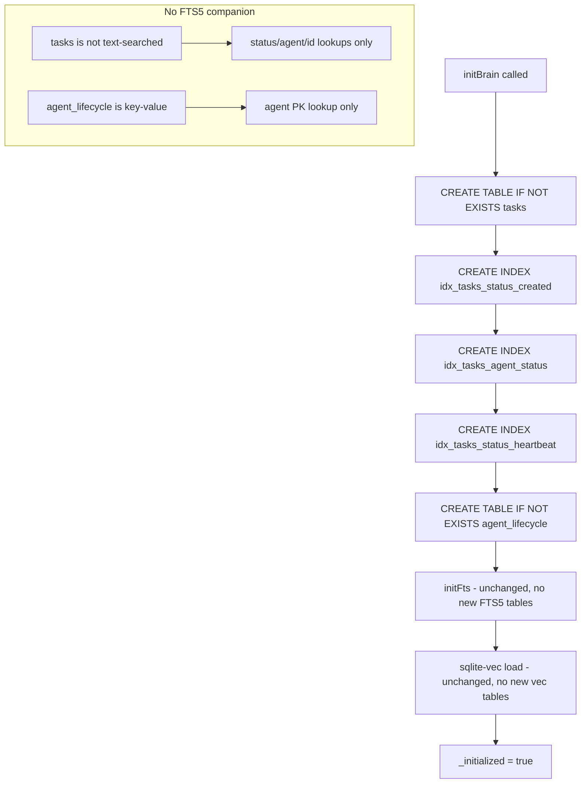

# ASL-0002 — brain.db schema: `tasks` + `agent_lifecycle` tables

## TL;DR

Add two new SQLite tables to brain.db: `tasks` (the daemon's work queue) and `agent_lifecycle` (per-agent state tracking). Both are operational state tables — not text-searched content. **No FTS5 companions. No vector (sqlite-vec) companions.** This task is schema-only — no library code, no queries beyond migration, no behavior change. It's the foundation for ASL-0003 (task queue library), ASL-0004 (agent lifecycle library), and everything downstream.

## Context

The ASL Phase 2 BRIEF (architecture-passed 2026-04-07) introduces a background daemon that claims work from a SQLite-backed task queue. The schema for that queue — and for per-agent lifecycle tracking — is specified in BRIEF §2 and §3. The research round (`research/2026-04-07-daemon-architecture-findings.md`) reversed the BRIEF's original fixed-5-minute lease design to a **heartbeat-based lease** pattern, which is reflected in the schema below.

**Why schema is its own task:**
- Keeps the migration surface small and reviewable in isolation.
- Unblocks ASL-0003 and ASL-0004 as independent libraries (task queue lib and lifecycle lib can be built in parallel once the schema exists).
- Forces a deliberate review of column names, index selection, and defaults before any library code locks them in.

**Migration strategy in this repo (read this before touching anything):**

This repo does **not** use drizzle-kit migrations. Schema changes are applied at runtime in `src/libs/brain/index.ts` `initBrain()` via two patterns:

1. **New tables:** raw `CREATE TABLE IF NOT EXISTS` blocks. Idempotent. Safe to re-run on existing databases.
2. **New columns on existing tables:** `try { raw.exec("ALTER TABLE X ADD COLUMN Y") } catch {}` — the try/catch absorbs the "duplicate column" error on subsequent runs.

The Drizzle schema in `src/libs/brain/schema.ts` mirrors the SQL as typed definitions so downstream code can use `drizzle-orm` query builders. **Both files must be updated in lockstep** — the raw SQL in `initBrain()` is what actually creates the table; the Drizzle definition is the type surface. If they drift, queries compile but fail at runtime.

## Architecture Diagram



## Goal

After this task ships:
1. Every fresh brain.db creation includes the two new tables with correct columns, defaults, NOT NULL constraints, and indexes.
2. Every existing brain.db gets the two new tables created on next `initBrain()` call, with no impact on existing tables.
3. The Drizzle schema in `src/libs/brain/schema.ts` exports typed table definitions for `tasks` and `agentLifecycle` that match the raw SQL exactly.
4. Tests verify that the schema migration runs cleanly twice in a row (idempotency) and that both tables respond to basic queries (`SELECT 1 FROM tasks`, `SELECT 1 FROM agent_lifecycle`).
5. `bun run tool brain --check` still passes.
6. No regressions in any existing table, FTS5 index, or vector table.

## Detailed Specification

### Part 1 — `src/libs/brain/index.ts` — add two `CREATE TABLE IF NOT EXISTS` blocks

Add the following SQL blocks inside `initBrain()`. Exact placement: **after the `staged_proposals` table creation + its indexes (around line 279-280), BEFORE the `initFts(raw)` call (line 316).** This placement keeps all operational-state table DDL together and runs before the FTS5 virtual tables / triggers are wired up — avoiding any interaction with the `staged_fts` rebuild path from commit `a3c327f`.

**SQL to add (place exactly as written):**

```ts
  // ─── ASL Phase 2: daemon task queue + agent lifecycle ────────
  // See vault/studio/projects/autonomous-self-learning/BRIEF.md §2 and §3
  // No FTS5 companion — these are operational-state tables, not text-searched content.
  // No sqlite-vec companion — no semantic search over tasks or lifecycle state.

  raw.exec(`
    CREATE TABLE IF NOT EXISTS tasks (
      id INTEGER PRIMARY KEY AUTOINCREMENT,
      agent TEXT NOT NULL,
      task_type TEXT NOT NULL,
      status TEXT NOT NULL,
      payload TEXT,
      claimed_by TEXT,
      claimed_at TEXT,
      heartbeat_at TEXT,
      lease_duration_ms INTEGER NOT NULL DEFAULT 60000,
      attempts INTEGER NOT NULL DEFAULT 0,
      max_attempts INTEGER NOT NULL DEFAULT 3,
      last_error TEXT,
      trigger_reason TEXT,
      created_at TEXT NOT NULL,
      completed_at TEXT,
      duration_ms INTEGER
    );
  `);
  raw.exec("CREATE INDEX IF NOT EXISTS idx_tasks_status_created   ON tasks(status, created_at)");
  raw.exec("CREATE INDEX IF NOT EXISTS idx_tasks_agent_status     ON tasks(agent, status)");
  raw.exec("CREATE INDEX IF NOT EXISTS idx_tasks_status_heartbeat ON tasks(status, heartbeat_at)");

  raw.exec(`
    CREATE TABLE IF NOT EXISTS agent_lifecycle (
      agent TEXT PRIMARY KEY,
      last_saved_at TEXT,
      last_reflected_at TEXT,
      last_consolidated_at TEXT,
      last_distilled_at TEXT,
      last_distill_input_hash TEXT,
      soul_version_hash TEXT,
      inbox_count INTEGER NOT NULL DEFAULT 0,
      knowledge_count INTEGER NOT NULL DEFAULT 0,
      pending_task_count INTEGER NOT NULL DEFAULT 0,
      distill_trigger_reason TEXT,
      updated_at TEXT NOT NULL
    );
  `);
  // No secondary indexes on agent_lifecycle — `agent` is the primary key and
  // all expected queries are single-row lookups by agent name.
```

**Hard rules for this SQL block:**
- **Do not use `AUTOINCREMENT` on `agent_lifecycle`.** The primary key is `agent TEXT PRIMARY KEY` — there is exactly one row per agent, upserted via `ON CONFLICT(agent) DO UPDATE SET ...` by ASL-0004.
- **Do not add `ON DELETE CASCADE` between `tasks.agent` and `agent_lifecycle.agent`.** No foreign key relationship. Tasks can exist for agents that don't yet have a lifecycle row (and vice versa). ASL-0004's upsert logic handles this.
- **Do not rename columns** from the exact names shown. Downstream libraries (ASL-0003, ASL-0004) are already designed against these names.
- **`lease_duration_ms INTEGER NOT NULL DEFAULT 60000`** — the default is 60s. Per-task-type overrides (5 min for distill, 10 min for full-pipeline) are set by the enqueue library at insert time, not by column default. See BRIEF §2 "Per-task-type lease tuning."
- **`status` has no CHECK constraint** on the enum values. ASL-0003 will enforce the enum at the library boundary via TypeScript types. Adding a CHECK constraint here would force a schema migration every time we add a new status value; the app-level enforcement is the right tradeoff for this project.
- **Indexes are `IF NOT EXISTS`** — the block must be fully idempotent for re-runs against existing databases.

### Part 2 — `src/libs/brain/schema.ts` — add Drizzle table definitions

Add the following exports at the end of the file (after `stagedProposals`). Order matches the SQL columns exactly.

```ts
/** ASL Phase 2 — daemon task queue. See BRIEF.md §2. */
export const tasks = sqliteTable("tasks", {
  id: integer("id").primaryKey({ autoIncrement: true }),
  agent: text("agent").notNull(),
  taskType: text("task_type").notNull(),              // 'consolidate' | 'distill' | 'full-pipeline'
  status: text("status").notNull(),                   // 'pending' | 'claimed' | 'completed' | 'failed'
  payload: text("payload"),                           // JSON, task-specific args
  claimedBy: text("claimed_by"),                      // worker PID or identifier
  claimedAt: text("claimed_at"),                      // ISO timestamp of initial claim
  heartbeatAt: text("heartbeat_at"),                  // last heartbeat; stale → reclaimable
  leaseDurationMs: integer("lease_duration_ms").notNull().default(60000),
  attempts: integer("attempts").notNull().default(0),
  maxAttempts: integer("max_attempts").notNull().default(3),
  lastError: text("last_error"),
  triggerReason: text("trigger_reason"),              // 'file-change' | 'manual' | 'schedule'
  createdAt: text("created_at").notNull(),
  completedAt: text("completed_at"),
  durationMs: integer("duration_ms"),
});

/** ASL Phase 2 — per-agent lifecycle state. See BRIEF.md §3. */
export const agentLifecycle = sqliteTable("agent_lifecycle", {
  agent: text("agent").primaryKey(),
  lastSavedAt: text("last_saved_at"),
  lastReflectedAt: text("last_reflected_at"),
  lastConsolidatedAt: text("last_consolidated_at"),
  lastDistilledAt: text("last_distilled_at"),
  lastDistillInputHash: text("last_distill_input_hash"),
  soulVersionHash: text("soul_version_hash"),
  inboxCount: integer("inbox_count").notNull().default(0),
  knowledgeCount: integer("knowledge_count").notNull().default(0),
  pendingTaskCount: integer("pending_task_count").notNull().default(0),
  distillTriggerReason: text("distill_trigger_reason"),
  updatedAt: text("updated_at").notNull(),
});
```

**Hard rules for the Drizzle definitions:**
- **TypeScript field names are camelCase.** SQL column names are snake_case. The `integer("name")` / `text("name")` first argument is the SQL column name — must match the SQL exactly.
- **`primaryKey({ autoIncrement: true })`** on `tasks.id` matches the `INTEGER PRIMARY KEY AUTOINCREMENT` in the SQL.
- **`primaryKey()`** (no args) on `agentLifecycle.agent` matches `agent TEXT PRIMARY KEY` in the SQL.
- **`.notNull()`** must appear on every column the SQL marks `NOT NULL` — drift here causes silent type-level bugs.
- **`.default(X)`** must match the SQL default value exactly. `60000`, `0`, `3` — match the SQL.
- **Do not export anything else from this file.** No queries, no helpers — that's ASL-0003 and ASL-0004's scope.

### Part 3 — FTS5 / sqlite-vec / triggers — explicit non-changes

**Do NOT modify:**
- `src/libs/brain/fts.ts` — no new FTS5 virtual tables. Neither `tasks` nor `agent_lifecycle` is text-searched.
- The `sqlite-vec` load block in `initBrain()` — no new `vec_*` tables. Neither table holds embeddings.
- The `staged_fts` rebuild path (lines 295-326 in `index.ts`) — this is the commit `a3c327f` fix for FTS5 migration. Do not touch it.
- Any existing `CREATE TABLE`, `ALTER TABLE`, `CREATE INDEX`, or trigger block.
- `src/libs/brain/sync.ts` — no new sync path. Tasks and lifecycle state are not file-backed.
- `src/libs/brain/queries.ts` — no new query helpers. That's ASL-0003 and ASL-0004.
- `src/libs/brain/raw.ts` — unrelated.

**Rationale for the FTS5 decision (call this out explicitly):**
- `tasks` is queried by `status`, `(status, created_at)`, `(agent, status)`, and `(status, heartbeat_at)`. All four are B-tree index lookups on structured fields. `payload` is opaque JSON; FTS5 on JSON is a smell. No text-search use case.
- `agent_lifecycle` is queried exclusively by `agent` (primary key). No text-search use case.
- Adding FTS5 virtual tables would trigger the `initFts()` code path and the migration rebuild logic that bit us in commit `a3c327f`. Deliberately avoiding that surface.
- If a future task needs full-text search over `tasks.last_error` (for example, "show me all tasks that failed with 'timeout'"), that's a separate migration task — not this one.

### Part 4 — Tests

**File:** `src/libs/brain/__tests__/schema-asl-0002.test.ts` (NEW)

This test suite verifies the schema migration runs cleanly, is idempotent, and that both tables respond to basic queries. It does NOT test the task queue claim logic or lifecycle upsert behavior — those are ASL-0003 and ASL-0004 scope.

**Test scaffolding — use an in-memory SQLite database to avoid touching the real brain.db:**

Ryan will need to decide how to scope the test. Two options:

**Option A (preferred):** The test uses `initBrain()` against the real brain.db path (via the normal `getRawDb()` singleton) because `initBrain()` is idempotent and the new tables will simply be created alongside existing ones. This tests the real migration path. The test runs `initBrain()` twice and asserts no errors. All assertions are reads — no writes to existing tables.

**Option B (fallback):** If Option A is too invasive or risks mutating dev state, create a helper that opens a fresh SQLite file in a temp directory, runs the same CREATE TABLE blocks extracted from `initBrain()`, and asserts against that. This requires extracting the blocks into a helper function (OK if small and clean).

**Start with Option A.** If it fails for any reason, fall back to Option B and document the reason in the Reporting Back section.

```ts
import { test, expect, beforeAll } from "bun:test";
import { initBrain } from "../index.js";
import { getRawDb } from "../../sqlite.js";

beforeAll(() => {
  // Idempotent — safe to call even if brain.db is already initialized
  initBrain();
  // Second call must not throw (idempotency contract)
  initBrain();
});

test("tasks table exists with all required columns", () => {
  const raw = getRawDb();
  const cols = raw.prepare("PRAGMA table_info(tasks)").all() as Array<{ name: string; type: string; notnull: number; dflt_value: any }>;
  const colMap = Object.fromEntries(cols.map(c => [c.name, c]));

  // Required columns present
  const required = [
    "id", "agent", "task_type", "status", "payload",
    "claimed_by", "claimed_at", "heartbeat_at", "lease_duration_ms",
    "attempts", "max_attempts", "last_error", "trigger_reason",
    "created_at", "completed_at", "duration_ms",
  ];
  for (const col of required) {
    expect(colMap[col], `tasks.${col} missing`).toBeDefined();
  }

  // NOT NULL constraints on the right columns
  expect(colMap.agent.notnull).toBe(1);
  expect(colMap.task_type.notnull).toBe(1);
  expect(colMap.status.notnull).toBe(1);
  expect(colMap.lease_duration_ms.notnull).toBe(1);
  expect(colMap.attempts.notnull).toBe(1);
  expect(colMap.max_attempts.notnull).toBe(1);
  expect(colMap.created_at.notnull).toBe(1);

  // Nullable columns
  expect(colMap.payload.notnull).toBe(0);
  expect(colMap.claimed_at.notnull).toBe(0);
  expect(colMap.heartbeat_at.notnull).toBe(0);
});

test("tasks indexes exist", () => {
  const raw = getRawDb();
  const indexes = raw.prepare("SELECT name FROM sqlite_master WHERE type='index' AND tbl_name='tasks'").all() as Array<{ name: string }>;
  const names = new Set(indexes.map(i => i.name));
  expect(names.has("idx_tasks_status_created")).toBe(true);
  expect(names.has("idx_tasks_agent_status")).toBe(true);
  expect(names.has("idx_tasks_status_heartbeat")).toBe(true);
});

test("agent_lifecycle table exists with all required columns", () => {
  const raw = getRawDb();
  const cols = raw.prepare("PRAGMA table_info(agent_lifecycle)").all() as Array<{ name: string; type: string; notnull: number; pk: number }>;
  const colMap = Object.fromEntries(cols.map(c => [c.name, c]));

  const required = [
    "agent", "last_saved_at", "last_reflected_at", "last_consolidated_at",
    "last_distilled_at", "last_distill_input_hash", "soul_version_hash",
    "inbox_count", "knowledge_count", "pending_task_count",
    "distill_trigger_reason", "updated_at",
  ];
  for (const col of required) {
    expect(colMap[col], `agent_lifecycle.${col} missing`).toBeDefined();
  }

  // agent is the primary key
  expect(colMap.agent.pk).toBe(1);

  // Counts are NOT NULL with default 0
  expect(colMap.inbox_count.notnull).toBe(1);
  expect(colMap.knowledge_count.notnull).toBe(1);
  expect(colMap.pending_task_count.notnull).toBe(1);
  expect(colMap.updated_at.notnull).toBe(1);
});

test("initBrain is idempotent — second call does not throw or mutate", () => {
  // Already called twice in beforeAll — this test documents the contract.
  // A third call must also succeed.
  expect(() => initBrain()).not.toThrow();
});

test("tasks table accepts a minimal insert and round-trip", () => {
  const raw = getRawDb();
  const testAgent = "__asl_0002_test_agent__";
  const ts = new Date().toISOString();

  // Clean up any prior test row (idempotent test)
  raw.exec("DELETE FROM tasks WHERE agent = ?", [testAgent] as any);

  raw.exec(`
    INSERT INTO tasks (agent, task_type, status, created_at)
    VALUES (?, ?, ?, ?)
  `, [testAgent, "consolidate", "pending", ts] as any);

  const row = raw.prepare("SELECT * FROM tasks WHERE agent = ?").get(testAgent) as any;
  expect(row).toBeDefined();
  expect(row.status).toBe("pending");
  expect(row.task_type).toBe("consolidate");
  expect(row.lease_duration_ms).toBe(60000); // default
  expect(row.attempts).toBe(0); // default
  expect(row.max_attempts).toBe(3); // default

  // Cleanup
  raw.exec("DELETE FROM tasks WHERE agent = ?", [testAgent] as any);
});

test("agent_lifecycle table accepts a minimal upsert and round-trip", () => {
  const raw = getRawDb();
  const testAgent = "__asl_0002_test_agent__";
  const ts = new Date().toISOString();

  // Clean up any prior test row
  raw.exec("DELETE FROM agent_lifecycle WHERE agent = ?", [testAgent] as any);

  raw.exec(`
    INSERT INTO agent_lifecycle (agent, updated_at)
    VALUES (?, ?)
  `, [testAgent, ts] as any);

  const row = raw.prepare("SELECT * FROM agent_lifecycle WHERE agent = ?").get(testAgent) as any;
  expect(row).toBeDefined();
  expect(row.agent).toBe(testAgent);
  expect(row.inbox_count).toBe(0); // default
  expect(row.knowledge_count).toBe(0); // default
  expect(row.pending_task_count).toBe(0); // default

  // Cleanup
  raw.exec("DELETE FROM agent_lifecycle WHERE agent = ?", [testAgent] as any);
});
```

**Test rules:**
- Use a test-specific agent name prefixed with `__asl_0002_test_agent__` to avoid colliding with any real agent row.
- **Always clean up test rows** at the start AND end of each insert/upsert test — the brain.db persists across test runs.
- Do NOT test the claim query (`BEGIN IMMEDIATE` + `UPDATE ... RETURNING`) — that's ASL-0003's test surface.
- Do NOT test heartbeat timing — that's ASL-0003.
- Do NOT test lifecycle upsert semantics beyond "a single INSERT round-trips" — that's ASL-0004.
- **Known issue:** The user's auto-memory notes "Bun test broken on Windows — segfault on import from modified modules, runtime works fine." If `bun test` segfaults, Ryan should report that explicitly and **try running the test file directly via `bun run src/libs/brain/__tests__/schema-asl-0002.test.ts`** as a fallback (Bun's test APIs work at runtime even when `bun test` doesn't). If neither works, Ryan should manually run the `initBrain()` call twice via a one-off script and use `bun run tool brain --check` to verify the schema is intact.

### Part 5 — Manual smoke checks

After implementation, Ryan should run these commands and report the output:

```bash
# 1. Run the new test file (fall back to direct execution if bun test segfaults)
bun test src/libs/brain/__tests__/schema-asl-0002.test.ts

# 2. Verify brain.db still syncs cleanly
bun run tool brain --check

# 3. Confirm the schema is visible in the real DB
bun run tool brain --help
# (this loads the brain module, which calls initBrain() as a side-effect — any migration error would surface here)
```

## Files in Scope

| Path | Action | Purpose |
|------|--------|---------|
| `src/libs/brain/index.ts` | MODIFY | Add `CREATE TABLE IF NOT EXISTS` blocks for `tasks` and `agent_lifecycle`, plus their indexes. Placement: after `staged_proposals` indexes, before `initFts(raw)`. |
| `src/libs/brain/schema.ts` | MODIFY | Add Drizzle table definitions for `tasks` and `agentLifecycle` at the end of the file. |
| `src/libs/brain/__tests__/schema-asl-0002.test.ts` | CREATE | Schema verification tests (column presence, NOT NULL constraints, index presence, idempotency, basic round-trip). |

**Out of scope (do NOT touch):**
- `src/libs/brain/fts.ts` — no FTS5 companions
- `src/libs/brain/sync.ts` — no sync path
- `src/libs/brain/queries.ts` — no queries
- `src/libs/brain/raw.ts` — unrelated
- `src/libs/brain/chunker.ts`, `reranker.ts`, `degradation.ts`, `embeddings.ts` — all unrelated
- `src/libs/sqlite.ts` — no DB config changes
- Any existing table, column, index, trigger, or virtual table
- Any library code — no `src/libs/task-queue.ts`, no `src/libs/agent-lifecycle.ts`, no `src/tools/agent-state.ts`
- The daemon — `src/services/self-learning-daemon/` does not exist yet and will not be created in this task
- `CLAUDE.md`, docs, README — no documentation updates

## Acceptance Criteria

| # | Criterion | Verification |
|---|-----------|--------------|
| 1 | `CREATE TABLE IF NOT EXISTS tasks (...)` exists in `initBrain()` with all 16 columns from the spec | Code review + `PRAGMA table_info(tasks)` |
| 2 | `tasks` has the three required indexes: `idx_tasks_status_created`, `idx_tasks_agent_status`, `idx_tasks_status_heartbeat` | Code review + `SELECT name FROM sqlite_master WHERE type='index' AND tbl_name='tasks'` |
| 3 | `tasks.id` is `INTEGER PRIMARY KEY AUTOINCREMENT` | Code review |
| 4 | `tasks.lease_duration_ms` defaults to `60000` (60s) | Code review + round-trip test |
| 5 | `tasks.attempts` defaults to `0`, `tasks.max_attempts` defaults to `3` | Code review + round-trip test |
| 6 | `tasks.agent`, `tasks.task_type`, `tasks.status`, `tasks.created_at` are `NOT NULL` | Code review + `PRAGMA table_info` |
| 7 | `CREATE TABLE IF NOT EXISTS agent_lifecycle (...)` exists with all 12 columns from the spec | Code review + `PRAGMA table_info(agent_lifecycle)` |
| 8 | `agent_lifecycle.agent` is the primary key (TEXT, no autoincrement) | Code review |
| 9 | `agent_lifecycle.inbox_count`, `knowledge_count`, `pending_task_count` all default to `0` and are `NOT NULL` | Code review |
| 10 | Drizzle `tasks` export exists in `schema.ts` with all columns and correct types (`.notNull()`, `.default(X)`, `primaryKey({ autoIncrement: true })`) | Code review + TypeScript compile check |
| 11 | Drizzle `agentLifecycle` export exists with all columns and `.primaryKey()` on `agent` | Code review + TypeScript compile check |
| 12 | `initBrain()` is idempotent — can be called multiple times without errors | Test: `initBrain(); initBrain(); initBrain()` — no throws |
| 13 | No FTS5 virtual tables added (`fts.ts` unchanged) | `git diff src/libs/brain/fts.ts` is empty |
| 14 | No vec/embedding tables added for `tasks` or `agent_lifecycle` | Code review — no `vec_tasks` or `vec_agent_lifecycle` CREATE statements |
| 15 | `staged_fts` rebuild path (lines 295-326 in `index.ts`) is unchanged | `git diff` around that block shows only additive changes ABOVE the block |
| 16 | All new SQL is placed between `staged_proposals` index creation and `initFts(raw)` call | Code review |
| 17 | Schema tests pass (or fall back to direct execution if `bun test` segfaults on Windows — see Part 4 notes) | Test run |
| 18 | `bun run tool brain --check` succeeds after changes | Manual smoke run |
| 19 | No existing table, index, trigger, or FTS5 virtual table is modified | `git diff src/libs/brain/` shows additive changes only |
| 20 | No new runtime dependencies introduced | `git diff package.json` is empty |

## Defensive Reflexes — Ryan, Verify Before Claiming Done

Before reporting complete, Ryan should manually verify:

1. **Drift between SQL and Drizzle schema.** Open `index.ts` and `schema.ts` side-by-side. For every column in the SQL `CREATE TABLE`, confirm the Drizzle definition has the matching column with the right type, nullability, and default. Drift here compiles cleanly but fails at runtime — catch it at review.

2. **Idempotency on real brain.db.** Run `bun run tool brain --check` twice. Both runs must succeed. The second run exercises the `IF NOT EXISTS` path.

3. **No accidental writes during test cleanup.** The tests clean up test rows at start and end. If a test fails mid-run, the cleanup may not execute, leaving `__asl_0002_test_agent__` rows in the real DB. After testing, confirm: `raw.prepare("SELECT COUNT(*) FROM tasks WHERE agent LIKE '__asl_0002_%'").get()` returns `0`. Same for `agent_lifecycle`.

4. **`staged_fts` rebuild path untouched.** Run `git diff src/libs/brain/index.ts` and specifically confirm the lines around the `stagedFtsNeedsRebuild` block are byte-identical. This was the bug in commit `a3c327f` — do not perturb it.

5. **TypeScript compilation.** Run `bun run tsc --noEmit` (or whatever the project uses) on the modified files. The new Drizzle exports must compile without errors. If the project doesn't have a tsc step, `bun run tool brain --check` will load the module and catch type errors at runtime.

6. **Column name typos.** `heartbeat_at` vs `heartbeat_ts`, `lease_duration_ms` vs `lease_ms`, `task_type` vs `type` — these are the mistakes that ASL-0003 and ASL-0004 will trip over in the NEXT task. Double-check every column name against this spec.

## What NOT to Do

- Do not implement a task queue library. No `src/libs/task-queue.ts`. That's ASL-0003.
- Do not implement agent lifecycle helpers. No `src/libs/agent-lifecycle.ts`. That's ASL-0004.
- Do not implement a CLI tool. No `src/tools/agent-state.ts`. That's ASL-0009.
- Do not add FTS5 virtual tables, triggers, or content mirrors for the new tables.
- Do not add sqlite-vec tables or embedding columns to the new tables.
- Do not add foreign key constraints or cascades between the two new tables.
- Do not enforce a CHECK constraint on `status` or `task_type` enum values — app-level enforcement in ASL-0003 is the correct boundary.
- Do not add sample data, seed data, or placeholder rows.
- Do not modify `initFts()`, `sync.ts`, or `queries.ts`.
- Do not rename, remove, or alter any existing column or table.
- Do not touch the `staged_fts` rebuild block (commit `a3c327f` fix path).
- Do not add a new sqlite-vec virtual table.
- Do not introduce new dependencies in `package.json`.
- Do not create the `src/services/self-learning-daemon/` folder — that's ASL-0007.

## Reporting Back

When complete, Ryan should report:

1. **Summary of changes per file** — line counts added, new exports, SQL block character count.
2. **PRAGMA output** — paste the result of `PRAGMA table_info(tasks)` and `PRAGMA table_info(agent_lifecycle)` to confirm schema is as specified.
3. **Index list** — paste the result of `SELECT name, sql FROM sqlite_master WHERE type='index' AND tbl_name IN ('tasks', 'agent_lifecycle')` to confirm all three indexes on `tasks` exist.
4. **Test results** — pass/fail count for the new test file. If `bun test` segfaults on Windows, explicitly note that and report the output of the fallback direct-execution path.
5. **`bun run tool brain --check` output** — confirm it still succeeds.
6. **Confirmation that no files outside the "Files in Scope" list were modified** — paste `git status` and `git diff --stat`.
7. **Any deviations from this spec and the reasoning** — if Ryan finds the spec wrong or impossible, document exactly what and why.
8. **Any bad intelligence** — mismatched line numbers in the spec, type signature drift, missing imports, wrong file paths. If Ryan finds them, fix them AND report them so the task doc can be corrected.
9. **Defensive-reflex output** — paste the result of `SELECT COUNT(*) FROM tasks WHERE agent LIKE '__asl_0002_%'` and `SELECT COUNT(*) FROM agent_lifecycle WHERE agent LIKE '__asl_0002_%'` to prove test cleanup ran.

McCall will then code-review against architectural intent (schema fit, naming consistency, no regression, Drizzle/SQL drift) and either approve or send back for fixes before Freddie commits.
