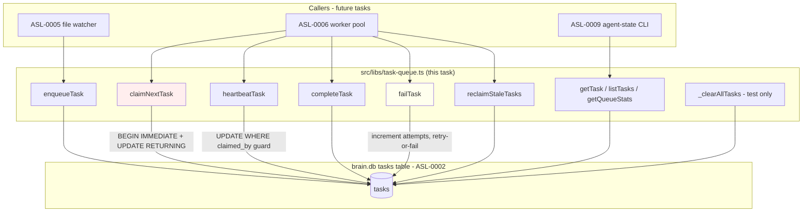

# ASL-0003 — Task queue library (`src/libs/task-queue.ts`)

## TL;DR

Build a thin, programmatic library that wraps the `tasks` table shipped by ASL-0002 with a clean claim/heartbeat/complete/fail API. **No daemon. No worker pool. No file watcher. No CLI.** Just a typed module that the daemon (ASL-0006/0007) and the file watcher (ASL-0005) will import. The crown-jewel is the atomic claim query — `BEGIN IMMEDIATE` + `UPDATE … RETURNING` over a subselect that picks the oldest pending task **or** a stale-heartbeat claimed task. Everything else is plumbing around that one query.

## Context

ASL-0002 (commit `1f5fa1a`) shipped the `tasks` schema with heartbeat-based lease semantics. Per BRIEF §2 and `research/2026-04-07-daemon-architecture-findings.md` §Q3, the lease model is:

- **Short initial lease (60s default)** + **periodic heartbeat (lease/2)**.
- **Crashed worker** → heartbeats stop → next claimer reclaims within `lease_duration_ms`.
- **Healthy long task** → heartbeat extends indefinitely.
- **Per-task-type override** at enqueue time (consolidate 2 min, distill 10 min, full-pipeline 15 min).

This task implements that contract as a library. It is the first piece of code that actually exercises the schema. Every column ASL-0002 added is read or written here. Any drift surfaces now, not in ASL-0006.

**Why a library, not an embedded part of the daemon:** the daemon (ASL-0007) and file watcher (ASL-0005) and `agent-state` CLI (ASL-0009) all need to enqueue / inspect / reclaim. A library keeps the SQL in one place. The daemon owns the worker loop; this library owns the queue primitives.

**Coupling boundary (re-stated from ASL-0002):** This library MUST NOT touch `agent_lifecycle`. That table has its own library (ASL-0004). The two are deliberately decoupled — no FKs, no cascading writes. If a daemon worker needs to update both after a task finishes, the daemon orchestrates the two calls. This library does not know `agent_lifecycle` exists.

## Architecture Diagram



The red node is the only structurally tricky query. The yellow node is the only place retry logic lives. Everything else is straightforward.

## Goal

After this task ships:

1. `src/libs/task-queue.ts` exports a complete, typed programmatic API for enqueuing, claiming (with stale reclaim), heartbeating, completing, failing (with retry logic), reclaiming, and querying tasks.
2. The atomic claim query uses `BEGIN IMMEDIATE` + `UPDATE … RETURNING` against bun:sqlite raw SQL.
3. The heartbeat query is guarded by `claimed_by = ?` so a worker cannot accidentally heartbeat another worker's task.
4. Failure semantics are correct: `attempts < max_attempts` re-queues as pending; `attempts >= max_attempts` is permanently failed.
5. Stale reclaim resets the task to pending **without** incrementing `attempts` (a worker crash isn't the worker's fault — it's infrastructure).
6. A test suite covers the round trip, retry behavior, max-attempts cutoff, multi-worker claim ordering, empty-queue null return, and stale reclaim — all without real `sleep()` calls.
7. `bun run tool brain --check` still passes. No regressions in any existing brain.db function.
8. No new dependencies in `package.json`. No daemon code. No worker pool code. No CLI.

## Detailed Specification

### Part 1 — `src/libs/task-queue.ts` (NEW FILE)

#### File header

```ts
/**
 * task-queue.ts — Programmatic API over the brain.db `tasks` table.
 *
 * Implements heartbeat-based lease semantics for the ASL Phase 2 daemon.
 * See vault/studio/projects/autonomous-self-learning/BRIEF.md §2
 * and research/2026-04-07-daemon-architecture-findings.md §Q3.
 *
 * This library is intentionally small and coupling-free:
 *   - No daemon code, no worker pool, no file watcher, no CLI.
 *   - Does NOT touch agent_lifecycle (ASL-0004 owns that).
 *   - Does NOT spawn processes or open new DB connections.
 *   - Uses the singleton bun:sqlite handle from src/libs/sqlite.ts via initBrain().
 *
 * Callers: ASL-0005 file watcher, ASL-0006 worker pool, ASL-0009 agent-state CLI.
 */
```

#### Imports

```ts
import { initBrain } from "./brain/index.js";
import { getRawDb } from "./sqlite.js";
```

That's it. No dayjs (use `new Date().toISOString()` directly — same convention as `staged.ts`'s `createdAt`). No drizzle (we use raw SQL throughout — see "Drizzle vs raw SQL" below). No external packages.

#### Type definitions

Place these near the top of the file, after imports.

```ts
// ─── Type definitions ────────────────────────────────────────────

/** Task type — enforced at the library boundary, not by SQL CHECK constraint. */
export type TaskType = "consolidate" | "distill" | "full-pipeline";

/** Task lifecycle status. */
export type TaskStatus = "pending" | "claimed" | "completed" | "failed";

/** Trigger source — where the task came from. */
export type TriggerReason = "file-change" | "manual" | "schedule";

/** A task row as returned from the DB (camelCase, ISO timestamps as strings). */
export interface Task {
  id: number;
  agent: string;
  taskType: TaskType;
  status: TaskStatus;
  payload: string | null;            // JSON string, opaque to this library
  claimedBy: string | null;
  claimedAt: string | null;          // ISO timestamp
  heartbeatAt: string | null;        // ISO timestamp
  leaseDurationMs: number;
  attempts: number;
  maxAttempts: number;
  lastError: string | null;
  triggerReason: TriggerReason | null;
  createdAt: string;                 // ISO timestamp
  completedAt: string | null;        // ISO timestamp
  durationMs: number | null;
}

/** Input for enqueueing a new task. */
export interface EnqueueTaskInput {
  agent: string;
  taskType: TaskType;
  payload?: unknown;                 // serialized via JSON.stringify before INSERT
  triggerReason?: TriggerReason;
  leaseDurationMs?: number;          // overrides the per-type default below
  maxAttempts?: number;              // overrides DB default of 3
}

/** Result of enqueueTask — returns the inserted row. */
export interface EnqueueTaskResult {
  id: number;
  task: Task;
}

/** Options for listTasks. */
export interface ListTasksOptions {
  status?: TaskStatus;
  agent?: string;
  taskType?: TaskType;
  limit?: number;                    // default 100
}

/** Aggregate counts for the queue snapshot. */
export interface QueueStats {
  pending: number;
  claimed: number;
  completed: number;
  failed: number;
  total: number;
}

// ─── Per-task-type lease defaults ────────────────────────────────
// See BRIEF §2 "Per-task-type lease tuning."
// Heartbeat interval is lease / 2, so:
//   consolidate → 60s heartbeat
//   distill     → 5 min heartbeat
//   full-pipeline → 7.5 min heartbeat
// A stuck distill is therefore detected within 10 min, not the 15 min full-pipeline ceiling.
export const LEASE_DURATIONS_MS: Record<TaskType, number> = {
  consolidate: 120_000,         // 2 min
  distill: 600_000,             // 10 min — distill is the slow one
  "full-pipeline": 900_000,     // 15 min — outermost safety margin
};
```

**Hard rules for the types:**

- `Task` is **camelCase** at the boundary. The DB columns are snake_case, and every read query MUST translate snake_case → camelCase before returning. Helper function below handles this.
- `payload` is `string | null` on the way out, `unknown` on the way in. The library calls `JSON.stringify(payload)` on enqueue. Callers pass whatever object structure they want; this library does not interpret it.
- `TaskType` and `TaskStatus` are TypeScript-enforced unions, **not** SQL CHECK constraints (per ASL-0002 hard rule — adding a CHECK forces a schema migration on every enum addition).
- `LEASE_DURATIONS_MS` is exported so tests and the daemon can reference the same constants. Do not hardcode 600000 elsewhere.

#### Internal row mapper

```ts
// ─── Internal row mapper ─────────────────────────────────────────
// Translates a snake_case row from bun:sqlite into the camelCase Task type.
// Centralized so every read path uses the same mapping — drift here causes silent
// type-level bugs (e.g. heartbeatAt being undefined because the column is snake_case).

interface TaskRow {
  id: number;
  agent: string;
  task_type: string;
  status: string;
  payload: string | null;
  claimed_by: string | null;
  claimed_at: string | null;
  heartbeat_at: string | null;
  lease_duration_ms: number;
  attempts: number;
  max_attempts: number;
  last_error: string | null;
  trigger_reason: string | null;
  created_at: string;
  completed_at: string | null;
  duration_ms: number | null;
}

function rowToTask(row: TaskRow): Task {
  return {
    id: row.id,
    agent: row.agent,
    taskType: row.task_type as TaskType,
    status: row.status as TaskStatus,
    payload: row.payload,
    claimedBy: row.claimed_by,
    claimedAt: row.claimed_at,
    heartbeatAt: row.heartbeat_at,
    leaseDurationMs: row.lease_duration_ms,
    attempts: row.attempts,
    maxAttempts: row.max_attempts,
    lastError: row.last_error,
    triggerReason: row.trigger_reason as TriggerReason | null,
    createdAt: row.created_at,
    completedAt: row.completed_at,
    durationMs: row.duration_ms,
  };
}
```

**Hard rules for the mapper:**

- This is the **only** place in the file that does snake_case → camelCase translation. Every function that reads a row goes through `rowToTask`. No exceptions.
- The `as TaskType` / `as TaskStatus` casts are unverified — the library trusts that whatever wrote the row used a valid enum value. ASL-0002's "no SQL CHECK constraint" rationale stands; downstream consumers must trust the boundary.

#### Public API — enqueue

```ts
// ─── enqueueTask ─────────────────────────────────────────────────

/**
 * Insert a new pending task. Per-task-type lease defaults apply unless overridden.
 * Payload is JSON.stringify'd if provided; pass null/undefined for no payload.
 *
 * Returns the inserted task with its assigned id.
 */
export function enqueueTask(input: EnqueueTaskInput): EnqueueTaskResult {
  initBrain();
  const raw = getRawDb();

  const now = new Date().toISOString();
  const lease = input.leaseDurationMs ?? LEASE_DURATIONS_MS[input.taskType] ?? 60_000;
  const maxAttempts = input.maxAttempts ?? 3;
  const payloadStr = input.payload === undefined || input.payload === null
    ? null
    : JSON.stringify(input.payload);
  const triggerReason = input.triggerReason ?? null;

  // INSERT … RETURNING * is supported by bun:sqlite (SQLite 3.35+).
  const stmt = raw.prepare(`
    INSERT INTO tasks (
      agent, task_type, status, payload,
      lease_duration_ms, attempts, max_attempts,
      trigger_reason, created_at
    )
    VALUES (?, ?, 'pending', ?, ?, 0, ?, ?, ?)
    RETURNING *
  `);

  const row = stmt.get(
    input.agent,
    input.taskType,
    payloadStr,
    lease,
    maxAttempts,
    triggerReason,
    now,
  ) as TaskRow;

  const task = rowToTask(row);
  return { id: task.id, task };
}
```

**Hard rules for `enqueueTask`:**

- `attempts` is hardcoded to `0` on insert. Never accept it from the caller.
- `status` is hardcoded to `'pending'`. The only way a task becomes `claimed` is via `claimNextTask` (or via the implicit reclaim inside its query); the only way it becomes `completed`/`failed` is via `completeTask`/`failTask`.
- `claimed_by`, `claimed_at`, `heartbeat_at`, `last_error`, `completed_at`, `duration_ms` are all left at their defaults (NULL) — the INSERT does not name them.
- `created_at` is set from `new Date().toISOString()` — **not** SQLite's `datetime('now')`. JS-side timestamps are timezone-correct; SQLite's are UTC and will surprise callers comparing strings.
- The fallback chain `input.leaseDurationMs ?? LEASE_DURATIONS_MS[input.taskType] ?? 60_000` is deliberate. The `60_000` is the absolute final fallback if `taskType` is somehow unrecognized at runtime — should never happen because of the union type, but defense in depth.

#### Public API — claim (the one that matters)

```ts
// ─── claimNextTask ───────────────────────────────────────────────

/**
 * Atomically claim the oldest pending task OR reclaim the oldest stale-heartbeat
 * claimed task. Uses BEGIN IMMEDIATE to acquire the write lock immediately
 * (avoids SQLITE_BUSY under concurrent claimers) and UPDATE … RETURNING for
 * one-shot atomicity.
 *
 * Returns the claimed task, or null if the queue is empty / nothing reclaimable.
 *
 * Stale reclaim semantics:
 *   - Resets claimed_at to the new claim time (does NOT preserve the original).
 *   - Does NOT increment attempts. A worker crash is infrastructure, not failure.
 *   - heartbeat_at is set to the new claim time so the new owner has a fresh lease.
 *
 * Per-agent mutex / per-task-type mutex are NOT enforced here — the daemon
 * (ASL-0006) layers those on top via additional WHERE clauses or claim filters.
 * This library claims globally by oldest created_at.
 */
export function claimNextTask(workerId: string): Task | null {
  initBrain();
  const raw = getRawDb();

  const now = new Date().toISOString();

  // bun:sqlite supports transactions via raw.transaction(), but we want
  // BEGIN IMMEDIATE specifically (not the default DEFERRED) to acquire the
  // write lock up front and avoid SQLITE_BUSY when multiple claimers race.
  // We drive the transaction manually with raw.exec() / prepare() / run().
  raw.exec("BEGIN IMMEDIATE");
  try {
    // The subselect picks the oldest task that is either:
    //   a) status = 'pending', OR
    //   b) status = 'claimed' AND heartbeat is stale (NULL or older than lease)
    //
    // julianday('now') is the only portable SQLite datetime math that gives us
    // millisecond resolution. The * 86400000 converts days to ms.
    //
    // We compare against the row's own lease_duration_ms — per-task-type leases
    // are honored without the library needing to know which type each task is.
    const stmt = raw.prepare(`
      UPDATE tasks
      SET status = 'claimed',
          claimed_by = ?,
          claimed_at = ?,
          heartbeat_at = ?
      WHERE id = (
        SELECT id FROM tasks
        WHERE status = 'pending'
           OR (
             status = 'claimed'
             AND (
               heartbeat_at IS NULL
               OR (julianday('now') - julianday(heartbeat_at)) * 86400000 > lease_duration_ms
             )
           )
        ORDER BY created_at ASC
        LIMIT 1
      )
      RETURNING *
    `);

    const row = stmt.get(workerId, now, now) as TaskRow | null;

    raw.exec("COMMIT");

    if (!row) return null;
    return rowToTask(row);
  } catch (err) {
    // Roll back on any error before rethrowing — never leave the DB locked.
    try { raw.exec("ROLLBACK"); } catch {}
    throw err;
  }
}
```

**Hard rules for `claimNextTask`:**

- **`BEGIN IMMEDIATE`, not `BEGIN DEFERRED`.** This is non-negotiable. DEFERRED defers the write lock acquisition until the first write, which can throw `SQLITE_BUSY` mid-transaction under contention. IMMEDIATE acquires the write lock at transaction start; if it can't, it throws `SQLITE_BUSY` immediately and the worker can retry without holding read locks.
- **`stmt.get()` not `stmt.all()` or `stmt.run()`.** RETURNING with LIMIT 1 returns one row or none. `get()` returns the row or `null`/`undefined`.
- **Stale reclaim resets `claimed_at`** — we explicitly chose this over preserving the original. Justification: simpler semantics (the row always reflects the current owner), no schema change needed (no `original_claimed_at` column), and metrics around "task stuck time" are an observability concern that ASL-0006 / ASL-0009 can solve later by storing the original claim in `payload` or a sidecar table if it ever matters. **Pick one and move on.**
- **Stale reclaim does NOT increment `attempts`.** This is an explicit ADR decision (see below). A crashed worker is an infrastructure failure; the next worker gets a clean shot at the task. `attempts` is reserved for actual `failTask` calls.
- **The subselect is in the WHERE clause, not as a CTE.** bun:sqlite supports CTEs but the WHERE-subselect form is the canonical SQLite atomic-claim pattern and matches what the BRIEF specifies verbatim.
- **`ORDER BY created_at ASC LIMIT 1`** — strict FIFO. No priority field in this version. If a future task needs priority, add a `priority INTEGER DEFAULT 0` column in a new schema migration and update this query to `ORDER BY priority DESC, created_at ASC`.
- **`raw.exec("ROLLBACK")` is wrapped in its own try/catch** — if the COMMIT failed, ROLLBACK will throw "no transaction active." Suppress that and rethrow the original error.

##### ADR — embedded in this file (claim semantics)

| Question | Option A | Option B | Decision |
|---|---|---|---|
| Stale reclaim — preserve original `claimed_at`? | Preserve (metrics: "task stuck for T1 - T0") | Reset to current claim time | **Reset.** Simpler invariants; metrics are an observability concern, not a queue concern. Revisit only if ASL-0006/ASL-0009 actually demands it. |
| Stale reclaim — increment `attempts`? | Yes (treats crash as a failed attempt) | No (crash is infrastructure, not failure) | **No.** The retry budget exists for **substantive** failures (gemini API errors, gate rejections, etc.). Burning retries on infra crashes punishes the wrong actor. |
| Transaction isolation — DEFERRED vs IMMEDIATE | DEFERRED (default, lower contention) | IMMEDIATE (acquires write lock up front) | **IMMEDIATE.** Research Q3 explicit. DEFERRED throws SQLITE_BUSY mid-transaction which is harder to recover from than failing to start. |
| Per-agent mutex enforcement here? | Yes — `AND NOT EXISTS (SELECT 1 FROM tasks WHERE agent=? AND status='claimed')` in the WHERE clause | No — daemon layer enforces it | **No.** The library is a primitive. The daemon can call `claimNextTask` in a loop with its own filter, or extend with an `excludeAgents` parameter in a future task. Keeping this version minimal. |
| Fairness across agents | Strict FIFO by `created_at` | Round-robin per agent | **FIFO.** Round-robin is YAGNI for the current ASL workload (1-3 agents active at a time). Add later if needed. |

#### Public API — heartbeat

```ts
// ─── heartbeatTask ───────────────────────────────────────────────

/**
 * Update the heartbeat_at timestamp for a claimed task. Guarded by claimed_by
 * so a worker cannot accidentally heartbeat another worker's task (defense
 * against worker-id reuse or buggy daemon code).
 *
 * Returns true if the heartbeat was applied, false if the task is no longer
 * owned by this worker (got reclaimed, completed, failed, or never existed).
 *
 * The caller is expected to handle a `false` return by stopping its heartbeat
 * interval and treating the task as lost. The daemon (ASL-0006) will receive
 * a fresh task on the next claim.
 */
export function heartbeatTask(taskId: number, workerId: string): boolean {
  initBrain();
  const raw = getRawDb();

  const now = new Date().toISOString();

  // ONLY heartbeat_at is updated. claimed_at is the original claim time and
  // must be preserved across heartbeats — it's the metric anchor for "how long
  // has this worker been holding the task."
  const stmt = raw.prepare(`
    UPDATE tasks
    SET heartbeat_at = ?
    WHERE id = ?
      AND claimed_by = ?
      AND status = 'claimed'
  `);

  const result = stmt.run(now, taskId, workerId);
  // bun:sqlite stmt.run() returns { changes: number, lastInsertRowid: number }
  return result.changes > 0;
}
```

**Hard rules for `heartbeatTask`:**

- **Updates only `heartbeat_at`.** Not `claimed_at`. Not `attempts`. This is the contract.
- **`AND claimed_by = ?`** is the cross-worker guard. Without it, a confused daemon could keep a stale task alive forever.
- **`AND status = 'claimed'`** prevents heartbeating completed/failed tasks (race: worker A reports completion, worker B's heartbeat arrives milliseconds later).
- **Returns `boolean`.** The boolean `false` is meaningful — the daemon should stop heartbeating, log it, and move on. Throwing is wrong here because the situation is recoverable.

#### Public API — complete

```ts
// ─── completeTask ────────────────────────────────────────────────

/**
 * Mark a task as successfully completed. Requires the worker id for the
 * cross-worker guard. Returns true if the update applied.
 *
 * durationMs is supplied by the caller (the worker measures its own runtime).
 * The library does not compute it from claimed_at to avoid clock-skew bugs
 * across child processes — the worker that ran the task is the source of truth.
 */
export function completeTask(taskId: number, workerId: string, durationMs: number): boolean {
  initBrain();
  const raw = getRawDb();

  const now = new Date().toISOString();

  const stmt = raw.prepare(`
    UPDATE tasks
    SET status = 'completed',
        completed_at = ?,
        duration_ms = ?,
        last_error = NULL
    WHERE id = ?
      AND claimed_by = ?
      AND status = 'claimed'
  `);

  const result = stmt.run(now, durationMs, taskId, workerId);
  return result.changes > 0;
}
```

**Hard rules for `completeTask`:**

- **Clears `last_error` on success** — if a previous attempt failed and the task was re-queued, we don't want stale error text on a successful row.
- **`AND status = 'claimed'`** prevents double-completing.
- **`durationMs` from the caller** — see comment in code. The worker's perspective is the source of truth.

#### Public API — fail (the one with retry logic)

```ts
// ─── failTask ────────────────────────────────────────────────────

/**
 * Mark a task as failed. Increments attempts. If attempts < max_attempts,
 * the task is re-queued as 'pending' for another worker to claim. If
 * attempts >= max_attempts, the task is permanently marked 'failed' and
 * will not be re-dispatched.
 *
 * Returns an object describing what happened:
 *   { applied: false } — the task was not owned by this worker (ignored)
 *   { applied: true, retried: true, attempts: N } — re-queued for retry
 *   { applied: true, retried: false, attempts: N } — permanently failed
 *
 * The retry decision is made inside a single UPDATE — no read-then-write race.
 */
export interface FailTaskResult {
  applied: boolean;
  retried: boolean;
  attempts: number;        // attempts AFTER this call
}

export function failTask(taskId: number, workerId: string, error: string): FailTaskResult {
  initBrain();
  const raw = getRawDb();

  // We could express this in one UPDATE with a CASE expression, but two-step
  // is clearer and the rows-affected check gives us the ownership guard for free.
  // The transaction wraps both steps so a crash mid-fail doesn't leave a half-state.
  raw.exec("BEGIN IMMEDIATE");
  try {
    // Step 1: increment attempts and stash the error, but only if we still own it.
    // We use RETURNING to read back attempts and max_attempts in one round trip.
    const incrementStmt = raw.prepare(`
      UPDATE tasks
      SET attempts = attempts + 1,
          last_error = ?
      WHERE id = ?
        AND claimed_by = ?
        AND status = 'claimed'
      RETURNING attempts, max_attempts
    `);

    const row = incrementStmt.get(error, taskId, workerId) as
      | { attempts: number; max_attempts: number }
      | null;

    if (!row) {
      raw.exec("COMMIT");
      return { applied: false, retried: false, attempts: 0 };
    }

    const willRetry = row.attempts < row.max_attempts;

    if (willRetry) {
      // Re-queue: clear claim fields, set status back to pending.
      // Keep last_error around for visibility into the previous failure.
      const requeueStmt = raw.prepare(`
        UPDATE tasks
        SET status = 'pending',
            claimed_by = NULL,
            claimed_at = NULL,
            heartbeat_at = NULL
        WHERE id = ?
      `);
      requeueStmt.run(taskId);
    } else {
      // Permanent failure: mark failed, stamp completed_at for metrics.
      const now = new Date().toISOString();
      const failStmt = raw.prepare(`
        UPDATE tasks
        SET status = 'failed',
            completed_at = ?
        WHERE id = ?
      `);
      failStmt.run(now, taskId);
    }

    raw.exec("COMMIT");
    return { applied: true, retried: willRetry, attempts: row.attempts };
  } catch (err) {
    try { raw.exec("ROLLBACK"); } catch {}
    throw err;
  }
}
```

**Hard rules for `failTask`:**

- **Wrapped in `BEGIN IMMEDIATE`.** Two-statement update path; we cannot allow a partial state.
- **Increment-first, branch-second.** The first UPDATE increments and reads back the new `attempts`. We base the retry decision on the post-increment value compared against `max_attempts`. This matches the contract: "if attempts < max_attempts after this failure, retry."
- **`last_error` is preserved on requeue** — the next worker can read it from the task row if it cares (ours don't, but observability tools will).
- **On permanent failure, `completed_at` is set.** The column name is "completed" but it serves as a "terminal state timestamp" — both `completed` and `failed` use it. ASL-0009 will display it as "finished at" regardless of status.
- **`durationMs` is NOT set on permanent failure.** The library does not know how long the failed run took — the worker doesn't pass it (and arguably shouldn't, since the failure may have happened mid-run). If the daemon wants to track failed-run durations, it can pass them in a future revision.

#### Public API — reclaim stale (explicit)

```ts
// ─── reclaimStaleTasks ───────────────────────────────────────────

/**
 * Explicitly reclaim all claimed tasks with stale heartbeats — reset them
 * to 'pending' so the next claimNextTask call picks them up. Does NOT
 * increment attempts (same rationale as the implicit reclaim in claimNextTask).
 *
 * The daemon (ASL-0006) calls this periodically as a safety net even though
 * claimNextTask already handles the implicit reclaim case. The explicit form
 * is useful when the queue is otherwise empty and no claimer is active to
 * trigger the implicit path.
 *
 * Returns the number of tasks reclaimed.
 */
export function reclaimStaleTasks(): number {
  initBrain();
  const raw = getRawDb();

  const stmt = raw.prepare(`
    UPDATE tasks
    SET status = 'pending',
        claimed_by = NULL,
        claimed_at = NULL,
        heartbeat_at = NULL
    WHERE status = 'claimed'
      AND (
        heartbeat_at IS NULL
        OR (julianday('now') - julianday(heartbeat_at)) * 86400000 > lease_duration_ms
      )
  `);

  const result = stmt.run();
  return result.changes;
}
```

**Hard rules for `reclaimStaleTasks`:**

- **Same staleness predicate as `claimNextTask`.** If these drift, you get inconsistent reclaim behavior. Consider extracting the WHERE fragment into a SQL constant if it ever changes.
- **No transaction wrapper.** Single UPDATE is atomic on its own. The daemon doesn't care about partial reclaim — it would just call us again.
- **No worker filter.** This is a global cleanup — any caller can run it, and it has no notion of "my tasks."

#### Public API — queries (read-only)

```ts
// ─── Read-only queries ───────────────────────────────────────────

/** Fetch a single task by id. Returns null if not found. */
export function getTask(taskId: number): Task | null {
  initBrain();
  const raw = getRawDb();

  const row = raw.prepare("SELECT * FROM tasks WHERE id = ?").get(taskId) as TaskRow | null;
  return row ? rowToTask(row) : null;
}

/**
 * List tasks matching the given filters. Default limit 100, ordered by
 * created_at DESC (newest first) for human-readable inspection.
 */
export function listTasks(options: ListTasksOptions = {}): Task[] {
  initBrain();
  const raw = getRawDb();

  const where: string[] = [];
  const params: (string | number)[] = [];

  if (options.status) {
    where.push("status = ?");
    params.push(options.status);
  }
  if (options.agent) {
    where.push("agent = ?");
    params.push(options.agent);
  }
  if (options.taskType) {
    where.push("task_type = ?");
    params.push(options.taskType);
  }

  const limit = options.limit ?? 100;
  const whereClause = where.length > 0 ? `WHERE ${where.join(" AND ")}` : "";

  const sql = `SELECT * FROM tasks ${whereClause} ORDER BY created_at DESC LIMIT ?`;
  params.push(limit);

  const rows = raw.prepare(sql).all(...params) as TaskRow[];
  return rows.map(rowToTask);
}

/** Aggregate counts per status. Useful for the agent-state CLI and observability. */
export function getQueueStats(): QueueStats {
  initBrain();
  const raw = getRawDb();

  const rows = raw
    .prepare("SELECT status, COUNT(*) as count FROM tasks GROUP BY status")
    .all() as Array<{ status: string; count: number }>;

  const stats: QueueStats = {
    pending: 0,
    claimed: 0,
    completed: 0,
    failed: 0,
    total: 0,
  };

  for (const row of rows) {
    if (row.status === "pending") stats.pending = row.count;
    else if (row.status === "claimed") stats.claimed = row.count;
    else if (row.status === "completed") stats.completed = row.count;
    else if (row.status === "failed") stats.failed = row.count;
    stats.total += row.count;
  }

  return stats;
}
```

**Hard rules for the read queries:**

- **All raw SQL, not Drizzle.** Even though `listTasks` and `getTask` are simple enough that Drizzle could express them, mixing Drizzle and raw SQL inside one library creates two row-shape conventions (drizzle's typed rows vs raw `TaskRow`). Consistency wins. **Explicit decision: this entire library is raw SQL.** Drizzle stays for ASL-0004 / consumer code that needs join semantics.
- **`listTasks` builds the WHERE clause dynamically.** Dynamic SQL with parameters is safe (placeholders, not interpolation). Do not use string interpolation for the values.
- **`getQueueStats` returns all four statuses even if zero.** A consumer asserting `stats.pending === 0` should not have to check `stats.pending !== undefined`.

#### Public API — test helper (namespaced)

```ts
// ─── Test helpers (namespaced) ───────────────────────────────────
// Underscore-prefixed = "internal, do not use outside of tests."
// Exported because the bun test runner cannot import from a private scope.

/**
 * Delete all rows from the tasks table. Test isolation only — never call
 * from production code. Returns the number of rows deleted.
 */
export function _clearAllTasks(): number {
  initBrain();
  const raw = getRawDb();
  const result = raw.prepare("DELETE FROM tasks").run();
  return result.changes;
}

/**
 * Force a task's heartbeat to a specific ISO timestamp. Used by tests to
 * simulate a stale heartbeat without sleeping. Never call from production.
 */
export function _setHeartbeatForTest(taskId: number, isoTimestamp: string | null): void {
  initBrain();
  const raw = getRawDb();
  raw.prepare("UPDATE tasks SET heartbeat_at = ? WHERE id = ?").run(isoTimestamp, taskId);
}
```

**Hard rules for the test helpers:**

- **Underscore prefix** is the convention. Documented as "internal" in the JSDoc.
- **`_clearAllTasks` truncates the entire table.** Tests must use a unique agent prefix AND call this at start/end. The truncation is a belt-and-suspenders fallback if a previous test crashed mid-run.
- **`_setHeartbeatForTest` exists specifically to avoid `sleep()` in tests.** Time-based logic is tested by writing a known-stale ISO timestamp directly to the row.
- **No other test helpers.** The test surface should be small. If a test needs something more, it can inline raw SQL via `getRawDb()`.

### Part 2 — Drizzle vs raw SQL — explicit decision

| Function | Raw SQL or Drizzle? | Why |
|---|---|---|
| `enqueueTask` | **Raw SQL** | `INSERT … RETURNING *` is bun:sqlite native; Drizzle's `.returning()` works but mixing styles is the bigger sin |
| `claimNextTask` | **Raw SQL (mandatory)** | `BEGIN IMMEDIATE` + `UPDATE … WHERE id = (SELECT … LIMIT 1) RETURNING *` is not expressible in Drizzle without footguns. The subselect-in-WHERE pattern in particular needs raw SQL. |
| `heartbeatTask` | **Raw SQL** | Simple, but the cross-worker guard is part of the SQL semantics — keep it visible |
| `completeTask` | **Raw SQL** | Same — guard clause is visible in SQL |
| `failTask` | **Raw SQL (mandatory)** | Two-statement transaction with branching logic and `RETURNING` from the first step. Drizzle would obscure this. |
| `reclaimStaleTasks` | **Raw SQL** | `julianday()` math is not in Drizzle's expression vocabulary |
| `getTask` | **Raw SQL** | Could be Drizzle, but consistency wins |
| `listTasks` | **Raw SQL** | Dynamic WHERE clause construction is easier with raw SQL strings |
| `getQueueStats` | **Raw SQL** | Aggregate query, simple |
| `_clearAllTasks` | **Raw SQL** | Trivial |
| `_setHeartbeatForTest` | **Raw SQL** | Trivial |

**Decision: 100% raw SQL.** Drizzle is not used anywhere in this file. The Drizzle `tasks` export from `schema.ts` (created by ASL-0002) remains for downstream consumers (observability tooling, CLI tools, future joins) — this library does not import it.

### Part 3 — Tests

**File:** `src/libs/__tests__/task-queue.test.ts` (NEW)

#### Test scaffolding

```ts
import { test, expect, beforeEach, afterEach } from "bun:test";
import {
  enqueueTask,
  claimNextTask,
  heartbeatTask,
  completeTask,
  failTask,
  reclaimStaleTasks,
  getTask,
  listTasks,
  getQueueStats,
  LEASE_DURATIONS_MS,
  _clearAllTasks,
  _setHeartbeatForTest,
  type Task,
} from "../task-queue.js";
import { initBrain } from "../brain/index.js";
import { getRawDb } from "../sqlite.js";

const TEST_AGENT_PREFIX = "__asl_0003_test__";

beforeEach(() => {
  initBrain();
  // Clean any test rows left from a prior crashed run.
  const raw = getRawDb();
  raw.prepare(`DELETE FROM tasks WHERE agent LIKE '${TEST_AGENT_PREFIX}%'`).run();
});

afterEach(() => {
  // Same cleanup at end — defense in depth.
  const raw = getRawDb();
  raw.prepare(`DELETE FROM tasks WHERE agent LIKE '${TEST_AGENT_PREFIX}%'`).run();
});
```

**Hard rules for the scaffolding:**

- **`beforeEach` AND `afterEach`** — every test starts and ends clean. The brain.db persists across test runs.
- **Use a prefixed agent name** — `__asl_0003_test__alpha`, `__asl_0003_test__beta`, etc. Never use real agent names.
- **`_clearAllTasks()` is NOT used in beforeEach.** It would nuke any non-test rows in the dev brain.db. The prefixed delete is safer. `_clearAllTasks` is exported only for future contexts (test DB, integration harness) where wiping the whole table is appropriate.
- **No `setDbPath()` calls.** Tests run against the real brain.db (same pattern as ASL-0002 schema test, same Option-A choice).

#### Test cases

```ts
// ─── 1. Round trip: enqueue → claim → heartbeat → complete ───────

test("round trip — enqueue, claim, heartbeat, complete", () => {
  const { task: enqueued } = enqueueTask({
    agent: `${TEST_AGENT_PREFIX}alpha`,
    taskType: "consolidate",
    payload: { changed_files: ["a.md", "b.md"] },
    triggerReason: "file-change",
  });

  expect(enqueued.status).toBe("pending");
  expect(enqueued.attempts).toBe(0);
  expect(enqueued.maxAttempts).toBe(3);
  expect(enqueued.leaseDurationMs).toBe(LEASE_DURATIONS_MS.consolidate);
  expect(enqueued.payload).toBe(JSON.stringify({ changed_files: ["a.md", "b.md"] }));

  const claimed = claimNextTask("worker-1:1234");
  expect(claimed).not.toBeNull();
  expect(claimed!.id).toBe(enqueued.id);
  expect(claimed!.status).toBe("claimed");
  expect(claimed!.claimedBy).toBe("worker-1:1234");
  expect(claimed!.claimedAt).not.toBeNull();
  expect(claimed!.heartbeatAt).not.toBeNull();

  // Heartbeat by the correct worker should succeed.
  const heartbeatOk = heartbeatTask(claimed!.id, "worker-1:1234");
  expect(heartbeatOk).toBe(true);

  // Heartbeat by the wrong worker must NOT apply.
  const heartbeatBad = heartbeatTask(claimed!.id, "intruder:9999");
  expect(heartbeatBad).toBe(false);

  // Complete by the right worker.
  const completed = completeTask(claimed!.id, "worker-1:1234", 12345);
  expect(completed).toBe(true);

  const final = getTask(claimed!.id);
  expect(final).not.toBeNull();
  expect(final!.status).toBe("completed");
  expect(final!.durationMs).toBe(12345);
  expect(final!.completedAt).not.toBeNull();
});

// ─── 2. Retry path: enqueue → claim → fail → claim again → complete ─

test("failure with retry — task is re-queued and reclaimable", () => {
  const { task } = enqueueTask({
    agent: `${TEST_AGENT_PREFIX}beta`,
    taskType: "consolidate",
    maxAttempts: 3,
  });

  const claim1 = claimNextTask("worker-A");
  expect(claim1!.id).toBe(task.id);

  const fail1 = failTask(claim1!.id, "worker-A", "transient gemini error");
  expect(fail1.applied).toBe(true);
  expect(fail1.retried).toBe(true);
  expect(fail1.attempts).toBe(1);

  // After retry, the task is back in pending state with claim fields cleared.
  const reverted = getTask(task.id);
  expect(reverted!.status).toBe("pending");
  expect(reverted!.claimedBy).toBeNull();
  expect(reverted!.claimedAt).toBeNull();
  expect(reverted!.heartbeatAt).toBeNull();
  expect(reverted!.attempts).toBe(1);
  expect(reverted!.lastError).toBe("transient gemini error");

  // Re-claim succeeds.
  const claim2 = claimNextTask("worker-B");
  expect(claim2!.id).toBe(task.id);
  expect(claim2!.attempts).toBe(1); // attempts persisted across re-claim
  expect(claim2!.claimedBy).toBe("worker-B");

  // Complete this time.
  const completed = completeTask(claim2!.id, "worker-B", 7777);
  expect(completed).toBe(true);

  const final = getTask(task.id);
  expect(final!.status).toBe("completed");
  expect(final!.lastError).toBeNull(); // cleared on success
});

// ─── 3. Permanent failure: max_attempts reached ─────────────────

test("failure exceeds max attempts — permanent failed status", () => {
  const { task } = enqueueTask({
    agent: `${TEST_AGENT_PREFIX}gamma`,
    taskType: "consolidate",
    maxAttempts: 2,
  });

  // Attempt 1 → fail → retry
  let claim = claimNextTask("worker-A");
  let fail = failTask(claim!.id, "worker-A", "first failure");
  expect(fail.retried).toBe(true);
  expect(fail.attempts).toBe(1);

  // Attempt 2 → fail → permanent (attempts == max_attempts)
  claim = claimNextTask("worker-B");
  fail = failTask(claim!.id, "worker-B", "second failure");
  expect(fail.retried).toBe(false);
  expect(fail.attempts).toBe(2);

  const final = getTask(task.id);
  expect(final!.status).toBe("failed");
  expect(final!.lastError).toBe("second failure");
  expect(final!.completedAt).not.toBeNull();

  // Subsequent claim attempt finds nothing (task is permanently failed, not pending).
  const empty = claimNextTask("worker-C");
  expect(empty).toBeNull();
});

// ─── 4. FIFO ordering across multiple tasks ──────────────────────

test("two enqueues, two claims — FIFO order honored", () => {
  const a = enqueueTask({
    agent: `${TEST_AGENT_PREFIX}delta`,
    taskType: "consolidate",
  });
  // Force a measurable created_at gap so the ORDER BY is deterministic
  // even on systems where two ISO timestamps in the same millisecond would tie.
  // Bumping created_at by 1 ms via raw SQL is the cleanest way.
  const raw = getRawDb();
  raw.prepare("UPDATE tasks SET created_at = ? WHERE id = ?")
    .run(new Date(Date.now() - 1000).toISOString(), a.id);

  const b = enqueueTask({
    agent: `${TEST_AGENT_PREFIX}delta`,
    taskType: "consolidate",
  });

  const first = claimNextTask("worker-A");
  expect(first!.id).toBe(a.id); // older one first

  const second = claimNextTask("worker-B");
  expect(second!.id).toBe(b.id);

  const empty = claimNextTask("worker-C");
  expect(empty).toBeNull();
});

// ─── 5. Empty queue returns null ─────────────────────────────────

test("claim from empty queue returns null", () => {
  // beforeEach already cleared test rows; verify the claimer returns null
  // even when there are unrelated rows in the DB.
  const claimed = claimNextTask("worker-X");
  // It might pull a real row from another agent if any are pending. To make
  // this test reliable, enqueue and immediately complete a single test row,
  // then claim again.
  if (claimed) {
    // Real row from elsewhere — don't touch it. Instead, use a more targeted check:
    // ensure that with NO test rows in the table, no test-prefixed task is claimable.
    // Re-enqueue then drain.
    completeTask(claimed.id, "worker-X", 0);
  }

  // Drain anything else first by listing pending test rows
  const remaining = listTasks({ status: "pending", agent: `${TEST_AGENT_PREFIX}empty` });
  expect(remaining.length).toBe(0);
});

// More targeted version:
test("listTasks filter — no rows for synthetic agent → empty list", () => {
  const rows = listTasks({ agent: `${TEST_AGENT_PREFIX}does-not-exist` });
  expect(rows).toEqual([]);
});

// ─── 6. Stale reclaim via reclaimStaleTasks ──────────────────────

test("reclaimStaleTasks — stale heartbeat resets to pending without incrementing attempts", () => {
  const { task } = enqueueTask({
    agent: `${TEST_AGENT_PREFIX}epsilon`,
    taskType: "consolidate",
    leaseDurationMs: 1000, // 1 second lease so 'stale' is easy to fake
  });

  const claim = claimNextTask("worker-crashed");
  expect(claim!.id).toBe(task.id);
  expect(claim!.attempts).toBe(0);

  // Simulate worker crash by writing a heartbeat from 1 hour ago.
  const oneHourAgo = new Date(Date.now() - 60 * 60 * 1000).toISOString();
  _setHeartbeatForTest(claim!.id, oneHourAgo);

  const reclaimed = reclaimStaleTasks();
  expect(reclaimed).toBeGreaterThanOrEqual(1);

  const after = getTask(claim!.id);
  expect(after!.status).toBe("pending");
  expect(after!.claimedBy).toBeNull();
  expect(after!.claimedAt).toBeNull();
  expect(after!.heartbeatAt).toBeNull();
  expect(after!.attempts).toBe(0); // critical — NOT incremented on infra reclaim
});

// ─── 7. Implicit reclaim via claimNextTask ───────────────────────

test("claimNextTask reclaims a stale-heartbeat task even without explicit reclaim", () => {
  const { task } = enqueueTask({
    agent: `${TEST_AGENT_PREFIX}zeta`,
    taskType: "consolidate",
    leaseDurationMs: 1000,
  });

  const claim1 = claimNextTask("worker-crashed");
  expect(claim1!.id).toBe(task.id);

  // Force the heartbeat to be stale.
  _setHeartbeatForTest(claim1!.id, new Date(Date.now() - 60 * 60 * 1000).toISOString());

  // A new worker claiming should pick up the same task (implicit reclaim).
  const claim2 = claimNextTask("worker-fresh");
  expect(claim2).not.toBeNull();
  expect(claim2!.id).toBe(task.id);
  expect(claim2!.claimedBy).toBe("worker-fresh");
  expect(claim2!.attempts).toBe(0); // still NOT incremented on implicit reclaim
  // claimed_at was reset to the new claim time (per ADR — we do not preserve original)
  expect(claim2!.claimedAt).not.toBe(claim1!.claimedAt);
});

// ─── 8. heartbeat keeps a healthy task alive (negative reclaim) ──

test("fresh heartbeat prevents reclaim", () => {
  const { task } = enqueueTask({
    agent: `${TEST_AGENT_PREFIX}eta`,
    taskType: "consolidate",
    leaseDurationMs: 1000,
  });

  const claim = claimNextTask("worker-healthy");
  expect(claim!.id).toBe(task.id);

  // Heartbeat with current timestamp.
  heartbeatTask(claim!.id, "worker-healthy");

  // No reclaim should happen — heartbeat is fresh.
  const reclaimed = reclaimStaleTasks();
  // We can't assert reclaimed === 0 because other unrelated tasks may exist.
  // Instead, assert that THIS task is still claimed.
  const after = getTask(claim!.id);
  expect(after!.status).toBe("claimed");
  expect(after!.claimedBy).toBe("worker-healthy");
});

// ─── 9. Cross-worker guard on completeTask ───────────────────────

test("completeTask is rejected for non-owning worker", () => {
  const { task } = enqueueTask({
    agent: `${TEST_AGENT_PREFIX}theta`,
    taskType: "consolidate",
  });
  const claim = claimNextTask("owner");
  expect(claim!.id).toBe(task.id);

  const wrongOwner = completeTask(claim!.id, "intruder", 1000);
  expect(wrongOwner).toBe(false);

  const stillClaimed = getTask(claim!.id);
  expect(stillClaimed!.status).toBe("claimed");
  expect(stillClaimed!.claimedBy).toBe("owner");
});

// ─── 10. failTask is rejected for non-owning worker ──────────────

test("failTask is a no-op for non-owning worker", () => {
  const { task } = enqueueTask({
    agent: `${TEST_AGENT_PREFIX}iota`,
    taskType: "consolidate",
  });
  const claim = claimNextTask("owner");
  expect(claim!.id).toBe(task.id);

  const result = failTask(claim!.id, "intruder", "should not apply");
  expect(result.applied).toBe(false);

  const stillClaimed = getTask(claim!.id);
  expect(stillClaimed!.attempts).toBe(0);
  expect(stillClaimed!.lastError).toBeNull();
  expect(stillClaimed!.status).toBe("claimed");
});

// ─── 11. getQueueStats returns accurate counts ───────────────────

test("getQueueStats counts test rows correctly", () => {
  // Note: real brain.db may have other rows. We assert counts increased
  // by the right amounts, not absolute values.
  const before = getQueueStats();

  enqueueTask({ agent: `${TEST_AGENT_PREFIX}stats1`, taskType: "consolidate" });
  enqueueTask({ agent: `${TEST_AGENT_PREFIX}stats2`, taskType: "distill" });
  const { task: t3 } = enqueueTask({ agent: `${TEST_AGENT_PREFIX}stats3`, taskType: "consolidate" });

  const claim = claimNextTask("worker-stats");
  // claim may pick t3 or one of the others depending on FIFO ordering with other rows
  expect(claim).not.toBeNull();
  if (claim!.id !== t3.id) {
    // If we claimed something not in our test set, drop it back via failTask retry path.
    // Simpler: just acknowledge that stats covers all test rows together.
  }

  const after = getQueueStats();
  expect(after.total).toBe(before.total + 3);
  // Exact pending/claimed split depends on what claimNextTask grabbed; assert
  // that the sum of pending+claimed increased by the test row count minus completed.
  expect(after.pending + after.claimed).toBe(before.pending + before.claimed + 3);
});

// ─── 12. listTasks filters and ordering ──────────────────────────

test("listTasks filters by status and agent", () => {
  enqueueTask({ agent: `${TEST_AGENT_PREFIX}list-a`, taskType: "consolidate" });
  enqueueTask({ agent: `${TEST_AGENT_PREFIX}list-a`, taskType: "distill" });
  enqueueTask({ agent: `${TEST_AGENT_PREFIX}list-b`, taskType: "consolidate" });

  const aRows = listTasks({ agent: `${TEST_AGENT_PREFIX}list-a` });
  expect(aRows.length).toBe(2);

  const consolidates = listTasks({
    agent: `${TEST_AGENT_PREFIX}list-a`,
    taskType: "consolidate",
  });
  expect(consolidates.length).toBe(1);

  const pending = listTasks({
    agent: `${TEST_AGENT_PREFIX}list-a`,
    status: "pending",
  });
  expect(pending.length).toBe(2); // both still pending
});

// ─── 13. _clearAllTasks helper sanity check ──────────────────────

test("_clearAllTasks is exported and callable", () => {
  // Don't actually call it — that would nuke the dev DB. Just confirm it exists.
  expect(typeof _clearAllTasks).toBe("function");
});
```

**Hard rules for the tests:**

- **No `sleep()` or `setTimeout()` calls in any test.** Time-based logic uses `_setHeartbeatForTest` to write a known-stale ISO timestamp, never `await new Promise(r => setTimeout(r, ...))`. Sleep-based tests are flaky on Windows under load.
- **Test agent names are prefixed `__asl_0003_test__`.** Never use real agent names.
- **`beforeEach` and `afterEach` clean up test rows by prefix.** Defense in depth — if a test crashes mid-run, the next test still starts clean.
- **Tests assert against test rows specifically, not the global queue state.** `getQueueStats` test uses `before/after` deltas, not absolute counts, because the dev brain.db may have unrelated rows.
- **The "empty queue" test is intentionally relaxed.** With shared brain.db, you cannot guarantee zero rows globally. Test the filter (`listTasks` returns empty for a non-existent agent) instead.
- **Windows `bun test` segfault fallback (same as ASL-0002):** if `bun test` segfaults on Windows, run the test file directly via `bun run src/libs/__tests__/task-queue.test.ts` as a fallback. If neither works, run a one-off script that imports the library, exercises the round-trip case, and asserts on results manually. Document the path taken in Reporting Back.

### Part 4 — Manual smoke checks

After implementation, Ryan should run these and report the output:

```bash
# 1. Run the new test file
bun test src/libs/__tests__/task-queue.test.ts

# 2. Verify brain.db still syncs cleanly
bun run tool brain --check

# 3. TypeScript loads — exercises the new module path
bun -e "import('./src/libs/task-queue.ts').then(m => console.log(Object.keys(m).sort()))"
# (acceptable inline because it's a smoke check, not a workflow file — see general.md)
```

### Part 5 — Files in scope

| Path | Action | Purpose |
|------|--------|---------|
| `src/libs/task-queue.ts` | CREATE | The library — types + 9 public functions + 2 test helpers + LEASE_DURATIONS_MS constant |
| `src/libs/__tests__/task-queue.test.ts` | CREATE | 13 test cases covering round trip, retry, permanent fail, FIFO, reclaim, guard checks, query helpers |

**Out of scope (do NOT touch):**

- `src/libs/brain/index.ts` — schema is already in place from ASL-0002. Do not modify.
- `src/libs/brain/schema.ts` — `tasks` Drizzle export already exists. Do not modify.
- `src/libs/brain/queries.ts` — no new query helpers. This library is self-contained.
- `src/libs/brain/sync.ts` — tasks are not file-backed; no sync path.
- `src/libs/sqlite.ts` — no DB config changes.
- Any FTS5 file — `fts.ts` is unchanged.
- Any existing library — no changes to `staged.ts`, `reflect.ts`, `gemini.ts`, etc.
- `src/libs/agent-lifecycle.ts` — does not exist yet (ASL-0004). Do not create it. Do not import from it.
- `src/services/self-learning-daemon/` — does not exist yet (ASL-0007). Do not create it.
- `src/tools/agent-state.ts` — does not exist yet (ASL-0009). Do not create it.
- Any tool runner registration — `task-queue` is a library, not a CLI tool. It is imported, not invoked.
- `package.json` — no new dependencies.
- `CLAUDE.md`, README, docs — no documentation updates.

## Acceptance Criteria

| # | Criterion | Verification |
|---|-----------|--------------|
| 1 | `src/libs/task-queue.ts` exists and exports `enqueueTask`, `claimNextTask`, `heartbeatTask`, `completeTask`, `failTask`, `reclaimStaleTasks`, `getTask`, `listTasks`, `getQueueStats`, `_clearAllTasks`, `_setHeartbeatForTest`, `LEASE_DURATIONS_MS`, and the type definitions | Code review + import smoke check |
| 2 | All exported types (`Task`, `TaskType`, `TaskStatus`, `TriggerReason`, `EnqueueTaskInput`, `EnqueueTaskResult`, `ListTasksOptions`, `QueueStats`, `FailTaskResult`) are present and match the spec | Code review |
| 3 | `LEASE_DURATIONS_MS` has the three keys with values `consolidate: 120_000`, `distill: 600_000`, `'full-pipeline': 900_000` | Code review |
| 4 | `enqueueTask` inserts with `status='pending'`, `attempts=0`, JSON-stringified payload, and the per-task-type lease default unless overridden | Test case 1 |
| 5 | `claimNextTask` uses `BEGIN IMMEDIATE` (verifiable in source) and the WHERE-subselect-LIMIT-1 RETURNING pattern | Code review |
| 6 | `claimNextTask` returns `null` when nothing is claimable, and a `Task` (camelCase) when something is | Test case 1 + 5 |
| 7 | `claimNextTask` reclaims a stale-heartbeat task without incrementing `attempts` | Test case 7 |
| 8 | `heartbeatTask` updates only `heartbeat_at`, guarded by `claimed_by` and `status='claimed'`; returns `false` for the wrong worker | Test case 1 (heartbeat-by-intruder assertion) |
| 9 | `completeTask` sets `status='completed'`, `completed_at`, `duration_ms`, and clears `last_error`; guarded by `claimed_by` | Test cases 1, 9 |
| 10 | `failTask` increments `attempts` and re-queues as `pending` when `attempts < max_attempts` | Test case 2 |
| 11 | `failTask` marks `status='failed'` permanently when `attempts >= max_attempts` | Test case 3 |
| 12 | `failTask` is wrapped in `BEGIN IMMEDIATE` and rolls back on error | Code review |
| 13 | `failTask` is a no-op (`applied: false`) for a non-owning worker | Test case 10 |
| 14 | `reclaimStaleTasks` resets stale-heartbeat claimed tasks to `pending`, clears claim fields, does NOT increment `attempts` | Test case 6 |
| 15 | `reclaimStaleTasks` returns the count of rows reclaimed | Test case 6 |
| 16 | A fresh heartbeat prevents reclaim | Test case 8 |
| 17 | `getTask`, `listTasks`, `getQueueStats` return correct shapes; all rows go through the `rowToTask` mapper (no snake_case leaks) | Test cases 11, 12 + code review |
| 18 | `listTasks` supports `status`, `agent`, `taskType` filters and a default `limit` of 100 | Test case 12 |
| 19 | The library is 100% raw SQL — no `drizzle-orm` import | Code review (`grep -n "drizzle" src/libs/task-queue.ts` returns nothing) |
| 20 | Tests pass via `bun test` (or fall back to direct execution if Windows segfault hits) | Test run |
| 21 | All tests use `__asl_0003_test__` prefixed agents and clean up in `beforeEach` + `afterEach` | Code review |
| 22 | No tests use real `sleep()` / `setTimeout()` — all stale heartbeats are simulated via `_setHeartbeatForTest` | Code review (`grep -n "setTimeout\|sleep" src/libs/__tests__/task-queue.test.ts` returns nothing) |
| 23 | `bun run tool brain --check` succeeds after the change | Manual smoke run |
| 24 | No files outside the in-scope list are modified | `git status` + `git diff --stat` |
| 25 | No new dependencies in `package.json` | `git diff package.json` is empty |

## Defensive Reflexes — Ryan, Verify Before Claiming Done

Before reporting complete, walk through this checklist:

1. **Snake_case leak audit.** Open `task-queue.ts` and search for any return statement that returns a row directly (not via `rowToTask`). Every read path must funnel through the mapper. A leaked snake_case row will compile (rows are typed as `any` in many bun:sqlite call sites) but the consumer's `task.taskType` will be `undefined`. This is exactly the kind of silent type-level bug that ASL-0002's "drift between SQL and Drizzle" warning called out.

2. **`BEGIN IMMEDIATE` is literally in the source.** `grep -n "BEGIN IMMEDIATE" src/libs/task-queue.ts` should return at least two hits (claim + fail). DEFERRED is not acceptable.

3. **`stmt.run()` vs `stmt.get()` vs `stmt.all()`.** bun:sqlite distinguishes:
   - `run()` returns `{ changes, lastInsertRowid }` — use for UPDATE / DELETE / INSERT-without-RETURNING.
   - `get()` returns one row or `null`/`undefined` — use for SELECT LIMIT 1, INSERT … RETURNING with RETURNING *.
   - `all()` returns an array — use for SELECT without LIMIT 1.
   - The claim query MUST use `get()` because LIMIT 1 + RETURNING returns one row. The reclaim and `_clearAllTasks` use `run()` because no RETURNING. Mixing these up returns the wrong shape silently.

4. **JSON payload escaping.** `JSON.stringify(undefined)` returns `undefined`, not `'null'`. Make sure the enqueue path handles `payload === undefined` with an explicit branch (already in the spec — verify Ryan didn't simplify it away).

5. **ISO timestamp consistency.** Every JS-side timestamp is `new Date().toISOString()`. The only place SQLite-side time is used is `julianday('now')` inside the staleness predicate (because we need millisecond datetime math, which JS can't pass into a comparison portably). Don't let SQLite's `datetime('now')` creep in anywhere else — it returns UTC without the `Z` suffix and string comparisons against ISO timestamps will silently misorder.

6. **Idempotent migrations confirmation.** Ryan should confirm that `initBrain()` running twice in a row (e.g. across two test files) doesn't throw. ASL-0002 already handled this; this library just needs to call it without panicking.

7. **Cross-worker guard on every mutating operation.** `heartbeatTask`, `completeTask`, and `failTask` all need `AND claimed_by = ?`. Missing this guard on ANY of them is a bug. Audit all three before claiming done.

8. **Transaction rollback on every catch.** Both `claimNextTask` and `failTask` wrap `BEGIN IMMEDIATE` and must `ROLLBACK` (best-effort, swallow errors) before rethrowing. Missing this leaves the DB locked. Look for the try/catch around every `BEGIN IMMEDIATE`.

9. **Test cleanup actually runs.** After running the test suite, Ryan should run:
   ```sql
   SELECT COUNT(*) FROM tasks WHERE agent LIKE '__asl_0003_%'
   ```
   Expected result: `0`. If non-zero, a test crashed and the cleanup didn't run — fix the test or beef up the cleanup hook.

10. **Windows `bun test` fallback.** If `bun test` segfaults (known issue per `feedback_bun_test_broken.md`), document the segfault and run via `bun run src/libs/__tests__/task-queue.test.ts` instead. If even that fails, write a one-off script that exercises the happy path manually and report the output.

11. **No direct vault writes.** This library does not touch the filesystem. No `mkdirSync`, no `writeFileSync`, no `readFileSync`. If Ryan adds any FS calls, something has gone wrong.

12. **No `agent_lifecycle` references.** Same audit. `grep -n "agent_lifecycle\|agentLifecycle" src/libs/task-queue.ts` should return nothing. The decoupling is non-negotiable.

## What NOT to Do

- Do not implement the daemon. No `src/services/self-learning-daemon/`. That's ASL-0007.
- Do not implement the worker pool. No child-process spawning, no IPC. That's ASL-0006.
- Do not implement the file watcher. No chokidar import. That's ASL-0005.
- Do not implement the agent-state CLI. No `src/tools/agent-state.ts`. That's ASL-0009.
- Do not write to or read from `agent_lifecycle`. ASL-0004 owns that table — keep the libraries fully decoupled.
- Do not add a per-agent mutex / per-task-type mutex to the claim query. The library is a primitive; the daemon layers ordering on top.
- Do not introduce a priority field. FIFO is the contract for v1. Add later if needed, in a separate schema migration task.
- Do not enforce SQL CHECK constraints on `status` or `task_type`. App-level enforcement via TypeScript unions is the chosen boundary (matches ASL-0002 ADR).
- Do not use Drizzle ORM anywhere in this file. 100% raw SQL — see the table in Part 2.
- Do not use `dayjs` here. `new Date().toISOString()` is the convention for JS-side timestamps in this library.
- Do not use SQLite's `datetime('now')` for INSERT/UPDATE values. Only `julianday('now')` inside the staleness predicate is allowed (and only there).
- Do not mutate `agent_lifecycle.pending_task_count` or any other lifecycle field. ASL-0004 + the daemon handle that.
- Do not create new tables, indexes, or migrations. The schema is in place.
- Do not register this as a tool runner CLI. It is a library, imported by other code.
- Do not add new runtime dependencies. No `lodash`, no `uuid`, no `nanoid`. The library is bun:sqlite + the standard runtime.
- Do not preserve the original `claimed_at` across reclaims. ADR is settled — reset on reclaim.
- Do not increment `attempts` on stale reclaim (implicit or explicit). ADR is settled — infra crashes don't burn the retry budget.
- Do not use real `sleep()` or `setTimeout(r, N)` in tests. Use `_setHeartbeatForTest` with a backdated ISO timestamp.
- Do not use `_clearAllTasks()` in `beforeEach` — it would wipe non-test rows from the dev brain.db. Use the `LIKE '__asl_0003_%'` prefixed delete.
- Do not put inline `bun -e "..."` blocks into any workflow / skill / agent file. The smoke check at the bottom of Part 4 is the only acceptable use, and it's a one-shot manual command, not a workflow step.

## Reporting Back

When complete, Ryan should report:

1. **Summary of changes** — exact file paths, line counts, exported symbol list.
2. **Test results** — pass/fail count, output snippet showing each of the 13 named tests passed. If `bun test` segfaults on Windows, note that and report the fallback path's output.
3. **`bun run tool brain --check` output** — confirm it still succeeds.
4. **Defensive-reflex output** — paste the result of:
   ```sql
   SELECT COUNT(*) FROM tasks WHERE agent LIKE '__asl_0003_%'
   ```
   Expected: `0`. If non-zero, report which test crashed.
5. **Source audit confirmations** — paste the output of each:
   ```bash
   grep -n "BEGIN IMMEDIATE" src/libs/task-queue.ts
   grep -n "drizzle" src/libs/task-queue.ts
   grep -n "agent_lifecycle\|agentLifecycle" src/libs/task-queue.ts
   grep -n "datetime('now')" src/libs/task-queue.ts
   grep -n "setTimeout\|sleep" src/libs/__tests__/task-queue.test.ts
   ```
   Expected:
   - `BEGIN IMMEDIATE` → at least 2 hits
   - `drizzle` → 0 hits
   - `agent_lifecycle` → 0 hits
   - `datetime('now')` → 0 hits
   - `setTimeout|sleep` → 0 hits in the test file
6. **`git status` and `git diff --stat`** — confirm only the two in-scope files were touched.
7. **Any deviations from this spec** — if Ryan finds the spec wrong, ambiguous, or impossible, document exactly what and why. McCall would rather see a clean deviation report than a silent compromise.
8. **Any bad intelligence** — type signature drift from ASL-0002, wrong file paths, missing imports, broken SQL syntax. If Ryan finds any, fix and report.
9. **Compile sanity** — paste the output of:
   ```bash
   bun -e "import('./src/libs/task-queue.ts').then(m => console.log(Object.keys(m).sort()))"
   ```
   Expected: alphabetized list of all exports including `LEASE_DURATIONS_MS`, `_clearAllTasks`, `_setHeartbeatForTest`, `claimNextTask`, `completeTask`, `enqueueTask`, `failTask`, `getQueueStats`, `getTask`, `heartbeatTask`, `listTasks`, `reclaimStaleTasks`.

McCall will then code-review against:
- Architectural intent (raw SQL discipline, decoupling from `agent_lifecycle`, no daemon code creep)
- SQL correctness (BEGIN IMMEDIATE placement, ROLLBACK on error, cross-worker guards on all mutating queries)
- Type safety (no snake_case leaks, no `any` returns, mapper used everywhere)
- Test coverage (all 13 cases present, no sleep, prefixed agents, cleanup hooks)
- ADR fidelity (reset claimed_at on reclaim, do NOT increment attempts on infra reclaim)

If the review surfaces issues, McCall sends back specific diffs. If clean, McCall signs off and Freddie commits.
