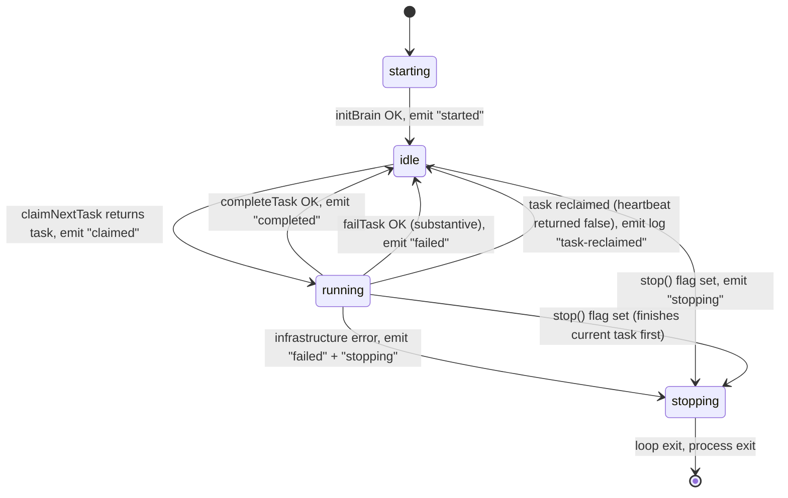
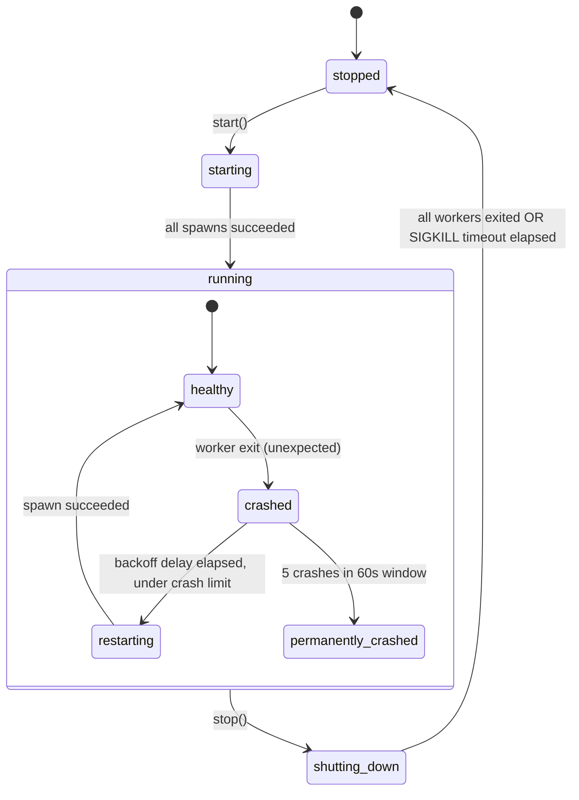

# ASL-0006 — Worker pool

## TL;DR

Build the **worker pool** for the ASL self-learning daemon as a pair of coupled files:

1. `src/services/self-learning-daemon/worker.ts` — the child-process entry point. Runs a single long-lived claim loop that claims tasks from the ASL-0003 task queue, dispatches by `task.taskType`, heartbeats while running, and reports completion/failure back via `completeTask` / `failTask` + JSON-line events on stdout.
2. `src/services/self-learning-daemon/pool.ts` — the parent-side pool manager. Spawns N worker child processes via `Bun.spawn`, line-parses their stdout JSON events, restarts crashed workers with exponential backoff + crash-limit, and drains the pool on shutdown with SIGTERM → timeout → SIGKILL.

**No daemon entry point.** ASL-0007 imports `pool.ts` and composes it with the file watcher. **No file-watcher integration.** **No CLI tool.** **No real consolidate/distill execution in tests** — handlers are mocked.

**Spawn API decision: `Bun.spawn`, NOT Node `child_process.spawn`.** See §Design decision: `Bun.spawn` vs `child_process.spawn` for full rationale. Short version: the research round explicitly recommended `Bun.spawn`; the two use cases (outer daemon detach-and-forget vs inner pool supervised-with-streaming-IPC) are different enough that consistency with `daemon.ts` is illusory; `Bun.spawn`'s `ReadableStream` stdout is cleaner for line-buffered JSON IPC; Bun is the runtime this project uses and idiomatic Bun APIs are preferred.

**Critical DI pattern:** both files are factories that accept injected functions (`handlers`, `claimFn`, `spawnFn`). Production wires real functions via the `import.meta.main` bootstrap in `worker.ts`. Tests pass mocks — NO test spawns a real child process except one integration smoke test.

---

## Context

Five dependencies already shipped for this slice:

- **ASL-0002** (`1f5fa1a`) — `tasks` and `agent_lifecycle` schema, indexes, `initBrain()` applies them on connect.
- **ASL-0003** (`d61f6fc`) — `src/libs/task-queue.ts` — `claimNextTask`, `heartbeatTask`, `completeTask`, `failTask`, `reclaimStaleTasks`, `enqueueTask`, `LEASE_DURATIONS_MS`.
- **ASL-0004** (`bab968c`) — `src/libs/agent-lifecycle.ts` — `recordConsolidated`, `recordDistilled`, `refreshInboxCount`, `refreshKnowledgeCount`, `refreshPendingTaskCount`, `isDistillStale`.
- **ASL-0005** (`55132c8`) — `src/libs/file-watcher.ts` — composes with the pool inside ASL-0007. Not imported here.
- **`src/servers/freddie-ai/daemon.ts`** — the existing MCP daemon lifecycle controller. ASL-0007 copies its `child_process.spawn + detached: true` pattern for the OUTER daemon lifecycle; **the inner worker pool (this task) does NOT copy it**. The outer daemon is launch-and-forget (detached, `child.unref()`, logs-to-file, no streaming IPC). The inner pool is supervised-with-streaming-IPC (attached, `Bun.spawn`, line-buffered JSON on stdout, SIGTERM on shutdown). These two patterns coexist in the codebase and are intentionally different.

**Read these before touching anything:**

1. `vault/studio/projects/autonomous-self-learning/BRIEF.md` §1 "Daemon service" and §1a "Daemon lifecycle management" (post-reversal — PM2 is INVALIDATED, copy `src/servers/freddie-ai/daemon.ts` pattern for the outer daemon in ASL-0007, this task is the inner worker pool).
2. `vault/studio/projects/autonomous-self-learning/research/2026-04-07-daemon-architecture-findings.md` §Q2 (child processes over `worker_threads`, **explicit recommendation of `Bun.spawn` for the inner pool**) and §Q3 (heartbeat semantics). §Q4 is invalidated — ignore PM2 entirely.
3. `src/servers/freddie-ai/daemon.ts` — ~120 lines. Read for the outer-daemon pattern that ASL-0007 will copy (detached spawn, unref, logs-to-file). The inner pool uses a different pattern — do NOT copy this file verbatim.
4. `src/libs/task-queue.ts` — the full file. Pay attention to the `LEASE_DURATIONS_MS` constants and the `FailTaskResult` shape.
5. `src/libs/agent-lifecycle.ts` — the lifecycle functions the worker calls.
6. `src/libs/autonomous-distill.ts` — note the `autonomousDistill(agents?, opts?)` signature (already exported!) and the private `DISTILL_AGENTS` constant.
7. `src/tools/consolidate-memory.ts` — note that `consolidateAgent` is NOT exported (only `toolDef`).
8. `src/libs/file-watcher.ts` — read it for style only. You are NOT importing from it.

**PM2 is INVALIDATED. No PM2. No `pm2-windows-startup`. No Task Scheduler references. No auto-restart-on-login mechanism.** If you find yourself thinking "process manager," stop and re-read BRIEF §1a.

---

## Investigation results

Both programmatic entry points were investigated before writing this spec. Neither is cleanly callable as-is. **Extraction is required.** Decision below.

### consolidate-memory.ts — NOT exported

`src/tools/consolidate-memory.ts`:

- Private function: `async function consolidateAgent(agent: string, reason: string, dryRun: boolean): Promise<string>` (line 164).
- Only export: `toolDef` (line 462), which wraps `consolidateAgent` inside a `ToolDefinition.execute` closure.
- CLI `--auto` mode (line 520) re-execs itself per agent via `execSync("bun <this file> --agent X --reason auto-consolidation")`. Process-per-agent shell hop. Not suitable for in-process use.
- Dependencies on import: `../libs/gemini.js`, `../libs/embeddings.js`, `../libs/paths.js`, `zod`, `../registry/types.js`. No heavy side effects on import — `generateText` and `embedBatch` are lazy.

### autonomous-distill.ts — EXPORTED but with gotchas

`src/libs/autonomous-distill.ts`:

- Exported: `async function autonomousDistill(agents?: string[], opts?: AutonomousDistillOptions): Promise<PipelineResult>` (line 377).
- Takes an array of agents. Can be called as `autonomousDistill([agent])` for single-agent runs.
- **Private constant: `DISTILL_AGENTS = ["tala", "rune", "sol", "echo", "penny"]`** (line 37).
- Line 384: `agents.filter(a => DISTILL_AGENTS.includes(a))`. Passing an agent NOT in this list **silently drops it** — returns an empty `PipelineResult.agents`, no error.
- **Gotcha:** `mccall`, `holmes`, `ryan`, `freddie`, `shared` are NOT in `DISTILL_AGENTS`. A worker that naively calls `autonomousDistill([task.agent])` for a non-distill-eligible agent will return a successful no-op, which is correct in outcome but hides a real signal: the daemon should never have enqueued the distill task in the first place. We need a way to detect "this agent is not distill-eligible" and fail fast with a clear error.

### Decision: Option (a) — Extract programmatic helpers as part of ASL-0006

Both extractions are small (<30 lines total). Neither crosses unfamiliar module boundaries. Both keep ASL-0006 focused instead of spawning a separate ASL-0006A task and blocking implementation on a second review cycle.

**Extraction 1: `src/tools/consolidate-memory.ts`**

Export `consolidateAgent` with a compatible signature. No refactor — just add `export` in front of the existing function declaration. The CLI `--auto` path keeps working because the re-exec is unchanged. The `toolDef` closure keeps working because it calls `consolidateAgent` in the same module.

**Before:**
```ts
async function consolidateAgent(agent: string, reason: string, dryRun: boolean): Promise<string> { ... }
```

**After:**
```ts
/**
 * Programmatic entry point for single-agent consolidation.
 *
 * Used by the ASL daemon worker (ASL-0006) to run consolidation in-process
 * without shelling out. Returns the human-readable summary string that the
 * CLI already produces (callers that need structured data should parse the
 * "=== CONSOLIDATION COMPLETE ===" JSON block at the end).
 *
 * @param agent    Agent name — must be in the AGENTS list or the function throws.
 * @param reason   Archive folder label. Worker passes "daemon-consolidation".
 * @param dryRun   If true, do not write or archive anything. Worker always passes false.
 */
export async function consolidateAgent(
  agent: string,
  reason: string,
  dryRun: boolean,
): Promise<string> { ... }
```

No other changes to `consolidate-memory.ts`. The existing tool tests and CLI behavior must remain identical.

**Extraction 2: `src/libs/autonomous-distill.ts`**

Two changes:

1. Export `DISTILL_AGENTS` as a `readonly` array.
2. Add a helper `isDistillEligible(agent: string): boolean`.

**Diff:**
```ts
// Before (line 37)
const DISTILL_AGENTS = ["tala", "rune", "sol", "echo", "penny"];

// After
export const DISTILL_AGENTS: readonly string[] = ["tala", "rune", "sol", "echo", "penny"] as const;

/**
 * Returns true iff the given agent is in the distill pipeline's target list.
 *
 * Used by the ASL daemon worker (ASL-0006) to fail-fast when a distill task
 * is enqueued for an agent that autonomousDistill would silently drop.
 * The daemon should never have enqueued such a task; seeing one is a bug
 * signal, not a no-op.
 */
export function isDistillEligible(agent: string): boolean {
  return DISTILL_AGENTS.includes(agent);
}
```

The inner `.filter(a => DISTILL_AGENTS.includes(a))` call keeps working because `readonly string[]` is assignable where `string[]` was used.

**No other changes to `autonomous-distill.ts`.** No refactor of the pipeline body. No signature change to `autonomousDistill`.

**Worker import paths (exact):**

```ts
import { consolidateAgent } from "../../tools/consolidate-memory.js";
import { autonomousDistill, isDistillEligible } from "../../libs/autonomous-distill.js";
```

(from `src/services/self-learning-daemon/worker.ts`)

---

## Architecture Diagram

```mermaid
flowchart TB
    subgraph ParentDaemonASL0007["Parent daemon (ASL-0007 — NOT this task)"]
      D[daemon main loop]
      FW[file-watcher.ts]
    end

    subgraph Pool["pool.ts — THIS TASK"]
      PM[WorkerPool manager]
      RS[restart / backoff FSM]
      SH[shutdown coordinator]
    end

    subgraph Worker1["worker.ts — THIS TASK (child 1)"]
      W1L[claim loop]
      W1H[heartbeat interval]
      W1D[dispatch by taskType]
      W1E[stdout JSON events]
    end

    subgraph Worker2["worker.ts — THIS TASK (child 2)"]
      W2L[claim loop]
      W2H[heartbeat interval]
      W2D[dispatch by taskType]
      W2E[stdout JSON events]
    end

    subgraph ExistingLibs["Existing libs (NOT modified)"]
      TQ[(task-queue.ts)]
      AL[(agent-lifecycle.ts)]
      CONS[consolidate-memory.ts<br/>consolidateAgent ← newly exported]
      DIST[autonomous-distill.ts<br/>autonomousDistill ← already exported<br/>isDistillEligible ← new]
    end

    D -->|.start pool| PM
    D -->|.stop pool| PM
    FW -.->|enqueues tasks| TQ

    PM -->|Bun.spawn| Worker1
    PM -->|Bun.spawn| Worker2
    PM <-->|SIGTERM on shutdown| Worker1
    PM <-->|SIGTERM on shutdown| Worker2

    W1E -->|parsed lines| PM
    W2E -->|parsed lines| PM

    W1L -->|claimNextTask| TQ
    W2L -->|claimNextTask| TQ
    W1H -->|heartbeatTask| TQ
    W2H -->|heartbeatTask| TQ
    W1L -->|completeTask / failTask| TQ
    W2L -->|completeTask / failTask| TQ

    W1D -->|consolidate handler| CONS
    W1D -->|distill handler| DIST
    W2D -->|consolidate handler| CONS
    W2D -->|distill handler| DIST

    W1D -->|recordConsolidated/Distilled| AL
    W1D -->|refreshInboxCount/KnowledgeCount/PendingTaskCount| AL
    W1D -->|isDistillStale → enqueueTask| TQ
    W2D -->|recordConsolidated/Distilled| AL
    W2D -->|refreshInboxCount/KnowledgeCount/PendingTaskCount| AL
    W2D -->|isDistillStale → enqueueTask| TQ
```



Legend:
- **Solid arrows** = runtime control/data flow.
- **Dashed arrows** = not this task (but wired in ASL-0007).
- Each worker is its OWN process with its OWN `initBrain()` SQLite connection. No shared DB handle.

---

## Goal

After this task ships:

1. `src/services/self-learning-daemon/` exists as a new directory (first module in `src/services/`).
2. `worker.ts` exports `createWorker(options)`, a factory that returns a `Worker` handle with `run()`, `stop()`, `getStatus()`. The factory is pure (DI-only) and has zero side effects outside `initBrain()` in production mode.
3. `worker.ts` has an `import.meta.main` bootstrap that parses `process.argv[2]` as the `workerId`, wires real production handlers (consolidate, distill, full-pipeline), and calls `run()`. This is the only non-DI code path in the file.
4. `pool.ts` exports `createWorkerPool(options)`, a factory that returns a `WorkerPool` handle with `start()`, `stop(timeoutMs?)`, `getStatus()`. Also DI-only (accepts `spawnFn`).
5. The worker claims tasks from the real `task-queue.ts` API and dispatches by `task.taskType`. Heartbeat runs at `task.leaseDurationMs / 2` ms intervals.
6. Consolidate tasks trigger a post-consolidate chain reaction: after `recordConsolidated` + refresh counts, worker calls `isDistillStale(agent)` and enqueues a `distill` task via `enqueueTask` if stale. The worker does NOT run distill inline.
7. Distill tasks call `autonomousDistill([agent])` IF `isDistillEligible(agent)` — otherwise fail fast with a clear error that gets bucketed as a substantive failure (`failTask`).
8. Full-pipeline tasks run consolidate then distill sequentially, but via the SAME handlers as the individual task types (not a separate code path).
9. The worker emits JSON-line events on stdout following the schema in §Worker IPC event schema. One event per line. Never split across writes.
10. SIGTERM triggers graceful shutdown: stop accepting new claims, drop heartbeat, emit `stopping` event, exit process. In-flight task is left claimed; stale-reclaim in task-queue handles recovery after lease expiry.
11. `pool.ts` spawns workers via `Bun.spawn` with attached stdio (`stdout: "pipe"`, `stderr: "pipe"`), consumes stdout as a `ReadableStream` via async iteration + line-buffered JSON parsing, dispatches to `onEvent` callback, restarts crashed workers with exponential backoff, enforces crash limit (5 in 60s → permanent `crashed`), and drains on shutdown.
12. Worker IDs are `worker-{index}-{randomSuffix}`, stable across restarts so heartbeat ownership is retained.
13. 15-25 tests across two test files cover: claim loop, dispatch, heartbeat lifecycle, error bucketing, SIGTERM path, pool restart backoff, pool crash limit, pool shutdown timing, line-buffered JSON parsing. All but one are fully mocked; one is an integration smoke test spawning a real worker with no-op handlers against a real SQLite DB (prefixed test rows).
14. No new npm dependencies. `Bun.spawn` is a Bun global (no import); Node stdlib (`crypto`, `path`, `os`, `fs`) is still used where appropriate.
15. The two extractions are shipped as part of this task's diff: `consolidateAgent` exported from `consolidate-memory.ts`, `DISTILL_AGENTS` + `isDistillEligible` exported from `autonomous-distill.ts`.

---

## Design decision: `Bun.spawn` vs `child_process.spawn`

I considered both. Short table:

| Dimension | `Bun.spawn` | Node `child_process.spawn` |
|-----------|-------------|----------------------------|
| Alignment with research recommendation | **Matches** — research §Q2 explicitly calls for `Bun.spawn` in the inner pool | Deviates from the research |
| Idiomatic for this project's runtime | Yes — Bun is the runtime; idiomatic APIs preferred | Node-ish; adds a parallel spawn API |
| Streaming stdout API | `proc.stdout` is a `ReadableStream<Uint8Array>` — `for await` + line buffer, clean | `child.stdout.on('data', Buffer)` event emitter — line buffer + event wiring |
| Exit handling | `proc.exited` is a Promise — `await proc.exited` / `proc.exited.then(code => ...)` | `child.on('exit', (code, signal) => ...)` event |
| SIGTERM handling | `proc.kill('SIGTERM')` — same OS syscall, same Windows caveats | `child.kill('SIGTERM')` — same OS syscall, same Windows caveats |
| Windows reliability (attached spawn + stdout streaming + SIGTERM) | Stable since Bun 1.1; project is on Bun 1.3.x | Battle-tested in Node |
| Consistency with `src/servers/freddie-ai/daemon.ts` (OUTER daemon, detached+unref+logs-to-file) | Different spawn API, but the outer and inner use cases are already different (detached launch-and-forget vs attached supervised streaming) — "consistency" is illusory | Matches the outer daemon's import, but the two use cases are not actually analogous |
| New-variables budget for this slice | One Bun-specific API surface — small, well-documented | Zero new APIs, but the IPC layer is chunkier |

**Decision: `Bun.spawn` — LOCKED.**

Rationale:

1. **The research round explicitly recommended `Bun.spawn`.** See `vault/studio/projects/autonomous-self-learning/research/2026-04-07-daemon-architecture-findings.md` §Q2 — the exact reversal text mentions `Bun.spawn()`. Deviating from the research requires a concrete reason; there isn't one.

2. **The two use cases (outer daemon vs inner pool) are genuinely different, so "consistency with daemon.ts" was an illusion.** `src/servers/freddie-ai/daemon.ts` uses `child_process.spawn` + `detached: true` + `child.unref()` + logs-to-file. Purpose: launch-and-forget. No streaming IPC. The inner pool needs attached spawn + streaming stdout as a `ReadableStream` + line-buffered JSON events + SIGTERM-on-shutdown. Purpose: supervised lifetime with IPC. These are different patterns already. Using the same import does not make them "consistent" — it just papers over the difference.

3. **The earlier "PM2 is invalidated" decision was about the OUTER process manager, not the INNER spawn API.** ASL-0007 (the outer daemon lifecycle) still copies `daemon.ts`'s `child_process.spawn + detached: true` pattern. This task (the inner pool) is a different layer. Both patterns coexist in the codebase.

4. **`Bun.spawn`'s `ReadableStream` stdout is cleaner for the line-buffered JSON IPC we need.** The idiomatic pattern is `for await (const chunk of proc.stdout)` inside an async IIFE, which gives you natural backpressure and a tight loop. The Node equivalent is `child.stdout.on('data', ...)` with an external remainder variable and hand-wired event handlers — the same logic spread across more surface area.

5. **Risk is bounded.** Bun.spawn has been stable on Windows since Bun 1.1; this project is on Bun 1.3.x. The `Bun.worker_threads` warnings (Bun issues #14332, #15964, #24405) are **specific to `Bun.worker_threads`, NOT `Bun.spawn`** — do not conflate the two. If Ryan discovers a concrete Windows edge case where `Bun.spawn` misbehaves for this exact combination (attached + stdout stream + SIGTERM), fall back to `child_process.spawn` is a documented, narrow-scope option — **but STOP and escalate with a `[TECH BLOCKER]` before silently switching**. Do not fall back quietly.

**Lock this decision.** Do NOT substitute `child_process.spawn` during implementation. If you discover a concrete reason `Bun.spawn` is broken for this use case on Windows, STOP and raise a `[TECH BLOCKER]` — do not unilaterally switch. The fallback exists but is escalation-gated.

---

## Detailed Specification

### Part 1 — Shared types file (optional — pick ONE location)

Both `worker.ts` and `pool.ts` need the `WorkerEvent` union type. Options:

- **Option A (recommended):** Define the type union in `worker.ts` and re-export from `pool.ts` via `export type { WorkerEvent } from "./worker.js"`. Worker owns the event vocabulary because it produces the events.
- **Option B:** Create `src/services/self-learning-daemon/types.ts` with the shared types. Overkill for one union.

**Lock Option A.** The event type lives in `worker.ts`.

### Part 2 — `worker.ts`

**File:** `src/services/self-learning-daemon/worker.ts` (NEW)

**Imports (exact):**
```ts
import { initBrain } from "../../libs/brain/index.js";
import {
  claimNextTask,
  heartbeatTask,
  completeTask,
  failTask,
  enqueueTask,
  LEASE_DURATIONS_MS,
  type Task,
  type TaskType,
} from "../../libs/task-queue.js";
import {
  recordConsolidated,
  recordDistilled,
  refreshInboxCount,
  refreshKnowledgeCount,
  refreshPendingTaskCount,
  isDistillStale,
} from "../../libs/agent-lifecycle.js";
import { consolidateAgent } from "../../tools/consolidate-memory.js";
import { autonomousDistill, isDistillEligible } from "../../libs/autonomous-distill.js";
```

**Public types:**

```ts
/** Discriminated union of events a worker emits on stdout. One event per line. */
export type WorkerEvent =
  | { type: "started"; workerId: string; pid: number; ts: string }
  | { type: "idle"; workerId: string; ts: string }
  | { type: "claimed"; workerId: string; taskId: number; taskType: TaskType; agent: string; ts: string }
  | { type: "heartbeat"; workerId: string; taskId: number; ts: string }
  | { type: "completed"; workerId: string; taskId: number; durationMs: number; ts: string }
  | { type: "failed"; workerId: string; taskId: number; error: string; retried: boolean; ts: string }
  | { type: "stopping"; workerId: string; ts: string }
  | { type: "log"; workerId: string; level: "info" | "warn" | "error"; message: string; ts: string };

/**
 * Handler map keyed by task type. Production wires real handlers via the
 * import.meta.main bootstrap; tests pass mocks.
 *
 * Each handler is an async function taking ONLY the agent name. The worker
 * does all the task-queue bookkeeping around the call.
 */
export interface WorkerHandlers {
  consolidate: (agent: string) => Promise<void>;
  distill: (agent: string) => Promise<void>;
  "full-pipeline": (agent: string) => Promise<void>;
}

export interface CreateWorkerOptions {
  /** Stable worker id. Pass from pool.ts; bootstrap parses from argv. */
  workerId: string;

  /** Task handlers. Production = real, tests = mocks. */
  handlers: WorkerHandlers;

  /** Polling interval when the queue is empty. Default 2000ms. */
  pollIntervalMs?: number;

  /** DI override for claim function. Defaults to real claimNextTask. */
  claimFn?: typeof claimNextTask;

  /** DI override for heartbeat function. Defaults to real heartbeatTask. */
  heartbeatFn?: typeof heartbeatTask;

  /** DI override for complete function. Defaults to real completeTask. */
  completeFn?: typeof completeTask;

  /** DI override for fail function. Defaults to real failTask. */
  failFn?: typeof failTask;

  /** DI override for emit (event writer). Defaults to writing JSON lines to process.stdout. */
  emitFn?: (event: WorkerEvent) => void;

  /**
   * DI override for the current-time function. Defaults to () => Date.now().
   * Tests inject a fake clock to assert event timestamps and heartbeat intervals
   * without real time passing.
   */
  nowFn?: () => number;

  /**
   * DI override for sleep. Defaults to (ms) => new Promise(r => setTimeout(r, ms)).
   * Tests inject an instant-resolve or deterministic scheduler.
   */
  sleepFn?: (ms: number) => Promise<void>;
}

export interface Worker {
  /** Enter the claim loop. Returns when stop() is called and the current task resolves. */
  run(): Promise<void>;

  /** Request graceful shutdown. Idempotent. */
  stop(): void;

  /** Observability snapshot. */
  getStatus(): WorkerStatus;
}

export interface WorkerStatus {
  workerId: string;
  state: "starting" | "idle" | "running" | "stopping" | "stopped";
  currentTaskId: number | null;
  claimedAt: string | null;
  lastHeartbeatAt: string | null;
  completedCount: number;
  failedCount: number;
}
```

**Factory contract — `createWorker`:**

```ts
export function createWorker(options: CreateWorkerOptions): Worker;
```

Semantics:

- **On creation:** compute resolved defaults for every optional DI slot. Emit NOTHING. No side effects.
- **On `run()`:**
  1. Emit `{ type: "started", workerId, pid: process.pid, ts }`.
  2. Enter infinite loop (bounded by `stopRequested` flag):
     - If `stopRequested` → break.
     - Call `claimFn(workerId)`. Wrap in try/catch.
     - On claim exception: emit `{ type: "log", level: "error", message: "claim-failed: <err>" }`. Sleep `pollIntervalMs`. Continue. Do NOT crash the worker on a transient claim error — the DB might be briefly locked.
     - On claim result `null`: emit `{ type: "idle", ... }` once per idle transition (not every poll). Sleep `pollIntervalMs`. Continue.
     - On claim result `task`: set status state to `running`, emit `{ type: "claimed", ... }`, set `currentTaskId`, run task via `runTask(task)` (see below).
  3. After loop exits: emit `{ type: "stopping", ... }`. State → `stopped`. Resolve.
- **On `stop()`:** set `stopRequested = true`. Does NOT cancel an in-flight task. The current task runs to completion (or throws and is reported), then the loop exits cleanly.

**`runTask(task)` inner function contract (private to factory closure):**

1. Compute `heartbeatIntervalMs = Math.max(1000, Math.floor(task.leaseDurationMs / 2))`. Clamp the minimum to 1000ms to avoid pathological fast heartbeats on misconfigured leases.
2. Start a setInterval that calls `heartbeatFn(task.id, workerId)`. On `false` return: the task was reclaimed by another worker. Stop the interval and the task execution path (throw an internal `TaskReclaimedError`). Worker does NOT call `failTask` or `completeTask` — it no longer owns the task. Emit `{ type: "log", level: "warn", message: "task-reclaimed" }` and continue the outer loop.
3. Record `startNow = nowFn()`.
4. Dispatch by `task.taskType`:
   - `"consolidate"` → `await handlers.consolidate(task.agent)`.
   - `"distill"` → if `!isDistillEligible(task.agent)` throw `new Error(`distill-not-eligible: agent=${task.agent}`)`. Otherwise `await handlers.distill(task.agent)`.
   - `"full-pipeline"` → `await handlers["full-pipeline"](task.agent)`.
   - Default (unknown task type): throw `new Error(`unknown-task-type: ${task.taskType}`)`. Bucketed as substantive failure.
5. On handler resolve:
   - Clear heartbeat interval.
   - `durationMs = nowFn() - startNow`.
   - Call `completeFn(task.id, workerId, durationMs)`. Ignore the boolean return — if it's false, the task was already reclaimed; the completion is a no-op and no event is emitted for the rework.
   - Emit `{ type: "completed", taskId: task.id, durationMs, ... }`.
   - Increment `completedCount`.
6. On handler reject:
   - Clear heartbeat interval.
   - Classify the error:
     - **Infrastructure failure** (DB-related): error message matches `/SQLITE|database/i` OR `isDbErrored()` flag set (see below). Worker does NOT call `failTask` — the DB handle is suspect. Instead: emit `{ type: "log", level: "error", message: "infra-failure: <err>" }`, emit `{ type: "failed", ..., retried: false, error: "infrastructure" }` for IPC clarity, set state → `stopping`. Break out of the claim loop. The stale-reclaim path in task-queue will recover the task after lease expiry.
     - **Substantive failure** (everything else, including `TaskReclaimedError` is handled separately above): call `failFn(task.id, workerId, err.message.slice(0, 2000))`. Read the returned `FailTaskResult`. Emit `{ type: "failed", ..., retried: result.retried, error: err.message.slice(0, 500) }`. Increment `failedCount`. Continue the claim loop.
7. Either way, clear `currentTaskId`, transition state back to `idle`.

**Post-consolidate chain reaction (inside the production `consolidate` handler, NOT inside `runTask`):**

The chain reaction belongs to the **production handler**, not to the runTask dispatch loop. This keeps the runTask logic pure (dispatch + bookkeeping) and lets tests exercise the chain reaction via a spy on the injected handler.

Production handler:

```ts
async function productionConsolidateHandler(agent: string): Promise<void> {
  // 1. Run consolidate. Throws on error — runTask will failTask.
  await consolidateAgent(agent, "daemon-consolidation", false);

  // 2. Record lifecycle AFTER the work is done. Each of these can throw if
  //    the DB is wedged; runTask classifies those as infra failures.
  recordConsolidated(agent);
  refreshInboxCount(agent);
  refreshKnowledgeCount(agent);
  refreshPendingTaskCount(agent);

  // 3. Chain reaction: if distill is now stale AND the agent is distill-eligible,
  //    enqueue a new task. Do NOT run distill inline — let the queue pick it up
  //    on the next claim cycle. Preserves bounded task lock duration.
  if (isDistillEligible(agent)) {
    const staleness = isDistillStale(agent);
    if (staleness.stale) {
      enqueueTask({
        agent,
        taskType: "distill",
        triggerReason: "schedule",  // "post-consolidate" is a subcategory of schedule in the current vocabulary
        payload: { reason: "post-consolidate-stale", currentHash: staleness.currentHash },
      });
    }
  }
}
```

Production distill handler:

```ts
async function productionDistillHandler(agent: string): Promise<void> {
  // runTask already guards isDistillEligible — but defense in depth. A
  // non-eligible agent that slipped past the guard gets a clear error.
  if (!isDistillEligible(agent)) {
    throw new Error(`distill-handler-not-eligible: agent=${agent}`);
  }

  // autonomousDistill returns normally on completion. Per-agent errors inside
  // the pipeline are already caught by autonomousDistill and recorded in the
  // AgentDistillResult — a thrown error here means the pipeline wrapper itself
  // failed (judge health, distill-soul import, etc.), not a per-proposal failure.
  await autonomousDistill([agent]);

  // Record lifecycle. recordDistilled computes and stores the staleness hash
  // plus soul hash — no extra refresh calls needed.
  recordDistilled(agent, undefined, "task-queue");
  refreshPendingTaskCount(agent);
}
```

Production full-pipeline handler:

```ts
async function productionFullPipelineHandler(agent: string): Promise<void> {
  await productionConsolidateHandler(agent);
  // After consolidate, the chain reaction may have enqueued a distill task.
  // But full-pipeline is supposed to RUN the distill inline, not enqueue it.
  // So we explicitly call the distill handler here IF eligible.
  if (isDistillEligible(agent)) {
    await productionDistillHandler(agent);
  }
}
```

**Note on the full-pipeline chain-reaction interaction:** production consolidate handler enqueues a distill task if stale. Full-pipeline then runs distill inline. After distill, there's no stale condition left, so if the chain-reacted task is later claimed by another worker, it will see `isDistillStale === false` on its own check... except consolidate handler already enqueued it BEFORE distill ran. This is a race. Acceptable race: the duplicate distill task, when claimed, will find `isDistillStale === false` because `recordDistilled` already ran. Mitigation: **the distill handler itself should early-return if `isDistillStale(agent).stale === false`**.

Add this to `productionDistillHandler`:

```ts
async function productionDistillHandler(agent: string): Promise<void> {
  if (!isDistillEligible(agent)) {
    throw new Error(`distill-handler-not-eligible: agent=${agent}`);
  }

  // Idempotency guard: if knowledge hash matches the last distilled hash,
  // this is a duplicate task from the chain reaction racing with a full
  // pipeline (or a manual re-enqueue). Log and skip. The task will be
  // marked completed, which is correct — the work IS already done.
  const staleness = isDistillStale(agent);
  if (!staleness.stale) {
    // Emit a log event via the handler's env. But handlers don't have access
    // to emitFn directly — they signal via return. Log via console.error
    // which will be captured by the parent's stderr stream but not parsed
    // as a JSON event. Acceptable.
    console.error(`[worker] distill skipped — already current: agent=${agent}`);
    return;
  }

  await autonomousDistill([agent]);
  recordDistilled(agent, undefined, "task-queue");
  refreshPendingTaskCount(agent);
}
```

**DB error classification helper:**

```ts
function isInfrastructureError(err: unknown): boolean {
  if (!(err instanceof Error)) return false;
  const msg = err.message.toLowerCase();
  return (
    msg.includes("sqlite") ||
    msg.includes("database is locked") ||
    msg.includes("database disk image") ||
    msg.includes("no such table") ||
    msg.includes("disk i/o error") ||
    msg.includes("econnrefused") ||  // defensive, in case Gemini handler bubbles net errors
    msg.includes("gemini") && msg.includes("timeout")  // api infra, not user content
  );
}
```

**Override policy:** `isInfrastructureError` is conservative. When in doubt, classify as substantive — a retry via `failTask` is cheap, but crashing the worker on every Gemini timeout is catastrophic. Only classify as infra if the DB itself is suspect (`sqlite`, `database`, `disk i/o`).

**SIGTERM handling (production mode, not factory):**

Inside the `import.meta.main` bootstrap:

```ts
if (import.meta.main) {
  const workerId = process.argv[2];
  if (!workerId) {
    console.error("worker.ts: missing workerId argument");
    process.exit(2);
  }

  initBrain();

  const worker = createWorker({
    workerId,
    handlers: {
      consolidate: productionConsolidateHandler,
      distill: productionDistillHandler,
      "full-pipeline": productionFullPipelineHandler,
    },
  });

  process.on("SIGTERM", () => {
    // Per BRIEF: drop heartbeat is NOT something we do externally — stop()
    // flips the flag, the current task either finishes normally (emit completed)
    // or the heartbeat interval keeps firing until the task finishes (or the
    // process is killed by SIGKILL after pool timeout).
    //
    // Simpler design: stop() flips stopRequested. The claim loop will exit
    // after the current task finishes. The stale-reclaim path handles the
    // case where we get SIGKILL'd mid-task.
    worker.stop();
  });

  // On Windows, SIGINT is the fallback (no SIGTERM). Accept both.
  process.on("SIGINT", () => worker.stop());

  await worker.run();
  process.exit(0);
}
```

**The SIGTERM decision codified:** per BRIEF's guidance, we do NOT race shutdown against an in-flight `failTask` UPDATE. `stop()` flips a flag. The current task finishes. The loop exits. The process exits. If the pool's shutdown timeout elapses before the current task finishes, the pool sends SIGKILL. The SIGKILL'd task has no `failTask` call; stale-reclaim handles it after lease expiry.

### Part 3 — `pool.ts`

**File:** `src/services/self-learning-daemon/pool.ts` (NEW)

**Imports (exact):**
```ts
// Bun.spawn is a Bun global — no import needed.
// Type for Bun subprocess comes from @types/bun (already in devDependencies).
import { randomBytes } from "crypto";
import { fromRoot } from "../../libs/paths.js";
import type { WorkerEvent } from "./worker.js";

export type { WorkerEvent };  // re-export for daemon consumers

// Local alias for the Bun subprocess type returned by Bun.spawn. Using
// `ReturnType<typeof Bun.spawn>` keeps us decoupled from Bun's internal
// type export names and works across minor Bun versions.
type BunSubprocess = ReturnType<typeof Bun.spawn>;
```

**Public types:**

```ts
export interface WorkerPoolOptions {
  /** Number of worker child processes. Default 2. */
  poolSize?: number;

  /**
   * Absolute path to the worker entry script. Production wiring passes
   * fromRoot("src", "services", "self-learning-daemon", "worker.ts").
   * Tests pass a fixture path or a mocked spawn.
   */
  workerScriptPath: string;

  /**
   * Event callback. Called for every worker event AND for pool-level events
   * (worker-spawned, worker-crashed, worker-restart-scheduled, pool-stopped).
   * Errors in onEvent are caught and swallowed — the pool never crashes due
   * to callback misbehavior.
   */
  onEvent?: (event: WorkerEvent | PoolEvent) => void;

  /**
   * DI override for the spawn function. Defaults to Bun.spawn.
   * Test passes a mock to avoid spawning real processes.
   * The mock must return an object structurally compatible with
   * `ReturnType<typeof Bun.spawn>`: `{ pid, stdout, stderr, exited, kill, signalCode }`.
   */
  spawnFn?: typeof Bun.spawn;

  /**
   * DI override for setTimeout. Defaults to global setTimeout. Tests pass
   * a fake-timer implementation to test exponential backoff without waiting.
   */
  setTimeoutFn?: typeof setTimeout;

  /** DI override for clearTimeout. Defaults to global clearTimeout. */
  clearTimeoutFn?: typeof clearTimeout;

  /** DI override for Date.now. Defaults to () => Date.now(). */
  nowFn?: () => number;
}

/**
 * Pool-level events — distinct from WorkerEvent. The onEvent callback
 * receives both unions; consumers can discriminate on `type`.
 */
export type PoolEvent =
  | { type: "pool-started"; poolSize: number; ts: string }
  | { type: "pool-stopped"; ts: string }
  | { type: "worker-spawned"; workerId: string; pid: number; ts: string }
  | { type: "worker-crashed"; workerId: string; exitCode: number | null; signal: string | null; restartIn: number | null; ts: string }
  | { type: "worker-permanently-crashed"; workerId: string; crashCount: number; ts: string }
  | { type: "worker-restart-scheduled"; workerId: string; delayMs: number; ts: string };

export interface WorkerPool {
  start(): Promise<void>;
  stop(timeoutMs?: number): Promise<void>;
  getStatus(): WorkerPoolStatus;
}

export interface WorkerPoolStatus {
  running: boolean;
  workers: Array<{
    workerId: string;
    pid: number | null;
    state: "starting" | "idle" | "running" | "crashed" | "stopped" | "permanently-crashed";
    currentTaskId: number | null;
    restartCount: number;
    lastEventAt: string | null;
  }>;
}

export function createWorkerPool(options: WorkerPoolOptions): WorkerPool;
```

**Constants:**

```ts
const DEFAULT_POOL_SIZE = 2;
const DEFAULT_SHUTDOWN_TIMEOUT_MS = 30_000;

// Exponential backoff ladder for worker restart. Capped at 16s.
const RESTART_BACKOFF_LADDER_MS = [1_000, 2_000, 4_000, 8_000, 16_000];

// Reset backoff + crash count after a worker has run this long without crashing.
const HEALTH_RESET_THRESHOLD_MS = 60_000;

// Permanent crash limit: N crashes in this window → permanently-crashed.
const CRASH_LIMIT_COUNT = 5;
const CRASH_LIMIT_WINDOW_MS = 60_000;
```

**Internal state per worker slot:**

```ts
interface WorkerSlotState {
  workerId: string;
  index: number;                            // 0..poolSize-1
  child: BunSubprocess | null;
  pid: number | null;
  state: "starting" | "idle" | "running" | "crashed" | "stopped" | "permanently-crashed";
  currentTaskId: number | null;
  spawnedAt: number | null;                 // ms epoch
  lastEventAt: string | null;
  restartCount: number;
  crashTimestamps: number[];                // sliding window for CRASH_LIMIT_WINDOW_MS
  backoffIndex: number;                     // 0..RESTART_BACKOFF_LADDER_MS.length-1
  pendingRestartTimer: ReturnType<typeof setTimeout> | null;
  stdoutBuffer: string;                     // line-parse remainder
  stderrBuffer: string;
  // Abort controller for the async iteration loops reading stdout/stderr.
  // Needed so stop() can cancel the for-await without waiting for the child
  // to close its streams naturally.
  streamAbort: AbortController | null;
}
```

**Semantics — `start()`:**

1. If `running === true`, return immediately (idempotent).
2. Set `running = true`.
3. For `i` in `0..poolSize-1`: create a `WorkerSlotState` with a fresh `workerId = "worker-${i}-${randomBytes(3).toString('hex')}"`, state `"starting"`, and spawn it (see §spawnWorker).
4. Emit `{ type: "pool-started", poolSize, ts }`.
5. Resolve.

**Semantics — `spawnWorker(slot)` (private):**

1. Build spawn options (Bun.spawn options object):
   ```ts
   const spawnOptions = {
     cwd: fromRoot(),       // absolute path to project root
     stdin: "ignore" as const,
     stdout: "pipe" as const,
     stderr: "pipe" as const,
     env: { ...process.env },
     // windowsHide is not a Bun.spawn option — Bun already hides console on Windows
     // for spawned processes by default. No flag required.
   };
   ```
2. Call `spawnFn(["bun", workerScriptPath, slot.workerId], spawnOptions)`. Note: `Bun.spawn` takes the command array as the first positional arg, NOT as `(cmd, args)` like `child_process.spawn`. The command array is `["bun", workerScriptPath, slot.workerId]`.
3. Store `child`, `pid = child.pid`, `spawnedAt`.
4. Create an `AbortController` for this slot's stream loops and store in `slot.streamAbort`.
5. Kick off two async IIFEs that consume `child.stdout` and `child.stderr` via `for await`. See §Line-buffered stdout parsing for the exact body. Both IIFEs honour `slot.streamAbort.signal` so `stop()` can cancel them.
6. Hook exit handling: `child.exited.then(exitCode => handleExit(slot, exitCode, child.signalCode ?? null))`. `child.exited` is a Promise that resolves with the process exit code; the signal (if any) is read from `child.signalCode` at resolution time.
7. Emit `{ type: "worker-spawned", workerId: slot.workerId, pid: slot.pid, ts }`.

**Synchronous spawn failure:** `Bun.spawn` throws synchronously if the command cannot start (e.g., `bun` binary not found, invalid cwd). Wrap step 2 in try/catch. On throw, invoke `handleSpawnError(slot, err)` which treats it identically to an unexpected exit (schedule restart with backoff, respect crash limit).

**Line-buffered stdout parsing (async-iteration pattern, per slot):**

```ts
async function consumeStdout(slot: WorkerSlotState): Promise<void> {
  const decoder = new TextDecoder();
  try {
    // Bun.spawn's proc.stdout is a ReadableStream<Uint8Array> when stdout: "pipe".
    for await (const chunk of slot.child!.stdout as ReadableStream<Uint8Array>) {
      if (slot.streamAbort?.signal.aborted) break;
      slot.stdoutBuffer += decoder.decode(chunk, { stream: true });
      const lines = slot.stdoutBuffer.split("\n");
      // Last element is the remainder (possibly empty) — MUST preserve across iterations.
      slot.stdoutBuffer = lines.pop() ?? "";

      for (const line of lines) {
        const trimmed = line.trim();
        if (!trimmed) continue;
        handleStdoutLine(slot, trimmed);
      }
    }
    // Flush trailing decoder state.
    slot.stdoutBuffer += decoder.decode();
    if (slot.stdoutBuffer.trim()) {
      handleStdoutLine(slot, slot.stdoutBuffer.trim());
      slot.stdoutBuffer = "";
    }
  } catch (err) {
    // Stream errored (e.g., child was killed). Exit handler will take over.
    // Swallow — do not rethrow from the IIFE.
  }
}

function handleStdoutLine(slot: WorkerSlotState, trimmed: string): void {
  let event: WorkerEvent;
  try {
    event = JSON.parse(trimmed) as WorkerEvent;
  } catch {
    // Non-JSON line — likely a production handler's console.error.
    // Wrap as a log event so the daemon's onEvent sees it uniformly.
    safeEmit({
      type: "log",
      workerId: slot.workerId,
      level: "info",
      message: `[non-json] ${trimmed.slice(0, 500)}`,
      ts: new Date().toISOString(),
    });
    return;
  }

  // Mirror event state into slot for getStatus.
  if (event.type === "claimed") {
    slot.state = "running";
    slot.currentTaskId = event.taskId;
  } else if (event.type === "completed" || event.type === "failed") {
    slot.state = "idle";
    slot.currentTaskId = null;
  } else if (event.type === "idle") {
    slot.state = "idle";
  } else if (event.type === "stopping") {
    slot.state = "stopped";
  } else if (event.type === "started") {
    slot.state = "idle";
  }
  slot.lastEventAt = event.ts;
  safeEmit(event);
}
```

A mirrored `consumeStderr(slot)` IIFE follows the same pattern but wraps every non-empty line as `{ type: "log", level: "error", message: "[stderr] <line>", ... }` and emits it via `safeEmit`.

**Important:** launch `consumeStdout(slot)` and `consumeStderr(slot)` WITHOUT awaiting them (fire-and-forget async IIFEs). They run for the lifetime of the child. Do NOT block `spawnWorker` on them.

**Exit handling (`handleExit`):**

```ts
function handleExit(slot: WorkerSlotState, code: number | null, signal: string | null): void {
  // Abort any still-running stream loops so they exit promptly.
  slot.streamAbort?.abort();
  slot.streamAbort = null;

  // Flush any remaining stdout buffer — there may be a final event without a trailing newline
  // that the async-iteration loop hasn't reached yet because the stream closed between chunks.
  if (slot.stdoutBuffer.trim()) {
    handleStdoutLine(slot, slot.stdoutBuffer.trim());
    slot.stdoutBuffer = "";
  }

  slot.child = null;
  slot.pid = null;

  // If the pool is stopping, this exit is expected. Mark stopped, do NOT restart.
  if (stopping) {
    slot.state = "stopped";
    return;
  }

  // Unexpected exit → crash.
  const now = nowFn();
  const wasHealthy = slot.spawnedAt !== null && (now - slot.spawnedAt) >= HEALTH_RESET_THRESHOLD_MS;

  if (wasHealthy) {
    // Reset backoff and crash window — the previous run was long enough to call it healthy.
    slot.backoffIndex = 0;
    slot.crashTimestamps = [];
  }

  slot.crashTimestamps.push(now);
  // Drop crash timestamps older than the window.
  slot.crashTimestamps = slot.crashTimestamps.filter(t => now - t <= CRASH_LIMIT_WINDOW_MS);

  if (slot.crashTimestamps.length >= CRASH_LIMIT_COUNT) {
    slot.state = "permanently-crashed";
    safeEmit({
      type: "worker-permanently-crashed",
      workerId: slot.workerId,
      crashCount: slot.crashTimestamps.length,
      ts: new Date().toISOString(),
    });
    return;
  }

  // Schedule restart with exponential backoff.
  const delayMs = RESTART_BACKOFF_LADDER_MS[
    Math.min(slot.backoffIndex, RESTART_BACKOFF_LADDER_MS.length - 1)
  ];
  slot.backoffIndex += 1;
  slot.state = "crashed";

  safeEmit({
    type: "worker-crashed",
    workerId: slot.workerId,
    exitCode: code,
    signal,
    restartIn: delayMs,
    ts: new Date().toISOString(),
  });

  safeEmit({
    type: "worker-restart-scheduled",
    workerId: slot.workerId,
    delayMs,
    ts: new Date().toISOString(),
  });

  slot.pendingRestartTimer = setTimeoutFn(() => {
    slot.pendingRestartTimer = null;
    if (stopping) return;  // double-check in case stop() was called during the delay
    slot.restartCount += 1;
    slot.state = "starting";
    spawnWorker(slot);
  }, delayMs);
}
```

**Semantics — `stop(timeoutMs = 30000)`:**

1. If `!running` return.
2. Set `stopping = true`.
3. For every slot with a pending restart timer: `clearTimeoutFn(timer)`.
4. For every slot with a live child:
   - Send SIGTERM via `child.kill("SIGTERM")`. `Bun.spawn`'s `proc.kill` accepts a signal string and calls the same OS syscall `child_process` would. On Unix the worker gets a clean SIGTERM. On Windows it translates to `TerminateProcess` — see Windows note below.
5. Wait up to `timeoutMs` for every child to exit. Use `Promise.race([Promise.all(slots.map(s => s.child?.exited)), timeoutPromise(timeoutMs)])`. `proc.exited` is the Promise returned by `Bun.spawn`; awaiting it resolves when the OS reports the exit. The `handleExit` callbacks (wired via `.then` in `spawnWorker`) fire during shutdown — because `stopping === true`, they mark slots as `stopped` and do NOT schedule restarts.
6. For any child still alive after timeout: `child.kill("SIGKILL")`.
7. Wait briefly (1s) for SIGKILL'd children to exit.
8. Set `running = false`, emit `{ type: "pool-stopped", ts }`.

**Windows note on `child.kill("SIGTERM")`:** Neither Node's `child_process` nor Bun's `Bun.spawn` can deliver a real SIGTERM on Windows — Windows doesn't have POSIX signals. Both runtimes translate `SIGTERM` to `TerminateProcess`, which is functionally equivalent to SIGKILL: the worker gets no chance to handle SIGTERM gracefully. This is acceptable because:
- Stale-reclaim handles in-flight task recovery (BRIEF-locked).
- The outer `src/servers/freddie-ai/daemon.ts` pattern also uses `taskkill /F /T` which is the same story.
- We do NOT need worker-side graceful shutdown for correctness, only for cleaner logs.

If cleaner shutdown logs are important later, we can add a "shutdown message" via stdin before kill. NOT in this slice.

**Semantics — `getStatus()`:**

Return a snapshot of each slot: `{ workerId, pid, state, currentTaskId, restartCount, lastEventAt }`. Pure read, no side effects.

### Part 4 — Worker IPC event schema (authoritative)

One JSON object per line on `stdout`. Lines terminated with `\n`. No multi-line objects. No interleaved text. If the worker needs to log free-form text (e.g., the distill skip inside the production handler), it writes to `stderr`, which the pool captures separately and wraps as a `{ type: "log", level: "error" }` event (stderr lines are always classified as `error` level; stdout non-JSON lines are classified as `info`).

**Event types (exhaustive — this list is the contract):**

```ts
// 1. Worker started — first event after initBrain and before claim loop
{ "type": "started", "workerId": "worker-0-a3b2c1", "pid": 12345, "ts": "2026-04-08T00:00:00.000Z" }

// 2. Worker is waiting (queue empty) — emitted ONCE per idle transition, not per poll
{ "type": "idle", "workerId": "worker-0-a3b2c1", "ts": "..." }

// 3. Worker claimed a task
{ "type": "claimed", "workerId": "worker-0-a3b2c1", "taskId": 42, "taskType": "consolidate", "agent": "tala", "ts": "..." }

// 4. Heartbeat sent (optional — can be noisy; emit only if DEBUG flag set)
{ "type": "heartbeat", "workerId": "worker-0-a3b2c1", "taskId": 42, "ts": "..." }

// 5. Task completed successfully
{ "type": "completed", "workerId": "worker-0-a3b2c1", "taskId": 42, "durationMs": 4523, "ts": "..." }

// 6. Task failed (substantive or infra)
{ "type": "failed", "workerId": "worker-0-a3b2c1", "taskId": 42, "error": "short error", "retried": true, "ts": "..." }

// 7. Worker is shutting down
{ "type": "stopping", "workerId": "worker-0-a3b2c1", "ts": "..." }

// 8. Free-form log (used for non-fatal warnings: reclaimed, non-JSON passthrough, etc.)
{ "type": "log", "workerId": "worker-0-a3b2c1", "level": "info", "message": "task-reclaimed", "ts": "..." }
```

**Heartbeat event policy:** emit `heartbeat` events only if `process.env.ASL_WORKER_DEBUG === "1"`. Otherwise suppress — they're noisy and don't add observability value. The heartbeat still FIRES (the `heartbeatTask` call still happens every `leaseDurationMs / 2`), the emit is just gated.

### Part 5 — Worker state machine



### Part 6 — Pool state machine + restart backoff



**Restart backoff ladder:** 1s, 2s, 4s, 8s, 16s (cap). Index increments on each crash within the 60s window. Reset to 0 if the worker runs >60s without crashing.

**Crash limit:** 5 crashes in any 60s window → worker enters `permanently-crashed`, does NOT respawn for the rest of the pool's lifetime. The pool continues operating with the surviving workers. If ALL workers are permanently crashed, the pool keeps `running: true` but `getStatus()` shows zero healthy slots — the daemon (ASL-0007) is responsible for alerting on this.

### Part 7 — Testing strategy

**`worker.test.ts` — unit tests, fully mocked:**

All tests use `createWorker({ ... })` with DI. Never call `import.meta.main`. Never spawn a real child.

Tests should cover the following scenarios (minimum 12):

1. `run()` emits `started` as first event.
2. `run()` emits `idle` when `claimFn` returns null, sleeps for `pollIntervalMs`, retries.
3. `idle` is emitted ONCE per idle transition, not per poll cycle.
4. `run()` dispatches to the correct handler based on `task.taskType`.
5. `consolidate` task: handler resolves → `completeFn` called with correct args → `completed` event emitted with `durationMs` from `nowFn`.
6. `distill` task for non-eligible agent: `failFn` called with `distill-not-eligible` error → `failed` event emitted.
7. `full-pipeline` task: handler is dispatched correctly.
8. Handler throws substantive error → `failFn` called → `failed` event with `retried: result.retried`.
9. Handler throws infrastructure error (message matches `/sqlite/i`) → `failFn` NOT called → `stopping` event emitted → loop exits.
10. Heartbeat interval fires at `leaseDurationMs / 2` (use fake `sleepFn`/`nowFn` to assert the call count without real time).
11. `heartbeatFn` returns false → task reclaimed → log event emitted → loop continues, does NOT call `failFn` or `completeFn`.
12. `stop()` during idle → loop exits cleanly, emits `stopping`.
13. `stop()` during running task → current task finishes, THEN loop exits.
14. Unknown `task.taskType` → substantive failure via `failFn`.
15. `claimFn` throws → log error event emitted → sleep → retry (does not crash worker).

**`pool.test.ts` — unit tests with mock `spawnFn`:**

Mock `spawnFn` must match the `Bun.spawn` signature: it is called as `spawnFn(cmd: string[], opts: Parameters<typeof Bun.spawn>[1])` and must return an object structurally compatible with `ReturnType<typeof Bun.spawn>` — specifically:

- `pid: number`
- `stdout: ReadableStream<Uint8Array>` — the test helper builds one via `new ReadableStream({ start(controller) { ... } })` and exposes a `push(chunk)` method so tests can inject stdout events one chunk at a time.
- `stderr: ReadableStream<Uint8Array>` — same pattern.
- `exited: Promise<number>` — a deferred promise the test can resolve to simulate exit.
- `signalCode: string | null` — settable before resolving `exited` to simulate signal-based termination.
- `kill(signal?: string): void` — a spy that records kill invocations and (in most tests) resolves `exited` with a synthetic code to simulate the child obeying the signal.

A small `createMockBunSubprocess()` factory in the test file returns `{ proc, push, pushStderr, simulateExit(code, signal?) }` so each test can drive the fake worker deterministically. The mock `spawnFn` wraps this factory: `const spawnFn = (cmd, opts) => createMockBunSubprocess().proc`.

Tests should cover (minimum 10):

1. `start()` spawns `poolSize` workers, each with unique `workerId`.
2. Worker IDs match the pattern `worker-{index}-{hex}`.
3. Line-buffered stdout parsing: multiple events in one chunk → each parsed separately.
4. Split chunk: `{"type":"st` + `arted",...}` → parsed correctly when second chunk arrives.
5. Non-JSON stdout line → wrapped as `{ type: "log", ... }` event, not thrown.
6. Worker exit → crash handler schedules restart after 1s (first crash, index 0 of backoff ladder).
7. Second crash within 60s → restart after 2s (backoff index 1).
8. Five crashes in 60s → worker enters `permanently-crashed`, does NOT respawn.
9. Long-lived worker (runs >60s) → crash resets backoff index to 0.
10. `stop()` sends SIGTERM to all children (mock `kill` spy records `'SIGTERM'`), waits for `exited` to resolve, transitions to `stopped`.
11. `stop()` with timeout: mock `exited` Promise never resolves within timeout → pool calls `kill("SIGKILL")`.
12. `getStatus()` reflects mirrored state from stdout events (claimed → running, completed → idle, etc.).
13. `onEvent` throwing does NOT crash the pool (the wrap-in-try/catch).
14. During shutdown, crashed workers are NOT restarted (stopping flag guard).
15. Synchronous `spawnFn` throw (simulate `Bun.spawn` throwing when `bun` binary is missing): `handleSpawnError` schedules a restart with backoff, just like an async crash.

**Integration smoke test — ONE test in `worker.test.ts` OR its own file:**

Spawn a real worker via `Bun.spawn(["bun", workerScriptPath, workerId], { stdout: "pipe", stderr: "pipe", stdin: "ignore" })` with:
- A no-op dispatch: use a **second, test-only entry** script that imports `createWorker` and wires mock handlers that resolve instantly. File: `src/services/self-learning-daemon/__tests__/fixtures/noop-worker.ts`.
- A real task enqueued into the test DB before the worker starts. Use the `__asl_0006_test__` agent prefix for DB cleanup.

Verify:
1. Task row transitions pending → claimed → completed in the DB.
2. Worker emits events in order: started → claimed → completed → (idle or stopping on timeout). The test consumes `proc.stdout` via the same `for await` + line-buffer pattern as the pool.
3. The test sends SIGTERM to the worker process after seeing `completed` (`proc.kill("SIGTERM")`). Worker exits cleanly (`await proc.exited`).
4. Cleanup removes all `__asl_0006_test__*` rows from tasks and agent_lifecycle.

**DB cleanup contract (mandatory for ALL tests that touch the real DB):**

```ts
import { _clearAllTasks } from "../../../libs/task-queue.js";
// Use the agent prefix __asl_0006_test__ so cleanup can target ONLY our rows
// without clobbering other suites.

// beforeEach:
raw.prepare("DELETE FROM tasks WHERE agent LIKE '__asl_0006_test__%'").run();
raw.prepare("DELETE FROM agent_lifecycle WHERE agent LIKE '__asl_0006_test__%'").run();

// afterAll: same.
```

Do NOT use `_clearAllTasks` in the smoke test — it wipes the entire table. The prefix filter is surgical.

**Temp directories:**

```ts
import { tmpdir } from "os";
import { randomUUID } from "crypto";
import { mkdirSync, rmSync } from "fs";

const testDir = join(tmpdir(), `asl-0006-${randomUUID()}`);
mkdirSync(testDir, { recursive: true });
// ...
afterAll(() => rmSync(testDir, { recursive: true, force: true }));
```

**Bun test on Windows reflex:**

The user's environment has a known `bun test` segfault on Windows when importing from modified modules. If `bun test src/services/self-learning-daemon/__tests__/*.test.ts` segfaults, fall back to `bun run src/services/self-learning-daemon/__tests__/worker.test.ts` (execute directly as a script). The test files should be written so both modes work — use Bun's `describe/test/expect` API which is available in both modes.

---

## Files in scope

| File | Action | Notes |
|------|--------|-------|
| `src/services/self-learning-daemon/worker.ts` | NEW | ~450-550 lines. Factory + production handlers + bootstrap. |
| `src/services/self-learning-daemon/pool.ts` | NEW | ~400-500 lines. Factory + slot state management + Bun.spawn + restart/shutdown. The inner pool uses `Bun.spawn`; the outer daemon (ASL-0007) uses `child_process.spawn` — both patterns coexist intentionally. |
| `src/services/self-learning-daemon/__tests__/worker.test.ts` | NEW | ~350-450 lines. 15+ unit tests, fully mocked. |
| `src/services/self-learning-daemon/__tests__/pool.test.ts` | NEW | ~350-450 lines. 10+ unit tests with mock `spawnFn` matching the `Bun.spawn` signature. |
| `src/services/self-learning-daemon/__tests__/fixtures/noop-worker.ts` | NEW | Small fixture for the integration smoke test. |
| `src/tools/consolidate-memory.ts` | MODIFY (minimal) | Add `export` keyword to `consolidateAgent` function. No other changes. |
| `src/libs/autonomous-distill.ts` | MODIFY (minimal) | Add `export` to `DISTILL_AGENTS`, add `readonly` type, add `isDistillEligible` helper. No changes to `autonomousDistill` body or signature. |

**Do NOT modify or create:**

- `src/libs/task-queue.ts`
- `src/libs/agent-lifecycle.ts`
- `src/libs/file-watcher.ts`
- `src/libs/brain/**`
- `src/libs/distill-cache.ts`, `gates.ts`, `judge-panel.ts`, `staged.ts`
- `src/servers/freddie-ai/**` (that's a different daemon — do NOT touch)
- Any hook script
- Any CLI tool (no `agent-state`, no `asl-daemon`, nothing — ASL-0009)
- `vault/studio/memory/**` contents (tests use the `__asl_0006_test__` prefix)
- `package.json` (no new dependencies — the extractions are pure TS changes)
- `src/services/self-learning-daemon/daemon.ts` (ASL-0007)
- `src/services/self-learning-daemon/index.ts` (ASL-0007)

---

## Acceptance criteria

Ryan: before reporting back, check EVERY item. The grep audit commands at the bottom make this mechanical.

**Structural:**

1. `src/services/self-learning-daemon/` directory exists and is empty of any files not listed in §Files in scope.
2. `worker.ts` exports ONLY: `createWorker`, `WorkerEvent`, `WorkerHandlers`, `Worker`, `WorkerStatus`, `CreateWorkerOptions`. No other exports.
3. `pool.ts` exports ONLY: `createWorkerPool`, `WorkerPool`, `WorkerPoolOptions`, `WorkerPoolStatus`, `PoolEvent`, and re-exports `WorkerEvent` from `worker.js`.
4. `pool.ts` does NOT import from `worker.ts` at runtime — only `import type { WorkerEvent }`. (This prevents the pool from accidentally pulling worker-side initBrain into the parent process.)
5. `worker.ts` does NOT import from `pool.ts` — workers must never reach back into the pool.
6. Neither file imports from `src/libs/file-watcher.ts`, `src/servers/freddie-ai/**`, or any hook script.
7. `consolidateAgent` is exported from `src/tools/consolidate-memory.ts`.
8. `DISTILL_AGENTS` and `isDistillEligible` are exported from `src/libs/autonomous-distill.ts`.
9. The existing `autonomous-distill.ts` body is unchanged except for the two-line extraction.
10. The existing `consolidate-memory.ts` body is unchanged except for the added `export` keyword.

**Worker behavior:**

11. `createWorker` is pure: constructing it does NOT call `initBrain`, claim tasks, or emit events. All side effects happen on `run()`.
12. `run()` emits `started` before any other event and after `initBrain()` in production mode.
13. The claim loop uses `pollIntervalMs` (default 2000) when the queue is empty.
14. `idle` event is emitted ONCE per transition, not per poll cycle.
15. Heartbeat interval fires at `Math.max(1000, leaseDurationMs / 2)` ms.
16. Heartbeat `false` return → task reclaimed branch → no `completeFn`/`failFn` call, log event, loop continues.
17. Substantive failure → `failFn` called, `failed` event emitted, loop continues.
18. Infrastructure failure (DB error) → no `failFn` call, `failed` event with `error: "infrastructure"`, `stopping` event, loop exits.
19. `stop()` during running task → current task finishes THEN loop exits.
20. Unknown task type → substantive failure via `failFn`.

**Post-consolidate chain reaction:**

21. Production consolidate handler calls `recordConsolidated`, `refreshInboxCount`, `refreshKnowledgeCount`, `refreshPendingTaskCount` in order.
22. If `isDistillEligible(agent)` AND `isDistillStale(agent).stale`, a new distill task is enqueued via `enqueueTask`.
23. If `!isDistillEligible(agent)`, no distill task is enqueued.
24. The consolidate handler does NOT call the distill handler directly.

**Distill handler:**

25. Production distill handler calls `isDistillEligible` guard, `isDistillStale` idempotency check, `autonomousDistill([agent])`, `recordDistilled`, `refreshPendingTaskCount`.
26. Idempotency check: if `isDistillStale(agent).stale === false`, handler returns early without calling `autonomousDistill`.

**Pool behavior:**

27. `start()` spawns `poolSize` workers (default 2) via `spawnFn(["bun", workerScriptPath, workerId], spawnOptions)` where `spawnFn` defaults to `Bun.spawn`.
28. Worker IDs match `/^worker-\d+-[0-9a-f]{6}$/`.
29. Stdout line-parsing correctly splits events across chunk boundaries (split-line test) using the async-iteration `for await (const chunk of proc.stdout)` pattern.
30. Non-JSON stdout lines are wrapped as `{ type: "log", level: "info" }` events, not thrown.
31. Worker exit (via `proc.exited.then(...)`) → crash handler restarts after `RESTART_BACKOFF_LADDER_MS[0]` = 1000ms (first crash).
32. Exponential backoff: second crash → 2000ms, third → 4000ms, fourth → 8000ms, fifth → would trigger crash limit.
33. 5 crashes in 60s → worker enters `permanently-crashed` state, is NOT respawned.
34. Long-lived worker (runs >60s without crashing) → backoff index reset to 0, crash timestamps cleared.
35. `stop()` sends SIGTERM to all children via `child.kill("SIGTERM")`, waits for `proc.exited` up to timeout, then `child.kill("SIGKILL")`.
36. During `stop()`, crashed workers are NOT restarted (stopping flag guard).
37. `onEvent` callback throwing does NOT crash the pool (try/catch wrap).
38. `getStatus()` reflects current mirrored state for every slot.

**Tests:**

39. `worker.test.ts` has at least 15 test cases covering the scenarios listed in §Part 7.
40. `pool.test.ts` has at least 10 test cases covering the scenarios listed in §Part 7. The mock `spawnFn` matches the `Bun.spawn` signature (returns `{ pid, stdout, stderr, exited, kill, signalCode }`), NOT the `child_process.spawn` signature.
41. ONE integration smoke test spawns a real child via `Bun.spawn(["bun", fixturePath, workerId], ...)` with a fixture no-op handler script.
42. All tests that touch the real DB use the `__asl_0006_test__` agent prefix and clean up before/after.
43. Tests pass on Windows (bun test OR bun run fallback — document whichever works in the Reporting Back section).

**Extractions:**

44. `bun run tool consolidate-memory --agent tala --dry-run` (or similar safe invocation) still works end-to-end — the extraction did not break the CLI.
45. `bun run tool distill-soul --agent tala --dry-run` (if available) still works — the distill extraction did not break anything.

---

## Defensive reflexes (for Ryan)

1. **Do NOT trust the task-queue return value for completeTask/failTask blindly.** Both return booleans. A `false` means the task was reclaimed or already completed — it is NOT an error. Log it as `{ level: "info", message: "task-ownership-lost" }` and continue.

2. **Heartbeat interval must be cleared on BOTH success and failure paths.** Use a try/finally in `runTask` to guarantee cleanup:
   ```ts
   let heartbeatId: ReturnType<typeof setInterval> | null = null;
   try {
     heartbeatId = setInterval(() => { ... }, interval);
     await handler(task.agent);
     // success
   } catch (err) {
     // classify + fail
   } finally {
     if (heartbeatId) clearInterval(heartbeatId);
   }
   ```

3. **Never let the heartbeat interval keep firing after the worker stops.** An orphaned setInterval is a zombie resource that prevents the process from exiting. Always clear on stop, on error, on success.

4. **Do NOT call `completeFn`/`failFn` if `heartbeatFn` returned false.** Ownership was lost. The task is either reclaimed (another worker owns it) or already failed (stale-reclaim happened). Calling either on a non-owned task is a no-op at best and masks bugs.

5. **Sanitize the error message before calling `failFn`.** Cap at 2000 chars (`.slice(0, 2000)`) and strip newlines. The DB column is TEXT but long errors with embedded newlines break log output and observability tooling.

6. **`child.kill("SIGTERM")` on Windows is actually SIGKILL.** Don't rely on workers receiving a clean shutdown signal on Windows. Design stop() assuming workers may be terminated mid-task, and trust stale-reclaim to recover. This is true for both `Bun.spawn` and `child_process.spawn` — neither can deliver a real SIGTERM on Windows.

7. **Line-buffered parsing: the remainder string CANNOT be dropped.** If a chunk arrives mid-JSON (`{"type":"start` arrives, then `ed",...}\n`), you MUST preserve the remainder across chunks (iterations of the `for await` loop). Dropping it loses events silently — worst kind of bug because the test suite might not catch it if every test fits in one chunk.

8. **The stdout buffer is per-slot, not global.** Two workers writing simultaneously produce interleaved chunks on their OWN stdout streams, but if you share a buffer, you'll glue half-events together. Keep `stdoutBuffer` inside `WorkerSlotState`.

9. **`onEvent` callback is untrusted.** Wrap every invocation in try/catch. The daemon (ASL-0007) passes a real callback that hits HTTP/SSE — if that endpoint is down, we can't let the pool crash.

10. **`Bun.spawn` might throw synchronously.** If the `bun` binary isn't found or the cwd is invalid, `Bun.spawn` throws immediately (not via `proc.exited`). Wrap the spawn call in try/catch and schedule a restart on synchronous throw, just like on an unexpected exit. Do not rely on `proc.exited` to signal a spawn-time failure.

11. **Crash timestamps need sliding-window pruning.** Without the `.filter(t => now - t <= CRASH_LIMIT_WINDOW_MS)` call, old crashes never leave the array and the crash limit eventually trips for a healthy worker after hours of uptime.

12. **`spawnedAt` must be set AFTER the spawn, not before.** If the spawn throws, you want `spawnedAt` to stay null so the health-reset logic doesn't falsely reset backoff on a never-started worker.

13. **The `stopping` flag check is needed in TWO places in handleExit**: once at the top (don't restart if stopping) and once inside the setTimeout callback (the timer may fire after stop() is called). The second check is easy to forget.

14. **DI defaults belong at the top of the factory, not inline.** Resolve every `options.xxx ?? defaultXxx` at the start of `createWorker` so every closure captures the resolved values. If you compute `options.claimFn ?? claimNextTask` inline in the loop, every iteration re-evaluates the fallback — cheap but confusing.

15. **The production handlers live at module top level, not inside `createWorker`.** Otherwise you can't export them for tests, and every worker rebuilds the handler closure. Define them as regular functions below the factory.

16. **`process.exit(0)` in the bootstrap runs AFTER `await worker.run()` resolves.** If you `process.exit()` inside the SIGTERM handler, you bypass the cleanup and the current task never gets to call `completeFn`. Let `run()` return naturally after `stop()` flips the flag.

17. **The `import.meta.main` guard is the single source of production wiring.** Do NOT duplicate the handler wiring inside a test helper — tests use mock handlers via `createWorker({ handlers: mockHandlers })` directly. If you need to test the real handlers, export them and test in isolation.

18. **Full-pipeline handler races with the chain reaction.** The consolidate half enqueues a distill task if stale, then the full-pipeline handler ALSO runs distill inline. The `isDistillStale` idempotency check inside the distill handler is what prevents duplicate work. Do NOT remove it.

19. **`initBrain()` is idempotent — call it once at bootstrap, not inside the loop.** Repeated calls are safe but wasteful, and they mask bugs where a different code path forgot to initialize.

20. **Event timestamps use `nowFn()` converted to ISO, NOT `new Date().toISOString()` directly.** The former is testable (inject a fake clock), the latter isn't. Helper:
    ```ts
    const tsNow = () => new Date(nowFn()).toISOString();
    ```

21. **`Bun.spawn` stdout is a `ReadableStream`, not an `EventEmitter`.** Use `for await (const chunk of proc.stdout)` inside an async IIFE, not `proc.stdout.on('data', ...)`. The latter will compile under loose types but will never fire — Bun's `ReadableStream` has no `.on` method. If you catch yourself writing `.on('data', ...)` on a Bun subprocess stream, stop and switch to async iteration.

22. **`proc.exited` is a Promise, not an event.** Use `proc.exited.then(code => ...)` or `await proc.exited`, not `proc.on('exit', ...)`. The signal (if any) is read from `proc.signalCode` AT the moment `exited` resolves — read it inside the `.then` callback, not as a second argument.

---

## What NOT to do (hard rules)

- **Do NOT use `worker_threads`.** Research Q2 locked this as a disqualifier on Windows (Bun issues #14332, #15964, #24405). These issues are specific to `Bun.worker_threads`, NOT `Bun.spawn` — do not conflate them.
- **Do NOT use `child_process.spawn` in `pool.ts`.** See §Design decision for the rationale. `Bun.spawn` is the locked choice. The only escape hatch is a concrete Windows edge case, escalated via `[TECH BLOCKER]` — not a silent fallback.
- **Do NOT use `detached: true`** in the pool's spawn call. Workers are ATTACHED children — the parent supervises them. `detached: true` is only for the outer daemon (ASL-0007), not for workers.
- **Do NOT implement per-task spawn.** Workers are LONG-LIVED — they loop claiming tasks for the life of the process.
- **Do NOT share a SQLite connection between parent and workers.** Each child calls `initBrain()` on its own. WAL handles concurrency.
- **Do NOT call `enqueueTask` from `pool.ts`.** The pool supervises workers; only workers enqueue.
- **Do NOT wire the file watcher into the pool.** That's ASL-0007.
- **Do NOT create a daemon entry point or CLI tool.** That's ASL-0007 and ASL-0009.
- **Do NOT add any new npm dependencies.** Bun + Node stdlib only.
- **Do NOT modify `task-queue.ts`, `agent-lifecycle.ts`, `file-watcher.ts`, `distill-cache.ts`, `gates.ts`, `judge-panel.ts`, `staged.ts`, `brain/**`, or `src/servers/freddie-ai/**`.**
- **Do NOT write documentation files.** No README, no NOTES.md, no design docs in `src/services/self-learning-daemon/`. JSDoc comments in the source files are sufficient.
- **Do NOT race SIGTERM against `failTask`.** On stop, let the current task finish or trust stale-reclaim. BRIEF-locked.
- **Do NOT run real consolidate or distill pipelines in tests.** Use mock handlers. The ONE integration smoke test uses a no-op fixture handler.
- **Do NOT touch the production `vault/studio/memory/**` tree in tests.** Temp dirs via `os.tmpdir()` + `crypto.randomUUID()`. DB rows use the `__asl_0006_test__` agent prefix.
- **Do NOT bypass Windows `child.kill("SIGTERM")` behavior with `taskkill` inside the pool.** That's the OUTER daemon's job (ASL-0007's `daemon.ts` mirror uses `taskkill /F /T /PID` to kill the process tree). The pool just calls `child.kill`.
- **Do NOT add auto-restart-on-login or service installer logic.** That was the invalidated PM2 path. No.
- **Do NOT delete or rename the existing private `DISTILL_AGENTS` usage.** Only add the `export` and the helper.
- **Do NOT skip the chain-reaction idempotency guard in the distill handler.** Without it, the full-pipeline + chain-reaction race produces duplicate distill work.
- **Do NOT use `proc.stdout.on('data', ...)` on a `Bun.spawn` subprocess.** `Bun.spawn` returns a `ReadableStream`, not an `EventEmitter`. Use async iteration.
- **Do NOT use `proc.on('exit', ...)` on a `Bun.spawn` subprocess.** Use `proc.exited.then(...)` — it's a Promise.

---

## Reporting Back

When you're done, reply with the following sections.

### Section 1 — File manifest

List every file touched with a one-line summary and an approximate line count.

Expected:
- `src/services/self-learning-daemon/worker.ts` — NEW — ~LINES — factory + production handlers + bootstrap
- `src/services/self-learning-daemon/pool.ts` — NEW — ~LINES — factory + slot management + Bun.spawn + restart/shutdown
- `src/services/self-learning-daemon/__tests__/worker.test.ts` — NEW — ~LINES — N test cases
- `src/services/self-learning-daemon/__tests__/pool.test.ts` — NEW — ~LINES — N test cases
- `src/services/self-learning-daemon/__tests__/fixtures/noop-worker.ts` — NEW — ~LINES
- `src/tools/consolidate-memory.ts` — MODIFIED — +1 export keyword, 0 logic changes
- `src/libs/autonomous-distill.ts` — MODIFIED — +export, +readonly, +isDistillEligible helper

### Section 2 — Grep audits (mandatory — paste exact outputs)

Run each of these and paste the output. If anything is unexpected, explain in Section 4.

```bash
# 1. Worker pool does not import from file-watcher, servers/freddie-ai, or hooks
bun run tool bash -c 'grep -rE "file-watcher|servers/freddie-ai|hooks" src/services/self-learning-daemon/'
# Expected: no matches

# 2. Worker and pool do not import from each other except type-only
bun run tool bash -c 'grep -nE "^import.*\"\\./worker|^import.*\"\\./pool" src/services/self-learning-daemon/'
# Expected: only "import type { WorkerEvent } from "./worker.js"" in pool.ts

# 3. pool.ts must use Bun.spawn; zero child_process.spawn references in pool.ts
bun run tool bash -c 'grep -nE "Bun\\.spawn" src/services/self-learning-daemon/pool.ts'
# Expected: at least one match (the default spawnFn and related comments/types)
bun run tool bash -c 'grep -nE "child_process\\.spawn|from \"child_process\"" src/services/self-learning-daemon/pool.ts'
# Expected: no matches

# 4. Zero imports from child_process in pool.ts (Bun.spawn is a global, no import needed)
bun run tool bash -c 'grep -nE "^import .* from \"child_process\"" src/services/self-learning-daemon/pool.ts'
# Expected: no matches

# 5. No worker_threads usage
bun run tool bash -c 'grep -nE "worker_threads" src/services/self-learning-daemon/'
# Expected: no matches

# 6. No detached: true in the pool
bun run tool bash -c 'grep -nE "detached" src/services/self-learning-daemon/pool.ts'
# Expected: no matches

# 7. No EventEmitter-style stdout handling (would indicate wrong spawn API)
bun run tool bash -c 'grep -nE "stdout\\.on\\(|stderr\\.on\\(|\\.on\\(\"exit\"|\\.on\\(\"data\"" src/services/self-learning-daemon/pool.ts'
# Expected: no matches — Bun.spawn uses async iteration + proc.exited Promise

# 8. No PM2, pm2-windows-startup, Task Scheduler references
bun run tool bash -c 'grep -riE "pm2|task scheduler|taskschd" src/services/self-learning-daemon/'
# Expected: no matches

# 9. consolidate-memory extraction
bun run tool bash -c 'grep -n "^export async function consolidateAgent" src/tools/consolidate-memory.ts'
# Expected: exactly one match

# 10. autonomous-distill extraction
bun run tool bash -c 'grep -nE "^export const DISTILL_AGENTS|^export function isDistillEligible" src/libs/autonomous-distill.ts'
# Expected: exactly two matches

# 11. Test prefix discipline
bun run tool bash -c 'grep -nE "__asl_0006_test__" src/services/self-learning-daemon/__tests__/'
# Expected: used consistently in all DB-touching tests

# 12. No new npm deps
bun run tool bash -c 'git diff package.json'
# Expected: no changes
```

### Section 3 — Test results

- `bun test src/services/self-learning-daemon/__tests__/worker.test.ts` → paste PASS/FAIL count.
- `bun test src/services/self-learning-daemon/__tests__/pool.test.ts` → paste PASS/FAIL count.
- If `bun test` segfaults on Windows: note the fallback command you used (`bun run ...`) and its output.
- Integration smoke test result.
- Post-extraction sanity check: confirm `bun run tool consolidate-memory --list` and `bun run tool autonomous-distill --help` (or equivalent) still work.

### Section 4 — Surprises, deviations, and open questions

Anything that didn't match the spec exactly. Be specific:

- Did any acceptance criterion fail or require interpretation?
- Did the extraction break anything downstream?
- Did you encounter any Windows-specific spawn/stdio behavior not covered by the spec?
- Did `Bun.spawn` misbehave in any way on Windows (stdout streaming, `proc.exited` resolution, `proc.kill("SIGTERM")` translation)? If so, document it — this is the flagged risk for the spawn-API decision.
- Did the `child.kill("SIGTERM")` on Windows behavior cause test flakiness? If so, what did you do about it?
- Was there a case where the spec was ambiguous and you had to make a judgment call? Document the call and the reasoning.

### Section 5 — Confirmation checklist

Tick every item. If you cannot tick one, STOP and raise a blocker.

- [ ] `src/services/self-learning-daemon/` created with the 5 listed files
- [ ] `consolidateAgent` exported from `consolidate-memory.ts` (no other changes)
- [ ] `DISTILL_AGENTS` + `isDistillEligible` exported from `autonomous-distill.ts` (no other changes)
- [ ] `worker.ts` has DI factory + `import.meta.main` bootstrap, no other exports
- [ ] `pool.ts` uses `Bun.spawn` (NOT `child_process.spawn`, NOT `worker_threads`); zero imports from `child_process`
- [ ] `pool.ts` consumes `proc.stdout` via `for await` async iteration (NOT `.on('data', ...)`); waits on `proc.exited` Promise (NOT `.on('exit', ...)`)
- [ ] Chain reaction: consolidate handler enqueues distill if stale + eligible
- [ ] Distill handler idempotency guard in place
- [ ] Error classification: infra errors bypass failTask, substantive errors go through it
- [ ] Heartbeat cleared in try/finally
- [ ] SIGTERM handler flips stop flag, does NOT process.exit directly
- [ ] Pool restart backoff ladder: 1s, 2s, 4s, 8s, 16s cap
- [ ] Pool crash limit: 5 in 60s → permanently-crashed
- [ ] Worker IDs match `/^worker-\d+-[0-9a-f]{6}$/`
- [ ] Line-buffered stdout parsing handles split chunks
- [ ] Test prefix `__asl_0006_test__` used everywhere
- [ ] 15+ worker tests, 10+ pool tests, 1 integration smoke test
- [ ] All grep audits pass
- [ ] No new npm dependencies
- [ ] No modifications to forbidden files (see §What NOT to do)
