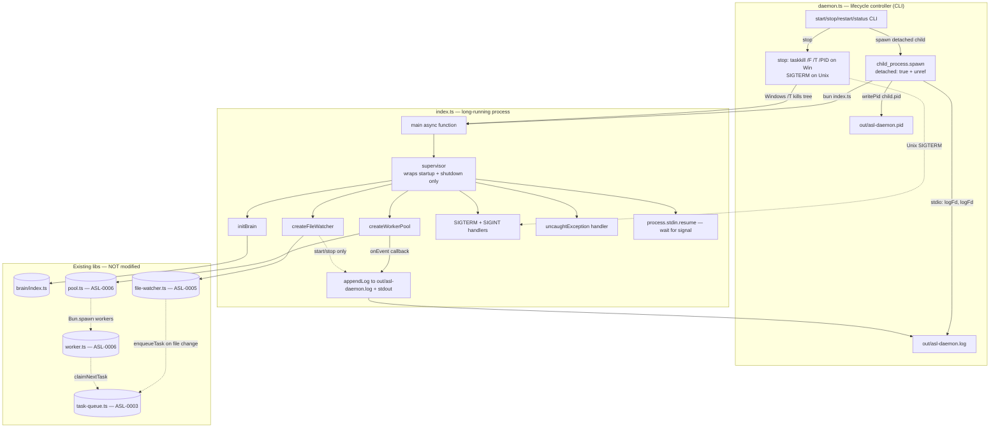
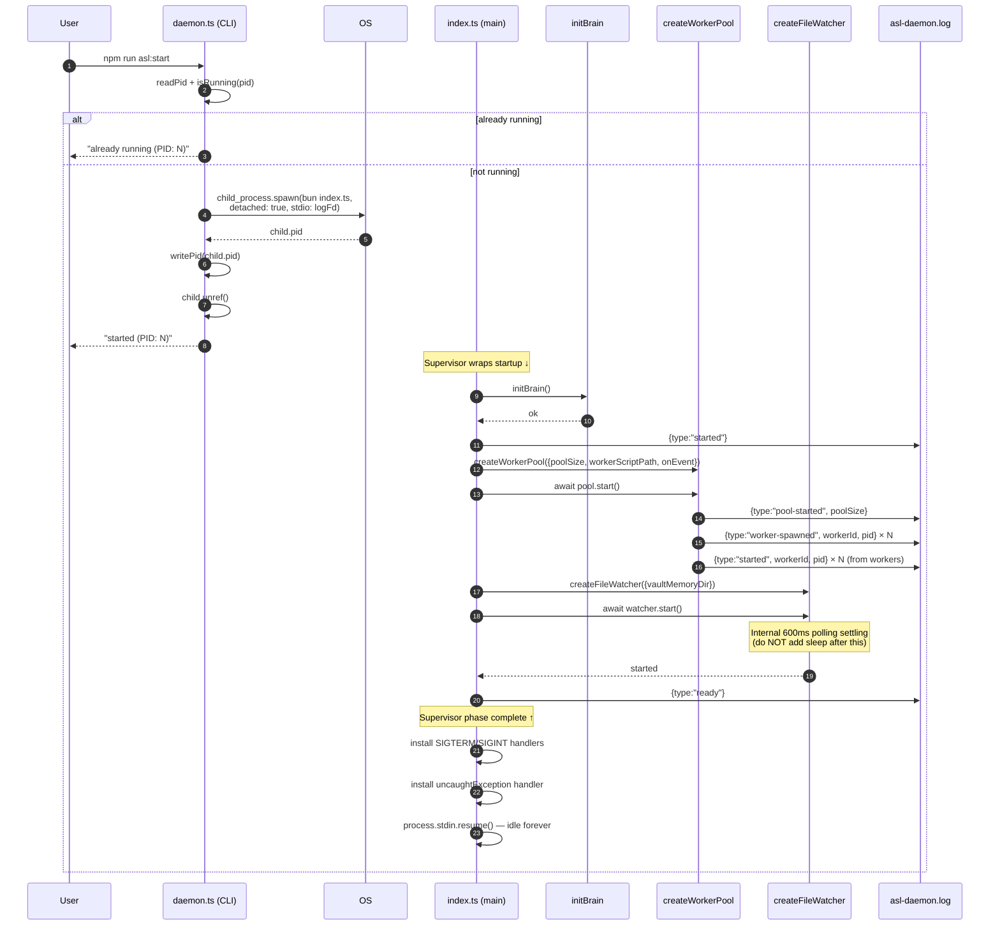
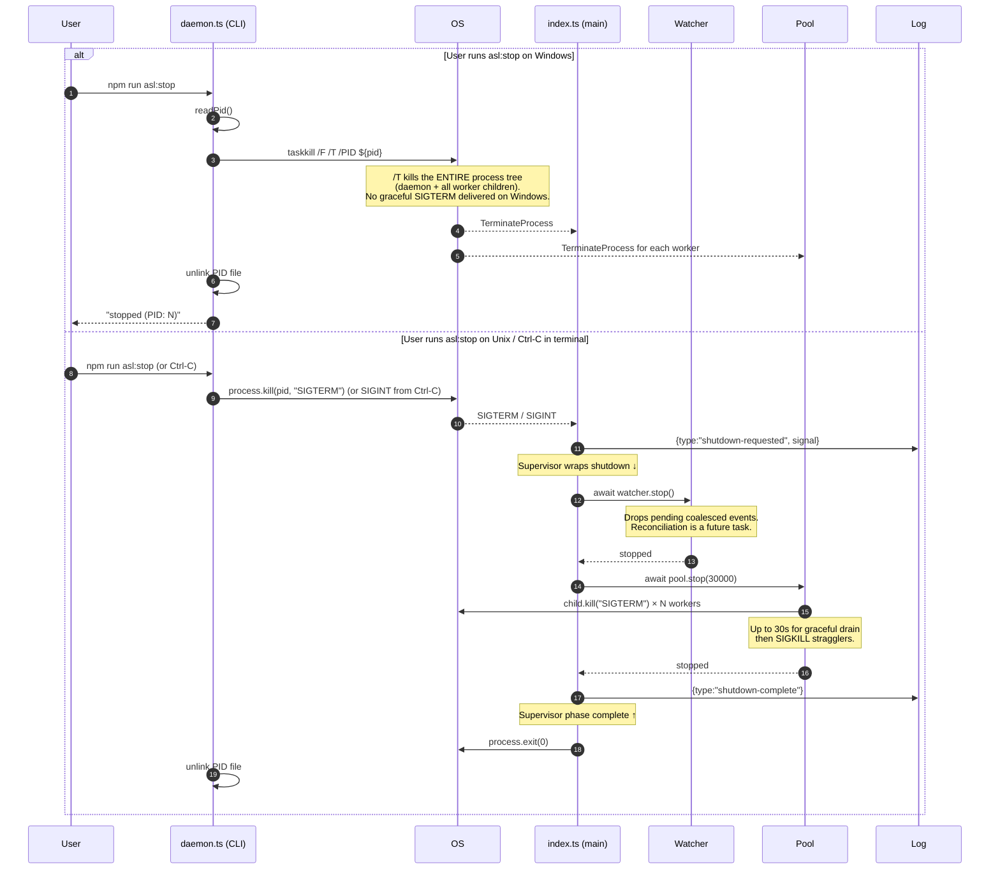

# ASL-0007 — Daemon entry point + lifecycle controller

## TL;DR

Build the **composition layer** of the ASL self-learning daemon as a pair of files plus four package.json scripts.

1. `src/services/self-learning-daemon/index.ts` — the long-running process. Calls `initBrain()`, constructs the worker pool (ASL-0006) and the file watcher (ASL-0005), starts them in the correct order, installs signal handlers, and stays alive until SIGTERM/SIGINT. Emits structured JSON-line events to `out/asl-daemon.log` and `process.stdout`.
2. `src/services/self-learning-daemon/daemon.ts` — the lifecycle controller. Direct copy-adapt of `src/servers/freddie-ai/daemon.ts` with different PID/log paths, no netstat/HTTP liveness check, and a different spawn target. Exposes `start | stop | restart | status` CLI subcommands.
3. `package.json` — add exactly four `asl:*` scripts mirroring the existing `mcp:*` block.

**Most of the hard work is already shipped.** ASL-0005 owns the watcher. ASL-0006 owns the pool. This task is glue — startup order, shutdown order, signal handling, supervisor loop around startup/shutdown only, and structured event logging.

**Hard locks:**
- Startup order: `initBrain()` → `pool.start()` → `watcher.start()` → `ready` event.
- Shutdown order (REVERSE): `watcher.stop()` → `pool.stop(30000)` → log `shutdown-complete` → `process.exit(0)`.
- Lifecycle controller uses `child_process.spawn` + `detached: true` + `child.unref()` (matches `servers/freddie-ai/daemon.ts`). The INNER pool uses `Bun.spawn` (ASL-0006). **Do not conflate.**
- No HTTP observability endpoint. No auto-start on login. No log rotation. No PM2. No Task Scheduler.
- Supervisor loop wraps STARTUP and SHUTDOWN phases only. Steady-state is signal-driven — a pure `process.stdin.resume()` wait.

---

## Context

Six dependencies already shipped — this is the last composition slice before the daemon goes live:

- **ASL-0001** (`8e7a92d`) — judge panel hardening (unrelated, listed for completeness).
- **ASL-0002** (`1f5fa1a`) — `tasks` + `agent_lifecycle` schema; `initBrain()` applies them on connect.
- **ASL-0003** (`d61f6fc`) — `src/libs/task-queue.ts` — claim/heartbeat/complete/fail/enqueue. File watcher calls `enqueueTask`; pool calls `claimNextTask`. This task is a COMPOSER — does not call task-queue directly.
- **ASL-0004** (`bab968c`) — `src/libs/agent-lifecycle.ts` — worker-side lifecycle updates. Not imported here.
- **ASL-0005** (`55132c8`) — `src/libs/file-watcher.ts` — `createFileWatcher({ vaultMemoryDir, ... })`. Composed here.
- **ASL-0006** (`a40ea77`) — `src/services/self-learning-daemon/worker.ts` + `pool.ts` — `createWorkerPool({ poolSize, workerScriptPath, onEvent, ... })`. Composed here.

**Read these before touching anything, in this exact order:**

1. **`vault/studio/projects/autonomous-self-learning/BRIEF.md`** — §1 "Daemon service", §1a "Daemon lifecycle management" (the PM2 REVERSAL lives here — the reference pattern is `src/servers/freddie-ai/daemon.ts`), §4 "Hook changes" for what downstream hooks enable once the daemon is live.
2. **`src/servers/freddie-ai/daemon.ts`** — ~120 lines. Read end-to-end. Understand `readPid()`, `writePid()`, `unlinkSync` on stop, `child_process.spawn` with `detached: true` + `stdio: ["ignore", logFd, logFd]` + `child.unref()`, Windows `taskkill /F /T /PID ${pid}` (the `/T` flag kills the process tree — which is why the daemon on Windows does NOT need to forward SIGTERM to the pool), Unix `process.kill(pid, "SIGTERM")`, and the netstat-based port liveness check. **Note:** ASL's daemon has no HTTP server — drop the netstat block; use PID-based liveness only (`process.kill(pid, 0)`).
3. **`src/libs/file-watcher.ts`** — focus on the `createFileWatcher` factory, the `FileWatcher` interface (`start()`, `stop()`, `getStatus()`), and especially the 600ms internal settling delay inside `start()` after chokidar's `ready` event. The daemon **MUST NOT add additional sleep or settling logic after `await watcher.start()`** — the watcher handles polling settling internally.
4. **`src/services/self-learning-daemon/worker.ts`** — you do not touch this file. Read to understand the `import.meta.main` bootstrap and the `WorkerEvent` discriminated union — your daemon will log every emitted event type.
5. **`src/services/self-learning-daemon/pool.ts`** — focus on the `createWorkerPool` factory signature, `start()` / `stop(timeoutMs?)` / `getStatus()`, and the `PoolEvent` + `WorkerEvent` union that `onEvent` receives. Your daemon's `logWorkerEvent` callback consumes both.
6. **`src/libs/task-queue.ts`** — read for contract awareness only. The daemon does NOT import `enqueueTask` or `claimNextTask`. The watcher calls `enqueueTask` (via its default wiring); the pool's workers call `claimNextTask`. The daemon wires the two layers together through brain.db, not through a direct function call.
7. **`src/libs/agent-lifecycle.ts`** — not imported by the daemon. Read for context on what workers do with the `agent_lifecycle` table after they consolidate/distill.
8. **`src/libs/brain/index.ts`** — find `initBrain()`. Export signature is `export function initBrain(): void`. Idempotent — safe to call from a daemon that may restart internally. **Call it exactly once at startup, BEFORE any watcher or pool construction.**
9. **`package.json`** — copy the exact format of the existing `mcp:*` block (lines 17-20). Your `asl:*` scripts go immediately after it.
10. **`src/libs/paths.ts`** — use `PROJECT_ROOT` and `fromRoot(...segments)` for all path resolution. No manual `__dirname`-walking except where required for the lifecycle controller's copy-adapt pattern.

**Also worth skimming for prior-art parity:**

- `vault/studio/projects/autonomous-self-learning/tasks/2026-04-08-000822-ASL-0006-worker-pool.md` — the task doc format for ASL-0006. Match its structure (frontmatter → TL;DR → context → mermaid diagrams → goal → detailed spec → files in scope → acceptance criteria → defensive reflexes → manual smoke test → what NOT to do → reporting back).

---

## Architecture diagram



**Legend:**
- Solid arrows = runtime control/data flow for this task.
- Dashed arrows = indirect flow (external components, brain.db-mediated, or already-tested behavior).
- The DAEMON never calls `enqueueTask` or `claimNextTask` directly. Watcher → task-queue → pool is a brain.db-mediated loose coupling.
- `daemon.ts` is the OUTER process manager. `index.ts` is the INNER process. The two files communicate only through the PID file, the log file, and OS signals.

---

## Startup sequence



---

## Shutdown sequence



**Why watcher stops BEFORE pool:**
If the pool stopped first, any in-flight file events would enqueue tasks that no worker is alive to claim — they'd linger in `pending` until the next daemon restart. Stopping the watcher first closes the input valve; the pool then drains whatever was already claimed. This matches the general producer-before-consumer-drain pattern.

---

## Goal

After this task ships:

1. `src/services/self-learning-daemon/index.ts` exists as the long-running entry point. Running `bun src/services/self-learning-daemon/index.ts` directly (no daemon.ts wrapper) starts the daemon in the foreground for debugging.
2. `src/services/self-learning-daemon/daemon.ts` exists as the lifecycle controller. Running `bun src/services/self-learning-daemon/daemon.ts start` detaches the index.ts process, writes `out/asl-daemon.pid`, and returns control to the user.
3. `npm run asl:start | asl:stop | asl:restart | asl:status` all work and mirror the existing `mcp:*` behavior.
4. The daemon calls `initBrain()` exactly once at startup before any watcher or pool construction.
5. Startup order is locked: `initBrain` → `pool.start()` → `watcher.start()` → emit `{type: "ready"}`.
6. Shutdown order is locked: `watcher.stop()` → `pool.stop(30000)` → emit `{type: "shutdown-complete"}` → `process.exit(0)`.
7. SIGTERM and SIGINT trigger the shutdown sequence. `uncaughtException` logs with stack trace but does NOT force-exit — it relies on the supervisor to decide.
8. A supervisor loop wraps STARTUP and SHUTDOWN phases. Steady-state is a simple `process.stdin.resume()` wait for signals. If startup throws, log + sleep 5s + retry, up to 5 restarts in 60s. Cap exceeded → log fatal + exit code 1.
9. Sub-component failure handling: watcher errors → log + restart watcher alone after 5s. Pool reports a permanently-crashed worker → log WARN, continue with remaining workers. Pool reports ALL workers permanently crashed → log FATAL, shut down gracefully, exit 1.
10. All daemon events (`started`, `ready`, `shutdown-requested`, `shutdown-complete`, `uncaught-exception`, `supervisor-restart`, `watcher-error`, `fatal`) plus all passthrough watcher/pool/worker events are written as one-JSON-object-per-line to `out/asl-daemon.log` AND echoed to `process.stdout`.
11. Pool size is controlled by the `ASL_POOL_SIZE` env var (default 2, integer parse, fallback to 2 on NaN / negative / zero).
12. Single-instance guarantee: `daemon.ts start` refuses to launch if the PID file exists AND `process.kill(pid, 0)` succeeds. Matches the MCP daemon's behavior.
13. No HTTP server. No observability API. No log rotation. No auto-start on login.
14. Two test files totaling 10–15 tests cover the lifecycle controller and the composition layer. No real daemon subprocess is spawned in tests — the composition test uses DI mocks for the pool and watcher factories.
15. A manual smoke test procedure is documented in this doc for the user to run after merge (see §Manual smoke test).

---

## Detailed specification

### Part 1 — `src/services/self-learning-daemon/index.ts` (NEW)

**File header comment:**
```ts
/**
 * index.ts — ASL self-learning daemon long-running process.
 *
 * Composition layer. Wires together:
 *   - initBrain() (brain/index.ts)
 *   - createWorkerPool (ASL-0006 pool.ts)
 *   - createFileWatcher (ASL-0005 file-watcher.ts)
 *
 * Started by `src/services/self-learning-daemon/daemon.ts` (the lifecycle
 * controller) via `child_process.spawn` with detached: true + stdio → log
 * file. Can also be run directly in the foreground for debugging:
 *   bun src/services/self-learning-daemon/index.ts
 *
 * Shutdown is driven by SIGTERM or SIGINT (Unix + foreground Ctrl-C). On
 * Windows, `daemon.ts stop` uses `taskkill /F /T /PID` which kills the
 * process tree — no SIGTERM is delivered to the daemon. The signal handler
 * exists for Unix + foreground use.
 *
 * This file does NOT:
 *   - Import task-queue.ts (file-watcher and pool do that independently)
 *   - Import agent-lifecycle.ts (workers own lifecycle updates)
 *   - Spawn worker children (pool.ts does that)
 *   - Run chokidar directly (file-watcher.ts does that)
 *   - Expose an HTTP API (future task)
 *   - Rotate logs (future task)
 */
```

**Imports (exact):**
```ts
import { appendFileSync, existsSync, mkdirSync } from "fs";
import { join, dirname } from "path";
import { fileURLToPath } from "url";
import { initBrain } from "../../libs/brain/index.js";
import { fromRoot } from "../../libs/paths.js";
import { createFileWatcher, type FileWatcher } from "../../libs/file-watcher.js";
import {
  createWorkerPool,
  type WorkerPool,
  type PoolEvent,
  type WorkerEvent,
} from "./pool.js";
```

**Constants:**
```ts
const LOG_FILE = fromRoot("out", "asl-daemon.log");

const SUPERVISOR_MAX_RESTARTS = 5;
const SUPERVISOR_RESTART_WINDOW_MS = 60_000;
const SUPERVISOR_RESTART_DELAY_MS = 5_000;

const WATCHER_RESTART_DELAY_MS = 5_000;

const POOL_SHUTDOWN_TIMEOUT_MS = 30_000;
```

**Public types (exported for tests):**
```ts
/**
 * Structured event logged by the daemon. One line per event in asl-daemon.log
 * (JSON object followed by '\n'). Also echoed to process.stdout unchanged.
 */
export interface DaemonLogEvent {
  at: string;                   // ISO timestamp
  source: "daemon" | "watcher" | "pool" | "worker";
  type: string;                 // discriminator — daemon owns its vocabulary
  [key: string]: unknown;       // open bag for passthrough events
}

/**
 * DI options for createDaemon. Production resolves defaults; tests inject
 * mocks so no real watcher, no real pool, no real brain.db.
 */
export interface CreateDaemonOptions {
  /** Pool size. Default: ASL_POOL_SIZE env var, fallback 2. */
  poolSize?: number;

  /** Absolute path to the vault memory directory. Default: fromRoot("vault","studio","memory"). */
  vaultMemoryDir?: string;

  /** Absolute path to worker.ts. Default: resolved from this file's location. */
  workerScriptPath?: string;

  /** DI override for initBrain. Defaults to real initBrain. */
  initBrainFn?: () => void;

  /** DI override for createWorkerPool. Defaults to real factory from pool.ts. */
  createWorkerPoolFn?: typeof createWorkerPool;

  /** DI override for createFileWatcher. Defaults to real factory from file-watcher.ts. */
  createFileWatcherFn?: typeof createFileWatcher;

  /** DI override for the log writer. Defaults to appendFileSync to LOG_FILE + stdout echo. */
  logFn?: (event: DaemonLogEvent) => void;

  /** DI override for sleep (used by supervisor delay). Defaults to setTimeout-based. */
  sleepFn?: (ms: number) => Promise<void>;

  /** DI override for Date.now. Defaults to () => Date.now(). */
  nowFn?: () => number;
}

/**
 * Opaque daemon handle. Production main() just calls start() + awaits the
 * internal idle promise. Tests use all three members to drive the lifecycle
 * deterministically.
 */
export interface Daemon {
  /**
   * Run the startup sequence under the supervisor, install signal handlers,
   * then resolve. Does NOT block on idle — that's the caller's job in
   * production (via process.stdin.resume()). Tests can resolve immediately
   * and assert startup invariants.
   */
  start(): Promise<void>;

  /**
   * Run the shutdown sequence under the supervisor. Idempotent — a second
   * call after the first has resolved is a no-op. Does NOT call process.exit.
   * The caller (production main or test) decides when to exit.
   */
  stop(signal?: string): Promise<void>;

  /** Observability snapshot for tests. */
  getStatus(): DaemonStatus;
}

export interface DaemonStatus {
  phase: "idle" | "starting" | "running" | "stopping" | "stopped" | "failed";
  supervisorRestartCount: number;
  startedAt: string | null;
  stoppedAt: string | null;
}
```

**Factory: `createDaemon(options?: CreateDaemonOptions): Daemon`**

Resolves all DI slots to defaults once. Returns the handle. Zero side effects at construction time — no initBrain, no watcher, no pool. Everything happens on `start()`.

Pseudocode shape (NOT production code — Ryan writes the real thing):

```ts
export function createDaemon(options: CreateDaemonOptions = {}): Daemon {
  const poolSize = options.poolSize ?? parsePoolSize(process.env.ASL_POOL_SIZE);
  const vaultMemoryDir = options.vaultMemoryDir ?? fromRoot("vault", "studio", "memory");
  const workerScriptPath = options.workerScriptPath ?? resolveWorkerScriptPath();
  const initBrainFn = options.initBrainFn ?? initBrain;
  const createPoolFn = options.createWorkerPoolFn ?? createWorkerPool;
  const createWatcherFn = options.createFileWatcherFn ?? createFileWatcher;
  const logFn = options.logFn ?? defaultLogFn;
  const sleepFn = options.sleepFn ?? ((ms) => new Promise((r) => setTimeout(r, ms)));
  const nowFn = options.nowFn ?? (() => Date.now());

  let phase: DaemonStatus["phase"] = "idle";
  let pool: WorkerPool | null = null;
  let watcher: FileWatcher | null = null;
  let supervisorRestartCount = 0;
  const supervisorRestartTimestamps: number[] = [];
  let startedAt: string | null = null;
  let stoppedAt: string | null = null;
  let stopInFlight: Promise<void> | null = null;
  let allWorkersPermanentlyCrashed = false;

  async function performStartup(): Promise<void> {
    phase = "starting";
    logFn({ at: tsNow(), source: "daemon", type: "started", poolSize, vaultMemoryDir, workerScriptPath });
    initBrainFn();
    pool = createPoolFn({
      poolSize,
      workerScriptPath,
      onEvent: onPoolOrWorkerEvent,
    });
    await pool.start();
    watcher = createWatcherFn({ vaultMemoryDir });
    await watcher.start();
    // NO sleep here — file-watcher handles its own 600ms settling.
    phase = "running";
    startedAt = tsNow();
    logFn({ at: tsNow(), source: "daemon", type: "ready" });
  }

  async function start(): Promise<void> { /* supervisor wraps performStartup — see §Supervisor */ }
  async function stop(signal?: string): Promise<void> { /* supervisor wraps performShutdown — see §Supervisor */ }

  return { start, stop, getStatus: () => ({ phase, supervisorRestartCount, startedAt, stoppedAt }) };
}
```

**Production main (bootstrap — runs only under `import.meta.main`):**

```ts
if (import.meta.main) {
  // Ensure out/ exists for the log file.
  const outDir = fromRoot("out");
  if (!existsSync(outDir)) mkdirSync(outDir, { recursive: true });

  const daemon = createDaemon();

  // Signal handlers — Unix primary, Windows fallback.
  let shuttingDown = false;
  const shutdown = async (signal: string) => {
    if (shuttingDown) return;
    shuttingDown = true;
    try {
      await daemon.stop(signal);
      process.exit(0);
    } catch {
      // Supervisor already logged. Force exit.
      process.exit(1);
    }
  };
  process.on("SIGTERM", () => { void shutdown("SIGTERM"); });
  process.on("SIGINT", () => { void shutdown("SIGINT"); });

  // uncaughtException — log with stack, do NOT exit. Supervisor handles restart
  // on next startup attempt. In steady-state, this is defensive only — most
  // code paths are inside awaited promises.
  process.on("uncaughtException", (err) => {
    defaultLogFn({
      at: new Date().toISOString(),
      source: "daemon",
      type: "uncaught-exception",
      error: err instanceof Error ? err.message : String(err),
      stack: err instanceof Error ? err.stack : undefined,
    });
  });

  // Run startup under the supervisor.
  try {
    await daemon.start();
  } catch {
    // Supervisor gave up. Exit non-zero.
    process.exit(1);
  }

  // Idle forever — signal handlers drive shutdown.
  process.stdin.resume();
}
```

**Supervisor loop semantics:**

The supervisor wraps ONLY the `performStartup` and `performShutdown` phases. Steady-state is signal-driven — there is no hot loop to wrap.

- **On startup failure:** catch the error, log `{type: "supervisor-caught", phase: "startup", error, stack}`, record the timestamp in the restart window, sleep `SUPERVISOR_RESTART_DELAY_MS`, then re-attempt `performStartup()`. Cap at `SUPERVISOR_MAX_RESTARTS` within `SUPERVISOR_RESTART_WINDOW_MS`. Exceeded → log `{type: "fatal", reason: "supervisor-exhausted"}`, set phase to `"failed"`, rethrow.
- **On shutdown failure:** catch, log, DO NOT retry. Shutdown is best-effort. Rethrow so the production main's catch block can set exit code 1.
- **Steady-state:** no supervisor involvement. Workers crash → pool handles restart. Watcher errors → the `onWatcherError` handler (see below) reacts outside the supervisor. Main daemon errors in steady-state flow through the `uncaughtException` handler.

**Sub-component failure handling (outside the supervisor):**

- **Watcher errors:** the file-watcher factory today does not expose an `onError` callback in its public API. Defensive plan: wrap `watcher.start()` in a try/catch during startup (that path is already under the supervisor). If a steady-state error occurs, it will bubble through `uncaughtException`. If ASL-0005 adds an `onError` callback in a future revision, the daemon will wire it up then. Until then, the watcher is assumed crash-resistant at runtime (chokidar in polling mode has no known post-ready error paths for the ASL use case). Document this assumption in a comment.
- **Pool permanent worker crashes:** the pool emits `{type: "worker-permanently-crashed", workerId, crashCount}`. The daemon's `onPoolOrWorkerEvent` handler counts these. If the count of permanently-crashed workers equals `poolSize`, the daemon logs `{type: "fatal", reason: "all-workers-crashed"}` and calls `daemon.stop("fatal-all-workers-crashed")` which runs the normal shutdown sequence and then exits 1. Otherwise, just log WARN and continue.

**Log writer default:**

```ts
function defaultLogFn(event: DaemonLogEvent): void {
  const line = JSON.stringify(event) + "\n";
  try {
    appendFileSync(LOG_FILE, line, "utf-8");
  } catch {
    // If the log file write fails, fall back to stderr so the failure is
    // at least visible in the daemon.ts spawn capture. Do not throw — the
    // daemon must not die on a log write failure.
  }
  try {
    process.stdout.write(line);
  } catch {
    // stdout may be closed if something weird is happening with the
    // detached-spawn stdio redirect. Swallow.
  }
}
```

**Pool event passthrough rules:**

The pool's `onEvent` callback receives both `WorkerEvent` and `PoolEvent`. Map them to `DaemonLogEvent`:

| Pool/Worker event `type` | `source` | Transform |
|--------------------------|----------|-----------|
| `pool-started` | `pool` | passthrough — copy all fields |
| `pool-stopped` | `pool` | passthrough |
| `worker-spawned` | `pool` | passthrough |
| `worker-crashed` | `pool` | passthrough |
| `worker-restart-scheduled` | `pool` | passthrough |
| `worker-permanently-crashed` | `pool` | passthrough + count toward fatal threshold |
| `started` / `idle` / `claimed` / `heartbeat` / `completed` / `failed` / `stopping` / `log` | `worker` | passthrough |

Transform means: `{ at: event.ts, source, type: event.type, ...rest }`. The `ts` field on the pool/worker event becomes the `at` field on the daemon event. No content loss.

**Watcher start/stop logging:**

The file-watcher factory does not currently expose an event callback. The daemon logs synthetic events around its own `await watcher.start()` and `await watcher.stop()` calls:

```ts
logFn({ at: tsNow(), source: "watcher", type: "start-requested", vaultMemoryDir });
await watcher.start();
logFn({ at: tsNow(), source: "watcher", type: "started", ...watcher.getStatus() });
```

```ts
logFn({ at: tsNow(), source: "watcher", type: "stop-requested", ...watcher.getStatus() });
await watcher.stop();
logFn({ at: tsNow(), source: "watcher", type: "stopped" });
```

**Pool size env var parsing:**

```ts
function parsePoolSize(raw: string | undefined): number {
  if (!raw) return 2;
  const n = Number.parseInt(raw, 10);
  if (!Number.isFinite(n) || n <= 0) return 2;
  return n;
}
```

**Worker script path resolution:**

```ts
function resolveWorkerScriptPath(): string {
  const here = dirname(fileURLToPath(import.meta.url));
  return join(here, "worker.ts");
}
```

Absolute path. The pool's `createWorkerPool` contract requires an absolute path.

---

### Part 2 — `src/services/self-learning-daemon/daemon.ts` (NEW)

**Direct copy-adapt of `src/servers/freddie-ai/daemon.ts`.** Expected ~140-160 lines. Structure is identical. Changes:

| Concern | Source value | Target value |
|---------|-------------|--------------|
| PID file | `out/freddie-ai-mcp.pid` | `out/asl-daemon.pid` |
| Log file | `out/freddie-ai-mcp.log` | `out/asl-daemon.log` |
| Spawn target | `join(__dirname, "index.ts"), "--http"` | `join(__dirname, "index.ts")` (no args) |
| Liveness check | `isServerUp()` via netstat on port 3456 | PID-based only: `process.kill(pid, 0)` |
| Startup message | `freddie-ai MCP server started` | `ASL self-learning daemon started` |
| Status message | includes `http://0.0.0.0:3456/mcp` | no URL — just PID + log path |
| Usage line | `bun servers/freddie-ai/daemon.ts ...` | `bun src/services/self-learning-daemon/daemon.ts ...` |

**Remove entirely:**
- `isServerUp()` function and all calls to it
- The `netstat | findstr` fallback block inside `stop()`
- The port-based "could not stop server" error message

**Keep intact:**
- `readPid()`, `writePid`, `unlinkSync(PID_FILE)` on stop, `existsSync(PID_FILE)` guard
- `child_process.spawn("bun", [indexPath], { cwd: projectRoot, detached: true, stdio: ["ignore", logFd, logFd], env: { ...process.env } })`
- `child.unref()`
- Windows `execSync("taskkill /F /T /PID ${pid}", { stdio: "ignore" })` (the `/T` kills the worker tree — this is why the daemon does NOT need to manually SIGTERM-forward to the pool on Windows)
- Unix `process.kill(pid, "SIGTERM")`
- `openSync(LOG_FILE, "a")` for the log file descriptor
- `restart()` using `Bun.sleepSync(500)` poll loop

**Single-instance check** — the source version uses `isServerUp()` as the gate. The adapted version uses the PID file alone:

```ts
function isRunning(pid: number): boolean {
  try { process.kill(pid, 0); return true; } catch { return false; }
}

function start() {
  const existingPid = readPid();
  if (existingPid && isRunning(existingPid)) {
    console.log(`ASL self-learning daemon already running (PID: ${existingPid})`);
    return;
  }
  // If PID file exists but process is dead, clean it up before spawning.
  if (existingPid && existsSync(PID_FILE)) unlinkSync(PID_FILE);

  const logFd = openSync(LOG_FILE, "a");
  const child = spawn("bun", [join(__dirname, "index.ts")], {
    cwd: projectRoot,
    detached: true,
    stdio: ["ignore", logFd, logFd],
    env: { ...process.env },
  });
  child.unref();
  writeFileSync(PID_FILE, String(child.pid), "utf-8");
  console.log(`ASL self-learning daemon started (PID: ${child.pid})`);
  console.log(`  → Logs: out/asl-daemon.log`);
}
```

**`stop()` adapted:**

```ts
function stop() {
  const pid = readPid();
  if (!pid) {
    console.log("ASL self-learning daemon is not running.");
    return;
  }
  try {
    if (process.platform === "win32") {
      execSync(`taskkill /F /T /PID ${pid}`, { stdio: "ignore" });
    } else {
      process.kill(pid, "SIGTERM");
    }
    console.log(`ASL self-learning daemon stopped (PID: ${pid})`);
  } catch {
    // Ignore — process may already be dead.
  }
  if (existsSync(PID_FILE)) unlinkSync(PID_FILE);
}
```

**`status()` adapted:**

```ts
function status() {
  const pid = readPid();
  if (pid && isRunning(pid)) {
    console.log(`ASL self-learning daemon is running (PID: ${pid})`);
    console.log(`  → Logs: out/asl-daemon.log`);
  } else {
    console.log("ASL self-learning daemon is not running.");
    if (pid && existsSync(PID_FILE)) unlinkSync(PID_FILE);
  }
}
```

**`restart()` adapted:**

```ts
function restart() {
  stop();
  let retries = 10;
  while (retries > 0) {
    const pid = readPid();
    if (!pid || !isRunning(pid)) break;
    Bun.sleepSync(500);
    retries--;
  }
  start();
}
```

**Usage line:**

```ts
default:
  console.log("Usage: bun src/services/self-learning-daemon/daemon.ts [start|stop|restart|status]");
  process.exit(1);
```

---

### Part 3 — `package.json` (MODIFY)

Add exactly these four scripts. Placement: immediately after the `mcp:*` block (currently lines 17-20). Preserve surrounding formatting.

```json
"asl:start": "bun src/services/self-learning-daemon/daemon.ts start",
"asl:stop": "bun src/services/self-learning-daemon/daemon.ts stop",
"asl:restart": "bun src/services/self-learning-daemon/daemon.ts restart",
"asl:status": "bun src/services/self-learning-daemon/daemon.ts status",
```

No other package.json changes. No new dependencies. No devDependencies.

---

### Part 4 — `src/services/self-learning-daemon/__tests__/daemon.test.ts` (NEW)

Unit tests for the lifecycle controller. Full mocking of `child_process.spawn`, `existsSync` / `writeFileSync` / `unlinkSync` / `readFileSync`, `process.kill`, `execSync`. Similar in spirit to how ASL-0006 mocked `spawnFn`.

**Module mocking approach:**

`daemon.ts` as written is a bare script (top-level switch on `process.argv[2]`). To make it testable, extract the start/stop/restart/status functions into named exports with a DI seam for the fs and spawn operations. A thin bootstrap at the bottom still runs the CLI under `if (import.meta.main)`. Mirror this pattern from the ASL-0006 worker DI approach.

**Refactor to expose for testing:**

```ts
export interface DaemonControllerDeps {
  readFileSyncFn?: typeof readFileSync;
  writeFileSyncFn?: typeof writeFileSync;
  existsSyncFn?: typeof existsSync;
  unlinkSyncFn?: typeof unlinkSync;
  openSyncFn?: typeof openSync;
  mkdirSyncFn?: typeof mkdirSync;
  spawnFn?: typeof spawn;
  execSyncFn?: typeof execSync;
  processKillFn?: (pid: number, signal?: number | string) => boolean;
  platform?: NodeJS.Platform;
  sleepSyncFn?: (ms: number) => void;
  logFn?: (msg: string) => void;
}

export function createDaemonController(deps: DaemonControllerDeps = {}) {
  // resolve defaults
  return {
    start: () => { ... },
    stop: () => { ... },
    restart: () => { ... },
    status: () => { ... },
  };
}

if (import.meta.main) {
  const controller = createDaemonController();
  const command = process.argv[2];
  switch (command) {
    case "start": controller.start(); break;
    case "stop": controller.stop(); break;
    case "restart": controller.restart(); break;
    case "status": controller.status(); break;
    default:
      console.log("Usage: bun src/services/self-learning-daemon/daemon.ts [start|stop|restart|status]");
      process.exit(1);
  }
}
```

**Test cases (minimum 7):**

1. **D1. `start()` with no PID file spawns a child and writes the PID.**
   - Mock `existsSyncFn` → false for PID file, `spawnFn` → returns `{ pid: 12345, unref: () => {} }`.
   - Assert `spawnFn` called with `"bun"`, args containing `index.ts`, `detached: true`, correct cwd.
   - Assert `writeFileSyncFn` called with the PID file path and `"12345"`.
   - Assert `unref` called on the returned child.

2. **D2. `start()` with a live PID file refuses to launch.**
   - Mock `readFileSyncFn` → `"12345"`, `processKillFn(12345, 0)` → true.
   - Assert `spawnFn` NOT called, log message contains `already running`.

3. **D3. `start()` with a stale PID file cleans up and spawns.**
   - Mock `readFileSyncFn` → `"12345"`, `processKillFn(12345, 0)` throws, `existsSyncFn` → true.
   - Assert `unlinkSyncFn` called on the PID file BEFORE the spawn.
   - Assert `spawnFn` still called.

4. **D4. `stop()` on Windows uses `taskkill /F /T /PID`.**
   - Mock `platform` → `"win32"`, `readFileSyncFn` → `"12345"`, `execSyncFn` → no-op.
   - Assert `execSyncFn` called with string matching `taskkill /F /T /PID 12345`.
   - Assert `unlinkSyncFn` called on the PID file.
   - Assert `processKillFn` NOT called (Unix path not taken).

5. **D5. `stop()` on Unix uses `process.kill(pid, "SIGTERM")`.**
   - Mock `platform` → `"linux"`, `readFileSyncFn` → `"12345"`, `processKillFn` → true.
   - Assert `processKillFn` called with `(12345, "SIGTERM")`.
   - Assert `execSyncFn` NOT called.
   - Assert `unlinkSyncFn` called on the PID file.

6. **D6. `stop()` with no PID file logs "not running" and exits cleanly.**
   - Mock `existsSyncFn` → false.
   - Assert no spawn, no kill, no unlink.
   - Assert log message contains `not running`.

7. **D7. `status()` with a live PID reports running.**
   - Mock `readFileSyncFn` → `"12345"`, `processKillFn(12345, 0)` → true.
   - Assert log contains `is running (PID: 12345)`.

8. **D8. `status()` with a stale PID cleans up and reports not running.**
   - Mock `readFileSyncFn` → `"12345"`, `processKillFn(12345, 0)` throws, `existsSyncFn` → true.
   - Assert `unlinkSyncFn` called.
   - Assert log contains `not running`.

9. **D9. `restart()` calls stop then start in order.**
   - Mock stop/start spies on the same controller instance (via DI injection recording).
   - First call should be stop, second call should be start. Use a mock `sleepSyncFn` that resolves instantly.

10. **D10. Windows taskkill failure is tolerated.**
    - Mock `execSyncFn` to throw.
    - Assert the unlink still runs and the process doesn't crash.

---

### Part 5 — `src/services/self-learning-daemon/__tests__/index.test.ts` (NEW)

Composition tests for `createDaemon`. Mocks the pool factory, the watcher factory, and the log writer. No real brain.db, no real chokidar, no real Bun.spawn.

**Mock builders:**

```ts
function makeMockPool(): WorkerPool & { _start: Mock; _stop: Mock } {
  const startMock = mock(async () => {});
  const stopMock = mock(async (_ms?: number) => {});
  return {
    start: startMock,
    stop: stopMock,
    getStatus: () => ({ running: true, workers: [] }),
    _start: startMock,
    _stop: stopMock,
  } as any;
}

function makeMockWatcher(): FileWatcher & { _start: Mock; _stop: Mock } { ... }

function makeMockCreatePool(pool: WorkerPool) {
  return mock((_opts: any) => pool);
}

function makeMockCreateWatcher(watcher: FileWatcher) {
  return mock((_opts: any) => watcher);
}
```

**Test cases (minimum 8):**

1. **I1. `createDaemon()` at construction time has zero side effects.**
   - Build a daemon with DI mocks and do NOT call `start()`.
   - Assert `initBrainFn`, `createWorkerPoolFn`, `createFileWatcherFn` were NOT called.
   - Assert `getStatus().phase === "idle"`.

2. **I2. `start()` invokes initBrain → pool.start → watcher.start in that exact order.**
   - Use a call-order spy (a shared array the mocks push into).
   - After `await daemon.start()`, assert order: `["initBrain", "createPool", "pool.start", "createWatcher", "watcher.start"]`.
   - Assert `phase === "running"` and the `{type: "ready"}` event was logged.

3. **I3. `start()` does NOT add any sleep after `await watcher.start()`.**
   - Mock `sleepFn` and assert it was not called after the watcher start call (it IS allowed to be called by the supervisor on retry, but not in the happy path).
   - This is the hard-lock from the required reading on ASL-0005's internal settling delay.

4. **I4. `stop()` invokes watcher.stop BEFORE pool.stop.**
   - Use the call-order spy.
   - After `await daemon.stop("SIGTERM")`, assert order: `["watcher.stop", "pool.stop"]`.
   - Assert `pool.stop` was called with `POOL_SHUTDOWN_TIMEOUT_MS` (30000).
   - Assert `{type: "shutdown-requested"}` logged before `{type: "shutdown-complete"}`.

5. **I5. `stop()` is idempotent.**
   - Call `stop()` twice. Assert watcher.stop and pool.stop were each called EXACTLY ONCE across both calls.

6. **I6. Startup failure triggers supervisor retry with delay.**
   - First call to `pool.start()` throws; second call resolves.
   - Mock `sleepFn` to record calls but not actually sleep.
   - Assert supervisor logged `{type: "supervisor-caught", phase: "startup"}` and then retried successfully.
   - Assert `supervisorRestartCount === 1` and `phase === "running"`.
   - Assert `sleepFn` called with `SUPERVISOR_RESTART_DELAY_MS`.

7. **I7. Startup failure exceeding the retry cap throws.**
   - Mock `pool.start` to throw on EVERY call.
   - Assert the promise returned by `daemon.start()` rejects after `SUPERVISOR_MAX_RESTARTS` attempts.
   - Assert the final log event is `{type: "fatal", reason: "supervisor-exhausted"}`.
   - Assert `phase === "failed"`.

8. **I8. Pool passthrough events are logged with `source` correctly mapped.**
   - Capture the `onEvent` callback that the daemon passes to `createWorkerPoolFn`.
   - Fire a synthetic `{type: "pool-started", poolSize: 2, ts: "..."}` and assert the log event has `source: "pool"`, `type: "pool-started"`, `poolSize: 2`.
   - Fire a synthetic `{type: "claimed", workerId: "worker-0-abc", taskId: 1, taskType: "consolidate", agent: "tala", ts: "..."}` and assert `source: "worker"`, `type: "claimed"`, all fields preserved.

9. **I9. Pool reports all workers permanently crashed → daemon logs fatal and stops.**
   - Set `poolSize: 2`.
   - After startup, fire two `{type: "worker-permanently-crashed", workerId: "worker-0-...", crashCount: 5, ts: "..."}` events through the captured `onEvent` callback.
   - Assert `{type: "fatal", reason: "all-workers-crashed"}` logged.
   - Assert `daemon.stop` was triggered (watcher.stop + pool.stop called).

10. **I10. `parsePoolSize` handles undefined / NaN / zero / negative / valid.**
    - Export `parsePoolSize` or test it via `createDaemon({ poolSize: undefined })` + env var manipulation (save + restore `process.env.ASL_POOL_SIZE`).
    - Assert: undefined → 2, `""` → 2, `"0"` → 2, `"-1"` → 2, `"abc"` → 2, `"4"` → 4, `"2"` → 2.

11. **I11. Log writer default appends to file AND echoes to stdout.**
    - Only runs on a temp file. Inject a custom `logFn` for all other tests; this one test exercises the REAL `defaultLogFn` with a redirected `LOG_FILE` path. Consider extracting `defaultLogFn` to accept a path argument for testability, OR skip this test and rely on manual smoke verification.
    - Recommendation: **skip the real log writer test.** The log writer is trivial `appendFileSync + stdout.write` and the manual smoke test will catch any regression. Add it as a comment rather than a live test.

---

## Files in scope

- `src/services/self-learning-daemon/index.ts` — **NEW** — ~300-400 lines (factory, supervisor, event transforms, bootstrap)
- `src/services/self-learning-daemon/daemon.ts` — **NEW** — ~150 lines (direct copy-adapt of `src/servers/freddie-ai/daemon.ts` minus netstat)
- `src/services/self-learning-daemon/__tests__/daemon.test.ts` — **NEW** — ~200-280 lines (10 tests)
- `src/services/self-learning-daemon/__tests__/index.test.ts` — **NEW** — ~300-400 lines (10-11 tests)
- `package.json` — **MODIFIED** — +4 lines (asl:start / asl:stop / asl:restart / asl:status)

**Total new code:** ~950-1230 lines across 4 files + 4 lines in package.json. Tests are a significant share because the composition layer is hard to test end-to-end without real processes.

---

## Acceptance criteria

1. `src/services/self-learning-daemon/index.ts` exists and exports `createDaemon`, `DaemonLogEvent`, `CreateDaemonOptions`, `Daemon`, `DaemonStatus`, and `parsePoolSize`.
2. `src/services/self-learning-daemon/daemon.ts` exists and exports `createDaemonController`, `DaemonControllerDeps`.
3. `src/services/self-learning-daemon/index.ts` has an `import.meta.main` bootstrap that:
   a. Creates `out/` if missing.
   b. Constructs a daemon with default options.
   c. Installs SIGTERM and SIGINT handlers that call `daemon.stop(signal)` then `process.exit(0)`.
   d. Installs an `uncaughtException` handler that logs but does not exit.
   e. Awaits `daemon.start()` under a try/catch that exits 1 on startup exhaustion.
   f. Calls `process.stdin.resume()` to stay alive.
4. `src/services/self-learning-daemon/daemon.ts` has an `import.meta.main` bootstrap with a switch on `process.argv[2]` dispatching to `start | stop | restart | status`, and an unknown-command fallback that prints usage and exits 1.
5. Startup order matches the diagram exactly: `initBrain → createWorkerPool → pool.start → createFileWatcher → watcher.start → log "ready"`.
6. Shutdown order matches the diagram exactly: `log "shutdown-requested" → watcher.stop → pool.stop(30000) → log "shutdown-complete"`. **watcher MUST stop before pool.**
7. Shutdown is idempotent — a second `stop()` call after the first resolves is a no-op.
8. `daemon.start()` is NOT idempotent — a second call while already running rejects or throws (document the choice; reject is preferred for async consistency). Tests assert the behavior.
9. `pool.stop(timeoutMs)` is called with exactly `POOL_SHUTDOWN_TIMEOUT_MS === 30_000`.
10. Pool size reads from `ASL_POOL_SIZE` env var and parses via `parsePoolSize`. Default 2. NaN/zero/negative fall back to 2.
11. Worker script path resolves to the absolute path of `src/services/self-learning-daemon/worker.ts` via `fileURLToPath(import.meta.url) + dirname + join`.
12. `index.ts` does NOT import from `task-queue.js`, `agent-lifecycle.js`, `chokidar`, `child_process`, `worker_threads`, or `servers/freddie-ai/`. (grep audit in §Reporting Back.)
13. `daemon.ts` (the controller) DOES import `child_process.spawn` and `child_process.execSync`. It does NOT import `Bun.spawn`. (grep audit.)
14. `daemon.ts` (the controller) does NOT contain any `netstat`, `findstr`, or port liveness reference. (grep audit.)
15. `daemon.ts` (the controller) uses `taskkill /F /T /PID` on Windows and `process.kill(pid, "SIGTERM")` on Unix. (grep audit.)
16. The supervisor wraps startup and shutdown only. Steady-state is `process.stdin.resume()`. There is no `while (true)` or `setInterval` supervisor loop. (grep audit.)
17. Supervisor retries startup up to `SUPERVISOR_MAX_RESTARTS === 5` times within `SUPERVISOR_RESTART_WINDOW_MS === 60_000` ms, sleeping `SUPERVISOR_RESTART_DELAY_MS === 5_000` ms between attempts. Exceeding the cap logs `{type: "fatal", reason: "supervisor-exhausted"}` and rejects.
18. When all `poolSize` workers report `worker-permanently-crashed`, the daemon logs `{type: "fatal", reason: "all-workers-crashed"}` and triggers a graceful shutdown.
19. The default log writer appends JSON-line events to `out/asl-daemon.log` AND echoes the same line to `process.stdout`.
20. All pool/worker events received via `onEvent` are logged with `source` in `"pool" | "worker"` per the passthrough table. Field names are preserved — the `ts` field becomes `at`, nothing else is renamed or dropped.
21. `package.json` has exactly four new `asl:*` scripts matching the spec strings, placed immediately after the `mcp:*` block. No other changes.
22. `src/services/self-learning-daemon/__tests__/daemon.test.ts` has ≥ 7 test cases (the 10 listed above or equivalents); all pass under `bun test` or the `bun run` Windows fallback.
23. `src/services/self-learning-daemon/__tests__/index.test.ts` has ≥ 8 test cases covering startup order, shutdown order, supervisor retry, supervisor exhaustion, event passthrough, all-workers-crashed fatal path, and idempotent stop; all pass.
24. Zero new npm dependencies (grep `git diff package.json` shows only the four asl:* additions).
25. Zero modifications to `task-queue.ts`, `agent-lifecycle.ts`, `file-watcher.ts`, `worker.ts`, `pool.ts`, `autonomous-distill.ts`, `consolidate-memory.ts`, `brain/*`, or `src/servers/freddie-ai/daemon.ts` (grep audit in §Reporting Back).

---

## Defensive reflexes (read BEFORE coding)

1. **Startup order is locked. Shutdown order is the REVERSE. Do not swap.** If you catch yourself writing `pool.stop()` before `watcher.stop()`, STOP — that's the bug pattern we're actively preventing.

2. **Do NOT add any sleep after `await watcher.start()`.** ASL-0005 already has a 600ms internal settling delay. Adding more sleep duplicates it and masks the internal guarantee. Acceptance criterion I3 asserts this.

3. **`initBrain()` must run EXACTLY ONCE, BEFORE pool or watcher construction.** The pool's workers each call their OWN `initBrain()` in their OWN process — that's fine. The daemon parent also needs one for its own process (even though it doesn't currently read brain.db — future-proofing + defensive). Put the call at the very top of `performStartup`.

4. **Absolute paths for the worker script, always.** The pool contract requires it. `join(dirname(fileURLToPath(import.meta.url)), "worker.ts")` — do not use a relative path, do not use `PROJECT_ROOT + worker.ts` (that path doesn't exist at project root).

5. **Signal handlers must NOT call `process.exit()` directly.** They call `daemon.stop(signal)` and only exit after the stop promise resolves. If you `process.exit(0)` inside the signal handler synchronously, the watcher and pool never get their stop calls and the PID file is left stale.

6. **`uncaughtException` handler must NOT exit.** Log and swallow. The composition layer is simple enough that there are very few uncaught exception paths. Let the supervisor decide on the next startup cycle whether to exit.

7. **The supervisor wraps STARTUP and SHUTDOWN only.** There is no hot loop in steady-state. If you find yourself writing `while (true) { try { await runEventLoop(); } catch { ... } }`, STOP — the steady-state IS the signal-handler wait. `process.stdin.resume()` is the entire idle mechanism.

8. **`setTimeout` + `Promise` is fine for sleep; do NOT use `Bun.sleep`.** `Bun.sleep` is async-fine but `setTimeout`-based sleep is portable. Only `daemon.ts` (the lifecycle controller) uses `Bun.sleepSync(500)` — and that's because the source file uses it and we're copy-adapting.

9. **The log file path is `out/asl-daemon.log`. The PID file path is `out/asl-daemon.pid`.** Match the MCP daemon's naming convention (`out/freddie-ai-mcp.{pid,log}`) but with the ASL prefix. Do NOT put either in `/tmp`, `tmp/`, `os.tmpdir()`, or the vault.

10. **Use `fromRoot` from `paths.ts` for path resolution.** Do not manually walk up directories from `import.meta.url` except where required by the copy-adapt pattern (which does it the same way `servers/freddie-ai/daemon.ts` does). Consistency beats cleverness.

11. **`child_process.spawn` in `daemon.ts` (lifecycle controller). `Bun.spawn` in `pool.ts` (ASL-0006 — DO NOT TOUCH). `index.ts` imports neither.** These are two different spawn APIs for two different use cases in two different files. DO NOT import `child_process` from `index.ts` — if you need a mock of something, inject it via the DI options.

12. **Do NOT write production implementation code from the task doc examples.** The pseudocode in §Detailed Specification is illustrative. Ryan writes the real TypeScript using the patterns shown but may deviate for clarity as long as all acceptance criteria hold.

13. **The pool's `onEvent` callback is your ONLY observability into worker behavior.** Capture every event type and log it. If a new event type appears at runtime that you don't explicitly handle, the fallback should still log it as `{source: "worker", type: event.type, ...rest}` — not drop it silently.

14. **Worker-permanently-crashed counting is per workerId, not per event.** The pool may fire `worker-permanently-crashed` once per worker slot. Use a `Set<string>` keyed by `workerId` to track which workers have permanently died. Fatal threshold is reached when `set.size === poolSize`.

15. **Do NOT wire `enqueueTask` to the watcher manually.** The watcher's default `enqueueTaskFn` already points at the real `task-queue.enqueueTask`. Use the default — do not override. The point of the composition layer is loose coupling.

16. **Test prefix `__asl_0007_test__` for any DB-touching tests.** Neither test file SHOULD touch the DB (they're fully mocked), but if a temp DB is introduced for an integration test, use the prefix. Rows with this prefix must be cleaned up in `afterAll`.

17. **Temp files via `os.tmpdir() + '/asl-0007-' + crypto.randomUUID()`.** If you need a temp directory for the vault memory dir in a composition test, use this pattern. Clean up in `afterAll`.

18. **`bun test` segfaults on Windows when tests import from modified modules.** Known issue (see auto-memory: "Bun test broken on Windows"). If tests segfault, fall back to `bun run src/services/self-learning-daemon/__tests__/daemon.test.ts` — but verify the test file has a bootstrap that runs the tests if executed directly. Document the fallback used in the Reporting Back section.

19. **DI defaults must be resolved ONCE at the top of `createDaemon`, not inside the closures.** Otherwise every call re-evaluates the `options.xxx ?? defaultXxx` and the captured-variable semantics get confusing. Match the pattern from ASL-0006's `createWorker` and `createWorkerPool`.

20. **`appendFileSync` is synchronous and blocks the event loop. That's fine here.** Event volume is low (a few KB per hour at steady-state) and the alternative (async `appendFile`) introduces race conditions between the log write and the next event. Stick with sync.

21. **Do NOT log secrets.** `process.env` may contain API keys. The startup log should not echo the env. Only log `poolSize`, `vaultMemoryDir`, `workerScriptPath`.

22. **The daemon must tolerate a missing `out/` directory at startup.** The bootstrap creates it if absent. The MCP daemon's `daemon.ts` does this (`if (!existsSync(outDir)) mkdirSync(outDir, { recursive: true })`) — mirror it.

23. **Do NOT install a third signal handler for SIGHUP, SIGUSR1, SIGUSR2, etc.** Windows does not deliver these and adding them complicates the reasoning. SIGTERM + SIGINT is the minimal sufficient set.

24. **If the daemon is run directly in the foreground (`bun src/services/self-learning-daemon/index.ts`), Ctrl-C sends SIGINT to the FOREGROUND process.** The SIGINT handler then runs the graceful shutdown. On Windows, Ctrl-C in the terminal delivers SIGINT to Node/Bun processes — this works for development. The taskkill /T path only applies when `daemon.ts stop` is used.

25. **Never race SIGTERM against the supervisor's startup retry.** If SIGTERM arrives while the supervisor is mid-retry, the stop handler must cancel any pending sleep timer AND wait for the in-progress `performStartup` attempt to fail or complete before running `performShutdown`. Simplest correct approach: mark a `shutdownRequested` boolean and have the supervisor check it between attempts. Add a test case for this if you can mock it cleanly; if not, document as a known edge case in the reporting back section.

---

## Manual smoke test (the user runs this after merge)

This procedure validates the composition layer end-to-end on the real machine. Run in a Windows PowerShell or bash terminal at the project root.

### Happy path — start, run, stop

1. **Clean slate.** If `out/asl-daemon.pid` exists, run `npm run asl:stop` first. Verify `out/asl-daemon.pid` is gone.

2. **Start the daemon.**
   ```bash
   npm run asl:start
   ```
   Expected output:
   ```
   ASL self-learning daemon started (PID: <NNNN>)
     → Logs: out/asl-daemon.log
   ```

3. **Verify PID file.** `cat out/asl-daemon.pid` should show the same PID.

4. **Verify processes are alive (Windows).**
   ```bash
   tasklist | findstr <PID>
   ```
   Expected: the daemon PID + 2 child `bun.exe` processes (the workers). On Unix: `pgrep -P <PID>` should list 2 child PIDs.

5. **Verify the log file contains the startup events.**
   ```bash
   cat out/asl-daemon.log
   ```
   Expected to see, in order: `{"type":"started",...}`, `{"type":"pool-started",...}`, multiple `{"type":"worker-spawned",...}`, multiple `{"type":"started",...}` from workers, `{"type":"ready",...}`.

6. **Verify the status command.**
   ```bash
   npm run asl:status
   ```
   Expected: `ASL self-learning daemon is running (PID: <NNNN>)`.

7. **Trigger a file event.** Touch a memory file in any agent inbox:
   ```bash
   echo "test $(date)" > vault/studio/memory/tala/inbox/__asl_0007_smoke_test__.md
   ```

8. **Within ~2 seconds**, `cat out/asl-daemon.log` should show a watcher flush → a `claimed` event from a worker → a `completed` or `failed` event. (Consolidate will likely fail on the synthetic file — that's fine; we're verifying the wiring, not the semantics.)

9. **Clean up the test file.**
   ```bash
   rm vault/studio/memory/tala/inbox/__asl_0007_smoke_test__.md
   ```

10. **Stop the daemon.**
    ```bash
    npm run asl:stop
    ```
    Expected: `ASL self-learning daemon stopped (PID: <NNNN>)`.

11. **Verify PID file is gone.** `ls out/asl-daemon.pid` should say "no such file."

12. **Verify processes are gone (Windows).** `tasklist | findstr <PID>` should return no rows. `tasklist | findstr bun.exe` should show no daemon or worker processes remaining for this test.

13. **Verify log contains shutdown events.** `tail out/asl-daemon.log` should show `{"type":"shutdown-requested",...}` → `{"type":"pool-stopped",...}` → `{"type":"shutdown-complete",...}`. **On Windows, the shutdown events may NOT appear** because `taskkill /F /T` kills the process tree without delivering SIGTERM — the daemon never gets a chance to log shutdown events. Document this as expected behavior.

### Crash recovery path — stale PID file cleanup

1. **Start the daemon.** `npm run asl:start`.

2. **Force-kill the daemon process ungracefully** (simulates a crash that leaves the PID file behind):
   - Windows: `taskkill /F /PID <PID>` (note: `/F` without `/T` — we're killing ONLY the parent, leaving workers orphaned).
   - Unix: `kill -9 <PID>`.

3. **Verify the PID file still exists.** `cat out/asl-daemon.pid` — still there.

4. **Verify the status command detects the stale PID.**
   ```bash
   npm run asl:status
   ```
   Expected: `ASL self-learning daemon is not running.` AND the PID file should be cleaned up (`ls out/asl-daemon.pid` → not found).

5. **Start cleanly.**
   ```bash
   npm run asl:start
   ```
   Expected: starts without the "already running" error. New PID written.

6. **Stop cleanly.** `npm run asl:stop`.

7. **Orphaned workers from the force-kill:** on Windows, the orphaned worker bun.exe processes from step 2 may still be running (because we did `/F` without `/T`). Verify with `tasklist | findstr bun.exe` and manually kill any stragglers. Document this as a known limitation — the "clean slate" PID file approach does not reach across to orphaned workers. The fresh daemon start in step 5 does NOT inherit them; they are now unsupervised zombies until the user kills them or reboots. This is acceptable for the first release; a process-group-aware cleanup is a future task.

### ASL_POOL_SIZE override

1. Set `ASL_POOL_SIZE=3` in the environment before starting.
   - Windows PowerShell: `$env:ASL_POOL_SIZE=3; npm run asl:start`
   - Bash: `ASL_POOL_SIZE=3 npm run asl:start`
2. Verify log shows `{"type":"pool-started","poolSize":3,...}` and three `worker-spawned` events.
3. Stop.

---

## What NOT to do (hard rules)

- **Do NOT add an HTTP server, observability API, SSE endpoint, or `/status` route.** The log file IS the observability surface for this release.
- **Do NOT add log rotation.** The file grows unbounded. Future task.
- **Do NOT add auto-start on login.** No Windows Startup folder shortcut, no registry edits, no Task Scheduler XML, no service installer.
- **Do NOT use PM2, `pm2-windows-startup`, `nodemon`, `forever`, or any external process manager.** The BRIEF §1a locks this.
- **Do NOT add any npm dependency.** Bun + Node stdlib only.
- **Do NOT use `worker_threads` anywhere.** ASL-0006 locked `Bun.spawn`; this task uses `child_process.spawn` in `daemon.ts` and ZERO spawning in `index.ts`.
- **Do NOT import `Bun.spawn` from `daemon.ts`.** The copy source uses `child_process.spawn`. Match it.
- **Do NOT import `child_process` from `index.ts`.** The composition layer does not spawn anything — the pool does that.
- **Do NOT modify:** `src/libs/task-queue.ts`, `src/libs/agent-lifecycle.ts`, `src/libs/file-watcher.ts`, `src/services/self-learning-daemon/worker.ts`, `src/services/self-learning-daemon/pool.ts`, `src/libs/autonomous-distill.ts`, `src/tools/consolidate-memory.ts`, `src/libs/brain/**`, or `src/servers/freddie-ai/daemon.ts` (the copy SOURCE — leave the original intact). Any change to any of these files is a failed review.
- **Do NOT stop the pool before the watcher.** Shutdown order is watcher FIRST. Ten times the wrong answer would be to stop the pool first because it "feels like" you should drain consumers before producers — but the watcher is the PRODUCER and stopping the pool first leaves an enqueue channel open with no consumers.
- **Do NOT add a sleep after `await watcher.start()`.** The 600ms internal settling delay is already there. Adding more sleep is redundant and masks the watcher's internal guarantee.
- **Do NOT forward SIGTERM manually from the daemon to the pool on Windows.** The taskkill /T flag handles the tree kill at the OS level. On Unix, the daemon's own SIGTERM handler calls `pool.stop()` which calls `child.kill("SIGTERM")` on each worker — that path is correct and lives entirely inside the SIGTERM handler + shutdown sequence. No manual SIGTERM forwarding in the outer daemon.
- **Do NOT add a supervisor to steady-state.** The supervisor wraps startup and shutdown ONLY. There is no `while (true)` loop around the steady-state. The steady-state IS `process.stdin.resume()`.
- **Do NOT write production-style error messages like `"fatal daemon error, restarting in 5 seconds"` to stderr.** All events go through the structured log writer. If you need debugging output, add it as a `{source: "daemon", type: "debug", ...}` event, not a free-form stderr print.
- **Do NOT auto-spawn a replacement daemon if the current one crashes.** No `spawn bun index.ts` inside the SIGTERM handler. That's the path to zombie daemons. The user runs `asl:restart` if they want a clean restart.
- **Do NOT create documentation files.** No README, no NOTES.md, no design doc next to the source. JSDoc comments in the source files are sufficient. This task doc is the documentation.
- **Do NOT touch the production `vault/studio/memory/**` tree in tests.** The composition tests use DI mocks for the watcher factory; no real vault path is ever passed. If you need to test the `vaultMemoryDir` default resolution, mock `fromRoot` via DI.
- **Do NOT install real process.on signal handlers in test files.** That leaks handlers across tests. Inject signal handling via DI — the `createDaemon` factory exposes `stop(signal)` which tests call directly. Tests never touch `process.on`.
- **Do NOT spawn a real daemon subprocess in any test.** The composition layer is thin enough that unit tests + manual smoke suffice. Acceptance criterion 22-23 assert test counts; none of them require a real subprocess.

---

## Reporting back

When you're done, reply with the following sections.

### Section 1 — File manifest

List every file touched with a one-line summary and an approximate line count.

Expected:
- `src/services/self-learning-daemon/index.ts` — NEW — ~LINES — composition factory + supervisor + bootstrap
- `src/services/self-learning-daemon/daemon.ts` — NEW — ~LINES — lifecycle controller (copy-adapt of MCP daemon)
- `src/services/self-learning-daemon/__tests__/daemon.test.ts` — NEW — ~LINES — N lifecycle tests
- `src/services/self-learning-daemon/__tests__/index.test.ts` — NEW — ~LINES — N composition tests
- `package.json` — MODIFIED — +4 asl:* scripts

### Section 2 — Grep audits (mandatory — paste exact outputs)

Run each of these and paste the output. If anything is unexpected, explain in Section 4.

```bash
# 1. index.ts does not import child_process, Bun.spawn, chokidar, or worker_threads directly
bun run tool bash -c 'grep -nE "child_process|Bun\\.spawn|chokidar|worker_threads" src/services/self-learning-daemon/index.ts'
# Expected: no matches

# 2. index.ts does not import task-queue or agent-lifecycle
bun run tool bash -c 'grep -nE "task-queue|agent-lifecycle" src/services/self-learning-daemon/index.ts'
# Expected: no matches

# 3. index.ts imports brain, paths, file-watcher, and pool (no more, no less for these libs)
bun run tool bash -c 'grep -nE "^import .* from \"(\\.\\./)*libs/brain|^import .* from \"(\\.\\./)*libs/paths|^import .* from \"(\\.\\./)*libs/file-watcher|^import .* from \"\\./pool" src/services/self-learning-daemon/index.ts'
# Expected: exactly four imports (brain, paths, file-watcher, pool)

# 4. daemon.ts uses child_process.spawn, not Bun.spawn
bun run tool bash -c 'grep -nE "child_process" src/services/self-learning-daemon/daemon.ts'
# Expected: at least one match (the import)
bun run tool bash -c 'grep -nE "Bun\\.spawn" src/services/self-learning-daemon/daemon.ts'
# Expected: no matches

# 5. daemon.ts does not contain netstat or findstr references
bun run tool bash -c 'grep -niE "netstat|findstr" src/services/self-learning-daemon/daemon.ts'
# Expected: no matches

# 6. daemon.ts uses taskkill /F /T /PID on Windows and SIGTERM on Unix
bun run tool bash -c 'grep -nE "taskkill /F /T /PID" src/services/self-learning-daemon/daemon.ts'
# Expected: at least one match
bun run tool bash -c 'grep -nE "SIGTERM" src/services/self-learning-daemon/daemon.ts'
# Expected: at least one match

# 7. No PM2, pm2-windows-startup, Task Scheduler, HTTP server references
bun run tool bash -c 'grep -riE "pm2|pm2-windows|taskschd|http\\.createServer|express" src/services/self-learning-daemon/index.ts src/services/self-learning-daemon/daemon.ts'
# Expected: no matches

# 8. No sleep or setTimeout call after watcher.start in index.ts
bun run tool bash -c 'grep -nE "sleepFn|setTimeout|Bun\\.sleep|delay" src/services/self-learning-daemon/index.ts'
# Expected: matches only in the supervisor delay AND the default sleepFn definition — NOT after watcher.start()

# 9. Startup order in index.ts — watcher.start appears AFTER pool.start
bun run tool bash -c 'grep -nE "pool\\.start\\(\\)|watcher\\.start\\(\\)" src/services/self-learning-daemon/index.ts'
# Expected: pool.start line number < watcher.start line number

# 10. Shutdown order in index.ts — watcher.stop appears BEFORE pool.stop
bun run tool bash -c 'grep -nE "watcher\\.stop\\(\\)|pool\\.stop\\(" src/services/self-learning-daemon/index.ts'
# Expected: watcher.stop line number < pool.stop line number

# 11. pool.stop called with 30_000 (or POOL_SHUTDOWN_TIMEOUT_MS constant)
bun run tool bash -c 'grep -nE "pool\\.stop\\(POOL_SHUTDOWN_TIMEOUT_MS\\)|pool\\.stop\\(30_?000\\)" src/services/self-learning-daemon/index.ts'
# Expected: at least one match

# 12. No file creation outside out/ in tests
bun run tool bash -c 'grep -rniE "vault/studio/memory|/tmp/" src/services/self-learning-daemon/__tests__/'
# Expected: no matches (tests use os.tmpdir + uuid if any temp files needed)

# 13. Test prefix discipline
bun run tool bash -c 'grep -rniE "__asl_0007_test__" src/services/self-learning-daemon/__tests__/'
# Expected: used if any DB-touching tests exist (should be none — fully mocked)

# 14. package.json diff is exactly the four new asl:* scripts
bun run tool bash -c 'git diff package.json'
# Expected: only +4 lines (asl:start, asl:stop, asl:restart, asl:status)

# 15. Forbidden files untouched
bun run tool bash -c 'git status --porcelain src/libs/task-queue.ts src/libs/agent-lifecycle.ts src/libs/file-watcher.ts src/services/self-learning-daemon/worker.ts src/services/self-learning-daemon/pool.ts src/libs/autonomous-distill.ts src/tools/consolidate-memory.ts src/servers/freddie-ai/daemon.ts'
# Expected: no output (none of these files changed)

# 16. No supervisor while-true loop in steady state
bun run tool bash -c 'grep -nE "while\\s*\\(\\s*true\\s*\\)|setInterval" src/services/self-learning-daemon/index.ts'
# Expected: no matches (supervisor uses try/catch + retry counter, not while-true)
```

### Section 3 — Test results

- `bun test src/services/self-learning-daemon/__tests__/daemon.test.ts` → paste PASS/FAIL count.
- `bun test src/services/self-learning-daemon/__tests__/index.test.ts` → paste PASS/FAIL count.
- If `bun test` segfaults on Windows: note the fallback command you used (`bun run ...`) and its output.
- Manual smoke test result: mark each of the 13 happy-path steps and 7 crash-recovery steps as PASS/FAIL/SKIPPED with a short note.
- Sanity check: `npm run asl:status` with no daemon running. Expected: `ASL self-learning daemon is not running.`
- Sanity check: `npm run mcp:status` (the original) still works — verifies the copy-adapt did not break the source file.

### Section 4 — Surprises, deviations, and open questions

Anything that didn't match the spec exactly. Be specific:

- Did any acceptance criterion fail or require interpretation? Which one and why?
- Did the Windows `taskkill /F /T /PID` path behave as expected (kills the process tree)? Any zombie worker children left behind?
- Did the SIGTERM handler on Unix deliver the full shutdown sequence cleanly, including the final `shutdown-complete` log event?
- Did the supervisor retry path fire as expected in tests? Was the retry delay honored?
- Did `pool.stop(30000)` actually drain cleanly within 30s, or did it require force-kill?
- Did the file watcher's internal 600ms settling delay cause any observable lag in the smoke test?
- Did the "all workers permanently crashed" fatal path need any real-world exercise, or was test coverage sufficient?
- Was the `ASL_POOL_SIZE` env var honored? Did negative/NaN fallback to 2?
- Did running `bun src/services/self-learning-daemon/index.ts` directly (foreground) work for debugging? Did Ctrl-C trigger the SIGINT handler cleanly?
- Was there a case where the spec was ambiguous and you had to make a judgment call? Document the call and the reasoning.

### Section 5 — Confirmation checklist

Tick every item. If you cannot tick one, STOP and raise a blocker.

- [ ] `src/services/self-learning-daemon/index.ts` created with `createDaemon` factory + `import.meta.main` bootstrap
- [ ] `src/services/self-learning-daemon/daemon.ts` created as a copy-adapt of `src/servers/freddie-ai/daemon.ts` with netstat removed and paths changed
- [ ] `package.json` has exactly four new `asl:*` scripts placed after the `mcp:*` block
- [ ] `initBrain()` called exactly once at startup, before pool/watcher construction
- [ ] Startup order: `initBrain → pool.start → watcher.start → log "ready"`
- [ ] Shutdown order: `watcher.stop → pool.stop(30000) → log "shutdown-complete"`
- [ ] `pool.stop` called with 30_000 timeout
- [ ] SIGTERM and SIGINT handlers installed, both route to `daemon.stop(signal)` then `process.exit(0)`
- [ ] `uncaughtException` handler installed, logs but does not exit
- [ ] Supervisor wraps startup and shutdown only; steady-state is `process.stdin.resume()`
- [ ] Supervisor retries startup up to 5 times in 60s, sleeps 5s between attempts, logs fatal on exhaustion
- [ ] All workers permanently crashed → fatal log + graceful shutdown
- [ ] Default log writer appends JSON lines to `out/asl-daemon.log` AND echoes to stdout
- [ ] Pool event passthrough maps every event type with `source: "pool" | "worker"` correctly
- [ ] `daemon.ts` uses `taskkill /F /T /PID` on Windows and `process.kill(pid, "SIGTERM")` on Unix
- [ ] `daemon.ts` has PID-based liveness only — no netstat, no port check
- [ ] `daemon.ts` refuses to start if a live PID is already recorded; cleans up stale PIDs before starting
- [ ] `daemon.ts` exposes `createDaemonController` for test DI
- [ ] 10 lifecycle tests pass
- [ ] 10+ composition tests pass
- [ ] All grep audits pass
- [ ] Manual smoke test happy-path steps pass (with documented Windows shutdown-log caveat)
- [ ] Manual smoke test crash-recovery steps pass
- [ ] Zero new npm dependencies
- [ ] Zero modifications to forbidden files (see §What NOT to do)
- [ ] No HTTP server, no observability API, no log rotation, no auto-start on login
- [ ] No PM2, no Task Scheduler, no `worker_threads`

---

## Post-implementation hand-back

When Ryan finishes, McCall reviews:

1. **Architecture alignment** — does the startup/shutdown order match the diagrams exactly?
2. **Copy-adapt fidelity** — is `daemon.ts` structurally identical to `src/servers/freddie-ai/daemon.ts` minus netstat and minus the HTTP URL references?
3. **DI boundaries** — are all external dependencies injectable via the factory options?
4. **Event schema coverage** — does the log emit every listed event type?
5. **Supervisor scope** — does the supervisor wrap startup and shutdown ONLY?
6. **Windows taskkill reliance** — is the Windows shutdown path correctly relying on `/T` instead of forwarding SIGTERM?
7. **Test coverage** — do the 20+ tests exercise startup order, shutdown order, supervisor retry, passthrough, and all-workers-crashed?
8. **Grep audits** — do all 16 grep commands pass cleanly?

After the review passes, the daemon is live. ASL-0008 (hook changes + startup reconciliation) is the next slice.
