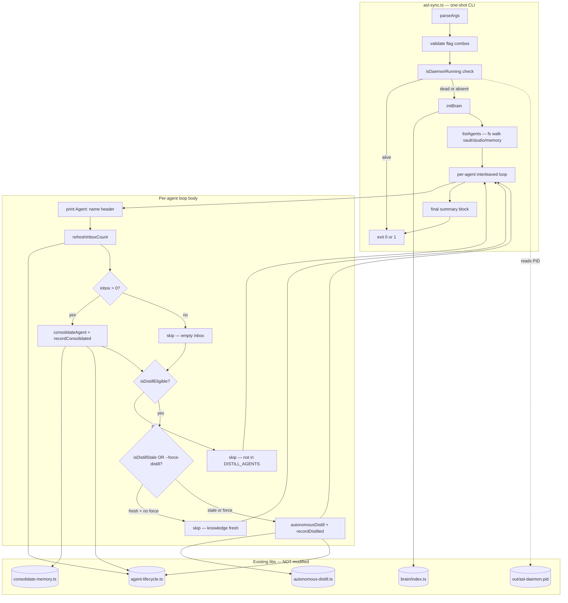
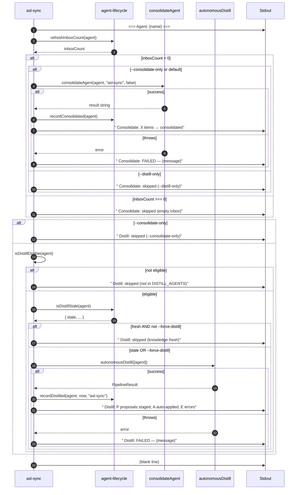

# ASL-0013 — asl-sync CLI

## TL;DR

Build a **synchronous, foreground CLI** that walks every agent under `vault/studio/memory/`, runs consolidate + distill where needed, prints a per-agent progress report, and exits. Designed as a manual catch-up mechanism for when the daemon hasn't been running, or as a force-sync before a session handoff.

This is **NOT the daemon.** The daemon (ASL-0007, shipped) handles async parallelism via task queue + worker pool. This CLI bypasses both — it imports the consolidate and distill libraries directly and calls them in-process, in alphabetical order, one agent at a time.

**Three flags do the heavy lifting:**

- `--dry-run` — show what would run, mutate nothing.
- `--agent <name>` — limit to one agent.
- `--force-distill` — run distill even if knowledge is fresh.

Plus `--consolidate-only` / `--distill-only` (mutually exclusive), `--json` (NDJSON output), `--help`.

**Hard locks:**

- **Hard refusal on running daemon.** If `out/asl-daemon.pid` is alive, exit 1 with a clear error. No override flag. The risk of two processes hitting the distill pipeline in parallel is silent state corruption — not worth it.
- **Per-agent interleaved loop**, NOT phased. For each agent: consolidate, then distill check, then distill. Then move to the next agent. Cleaner UX than two passes.
- **Per-agent error isolation.** One agent's failure does NOT abort the loop. Each phase is wrapped in try/catch. Final exit code is 1 if any errors occurred, 0 otherwise.
- **Zero task queue involvement.** No imports from `task-queue.ts`, `pool.ts`, or `file-watcher.ts`. Direct in-process calls only.

---

## Context

The ASL daemon (ASL-0001 through ASL-0007) is shipped and working end-to-end. The daemon watches `vault/studio/memory/`, enqueues tasks on file changes, and a worker pool drains them. That's the autonomous path.

But the user also needs a synchronous CLI for four explicit cases:

1. **Catching up after the daemon was off.** If the daemon hasn't been running for hours/days, inboxes pile up and knowledge files drift. A one-shot sync brings everything current immediately, no waiting for file events.
2. **Debugging the pipeline without file events.** When iterating on consolidate or distill logic, watching the file watcher trigger is slow and indirect. The CLI exercises the same code paths in-process so errors surface immediately on stdout.
3. **Force-syncing before commit / session handoff.** Before the user commits a knowledge change or hands the session to a new context, run sync once to flush pending work.
4. **Running the pipeline end-to-end with immediate feedback.** Manual smoke test of the whole consolidate → distill → soul-proposal pipeline without spinning up the daemon.

**This task is a pure CONSUMER.** Every dependency is already shipped:

- **ASL-0002** (`1f5fa1a`) — schema with `agent_lifecycle` table.
- **ASL-0003** (`d61f6fc`) — `task-queue.ts`. **NOT used by this tool.** The task queue is an async parallelism mechanism. A sync CLI doesn't need it.
- **ASL-0004** (`bab968c`) — `agent-lifecycle.ts`: `isDistillStale`, `recordConsolidated`, `recordDistilled`, `refreshInboxCount`, `refreshKnowledgeCount`. All used.
- **ASL-0005** (`55132c8`) — `file-watcher.ts`. **NOT used.** The CLI walks the filesystem directly to discover agents.
- **ASL-0006** (`a40ea77`) — extracted `consolidateAgent` from `src/tools/consolidate-memory.ts` AND extracted `DISTILL_AGENTS` + `isDistillEligible` from `src/libs/autonomous-distill.ts`. Both used.
- **ASL-0007** (`5716043`) — daemon lifecycle controller + `out/asl-daemon.pid` file + `isRunning` PID-check pattern. The CLI **reads** this PID file to enforce the safety rail.

**Read these before touching anything, in this exact order:**

1. **`src/services/self-learning-daemon/daemon.ts`** — focus on `readPid()` and `isRunning(pid)` (PID-based liveness via `process.kill(pid, 0)`). Copy this exact pattern. Do NOT clean up the PID file from the sync CLI — that's the daemon's job. Sync just reads.
2. **`src/tools/consolidate-memory.ts`** — find `export async function consolidateAgent(agent: string, reason: string, dryRun: boolean): Promise<string>` (line 176). Note that it validates `agent` against a hardcoded `AGENTS` list (line 46): `["tala", "rune", "sol", "echo", "penny", "freddie", "ryan", "mccall", "wick", "shared"]`. Any agent name not in this list throws. The sync CLI's filesystem walk MAY discover dirs not in this list (e.g., if a future agent adds a memory dir before the AGENTS list catches up) — handle that gracefully (catch + log + continue).
3. **`src/libs/autonomous-distill.ts`** — find `export const DISTILL_AGENTS` (line 37): `["tala", "rune", "sol", "echo", "penny"]`. Find `export function isDistillEligible(agent: string): boolean` (line 47). Find `export async function autonomousDistill(agents?: string[], opts?: AutonomousDistillOptions): Promise<PipelineResult>` (line 389). Note the return shape: `{ agents: AgentDistillResult[], summary: PipelineSummary }`. Per-agent applied/staged counts are derived from `agentResult.proposals.filter(p => p.action === "auto-applied").length` and `... === "staged"`.
4. **`src/libs/agent-lifecycle.ts`** — confirm exact signatures:
   - `recordConsolidated(agent: string, ts?: string): void` (line 328)
   - `recordDistilled(agent: string, ts?: string, trigger?: DistillTriggerReason): void` (line 353)
   - `refreshInboxCount(agent: string): number` (line 391)
   - `refreshKnowledgeCount(agent: string): number` (line 401)
   - `isDistillStale(agent: string): DistillStalenessResult` (line 462) — **returns an object, not a boolean**. Read `result.stale`.
5. **`src/libs/brain/index.ts`** — find `initBrain(): void`. Idempotent, safe to call once at startup.
6. **`src/libs/paths.ts`** — use `fromRoot(...segments)` for all path resolution. The vault memory dir is `fromRoot("vault", "studio", "memory")`. The PID file is `fromRoot("out", "asl-daemon.pid")`.
7. **`vault/studio/projects/autonomous-self-learning/tasks/2026-04-08-013633-ASL-0007-daemon-entry-point.md`** — task doc format reference. Match its structure (frontmatter → TL;DR → context → mermaid → goal → spec → files → acceptance criteria → defensive reflexes → manual smoke test → what NOT to do → reporting back).
8. **`src/tools/` directory layout** — confirm where new tools go. The tool runner auto-discovers `src/tools/*.ts`. Drop `asl-sync.ts` in there and it's available as `bun run tool asl-sync`.

**Also worth skimming:**

- `src/services/self-learning-daemon/__tests__/index.test.ts` (from ASL-0007) — for the DI mocking pattern. The sync CLI uses the same factory + deps-object approach.

---

## Architecture diagram



**Legend:**

- Solid arrows = control/data flow.
- Dashed arrows = read-only filesystem access.
- The CLI does NOT touch task-queue, pool, or file-watcher. Loose coupling preserved at the daemon layer (ASL-0007 owns composition); the sync CLI is a separate composition surface for the same underlying libraries.

---

## Per-agent loop sequence



**Why per-agent interleaved, not phased:**

A phased approach (consolidate ALL agents → distill ALL agents) means the user sees a wall of consolidate output, then a wall of distill output. Reading the summary requires cross-referencing two passes. Interleaved means each agent is a self-contained block: `tala: done. rune: done. shared: done.` Linear scrolling. The user explicitly confirmed this UX preference.

---

## Goal

After this task ships:

1. `src/tools/asl-sync.ts` exists as a CLI tool, callable via `bun run tool asl-sync` and `npm run asl:sync`.
2. Running `npm run asl:sync` walks every agent in `vault/studio/memory/`, runs consolidate where the inbox has items, runs distill where eligible and stale, prints a human-readable per-agent report, and exits 0 (or 1 on errors).
3. Running `npm run asl:sync` while the ASL daemon is running fails fast with a clear error message and exits 1. **No override flag exists.**
4. `--dry-run` shows what WOULD run without mutating anything (no consolidate, no distill, no lifecycle updates, no DB writes).
5. `--agent <name>` limits processing to a single agent.
6. `--consolidate-only` skips the distill phase for all agents. `--distill-only` skips the consolidate phase. The two flags are mutually exclusive — passing both is an error.
7. `--force-distill` runs distill even when `isDistillStale` reports the knowledge dir is fresh.
8. `--json` emits NDJSON output: one JSON object per agent followed by a final summary object. Human-readable headers are suppressed in JSON mode.
9. `--help` prints the flag list and exits 0.
10. Per-agent error isolation: a thrown consolidate or distill error is caught, logged, and the loop continues. Final exit code is 1 if any errors occurred, 0 otherwise.
11. The CLI honors SIGINT (Ctrl-C) by printing a partial summary of work completed so far and exiting 130.
12. `src/tools/__tests__/asl-sync.test.ts` exists with 14-16 unit tests covering daemon-running refusal, dry-run no-mutation, flag combinations, per-agent error isolation, and JSON output shape. **Zero real DB writes, zero real consolidate, zero real distill, zero real filesystem mutations.** All deps injected via DI.
13. `package.json` has exactly one new script: `"asl:sync": "bun run tool asl-sync"`, placed immediately after `asl:status`.
14. Zero new npm dependencies. Zero modifications to forbidden files (see §What NOT to do).

---

## Detailed specification

### Part 1 — `src/tools/asl-sync.ts` (NEW)

**File header comment:**

```ts
/**
 * asl-sync.ts — One-shot synchronous catch-up tool for the ASL self-learning pipeline.
 *
 * NOT the daemon. NOT the worker pool. NOT the file watcher.
 *
 * Walks every agent in vault/studio/memory/, runs consolidate + distill where
 * needed, prints a per-agent report, exits. Designed for:
 *   - Catching up after the daemon was off
 *   - Debugging the pipeline without waiting for file events
 *   - Force-syncing before a commit or session handoff
 *
 * SAFETY RAIL: Refuses to run if the ASL daemon is alive (out/asl-daemon.pid
 * exists AND the PID is responsive). The risk of two processes hitting the
 * distill pipeline in parallel is silent state corruption — not worth a
 * --force-anyway flag.
 *
 * This file does NOT:
 *   - Import task-queue.ts, pool.ts, or file-watcher.ts
 *   - Spawn child processes
 *   - Call enqueueTask / claimNextTask / any task-queue function
 *   - Touch the agent_lifecycle table directly via SQL (uses lifecycle helpers)
 *   - Shell out to `bun run tool consolidate-memory` (calls the function in-process)
 */
```

**Imports (exact):**

```ts
import { existsSync, readdirSync, readFileSync, statSync } from "fs";
import { join } from "path";
import { initBrain } from "../libs/brain/index.js";
import { fromRoot } from "../libs/paths.js";
import { consolidateAgent } from "./consolidate-memory.js";
import {
  autonomousDistill,
  isDistillEligible,
  type PipelineResult,
} from "../libs/autonomous-distill.js";
import {
  isDistillStale,
  recordConsolidated,
  recordDistilled,
  refreshInboxCount,
  refreshKnowledgeCount,
} from "../libs/agent-lifecycle.js";
```

**Constants:**

```ts
const PID_FILE = fromRoot("out", "asl-daemon.pid");
const VAULT_MEMORY_DIR = fromRoot("vault", "studio", "memory");
const EXCLUDED_DIRS = new Set(["raw", "archive"]);

// Sentinel agent name returned by the discovery walk that means "treat as a
// real agent for consolidate purposes". `shared` is included; `raw` and
// `archive` are not.
```

**Public types (exported for tests):**

```ts
/**
 * Per-agent result. One row per agent processed. Used both for the human-
 * readable printer and the --json NDJSON output.
 */
export interface AgentSyncResult {
  agent: string;
  consolidate: ConsolidatePhaseResult;
  distill: DistillPhaseResult;
}

export interface ConsolidatePhaseResult {
  /** True if the consolidate function was actually invoked. False if skipped. */
  ran: boolean;
  /** Inbox count read at the start of the phase. null if --distill-only. */
  inboxCount: number | null;
  /** Skip reason for the human printer. null if ran. */
  skipReason: "empty-inbox" | "distill-only" | "dry-run-skipped" | null;
  /** Error message if the call threw. null on success. */
  error: string | null;
}

export interface DistillPhaseResult {
  /** True if autonomousDistill was actually invoked. False if skipped. */
  ran: boolean;
  /** Result of isDistillEligible. */
  eligible: boolean;
  /** Result of isDistillStale.stale. null if eligible=false. */
  stale: boolean | null;
  /** Number of proposals staged. 0 if not ran. */
  proposalsStaged: number;
  /** Number of proposals auto-applied. 0 if not ran. */
  autoApplied: number;
  /** Number of errors reported by the pipeline. 0 if not ran. */
  pipelineErrors: number;
  /** Skip reason for the human printer. null if ran or eligible=true. */
  skipReason: "not-eligible" | "knowledge-fresh" | "consolidate-only" | "dry-run-skipped" | null;
  /** Error message if the call threw. null on success. */
  error: string | null;
}

export interface SyncSummary {
  agentsProcessed: number;
  consolidatesRun: number;
  distillsRun: number;
  errors: number;
  durationMs: number;
}

export interface SyncFlags {
  dryRun: boolean;
  agent: string | null;
  consolidateOnly: boolean;
  distillOnly: boolean;
  forceDistill: boolean;
  json: boolean;
  help: boolean;
}

/**
 * DI options for runSync. Production resolves all defaults. Tests inject mocks
 * so no real consolidate, no real distill, no real DB writes, no real filesystem
 * walk.
 */
export interface RunSyncDeps {
  initBrainFn: () => void;
  consolidateAgentFn: typeof consolidateAgent;
  autonomousDistillFn: typeof autonomousDistill;
  isDistillEligibleFn: typeof isDistillEligible;
  isDistillStaleFn: typeof isDistillStale;
  recordConsolidatedFn: typeof recordConsolidated;
  recordDistilledFn: typeof recordDistilled;
  refreshInboxCountFn: typeof refreshInboxCount;
  refreshKnowledgeCountFn: typeof refreshKnowledgeCount;
  /** Walks vault/studio/memory and returns sorted agent list. Test override. */
  listAgentsFn: () => string[];
  /** Reads out/asl-daemon.pid and returns liveness. Test override. */
  isDaemonRunningFn: () => { running: boolean; pid: number | null };
  /** Stdout writer. Test override captures lines instead of printing. */
  logFn: (msg: string) => void;
  /** ISO timestamp. Test override returns a fixed value. */
  nowFn: () => string;
}

export interface RunSyncResult {
  exitCode: 0 | 1 | 130;
  summary: SyncSummary;
  agents: AgentSyncResult[];
}
```

**Factory: `runSync(flags: SyncFlags, deps: RunSyncDeps): Promise<RunSyncResult>`**

This is the testable core. The `import.meta.main` bootstrap parses argv, builds default `deps`, and calls `runSync`. Tests build mock `deps` and call `runSync` directly with synthetic flags.

Pseudocode shape (NOT production code — Ryan writes the real thing):

```ts
export async function runSync(flags: SyncFlags, deps: RunSyncDeps): Promise<RunSyncResult> {
  const startTime = Date.now();

  // ── 1. Safety check — daemon must not be running ───────────────────────────
  const daemonStatus = deps.isDaemonRunningFn();
  if (daemonStatus.running) {
    deps.logFn(
      `ERROR: ASL daemon is running (PID: ${daemonStatus.pid}).\n` +
      `Running asl-sync while the daemon is active can corrupt pipeline state\n` +
      `(parallel distill runs, staged proposal races, task queue double-claims).\n` +
      `\n` +
      `Stop the daemon first:\n` +
      `  npm run asl:stop\n` +
      `\n` +
      `Then re-run:\n` +
      `  npm run asl:sync`
    );
    return {
      exitCode: 1,
      summary: { agentsProcessed: 0, consolidatesRun: 0, distillsRun: 0, errors: 1, durationMs: Date.now() - startTime },
      agents: [],
    };
  }

  // ── 2. initBrain (once) ────────────────────────────────────────────────────
  if (!flags.dryRun) {
    deps.initBrainFn();
  }

  // ── 3. Discover agents ─────────────────────────────────────────────────────
  let agents = deps.listAgentsFn();
  if (flags.agent) {
    if (!agents.includes(flags.agent)) {
      deps.logFn(`ERROR: agent "${flags.agent}" not found in vault/studio/memory/`);
      return { exitCode: 1, summary: { agentsProcessed: 0, ... }, agents: [] };
    }
    agents = [flags.agent];
  }

  if (agents.length === 0) {
    deps.logFn(flags.json ? JSON.stringify({ type: "summary", agentsProcessed: 0, ... }) : "No agents to process.");
    return { exitCode: 0, summary: { ... }, agents: [] };
  }

  // ── 4. Print header ────────────────────────────────────────────────────────
  if (!flags.json) {
    deps.logFn(`ASL Sync — ${deps.nowFn()}\n`);
  }

  // ── 5. Per-agent loop ──────────────────────────────────────────────────────
  const results: AgentSyncResult[] = [];
  let consolidatesRun = 0;
  let distillsRun = 0;
  let totalErrors = 0;

  for (const agent of agents) {
    if (!flags.json) deps.logFn(`=== Agent: ${agent} ===`);

    const consolidateResult = await runConsolidatePhase(agent, flags, deps);
    if (consolidateResult.ran) consolidatesRun++;
    if (consolidateResult.error) totalErrors++;

    const distillResult = await runDistillPhase(agent, flags, deps);
    if (distillResult.ran) distillsRun++;
    if (distillResult.error) totalErrors++;
    totalErrors += distillResult.pipelineErrors;

    const agentResult: AgentSyncResult = {
      agent,
      consolidate: consolidateResult,
      distill: distillResult,
    };
    results.push(agentResult);

    if (flags.json) {
      deps.logFn(JSON.stringify({ type: "agent", ...agentResult }));
    } else {
      deps.logFn(""); // blank line between agents
    }
  }

  // ── 6. Final summary ───────────────────────────────────────────────────────
  const summary: SyncSummary = {
    agentsProcessed: results.length,
    consolidatesRun,
    distillsRun,
    errors: totalErrors,
    durationMs: Date.now() - startTime,
  };

  if (flags.json) {
    deps.logFn(JSON.stringify({ type: "summary", ...summary }));
  } else {
    deps.logFn(`=== Summary ===`);
    deps.logFn(`Agents processed: ${summary.agentsProcessed}`);
    deps.logFn(`Consolidates run: ${summary.consolidatesRun}`);
    deps.logFn(`Distills run:     ${summary.distillsRun}`);
    deps.logFn(`Errors:           ${summary.errors}`);
    deps.logFn(`Duration:         ${summary.durationMs}ms`);
    deps.logFn(totalErrors === 0 ? `\nCompleted successfully.` : `\nCompleted with errors.`);
  }

  return {
    exitCode: totalErrors === 0 ? 0 : 1,
    summary,
    agents: results,
  };
}
```

**Helper: `runConsolidatePhase`**

```ts
async function runConsolidatePhase(
  agent: string,
  flags: SyncFlags,
  deps: RunSyncDeps,
): Promise<ConsolidatePhaseResult> {
  // --distill-only short-circuit
  if (flags.distillOnly) {
    if (!flags.json) deps.logFn(`  Consolidate: skipped (--distill-only)`);
    return { ran: false, inboxCount: null, skipReason: "distill-only", error: null };
  }

  // Read inbox count (this also touches the lifecycle row as a side effect — that's fine)
  const inboxCount = deps.refreshInboxCountFn(agent);

  if (inboxCount === 0) {
    if (!flags.json) deps.logFn(`  Consolidate: skipped (empty inbox)`);
    return { ran: false, inboxCount: 0, skipReason: "empty-inbox", error: null };
  }

  if (flags.dryRun) {
    if (!flags.json) deps.logFn(`  Consolidate: would consolidate ${inboxCount} inbox items (dry-run)`);
    return { ran: false, inboxCount, skipReason: "dry-run-skipped", error: null };
  }

  try {
    await deps.consolidateAgentFn(agent, "asl-sync", false);
    deps.recordConsolidatedFn(agent);
    if (!flags.json) deps.logFn(`  Consolidate: ${inboxCount} inbox items → consolidated`);
    return { ran: true, inboxCount, skipReason: null, error: null };
  } catch (err) {
    const msg = err instanceof Error ? err.message : String(err);
    if (!flags.json) deps.logFn(`  Consolidate: FAILED — ${msg}`);
    return { ran: false, inboxCount, skipReason: null, error: msg };
  }
}
```

**Helper: `runDistillPhase`**

```ts
async function runDistillPhase(
  agent: string,
  flags: SyncFlags,
  deps: RunSyncDeps,
): Promise<DistillPhaseResult> {
  // --consolidate-only short-circuit
  if (flags.consolidateOnly) {
    if (!flags.json) deps.logFn(`  Distill: skipped (--consolidate-only)`);
    return {
      ran: false, eligible: deps.isDistillEligibleFn(agent), stale: null,
      proposalsStaged: 0, autoApplied: 0, pipelineErrors: 0,
      skipReason: "consolidate-only", error: null,
    };
  }

  const eligible = deps.isDistillEligibleFn(agent);
  if (!eligible) {
    if (!flags.json) deps.logFn(`  Distill: skipped (not in DISTILL_AGENTS)`);
    return {
      ran: false, eligible: false, stale: null,
      proposalsStaged: 0, autoApplied: 0, pipelineErrors: 0,
      skipReason: "not-eligible", error: null,
    };
  }

  const staleResult = deps.isDistillStaleFn(agent);
  const isStale = staleResult.stale;

  if (!isStale && !flags.forceDistill) {
    if (!flags.json) deps.logFn(`  Distill: skipped (knowledge fresh)`);
    return {
      ran: false, eligible: true, stale: false,
      proposalsStaged: 0, autoApplied: 0, pipelineErrors: 0,
      skipReason: "knowledge-fresh", error: null,
    };
  }

  if (flags.dryRun) {
    if (!flags.json) deps.logFn(`  Distill: would run distill (${flags.forceDistill ? "forced" : "stale"}) (dry-run)`);
    return {
      ran: false, eligible: true, stale: isStale,
      proposalsStaged: 0, autoApplied: 0, pipelineErrors: 0,
      skipReason: "dry-run-skipped", error: null,
    };
  }

  try {
    const result: PipelineResult = await deps.autonomousDistillFn([agent]);
    // Per-agent counts: pipeline returns one PipelineResult for the [agent]
    // single-element array, so result.summary is what we want.
    const proposalsStaged = result.summary.staged;
    const autoApplied = result.summary.autoApplied;
    const pipelineErrors = result.summary.errors;
    deps.recordDistilledFn(agent, deps.nowFn(), "asl-sync");
    if (!flags.json) {
      deps.logFn(`  Distill: ${proposalsStaged} proposals staged, ${autoApplied} auto-applied, ${pipelineErrors} errors`);
    }
    return {
      ran: true, eligible: true, stale: isStale,
      proposalsStaged, autoApplied, pipelineErrors,
      skipReason: null, error: null,
    };
  } catch (err) {
    const msg = err instanceof Error ? err.message : String(err);
    if (!flags.json) deps.logFn(`  Distill: FAILED — ${msg}`);
    return {
      ran: false, eligible: true, stale: isStale,
      proposalsStaged: 0, autoApplied: 0, pipelineErrors: 0,
      skipReason: null, error: msg,
    };
  }
}
```

**Default `listAgentsFn` implementation:**

```ts
function defaultListAgents(): string[] {
  if (!existsSync(VAULT_MEMORY_DIR)) return [];
  const entries = readdirSync(VAULT_MEMORY_DIR);
  const agents: string[] = [];
  for (const name of entries) {
    if (name.startsWith(".")) continue;        // skip dotfiles / .DS_Store
    if (EXCLUDED_DIRS.has(name)) continue;     // raw, archive
    const full = join(VAULT_MEMORY_DIR, name);
    try {
      if (!statSync(full).isDirectory()) continue;
    } catch {
      continue;
    }
    agents.push(name);
  }
  return agents.sort();
}
```

**Default `isDaemonRunningFn` implementation (copy from ASL-0007 daemon.ts pattern):**

```ts
function defaultIsDaemonRunning(): { running: boolean; pid: number | null } {
  if (!existsSync(PID_FILE)) return { running: false, pid: null };
  try {
    const raw = readFileSync(PID_FILE, "utf-8").trim();
    const pid = Number.parseInt(raw, 10);
    if (!Number.isFinite(pid) || pid <= 0) return { running: false, pid: null };
    try {
      process.kill(pid, 0);
      return { running: true, pid };
    } catch {
      // Stale PID. Do NOT clean it up — that's daemon.ts's job.
      return { running: false, pid };
    }
  } catch {
    return { running: false, pid: null };
  }
}
```

**Argument parser:**

```ts
function parseArgs(argv: string[]): SyncFlags {
  const flags: SyncFlags = {
    dryRun: false,
    agent: null,
    consolidateOnly: false,
    distillOnly: false,
    forceDistill: false,
    json: false,
    help: false,
  };
  for (let i = 0; i < argv.length; i++) {
    const arg = argv[i];
    switch (arg) {
      case "--dry-run": flags.dryRun = true; break;
      case "--consolidate-only": flags.consolidateOnly = true; break;
      case "--distill-only": flags.distillOnly = true; break;
      case "--force-distill": flags.forceDistill = true; break;
      case "--json": flags.json = true; break;
      case "--help":
      case "-h": flags.help = true; break;
      case "--agent": {
        const next = argv[i + 1];
        if (!next || next.startsWith("--")) {
          throw new Error(`--agent requires a value`);
        }
        flags.agent = next;
        i++;
        break;
      }
      default:
        throw new Error(`Unknown flag: ${arg}`);
    }
  }
  return flags;
}

function validateFlags(flags: SyncFlags): string | null {
  if (flags.consolidateOnly && flags.distillOnly) {
    return `--consolidate-only and --distill-only are mutually exclusive`;
  }
  return null;
}

function printHelp(logFn: (msg: string) => void): void {
  logFn(`asl-sync — One-shot synchronous catch-up tool for the ASL self-learning pipeline.

Usage:
  bun run tool asl-sync [options]
  npm run asl:sync -- [options]

Options:
  --dry-run             Show what would run without mutating anything
  --agent <name>        Limit to a single agent
  --consolidate-only    Skip the distill phase for all agents
  --distill-only        Skip the consolidate phase for all agents
  --force-distill       Run distill even if knowledge is fresh
  --json                Emit NDJSON output (one object per agent + summary)
  --help, -h            Show this help and exit

Safety:
  Refuses to run if the ASL daemon is alive (out/asl-daemon.pid is responsive).
  Stop the daemon with 'npm run asl:stop' first.
`);
}
```

**Production main (bootstrap — runs only under `import.meta.main`):**

```ts
if (import.meta.main) {
  let flags: SyncFlags;
  try {
    flags = parseArgs(process.argv.slice(2));
  } catch (err) {
    process.stderr.write(`${err instanceof Error ? err.message : String(err)}\n`);
    process.exit(1);
  }

  if (flags.help) {
    printHelp((msg) => process.stdout.write(msg + "\n"));
    process.exit(0);
  }

  const validationError = validateFlags(flags);
  if (validationError) {
    process.stderr.write(`ERROR: ${validationError}\n`);
    process.exit(1);
  }

  // SIGINT handler for partial-summary on Ctrl-C
  let shuttingDown = false;
  let agentsCompleted = 0;
  let consolidatesRunSoFar = 0;
  let distillsRunSoFar = 0;
  let errorsSoFar = 0;
  const startTime = Date.now();

  process.on("SIGINT", () => {
    if (shuttingDown) return;
    shuttingDown = true;
    process.stdout.write(
      `\n=== Interrupted ===\n` +
      `Agents processed: ${agentsCompleted}\n` +
      `Consolidates run: ${consolidatesRunSoFar}\n` +
      `Distills run:     ${distillsRunSoFar}\n` +
      `Errors:           ${errorsSoFar}\n` +
      `Duration:         ${Date.now() - startTime}ms\n` +
      `\nReceived SIGINT, exiting.\n`
    );
    process.exit(130);
  });

  // Note: the runSync function does NOT update the SIGINT counters above.
  // The simplest correct approach is to wrap the deps.logFn so the bootstrap
  // increments counters when it sees the relevant log lines, OR to make
  // runSync emit a per-agent callback. Pick one. Document the choice in
  // your reporting back. RECOMMENDATION: pass an `onAgentComplete` callback
  // through deps so the bootstrap can update the counters cleanly.

  const deps: RunSyncDeps = {
    initBrainFn: initBrain,
    consolidateAgentFn: consolidateAgent,
    autonomousDistillFn: autonomousDistill,
    isDistillEligibleFn: isDistillEligible,
    isDistillStaleFn: isDistillStale,
    recordConsolidatedFn: recordConsolidated,
    recordDistilledFn: recordDistilled,
    refreshInboxCountFn: refreshInboxCount,
    refreshKnowledgeCountFn: refreshKnowledgeCount,
    listAgentsFn: defaultListAgents,
    isDaemonRunningFn: defaultIsDaemonRunning,
    logFn: (msg: string) => process.stdout.write(msg + "\n"),
    nowFn: () => new Date().toISOString(),
  };

  runSync(flags, deps).then((result) => {
    process.exit(result.exitCode);
  }).catch((err) => {
    process.stderr.write(`FATAL: ${err instanceof Error ? err.stack ?? err.message : String(err)}\n`);
    process.exit(1);
  });
}
```

**Note on the SIGINT counter sync:** the cleanest solution is an optional `onAgentComplete?: (result: AgentSyncResult) => void` callback in `RunSyncDeps`, which the bootstrap wires to update the closure counters. Tests pass a no-op (or assert it was called). This avoids parsing log lines and avoids racing with the main loop.

---

### Part 2 — `src/tools/__tests__/asl-sync.test.ts` (NEW)

Unit tests with full DI mocking. **No real consolidate, no real distill, no real DB writes, no real filesystem walk.** Match the ASL-0007 `index.test.ts` style.

**Mock builders (sketched — Ryan implements):**

```ts
import { describe, test, expect, mock } from "bun:test";
import { runSync, type RunSyncDeps, type SyncFlags } from "../asl-sync.js";

function buildFlags(overrides: Partial<SyncFlags> = {}): SyncFlags {
  return {
    dryRun: false,
    agent: null,
    consolidateOnly: false,
    distillOnly: false,
    forceDistill: false,
    json: false,
    help: false,
    ...overrides,
  };
}

function buildDeps(overrides: Partial<RunSyncDeps> = {}): RunSyncDeps & { _logs: string[] } {
  const logs: string[] = [];
  const deps: RunSyncDeps = {
    initBrainFn: mock(() => {}),
    consolidateAgentFn: mock(async () => "ok"),
    autonomousDistillFn: mock(async () => ({
      agents: [{ agent: "tala", skipped: false, proposals: [] }],
      summary: { totalProposals: 0, autoApplied: 0, staged: 0, skippedAgents: 0, errors: 0, durationMs: 100 },
    })),
    isDistillEligibleFn: mock((a: string) => ["tala", "rune", "sol", "echo", "penny"].includes(a)),
    isDistillStaleFn: mock((a: string) => ({ agent: a, stale: false, currentHash: "h", storedHash: "h" })),
    recordConsolidatedFn: mock(() => {}),
    recordDistilledFn: mock(() => {}),
    refreshInboxCountFn: mock(() => 0),
    refreshKnowledgeCountFn: mock(() => 0),
    listAgentsFn: mock(() => []),
    isDaemonRunningFn: mock(() => ({ running: false, pid: null })),
    logFn: (msg: string) => { logs.push(msg); },
    nowFn: mock(() => "2026-04-08T02:22:25.000Z"),
    ...overrides,
  };
  return Object.assign(deps, { _logs: logs });
}
```

**Test cases (minimum 14):**

1. **T1. Daemon running → hard refusal with exit code 1.**
   - `isDaemonRunningFn` returns `{ running: true, pid: 12345 }`.
   - `listAgentsFn` returns `["tala"]` (should be irrelevant — never reached).
   - Assert `result.exitCode === 1`.
   - Assert log contains `"ASL daemon is running (PID: 12345)"` and `"npm run asl:stop"`.
   - Assert `consolidateAgentFn`, `autonomousDistillFn`, `initBrainFn` were NOT called.

2. **T2. Daemon PID file exists but process is dead → proceed normally.**
   - `isDaemonRunningFn` returns `{ running: false, pid: 12345 }` (stale).
   - `listAgentsFn` returns `["tala"]`, `refreshInboxCountFn` returns 0, `isDistillStaleFn` returns `{ stale: false, ... }`.
   - Assert `result.exitCode === 0`, `initBrainFn` called, agent processed.

3. **T3. Empty agent list → "no agents" summary, exit 0.**
   - `listAgentsFn` returns `[]`.
   - Assert `result.exitCode === 0`, `result.summary.agentsProcessed === 0`.
   - Assert log contains `"No agents to process"`.

4. **T4. Single agent, empty inbox, not stale → both phases skipped, 0 errors, exit 0.**
   - `listAgentsFn` returns `["tala"]`, `refreshInboxCountFn` returns 0, `isDistillEligibleFn` returns true, `isDistillStaleFn` returns `{ stale: false, ... }`.
   - Assert `consolidateAgentFn` NOT called, `autonomousDistillFn` NOT called.
   - Assert log contains `"Consolidate: skipped (empty inbox)"` and `"Distill: skipped (knowledge fresh)"`.
   - Assert `result.summary.consolidatesRun === 0`, `result.summary.distillsRun === 0`.

5. **T5. Single agent, inbox items, not stale → consolidate runs, distill skipped.**
   - `refreshInboxCountFn` returns 3, `isDistillEligibleFn` true, `isDistillStaleFn` returns `{ stale: false, ... }`.
   - Assert `consolidateAgentFn` called with `("tala", "asl-sync", false)`.
   - Assert `recordConsolidatedFn` called with `"tala"`.
   - Assert `autonomousDistillFn` NOT called.
   - Assert log contains `"3 inbox items → consolidated"`.

6. **T6. Single agent, inbox items, stale, eligible → consolidate AND distill run.**
   - `refreshInboxCountFn` returns 2, `isDistillEligibleFn` true, `isDistillStaleFn` returns `{ stale: true, ... }`.
   - `autonomousDistillFn` returns summary with `staged: 2, autoApplied: 1, errors: 0`.
   - Assert both `consolidateAgentFn` and `autonomousDistillFn` called.
   - Assert `recordConsolidatedFn` and `recordDistilledFn` called (with `"asl-sync"` trigger).
   - Assert log contains `"2 proposals staged, 1 auto-applied, 0 errors"`.

7. **T7. Single agent, inbox items, NOT eligible → consolidate runs, distill skipped with not-eligible reason.**
   - `refreshInboxCountFn` returns 1, `isDistillEligibleFn` returns false.
   - Assert `consolidateAgentFn` called.
   - Assert `isDistillStaleFn` NEVER called (short-circuited by eligibility check).
   - Assert log contains `"not in DISTILL_AGENTS"`.

8. **T8. `--force-distill` with not-stale, eligible → distill runs anyway.**
   - `flags.forceDistill = true`, `isDistillStaleFn` returns `{ stale: false, ... }`.
   - Assert `autonomousDistillFn` IS called.

9. **T9. `--consolidate-only` → distill phase skipped entirely.**
   - `flags.consolidateOnly = true`, `refreshInboxCountFn` returns 1.
   - Assert `consolidateAgentFn` called.
   - Assert `isDistillStaleFn` NEVER called.
   - Assert `autonomousDistillFn` NEVER called.
   - Assert log contains `"Distill: skipped (--consolidate-only)"`.

10. **T10. `--distill-only` → consolidate phase skipped entirely.**
    - `flags.distillOnly = true`, `isDistillEligibleFn` true, `isDistillStaleFn` returns `{ stale: true, ... }`.
    - Assert `consolidateAgentFn` NEVER called.
    - Assert `refreshInboxCountFn` NEVER called.
    - Assert `autonomousDistillFn` IS called.
    - Assert log contains `"Consolidate: skipped (--distill-only)"`.

11. **T11. `--agent tala` → only tala processed.**
    - `listAgentsFn` returns `["echo", "rune", "shared", "tala"]`, `flags.agent = "tala"`.
    - Assert exactly one agent in `result.agents` with name `"tala"`.
    - Assert other agents' names not present in any log line.

12. **T12. `--agent unknown` → error and exit 1.**
    - `listAgentsFn` returns `["tala"]`, `flags.agent = "unknown"`.
    - Assert `result.exitCode === 1`.
    - Assert log contains `"agent \"unknown\" not found"`.
    - Assert no consolidate or distill calls.

13. **T13. `--dry-run` → no mutations, but logs "would" messages.**
    - `flags.dryRun = true`, `refreshInboxCountFn` returns 2, `isDistillStaleFn` returns `{ stale: true, ... }`.
    - Assert `consolidateAgentFn` NEVER called.
    - Assert `autonomousDistillFn` NEVER called.
    - Assert `recordConsolidatedFn` NEVER called.
    - Assert `recordDistilledFn` NEVER called.
    - Assert `initBrainFn` NEVER called (dry-run is read-only).
    - Assert log contains `"would consolidate 2 inbox items"` and `"would run distill"`.

14. **T14. Consolidate throws → caught, distill phase still runs, exit 1.**
    - `refreshInboxCountFn` returns 1, `consolidateAgentFn` throws `new Error("boom")`.
    - `isDistillEligibleFn` true, `isDistillStaleFn` returns `{ stale: true, ... }`, `autonomousDistillFn` resolves normally.
    - Assert `autonomousDistillFn` IS called (loop continued past the consolidate error).
    - Assert log contains `"Consolidate: FAILED — boom"`.
    - Assert `result.exitCode === 1`.
    - Assert `result.summary.errors >= 1`.

15. **T15. Distill throws → caught, loop continues to next agent, exit 1.**
    - `listAgentsFn` returns `["tala", "rune"]`, both with inbox 1, both eligible + stale.
    - `autonomousDistillFn` throws on first call, succeeds on second.
    - Assert both agents appear in `result.agents`.
    - Assert `consolidateAgentFn` called twice.
    - Assert `result.exitCode === 1`.

16. **T16. Mutually exclusive flags → validation error (covered by `validateFlags`, tested directly).**
    - Call `validateFlags({ ...defaults, consolidateOnly: true, distillOnly: true })`.
    - Assert returns a non-null string mentioning both flag names.

17. **T17. `--json` output shape: each agent emits a JSON object, then a summary.**
    - `flags.json = true`, `listAgentsFn` returns `["tala"]`, `refreshInboxCountFn` returns 0, `isDistillEligibleFn` true, `isDistillStaleFn` `{ stale: false, ... }`.
    - Assert at least 2 log lines: one parses to `{ type: "agent", agent: "tala", ... }`, one parses to `{ type: "summary", agentsProcessed: 1, ... }`.
    - Assert NO human-readable headers (`"=== Agent:"`, `"=== Summary ==="`) appear in any log line.

18. **T18. (Optional, recommended) `parseArgs` round-trips a representative argv.**
    - `parseArgs(["--dry-run", "--agent", "tala", "--json"])` → flags object has `dryRun: true, agent: "tala", json: true`.
    - `parseArgs(["--agent"])` throws (missing value).
    - `parseArgs(["--bogus"])` throws (unknown flag).

**Test prefix:** `__asl_0013_test__` for any DB rows. **Expected: zero DB writes** (fully mocked). If anything touches the real DB during tests, that's a bug in the test — fix the mock, don't add a cleanup hook.

**Bun test Windows segfault reflex:** if `bun test src/tools/__tests__/asl-sync.test.ts` segfaults (known issue — see auto-memory "Bun test broken on Windows"), fall back to `bun run src/tools/__tests__/asl-sync.test.ts` and verify the file has a bootstrap that runs the suite directly. Document the fallback in the reporting back section.

---

### Part 3 — `package.json` (MODIFY)

Add exactly one script. Placement: immediately after the existing `asl:status` line.

```json
"asl:sync": "bun run tool asl-sync"
```

No other changes. No new dependencies. No devDependencies.

---

## Files in scope

- `src/tools/asl-sync.ts` — **NEW** — ~450-550 lines (factory, helpers, parser, bootstrap)
- `src/tools/__tests__/asl-sync.test.ts` — **NEW** — ~400-500 lines (16-18 tests)
- `package.json` — **MODIFIED** — +1 line (`asl:sync` script)

**Total new code:** ~850-1050 lines across 2 files + 1 line in package.json.

---

## Acceptance criteria

1. `src/tools/asl-sync.ts` exists and exports `runSync`, `parseArgs`, `validateFlags`, `printHelp`, `SyncFlags`, `RunSyncDeps`, `RunSyncResult`, `AgentSyncResult`, `ConsolidatePhaseResult`, `DistillPhaseResult`, `SyncSummary`.
2. `src/tools/asl-sync.ts` has an `import.meta.main` bootstrap that:
   a. Parses argv via `parseArgs`.
   b. Handles `--help` by printing usage and exiting 0.
   c. Validates flag combinations via `validateFlags`; on error writes to stderr and exits 1.
   d. Installs a SIGINT handler that prints a partial summary and exits 130.
   e. Builds the production `RunSyncDeps` (real `initBrain`, real `consolidateAgent`, real `autonomousDistill`, real lifecycle helpers, real `defaultListAgents`, real `defaultIsDaemonRunning`, stdout `logFn`, ISO `nowFn`).
   f. Calls `runSync(flags, deps)` and exits with `result.exitCode`.
   g. Catches uncaught rejections from `runSync` and writes them to stderr with exit 1.
3. The hard refusal on a running daemon is the FIRST check inside `runSync`, BEFORE `initBrain`, BEFORE the agent walk. If the daemon is alive, return immediately with exit code 1.
4. The error message for the running-daemon refusal includes: the PID, the phrase "ASL daemon is running", a one-sentence explanation of WHY (state corruption), the exact command to stop the daemon (`npm run asl:stop`), and the exact command to retry (`npm run asl:sync`).
5. There is NO override flag for the running-daemon refusal. (grep audit: no `--force-anyway`, no `--ignore-daemon`, no `--unsafe`, no comments suggesting one exists.)
6. The agent loop is per-agent interleaved (consolidate → distill check → distill, then next agent). NOT phased (consolidate all → distill all). (grep audit: only one `for (const agent of agents)` loop in `runSync`.)
7. Per-agent error isolation: a thrown error in `consolidateAgentFn` does NOT prevent the distill phase from running for the same agent, and does NOT prevent the loop from continuing to the next agent.
8. Per-agent error isolation: a thrown error in `autonomousDistillFn` does NOT prevent the loop from continuing to the next agent.
9. Final exit code is 0 if `summary.errors === 0`, otherwise 1.
10. `--dry-run` results in ZERO calls to `consolidateAgentFn`, `autonomousDistillFn`, `recordConsolidatedFn`, `recordDistilledFn`, AND `initBrainFn`. The dry-run mode is fully read-only. (Test T13 asserts this.)
11. `--consolidate-only` and `--distill-only` are mutually exclusive. Passing both fails validation.
12. `--consolidate-only` results in ZERO calls to `isDistillStaleFn` and `autonomousDistillFn`.
13. `--distill-only` results in ZERO calls to `refreshInboxCountFn` and `consolidateAgentFn`.
14. `--force-distill` causes `autonomousDistillFn` to be invoked even when `isDistillStaleFn` returns `{ stale: false, ... }`.
15. `--agent <name>` limits processing to a single agent. If the name is not in the discovered agent list, exit 1 with a clear error and ZERO consolidate/distill calls.
16. `--json` mode emits NDJSON: one `{ type: "agent", ... }` object per agent followed by exactly one `{ type: "summary", ... }` object. NO human-readable headers (`"=== Agent:"`, `"=== Summary ==="`, blank lines between agents) appear in JSON mode.
17. The default `listAgentsFn` walks `vault/studio/memory/`, excludes `raw` and `archive`, excludes dotfiles, returns the list sorted alphabetically.
18. The default `isDaemonRunningFn` reads `out/asl-daemon.pid`, parses the PID, calls `process.kill(pid, 0)`, returns `{ running: true, pid }` on success or `{ running: false, pid }` on a stale PID. **Does NOT delete the stale PID file** — that's daemon.ts's job.
19. The CLI does NOT import from `src/libs/task-queue.ts`, `src/services/self-learning-daemon/pool.ts`, `src/services/self-learning-daemon/worker.ts`, or `src/libs/file-watcher.ts`. (grep audit.)
20. The CLI does NOT shell out to `bun run tool consolidate-memory` or any other tool runner invocation. All work is in-process. (grep audit: no `Bun.spawn`, no `child_process.spawn`, no `execSync`.)
21. `recordConsolidatedFn` is called after every successful `consolidateAgentFn` call. `recordDistilledFn` is called after every successful `autonomousDistillFn` call (with `"asl-sync"` as the trigger argument).
22. `consolidateAgentFn` is called with the exact arguments `(agent, "asl-sync", false)`. The middle string is the archive folder label — using `"asl-sync"` is intentional so the archived consolidation events are traceable to this CLI vs the daemon worker (which uses `"daemon-consolidation"`).
23. `autonomousDistillFn` is called with `[agent]` (single-element array), NOT the empty array (which would distill ALL DISTILL_AGENTS).
24. `recordDistilledFn` is called with `(agent, deps.nowFn(), "asl-sync")` — three arguments.
25. `src/tools/__tests__/asl-sync.test.ts` has ≥ 14 test cases, all pass under `bun test` (or the documented `bun run` Windows fallback). All tests use DI mocks; ZERO real DB writes, ZERO real consolidate, ZERO real distill, ZERO real filesystem walks.
26. `package.json` has exactly one new script: `"asl:sync": "bun run tool asl-sync"`, placed immediately after `"asl:status"`. No other changes.
27. Zero new npm dependencies.
28. Zero modifications to: `src/libs/task-queue.ts`, `src/libs/agent-lifecycle.ts`, `src/libs/file-watcher.ts`, `src/libs/autonomous-distill.ts`, `src/tools/consolidate-memory.ts`, `src/services/self-learning-daemon/**`, `src/libs/brain/**`, or `src/servers/freddie-ai/daemon.ts`. (grep audit via `git status --porcelain`.)
29. The SIGINT handler prints a partial summary (agents processed so far, consolidates run so far, distills run so far, errors so far, duration) before exiting 130. Implementation note: the cleanest path is an `onAgentComplete` callback in `RunSyncDeps` that the bootstrap wires to closure-scoped counters. Alternative implementations are acceptable as long as the partial summary reflects actual progress.
30. `--help` / `-h` prints flag list and exits 0. The help text mentions all eight flags plus the safety rail.

---

## Defensive reflexes (read BEFORE coding)

1. **The daemon-running check is the FIRST thing inside `runSync`.** Before `initBrain`, before the agent walk, before anything. If you put it after `initBrain`, you've already opened a brain.db connection while the daemon was holding the same DB — that's a write race waiting to happen. Order matters.

2. **`isDistillStale` returns an OBJECT, not a boolean.** It returns `{ agent, stale, currentHash, storedHash }`. Read `result.stale`. The spec is full of `isDistillStale(agent)` shorthand — the actual call is `const result = deps.isDistillStaleFn(agent); if (result.stale) { ... }`.

3. **`consolidateAgent` validates the agent against a hardcoded list.** That list is `["tala", "rune", "sol", "echo", "penny", "freddie", "ryan", "mccall", "wick", "shared"]` (from `src/tools/consolidate-memory.ts:46`). If the filesystem walk discovers an agent dir not in this list (e.g., a future agent that has a memory dir but hasn't been added to AGENTS yet), `consolidateAgent` will throw `Invalid agent: X`. Per-agent error isolation means this is caught and logged — but be aware it WILL happen and is NOT a bug in this tool. The fix lives in `consolidate-memory.ts`, not here.

4. **`autonomousDistill([agent])` vs `autonomousDistill([])` vs `autonomousDistill()`.** Pass the single-element array. An empty array OR no argument runs the WHOLE pipeline for ALL DISTILL_AGENTS. That would defeat the per-agent loop. Acceptance criterion 23 pins this.

5. **`recordDistilled` takes three args: `(agent, ts, trigger)`.** The trigger is a `DistillTriggerReason` (which is `string`). Use `"asl-sync"` as the trigger. The daemon worker uses `"daemon"` (or similar) — the difference is what shows up in the lifecycle table for downstream observability.

6. **Do NOT use `consolidateAgentFn(agent, "daemon", false)`.** The string is a free-form archive label. Using `"daemon"` would lie about which surface ran the consolidation. Use `"asl-sync"` to make the audit trail accurate.

7. **The CLI does NOT clean up stale PID files.** ASL-0007's daemon.ts owns PID file lifecycle. The sync CLI is a READER. If `process.kill(pid, 0)` throws, that's a stale PID — proceed normally and leave the file alone. The next `npm run asl:start` will clean it up.

8. **Do NOT call `process.exit()` from inside `runSync`.** `runSync` returns a `RunSyncResult` with an `exitCode` field. The bootstrap calls `process.exit(result.exitCode)`. Tests need `runSync` to be pure-async — calling `process.exit()` inside it kills the test runner.

9. **Do NOT install `process.on("SIGINT", ...)` from inside `runSync`.** Same reason — tests would inherit the handler. The bootstrap installs the SIGINT handler. Tests call `runSync` directly and never trigger SIGINT.

10. **DI defaults are resolved by the bootstrap, not inside `runSync`.** `runSync` receives a fully-populated `RunSyncDeps` from the caller. Tests build their own. Production builds the real one. There is no `options ?? defaultThing` fallback INSIDE `runSync` — it's all upstream. This matches the ASL-0007 pattern.

11. **`initBrain` is called inside `runSync`, NOT inside the bootstrap.** Reason: tests want to assert that `initBrain` is NOT called when the daemon is running OR when `--dry-run` is set. If the bootstrap called it before `runSync`, those assertions would be impossible. The bootstrap passes `initBrainFn: initBrain` and `runSync` decides whether to invoke it.

12. **Do NOT log to stderr from inside `runSync`.** All output goes through `deps.logFn`. Stderr writes are bootstrap-only (validation errors, fatal rejections). This makes test capture trivial.

13. **The interleaved per-agent loop is the SOLE loop.** No phased pre-pass that "collects all the work" and then a second pass that "executes it." One loop. If you find yourself building a `const tasksToRun = agents.map(...)` array first, STOP — that's the phased pattern, not interleaved.

14. **`refreshKnowledgeCountFn` is in the deps signature but NOT called by the spec.** It's listed as a DI slot for future-proofing (e.g., if you decide to refresh the count after a distill run for completeness). For the first version, it's available in deps but the spec does NOT require calling it. Don't call it unless you have a specific reason — and document the reason if you do. Tests should NOT assert it's called.

15. **Mutually exclusive flag check happens in `validateFlags`, NOT inside `runSync`.** The bootstrap calls `validateFlags(flags)` after `parseArgs` and exits 1 on any returned error string. `runSync` trusts that the flags are already validated. Tests for invalid combos call `validateFlags` directly.

16. **The `--agent <name>` lookup is case-sensitive.** `--agent Tala` is not the same as `--agent tala`. Document this in the help text if you want, but do NOT add case normalization — it would mask typos.

17. **Do NOT add a `--reset` or `--clean` flag.** This is a sync tool, not a maintenance tool. If the user wants to reset the lifecycle table or clear inbox/archive dirs, that's a different tool. Keep the surface narrow.

18. **Do NOT auto-run `consolidate-memory` for `archive` or `raw`.** Both are excluded from the agent walk via `EXCLUDED_DIRS`. Even if a future test adds them to `listAgentsFn`'s mock return, the consolidate call would throw because they're not in the consolidate-memory `AGENTS` list. The exclusion is belt-and-suspenders.

19. **Test prefix `__asl_0013_test__` for any DB rows.** Tests should have ZERO real DB writes (fully mocked). If you need a temp DB row for a test, use the prefix and clean up in `afterAll`. Better: don't.

20. **Bun test Windows segfault reflex.** If `bun test src/tools/__tests__/asl-sync.test.ts` segfaults, fall back to `bun run src/tools/__tests__/asl-sync.test.ts` (requires the test file have a bootstrap that runs the suite if executed directly). Document which mode you used in the reporting back section. See auto-memory "Bun test broken on Windows" for context.

21. **Temp files via `os.tmpdir() + '/asl-0013-' + crypto.randomUUID()`.** Tests should not need any temp files. If they do, use this pattern.

22. **The per-agent log lines have a TWO-SPACE indent.** `"  Consolidate: ..."` and `"  Distill: ..."`. Not four spaces, not a tab. This is for readability of the human-output mode. Match the example in the spec.

23. **Blank line between agents in human mode.** After each agent's distill log line, emit one blank line (`deps.logFn("")`) before the next agent's `=== Agent: ===` header. NOT in JSON mode.

24. **`SyncSummary.errors` counts BOTH thrown errors AND `pipelineErrors`.** A thrown consolidate or distill counts as 1 error. A successful distill that returns `summary.errors: 2` adds 2 to the total. Document this in the summary so users understand the count.

25. **Do NOT add a progress bar.** No `cli-progress`, no `ora`, no spinner. Plain stdout writes only. The user explicitly wants linear, scrollable output — animated spinners corrupt log capture.

---

## Manual smoke test (the user runs this after merge)

This procedure validates the CLI end-to-end on the real machine. Run in a Windows PowerShell or bash terminal at the project root.

### Pre-flight

1. **Verify the daemon is stopped.**
   ```bash
   npm run asl:status
   ```
   Expected: `ASL self-learning daemon is not running.`

2. **Verify the help flag works.**
   ```bash
   npm run asl:sync -- --help
   ```
   Expected: usage block listing all eight flags + the safety rail. Exit 0.

### Happy path — full sync

3. **Run a dry-run first to see what would happen.**
   ```bash
   npm run asl:sync -- --dry-run
   ```
   Expected: header line with timestamp, one block per agent in alphabetical order, each block shows `would consolidate ...` or `skipped (empty inbox)`, plus `would run distill` or `skipped (knowledge fresh)`. Final summary shows 0 consolidates run, 0 distills run, 0 errors. Exit 0.

4. **Verify the dry-run did NOT mutate anything.** Inspect a recently-modified inbox file's mtime — it should be unchanged. Inspect `vault/studio/brain.db` — `agent_lifecycle.last_consolidated_at` for any agent should be unchanged from before.

5. **Run the real sync.**
   ```bash
   npm run asl:sync
   ```
   Expected: same per-agent layout, but with real consolidate/distill execution where applicable. Final summary shows non-zero consolidates run if any inboxes had items. Exit 0 (assuming no errors).

6. **Verify the side effects.** Check `vault/studio/brain.db` `agent_lifecycle` table — agents that had non-empty inboxes should have a fresh `last_consolidated_at`. Eligible agents that were stale should have a fresh `last_distilled_at` with `distill_trigger_reason = "asl-sync"`.

### Daemon-running refusal

7. **Start the daemon.**
   ```bash
   npm run asl:start
   ```
   Expected: `ASL self-learning daemon started (PID: <NNNN>)`.

8. **Try to run sync.**
   ```bash
   npm run asl:sync
   ```
   Expected: error message containing `"ASL daemon is running (PID: <NNNN>)"`, the explanation about state corruption, the `npm run asl:stop` instruction, and exit code 1. ZERO consolidate or distill execution.

9. **Stop the daemon.**
   ```bash
   npm run asl:stop
   ```

10. **Re-run sync.**
    ```bash
    npm run asl:sync
    ```
    Expected: runs cleanly. Exit 0.

### Stale PID file (daemon crashed mid-run)

11. **Manually create a fake stale PID file.**
    - Windows PowerShell: `"99999" | Out-File -Encoding ascii -NoNewline out/asl-daemon.pid`
    - Bash: `echo -n "99999" > out/asl-daemon.pid`

12. **Run sync.**
    ```bash
    npm run asl:sync
    ```
    Expected: detects the PID is dead, proceeds normally. Exit 0.

13. **Verify the PID file is STILL THERE** (sync does not clean it up).
    ```bash
    cat out/asl-daemon.pid
    ```
    Expected: still `99999`.

14. **Manually remove the fake PID file.**
    ```bash
    rm out/asl-daemon.pid
    ```

### Single-agent target

15. **Run sync against a specific agent.**
    ```bash
    npm run asl:sync -- --agent tala
    ```
    Expected: only `tala` appears in the output. Other agents are not processed. Exit 0.

16. **Run sync against a non-existent agent.**
    ```bash
    npm run asl:sync -- --agent bogus
    ```
    Expected: error `agent "bogus" not found in vault/studio/memory/`. Exit 1.

### Phase isolation

17. **Run consolidate-only.**
    ```bash
    npm run asl:sync -- --consolidate-only
    ```
    Expected: every agent shows `Distill: skipped (--consolidate-only)`. Exit 0.

18. **Run distill-only.**
    ```bash
    npm run asl:sync -- --distill-only
    ```
    Expected: every agent shows `Consolidate: skipped (--distill-only)`. Distill phase runs for eligible+stale agents. Exit 0.

19. **Run with both flags.**
    ```bash
    npm run asl:sync -- --consolidate-only --distill-only
    ```
    Expected: validation error, exit 1.

### Force distill

20. **Pick an agent that's NOT stale (verify via brain.db query first).** Run:
    ```bash
    npm run asl:sync -- --agent tala --force-distill
    ```
    Expected: distill runs for tala even though knowledge is fresh.

### JSON output

21. **Run with JSON output.**
    ```bash
    npm run asl:sync -- --json
    ```
    Expected: NDJSON output. Each line is a valid JSON object. The last line is `{ "type": "summary", ... }`. No `=== Agent:` headers. Pipe through `jq` to verify:
    ```bash
    npm run asl:sync -- --json | grep -v '^$' | jq -c .
    ```
    Each line should parse cleanly.

### SIGINT (Ctrl-C)

22. **Run sync and Ctrl-C mid-execution.** Find an agent with a large inbox (or temporarily seed `vault/studio/memory/tala/inbox/__asl_0013_smoke__.md` with junk). Start sync, then hit Ctrl-C as the loop is processing.

    Expected: partial summary printed. Exit code 130. Any lifecycle updates that already happened are preserved.

23. **Clean up the smoke test file.**
    ```bash
    rm vault/studio/memory/tala/inbox/__asl_0013_smoke__.md
    ```

---

## What NOT to do (hard rules)

- **Do NOT add an override flag for the daemon-running refusal.** No `--force-anyway`, no `--ignore-daemon`, no `--unsafe`. The user confirmed this is a hard refusal. State corruption is silent and hard to recover from.
- **Do NOT use the task queue.** Zero imports from `src/libs/task-queue.ts`. The CLI does NOT call `enqueueTask`, `claimNextTask`, or any task-queue function. (grep audit.)
- **Do NOT use the worker pool.** Zero imports from `src/services/self-learning-daemon/pool.ts` or `worker.ts`. (grep audit.)
- **Do NOT use the file watcher.** Zero imports from `src/libs/file-watcher.ts`. The CLI walks the filesystem directly. (grep audit.)
- **Do NOT shell out.** No `child_process.spawn`, no `execSync`, no `Bun.spawn`. All work is in-process. (grep audit.)
- **Do NOT modify:** `src/libs/task-queue.ts`, `src/libs/agent-lifecycle.ts`, `src/libs/file-watcher.ts`, `src/libs/autonomous-distill.ts`, `src/tools/consolidate-memory.ts`, `src/services/self-learning-daemon/**`, `src/libs/brain/**`, `src/servers/freddie-ai/daemon.ts`. Pure consumer.
- **Do NOT add a progress bar, spinner, or animated output.** Plain stdout writes only.
- **Do NOT write to stderr from inside `runSync`.** All output through `deps.logFn`. Stderr is bootstrap-only.
- **Do NOT call `process.exit()` from inside `runSync`.** Return an exitCode in `RunSyncResult`. The bootstrap exits.
- **Do NOT install signal handlers from inside `runSync`.** The bootstrap installs SIGINT. `runSync` is signal-handler-free.
- **Do NOT clean up the stale PID file.** That's daemon.ts's job.
- **Do NOT add new npm dependencies.** Bun + Node stdlib + existing project libs only.
- **Do NOT mutate anything in `--dry-run` mode.** Including `initBrain`, including lifecycle helpers, including `refreshInboxCount`. Dry-run is read-only. (`refreshInboxCount` mutates the lifecycle row as a side effect — that's why dry-run skips it AND skips `initBrain`.)
- **Do NOT add a `--verbose` flag.** The default output IS verbose enough.
- **Do NOT add log-file output.** All output goes to stdout. If the user wants a log, they pipe stdout to a file. Adding a `--log-file` flag is feature creep.
- **Do NOT add a `--parallel` flag.** The whole point of this CLI is sync execution. Parallelism is the daemon's job.
- **Do NOT spawn a daemon if one isn't running.** The CLI is independent. It refuses to run when the daemon IS running, but it does NOT auto-start the daemon when the daemon ISN'T running. That's the user's choice.
- **Do NOT auto-recover from a thrown consolidate/distill error.** Per-agent error isolation means catch-and-log, not retry. No retry loops, no exponential backoff.
- **Do NOT touch `vault/studio/memory/raw/`.** It's in `EXCLUDED_DIRS` and the consolidate library doesn't process it anyway.
- **Do NOT create documentation files.** No README.md alongside the tool, no NOTES.md. This task doc IS the documentation. JSDoc on the exported functions is sufficient.
- **Do NOT install real `process.on` signal handlers in test files.** Inject signal handling via the bootstrap; tests call `runSync` directly.
- **Do NOT touch the production `vault/studio/memory/**` tree in tests.** All deps mocked. No real fs walk.

---

## Reporting back

When you're done, reply with the following sections.

### Section 1 — File manifest

List every file touched with a one-line summary and an approximate line count.

Expected:
- `src/tools/asl-sync.ts` — NEW — ~LINES — runSync factory + helpers + parser + bootstrap
- `src/tools/__tests__/asl-sync.test.ts` — NEW — ~LINES — N tests
- `package.json` — MODIFIED — +1 asl:sync script

### Section 2 — Grep audits (mandatory — paste exact outputs)

Run each of these and paste the output. If anything is unexpected, explain in Section 4.

```bash
# 1. asl-sync.ts does not import task-queue, pool, worker, or file-watcher
bun run tool bash -c 'grep -nE "task-queue|/pool|/worker\\.|file-watcher" src/tools/asl-sync.ts'
# Expected: no matches

# 2. asl-sync.ts does not shell out (no Bun.spawn, no child_process)
bun run tool bash -c 'grep -nE "Bun\\.spawn|child_process|execSync" src/tools/asl-sync.ts'
# Expected: no matches

# 3. asl-sync.ts imports the expected libs only
bun run tool bash -c 'grep -nE "^import" src/tools/asl-sync.ts'
# Expected: imports from fs, path, libs/brain, libs/paths, ./consolidate-memory,
#           libs/autonomous-distill, libs/agent-lifecycle. NOTHING else.

# 4. No override flag for the daemon-running refusal
bun run tool bash -c 'grep -niE "force-anyway|ignore-daemon|unsafe-skip|--force-daemon" src/tools/asl-sync.ts'
# Expected: no matches

# 5. process.exit not called from inside runSync (only from bootstrap)
bun run tool bash -c 'grep -nE "process\\.exit" src/tools/asl-sync.ts'
# Expected: matches only inside the import.meta.main block

# 6. consolidateAgent called with "asl-sync" reason
bun run tool bash -c 'grep -nE "consolidateAgent[A-Za-z]*\\(.*asl-sync" src/tools/asl-sync.ts'
# Expected: at least one match

# 7. recordDistilled called with "asl-sync" trigger
bun run tool bash -c 'grep -nE "recordDistilled[A-Za-z]*\\(.*asl-sync" src/tools/asl-sync.ts'
# Expected: at least one match

# 8. autonomousDistill called with single-agent array, NOT empty
bun run tool bash -c 'grep -nE "autonomousDistill[A-Za-z]*\\(\\[" src/tools/asl-sync.ts'
# Expected: at least one match (the [agent] call)

# 9. Per-agent loop is single, not phased
bun run tool bash -c 'grep -cE "for \\(const [a-zA-Z]+ of agents\\)" src/tools/asl-sync.ts'
# Expected: 1

# 10. Mutually exclusive flag validation exists
bun run tool bash -c 'grep -nE "consolidate-only and --distill-only|consolidateOnly.*distillOnly" src/tools/asl-sync.ts'
# Expected: at least one match in validateFlags

# 11. Hard refusal copy includes the required phrases
bun run tool bash -c 'grep -niE "ASL daemon is running|state corruption|npm run asl:stop" src/tools/asl-sync.ts'
# Expected: three matches (one per phrase)

# 12. No new npm dependencies
bun run tool bash -c 'git diff package.json'
# Expected: only +1 line for "asl:sync": "bun run tool asl-sync"

# 13. Forbidden files untouched
bun run tool bash -c 'git status --porcelain src/libs/task-queue.ts src/libs/agent-lifecycle.ts src/libs/file-watcher.ts src/libs/autonomous-distill.ts src/tools/consolidate-memory.ts src/services/self-learning-daemon/ src/libs/brain/ src/servers/freddie-ai/daemon.ts'
# Expected: no output

# 14. Tests use no real fs walks of vault
bun run tool bash -c 'grep -nE "vault/studio/memory" src/tools/__tests__/asl-sync.test.ts'
# Expected: no matches (tests fully mock listAgentsFn)

# 15. Tests use no real DB writes
bun run tool bash -c 'grep -nE "initBrain\\(|brain\\.db|getDb\\(" src/tools/__tests__/asl-sync.test.ts'
# Expected: no matches (initBrainFn is mocked, no direct brain.db access)

# 16. SIGINT handler not installed inside runSync
bun run tool bash -c 'grep -nE "process\\.on\\(.SIGINT|process\\.on\\(\"SIGINT" src/tools/asl-sync.ts'
# Expected: matches only inside the import.meta.main block
```

### Section 3 — Test results

- `bun test src/tools/__tests__/asl-sync.test.ts` → paste PASS/FAIL count.
- If `bun test` segfaults on Windows: note the fallback command you used (`bun run ...`) and its output.
- Manual smoke test: mark each of the 23 steps as PASS/FAIL/SKIPPED with a short note.
- Sanity check: `npm run asl:sync -- --help` exits 0 with the help text.
- Sanity check: `npm run asl:status` (the daemon controller) still works — verifies you didn't accidentally break the existing daemon scripts.
- Sanity check: `npm run mcp:status` still works — verifies no cross-pollination.

### Section 4 — Surprises, deviations, and open questions

Anything that didn't match the spec exactly. Be specific:

- Did any acceptance criterion fail or require interpretation? Which one and why?
- Did the daemon-running refusal trigger correctly during the smoke test? Was the error message formatted as specified?
- Did `--dry-run` actually mutate nothing? Did you verify by checking lifecycle row mtimes / hashes before and after?
- Did the per-agent error isolation behave as expected in a real failure? (Easiest test: `--agent <name-not-in-AGENTS-list>` to trigger the consolidateAgent throw.)
- Did the SIGINT handler print a useful partial summary? Was the count accurate?
- Did the JSON output parse cleanly through `jq`?
- Did any agent on disk fail consolidation because it's not in the consolidate-memory `AGENTS` list? (The grandfathered list has 10 names; if your vault has more agent dirs, the extras will throw — this is expected, not a bug.)
- Did `--force-distill` actually cause distill to run on a fresh agent? Did the lifecycle row update?
- Was there a case where the spec was ambiguous and you had to make a judgment call? Document the call and the reasoning.
- Did the SIGINT counter sync (the closure-counter or onAgentComplete callback) work cleanly, or did you implement it differently?

### Section 5 — Confirmation checklist

Tick every item. If you cannot tick one, STOP and raise a blocker.

- [ ] `src/tools/asl-sync.ts` created with `runSync` factory + parser + bootstrap
- [ ] `src/tools/__tests__/asl-sync.test.ts` created with ≥ 14 tests
- [ ] `package.json` has exactly one new `asl:sync` script after `asl:status`
- [ ] Daemon-running check is the FIRST action in `runSync`, before `initBrain`
- [ ] Hard refusal includes PID, state-corruption explanation, and `npm run asl:stop` instruction
- [ ] No `--force-anyway` / override flag exists
- [ ] Per-agent interleaved loop (consolidate → distill → next agent), NOT phased
- [ ] Per-agent error isolation: thrown errors caught, loop continues, exit 1 on any error
- [ ] `--dry-run` results in ZERO mutations (no consolidate, no distill, no record*, no initBrain)
- [ ] `--consolidate-only` and `--distill-only` are mutually exclusive
- [ ] `--force-distill` causes distill even when not stale
- [ ] `--agent <name>` filters to one agent; unknown agent → exit 1
- [ ] `--json` emits NDJSON with no human headers
- [ ] `--help` prints flag list and exits 0
- [ ] SIGINT handler prints partial summary and exits 130
- [ ] `consolidateAgentFn` called with `(agent, "asl-sync", false)`
- [ ] `recordConsolidatedFn` called after every successful consolidate
- [ ] `recordDistilledFn` called with `(agent, ts, "asl-sync")` after every successful distill
- [ ] `autonomousDistillFn` called with `[agent]` (single-element array), not `[]`
- [ ] `isDistillStale` return value treated as `{ stale, ... }`, not a bare boolean
- [ ] Default `listAgentsFn` walks `vault/studio/memory/`, excludes `raw` and `archive`, sorts alphabetically
- [ ] Default `isDaemonRunningFn` reads PID, calls `process.kill(pid, 0)`, does NOT clean up stale PIDs
- [ ] Zero imports from task-queue, pool, worker, file-watcher
- [ ] Zero `Bun.spawn`, `child_process`, `execSync`
- [ ] Zero new npm dependencies
- [ ] Zero modifications to forbidden files
- [ ] All grep audits pass
- [ ] Test suite passes (or documented Bun-test-on-Windows fallback)
- [ ] Manual smoke test happy-path steps pass
- [ ] Manual smoke test daemon-refusal steps pass
- [ ] Manual smoke test stale-PID steps pass
- [ ] Manual smoke test single-agent + phase-isolation + JSON + SIGINT steps pass

---

## Post-implementation hand-back

When Ryan finishes, McCall reviews:

1. **Architecture alignment** — does the per-agent interleaved loop match the diagram exactly? Single loop, not phased?
2. **Safety rail integrity** — is the daemon-running check FIRST inside `runSync`, before any other side effect? Is the error message clear and actionable?
3. **DI boundaries** — are all external dependencies injectable via `RunSyncDeps`? Can a test build a fully-mocked deps object with no real DB / fs / network access?
4. **Per-agent error isolation** — does a thrown error in one phase actually let the loop continue? Tested?
5. **Dry-run purity** — is `--dry-run` actually read-only? Does it skip `initBrain`? Does it skip `refreshInboxCount` (which mutates the lifecycle row)?
6. **Argument coupling** — is `consolidateAgent` called with `"asl-sync"` (not `"daemon"` or `"manual"` or whatever)? Is `recordDistilled` called with `"asl-sync"` as the trigger?
7. **JSON output discipline** — does JSON mode actually suppress all human-readable headers? Is the NDJSON parseable through `jq`?
8. **SIGINT handler placement** — is it in the bootstrap, NOT inside `runSync`?
9. **Test discipline** — do tests use DI mocks for everything? Zero real DB / fs / network?
10. **Grep audits** — do all 16 grep commands pass cleanly?

After the review passes, the user has both an automatic daemon (ASL-0007) and a manual catch-up CLI (ASL-0013). Together they cover both async background processing and synchronous on-demand catch-up.
