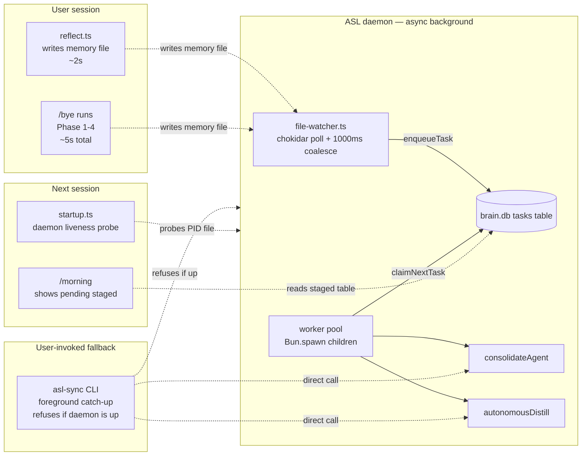

# ASL-0008 — Hook decoupling — remove distill/consolidate from session-end path

## TL;DR

Remove the synchronous `consolidate-memory --auto --autonomous` and `autonomous-distill` calls from the `/bye` skill. These are the 7-8 minute blockers the daemon (ASL-0007) was built to eliminate. After this task:

- `/bye` stays fast and only runs reflect + `brain --check` + daily log. No consolidate. No distill.
- The daemon handles consolidate + distill asynchronously on file-change events from the reflect writes.
- `asl-sync` (ASL-0013) is the user-invoked manual catch-up when the daemon has been down.
- A **startup daemon liveness check** is added to `.claude/hooks/startup.ts` so the user is told at session boot whether the ASL daemon is running (and given the one-liner to start it if not).

**Important finding from current-state audit:** Distill/consolidate are NOT in `.claude/settings.json` hooks at all. They live in the `/bye` slash command (`.claude/skills/bye/SKILL.md` Phase 2 and Phase 2.5). The original BRIEF §4 described a "hook-driven" pipeline but the realized implementation is user-invoked via `/bye`. That changes the scope of this task: we are editing one skill file, not a web of PreTool/PostTool hooks.

**Hard locks:**

- Do NOT touch `reflect.ts` auto-logging. `bun run tool reflect ...` stays in `/bye` Phase 1 — it is fast (<2s), writes a memory file, logs a decision, and is the TRIGGER the daemon relies on to pick up work.
- Do NOT touch `brain --check`. It is a hash-based incremental sync; it is fast and belongs in every hook/skill that cares about brain.db freshness.
- Do NOT modify the daemon itself (`src/services/self-learning-daemon/**`). This task is a CONSUMER-SIDE edit.
- Do NOT delete `autonomous-distill.ts` or `consolidate-memory.ts`. They are still used by the daemon workers (ASL-0006) and by `asl-sync` (ASL-0013). Only the CALL SITES in `/bye` are removed.
- Do NOT gate `/bye` on daemon liveness. If the daemon is down during `/bye`, reflect still runs, the memory file is still written, and `asl-sync` is the documented recovery path. The startup check in `startup.ts` is where we surface the "daemon not running" warning — not at session end.

---

## Context

### Why this task exists

The ASL Phase 2 daemon (ASL-0005 → ASL-0006 → ASL-0007) was built specifically to move the 7-8 minute distill pipeline off the synchronous session-end path. The `/bye` skill currently runs that pipeline inline:

```
Phase 1  — reflect                            (~2s)
Phase 2  — brain --check                      (~1s)
Phase 2  — consolidate-memory --auto          (~5-60s depending on inbox)
Phase 2.5 — autonomous-distill                (~1-8 minutes)
Phase 3  — obsidian sections add-log          (~1s)
```

That "2.5" phase is the entire reason the daemon exists. With ASL-0007 shipped, the watcher now sees every memory file the reflect pass writes and enqueues consolidate/distill tasks onto the task queue. Workers drain them in the background. The synchronous pipeline in `/bye` is redundant — worse, it's a race, because BOTH the daemon and the skill would try to run distill on the same inboxes.

ASL-0013's hard refusal on a running daemon (exit 1 if PID file is alive) is the same pattern `/bye` needs to respect: if the daemon owns the pipeline, the slash command must not compete with it.

### What the user gets out of this

- `/bye` goes from ~2-9 minutes to ~5 seconds.
- The pipeline still runs — just async, after the session ends.
- Morning briefing (`/morning`) already surfaces pending staged proposals (`src/tools/morning.ts:187 getPendingProposals`), so user-visible continuity is preserved.
- Manual catch-up path is `bun run tool asl-sync` (ASL-0013).

### Read these before touching anything

1. **`vault/studio/projects/autonomous-self-learning/BRIEF.md`** — §1 "Daemon service" and §4 "Hook changes" for the target fast/slow split. Note that §4's prose says "Hook scripts become tiny. Session end does NOT trigger distill." — our `/bye` skill is the realized "hook" in practice.
2. **`vault/studio/projects/autonomous-self-learning/tasks/2026-04-08-013633-ASL-0007-daemon-entry-point.md`** — production note at the bottom confirms the daemon is working end-to-end on Windows and is ready to absorb the load being removed here.
3. **`vault/studio/projects/autonomous-self-learning/tasks/2026-04-08-022225-ASL-0013-asl-sync-cli.md`** — the foreground catch-up CLI. This is what the user runs when the daemon was down. Note its "hard refusal on running daemon" rail — our startup check gives the user the one-liner to start the daemon before `asl-sync` would be needed.
4. **`.claude/skills/bye/SKILL.md`** — the file you are editing. Phase 2 and Phase 2.5 lines 40-44 are the lines being removed.
5. **`.claude/settings.json`** — read end-to-end to confirm (against instinct from the BRIEF) that distill/consolidate are NOT called from any `SessionStart`, `Stop`, or `PreCompact` hook. The `brain --check` calls on lines 80 and 118 are the only brain.db interactions in the hook chain and they stay.
6. **`.claude/hooks/startup.ts`** — the SessionStart hook where the daemon liveness probe will be added. Keep the probe cheap (`readFileSync` of PID file + `process.kill(pid, 0)` guarded in try/catch) and non-blocking.
7. **`src/services/self-learning-daemon/daemon.ts`** — the exact `readPid()` + `isRunning(pid)` functions. Copy the same pattern used by `asl-sync` (ASL-0013) so the liveness semantics match across the codebase.
8. **`src/tools/morning.ts` lines 185-236** — already surfaces pending staged proposals in the briefing. Nothing to change; this is the continuity story to reference in the acceptance criteria.

---

## Current-state audit

| Surface | Current behavior | Decision |
|---|---|---|
| `.claude/settings.json` SessionStart | `tool-call-counter --reset`, `brain --check`, `startup.ts` | **Unchanged.** No distill here today. |
| `.claude/settings.json` Stop | `tool-call-counter --check`, `capture-raw --stop`, `brain --check` | **Unchanged.** No distill here today. |
| `.claude/settings.json` PreCompact | `pre-compact-save`, `capture-raw --pre-compact` | **Unchanged.** No distill here today. |
| `.claude/settings.json` PostToolUse | `tool-call-counter`, `capture-raw --post-tool` | **Unchanged.** Hot path; stays minimal. |
| `.claude/hooks/startup.ts` | Loads souls + Freddie knowledge/inbox + last session summary | **Add daemon liveness probe** — one new section appended to stdout when PID file exists but process is dead (or PID file missing). |
| `.claude/hooks/pre-compact-save.ts` | Writes `out/session-state.json` | **Unchanged.** |
| `.claude/hooks/capture-raw.ts` | Raw session capture, brain.db insertRawJsonl on `--stop` | **Unchanged.** Raw capture is independent of the distill pipeline. |
| `.claude/hooks/tool-call-counter.ts` | Counts tool calls, warns at 75 | **Unchanged.** |
| `.claude/skills/bye/SKILL.md` Phase 1 — reflect | `reflect --agent freddie ...` | **Unchanged.** Reflect is the trigger. |
| `.claude/skills/bye/SKILL.md` Phase 2 — brain --check | `brain --check` | **Unchanged.** Fast, incremental. |
| `.claude/skills/bye/SKILL.md` Phase 2 — consolidate | `consolidate-memory --auto --autonomous` | **REMOVED.** Daemon handles it. |
| `.claude/skills/bye/SKILL.md` Phase 2.5 — distill | `autonomous-distill` | **REMOVED.** Daemon handles it. |
| `.claude/skills/bye/SKILL.md` Phase 3 — daily log | `obsidian sections add-log` | **Unchanged.** |
| `.claude/skills/bye/SKILL.md` Phase 4 — sign off | Print summary | **Updated.** Drop consolidation/distill lines from the print block. |
| `.claude/rules/architecture.md` §Self-Learning Lifecycle | Describes consolidate/distill as layers 2-3 | **Add note** pointing to the daemon and `asl-sync`. |
| `.claude/rules/memory-boundaries.md` §Consolidation | Lists `consolidate-memory --auto` CLI | **Unchanged.** The CLI still works; users can still run it directly. Daemon does NOT own the CLI. |
| `CLAUDE.md` | No explicit distill hook reference | **Unchanged.** |

**Key point from the audit:** The BRIEF §4 "Hook changes" diagram is slightly out-of-date w.r.t. where the work actually lives. The realized implementation never put distill into SessionStart/Stop/PreCompact — it put it into the user-invoked `/bye` slash command. This task edits the skill, not the hooks config. The BRIEF's intent (decouple slow path from session-end) is preserved; only the surface being edited differs.

---

## Target state

### `/bye` skill — new workflow

```
Phase 1  — reflect                            (~2s, unchanged)
Phase 2  — brain --check                      (~1s, unchanged)
Phase 3  — obsidian sections add-log          (~1s, unchanged, renumbered from 3)
Phase 4  — sign off                           (~0s, updated print block)
```

Total runtime: ~5 seconds. The 2-9 minute blocker is gone.

### SessionStart — new daemon liveness probe

`startup.ts` appends one of three states to stdout:

- **ASL daemon: RUNNING (PID: N)** — nothing else. Single line, green-tinted.
- **ASL daemon: STOPPED** — followed by the one-liner: `Run \`npm run asl:start\` to enable background learning, or \`bun run tool asl-sync\` for a one-shot catch-up.`
- **ASL daemon: STALE PID** — PID file exists but process is dead. Same one-liner as STOPPED.

The probe is non-fatal. All errors are swallowed (same pattern as the rest of `startup.ts`).

### Pipeline flow after this task



---

## File-by-file changes

### 1. `.claude/skills/bye/SKILL.md`

**Delete lines 39-44** (the Phase 2 consolidate block and Phase 2.5 distill block). Keep the `brain --check` line — move it into a cleaned-up Phase 2 section labeled "Sync brain.db".

**Renumber** Phase 3 (Daily Log) and Phase 4 (Sign Off) accordingly — no, keep them at Phase 3 and Phase 4 but there will now be no Phase 2.5. Simpler: rename the phases:

- Phase 1 — Reflect (unchanged)
- Phase 2 — Sync brain.db (ONLY `brain --check`, consolidate + distill removed)
- Phase 3 — Daily Log (unchanged)
- Phase 4 — Sign Off (updated — see below)

**Update the Sign Off print block** (lines 57-63) to remove the `Consolidation:` line and add an ASL daemon status line:

```
Session saved.
  Reflect: {learnings} learnings, {decisions} decisions
  Daily: logged
  ASL daemon: {running|stopped — run `npm run asl:start` to enable background learning}

See you next time.
```

The ASL daemon status line in `/bye` is optional but useful — if the user is ending a session and the daemon is stopped, they may want to start it so the reflect they just ran gets processed before the next session. If adding the probe in Phase 4 complicates the skill, it is acceptable to skip it — the SessionStart probe in `startup.ts` is the canonical surface. Document the tradeoff in the skill file as a comment.

**Add a note block** at the bottom of the skill explaining the split:

```
## Why /bye is fast

Consolidation and distillation used to run inline here. They now run in the ASL
daemon (ASL-0007) on file-change events. If the daemon is down, run
`bun run tool asl-sync` to catch up manually. The daemon status is surfaced
at the start of every session by `.claude/hooks/startup.ts`.
```

### 2. `.claude/hooks/startup.ts`

**Add a new loader function `loadDaemonStatus(): string[]`** that:

1. Reads `out/asl-daemon.pid` via `readFileSync`. If missing → return `["ASL daemon: STOPPED", "  Run `npm run asl:start` to enable background learning, or `bun run tool asl-sync` for a one-shot catch-up."]`.
2. Parses the PID. If parse fails → return the same STOPPED lines.
3. Calls `process.kill(pid, 0)` inside a try/catch. If it throws → return `["ASL daemon: STALE PID (was " + pid + ")", "  Run `npm run asl:start` to restart."]`.
4. Otherwise → return `["ASL daemon: RUNNING (PID: " + pid + ")"]`.

The function must swallow all errors and return an empty array on catastrophic failure so it never blocks session start.

**Wire it into `main()`** after the session-context block — append a new section:

```
lines.push("═══ ASL DAEMON ═══");
lines.push(loadDaemonStatus().join("\n"));
lines.push("");
```

Use `fromRoot("out", "asl-daemon.pid")` for the PID file path to match the daemon's own resolution.

**Do NOT import anything from `src/services/self-learning-daemon/`** — the startup hook runs before brain.db is guaranteed to be initialized and should have zero runtime dependencies on the daemon libs. Inline `readFileSync` + `process.kill(pid, 0)` is sufficient.

### 3. `.claude/rules/architecture.md`

Under `## Self-Learning Lifecycle`, append a sentence after the three-layer diagram:

> **Execution model:** Consolidation and distillation are handled asynchronously by the ASL daemon (`src/services/self-learning-daemon/`) triggered by file-change events on `vault/studio/memory/*/inbox/`. The `/bye` skill no longer runs these inline. Manual catch-up is available via `bun run tool asl-sync` (one-shot foreground). Daemon lifecycle: `npm run asl:{start,stop,restart,status}`.

### 4. `.claude/rules/memory-boundaries.md`

Under `## Consolidation`, add a note:

> Consolidation is normally triggered automatically by the ASL daemon on file changes. The `consolidate-memory` CLI remains available for manual runs, debugging, and the `asl-sync` fallback path.

### 5. `CLAUDE.md`

No changes required. CLAUDE.md does not currently describe the distill hook path, so there is nothing to correct. If during implementation you find a reference that became stale, update it.

---

## Acceptance criteria

1. **`/bye` runtime, warm brain.db, empty-to-small inbox:** total wall-clock time from invocation to "See you next time." output is **under 10 seconds**. Measure by running `/bye` in a session that has done one reflect cycle. Report the timing in the PR/commit message.
2. **`/bye` runtime, populated inbox (3+ items across 2+ agents):** still under 10 seconds. Critically, this is the case the daemon was built for — this used to take 2-9 minutes.
3. **No `consolidate-memory` or `autonomous-distill` strings in `.claude/skills/bye/SKILL.md`.** Verified via `grep -n "consolidate-memory\|autonomous-distill" .claude/skills/bye/SKILL.md` → exits with no matches.
4. **`brain --check` is still called in Phase 2** of `/bye`. Grep confirms.
5. **Reflect still runs in Phase 1** of `/bye`. Grep confirms `bun run tool reflect` in the skill.
6. **SessionStart daemon probe — running case:** start the daemon with `npm run asl:start`, then boot a fresh session. The `═══ ASL DAEMON ═══` section in session context shows `ASL daemon: RUNNING (PID: N)` where N matches `cat out/asl-daemon.pid`.
7. **SessionStart daemon probe — stopped case:** stop the daemon with `npm run asl:stop`, then boot a fresh session. The section shows `ASL daemon: STOPPED` plus the one-liner with `asl:start` and `asl-sync`.
8. **SessionStart daemon probe — stale PID case:** write a fake PID (`echo 99999 > out/asl-daemon.pid`), then boot a fresh session. The section shows `ASL daemon: STALE PID` plus the restart one-liner. Clean up the fake PID file after the test.
9. **SessionStart probe never blocks session start.** Even with a corrupted PID file (`echo "not-a-number" > out/asl-daemon.pid`), the hook exits 0 within 500ms and the rest of session context loads normally.
10. **Daemon picks up the work:** after running `/bye` with a populated inbox, wait up to 60 seconds with the daemon running, then confirm via `bun run tool agent-state` (ASL-0009 — if not yet shipped, use `sqlite3 vault/studio/brain.db "SELECT * FROM tasks WHERE created_at > datetime('now', '-5 minutes') ORDER BY id DESC"`) that new tasks were enqueued and at least one was claimed/completed. This verifies the decoupling is functionally equivalent — the work still happens, just async.
11. **Morning briefing continuity:** run `/morning` after the daemon has processed some distill tasks. Confirm that pending staged proposals still appear in the briefing (via `getPendingProposals` in `src/tools/morning.ts:187`). No regression in the user-visible "what needs my attention" surface.
12. **No distill calls in the `/bye` stack trace.** If an error occurs during `/bye`, the stack trace does not mention `autonomous-distill.ts`, `consolidate-memory.ts`, `gates.ts`, `judge-panel.ts`, or `distill-cache.ts`. (Negative test — just means these libs are no longer loaded by the skill.)
13. **`asl-sync` still works as manual catch-up.** With the daemon stopped, run `bun run tool asl-sync`. Confirm it runs consolidate + distill end-to-end and exits 0. (Smoke test — no changes to asl-sync in this task, just confirming ASL-0013 wasn't accidentally broken by hook edits.)
14. **`asl-sync` still refuses when the daemon is up.** With the daemon started, run `bun run tool asl-sync`. Confirm it exits 1 with the "daemon is running" error. (Smoke test of ASL-0013 safety rail — belt and suspenders.)

---

## Risks and mitigations

| Risk | Severity | Mitigation |
|---|---|---|
| **User runs `/bye` with daemon down and never starts it again.** Inboxes pile up; soul never gets distilled; morning briefing becomes inaccurate. | Medium | SessionStart probe tells the user on every session boot. Morning briefing also surfaces pending staged (unchanged from today). Manual `asl-sync` is documented in three places: `/bye` note, startup probe, `.claude/rules/architecture.md`. |
| **Race condition if user starts the daemon mid-session while `/bye` is running.** | Low | `/bye` no longer does distill; there is no race. The daemon may pick up the reflect-written file before or after `/bye` finishes Phase 3 — both are safe. |
| **Daemon crashes silently and the user doesn't notice for days.** | Medium | Out of scope for ASL-0008 — addressed by ASL-0007's supervisor loop (runtime crash recovery) and by the SessionStart probe (detects stopped/stale PID on every session boot). Hard crashes that leave a stale PID get caught by the STALE PID branch. |
| **Hook probe adds latency to SessionStart.** | Low | The probe is: one `readFileSync` of a ~5-byte file + one `process.kill(pid, 0)` syscall. Budget: <5ms. Measure once during Ryan's smoke test. If >50ms, investigate. |
| **PID file missing on first-ever session** (user has never started the daemon). | Low | STOPPED branch handles it correctly; the one-liner guides them to `npm run asl:start`. This is the correct onboarding message. |
| **User has the daemon running but also runs `asl-sync` manually in another shell.** | Low | ASL-0013 already refuses with exit 1 when the daemon is alive. This task does not change that rail. |
| **BRIEF §4 prose becomes out-of-date.** | Low | Not worth amending BRIEF.md — it's a historical design doc. The canonical current-state location is `.claude/rules/architecture.md` which this task updates. |

---

## Test plan (Ryan's manual smoke test)

Run these in order. Report pass/fail for each and the timing numbers for the two runtime steps.

1. **Baseline runtime of `/bye` before any edits.** Boot a session, do a trivial reflect-generating action (e.g., `bun run tool reflect --agent freddie --task "test" --workflow test --outcome success`), then run `/bye`. Time it with a wristwatch / `time` wrapper. Expected: 2-9 minutes depending on inbox state. Record the number.
2. **Apply the edits** to `.claude/skills/bye/SKILL.md`, `.claude/hooks/startup.ts`, `.claude/rules/architecture.md`, `.claude/rules/memory-boundaries.md`.
3. **Runtime of `/bye` after edits** — repeat step 1 exactly. Expected: <10 seconds. Record the number.
4. **Daemon probe: RUNNING.** `npm run asl:start`. Wait 3 seconds. Boot a new session (`/clear` or new terminal). Confirm the `═══ ASL DAEMON ═══` section shows `RUNNING (PID: N)` matching `cat out/asl-daemon.pid`.
5. **Daemon probe: STOPPED.** `npm run asl:stop`. Wait 3 seconds. Boot a new session. Confirm STOPPED + one-liner.
6. **Daemon probe: STALE PID.** With daemon stopped, `echo 99999 > out/asl-daemon.pid`. Boot a new session. Confirm STALE PID + one-liner. Delete `out/asl-daemon.pid`.
7. **Daemon probe: corrupted PID file.** `echo "garbage" > out/asl-daemon.pid`. Boot a new session. Confirm session starts normally within ~1s and the section shows STOPPED (corrupted file is treated as missing). Delete the file.
8. **End-to-end async pickup.** Start the daemon. Write 2-3 memory files to `vault/studio/memory/tala/inbox/` via `bun run tool reflect --agent tala ...`. Run `/bye`. Immediately query the tasks table: `bun src/tools/brain.ts --query "tasks" --type tasks` (or `sqlite3` directly — whatever works). Confirm a consolidate task appears within 2 seconds of the reflect write (chokidar 1000ms coalesce window + claim). Wait up to 60 seconds. Confirm status flips to `completed`. Confirm `agent_lifecycle.last_consolidated_at` for tala updated.
9. **Morning briefing continuity.** After step 8, run `/morning`. Confirm no regressions in the output (tasks list, staged proposals, etc. still render).
10. **`asl-sync` dual-state smoke test.**
    - Daemon stopped → `bun run tool asl-sync` → runs to completion, exits 0.
    - Daemon started → `bun run tool asl-sync` → refuses, exits 1 with clear message.
11. **Grep validation.**
    - `grep -rn "autonomous-distill\|consolidate-memory" .claude/skills/bye/` → no matches (except possibly in a doc/note block referencing the daemon replacement — flag any matches in the commit message).
    - `grep -n "brain --check" .claude/skills/bye/SKILL.md` → 1 match.
    - `grep -n "bun run tool reflect" .claude/skills/bye/SKILL.md` → 1 match.

Report the before/after timings and any unexpected findings in the commit message.

---

## Dependencies

- **ASL-0005** — file watcher shipped. Without it, nothing picks up the memory files reflect writes. `55132c8`.
- **ASL-0006** — worker pool shipped. Without it, enqueued tasks would sit forever. `a40ea77`.
- **ASL-0007** — daemon entry point shipped. The `out/asl-daemon.pid` file the startup probe reads is created by ASL-0007's `daemon.ts`. `5716043`.
- **ASL-0013** — `asl-sync` CLI shipped. The user-facing manual catch-up referenced in the startup probe one-liner and in the `/bye` note block. `d60739c`.

No downstream blockers beyond ASL-0011 (external MCP readiness gate), which needs the decoupling done so session-end never accidentally hangs an external client call.

---

## What Ryan must NOT do

- **Do not delete `src/tools/consolidate-memory.ts` or `src/tools/autonomous-distill.ts`.** They are still used by the daemon workers and by `asl-sync`. This task only removes the CALL SITES in `/bye`.
- **Do not add distill/consolidate calls to any `.claude/settings.json` hook.** The whole point is to keep them OUT of hooks.
- **Do not modify `reflect.ts`.** Reflect is the trigger the daemon depends on.
- **Do not modify `brain --check` behavior.** It is fast, incremental, and belongs everywhere.
- **Do not add a blocking daemon health gate to `/bye`.** If the daemon is down, `/bye` still runs cleanly — the user recovery path is `asl-sync`, not a `/bye` failure.
- **Do not import anything from `src/services/self-learning-daemon/**` into `.claude/hooks/startup.ts`.** The probe uses `readFileSync` + `process.kill(pid, 0)` directly. Zero runtime dependency on daemon libs from the startup hook.
- **Do not touch `capture-raw.ts`, `pre-compact-save.ts`, `tool-call-counter.ts`, or `bash-guard.ts`.** Out of scope.
- **Do not edit BRIEF.md.** It is a historical design doc. The current-state-of-record is `.claude/rules/architecture.md` which this task updates.

---

## Reporting back

When you finish, report:

1. Before/after `/bye` runtime numbers (step 1 and step 3 of the test plan).
2. Confirmation of all 14 acceptance criteria as pass/fail, with a one-line note on any that required interpretation.
3. Any grep matches in `.claude/skills/bye/SKILL.md` that mention the removed tools (expected: zero in executable blocks; possibly one in the "Why /bye is fast" note block — flag it explicitly).
4. The `out/asl-daemon.log` tail from the end-to-end async pickup test (step 8) showing the consolidate task was picked up and completed.
5. The PID file path resolution confirmed as `fromRoot("out", "asl-daemon.pid")` in `startup.ts`.
