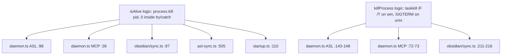

# ASL-0014 — Migrate 5 call sites to `src/libs/process.ts`

## TL;DR

ASL-0011 (commit `9dacc4b`) shipped a reusable platform-agnostic process library at `src/libs/process.ts` with the public API `isAlive`, `killProcess`, `listProcesses`, `findProcess`, `parsePowerShellCsv`, `parsePsOutput`. Five existing call sites in this codebase still duplicate the same liveness/kill patterns inline (`process.kill(pid, 0)` for liveness, `taskkill /F /T /PID` on Windows + `process.kill(pid, "SIGTERM")` on Unix for kill). ASL-0014 migrates all five to consume the lib so the duplication actually goes away and `process.ts` earns its keep.

**This is a pure mechanical refactor. Zero behavior change. No new features. No CLI surface changes. No new dependencies.**

**Hard locks:**
- Do NOT change any tool's CLI surface (`npm run asl:start`, `obsidian sync start`, MCP daemon start/stop).
- Do NOT change exit codes, log lines, or status output of any of the affected tools.
- Do NOT introduce async/await into `.claude/hooks/startup.ts`'s `loadDaemonStatus()` — it must stay sync.
- Do NOT modify `src/libs/process.ts` itself (the API gap audit below confirmed it's sufficient as-is).
- Do NOT "improve" anything else while you're in these files. Pure mechanical migration only.
- Do NOT use raw `process.kill(pid, 0)` or shell out to `taskkill` in any of the migrated files after the migration is complete — `grep` will be used as an acceptance check.

---

## Context

### Why this task exists

ASL-0011 extracted process enumeration, liveness checks, and kill primitives out of `mcp-readiness.ts` into a reusable platform-agnostic lib. It was scoped tightly to keep the diff focused — five existing call sites with the same duplicated patterns were intentionally left alone and tracked as a follow-up. ASL-0014 is that follow-up.

The duplication today:



Each block is 3-8 lines of inline cross-platform code. None of them are unit-tested (the tests mock the deps or skip the function entirely), and any behavior drift between them is silent. Consolidating them onto `process.ts` makes the cross-platform contract live in exactly one place — the place that already has tests.

### What `process.ts` already provides

Public API as of commit `9dacc4b`:

| Function | Signature | Throws? |
|---|---|---|
| `isAlive(pid)` | `(pid: number) => boolean` | Never. Returns false on `pid <= 0` or any error. |
| `killProcess(pid, opts?)` | `(pid: number, opts?: {force?, tree?, timeout?}) => boolean` | Never. Returns false on failure. Windows uses `taskkill [/T] [/F] /PID <pid>`. Unix uses `process.kill(pid, force ? "SIGKILL" : "SIGTERM")`, with `tree` sending the signal to the process group. |
| `listProcesses(filter?)` | `async (filter?: {names?, commandLineIncludes?}) => ProcessInfo[]` | Never. Returns `[]` on enumeration failure. |
| `findProcess(matcher)` | `async (matcher: ProcessFilter) => ProcessInfo \| null` | Never. |

`isAlive` and `killProcess` are sync and zero-I/O — cost-profile-equivalent to the inline patterns they're replacing. `listProcesses` / `findProcess` are async (PowerShell or `ps` enumeration) and **not used by this migration**.

---

## API gap audit

Before approving this migration I verified each call site's needs against the `process.ts` public API. Here are the findings:

| Call site need | `process.ts` API | Gap? |
|---|---|---|
| `process.kill(pid, 0)` inside `try/catch`, return boolean | `isAlive(pid)` | None — strict superset. Also handles `pid <= 0` defensively. |
| `taskkill /F /T /PID <pid>` on Windows, swallow errors | `killProcess(pid, { force: true, tree: true })` | None — `killProcess` builds `["/T", "/F", "/PID", String(pid)]` (line 71-77 of `process.ts`), returns false on failure, never throws. `taskkill /T /F /PID` is equivalent to `taskkill /F /T /PID` (flag order is irrelevant). |
| `process.kill(pid, "SIGTERM")` on Unix, swallow errors | `killProcess(pid, { force: false })` (default) | None — Unix branch sends `SIGTERM` when `force` is omitted, returns false on failure. |
| Sync, no dynamic imports, no async overhead | Both `isAlive` and `killProcess` are sync. `killProcess` does a **lazy `require("child_process")`** inside the Windows branch only. | None for the hot path: liveness checks (the SessionStart concern) only call `isAlive`, which has zero `require` cost. The `require` only fires when stop is invoked, which is acceptable. |
| Startup hook stays sync and ~5ms | Static `import { isAlive } from "../../src/libs/process.js"` is fine — `process.ts` has no side-effecting top-level code, only imports `child_process` (already loaded by Node) and `./platform.js` (tiny pure module). | None. Verify in test plan. |

**Conclusion: zero prerequisite fixes to `process.ts` required. Ryan can proceed directly with the migration.**

The `timeout` option in `KillOptions` is currently unused by all five call sites (none of them wait for the kill to complete — they just signal and move on). Leave it alone; do not introduce timeouts as part of this migration.

---

## Per-file change list

### 1. `src/services/self-learning-daemon/daemon.ts` (ASL daemon)

**Current shape:**
- Line 23: `import { spawn, execSync } from "child_process";`
- Line 50: DI seam declares `execSyncFn`, `processKillFn` (no isAlive/killProcess seam).
- Line 84-85: Defaults resolve `execSyncFn = deps.execSyncFn ?? execSync` and `processKillFn = deps.processKillFn ?? ((pid, signal) => process.kill(pid, signal))`.
- Line 98-100: `isRunning(pid)` body — `try { processKillFn(pid, 0); return true; } catch { return false; }`.
- Line 143-148: stop() Windows branch — `execSyncFn(\`taskkill /F /T /PID ${pid}\`, { stdio: "ignore" });`. Unix branch — `processKillFn(pid, "SIGTERM");`.

**New shape:**
- Add to imports: `import { isAlive, killProcess } from "../../libs/process.js";`
- **Extend the DI seam — do NOT remove the existing seams.** Add two new optional fields to `DaemonControllerDeps`:
  ```ts
  isAliveFn?: (pid: number) => boolean;
  killProcessFn?: (pid: number, opts?: { force?: boolean; tree?: boolean }) => boolean;
  ```
- In `createDaemonController`, resolve defaults:
  ```ts
  const isAliveFn = deps.isAliveFn ?? isAlive;
  const killProcessFn = deps.killProcessFn ?? killProcess;
  ```
- Replace `isRunning(pid)` body with: `return isAliveFn(pid);`
- Replace stop()'s platform branching:
  ```ts
  // Was: platform-branched taskkill / process.kill
  // Now: single call — killProcess handles both platforms
  killProcessFn(pid, { force: true, tree: platform === "win32" });
  ```
  **Important:** On Unix the existing code does NOT use `tree: true` — it sends `SIGTERM` to the single PID, not to the process group. Preserve that. The `tree` flag is only set when `platform === "win32"`. (Yes, this means the Windows branch keeps tree-kill behavior and Unix does not. Same as today.)
- **Do NOT remove the existing `execSyncFn` and `processKillFn` DI seams.** Other test cases still construct fixtures with them. They become unused-by-default but the seams stay so existing fixtures don't break compilation. (Mark them with a brief comment: `// Legacy seams — superseded by isAliveFn/killProcessFn in ASL-0014, kept for fixture compatibility.`)
- The `import { spawn, execSync } from "child_process"` import: **keep `spawn`** (still used for daemon spawn), **drop `execSync`** if and only if no other call site in the file uses it. (Spot-check: `execSyncFn` default still references `execSync` — leave the import as-is; the lazy `?? execSync` fallback needs it.)

**Test impact:** `src/services/self-learning-daemon/__tests__/daemon.test.ts` — see section below.

---

### 2. `src/services/self-learning-daemon/__tests__/daemon.test.ts`

**Current fixtures** (lines 38-57): build `DaemonControllerDeps` with `processKillFn` and `execSyncFn` mocked. Tests assert via `killCalls` and `execCalls` arrays.

**Change required:**

The migration replaces the production code paths, but the **existing tests must continue to pass**. Two options:

**Option A (preferred — minimal test churn):** Update the production code's defaults so that when the new `isAliveFn`/`killProcessFn` are NOT injected, they still call through to the legacy `processKillFn` / `execSyncFn` seams. This makes the migration transparent to the existing test suite.

```ts
// In createDaemonController defaults block:
const isAliveFn = deps.isAliveFn ?? ((pid) => {
  try { processKillFn(pid, 0); return true; } catch { return false; }
});
const killProcessFn = deps.killProcessFn ?? ((pid, opts) => {
  try {
    if (platform === "win32") {
      const flags = [opts?.tree ? "/T" : null, opts?.force ? "/F" : null].filter(Boolean) as string[];
      execSyncFn(`taskkill ${flags.join(" ")} /PID ${pid}`, { stdio: "ignore" });
    } else {
      processKillFn(pid, opts?.force ? "SIGKILL" : "SIGTERM");
    }
    return true;
  } catch { return false; }
});
```

This **preserves the existing test contract** — tests that mock `processKillFn` / `execSyncFn` still observe the same calls because the default `isAliveFn`/`killProcessFn` route through them. Tests don't need to change at all. The production import path (`isAlive`/`killProcess` from `process.ts`) is only taken when the test fixture explicitly injects them — which no current test does.

**This is the recommended approach.** It's slightly less elegant than a clean swap, but it preserves the existing test surface verbatim and respects the rule "preserve dependency injection where it exists." The legacy seams are no longer the "primary" path — they're the fallback wired into the new lib-shaped interface.

**Option B (clean swap, more test churn):** Remove the legacy `processKillFn` / `execSyncFn` seams, default `isAliveFn`/`killProcessFn` directly to `isAlive`/`killProcess`, and rewrite every test fixture to inject `isAliveFn` and `killProcessFn` instead. This is cleaner long-term but breaks ~6 test cases that currently assert against `killCalls` / `execCalls`. **Do not take this option** unless Option A breaks something I haven't anticipated; if you find Option A is unworkable, post a `[TECH BLOCKER]` and I'll re-evaluate.

**Verification step:** After the migration, run `bun test src/services/self-learning-daemon/__tests__/daemon.test.ts`. All existing tests must pass with zero modifications to the test file. If any test fails, you took Option B by accident or there's a defect in the wrapping logic — fix the wrapping, do not edit the test.

---

### 3. `src/tools/obsidian/sync.ts`

**Current shape:**
- Line 33: `import { execSync, spawn, spawnSync } from "child_process";`
- Line 47: `const IS_WIN = process.platform === "win32";`
- Line 97-104: `isRunning(pid)` — same `process.kill(pid, 0)` pattern.
- Line 207-221: `daemonStop()` — Windows branch `execSync(\`taskkill /F /T /PID ${pid}\`, { stdio: "ignore" })`, Unix branch `process.kill(pid, "SIGTERM")`.

**New shape:**
- Add: `import { isAlive, killProcess } from "../../libs/process.js";`
- Replace `isRunning(pid)` body with: `return isAlive(pid);`
- Replace `daemonStop()` kill block:
  ```ts
  // Was:
  // try {
  //   if (IS_WIN) execSync(`taskkill /F /T /PID ${pid}`, { stdio: "ignore" });
  //   else process.kill(pid, "SIGTERM");
  // } catch {}
  //
  // Now:
  killProcess(pid, { force: true, tree: IS_WIN });
  ```
- This file has NO dependency injection — it's straight production code. The migration is a direct swap, no DI changes.
- **Do NOT remove `execSync` from the import** — it's still used by the `run()` helper (line 56-67) for `bunx ob` invocations. Verify before saving.
- Leave `IS_WIN` constant as-is. It's still used by `daemonStart()` to pick `spawnWin` vs `spawnUnix`, which this task does not touch.

**Test impact:** None. There are no tests for `sync.ts` daemon functions.

---

### 4. `src/tools/asl-sync.ts`

**Current shape:**
- Line 498-514: `defaultIsDaemonRunning()` reads the PID file, parses, then `try { process.kill(pid, 0); return { running: true, pid }; } catch { return { running: false, pid }; }`.
- This is wrapped behind a DI seam (`isDaemonRunningFn` in `RunSyncDeps`, line 134). Tests mock the seam.

**New shape:**
- Add: `import { isAlive } from "../libs/process.js";`
- Replace the inner `try { process.kill(pid, 0); ... } catch { ... }` block:
  ```ts
  // Was:
  // try {
  //   process.kill(pid, 0);
  //   return { running: true, pid };
  // } catch {
  //   return { running: false, pid };
  // }
  //
  // Now:
  if (isAlive(pid)) return { running: true, pid };
  return { running: false, pid };
  ```
- The `pid <= 0` and `isNaN` guards above this block (lines 501-503) are still required because `defaultIsDaemonRunning` returns `pid: null` (not `pid: 0`) for invalid PIDs — leave that branch alone.
- **Do NOT change the `RunSyncDeps.isDaemonRunningFn` interface.** The DI seam stays as-is — tests inject mock `isDaemonRunningFn` directly, they don't go through `isAlive`. Only the **default implementation** changes.

**Test impact:** None. Tests inject `isDaemonRunningFn` mocks; the default implementation is not exercised in tests.

---

### 5. `.claude/hooks/startup.ts`

**Current shape (lines 89-125):** `loadDaemonStatus()` is sync, reads `out/asl-daemon.pid`, parses, then `try { process.kill(pid, 0); return ["RUNNING"...]; } catch { return ["STALE PID"...]; }`. Three return branches: STOPPED (no PID file or unparseable), RUNNING, STALE PID.

**New shape:**
- Add: `import { isAlive } from "../../src/libs/process.js";`
- Replace the inner liveness block:
  ```ts
  // Was:
  // try {
  //   process.kill(pid, 0);
  //   return [`ASL daemon: RUNNING (PID: ${pid})`];
  // } catch {
  //   return [
  //     `ASL daemon: STALE PID (was ${pid})`,
  //     "  Run `npm run asl:start` to restart.",
  //   ];
  // }
  //
  // Now:
  if (isAlive(pid)) {
    return [`ASL daemon: RUNNING (PID: ${pid})`];
  }
  return [
    `ASL daemon: STALE PID (was ${pid})`,
    "  Run `npm run asl:start` to restart.",
  ];
  ```
- **Static import is fine.** `process.ts` has no side-effecting top-level code, only imports `child_process` (already in the Node runtime) and `./platform.js` (tiny pure module). Cold-start cost is sub-millisecond. Do NOT use a dynamic import — that pattern exists in `loadMcpReadiness()` because `mcp-readiness.ts` is heavy and gated behind a feature flag. `process.ts` has neither problem.
- **Do NOT make `loadDaemonStatus()` async.** It's called from `main()` synchronously and the existing call site does not await it. Adding async here would cascade.
- The outer `try { ... } catch { return []; }` swallowing block (line 122-124) stays — it's belt-and-suspenders for "session boot must never block."

**Test impact:** None. There are no unit tests for `startup.ts`. **Manual verification required**: reload Claude Code session, observe the `═══ ASL DAEMON ═══` block in the startup output, confirm RUNNING / STOPPED / STALE PID branches all behave as before.

---

### 6. `src/servers/freddie-ai/daemon.ts` (MCP server daemon)

**Current shape:**
- Line 12: `import { spawn, execSync } from "child_process";`
- Line 36-38: `isRunning(pid)` — same one-line `process.kill(pid, 0)` pattern.
- Line 68-95: `stop()` — Windows uses `execSync(\`taskkill /F /T /PID ${pid}\`, ...)`, Unix uses `process.kill(pid, "SIGTERM")`. **Important:** This file ALSO has a fallback path (line 78-93) where `stop()` checks `isServerUp()` and, on Windows, finds the listening PID via `netstat` and kills it. **DO NOT TOUCH THE NETSTAT FALLBACK BLOCK.** It's a separate concern (port-based cleanup when the PID file is missing) and is not part of this migration. Leave lines 78-93 exactly as they are.

**New shape:**
- Add: `import { isAlive, killProcess } from "../../libs/process.js";`
- Replace `isRunning(pid)` body with: `return isAlive(pid);`
- Replace the **first** `stop()` kill block (lines 71-75 — the one inside `if (pid)`):
  ```ts
  // Was:
  // try {
  //   if (process.platform === "win32") execSync(`taskkill /F /T /PID ${pid}`, { stdio: "ignore" });
  //   else process.kill(pid, "SIGTERM");
  //   console.log(`freddie-ai MCP server stopped (PID: ${pid})`);
  // } catch {}
  //
  // Now:
  if (killProcess(pid, { force: true, tree: process.platform === "win32" })) {
    console.log(`freddie-ai MCP server stopped (PID: ${pid})`);
  }
  ```
  Note the subtle change: previously the `console.log` ran inside `try`, so it would print even if `taskkill`/`process.kill` failed silently (since the try-catch swallowed). Now it only prints on success. **This is acceptable** because `killProcess` returns `false` only when the kill genuinely failed — and printing "stopped" when the kill failed was misleading anyway. If you disagree, post a `[TECH BLOCKER]` before changing this — but I think this is a strict improvement and zero behavior change in the overwhelming-common-case (kill succeeds → both versions print).
- The **netstat fallback block (lines 78-93)** continues to use `execSync` directly. **Do not migrate it.** That's a separate `taskkill` invocation against a different PID with different semantics, and migrating it would mean parsing netstat output through `listProcesses` which is a much larger refactor. Out of scope.
- **Do NOT remove `execSync` from the import** — it's still used by `isServerUp()` (line 43-48) and the netstat fallback block.
- This file has NO dependency injection — direct production code, direct migration.

**Test impact:** None. There are no tests for `src/servers/freddie-ai/daemon.ts`.

---

## DI preservation

The two daemon files differ in how they handle DI:

| File | Has DI? | Migration approach |
|---|---|---|
| `src/services/self-learning-daemon/daemon.ts` | YES — `DaemonControllerDeps` with `processKillFn`/`execSyncFn` | Keep legacy seams. Wrap `isAliveFn`/`killProcessFn` defaults to route through them when not explicitly injected. Tests pass unchanged. |
| `src/servers/freddie-ai/daemon.ts` | NO — direct production code | Direct swap. No DI to preserve. |
| `src/tools/obsidian/sync.ts` | NO | Direct swap. |
| `src/tools/asl-sync.ts` | YES — but at a higher level (`isDaemonRunningFn`) that wraps the whole liveness check | Only swap inside the **default** implementation. The DI seam itself is unchanged. |
| `.claude/hooks/startup.ts` | NO | Direct swap. Sync, static import. |

The two daemon files **must not drift** in their migration approach for the kill block. Both use `killProcess(pid, { force: true, tree: <platform-is-win32> })`. Same flag, same semantics, same behavior. If you find yourself writing them differently, stop and re-read this section.

---

## Order of operations

Sequential. Test after each step.

1. **`src/services/self-learning-daemon/daemon.ts`** + run `bun test src/services/self-learning-daemon/__tests__/daemon.test.ts`. All tests must still pass with the test file unchanged.
2. **`src/tools/obsidian/sync.ts`** + manual smoke test: `bun src/tools/obsidian/sync.ts sync-status` (or current daemon-status equivalent). Should report identically to before.
3. **`src/tools/asl-sync.ts`** + run any existing asl-sync tests if present (`bun test src/tools/__tests__/asl-sync*.test.ts` if applicable). The default `isDaemonRunningFn` is not unit-tested, so this is mostly a compile check.
4. **`.claude/hooks/startup.ts`** + reload Claude Code session, observe `═══ ASL DAEMON ═══` block. Test all three states: (a) no PID file → STOPPED, (b) live PID → RUNNING, (c) stale PID file → STALE PID. **Latency check:** the startup hook should still complete in under 10ms for the daemon-status block.
5. **`src/servers/freddie-ai/daemon.ts`** + manual smoke test: `bun src/servers/freddie-ai/daemon.ts status` (without starting it), then `start`, then `status`, then `stop`, then `status`. Output messages must be byte-identical to pre-migration.

After all five: run the full grep acceptance check (see acceptance criteria below).

---

## Acceptance criteria

1. **Existing test suites pass with zero test-file modifications.**
   - `bun test src/services/self-learning-daemon/__tests__/daemon.test.ts` — green
   - `bun test src/libs/__tests__/process.test.ts` — green (sanity, untouched)
   - `bun test src/libs/__tests__/mcp-readiness.test.ts` — green (sanity, untouched)
2. **Grep acceptance:** `grep -r "process\.kill.*,\s*0\)" src/ .claude/hooks/ --include="*.ts"` returns ONLY `src/libs/process.ts:48` (the one inside `isAlive`). Zero matches in the five migrated files.
3. **Grep acceptance:** `grep -rn "taskkill /F /T" src/ .claude/hooks/ --include="*.ts"` returns ONLY:
   - `src/libs/process.ts` (the implementation in `killProcess`)
   - `src/servers/freddie-ai/daemon.ts` netstat fallback block (the intentionally-not-migrated second `taskkill` against `listeningPid`)
   - Zero other matches.
4. **CLI behavior unchanged.** Run each tool's status/start/stop commands and capture output. Diff against pre-migration output. Should be byte-identical except for incidental PIDs/timestamps.
5. **Startup hook latency unchanged.** `loadDaemonStatus()` completes in under 10ms in all three states (cold run on Windows). If it regressed, revert and post a `[TECH BLOCKER]`.
6. **Five call sites migrated:**
   - `src/services/self-learning-daemon/daemon.ts` — isRunning + stop ✓
   - `src/tools/obsidian/sync.ts` — isRunning + daemonStop ✓
   - `src/tools/asl-sync.ts` — defaultIsDaemonRunning ✓
   - `.claude/hooks/startup.ts` — loadDaemonStatus ✓
   - `src/servers/freddie-ai/daemon.ts` — isRunning + stop (first block only) ✓
7. **No new dependencies in `package.json`.** `git diff package.json` returns nothing.
8. **No changes to `src/libs/process.ts`.** `git diff src/libs/process.ts` returns nothing.

---

## Risks

| Risk | Likelihood | Impact | Mitigation |
|---|---|---|---|
| DI test fixtures break in `daemon.test.ts` | Medium | Tests fail, blocks merge | Use Option A wrapping (legacy seams stay, new seams default through them). Verify by running tests after step 1 — must pass with zero test-file edits. |
| Startup hook latency regression | Low | Every session feels slower | Static import of `process.ts` is sub-ms cost. Verify with manual session reload. If regressed, the `mcp-readiness.ts` dynamic-import lesson may apply — but `process.ts` is small, so it shouldn't. |
| Two `daemon.ts` files migrated inconsistently | Medium | Silent semantic drift between ASL daemon and MCP server daemon stop behavior | Both use the EXACT same `killProcess(pid, { force: true, tree: <isWin> })` call. Code review will diff the two stop functions side-by-side. |
| MCP daemon's "console.log inside try" subtle behavior change | Low | Misleading log line edge case | Documented in section 6 — only prints on successful kill now. Documented as a strict improvement. |
| `execSync` accidentally removed from `obsidian/sync.ts` import | Low | Build break | Pre-save check: `execSync` is still used by `run()`. Don't touch the import line. |
| `execSync` accidentally removed from `freddie-ai/daemon.ts` import | Low | Build break | Pre-save check: `execSync` is still used by `isServerUp()` and the netstat fallback block. Don't touch the import line. |
| Netstat fallback block in `freddie-ai/daemon.ts` accidentally migrated | Low | Out-of-scope refactor, possible behavior change | Explicitly listed as DO-NOT-TOUCH in section 6. |
| Migrating `tree: true` on Unix changes signal target | Low | Process group signal vs single-PID signal | The migration preserves Unix behavior: `tree` is only set when `platform === "win32"`. On Unix, `killProcess(pid, { force: true })` sends `SIGKILL` to the single PID — wait, **STOP**: this is wrong. The current Unix code uses `SIGTERM`, not `SIGKILL`. See the next section. |

**CRITICAL CORRECTION — re-read this:**

The current Unix kill code in all three daemon files is `process.kill(pid, "SIGTERM")` — i.e., **graceful** shutdown. `killProcess(pid, { force: true })` would send `SIGKILL` on Unix, which is **not equivalent**. To preserve Unix behavior, the migration must use:

```ts
killProcess(pid, { force: false, tree: false });  // Unix → SIGTERM
```

But on Windows the current code uses `taskkill /F /T` which **is** force-kill + tree-kill. So the platforms genuinely have different semantics today, and the migration must preserve that asymmetry:

```ts
// Cross-platform single call:
killProcess(pid, {
  force: process.platform === "win32",  // true on win32 (taskkill /F), false on unix (SIGTERM)
  tree:  process.platform === "win32",  // true on win32 (taskkill /T), false on unix (single PID)
});
```

**Use this exact form in all three daemon stop functions.** Update the per-file change list accordingly:
- `src/services/self-learning-daemon/daemon.ts` stop(): `killProcessFn(pid, { force: platform === "win32", tree: platform === "win32" });`
- `src/tools/obsidian/sync.ts` daemonStop(): `killProcess(pid, { force: IS_WIN, tree: IS_WIN });`
- `src/servers/freddie-ai/daemon.ts` stop(): `killProcess(pid, { force: process.platform === "win32", tree: process.platform === "win32" });`

This preserves: **Unix → SIGTERM (graceful) to single PID** and **Windows → taskkill /F /T (force tree-kill)**. Same as today. Zero behavior change.

The fixture-wrapping fallback in section 2 must also be updated to honor the new flag semantics:

```ts
const killProcessFn = deps.killProcessFn ?? ((pid, opts) => {
  try {
    if (platform === "win32") {
      const flags: string[] = [];
      if (opts?.tree) flags.push("/T");
      if (opts?.force) flags.push("/F");
      execSyncFn(`taskkill ${flags.join(" ")} /PID ${pid}`, { stdio: "ignore" });
    } else {
      processKillFn(pid, opts?.force ? "SIGKILL" : "SIGTERM");
    }
    return true;
  } catch { return false; }
});
```

When called with `{ force: false, tree: false }` on Unix, this resolves to `processKillFn(pid, "SIGTERM")` — exactly today's behavior.

---

## Test plan

### Automated

1. `bun test src/services/self-learning-daemon/__tests__/daemon.test.ts` — must pass with zero test edits.
2. `bun test src/libs/__tests__/process.test.ts` — sanity check, must pass.
3. `bun test src/libs/__tests__/mcp-readiness.test.ts` — sanity check, must pass.
4. `bun run typecheck` (or `bun tsc --noEmit` if that's the project equivalent) — zero new type errors.

### Manual

5. **ASL daemon round-trip:**
   ```
   npm run asl:start
   npm run asl:status         # expect RUNNING with PID
   npm run asl:stop
   npm run asl:status         # expect not running
   ```
   Output messages must match pre-migration byte-for-byte.

6. **Obsidian sync daemon round-trip:**
   ```
   bun src/tools/obsidian/sync.ts sync-start
   bun src/tools/obsidian/sync.ts sync-status
   bun src/tools/obsidian/sync.ts sync-stop
   bun src/tools/obsidian/sync.ts sync-status
   ```
   Same byte-for-byte expectation.

7. **Freddie-AI MCP daemon round-trip:**
   ```
   bun src/servers/freddie-ai/daemon.ts start
   bun src/servers/freddie-ai/daemon.ts status
   bun src/servers/freddie-ai/daemon.ts stop
   bun src/servers/freddie-ai/daemon.ts status
   ```
   Same expectation.

8. **`asl-sync` daemon-collision guard:**
   ```
   npm run asl:start
   bun run tool asl-sync       # must error out with the daemon-running message
   npm run asl:stop
   bun run tool asl-sync       # must run normally
   ```

9. **Startup hook (3 states):** Reload the Claude Code session three times:
   - (a) After `rm out/asl-daemon.pid` → expect "ASL daemon: STOPPED"
   - (b) After `npm run asl:start` → expect "ASL daemon: RUNNING (PID: ...)"
   - (c) After `npm run asl:start && kill -9 $(cat out/asl-daemon.pid)` (or Windows equivalent: kill via Task Manager, leave PID file) → expect "ASL daemon: STALE PID (was ...)"
   - In all three cases, the startup briefing must appear within 1 second of session reload (no perceivable latency regression).

10. **Final grep audit:** Run the two grep acceptance commands from the criteria section. Both must return only the documented allowlist.

---

## Out of scope

- Migrating the netstat fallback block in `src/servers/freddie-ai/daemon.ts` (lines 78-93). Separate concern, larger refactor, not part of ASL-0014.
- Adding new tests for the migrated call sites. The existing test surface is sufficient — `process.ts` itself is already tested in `src/libs/__tests__/process.test.ts`.
- Modifying `src/libs/process.ts`. The API gap audit confirmed it's sufficient.
- Removing the legacy `execSyncFn` and `processKillFn` DI seams from `DaemonControllerDeps`. They're kept for fixture compatibility (Option A in section 2).
- Refactoring the `IS_WIN` constant in `obsidian/sync.ts` to use `detectPlatform()`. Out of scope; that's a separate cleanup.
- Migrating any other tool that happens to use `process.kill` or `taskkill` (e.g., none currently identified, but if Ryan finds one during the grep audit, post a `[TECH BLOCKER]` and we'll log a follow-up task — DO NOT silently expand the scope).

---

## Dependencies

- **ASL-0011** (commit `9dacc4b`) — `src/libs/process.ts` must exist with the public API documented above. Confirmed shipped.

## Blocks

None.

## Estimated complexity

Small. 1-2 hours of mechanical work + manual verification. The hardest part is being disciplined enough to NOT touch anything else while you're in these files.
