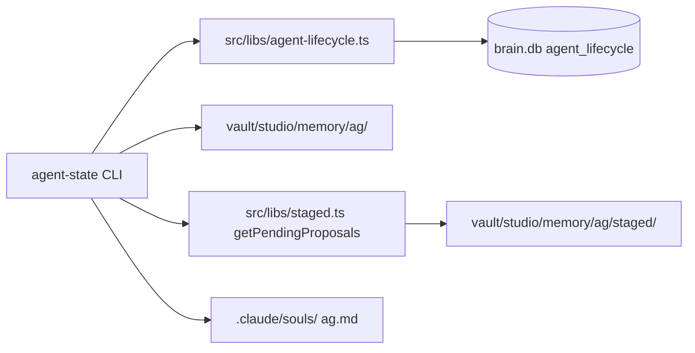

# ASL-0009 — `agent-state` CLI tool

## TL;DR

ASL-0004 (commit `bab968c`) shipped `src/libs/agent-lifecycle.ts` — a typed library over the `agent_lifecycle` brain.db table with hash-based staleness detection, counts refreshers, and lifecycle timestamp updaters. The daemon writes to it. Nothing reads it yet from a human-facing surface except the implicit `/morning` overview. ASL-0009 ships the inspection CLI: a read-only diagnostic tool that lets the user ask "what do you know about Tala's state right now?" and get a complete answer — knowledge hash, inbox contents, distill history, pending proposals, soul version — without reading files by hand.

**This is a read-only inspection tool.** No writes, no remediation, no pipeline triggers. If a subcommand cannot answer a question from brain.db + filesystem + known helper libs, that subcommand does not exist in this task.

**Hard locks:**
- NO writes to `agent_lifecycle`, `tasks`, `decisions`, or any other brain.db table.
- NO filesystem mutations under `vault/studio/memory/` or `.claude/souls/`.
- NO triggering of consolidate, distill, or any pipeline work.
- NO modifications to `src/libs/agent-lifecycle.ts`, `src/libs/staged.ts`, or any dependency. Pure consumer of existing APIs.
- NO new dependencies in `package.json`.
- NO changes to the daemon, task queue, or worker pool.

---

## Goals

1. **One diagnostic surface for per-agent lifecycle state.** The user runs `bun run tool agent-state show tala` and sees everything the daemon, filesystem, and brain.db know about Tala.
2. **Complement `/morning`, do not replace it.** `/morning` is the fast, opinionated briefing. `agent-state` is the deep-dive. Both read the same underlying data.
3. **Human table output + JSON output.** Both are first-class. JSON is for scripting (piping into jq, future UI consumption, regression snapshots).
4. **Fail loudly on unknown agents.** No silent empty output when the user typos `tla` instead of `tala`. Exit 1 with a clear message on stderr.
5. **Degrade gracefully for never-active agents.** An agent that has a memory dir but no `agent_lifecycle` row yet (e.g., a freshly added agent) must render coherently with nulls where data is missing — not crash.

## Non-Goals

- Triggering a distill or consolidate run. (That's `asl-sync` and the daemon.)
- Editing, approving, or rejecting staged proposals. (That's ASL-0012 — `review-staged`.)
- Resetting or cleaning lifecycle rows.
- Displaying raw memory file bodies — only names, counts, ages.
- Per-file content preview from `agent_lifecycle` history — the schema doesn't track history (only current values), so "recent activity" is synthesized from filesystem mtime, not the table.
- Replacing `/morning`.
- Adding UI hooks or HTTP routes. (ASL Phase 2 §8 defers UI; daemon HTTP API is out of scope here.)

---

## Context

### Data sources

`agent-state` is a thin aggregator over four existing sources. Do NOT invent new queries — compose from what ships today.



| Source | Provides | Called via |
|---|---|---|
| `agent_lifecycle` table | `last_*_at` timestamps, counts cache, `last_distill_input_hash`, `soul_version_hash`, `distill_trigger_reason` | `getAgentLifecycle(agent)`, `listAgentLifecycle()` |
| Filesystem: `vault/studio/memory/{agent}/inbox/` | Current inbox file count + basenames + mtimes | `readdirSync` + `statSync` — do NOT call `refreshInboxCount` (that mutates the row) |
| Filesystem: `vault/studio/memory/{agent}/knowledge/` | Current knowledge file count + the LIVE knowledge-dir hash for drift detection | `readdirSync`; `computeDistillInputHash(agent)` from `agent-lifecycle.ts` |
| Filesystem: `vault/studio/memory/{agent}/archive/` | Archive file count + last archived date | `readdirSync` + `statSync` |
| Filesystem: `.claude/souls/{agent}.md` | Soul file existence + path + live content hash | `existsSync` + `computeCurrentSoulHash(agent)` |
| `getPendingProposals(agent)` | Pending staged proposals for review | `src/libs/staged.ts` |

**Critical invariant:** The CLI must be **side-effect-free** against the database and filesystem. Never call `refreshInboxCount`, `refreshKnowledgeCount`, `refreshPendingTaskCount`, `recordSaved`, `recordReflected`, `recordConsolidated`, or `recordDistilled` from this tool. Those mutate the lifecycle row — the CLI is a read-only mirror.

The `inboxCount` / `knowledgeCount` / `pendingTaskCount` fields in `agent_lifecycle` are a **cached snapshot** from the last writer. They can drift from the live filesystem. `agent-state` must show both when they disagree, labelled clearly ("cached: 3, live: 5 — drift") so the user can tell that the daemon hasn't caught up yet. Do NOT silently prefer one over the other.

### Agent universe

The canonical list of known agents is: **subdirectories of `vault/studio/memory/` minus `raw` and `shared`.** This matches `defaultListAgents()` in `src/tools/asl-sync.ts:477-493` and the `scanInbox()` helper in `src/tools/morning.ts:68-85`. Copy the discovery logic verbatim — or extract it to a shared helper in `src/libs/agent-lifecycle.ts` **only if the extraction is trivial and blesses a single source of truth**. Default: copy-inline is fine for this task, don't expand scope.

**Excluded directory names:** `raw`, `shared`, anything starting with `.`, anything that is not a directory (handle `statSync` errors defensively — return false and skip).

**Parallel sanity check:** `.claude/souls/{agent}.md` should exist for every agent in the memory-dir list. If an agent has a memory dir but no soul file, render it with `soul: MISSING` in `show` output. Do NOT crash. Do NOT auto-create anything.

**Current agent list as of 2026-04-08:** `echo`, `freddie`, `holmes`, `mccall`, `penny`, `rune`, `ryan`, `sol`, `tala`. (Plus `raw` and `shared` which are excluded.) All have matching soul files.

### The "holmes validator" investigation

The dispatching brief asked whether asl-sync's pre-existing validation error for `holmes` is a registry gap or a validator bug. **Finding: neither. It's a design decision documented in `src/libs/autonomous-distill.ts:37`:**

```ts
export const DISTILL_AGENTS: readonly string[] = ["tala", "rune", "sol", "echo", "penny"] as const;
```

`holmes`, `mccall`, `ryan`, `freddie` are **deliberately** excluded from the autonomous distill pipeline. They are infrastructure/architect-tier personas whose souls are curated manually, not evolved via memory reflection. When `asl-sync --agent holmes` prints "Distill: skipped (not in DISTILL_AGENTS)", that's correct behavior — holmes passed the `listAgentsFn()` validator (holmes has a memory dir) and was then correctly skipped at the distill eligibility check (`isDistillEligible` returned false). There is no bug. There is no registry gap.

**Implication for ASL-0009:** The CLI must validate against the **full agent universe** (memory-dir discovery), NOT `DISTILL_AGENTS`. `agent-state show holmes` must work — holmes has lifecycle state to inspect (last saved, inbox, archive), even if distill never runs for it. The `last_distilled_at` column will be null forever for holmes; render it as `last distilled: (never — not a distill target)` when the agent is absent from `DISTILL_AGENTS`. This is the one place ASL-0009 reads `DISTILL_AGENTS` — purely to annotate output, never to filter.

No follow-up task needed. No changes to asl-sync. Closing the investigation.

---

## CLI specification

### Invocation

```
bun run tool agent-state [subcommand] [args] [flags]
```

Subcommands: `list` (default when omitted), `show <agent>`, `pending`, `json <agent>`. Unknown subcommand → exit 1 with "Unknown subcommand: {name}" to stderr plus usage.

### Global flags

| Flag | Default | Effect |
|---|---|---|
| `--help`, `-h` | off | Print usage to stdout, exit 0 |
| `--no-color` | off | Suppress ANSI even if TTY (for tests and piping) |

**TTY detection:** ANSI colors are emitted **only** when `process.stdout.isTTY === true` AND `--no-color` was not passed. Tests set `--no-color` and capture plain text. Use a tiny color helper in the tool file — do NOT add `chalk` or `kleur` as a dependency.

### Subcommand 1: `list`

**Purpose:** One-line summary for every known agent. Default when no subcommand is passed.

**Output (TTY, not JSON):**

```
agent-state — 2026-04-08 08:22

AGENT      KNOW  INBOX  PENDING  HASH    LAST CONSOLIDATED   LAST DISTILLED
tala         12      2        0  fresh   2026-04-07 19:15    2026-04-07 19:18
rune          8      0        1  stale   2026-04-06 14:02    2026-04-05 22:10
sol           5      0        0  fresh   2026-04-07 19:15    2026-04-07 19:18
echo          3      1        0  fresh   2026-04-07 18:55    2026-04-07 18:57
penny         4      0        0  fresh   2026-04-06 09:30    2026-04-06 09:32
freddie       6      0        0  -       2026-04-07 19:15    never (infra)
holmes        2      0        0  -       2026-04-07 19:15    never (infra)
mccall        3      0        0  -       2026-04-07 19:15    never (infra)
ryan          2      0        0  -       2026-04-07 19:15    never (infra)
```

**Columns:**
- `AGENT` — agent name, left-aligned, padded to longest name in the set.
- `KNOW` — live count of `*.md` files in `{agent}/knowledge/`. Not from the cached row.
- `INBOX` — live count of `*.md` files in `{agent}/inbox/`.
- `PENDING` — live count from `getPendingProposals(agent).length`.
- `HASH` — "fresh" if `isDistillStale(agent).stale === false`; "stale" if true; "-" if agent is not in `DISTILL_AGENTS`.
- `LAST CONSOLIDATED` — `last_consolidated_at` from the lifecycle row, formatted `YYYY-MM-DD HH:MM` in local time. `never` if null or no row.
- `LAST DISTILLED` — `last_distilled_at` formatted identically. `never (infra)` if agent not in `DISTILL_AGENTS`. `never` if agent is in `DISTILL_AGENTS` but has never distilled.

**Color hints (TTY only):**
- Yellow `stale` in HASH column when drift detected.
- Dim text ("-", "never") for null-state cells.
- Red PENDING count when > 0.
- No color on header row.

**Sorting:** Default sort = activity recency descending (most recent `updated_at` from lifecycle row first). Agents with no row fall to the bottom, sorted alphabetically among themselves. **Add a `--sort name|recency|inbox|knowledge` flag with default `recency`.** Secondary tiebreaker is always alphabetical.

**Exit:** 0 on success. Stderr warning + exit 0 if zero agents are discovered (empty vault — not an error, just print "No agents found in vault/studio/memory/.").

**Edge cases:**
- `agent_lifecycle` table is empty → all rows show `never` timestamps, still print every filesystem-discovered agent.
- `vault/studio/memory/` does not exist → stderr "vault/studio/memory/ not found", exit 1.
- A filesystem-discovered agent has no lifecycle row → render with nulls everywhere, `updated_at` sorts last.

### Subcommand 2: `show <agent>`

**Purpose:** Deep-dive for one agent. This is the command the user runs when they want everything.

**Validation:** `agent` argument required. Validate against the discovered agent universe. If invalid:
```
ERROR: Unknown agent: tla
Valid agents: echo, freddie, holmes, mccall, penny, rune, ryan, sol, tala
```
Written to stderr. Exit 1. The "Valid agents" line is sorted alphabetically.

**Output sections (in order):**

```
=== tala ===
  soul file       : .claude/souls/tala.md
  soul hash       : 4f3a2b...  (matches row: yes)
  knowledge dir   : vault/studio/memory/tala/knowledge/  (12 files)
  knowledge hash  : 8c9d1e...  (current)
  last stable     : 8c9d1e...  (matches: yes — fresh)

  inbox           : vault/studio/memory/tala/inbox/  (2 files, oldest 3h ago)
    - 2026-04-08-051140-reflection.md      (3h ago)
    - 2026-04-08-072057-followup.md        (1h ago)

  archive         : vault/studio/memory/tala/archive/  (47 files, last 2026-04-01)
    total size    : 318 KB

  lifecycle (from agent_lifecycle):
    last_saved_at        : 2026-04-08 08:15
    last_reflected_at    : 2026-04-08 08:15
    last_consolidated_at : 2026-04-07 19:15
    last_distilled_at    : 2026-04-07 19:18
    distill_trigger      : file-change
    updated_at           : 2026-04-07 19:18

  counts (cached → live):
    inbox     : 2 → 2    (ok)
    knowledge : 12 → 12  (ok)
    pending   : 0 → 0    (ok)

  pending review: 0 proposals

  recent inbox additions (last 5):
    2026-04-08 07:20  2026-04-08-072057-followup.md
    2026-04-08 05:11  2026-04-08-051140-reflection.md
    2026-04-07 22:45  2026-04-07-224500-echo.md
    2026-04-07 19:10  2026-04-07-191000-initial.md
    2026-04-06 14:00  2026-04-06-140000-older.md
```

**Section-by-section spec:**

1. **Header** — `=== {agent} ===` plus a blank line before the body.

2. **Soul file block** — `soul file` is always shown. `soul hash` compares the live computed hash (`computeCurrentSoulHash(agent)`) against `soul_version_hash` from the row. Label `(matches row: yes|no|no row|soul missing)`. Missing soul file prints `soul file: MISSING (.claude/souls/{agent}.md)` and `soul hash: -`.

3. **Knowledge block** — `knowledge dir` shows the absolute path + live file count. `knowledge hash` shows the current live hash from `computeDistillInputHash(agent)`. `last stable` shows `last_distill_input_hash` from the row. The match label is:
   - `fresh` when current === stored
   - `stale — drift` when they differ
   - `never distilled` when stored is null
   - `n/a — not a distill target` when agent not in `DISTILL_AGENTS`
   Compute once, reuse in the HASH column for `list`.

4. **Inbox block** — Absolute dir path, live count, age of oldest file (humanized: `Nm ago`, `Nh ago`, `Nd ago`). Then a bulleted list of **all** inbox files, sorted oldest → newest, with individual ages. If count > 20, truncate to the oldest 5 + newest 5 with a `... (N more) ...` divider — inbox should never have hundreds of files, but be defensive.

5. **Archive block** — Dir path, file count, date of most recently archived file (mtime of newest file in the dir), total size in KB (sum of `statSync.size` for `*.md` files only). Archive may be nested under dated subfolders per the three-tier structure — walk **recursively** for count, date, and size. Use `readdirSync({ recursive: true })` with `withFileTypes: true` and filter to `.md` files.

6. **Lifecycle block** — Verbatim columns from the `agent_lifecycle` row, formatted timestamps in local time with `YYYY-MM-DD HH:MM` precision. Show `null` fields as `-`. If no row exists at all for this agent, replace the entire block body with `(no agent_lifecycle row yet)`.

7. **Counts drift block** — Shows cached-vs-live for the three counts. `ok` label when they match, `DRIFT` label (colored yellow) when they differ. When no row exists, show `cached: (none)` for all three and the drift label is omitted.

8. **Pending review block** — `getPendingProposals(agent).length` is the count. If > 0, print the count plus list the first 5 proposals as `  - {status} {section} — {first 60 chars of proposedChange}` with a `→ {sourcePath}` line under each. If > 5, append `(+N more)`. No proposal content beyond the snippet — this is a pointer to the full `review-staged` tool, not a replacement.

9. **Recent inbox additions** — Walk `{agent}/inbox/`, take the 5 most recently modified files by `statSync.mtime`, print `YYYY-MM-DD HH:MM  {basename}`. If inbox has < 5 files, show what's there. If empty, print `(inbox empty)`.

**Exit:** 0 on success. 1 on unknown agent. 1 on brain.db unavailable (see "Brain.db availability" below).

### Subcommand 3: `pending`

**Purpose:** "What needs my attention across all agents." This is the command the user runs before bed or before handoff.

**Output:**

```
agent-state — pending items — 2026-04-08 08:22

tala:
  inbox         : 2 items waiting for consolidation
  pending       : 0 staged proposals
  knowledge     : fresh

rune:
  inbox         : 0 items
  pending       : 1 staged proposal waiting review
  knowledge     : stale — drift detected (distill will re-run)
    - [pending] instruments — add "rimshot 1/8 offbeat" ...
      → vault/studio/memory/rune/staged/2026-04-07-...md

echo:
  inbox         : 1 item waiting for consolidation
  pending       : 0 staged proposals
  knowledge     : fresh
```

**Selection rule:** An agent appears in `pending` output if ANY of:
- live inbox count > 0, OR
- `getPendingProposals(agent).length` > 0, OR
- `isDistillStale(agent).stale === true` (only applies to agents in `DISTILL_AGENTS`)

Agents with nothing pending are silently omitted. If the entire list is empty, print `All clear. No pending items across agents.` and exit 0.

**Sort:** By pending-item count descending (total = inbox + pending proposals + stale flag as 1), then by agent name.

**Exit:** Always 0 unless brain.db unavailable or memory dir missing.

### Subcommand 4: `json <agent>`

**Purpose:** Machine-readable version of `show`. Pipes into `jq`, future UI, regression tests.

**Validation:** Same as `show`. Unknown-agent error goes to stderr, still exit 1. Do NOT print JSON on error — empty stdout, error message on stderr.

**Schema (stable contract — treat as public API for scripting):**

```ts
interface AgentStateJson {
  agent: string;
  generatedAt: string;                    // ISO timestamp
  soul: {
    path: string;
    exists: boolean;
    liveHash: string | null;              // hex, or null if missing
    storedHash: string | null;            // from agent_lifecycle.soulVersionHash
    matches: boolean | null;              // null if either hash missing
  };
  knowledge: {
    dir: string;
    liveFileCount: number;
    liveHash: string;                     // always populated — empty sentinel if no files
    storedHash: string | null;            // from agent_lifecycle.lastDistillInputHash
    staleness: "fresh" | "stale" | "never-distilled" | "not-distill-target";
    isDistillTarget: boolean;             // agent in DISTILL_AGENTS
  };
  inbox: {
    dir: string;
    liveFileCount: number;
    oldestAgeSeconds: number | null;
    files: Array<{ name: string; ageSeconds: number; mtimeIso: string }>;
  };
  archive: {
    dir: string;
    fileCount: number;                    // recursive .md count
    lastArchivedAt: string | null;        // ISO of newest mtime
    totalSizeBytes: number;
  };
  lifecycle: {
    rowExists: boolean;
    lastSavedAt: string | null;
    lastReflectedAt: string | null;
    lastConsolidatedAt: string | null;
    lastDistilledAt: string | null;
    lastDistillInputHash: string | null;
    soulVersionHash: string | null;
    inboxCount: number | null;            // null when no row
    knowledgeCount: number | null;
    pendingTaskCount: number | null;
    distillTriggerReason: string | null;
    updatedAt: string | null;
  };
  countsDrift: {
    inbox: { cached: number | null; live: number; drift: boolean };
    knowledge: { cached: number | null; live: number; drift: boolean };
    pending: { cached: number | null; live: number; drift: boolean };
  };
  pendingProposals: Array<{
    status: string;
    section: string;
    title: string;
    snippet: string;                      // first 120 chars of proposedChange
    sourcePath: string;
  }>;
}
```

**Output:** `JSON.stringify(obj, null, 2)` to stdout. Newline after. No ANSI ever.

**Contract guarantees:**
- Top-level keys always present — no conditional field omission.
- `null` is used for "data not available," never missing keys.
- Enum strings in `staleness` are the literal set above.
- Dates are ISO-8601 strings.

### Unknown-subcommand handling

```
bun run tool agent-state foo
```
→ stderr: `Unknown subcommand: foo\nRun \`bun run tool agent-state --help\` for usage.`
→ exit 1.

Bare `bun run tool agent-state` with zero args → run `list` (default).

---

## Brain.db availability

`agent-state` requires brain.db because it calls `getAgentLifecycle` / `listAgentLifecycle` which use the Drizzle-wrapped connection.

**Lifecycle:**
1. Call `initBrain()` once at the start of the main function (NOT at module load — module load must be side-effect-free so tests can import).
2. Wrap the body in `try { ... } finally { shutdownBrain(); }` so the SQLite connection closes cleanly, matching `brain.ts` pattern.
3. If `initBrain()` throws (e.g., brain.db missing or corrupt), catch it, print `ERROR: brain.db unavailable — {err.message}` to stderr, exit 1. No partial output.

**Do NOT fall back to filesystem-only mode when brain.db is unavailable.** The tool is a diagnostic — partial results are misleading. Fail loud.

---

## Per-file change list

### 1. `src/tools/agent-state.ts` (new file)

**Top-level shape:**

```ts
#!/usr/bin/env bun
/**
 * agent-state.ts — Read-only inspection CLI for per-agent lifecycle state.
 *
 * Dual-mode: CLI or native tool via registry.
 * Pure consumer of src/libs/agent-lifecycle.ts + src/libs/staged.ts + filesystem.
 * NEVER writes to the database, filesystem, or triggers pipeline work.
 *
 * Subcommands:
 *   list                 - one-line summary per agent (default)
 *   show <agent>         - full detail for one agent
 *   pending              - agents with anything waiting for attention
 *   json <agent>         - JSON output of show, for scripting
 *
 * See ASL-0009 task doc for full spec.
 */

import { readdirSync, existsSync, statSync } from "fs";
import { join, relative } from "path";
import { fromRoot } from "../libs/paths.js";
import { initBrain, shutdownBrain } from "../libs/brain/index.js";
import {
  getAgentLifecycle,
  listAgentLifecycle,
  computeDistillInputHash,
  computeCurrentSoulHash,
  isDistillStale,
  type AgentLifecycle,
} from "../libs/agent-lifecycle.js";
import { getPendingProposals, type StagedFile } from "../libs/staged.js";
import { DISTILL_AGENTS } from "../libs/autonomous-distill.js";

// ─── Constants ──────────────────────────────────────────────────
const MEMORY_ROOT = fromRoot("vault", "studio", "memory");
const SOULS_DIR = fromRoot(".claude", "souls");
const EXCLUDED_DIRS = new Set(["raw", "shared"]);

// ─── Public types (kept internal — not exported for other tools) ──
interface AgentSnapshot {
  agent: string;
  // See AgentStateJson in the task doc for the complete shape.
  // Keep this interface in sync with the documented schema.
  ...
}

// ─── Agent discovery ───────────────────────────────────────────
function discoverAgents(): string[] { ... }

// ─── Snapshot builders (pure — take agent name, return data) ────
function buildSnapshot(agent: string): AgentSnapshot { ... }
function buildInboxSnapshot(agent: string) { ... }
function buildArchiveSnapshot(agent: string) { ... }
function computeCountsDrift(live, cached) { ... }
function classifyStaleness(agent: string): "fresh" | "stale" | "never-distilled" | "not-distill-target" { ... }

// ─── Formatters (pure functions — snapshot in, string out) ──────
function formatList(snapshots: AgentSnapshot[], opts: { color: boolean; sort: string }): string { ... }
function formatShow(snapshot: AgentSnapshot, opts: { color: boolean }): string { ... }
function formatPending(snapshots: AgentSnapshot[]): string { ... }
function formatJson(snapshot: AgentSnapshot): string { ... }

// ─── ANSI helpers (tiny, zero-dep) ──────────────────────────────
function color(text: string, code: string, enabled: boolean): string { ... }
const DIM = "\x1b[2m";
const RED = "\x1b[31m";
const YELLOW = "\x1b[33m";
const RESET = "\x1b[0m";

// ─── Time helpers ──────────────────────────────────────────────
function humanizeAge(seconds: number): string { ... }       // "3h ago", "2d ago"
function formatLocal(iso: string | null): string { ... }    // "2026-04-08 08:22"

// ─── Main CLI dispatch ─────────────────────────────────────────
if (import.meta.main) {
  const args = process.argv.slice(2);
  const subcommand = args[0] ?? "list";
  const noColor = args.includes("--no-color");
  const useColor = process.stdout.isTTY && !noColor;

  if (subcommand === "--help" || subcommand === "-h") {
    printUsage();
    process.exit(0);
  }

  try {
    initBrain();
    switch (subcommand) {
      case "list":    await runList({ useColor, sort: parseSortFlag(args) }); break;
      case "show":    await runShow(args[1], { useColor }); break;
      case "pending": await runPending(); break;
      case "json":    await runJson(args[1]); break;
      default:
        process.stderr.write(`Unknown subcommand: ${subcommand}\n`);
        process.stderr.write("Run `bun run tool agent-state --help` for usage.\n");
        process.exit(1);
    }
  } catch (err) {
    const msg = err instanceof Error ? err.message : String(err);
    process.stderr.write(`ERROR: ${msg}\n`);
    process.exit(1);
  } finally {
    shutdownBrain();
  }
}

// ─── Exported for tests ──────────────────────────────────────
export {
  discoverAgents,
  buildSnapshot,
  formatList,
  formatShow,
  formatPending,
  formatJson,
  classifyStaleness,
  humanizeAge,
  computeCountsDrift,
};
```

**Pure-function rule:** All formatters (`formatList`, `formatShow`, `formatPending`, `formatJson`) take fully-built snapshots and return strings. They do NOT call `initBrain`, do NOT read the filesystem, do NOT touch `process.stdout`. This is what makes them unit-testable — fixtures build a snapshot, the formatter is called, the output is compared to a golden string.

**All I/O is confined to:**
- `discoverAgents()` — reads `MEMORY_ROOT` directory
- `buildSnapshot(agent)` — calls lifecycle lib, filesystem, staged lib
- The `run*` dispatch wrappers — print to stdout

Formatters consume `AgentSnapshot` structs. Tests build fixture snapshots by hand. No filesystem mocking needed.

**Implementation notes:**
- Use `AgentSnapshot` as the single intermediate type. Both text and JSON formatters consume it. The JSON shape documented under `AgentStateJson` in subcommand 4 is exactly `AgentSnapshot` with `generatedAt` filled in — do NOT maintain two parallel types.
- `discoverAgents()` must handle missing `MEMORY_ROOT` by throwing an Error with message `"vault/studio/memory/ not found"` — the main dispatcher will print it as an ERROR and exit 1.
- `formatList` column widths are computed dynamically from the data (longest agent name + 2, numeric columns padded to width of max value or header length). Do NOT hard-code widths.
- Sorting in `formatList` happens inside the formatter, not in `runList` — keeps the dispatcher dumb.
- For the `list` header row: pad-left numeric columns, pad-right text columns, two-space column separator.
- Use `JSON.stringify(snapshot, null, 2)` for JSON output. Ensure `Map` / `Set` are not in the snapshot — use plain arrays.
- `humanizeAge(seconds)`: `< 60` → "{n}s ago"; `< 3600` → "{n}m ago"; `< 86400` → "{n}h ago"; `< 31 * 86400` → "{n}d ago"; else "{n}mo ago". Floor, not round.
- `formatLocal(iso)`: use `new Date(iso).toLocaleString("sv-SE", { ... })` or write a tiny formatter — do not pull in dayjs for this one tool.

**No tool registry integration.** The tool runner auto-discovers `src/tools/agent-state.ts` by filename (per `.claude/rules/command-execution.md`), so it's available as `bun run tool agent-state` with no registration step. Do NOT export a `toolDef` constant — this tool is CLI-only. No MCP exposure, no programmatic entrypoint beyond the test exports.

### 2. `src/tools/__tests__/agent-state.test.ts` (new file)

**Test strategy:** Unit tests only. No real brain.db, no real vault writes, no subprocess spawns.

**Test matrix:**

| Test | What it exercises |
|---|---|
| `humanizeAge` boundary cases | 0s, 59s, 60s, 3599s, 3600s, 86399s, 86400s, 30d, 31d |
| `formatLocal` with null / valid / malformed ISO | Null → "-"; valid → formatted; malformed → "-" (never throw) |
| `computeCountsDrift` all-match | All three `drift: false` |
| `computeCountsDrift` one mismatch | Only the mismatched field is `drift: true` |
| `computeCountsDrift` null row | All cached values null, drift computed as (cached != null) — treat null cached as non-drift |
| `classifyStaleness` non-distill-target | Returns `not-distill-target` regardless of hash state |
| `classifyStaleness` distill-target fresh | `fresh` |
| `classifyStaleness` distill-target drifted | `stale` |
| `classifyStaleness` distill-target never distilled | `never-distilled` |
| `formatList` with empty snapshot list | Renders "No agents found." header, no row output |
| `formatList` sort=name | Alphabetical |
| `formatList` sort=recency | Most recent `updatedAt` first, nulls last |
| `formatList` with drift row | HASH column shows `stale` |
| `formatList` no-color fixture | Zero ANSI escape codes in output |
| `formatShow` full fixture | Matches a golden string (stored inline in the test file) |
| `formatShow` snapshot with no lifecycle row | Renders "(no agent_lifecycle row yet)" |
| `formatShow` missing soul | Soul block shows "MISSING" |
| `formatPending` all clear | Outputs "All clear. No pending items across agents." |
| `formatPending` mixed agents | Only agents with pending items appear, sorted by total pending desc |
| `formatJson` round-trip | `JSON.parse(output)` succeeds, top-level keys all present |
| `formatJson` schema pinning | All documented keys present with correct types (including nulls) |

**Golden-string tests:** Use template strings literal-compared. When the format evolves, the test updates deliberately — this is intentional brittleness to catch accidental regressions.

**NO integration test** against a real brain.db. The library under the hood (`agent-lifecycle.ts`) already has tests in ASL-0004; we're testing the tool's formatting and validation, not the lib's correctness.

**NO test for `main()` / dispatcher.** The dispatcher is trivial routing — tested manually via the smoke tests in the test plan.

### 3. `vault/studio/projects/autonomous-self-learning/tasks/TASKS.md`

Move the ASL-0009 row from "Immediate" to "Shipped" is a post-commit update, NOT part of this task. Ryan's change to TASKS.md is: **add the Doc column link to the ASL-0009 row in the "Immediate" table** so the entry reads:

```md
| ASL-0009 | `agent-state` CLI tool | P2 | planned | ASL-0004 | [`2026-04-08-082222-ASL-0009-agent-state-cli.md`](2026-04-08-082222-ASL-0009-agent-state-cli.md) |
```

---

## Acceptance criteria

1. **Subcommand surface:**
   - `bun run tool agent-state` (no args) runs `list` and exits 0.
   - `bun run tool agent-state list` exits 0 with the table output.
   - `bun run tool agent-state show tala` exits 0 with the full detail block.
   - `bun run tool agent-state show tla` exits 1 with "Unknown agent: tla" on stderr.
   - `bun run tool agent-state pending` exits 0.
   - `bun run tool agent-state json tala` exits 0 and `| jq .agent` returns `"tala"`.
   - `bun run tool agent-state foo` exits 1 with "Unknown subcommand: foo" on stderr.
   - `bun run tool agent-state --help` exits 0 with usage on stdout.

2. **Read-only invariant:** Running every subcommand in sequence against the real vault leaves `agent_lifecycle` unchanged.
   - Before: `sqlite3 vault/studio/brain.db "SELECT * FROM agent_lifecycle"` → snapshot A
   - Run: every subcommand against every agent
   - After: same query → snapshot B
   - `diff A B` is empty. Any non-empty diff is a P0 bug — the tool violated its invariant.

3. **JSON contract:** `bun run tool agent-state json tala | jq 'keys'` returns exactly the documented top-level keys:
   `["agent", "archive", "countsDrift", "generatedAt", "inbox", "knowledge", "lifecycle", "pendingProposals", "soul"]`
   (sorted alphabetically by jq). Missing or extra keys = test failure.

4. **Unknown agent validation:** `show`, `json` both validate against `discoverAgents()`. `list` and `pending` do not take an agent argument so no validation. Validation error message includes the full valid-agent list sorted alphabetically.

5. **Counts drift is visible:** Manually manipulate a cached count (e.g., `UPDATE agent_lifecycle SET inbox_count = 999 WHERE agent = 'tala'` in a scratch DB — **do not run this against the real brain.db**). Run `show tala` — drift must be clearly labeled in both text and JSON outputs.

6. **Zero ANSI when piping:** `bun run tool agent-state list | cat` produces no escape codes. `process.stdout.isTTY === false` when piped, so the check does its job.

7. **Tests pass:** `bun test src/tools/__tests__/agent-state.test.ts` — all green.

8. **Zero dependency additions:** `git diff package.json` returns nothing.

9. **Zero library mutations:** `git diff src/libs/` returns nothing.

10. **Performance:** `list` completes in under 500ms on the current vault (roughly 10 agents × 20-30 small files each). `show` for one agent under 200ms. JSON under 200ms. These are not hard SLOs — just sanity checks that the tool isn't accidentally pathological (e.g., reading every file body instead of just stat).

---

## Risks

| Risk | Likelihood | Impact | Mitigation |
|---|---|---|---|
| Tool drifts from `agent-lifecycle.ts` API when ASL-0004 ships a follow-up | Medium | Tool breaks at runtime | All imports are `export`ed functions from the lib — TypeScript catches signature drift at build time. Review ASL-0004 follow-ups for API changes and update in one place. |
| `DISTILL_AGENTS` constant moves or renames | Low | "infra" labeling breaks | Single import site. Fall back to always showing "fresh/stale" without the "not a distill target" annotation if the import fails — soft degradation. |
| `getPendingProposals` throws on malformed staged files | Medium | `show` crashes for one agent | Wrap the call in a try/catch inside `buildSnapshot`. On failure, record `pendingProposalsError` on the snapshot and render as "pending review: (error reading staged: {msg})". Do not crash the whole tool. |
| `computeDistillInputHash` hits a race when a memory file is being written during the read | Low | One-off hash mismatch | Library already handles this internally (see `agent-lifecycle.ts:143-151`). Re-running the tool converges. Document in risks; no code change. |
| Archive walk is expensive if archive grows large | Low | `show` latency | `readdirSync({ recursive: true })` is fine up to a few thousand files. If an agent's archive exceeds 10k files, add a future follow-up to cache the archive summary. Not a blocker for this task. |
| TTY detection wrong in some terminal | Low | Broken ANSI in output | Provide `--no-color` escape hatch. Document in help text. |
| `initBrain()` fails with a locked database | Low | Tool refuses to run while daemon is active | This is correct behavior — the daemon holds a lock only briefly during a write. Retries inside the tool would mask real problems. Document as expected: "If brain.db is locked, retry in a second." |
| Test fixtures become stale as the documented format evolves | High | Tests fail on unrelated format tweaks | Golden strings are intentional. When the format intentionally changes, update the golden alongside it. The friction is the feature. |
| `show` output for an agent with hundreds of inbox files blows up the terminal | Low | Annoying but not broken | Truncate to first-5 + last-5 when count > 20 (documented in subcommand 2 spec). |

---

## Test plan

### Automated

1. `bun test src/tools/__tests__/agent-state.test.ts` — all tests green.
2. `bun run typecheck` (or repo equivalent) — zero new type errors.

### Manual smoke tests (run in this order against the real vault)

1. **Help + default:**
   ```
   bun run tool agent-state --help
   bun run tool agent-state
   ```
   First prints usage. Second prints the `list` table. Both exit 0.

2. **List with sort flags:**
   ```
   bun run tool agent-state list --sort name
   bun run tool agent-state list --sort recency
   bun run tool agent-state list --sort inbox
   bun run tool agent-state list --sort knowledge
   ```
   Each prints the table with different ordering. Alphabetical, recency-desc, inbox-desc, knowledge-desc. Infra agents (freddie/mccall/ryan/holmes) show HASH column as `-`.

3. **Show for a distill-target agent:**
   ```
   bun run tool agent-state show tala
   ```
   Renders all 9 sections. Soul hash compares. Knowledge hash compares. Counts drift labels "ok". Lifecycle timestamps populated (assumes tala has run recently).

4. **Show for an infra agent:**
   ```
   bun run tool agent-state show holmes
   ```
   Renders. Knowledge block shows `n/a — not a distill target`. Lifecycle block may show nulls if holmes has never had state written. No crash.

5. **Show for an unknown agent:**
   ```
   bun run tool agent-state show tla
   ```
   Exits 1. Stderr shows "Unknown agent: tla\nValid agents: echo, freddie, holmes, mccall, penny, rune, ryan, sol, tala".

6. **Pending:**
   ```
   bun run tool agent-state pending
   ```
   Prints only agents with inbox/pending/stale. If nothing pending, prints "All clear."

7. **JSON round-trip:**
   ```
   bun run tool agent-state json tala | jq .agent
   bun run tool agent-state json tala | jq 'keys'
   bun run tool agent-state json tala > /tmp/snapshot.json && jq empty /tmp/snapshot.json
   ```
   First returns `"tala"`. Second returns the 9-key list. Third parses successfully.

8. **Pipe = no color:**
   ```
   bun run tool agent-state list | cat
   ```
   Output has zero `\x1b[` escape codes.

9. **Read-only invariant verification:**
   ```
   sqlite3 vault/studio/brain.db "SELECT * FROM agent_lifecycle" > /tmp/before.txt
   bun run tool agent-state list
   bun run tool agent-state show tala
   bun run tool agent-state show holmes
   bun run tool agent-state pending
   bun run tool agent-state json tala > /dev/null
   sqlite3 vault/studio/brain.db "SELECT * FROM agent_lifecycle" > /tmp/after.txt
   diff /tmp/before.txt /tmp/after.txt
   ```
   Diff MUST be empty. Any difference is a P0 bug.

10. **Brain.db unavailable:**
    ```
    mv vault/studio/brain.db vault/studio/brain.db.bak
    bun run tool agent-state list
    mv vault/studio/brain.db.bak vault/studio/brain.db
    ```
    First command exits 1 with stderr "ERROR: brain.db unavailable — ...". Second restore. Re-run confirms recovery.

---

## Out of scope

- Writing, editing, approving, or rejecting staged proposals. (ASL-0012 — `review-staged`.)
- Triggering consolidate or distill runs. (`asl-sync`.)
- Displaying memory file bodies or soul content.
- Showing `tasks` table entries (task queue state). This tool is about agent state, not task queue inspection. A separate `task-queue` CLI could be added later if needed — not in this task.
- Real-time updates / watch mode. (`bun run tool agent-state list` is a one-shot.)
- Configurable output formats beyond `text` and `json`. No YAML, no TSV, no CSV.
- Registering as an MCP tool. CLI-only.
- Extracting `discoverAgents()` into a shared helper in `src/libs/`. Copy-inline is fine for this task — if we add a third copy later, extract then.

---

## Dependencies

- **ASL-0004** (commit `bab968c`) — `src/libs/agent-lifecycle.ts` must exist with the documented public API. Confirmed shipped.
- **ASL-0002** (commit `1f5fa1a`) — `agent_lifecycle` table must exist in brain.db schema. Confirmed shipped.
- **`src/libs/staged.ts`** — `getPendingProposals` function. Already in-repo; no version pinning needed.
- **`src/libs/autonomous-distill.ts`** — `DISTILL_AGENTS` exported constant. Already in-repo.

## Blocks

Nothing downstream is waiting on this. ASL-0011 (external MCP readiness gate) shipped without the inspection tool. `agent-state` is a quality-of-life improvement, not a critical path.

## Estimated complexity

Small. 2-3 hours. Mostly formatting logic and snapshot assembly — the hard parts (hash computation, table schema, staleness detection) are already solved by `agent-lifecycle.ts`. Ryan should budget extra time for the golden-string tests and manual smoke test #9 (read-only invariant verification).
