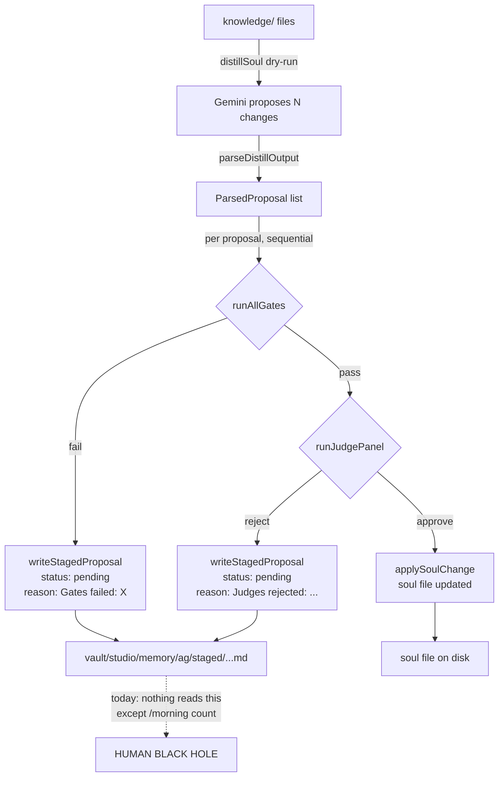
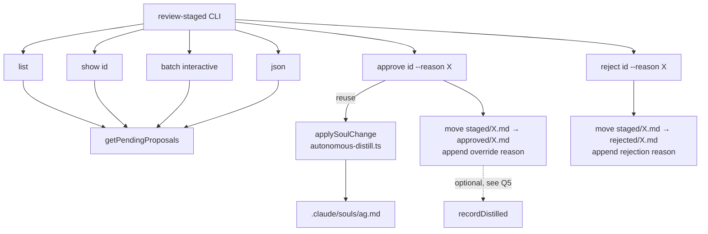

# ASL-0012 — `review-staged` CLI tool

## TL;DR

The autonomous self-learning pipeline produces two buckets of soul changes: auto-applied (unanimous judge approval + all gates passed) and **staged** (gate failure OR judge rejection OR both). Auto-applied changes land on the soul file automatically. Staged changes are written as markdown files to `vault/studio/memory/{agent}/staged/` and sit there forever until a human makes a decision.

Today, `/morning` shows how many staged proposals exist ("6 soul change(s) staged for review") but there is **no CLI to walk through them, see the diff, and accept or reject**. The staged bucket is write-only from the human side. ASL-0012 closes that loop.

This tool is the human-in-the-loop closure for ASL Phase 2. It is on the External MCP Readiness checklist (BRIEF §7) as a hard prerequisite — staged proposals accumulating forever is a known failure mode that blocks external exposure.

**Hard locks:**
- NO new dependency in `package.json`. Interactive prompts use Node `readline/promises` from stdlib.
- NO changes to the distill pipeline, gates, judges, or writer side of staging.
- NO auto-approve path. Every approve/reject is an explicit human action, confirmed in the shell, with a recorded reason when overriding a failed gate.
- NO reimplementation of soul-writing logic. The CLI calls `applySoulChange()` from `src/libs/autonomous-distill.ts` — the exact same function the pipeline uses for auto-apply. Zero duplicate write logic.
- NO deletion of staged files. Approve and reject MOVE files into sibling directories (`approved/`, `rejected/`) — nothing is lost, everything is auditable.
- NO modification of `agent_lifecycle` beyond calling the existing `recordDistilled()` helper on approve (if at all — see §Scoping Q5).

---

## Goals

1. **Close the human-in-the-loop for staged proposals.** The user runs `bun run tool review-staged` and can walk, inspect, approve, or reject every staged proposal across every agent.
2. **Reuse the existing soul writer.** `applySoulChange()` in `autonomous-distill.ts` is already the single source of truth for "apply one proposal to one soul file." The CLI calls it — never duplicates the logic.
3. **Make approvals traceable.** Every approve across a failed gate requires an override reason. Reason is persisted alongside the moved proposal file. Future reviewers can read why.
4. **Make rejections durable and learnable.** Rejected proposals move to a `rejected/` sibling dir with the rejection reason and timestamp. The data is in place for a future change to `autonomous-distill.ts` to check before regenerating the same idea.
5. **Match ASL-0009 (`agent-state`) conventions exactly.** CLI argument parsing, subcommand dispatch, color/no-color, stdout/stderr split, JSON output contract, exit codes — all mirror ASL-0009.

## Non-Goals

- Auto-approving anything based on heuristics. Every decision is human-driven.
- Re-running gates or judges from the CLI. The staged file is the record; no re-evaluation.
- Building a web UI (ASL Phase 2 §8 defers UI).
- Diffing the in-progress soul against git history or showing multi-line contextual diffs. A proposal's `## Proposed Change` block is already the canonical "what gets added" — it's what the pipeline applies and what the user needs to review.
- Un-approving (rollback). If a bad approval lands, the user fixes it by editing the soul file by hand. Rollback UX is out of scope.
- Modifying how staged proposals get WRITTEN. Producer side is frozen except for the two small changes explicitly called out in §Producer-side gap audit.

---

## Context

### The staged-proposal lifecycle today



### What review-staged introduces



### Data sources

| Source | Provides | Called via |
|---|---|---|
| `vault/studio/memory/{agent}/staged/*.md` | All staged proposals (frontmatter + body) | `getPendingProposals()` / `listStagedProposals()` from `src/libs/staged.ts` |
| `.claude/souls/{agent}.md` | Current soul file to apply changes to | `applySoulChange()` reads/writes via `fs` |
| `src/libs/autonomous-distill.ts` | `applySoulChange(agent, soulPath, proposal)`, `ParsedProposal` type | Direct import |
| brain.db `soul_changes` table | JSON-serialized `gateResults` + `judgeResults` from the original staging decision (optional enrichment for `show`) | `getSoulChangesByAgent()` — see §Scoping Q1 |

---

## Producer-side gap audit

Six critical questions answered by reading the current producer code. Two result in prerequisite NEEDS-FIX items on `src/libs/staged.ts`; four are already OK.

### Q1 — Where do staged proposals live?

**Answer:** Filesystem. `vault/studio/memory/{agent}/staged/{YYYYMMDD}-{HHmmss}-{slug}.md`.

Each file is a markdown document with YAML frontmatter (parsed by `parseStagedFrontmatter` in `src/libs/staged.ts:67`). There is NO SQLite table for staged proposals. The `soul_changes` table in brain.db logs a row per staged outcome (via `logSoulChange` in `autonomous-distill.ts:744`) with JSON-stringified `gateResults` and `judgeResults`, but that row is a *log*, not authoritative storage — the file on disk is the source of truth.

**Implications for the CLI:**
- Read path: `getPendingProposals(agent?)` (exported from `staged.ts:288`) returns `StagedFile[]` with `{ path, agent, filename, proposal }`.
- Write path (approve/reject): direct `renameSync` to sibling directory. No DB touch required for the state change itself.
- Enrichment for `show`: to display structured gate/judge results (model names, vote types, error types), the CLI can either (a) parse the `## Gate Results` and `## Judge Results` markdown sections from the file body, or (b) join by timestamp against the `soul_changes` table and parse its JSON. **Decision: option (a).** The file is the source of truth; the DB log could drift. Parsing the file's markdown tables is simpler and never stale relative to the file itself.

**Status:** No fix needed. The storage model is clear.

### Q2 — What is the stable proposal ID format?

**Answer:** The filename without extension — e.g., `20260408-052430-enhance-multi-stage-critique-with-gemini`.

`writeStagedProposal` at `staged.ts:141-143` constructs the filename as `${YYYYMMDD}-${HHmmss}-${slug}.md`. This is stable across reads: the file doesn't get renamed until approve/reject, and `listStagedProposals` reports `{ filename }` in each `StagedFile`.

**Concerns:**
- Two proposals staged in the same second would collide. Looking at the current 6 staged files, three of them share `20260408-052439-...` timestamps but different slugs. They won't collide because the slug differs. If they DID collide, `writeStagedProposal` would overwrite silently — a separate bug, but out of scope here.
- Cross-agent collision: filenames are scoped under `{agent}/staged/` so `echo/staged/X.md` and `tala/staged/X.md` are distinct. The CLI must disambiguate when the user passes a short ID — prefix-match across all agents and error if multiple match with a disambiguation message.

**Accepted ID format:**
- Long form: `{agent}/{filename-without-ext}` — fully qualified, never ambiguous. E.g., `echo/20260408-052430-enhance-multi-stage-critique-with-gemini`.
- Short form: `{filename-without-ext}` or any unique prefix. CLI resolves to a single match or errors with "ambiguous — did you mean: [list]".
- The numeric row in `list` output also gets a 1-based index that can be used as a shortcut within the same session: `review-staged show 3`. Index is recomputed per invocation, so it's valid only within one command.

**Status:** No producer fix needed. The filename is already stable and unique under the agent dir.

### Q3 — Soul writer reuse

**Answer:** `applySoulChange(agent, soulPath, proposal)` at `src/libs/autonomous-distill.ts:259-293`.

This function is **already exported**, takes a `ParsedProposal`, reads the soul file, appends the content to the matching `## {section}` heading via `appendToSection`, and writes atomically via `fs.writeFileSync`. It handles `add`, `modify`, and `remove` types. It is the exact function the pipeline's auto-apply path calls at line ~675 (after judges approve).

**What the CLI must do:** import `applySoulChange` + `ParsedProposal` and reconstruct a `ParsedProposal` from the `StagedProposal` the CLI reads. The field mapping is 1:1:

| `ParsedProposal` field | Source in `StagedProposal` / staged file |
|---|---|
| `title` | `proposal.title` (from frontmatter) |
| `type` | `proposal.changeType` |
| `section` | `proposal.section` |
| `confidence` | NOT stored in the staged file frontmatter — default to `"medium"` (this value is only used by gates which do not re-run on approve, so it is inert) |
| `evidence` | `proposal.evidence` (parsed from `## Evidence` body section) |
| `content` | `proposal.proposedChange` (parsed from `## Proposed Change` body section) |

**Atomic write:** `applySoulChange` calls `fs.writeFileSync` directly. That is NOT atomic — a mid-write crash leaves the soul file half-written. This is an **existing pipeline risk** (same risk the auto-apply path has). This task does NOT widen the scope to fix it, but flags it in §Risks so it's on the record. If the user wants atomicity, a follow-up can introduce a tmp-file-plus-rename writer in `autonomous-distill.ts` that both the pipeline and `review-staged` inherit.

**Status:** No refactor needed. Function is exported and reusable as-is.

### Q4 — Override reason storage

**Answer:** There is no current mechanism. The producer side only sets `status: "pending" | "approved" | "rejected"` in the frontmatter, with no reason field for the user decision.

**NEEDS-FIX (small, in this task):** Extend the staged file with a `decision:` section appended on approve/reject. The move operation writes a new section below `## Decision` when the file is rewritten into `approved/` or `rejected/`. The frontmatter `status:` field is also updated.

**Exact format appended on approve:**
```markdown
## Decision

Status: approved
Decided at: 2026-04-08T10:15:32Z
Decided by: user
Override reason: [user-provided text; required if any gate failed]
Applied via: review-staged CLI
```

**Exact format appended on reject:**
```markdown
## Decision

Status: rejected
Decided at: 2026-04-08T10:15:32Z
Decided by: user
Rejection reason: [optional user-provided text, "(none)" if omitted]
```

**Implementation:** add a `recordDecision(stagedFile, decision)` helper inside `src/libs/staged.ts` that (a) updates the frontmatter `status` field via string replace (the existing parser already handles both legacy and JSON-escaped forms) and (b) replaces the `## Decision` section body. This helper is added in this task — it is small and belongs next to `writeStagedProposal`.

**Status:** NEEDS-FIX. Small addition to `src/libs/staged.ts` — new exported function `recordDecision(filePath, { status, reason, timestamp })`. Covered in §File-by-file changes.

### Q5 — Rejection learning loop

**Answer:** The producer (`autonomous-distill.ts`) does NOT currently check for prior rejections when distilling. Gemini is prompted from knowledge files alone. A proposal the user rejects today can be regenerated next pipeline run.

**This is a known gap and is NOT fixed in this task.** Fixing it requires feeding rejection history back into the distill prompt (or into a gate), which is a larger design decision with its own tradeoffs. The review-staged CLI's job is to MAKE rejections durable and visible so a future task can wire them in.

**What `review-staged reject` does:**
1. Moves the file to `vault/studio/memory/{agent}/rejected/{filename}` (sibling of `staged/`).
2. Appends the rejection reason to the `## Decision` section of the moved file.
3. Sets frontmatter `status: rejected`.
4. Logs a row to `soul_changes` with `status: "rejected"` (via `logSoulChange` from `src/libs/brain/queries.ts`) so the brain.db record matches the file.

A future task can consume `rejected/` during distill prompt construction, or add a gate that short-circuits proposals whose normalized content matches a prior rejection. **Document this explicitly in the task doc as FOLLOW-UP RISK** so it doesn't get forgotten.

**Status:** No producer fix in this task. Documented as risk + future work.

### Q6 — Interactive prompt mechanics

**Answer:** No existing tool in `src/tools/` does interactive stdin prompting. `recall.ts`, `agent-save.ts`, `morning.ts`, `agent-state.ts` are all non-interactive. There is no house pattern to mirror.

**Decision: Node `readline/promises` (stdlib) — no new dependency.**

```ts
import { createInterface } from "node:readline/promises";
import { stdin as input, stdout as output } from "node:process";

async function confirm(question: string): Promise<boolean> {
  const rl = createInterface({ input, output });
  try {
    const answer = (await rl.question(`${question} [y/N] `)).trim().toLowerCase();
    return answer === "y" || answer === "yes";
  } finally {
    rl.close();
  }
}
```

**TTY guard:** before prompting, check `process.stdin.isTTY === true`. If stdin is not a TTY (piped, headless), error out with `"ERROR: interactive prompt requires a TTY. Use --yes to skip confirmation."` and exit 1. This prevents deadlocks when the tool is called from scripts or from a non-interactive shell.

**Status:** No fix needed. The pattern is stdlib; the task implements it inline in `review-staged.ts`.

### Summary of producer-side fixes required for this task

| # | Fix | Location | Why |
|---|---|---|---|
| F1 | Add `recordDecision(filePath, { status, reason, timestamp })` exported helper | `src/libs/staged.ts` | Q4 — persist override/rejection reasons into the moved file |
| F2 | (No code change, documentation only) Mark rejection learning loop as follow-up | task doc §Risks | Q5 — producer does not consume rejections yet |

That's it. No changes to `autonomous-distill.ts` writer, no changes to `brain.db` schema, no new tables. The minimum viable producer-side change is a single 30-40 line addition to `staged.ts`.

---

## Subcommand spec

All subcommands match `agent-state` CLI conventions exactly:
- Argv parsing via `process.argv.slice(2)` manual walk (no library)
- Global flags: `--help`, `-h`, `--no-color`
- Exit codes: 0 success, 1 error (unknown ID, TTY missing, write failure, etc.)
- stdout: normal output; stderr: errors and ANSI-disabled prompts
- ANSI colors: enabled only when `process.stdout.isTTY === true && !noColor`

### `review-staged list` (default subcommand)

Table view of all pending staged proposals across all agents.

**Flags:**
- `--agent <name>` — filter to one agent; validates against `discoverAgents()` from `agent-state.ts` (re-export or duplicate the helper — see §File-by-file)
- `--gate <gate-name>` — filter to proposals where the named gate failed (matches against `## Gate Results` body table). Valid gate names: `safety`, `size`, `drift`, `regression`, `constitution`.
- `--mine` — no-op filter today (single-user); reserved for future multi-user. Accept and ignore.

**Output (TTY, with color):**
```
review-staged — 6 pending proposals — 2026-04-08 08:48

  #  AGENT  PROPOSAL                                                 AGE      GATES FAILED            JUDGES
  1  echo   Refined Multi-Stage Critique                             18h ago  constitution            -
  2  echo   Music Card as Ground Truth                               18h ago  safety                  -
  3  echo   Enhance Multi-Stage Critique with Gemini Validation      3h ago   constitution            -
  4  echo   Acknowledge LLM Output Truncation Risk                   3h ago   constitution            -
  5  echo   Integrate Metatag Quality Control                        3h ago   constitution            -
  6  echo   Suno Fade In/Out Behavior                                3h ago   -                       3-0 reject

Sorted by age (oldest first). Use `show <id>` or `show <#>` for detail.
```

**Columns:**
- `#` — 1-based session index (usable as short ID within the same invocation)
- `AGENT` — from `StagedFile.agent`
- `PROPOSAL` — `proposal.title`, truncated to 55 chars with ellipsis
- `AGE` — humanized from file mtime using `humanizeAge()` from `agent-state.ts` (export/share)
- `GATES FAILED` — comma-separated list of gate names where `Pass` is `false` in the `## Gate Results` table; `-` if none failed
- `JUDGES` — compact form `{approve}-{reject} {verdict}` from `## Judge Results` table; `-` if no judge panel ran

**Sort:** oldest first (age desc) — surface what's been waiting longest.

**Exit:** 0 if zero or more proposals. Prints `All clear. No staged proposals.` if empty.

### `review-staged show <id>`

Full detail view for one staged proposal.

**ID resolution:**
1. Numeric (`1`-`999`): treat as session index — requires the user to have just run `list` OR this invocation to recompute the list. Since subcommands are one-shot, the session index is re-derived at the start of `show` by calling `getPendingProposals()` and sorting identically to `list`. This guarantees `show 1` always means "the oldest pending proposal across all agents," which is stable within a single `/morning` session but MAY shift if the user ran `approve` in between.
2. Full form (`echo/20260408-...-slug`): exact match on `{agent}/{filename-without-ext}`.
3. Short form (`20260408-...-slug`): prefix match against `{filename-without-ext}` across all agents. Error with disambiguation if >1 match.

**Output:**
```
=== Echo — Refined Multi-Stage Critique ===

  Staged:  20260408-052430  (3h ago)
  Scope:   echo
  Source:  vault/studio/memory/echo/staged/20260408-052430-enhance-multi-stage-critique-with-gemini.md
  Status:  pending
  Type:    modify
  Section: How I Think

  --- Diff to soul file ---
  Target: .claude/souls/echo.md § How I Think
  Change: append below the section heading

  + Applies a multi-stage critique, leveraging Gemini's proven capability: a 'flash pass' for
  + structural issues (like redundancy), then a 'pro-level pass' for deeper content and
  + qualitative analysis (like tactical depth, voice, opinion quality). This applies to any
  + document, including agent design files.

  --- Gates ---
  safety       PASS  No changes target protected sections
  size         PASS  1 lines added/modified, 0 removed — within limits
  drift        PASS  30-day drift 5/5 (46-line soul, 10% threshold)
  regression   PASS  1 high-similarity pair(s) checked, no contradictions
  constitution FAIL  The proposed change contradicts Echo's existing belief that critique...

  --- Judges ---
  (no judge panel run — gates failed first)

  --- Evidence ---
  gemini-general-critique-workflow.md

  --- Source raw files ---
  (not tracked by writer — see follow-up risk #3)

  --- Recommendation ---
  REJECT — failed constitution gate; proposal contradicts existing soul belief.

Next: `review-staged approve echo/20260408-052430-...` (requires --reason)
      `review-staged reject echo/20260408-052430-...`
```

**Recommendation rule:**
- All gates pass AND judges unanimously approve → `APPROVE — would have auto-applied; review required only because of degraded judge mode`
- All gates pass AND judges rejected → `REJECT — N/3 judges rejected substantively`
- Gates failed → `REJECT — failed {gate} gate; {reason snippet}`
- Gates failed but judges approved despite → `BORDERLINE — gate failure vs judge approval; human call`
- Any ambiguity → `BORDERLINE — see gates and judges above`

**Source raw files line:** today, `writeStagedProposal` does not record which raw context files produced the learning. This is a data gap, **not fixed in this task**. Display `(not tracked by writer — see follow-up risk #3)` so the user understands the column is empty by design, not by bug.

### `review-staged approve <id>`

Apply the proposal to the soul file.

**Flags:**
- `--reason "..."` — override reason. **Required if any gate is marked FAIL in the staged file.** Optional if all gates passed (e.g., judge-only rejection).
- `--yes` — skip confirmation prompt.

**Flow:**
1. Resolve `<id>` to a single `StagedFile`. Error if not found or ambiguous.
2. Inspect the `## Gate Results` body table. If any row has `Pass=false` and `--reason` is not supplied, error: `ERROR: --reason "..." is required when overriding failed gate(s): {list}`.
3. Reconstruct a `ParsedProposal` from the staged file (field mapping per §Q3).
4. Resolve `soulPath = .claude/souls/{agent}.md`. Error if missing.
5. If `--yes` is NOT set: print a 1-line summary (agent, title, section, "override reason: X" if present) and prompt `Apply this change to the soul file? [y/N]`. Abort on anything other than `y`/`yes`. TTY check as per §Q6.
6. Call `applySoulChange(agent, soulPath, parsedProposal)`. On throw, exit 1 with the error.
7. Move the staged file: `renameSync(staged/{filename}, approved/{filename})`. Create `approved/` directory if missing.
8. Call `recordDecision(newPath, { status: "approved", reason: args.reason ?? null, timestamp })` (helper F1 added in this task).
9. Log a row to `soul_changes` via `logSoulChange` with `status: "approved"` for brain.db parity.
10. Print confirmation: `Approved echo/20260408-052430-.... Soul file updated. Moved to approved/.`
11. Exit 0.

**Do NOT call `recordDistilled`.** The existing pipeline only calls `recordDistilled` from `autonomous-distill.ts` once per distill run, not per proposal. Calling it here would race against any in-flight daemon distill and corrupt `soul_version_hash`. The soul file's new content will be picked up by the daemon's next hash check, or by a manual `asl-sync`, and the lifecycle row will update then. Leave it alone.

**Atomicity:** The sequence "write soul file → move staged file → update decision → log db" is not atomic. Mitigations:
- If `applySoulChange` throws: staged file is untouched, no move, no db log. Safe.
- If move succeeds but `recordDecision` throws: the file is in `approved/` but the `## Decision` section is not appended. Exit 1 with error; the user can rerun the helper manually or fix the file by hand. The soul file is ALREADY updated — no rollback. Log the error loudly.
- If `logSoulChange` throws: the file is in `approved/` with decision recorded but brain.db has no audit row. Non-fatal — warn on stderr, exit 0. DB audit is secondary to the filesystem record.

### `review-staged reject <id>`

Discard the proposal.

**Flags:**
- `--reason "..."` — optional rejection reason. If omitted, stored as `(none)`.
- `--yes` — skip confirmation prompt.

**Flow:**
1. Resolve `<id>` to a single `StagedFile`. Error if not found or ambiguous.
2. If `--yes` is NOT set: prompt `Reject this proposal? [y/N]`. Abort on no.
3. Move: `renameSync(staged/{filename}, rejected/{filename})`. Create `rejected/` if missing.
4. `recordDecision(newPath, { status: "rejected", reason: args.reason ?? "(none)", timestamp })`.
5. `logSoulChange({ ..., status: "rejected" })`.
6. Print `Rejected echo/20260408-.... Moved to rejected/.`
7. Exit 0.

### `review-staged batch`

Interactive walkthrough of all pending proposals, one at a time.

**Flow:**
1. Fetch all pending with `getPendingProposals()`, sort oldest-first (same as `list`).
2. If empty, print `All clear. No staged proposals.` and exit 0.
3. Print a header: `review-staged batch — N proposals to review. Ctrl-C to abort.`
4. For each proposal (in order):
   - Print the full `show` output (reuse `formatShow`).
   - Prompt: `[a]pprove / [r]eject / [s]kip / [q]uit: `
   - `a` → if any gate failed, prompt `Override reason: ` (required, non-empty); then call the approve path with `--yes` implied and the collected reason
   - `r` → prompt `Rejection reason (optional, enter to skip): `; call reject path with `--yes` implied
   - `s` → continue to next proposal, no state change
   - `q` → stop the loop, print summary so far, exit 0
5. At the end: print summary `Batch complete: {approved} approved, {rejected} rejected, {skipped} skipped.`

**TTY required.** If stdin is not a TTY, error and exit 1 immediately.

**Re-fetch between items:** no. The list is captured once at the start. If the user is running the daemon concurrently and a new proposal gets written mid-batch, it won't appear in this batch — they'll see it next time.

### `review-staged json`

Equivalent to `list` but emits JSON to stdout for scripting.

**Shape (top-level keys always present):**
```json
{
  "generatedAt": "2026-04-08T08:48:47Z",
  "total": 6,
  "proposals": [
    {
      "id": "echo/20260408-052430-enhance-multi-stage-critique-with-gemini",
      "index": 1,
      "agent": "echo",
      "title": "Enhance Multi-Stage Critique with Gemini Validation",
      "section": "How I Think",
      "changeType": "modify",
      "ageSeconds": 10800,
      "mtimeIso": "2026-04-08T05:24:30Z",
      "sourcePath": "vault/studio/memory/echo/staged/20260408-052430-enhance-multi-stage-critique-with-gemini.md",
      "status": "pending",
      "gatesFailed": ["constitution"],
      "judgesSummary": { "approve": 0, "reject": 0, "abstain": 0, "ran": false },
      "reason": "Gates failed: constitution",
      "recommendation": "REJECT"
    }
  ]
}
```

Stable contract — all top-level keys present even on empty list. Flags: `--agent`, `--gate` accepted same as `list`.

---

## Storage model (exact)

```
vault/studio/memory/
  echo/
    staged/                        ← pending, what the CLI walks
      20260408-052430-enhance-...md
      20260408-052439-...md
    approved/                      ← moved here by `review-staged approve`
      20260407-123456-...md        ← `## Decision` section rewritten; status: approved
    rejected/                      ← moved here by `review-staged reject`
      20260407-001122-...md        ← `## Decision` section rewritten; status: rejected
    archive-pre-fix/               ← unrelated, pre-existing
      ...
```

`approved/` and `rejected/` are created lazily on first write. They live as siblings of `staged/` under the agent's memory dir. They are never read by the producer pipeline today — they are write-only audit trails. That's fine; Q5's follow-up can make `rejected/` readable.

**Why not `archive/`?** The memory module already uses `archive/` for consolidated-knowledge cleanup (different lifecycle). Mixing staged-decision archives into the same directory would confuse both systems. Keep them separate.

---

## File-by-file changes

### NEW: `src/tools/review-staged.ts` (~550 lines)

Full CLI implementation. Sections:

1. **Imports**: `getPendingProposals` from `staged.ts`, `applySoulChange`, `ParsedProposal` from `autonomous-distill.ts`, `recordDecision` (new, F1), `logSoulChange` from `brain/queries.ts`, `recordDistilled` NOT imported (see approve flow note), `humanizeAge`, `formatLocal`, `discoverAgents` from `agent-state.ts` (re-export or duplicate as needed — prefer import if possible without circular risk), `createInterface` from `readline/promises`.
2. **ANSI helpers**: copy the minimal `ANSI_*` + `color()` pattern from `agent-state.ts`.
3. **Types**: `StagedSummary`, `GateSummary`, `JudgeSummary`, `Recommendation` — all pure data.
4. **Body parsers**: `parseGateResultsTable(body)`, `parseJudgeResultsTable(body)` — regex-based parsers for the `## Gate Results` and `## Judge Results` markdown sections written by `formatGateResults` / `formatJudgeResults` in `staged.ts`. These functions are a small price for staying on option (a) from Q1.
5. **ID resolution**: `resolveProposalId(arg: string, proposals: StagedFile[]): StagedFile`. Throws on not-found or ambiguous with a helpful message.
6. **ParsedProposal reconstruction**: `toParsedProposal(stagedFile: StagedFile): ParsedProposal` — the 1:1 field mapping from §Q3.
7. **Decision recording integration**: calls `recordDecision` from `staged.ts`.
8. **Subcommand runners**: `runList`, `runShow`, `runApprove`, `runReject`, `runBatch`, `runJson`.
9. **Formatters** (pure, testable): `formatList`, `formatShow`, `formatJson`, `formatRecommendation`, `truncate`.
10. **Interactive helpers**: `confirm(question)`, `promptRequiredReason(question)`, `promptOptionalReason(question)`, `batchChoice()`.
11. **Main CLI dispatch**: mirror `agent-state.ts` argv parsing and `import.meta.main` block.

### MODIFY: `src/libs/staged.ts` (+ ~50 lines, F1)

Add `recordDecision` function and supporting types. Do NOT change existing exports.

```ts
export interface StagedDecision {
  status: "approved" | "rejected";
  reason: string | null;    // null maps to "(none)"
  timestamp: string;        // ISO-8601
}

/**
 * Rewrite a staged proposal file to reflect a human decision.
 * Updates frontmatter `status` and replaces the `## Decision` section body.
 * The file must already be at its new location (approved/ or rejected/) —
 * this function does NOT move files. The caller handles `renameSync` first,
 * then calls this with the new path.
 *
 * Failure modes:
 * - File does not exist → throws ENOENT
 * - Frontmatter missing → throws with explicit message
 * - `## Decision` section missing → appends a new one (legacy files)
 */
export function recordDecision(filePath: string, decision: StagedDecision): void {
  // ... implementation
}
```

Also export a helper used by tests:
```ts
export function readStagedFile(filePath: string): StagedFile;
```
(thin wrapper around the existing parsing logic inside `listStagedProposals` — extract it into a private function and expose a public wrapper).

### MODIFY: `src/libs/autonomous-distill.ts` (no changes)

The `applySoulChange` and `ParsedProposal` exports are already in place. Nothing to add. If the existing `export` keywords are missing on either symbol, that's the full extent of the change — verify before implementation and add `export` if needed. (Both are exported today per lines 54 and 259.)

### NEW: `src/tools/__tests__/review-staged.test.ts`

Unit tests against a temp directory fixture:
- `parseGateResultsTable` — parses known fixture, extracts names + pass flags
- `parseJudgeResultsTable` — parses, including `degradedMode: true` header
- `resolveProposalId` — exact, prefix, ambiguous, not-found cases
- `toParsedProposal` — exhaustive field mapping from a known staged file
- `formatList` — snapshot of formatted output for a 3-proposal fixture
- `formatShow` — snapshot for one proposal
- `formatJson` — contract keys always present on empty and non-empty input
- `recordDecision` — round-trip: write staged, call recordDecision, re-parse, assert frontmatter + body updated
- Approve integration: fixture staged file + fixture soul file + `applySoulChange` + `renameSync` sequence — assert soul file updated, file moved, decision recorded

Use `os.tmpdir()` + `mkdtempSync` for test scratch space. Never touch real vault paths.

### MODIFY: `vault/studio/projects/autonomous-self-learning/tasks/TASKS.md`

Move ASL-0012 row out of Immediate when shipped (Ryan does NOT do this — that's Freddie post-commit). For this task doc, add the link to ASL-0012 in the Immediate row's `Doc` column.

---

## Acceptance criteria

Measurable. Ryan verifies each before calling the task done.

1. `bun run tool review-staged` (no args) prints a table of all current pending proposals across all agents, sorted oldest-first, showing agent / title / age / gates-failed / judges-summary. Runs against the 6 real staged proposals in `vault/studio/memory/echo/staged/` successfully.
2. `bun run tool review-staged show <id>` prints full detail for one proposal, including reconstructed diff preview, gates table, judges table, evidence, and a one-line recommendation. Works with long ID, short ID, session index, and errors cleanly on ambiguous/missing IDs.
3. `bun run tool review-staged approve <id> --reason "..." --yes` against a fixture staged file:
   - Reads the soul file
   - Calls `applySoulChange` (verified by side effect on the soul file content)
   - Moves the staged file to `approved/{filename}`
   - Rewrites `## Decision` section with status, timestamp, override reason
   - Logs a `soul_changes` row with `status: approved`
   - Exit code 0
4. `bun run tool review-staged approve <id>` with no `--reason` on a proposal that has a failed gate **errors** with `--reason` required message and exit 1. No soul file write, no move.
5. `bun run tool review-staged reject <id> --yes` moves file to `rejected/`, records decision, logs row, exit 0.
6. `bun run tool review-staged batch` (TTY) walks proposals interactively; `a`/`r`/`s`/`q` keys dispatch correctly; summary at end is accurate.
7. `bun run tool review-staged batch` with stdin not a TTY errors immediately with TTY message, exit 1.
8. `bun run tool review-staged json` emits valid JSON with stable top-level keys (`generatedAt`, `total`, `proposals`) regardless of whether the list is empty.
9. `bun run tool review-staged --help` prints usage with all subcommands, exits 0.
10. Unit tests pass via `bun test src/tools/__tests__/review-staged.test.ts`.
11. Zero duplicate soul-write logic — grep for `writeFileSync` under `src/tools/review-staged.ts` returns no results (soul writing happens exclusively via imported `applySoulChange`).
12. Manual smoke test against real staged proposals: `list` and `show 1` through `show 6` all render without errors. **`approve` and `reject` are NOT run against real proposals until the user explicitly confirms.** The user will do the real approval pass themselves after the CLI is reviewed.

---

## Risks

| # | Risk | Likelihood | Mitigation |
|---|---|---|---|
| 1 | Mid-write crash leaves soul file half-written | Low | Existing pipeline risk inherited unchanged. Documented for a future atomic-write refactor in `autonomous-distill.ts`. Not fixed here because fixing it for review-staged only would leave the pipeline still vulnerable. |
| 2 | Interactive prompt deadlocks if stdin is not a TTY | Medium | `process.stdin.isTTY` check before every `createInterface`. Exit 1 with a clear message if missing. `--yes` flag bypasses all prompts. |
| 3 | Rejected proposals get regenerated by the next pipeline run | High | **Documented as FOLLOW-UP** — producer does not consume `rejected/` today. This task ensures rejections are DURABLE and VISIBLE so a future task can wire them in. Create a new ASL task (suggested `ASL-0015 — consume rejected proposals in distill`) after ASL-0012 ships. |
| 4 | Session index (`show 1`) shifts between invocations | Low | Documented in `--help`. The fully-qualified ID is the stable form; session index is a convenience. Batch mode uses captured list so indices are stable within a batch. |
| 5 | Override reason stored in file body only (not in brain.db) | Low | `logSoulChange` gets the reason in its `changeSummary` field too (prefix with `[approved-override] `). Dual-write: file is source of truth, DB is searchable audit. |
| 6 | `recordDecision` races against a concurrent daemon distill that rewrites the same file | Very low | Daemon distill only writes NEW files into `staged/`, never rewrites existing ones. The file the CLI is modifying is ONLY written by the CLI. Race window is empty. Not relevant for `approved/` or `rejected/` dirs (daemon never touches them). |
| 7 | Two proposals with identical timestamp + slug collide | Very low | Producer bug, not fixed here. If it ever happens, `listStagedProposals` returns one and the other is silently lost — separate bug, track independently. |
| 8 | Soul file content does not have the expected `## {section}` heading | Medium | `applySoulChange` → `appendToSection` falls back to "append at end of file" if the heading is not found. Document this fallback in `show` output ("Section `How I Think` not found in soul file — will append at end") so the user knows before they approve. |

---

## Test plan

### Unit tests (fixture-based, `bun test`)

Located in `src/tools/__tests__/review-staged.test.ts`.

1. **`parseGateResultsTable`** — fixture with all 5 gates, mixed pass/fail, asserts shape.
2. **`parseJudgeResultsTable`** — fixture with `Approved: false`, `degradedMode: true`, 3 votes; asserts vote counts.
3. **`parseJudgeResultsTable` — no panel ran** — fixture with `No judge panel run.`; asserts `{ ran: false, approve: 0, reject: 0 }`.
4. **`resolveProposalId`** — exact match, prefix match (unique), prefix match (ambiguous error), not-found error, session index.
5. **`toParsedProposal`** — asserts 1:1 mapping.
6. **`formatList`** — snapshot test against 3-proposal fixture.
7. **`formatShow`** — snapshot for 1 proposal.
8. **`formatJson`** — stable keys on empty and populated list.
9. **`recordDecision` round-trip** — write temp staged file → call recordDecision(approved) → re-parse → assert frontmatter status + body decision section updated.
10. **Approve integration test** — temp dir with fixture soul + fixture staged → run approve subcommand via imported `runApprove` function → assert soul file content, file location, decision content, exit behavior.
11. **Reject integration test** — same structure.
12. **TTY guard test** — set `process.stdin.isTTY = false`, call runBatch, assert error.

### Manual smoke tests (against real vault, READ-ONLY phase only)

Run in order, approve/reject only after user confirmation:

1. `bun run tool review-staged` — expect table of 6 pending proposals (per `/morning`)
2. `bun run tool review-staged --help`
3. `bun run tool review-staged list --agent echo`
4. `bun run tool review-staged list --gate constitution`
5. `bun run tool review-staged show 1`
6. `bun run tool review-staged show 6`
7. `bun run tool review-staged show echo/20260408-052430-enhance-multi-stage-critique-with-gemini`
8. `bun run tool review-staged show 20260408-052430-enhance` (prefix match)
9. `bun run tool review-staged show 20260408-052439` (ambiguous — expect error with disambiguation)
10. `bun run tool review-staged json | jq .total` — expect `6`
11. **STOP HERE.** Do NOT run `approve` or `reject` against real proposals. User will review the CLI output and drive real decisions themselves.

### Integration smoke (against temp fixture — safe)

1. Build a temp vault with 2 fake staged proposals + 1 fake soul file.
2. Run `review-staged --yes approve <id> --reason "test override"` against it.
3. Assert: soul file updated, staged file moved to `approved/`, `## Decision` section present with override reason, `soul_changes` row logged.
4. Run `review-staged --yes reject <other-id>`.
5. Assert: staged file moved to `rejected/`, decision recorded, row logged.
6. Run `review-staged list` against the same temp vault — expect `All clear. No staged proposals.`

---

## Dependencies

- **ASL-0002** (brain.db schema: `tasks` + `agent_lifecycle` + `soul_changes`) — shipped. Provides the `soul_changes` table this CLI writes to.
- **ASL-0004** (agent-lifecycle library) — shipped. Not directly imported, but the conventions established here mirror it.
- **ASL-0009** (agent-state CLI) — shipped. Source of CLI conventions (`humanizeAge`, `formatLocal`, ANSI helpers, `discoverAgents`, subcommand dispatch pattern).
- **`src/libs/autonomous-distill.ts`** — provides `applySoulChange` and `ParsedProposal`. No changes required (already exported).
- **`src/libs/staged.ts`** — provides `getPendingProposals`, `listStagedProposals`, and (new via F1) `recordDecision`, `readStagedFile`.
- **`src/libs/brain/queries.ts`** — provides `logSoulChange`.

**Blocks:**
- **ASL-0011** — external MCP readiness gate. `review-staged` is on the readiness checklist (BRIEF §7). Until this ships, the external MCP toggle stays red.

---

## Out of scope (explicit)

- Rollback / unapprove. If the user regrets an approval, they edit the soul file by hand.
- Rollback of rejected proposals (move back to `staged/`). Out of scope.
- Bulk approve all / bulk reject all. `batch` is the interactive equivalent — explicit per-item confirmation is the point.
- Editing a proposal before approving (e.g., tweaking the content). Out of scope; if the proposal needs editing, reject and let the pipeline regenerate from improved knowledge files.
- Filtering `list` by age, date range, or confidence. `--agent` and `--gate` are the only filters.
- Diff visualization beyond the simple `+` line preview. No mermaid, no colored inline diff.
- Integration with the daemon HTTP API. The daemon does not need to know about approvals — it just reads the filesystem on its next distill cycle.
- Multi-user support (different reviewers, per-user history). Single-user only today; `--mine` flag is reserved but a no-op.

---

## Notes for Ryan

- **Start with `src/libs/staged.ts` F1 (`recordDecision`).** Get the helper and its round-trip test green first. Everything else depends on it.
- **Then write the formatters.** `formatList`, `formatShow`, `formatJson` are pure functions — fastest feedback loop.
- **Wire CLI dispatch last.** Mirror `agent-state.ts` — don't invent a new argv parser.
- **Use `discoverAgents` and `humanizeAge` from `agent-state.ts`.** If they are not exported, export them (small refactor; document in the commit).
- **Do NOT touch `autonomous-distill.ts` beyond confirming `export` keywords.** If a symbol is already exported (likely both are), the file has zero changes.
- **Do NOT write an `.md` summary or report file at the end.** Return findings as the final assistant message. That goes for you as always.
- **Do NOT run `approve` or `reject` against the real vault staged proposals** during development. Use fixtures. The user drives real decisions.

---

## ADR — Storage model: filesystem vs SQLite

**Context:** Should staged proposals migrate to a `staged_proposals` SQLite table as part of this task?

**Options:**

| Option | Pro | Con |
|---|---|---|
| A — Keep filesystem + markdown (current) | Zero migration, human-readable on disk, already works | Parsing markdown tables for structured data is fragile |
| B — Migrate to SQLite table | Structured queries, typed gate/judge results, easier to display | Large migration, touches producer + consumer, existing staged files need backfill |
| C — Hybrid: filesystem source of truth + mirror table | Read from table (fast structured queries), filesystem still auditable by hand | Dual-write complexity, sync drift risk, worse of both worlds |

**Decision: A.** Filesystem + markdown stays. Rationale:
1. ASL-0012 is a CLI, not a data-model refactor. Scope discipline.
2. The producer (`writeStagedProposal`) is frozen except for F1. Migrating storage means rewriting the producer.
3. Parsing the `## Gate Results` and `## Judge Results` tables is a <50-line regex pass. Fragile only if the writer format changes — and the writer is in the same repo, tested, and won't drift silently.
4. Human-readable staged files are an audit feature, not a bug. An operator can `cat` a staged file and understand everything without a query tool.
5. If a future task wants structured queries (e.g., "all staged proposals with constitution gate failures in the last 30 days"), that's the task that should do the migration — with its own design pass.

**Consequences:**
- The CLI owns a regex parser for the staged-file markdown tables. It lives next to the writer that produces them so drift is detectable in review.
- If the writer ever changes the table format, the CLI parser must change in the same commit. Add a comment in `staged.ts` formatters pointing to the CLI parser.
- Structured cross-agent queries ("give me all pending constitution failures") are O(N) file reads — acceptable at current scale (<20 staged files total).
