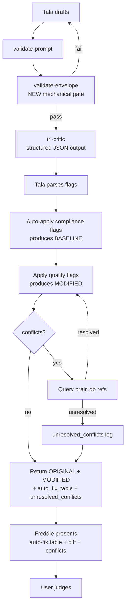
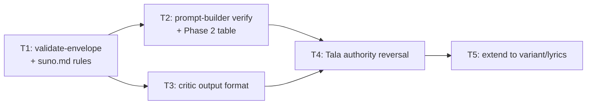

# ASL-0025 — Canonical Compliance Gate + Critic Authority Reversal

## Why this exists

On `2026-04-09 00:22` a `/create-track` run for "Sunlit Shamisen Bossa" shipped a BGM with **five missing canonical conventions** (missing `[Instrumental]`, missing `[No Vocals]`, no BPM token, no Key token, `[Section N: …]` instead of `[Verse]/[Chorus]`). The user caught three during Phase 4 review. Tala rejected the one critic flag that was right ("genre fusion") citing "user approved" authority she did not actually hold.

Investigation ([`vault/studio/tracks/2026-04-09/002257-sunlit-shamisen-bossa.md`](../../../tracks/2026-04-09/002257-sunlit-shamisen-bossa.md)) identified six failure layers:

1. Tala skipped `prompt-builder` entirely (violating `suno.md:63`).
2. No mechanical enforcement gate between draft and tri-critic for canonical envelope.
3. `workflow.md` P3-002 has no explicit envelope verification step.
4. `validate-prompt` P3-007b gate catches conflicts but not envelope presence.
5. Phase 2 analysis table hides structural decisions (section-marker format, envelope slots) from user review.
6. Tala held unilateral reconciliation authority and used it to reject valid compliance flags.

This task operationalizes **PRINCIPLES 4, 5, 6** at the creative-skill layer:

- **P4 — Degraded modes fail closed.** Missing envelope elements must block save, not get auto-resolved by Tala's judgment.
- **P5 — Every automated write leaves an audit trail.** The auto-fix table is the creative-skill equivalent of the ASL audit log: every mechanically-applied change is attributed to its source (`tool|gemini|minimax|grok`).
- **P6 — Rejection is information that flows upstream.** The ORIGINAL-vs-MODIFIED diff surfaces every quality flag to the user — Tala never unilaterally rejects; rejection happens at the human layer.

---

## Architecture summary

### Current flow (broken)


**Failure:** Tala is both the implementer and the judge. Compliance and quality flags are both subject to her judgment. No envelope gate. Phase 4 gets a pre-filtered version — user cannot see what was rejected.

### Target flow



**Key inversion:** Tala applies, user judges. `type:compliance` flags auto-apply and are not judgment-rejectable. `type:quality` flags all flow through to the MODIFIED version (minus conflicts), and the user picks ORIGINAL vs MODIFIED vs Adjust.

---

## Critical discoveries from code read

1. **prompt-builder already emits the BGM envelope.** `src/libs/prompt-builder/strategies/suno.ts` lines 240–244 already prepends `[Instrumental]` (slot 1), appends `[No Vocals] [Background Music]` (slot 11, line 315–319), injects `{key}, {bpm} BPM` (slot 7, line 292). **The T2 framing in the intake brief is wrong.** The builder works. The bug was that Tala skipped the builder entirely (finding #1 in the investigation). T2's real scope is (a) confirm the 4 slots still emit under current inputs, (b) decide whether `[Background Music]` should remain (currently paired with `[No Vocals]`), and (c) Phase 2 analysis table visibility. No code change to the envelope slot logic itself is strictly needed — but T1's `validate-envelope` tool will expose any regression the minute it ships.

2. **charcount.ts detects track type by envelope tags.** `src/tools/charcount.ts:46-48` — `detectTrackType` returns `"instrumental"` only if `[Instrumental]` or `[No Vocals]` is present. A BGM without the envelope is mis-classified as vocal, which also explains why the mandatory `clean mix`/`separated instruments` tag checks (charcount.ts:104-110) failed to fire on the sunlit-shamisen-bossa track.

3. **Tala's soul has the "override critic suggestions" line TWICE.** `.claude/souls/tala.md:24` and again at `:26` and again at `:35`. All three instances must be inverted in T4.

4. **minimax-music skill has NO tri-critic.** `.claude/skills/minimax-music/workflow.md` nodes 001-013 go draft → variation → API gen with **zero critic nodes**. Sol does not currently run Gemini/MiniMax/Grok on her drafts. This means T5's scope for `/minimax-music` is ambiguous: either (a) we're adding tri-critic to Sol for the first time as part of this task (scope creep — probably not tonight), or (b) we skip `/minimax-music` from T5 and note it as follow-up, or (c) we only inject the authority-reversal scaffolding and defer the actual critic dispatch to a later task. **Flagged for Freddie — recommend option (b).**

5. **lyrics skill reconciliation is already partially "authority-reversed".** `.claude/skills/lyrics/workflow.md:231-252` node 012 has a reconciliation table with a `Source: tool|critic` column and a mandatory-fix rule for tool-originated flags. This is a cousin of what T4 wants. The gap: Rune still holds "Rune decides with reason" authority for single-flag cases, and there is no ORIGINAL-vs-MODIFIED return shape. T5 needs to formalize Rune's existing table into the ORIGINAL/MODIFIED + auto_fix_table + unresolved_conflicts return contract.

6. **Grok critic reuses `production-musical.md`** (create-track workflow.md:564) — so T3's prompt update to `production-musical.md` covers both Gemini and Grok for `/create-track`. For `/lyrics`, Grok uses `lyrics-intentionality.md` (workflow.md:222) — that file also needs the T3 structured-output contract.

---

## Dependency order and rationale



| Commit | Tier | Why here |
|--------|------|----------|
| 1 | **T1** alone | Mechanical gate is the foundation. Everything downstream references it. If T1 ships first, the next time Tala drafts anything the envelope bug cannot recur, even before T4 lands. This is the highest-value, lowest-risk piece. |
| 2 | **T2 + T3** bundled | T2 is small (verify builder + add 2 rows to analysis table — mostly a doc change). T3 is medium (3 critic file edits). They are independent of each other but both required before T4 can be built or tested. Bundling them into one commit keeps the rollback unit small enough and means T4 dispatch doesn't wait on two separate review cycles. |
| 3 | **T4** alone | This is the risky one — it rewires the entire Phase 3 reconciliation flow, inverts soul/agent authority, and changes Phase 4's UI contract. Must ship in isolation so a rollback doesn't drag the earlier tiers with it. |
| 4 | **T5** alone | Pure propagation — copies T4's pattern to `/create-track-variant` and `/lyrics` (and punts on `/minimax-music`, see discovery #4). Low risk once T4 is proven on `/create-track`. |

### Cross-cutting dependencies

- **T3 → T4:** Tala's new reconciliation (T4) parses structured JSON flags. If T3 ships the format but the critics don't actually emit JSON reliably (LLM drift), T4's parser must degrade gracefully — default to treating an unparseable flag as `type: quality` (safe default, surfaces to user). Specified in T4 acceptance criteria.
- **T1 → T4:** T4's workflow.md update at P3-007b references `validate-envelope`. T1 must land first or T4 merges a dangling reference.
- **T2 → T4:** Weaker. T4 can test against the builder as-is. But the Phase 2 table update in T2 should land before T4 changes Phase 4, because user expects consistent "you'll see structural decisions before Phase 3" framing across both review gates.

---

## T1 — Canonical envelope verification (mechanical gate)

### Goal
A CLI tool that mechanically checks whether a Style + Lyrics pair contains the canonical Suno envelope for its type. Non-judgment-rejectable. Wired into the workflow as a hard gate.

### New file: `src/tools/validate-envelope.ts`

**Signature:**

```typescript
type TrackType = "bgm" | "vocal";

interface EnvelopeCheck {
  slot: string;                    // e.g., "instrumental_tag", "no_vocals_tag", "bpm_token", "key_token", "canonical_section_markers"
  required: boolean;
  present: boolean;
  severity: "error" | "warning";
  message: string;
  fix?: string;
}

interface EnvelopeResult {
  type: TrackType;
  pass: boolean;                   // true iff no error-severity checks failed
  checks: EnvelopeCheck[];
  styleCharCount: number;
  elementCount: number;
}

export function validateEnvelope(args: {
  type: TrackType;
  style: string;
  lyrics?: string;                 // optional; lyrics-dependent checks skipped if absent
}): EnvelopeResult;
```

### CLI contract

```
bun run tool validate-envelope --type bgm --style "<text>" --lyrics "<text>"
bun run tool validate-envelope --type bgm --style-file out/tala-draft.md --lyrics-file out/tala-draft.md
bun run tool validate-envelope --type vocal --style-file out/tala-draft.md --lyrics-file out/rune-draft.md --json
```

| Flag | Type | Required | Notes |
|------|------|----------|-------|
| `--type` | `bgm`\|`vocal` | yes | Missing = exit 2, error to stderr |
| `--style` | string | one of `--style` / `--style-file` required | Raw Style block text |
| `--style-file` | path | alt to `--style` | Extract via same regex as `charcount.ts` (`### Style\n\`\`\`\n...\`\`\`` or `Style:\n\`\`\`\n...\`\`\``) |
| `--lyrics` | string | optional | Raw Lyrics block text |
| `--lyrics-file` | path | alt | Same extraction logic for `### Lyrics` code block |
| `--json` | bool | optional | Emit `EnvelopeResult` as JSON to stdout, exit still reflects pass/fail |

**Exit codes:** `0` pass, `1` validation errors present, `2` bad arguments.

### Check matrix

| # | Slot key | Type | Check | Severity |
|---|---------|------|-------|----------|
| 1 | `instrumental_tag` | bgm | `style` trimmed starts with `[Instrumental]` (case-insensitive, allow `[Instrumental] ` followed by anything) | error |
| 2 | `no_vocals_tag` | bgm | `style` trimmed contains `[No Vocals]` in slot 11 position (i.e., anywhere after the genre slot — regex `\[No Vocals\]`) | error |
| 3 | `bpm_token` | both | `style` matches `/\b\d{2,3}\s*BPM\b/i` | error |
| 4 | `key_token` | both | `style` matches `/\b[A-G][#b]?\s+(Major|Minor)\b/` | error |
| 5 | `canonical_section_markers` | both | `lyrics` contains at least one canonical marker (`[Verse]`, `[Verse N]`, `[Chorus]`, `[Pre-Chorus]`, `[Post-Chorus]`, `[Bridge]`, `[Hook]`, `[Refrain]`, `[Short Instrumental Intro]`, `[Outro]`, `[Interlude]`, `[Break]`, `[Build]`, `[Drop]`, `[Breakdown]`, `[Solo]`, `[Guitar Solo]`, `[Fade Out]`, `[End]`) AND contains zero non-canonical `[Section N: ...]` style markers (regex `\[Section\s*\d+[:\s]`) | error |
| 6 | `no_instrumental_tag_in_vocal` | vocal | `style` must NOT start with `[Instrumental]` | error |
| 7 | `no_no_vocals_tag_in_vocal` | vocal | `style` must NOT contain `[No Vocals]` | error |
| 8 | `mandatory_production_tags` | bgm | `style` contains `clean mix` AND `separated instruments` (already checked in charcount; re-check here for completeness) | warning |
| 9 | `element_count_sanity` | both | 3–7 comma-separated elements (after stripping envelope tags) | warning |

If `lyrics` is omitted, skip checks #5 (and emit an info-level `lyrics_not_provided` message in JSON output, but don't fail).

### Wiring updates

**`.claude/skills/create-track/workflow.md`:**

- **P3-007b** (line 504) — add `validate-envelope` call **before** `validate-prompt`:
  ```bash
  bun run tool validate-envelope --type {bgm|vocal} --style-file out/tala-draft.md --lyrics-file out/tala-draft.md --json
  ```
  Exit non-zero blocks progression to P3-008 regardless of validate-prompt result. The `--json` output is appended to the draft context for P3-008 critics to see.
- **P5-001 Compliance gate** (line 675) — add check 0: "Canonical envelope via `validate-envelope` (must have run in P3-007b with exit 0; re-run here as a final gate)".

**`.claude/agents/suno.md`:**

- **Hard rules section** (line 52–65) — add new bullet before the `prompt-builder` rule:
  ```
  - **Canonical envelope is mechanical, not judgment.** Every BGM Style must have [Instrumental] at start, [No Vocals] at end, BPM token, Key token. Every track's Lyrics must use canonical section markers ([Verse]/[Chorus]/[Bridge]/etc.) never [Section N: ...]. These are validated via `validate-envelope` and cannot be rejected by critic reconciliation.
  ```
- Bump the `validate-prompt` bullet to also call out `validate-envelope` must run.
- Add `validate-envelope` to the tool table at line 17–32.

### Tests (`src/tools/__tests__/validate-envelope.test.ts`)

One-liner shapes:
1. `bgm pass` — full canonical envelope, expect `pass: true, checks all pass`.
2. `bgm fail missing [Instrumental]` — expect error on `instrumental_tag`.
3. `bgm fail missing [No Vocals]` — expect error on `no_vocals_tag`.
4. `bgm fail missing BPM token` — expect error on `bpm_token`.
5. `bgm fail missing Key token` — expect error on `key_token`.
6. `bgm fail [Section N:] lyrics` — expect error on `canonical_section_markers`.
7. `vocal pass` — no envelope tags, BPM+Key present, canonical markers.
8. `vocal fail with [Instrumental] tag present` — error on `no_instrumental_tag_in_vocal`.
9. `--json flag` — stdout is parseable JSON matching `EnvelopeResult`.
10. `missing --type arg` — exit 2, error to stderr.
11. `--style-file extraction` — reads from variation template, extracts code fence correctly.
12. `element count warning` — 9 elements → warning (not error).
13. `lyrics omitted` — BGM style-only call, skips marker check, still validates tags.

### Acceptance criteria (T1)

- [ ] `src/tools/validate-envelope.ts` exists, CLI matches contract above
- [ ] `validateEnvelope()` function is importable and has the signature above
- [ ] All 13 test shapes pass under `bun test src/tools/__tests__/validate-envelope.test.ts`
- [ ] `bun run tool validate-envelope --help` prints usage
- [ ] `.claude/skills/create-track/workflow.md` P3-007b has the `validate-envelope` call **before** `validate-prompt`
- [ ] `.claude/skills/create-track/workflow.md` P5-001 has envelope check as item 0
- [ ] `.claude/agents/suno.md` has the new canonical envelope hard rule and updated tool table
- [ ] Manual smoke: run the tool against the failing sunlit-shamisen-bossa.md file → tool reports all 5 missing slots with exit 1

### Confidence: **5/5**
Mechanical, self-contained, well-scoped. Ryan can execute this tonight without surprises.

---

## T2 — prompt-builder verification + Phase 2 table visibility

### Goal
Confirm the prompt-builder BGM envelope path works as documented, and surface structural decisions (section markers, envelope slots) in the Phase 2 analysis table so the user sees them before Phase 3.

### prompt-builder.ts — verification only

**Claim from intake brief:** "prompt-builder doesn't emit the BGM envelope even if used."
**Actual state:** `src/libs/prompt-builder/strategies/suno.ts` lines 240–244, 292, 315–319 already emit slot 1 = `[Instrumental]`, slot 7 = `{key}, {bpm} BPM`, slot 11 = `[No Vocals] [Background Music]`.

**T2 verification tasks:**

1. Add a dedicated BGM envelope test in `src/libs/prompt-builder/__tests__/suno-strategy.test.ts` (or create `suno-bgm-envelope.test.ts`) that asserts each of the 4 envelope slots is present in the output `.text` field for a canonical BGM input.
2. Decide whether `[Background Music]` should stay in slot 11. Current behavior joins `[No Vocals] [Background Music]`. The intake brief specifies only `[No Vocals]` at end. Recommendation: **remove `[Background Music]` from `bgmTags.end`** (suno.ts:44) because `validate-envelope` only checks for `[No Vocals]`, and `[Background Music]` is redundant tag bloat. Logged as a minor decision — if user disagrees, revert is a one-line change.
3. Confirm `clean mix, separated instruments` still appear in slot 10 (mandatoryTags). They do — line 40.
4. Add regression test: running the builder on the sunlit-shamisen-bossa input JSON produces a text that passes `validateEnvelope` from T1.

### Phase 2 analysis table — new rows

**`.claude/skills/create-track/workflow.md` P2-001** (line 204) — add two rows to the analysis table:

```
| Section markers | canonical ([Verse]/[Chorus]/[Bridge]) | workflow default | Default per workflow.md:415-439. User-overridable. |
| Style envelope  | [Instrumental] ... 88 BPM, G Major ... [No Vocals] | canonical (BGM) | Mechanical. Validated by validate-envelope in P3-007b. |
```

For `type: vocal`, "Style envelope" row shows `BPM, Key only (no [Instrumental]/[No Vocals])` so the user sees the shape regardless of type.

**Phase 1 (Tala) must populate these new dimensions.** Update `P1-005 Distill + health checks` (line 151) table to include:

| Channel | Health Check |
| Section markers | default canonical; user override only if requested |
| Envelope | type-appropriate slot list based on `type` |

### Tests (T2)

- `src/libs/prompt-builder/__tests__/suno-bgm-envelope.test.ts` — four test shapes: envelope slot 1, slot 7, slot 11 present; cross-check via validate-envelope from T1.
- Doc check: grep `workflow.md` for `| Section markers` and `| Style envelope` rows.

### Acceptance criteria (T2)

- [ ] New or updated BGM envelope test in `src/libs/prompt-builder/__tests__/` passes
- [ ] `[Background Music]` removal decision committed (either remove or explicit keep-comment in suno.ts)
- [ ] `workflow.md` P2-001 analysis table has `Section markers` and `Style envelope` rows
- [ ] `workflow.md` P1-005 distill table has matching new channels
- [ ] Existing pipeline and suno-strategy tests still green

### Confidence: **5/5**
Mostly confirmation work plus a trivial doc change. The intake brief's framing of T2 was wrong but the underlying deliverables are small.

---

## T3 — Critic prompt structured output

### Goal
All three critics used by `/create-track` and `/lyrics` emit flags in a parseable JSON format, with each flag tagged `compliance` or `quality`, so T4's auto-apply logic can trust the contract.

### Output contract (shared across all critic prompts)

Every critic's response must include a fenced JSON block labeled `flags`:

```json
{
  "flags": [
    {
      "flag_id": "string (kebab-case, unique within this critic's output)",
      "severity": "error|warning|info",
      "target": "style|lyrics|wsi|structure",
      "original_text": "exact substring being flagged",
      "suggested_text": "exact replacement",
      "rationale": "1-2 sentences",
      "type": "compliance|quality"
    }
  ],
  "summary": "narrative paragraph — retained for human reading"
}
```

Rules baked into every critic prompt:
- `type: compliance` covers: envelope violations, required tokens (BPM/Key), `clean mix`/`separated instruments`, metatag reliability violations (using `[Intro]` instead of `[Short Instrumental Intro]`), genre limit (>2 genres), instrument limit (>3), char limits, duplicate tags.
- `type: quality` covers: creative/judgment issues — mood choice, instrument register, frequency clashes the critic *thinks* are real but aren't rule-grounded, phrasing preferences, vibe word swaps.
- **Default to `quality` when unsure.** Safer — surfaces to user instead of silently auto-applying.
- `original_text` must be an exact substring of the draft so the apply step can do a literal match-and-replace. If the flag can't be expressed as a literal substring swap (e.g., "add a missing section"), set `original_text: ""` and `suggested_text` to the insertion text, plus a `rationale` that specifies where it goes. Mark as `quality` (auto-apply is ambiguous for pure insertions — user should see and approve).

### Files to edit

| File | What to add |
|------|-------------|
| `.claude/critics/production-musical.md` | Append new section "Structured Output Contract" after `## Evaluation Output Format` (line 73). Specify the JSON block format, the `compliance` vs `quality` rules, and the default-to-quality rule. Keep the human-readable sections — they are the `summary` field. |
| `.claude/critics/production-effectiveness.md` | Same append after `## Output Format` (line 96). Note that MiniMax's 256-token reasoning limit means the JSON block must be concise — no more than ~8 flags per call. |
| `.claude/critics/lyrics-intentionality.md` | Same append (used by MiniMax and Grok in the `/lyrics` skill per workflow.md:207, 222). |
| `.claude/critics/lyrics-structural.md` | Same append (used by Gemini in `/lyrics` node 009). |

Grok in `/create-track` uses `production-musical.md` (workflow.md:564) — single edit covers both Gemini and Grok.

### T3 does NOT touch

- The critic tools themselves (`src/tools/gemini.ts`, `minimax.ts`, `grok.ts`) — no code changes. The output contract is prompt-enforced only.
- The consumers (Tala/Rune reconciliation) — that's T4's job.

### Parser contract (referenced by T4)

Tala's T4 reconciliation code must:
1. Extract the JSON block from each critic's response (regex `/```json\s*([\s\S]*?)\s*```/`).
2. Parse to the shape above. On parse failure, treat the **entire** critic output as zero flags + a warning logged in `unresolved_conflicts` as `"{critic} returned unparseable flags — see raw output in {path}"`. This is the degraded-mode fail-closed behavior (Principle 4).
3. Any flag missing required fields → treat as `type: quality` with `severity: warning` (fail-soft; surface to user).

### Tests (T3)

- **Fixture test:** `src/libs/prompt-builder/__tests__/critic-output-format.test.ts` (new, or co-located with T4's parser tests) — not an LLM test, but a parser test: feed known-good and known-bad critic output samples to a shared `parseCriticFlags()` helper (to be created in T4) and assert correct behavior.
- **Prompt inspection test:** Read each critic `.md` file and assert it contains the string `"flags"` inside a code block specification — catches accidental deletion of the contract.
- No LLM round-trip tests — too flaky; covered at the T4 integration level instead.

### Acceptance criteria (T3)

- [ ] Four critic files have the structured output contract section
- [ ] Contract is identical verbatim across files (copy-paste block)
- [ ] `parseCriticFlags()` helper exists (likely in `src/libs/critic-reconciliation/parse.ts` — anticipated by T4)
- [ ] Parser tests for: valid JSON, missing flags array, missing fields on a flag, unparseable output, JSON with extra keys
- [ ] Grep check: all 4 critic files mention `"type": "compliance|quality"` in their contract section

### Confidence: **4/5**
Shipping the contract is easy. The only risk is LLM drift — critics not reliably producing the JSON block on first invocation. T4's fail-closed parser covers that, but until we run this against real critic calls a few times we won't know how often parse fails. Mitigation: T4 tests use fixture outputs, not live calls.

---

## T4 — Tala authority reversal (`/create-track`)

### Goal
Tala no longer holds unilateral reconciliation authority. Compliance flags are mechanically auto-applied. Quality flags all flow through to the MODIFIED version (minus conflicts). User picks ORIGINAL vs MODIFIED vs Adjust at Phase 4.

### New library: `src/libs/critic-reconciliation/`

**Rationale:** Extract the logic into a shared library so T5 can reuse it across `/create-track-variant`, `/lyrics`, and (future) `/minimax-music`. McCall mandate: "An explicit boundary is always better than developer discipline" — if we copy-paste the reconciliation into three skills, the next fix to the algorithm will hit two of them and miss one.

**Files:**

```
src/libs/critic-reconciliation/
├── index.ts                 # public API
├── parse.ts                 # parseCriticFlags — consumes T3 format
├── apply.ts                 # applyFlagsToDocument — literal substring replace
├── conflicts.ts             # detectConflicts + resolveConflictsFromRefs
├── types.ts                 # shared types
└── __tests__/
    ├── parse.test.ts
    ├── apply.test.ts
    ├── conflicts.test.ts
    └── end-to-end.test.ts
```

**Public API:**

```typescript
import type { CriticFlag, ReconciliationResult, DraftDocument } from "./types";

interface DraftDocument {
  style: string;
  lyrics: string;
  wsi: { weirdness: number; styleInfluence: number };
  trackNames?: string[];
}

interface CriticFlag {
  flag_id: string;
  severity: "error" | "warning" | "info";
  target: "style" | "lyrics" | "wsi" | "structure";
  original_text: string;
  suggested_text: string;
  rationale: string;
  type: "compliance" | "quality";
  source: "tool" | "gemini" | "minimax" | "grok";  // injected by parser
}

interface AutoFixEntry {
  flag_id: string;
  source: "tool" | "gemini" | "minimax" | "grok";
  target: string;
  before: string;
  after: string;
  rationale: string;
}

interface UnresolvedConflict {
  flag_ids: string[];
  sources: string[];
  target: string;
  rationale: string;   // "Gemini says X, MiniMax says NOT X — user call"
  attempted_resolution: string;  // "checked refs: no authoritative answer"
}

interface ReconciliationResult {
  original: DraftDocument;
  modified: DraftDocument;
  auto_fix_table: AutoFixEntry[];
  unresolved_conflicts: UnresolvedConflict[];
  parse_warnings: string[];  // from T3 fail-closed handling
}

export function parseCriticFlags(
  rawOutputs: Array<{ source: "gemini" | "minimax" | "grok"; raw: string }>
): { flags: CriticFlag[]; parseWarnings: string[] };

export async function reconcile(
  original: DraftDocument,
  rawCriticOutputs: Array<{ source: "gemini" | "minimax" | "grok"; raw: string }>,
  options?: { agent?: "tala" | "rune" | "sol"; brainToolCmd?: string }
): Promise<ReconciliationResult>;
```

### Algorithm — `reconcile()`

```
1. parse all 3 critic outputs → flags[] + parseWarnings[]
2. partition flags:
   - compliance[] = flags where type === "compliance"
   - quality[] = flags where type === "quality"
3. BASELINE = apply all compliance[] to original (literal substring replace per target)
   - each application → auto_fix_table entry attributed to flag.source
   - if two compliance flags have identical (target, original_text) with differing suggested_text,
     this is a "compliance conflict" — extremely rare. Log both to unresolved_conflicts and do not auto-apply either.
4. detect conflicts in quality[]:
   - two flags conflict iff they share the same (target) AND
     their original_text strings overlap (one is substring of the other,
     OR they share any 10+ char common substring) AND
     their suggested_text strings differ substantively (not just whitespace)
5. for each detected conflict:
   - concat (rationale, original_text, suggested_text) from both flags as query topic
   - run `bun run tool brain --get-context "<topic>" --agent <agent> --stores refs --limit 5`
   - resolution heuristic: if any returned chunk contains an exact substring match of
     either suggested_text (case-insensitive), that flag is "backed by refs" — apply it,
     note resolution source. If neither is backed, mark unresolved.
   - Simple string match. No LLM, no judgment. Algorithm is deterministic.
6. MODIFIED = apply all non-conflicting quality flags + any ref-resolved conflict winners to BASELINE
7. return { original, modified: MODIFIED, auto_fix_table, unresolved_conflicts, parse_warnings }
```

### Conflict detection — explicit rules

A "substantive difference" between two `suggested_text` strings:
- Normalize: trim, lowercase, collapse whitespace.
- If normalized strings are equal → not a conflict (both critics agreed).
- If one normalized string is a substring of the other → treat as agreement, pick the longer.
- Otherwise → conflict.

"Overlapping `original_text`":
- Literal equality → overlap.
- One is substring of the other → overlap.
- Both contain a shared 10+ char substring → overlap.
- Otherwise → no overlap. (Avoids spurious conflicts when two critics flag unrelated pieces of the same Style block.)

### Brain-db resolution — explicit rules

```bash
bun run tool brain --get-context "<topic>" --agent <agent> --stores refs --limit 5 --json
```

- Parse JSON. Iterate returned chunks.
- For each chunk, check if its `text` field contains (case-insensitive) any of:
  (a) the normalized `suggested_text` of flag A
  (b) the normalized `suggested_text` of flag B
- If only one side has a match → that side "wins", log `"resolved from refs: chunk from <chunk.source>"`.
- If both sides have matches → unresolved (refs are ambiguous).
- If neither has matches → unresolved.

This is deliberately simple. McCall instinct: a smarter resolver is a future refinement — the v1 bar is "beats pure guessing, surfaces uncertainty to user."

### Tala prompt update

**Not in scope:** adding LLM judgment to the reconciliation. The library is deterministic. Tala calls `reconcile()` from Bash via a new tool:

```
bun run tool reconcile-critics \
  --draft out/tala-draft.md \
  --critics out/critic-gemini.txt,out/critic-minimax.txt,out/critic-grok.txt \
  --agent tala \
  --output-dir out/reconciliation/
```

**New tool `src/tools/reconcile-critics.ts`** (thin CLI wrapper around `src/libs/critic-reconciliation`):
- Reads draft + critic outputs from disk
- Calls `reconcile()`
- Writes `out/reconciliation/original.md`, `out/reconciliation/modified.md`, `out/reconciliation/auto-fix-table.json`, `out/reconciliation/unresolved-conflicts.json`
- Returns summary counts on stdout

### `.claude/skills/create-track/workflow.md` updates

**P3-008 Tri-critic loop (line 541):** after the 3 critic calls, add step:
```bash
bun run tool reconcile-critics --draft out/tala-draft.md --critics out/critic-gemini.txt,out/critic-minimax.txt,out/critic-grok.txt --agent tala --output-dir out/reconciliation/
```

**P3-009 — rename** from "Reconcile critic feedback" to **"Review reconciliation output"**. Body replaces the current accept/reject prose with:
- Tala reads `out/reconciliation/auto-fix-table.json` and confirms each compliance fix is sensible (no judgment on whether to apply — that already happened — just sanity-check the substring replacements didn't mangle anything).
- Tala reads `out/reconciliation/unresolved-conflicts.json` — these are surfaced to Freddie for the user at Phase 4.
- **Tala does NOT re-evaluate quality flags.** Her authority is removed.
- Tala's return payload to Freddie now includes: `original`, `modified`, `auto_fix_table`, `unresolved_conflicts`.

**P3-010 Generate track names** — unchanged.

**P4-001 Format generation output (line 634):** rewrite to present:
1. Auto-fix table first (with source attribution column)
2. ORIGINAL block
3. MODIFIED block (with inline diff markers showing what quality flags added/removed/changed)
4. Unresolved conflicts section — each with "your call" framing
5. Track names table
6. Production notes + cost summary

Use side-by-side layout if terminal width allows; otherwise sequential with clear separators.

**P4-002 Handle user choice (line 654):** replace the existing options block with:

```
[1] Use ORIGINAL         — keep Tala's first draft as-is
[2] Use MODIFIED         — accept the critic-applied version
[3] Adjust — base: O/M   — pick base, then free-form notes, re-dispatch Tala
[4] Re-run               — fresh Phase 3 with locked Phase 2 analysis
[5] Cancel
```

**Explicitly not included:** the old freeform "Mix" option. User ruled it out.

**P5-001 Compliance gate (line 675)** — no structural change, but add item: "User selection (ORIGINAL vs MODIFIED) is captured and the selected version is what gets written."

### Soul update — `.claude/souls/tala.md`

Delete or invert these three lines:
- Line 24: "Protects the user's core intent ... overriding critic suggestions ..."
- Line 26: "My core task goals always override critic suggestions ..."
- Line 35: same line (duplicate of line 26)

Replace with a single new line in the "How I Think" section:

```
- Core task goals are defended by the USER during review, not by me during reconciliation.
  I apply what the critics and tools flag; the user judges. High rates of quality-flag
  surfacing are healthy — they mean the pipeline is doing its job.
```

### Agent file update — `.claude/agents/suno.md`

- Invert the reconciliation rule. Current Tala soul/agent has implicit "reject if vision compromised" — replace with the new authority model.
- Add a new section **"Reconciliation protocol"** after "Hard rules":

```
## Reconciliation protocol

After tri-critic, you do NOT judge flags. The `reconcile-critics` tool does the work:

1. Compliance flags (canonical envelope, required tokens, char limits) are auto-applied. Non-rejectable. If you disagree, escalate to the user — do not override.
2. Quality flags (creative/judgment) are applied to MODIFIED unless they conflict with another critic's flag. Conflicts are resolved from refs or surfaced to the user — never by you.
3. You return BOTH ORIGINAL and MODIFIED to Freddie, plus the auto-fix table and unresolved conflicts. The user picks.
4. The only case where you touch the reconciliation output is substring-replacement sanity: if a literal-match application mangled the text (extremely rare), flag it in the return payload and let Freddie decide.
```

### Tests (T4)

**`src/libs/critic-reconciliation/__tests__/parse.test.ts`:**
1. Parse valid 3-critic output, 6 flags total, returns all flags with sources injected.
2. Parse critic with no JSON block → zero flags, one parse warning.
3. Parse critic with flags missing `type` field → default to quality.
4. Parse critic with flags missing `target` field → dropped, logged as parse warning.
5. Parse critic with `flags` not an array → zero flags, parse warning.

**`src/libs/critic-reconciliation/__tests__/apply.test.ts`:**
1. Single compliance flag → produces correct BASELINE, auto_fix_table entry.
2. Two compliance flags on different targets → both apply.
3. Two compliance flags with identical (target, original_text) but differing suggested_text → neither applied, one unresolved_conflict entry.
4. Literal replace with text not present in original → logged as apply warning, no change, entry in parse_warnings (not auto_fix_table).
5. Apply to all four targets (style/lyrics/wsi/structure) — each path hit.

**`src/libs/critic-reconciliation/__tests__/conflicts.test.ts`:**
1. Two quality flags same target, non-overlapping original → not a conflict.
2. Two quality flags same target, overlapping original, different suggested → conflict.
3. Two quality flags same target, one suggested is substring of other → not a conflict (pick longer).
4. Mock brain-tool shell call → ref-based resolution picks side A when only A's text appears in chunks.
5. Mock brain-tool returns nothing → both sides unresolved.
6. Mock brain-tool returns both sides → unresolved (ambiguous).

**`src/libs/critic-reconciliation/__tests__/end-to-end.test.ts`:**
1. Full pipeline with 3 critic fixture outputs → produces expected ORIGINAL/MODIFIED/auto_fix/unresolved structure.
2. Degraded mode: one critic output is empty string → pipeline continues with 2 critics, parse_warnings logged.
3. Degraded mode: all three critics unparseable → ORIGINAL === MODIFIED, all outputs in parse_warnings.

**`src/tools/__tests__/reconcile-critics.test.ts`:**
1. CLI reads 3 files, writes 4 outputs, exits 0.
2. Missing `--draft` flag → exit 2.

### Acceptance criteria (T4)

- [ ] `src/libs/critic-reconciliation/` library exists with all files
- [ ] `src/tools/reconcile-critics.ts` CLI exists and is discovered by tool runner
- [ ] All T4 tests pass
- [ ] `.claude/skills/create-track/workflow.md` P3-008, P3-009, P4-001, P4-002, P5-001 updated per spec above
- [ ] `.claude/souls/tala.md` — all three "override critic" lines removed/inverted
- [ ] `.claude/agents/suno.md` — reconciliation protocol section added, reconciliation rule inverted
- [ ] Manual smoke: dispatch a trivial `/create-track` run against stub critic outputs (pre-written fixture files) end-to-end through Phase 4 rendering
- [ ] "Mix" freeform option is NOT present in P4-002 options

### Confidence: **3/5**
Biggest risk: Phase 4 rendering. The ORIGINAL/MODIFIED diff view is new UX territory for Freddie's main-conversation presentation, and "side-by-side if width allows" is a judgment call Ryan will need to make. The algorithm itself is clean and testable. The soul/agent file edits are mechanical. The tool is straightforward. **My concern is that 3-critic-output → reconcile-critics → Phase 4 diff rendering → user picks → writes to disk is a 5-hop flow Ryan will likely need ~2 review cycles to get right.** If the user is on a 6am deadline, recommend Freddie push back on landing T4 tonight and ship T1+T2+T3 first — those three fix the immediate envelope bug without touching the authority reversal. T4+T5 can land tomorrow.

---

## T5 — Extend pattern to `/create-track-variant`, `/lyrics`, `/minimax-music`

### Goal
Propagate T4's authority-reversal flow to the other creative skills that use the tri-critic.

### Scope per skill

| Skill | Uses tri-critic? | T5 scope |
|-------|-------------------|----------|
| `/create-track-variant` | Yes (inherits create-track/workflow.md Phase 3) | Minimal — since it reuses `create-track/workflow.md` P3-008/009 verbatim, T4's changes apply automatically. **Verify:** `.claude/skills/create-track-variant/workflow.md` Phase 3 Note — Prompt Validation Gate (line 93) — add a matching "reconcile-critics" note. Phase 5 "variant_of" frontmatter unchanged. |
| `/lyrics` | Yes (nodes 008–012) | Real work. Rune's node 012 reconciliation table is a cousin of T4's algorithm but has Rune-decides authority for single-flag cases. Replace node 012 with the same `reconcile-critics` call and return ORIGINAL/MODIFIED/auto_fix_table/unresolved_conflicts. Present in node 013 with matching P4-002 options. Update `.claude/souls/rune.md` Four Gates section if it asserts Rune's reconciliation authority (check line 53–62). |
| `/minimax-music` | **NO** (see discovery #4) | **RECOMMEND DEFER.** Sol has no tri-critic in her workflow today. Adding one is scope creep. **Propose to Freddie:** open a follow-up task ASL-0026 "Add tri-critic to /minimax-music Sol workflow" and leave Sol out of T5 entirely. |

### `/create-track-variant` changes

- Add a "Phase 3 Note — Reconciliation" section matching the prompt-validation-gate pattern, with 3 sentences pointing at T4.
- Phase 5 frontmatter — add `reconciliation_selected: original|modified|adjusted` to the variant frontmatter so we can track which version the user picked.

### `/lyrics` changes

- **Node 012 — rewrite body:** replace the current reconciliation table + "Rune decides" rules with:
  ```bash
  bun run tool reconcile-critics --draft out/rune-draft.md --critics out/critic-gemini.txt,out/critic-minimax.txt,out/critic-grok.txt --agent rune --output-dir out/reconciliation/
  ```
  Then present ORIGINAL + MODIFIED at node 013.
- **Node 013 — rewrite presentation:** show auto-fix table, then side-by-side (or sequential) ORIGINAL vs MODIFIED, then unresolved conflicts, then the existing Technical Notes (ADVISORY) section.
- **Node 014 — rewrite options:** same [1]–[5] pattern as P4-002.
- **`.claude/souls/rune.md`:** inspect lines 53–62 (Four Gates). If any gate asserts "Rune decides" authority after tri-critic, invert it to "the user decides during review, Rune applies." The gates may be fine as internal craft checks; the reconciliation authority is the specific target.

### `/minimax-music` (deferred — flagged)

- No change in T5.
- Open ASL-0026 follow-up task: "Add structured tri-critic + reconciliation to `/minimax-music` Sol workflow." Dependencies: ASL-0025 (T1+T4 must ship first).

### Shared "reconciliation protocol" section in agent files

- `.claude/agents/suno.md` already updated in T4.
- `.claude/agents/lyrics.md` (or whichever agent file Rune uses — verify) — add the same "Reconciliation protocol" section verbatim.
- `.claude/agents/minimax-music.md` — **NOT updated** (deferred).

### Tests (T5)

- **Smoke test (dry-run):** feed stub Rune draft + 3 stub critic outputs through `reconcile-critics --agent rune`, assert the 4 output files appear.
- **Workflow rendering check:** grep `lyrics/workflow.md` for the new `reconcile-critics` call and assert the old "Rune decides" phrasing is gone.
- No new unit tests — the library is shared with T4 and already tested.

### Acceptance criteria (T5)

- [ ] `.claude/skills/create-track-variant/workflow.md` has the Phase 3 reconciliation note
- [ ] `.claude/skills/lyrics/workflow.md` nodes 012/013/014 rewritten per spec
- [ ] `.claude/souls/rune.md` authority inverted (if applicable after inspection)
- [ ] `.claude/agents/lyrics.md` (or Rune's agent file) has the reconciliation protocol section
- [ ] ASL-0026 follow-up task stub created for `/minimax-music`
- [ ] Smoke test: `reconcile-critics --agent rune` on stub data produces expected outputs
- [ ] `/minimax-music` is explicitly unchanged and this is documented in the commit message

### Confidence: **3/5**
`/create-track-variant` is trivial (inherits from create-track). `/lyrics` is a real rewrite — nodes 012 and 013 have existing structured content that doesn't map 1-to-1 to T4's flow. Rune's node 012 table has a `Source: tool|critic` column that should be preserved in the new auto_fix_table attribution. The `/minimax-music` defer is the right call but the user explicitly said "all 4 skills get T4 pattern (scope B)" — Ryan must surface this defer to Freddie, and Freddie must confirm with the user before T5 ships.

---

## Cross-cutting risks + flags for Freddie

### Hard conflicts with user's stated scope

1. **`/minimax-music` has no tri-critic today.** User scope: "All 4 skills get T4 pattern." Reality: Sol doesn't have critics to reverse authority on. **Recommend:** Freddie confirms with user that `/minimax-music` gets deferred to ASL-0026 as a follow-up. Without confirmation, T5 is unshippable tonight.

2. **T2 framing in intake is incorrect.** "prompt-builder doesn't emit the BGM envelope" is wrong — it already does (suno.ts:240-244, 292, 315-319). T2 collapses to "verify + tests + Phase 2 table rows." User should know the diagnosis shifted.

### Conflicts with existing code/rules

1. **Rune's existing Source: tool|critic column.** `/lyrics/workflow.md:241` already has a primitive authority model with tool-origin mandatory-fix weight. T5 must preserve this attribution while grafting in T4's compliance/quality distinction. The mapping: old `Source: tool` + high-severity → new `type: compliance`. Old `Source: critic` → new `type: quality|compliance` as the critic tags it.

2. **Tala's soul file has the override line three times.** Triplicate removal is the right move (likely an artifact of past consolidation passes). Mention in the commit message so the user doesn't think it's a surprise.

3. **`[Background Music]` tag removal (T2).** Current `bgmTags.end` joins `[No Vocals] [Background Music]`. Removing `[Background Music]` is a behavior change to the builder's output. Flag in the commit message and request user sign-off before merging T2.

4. **`validate-envelope` vs `validate-prompt` ordering.** T1 wires envelope check BEFORE prompt validation. Rationale: envelope is mechanical/structural and should fail fast before we spend time on semantic checks. Document this ordering in the workflow so future edits don't re-swap them.

### Recommendations to Freddie for tonight

| Tier | Ship tonight? | Rationale |
|------|---------------|-----------|
| **T1** | **Yes.** Highest value, mechanical, 5/5 confidence. Fixes the immediate bug end-to-end even without T4. |
| **T2+T3** | **Yes, if T1 clean.** Medium risk. 4/5 and 5/5 confidence. Bundle for one review cycle. |
| **T4** | **Recommend defer to tomorrow morning.** 3/5 confidence. Biggest rewrite, new UX territory (Phase 4 diff), and the 5-hop flow will likely need 2 review cycles. Shipping T1+T2+T3 already closes the envelope bug. T4 is the "authority" improvement — it's important but not urgent in the same way. The user is on a 6am shift — an exhausted rewrite of the Phase 4 renderer is a postmortem waiting to happen. |
| **T5** | **Defer.** Depends on T4 and the `/minimax-music` scope confirmation. |

**If the user insists on T4+T5 tonight:** ship them, but dispatch Ryan with a strict acceptance-criteria checklist and run the McCall review between T4 and T5 with the full fixture-based end-to-end test as the gate. If the end-to-end test reveals any Phase 4 rendering issue, stop and pick up in the morning.

---

## Files to touch — final inventory

| Tier | File | Change |
|------|------|--------|
| T1 | `src/tools/validate-envelope.ts` | **NEW** |
| T1 | `src/tools/__tests__/validate-envelope.test.ts` | **NEW** |
| T1 | `.claude/skills/create-track/workflow.md` | Edit P3-007b (line 504), P5-001 (line 675) |
| T1 | `.claude/agents/suno.md` | Edit hard rules (line 52-65), tool table (line 17-32) |
| T2 | `src/libs/prompt-builder/__tests__/suno-bgm-envelope.test.ts` | **NEW** (or append to suno-strategy.test.ts) |
| T2 | `src/libs/prompt-builder/strategies/suno.ts` | Possibly remove `[Background Music]` from line 44 `bgmTags.end` — flag for user decision |
| T2 | `.claude/skills/create-track/workflow.md` | Edit P1-005 (line 151), P2-001 (line 204) |
| T3 | `.claude/critics/production-musical.md` | Append structured output contract after line 73 |
| T3 | `.claude/critics/production-effectiveness.md` | Append after line 96 |
| T3 | `.claude/critics/lyrics-intentionality.md` | Append structured output contract |
| T3 | `.claude/critics/lyrics-structural.md` | Append structured output contract |
| T4 | `src/libs/critic-reconciliation/index.ts` | **NEW** |
| T4 | `src/libs/critic-reconciliation/parse.ts` | **NEW** |
| T4 | `src/libs/critic-reconciliation/apply.ts` | **NEW** |
| T4 | `src/libs/critic-reconciliation/conflicts.ts` | **NEW** |
| T4 | `src/libs/critic-reconciliation/types.ts` | **NEW** |
| T4 | `src/libs/critic-reconciliation/__tests__/*.ts` | **NEW** (4 files) |
| T4 | `src/tools/reconcile-critics.ts` | **NEW** |
| T4 | `src/tools/__tests__/reconcile-critics.test.ts` | **NEW** |
| T4 | `.claude/skills/create-track/workflow.md` | Rewrite P3-008 (line 541), P3-009 (line 579), P4-001 (line 634), P4-002 (line 654), P5-001 (line 675) |
| T4 | `.claude/souls/tala.md` | Delete/invert lines 24, 26, 35 |
| T4 | `.claude/agents/suno.md` | Add Reconciliation protocol section after Hard rules |
| T5 | `.claude/skills/create-track-variant/workflow.md` | Add Phase 3 reconciliation note after line 93 |
| T5 | `.claude/skills/lyrics/workflow.md` | Rewrite nodes 012 (line 231), 013 (line 258), 014 (line 290) |
| T5 | `.claude/souls/rune.md` | Inspect lines 53–62, invert reconciliation authority if present |
| T5 | `.claude/agents/lyrics.md` | Add Reconciliation protocol section (verify filename) |
| T5 | `vault/studio/projects/autonomous-self-learning/tasks/ASL-0026-...md` | **NEW** stub |

---

## Confidence summary

| Tier | Confidence | Primary risk |
|------|-----------:|--------------|
| T1 | 5/5 | None |
| T2 | 5/5 | Minor decision on `[Background Music]` removal |
| T3 | 4/5 | LLM drift on JSON format; mitigated by fail-closed parser |
| T4 | 3/5 | Phase 4 UX rewrite + 5-hop flow + end-of-shift fatigue |
| T5 | 3/5 | `/minimax-music` scope conflict + `/lyrics` existing-structure mapping |

**Overall recommendation for Freddie:** Ship T1+T2+T3 tonight (commits 1 and 2). Defer T4+T5 to a fresh morning session. This closes the envelope bug with high confidence and leaves the authority-reversal rewrite for when the user is sharp.
