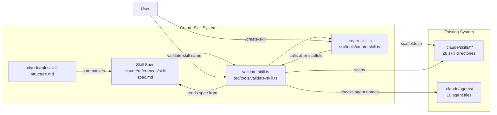
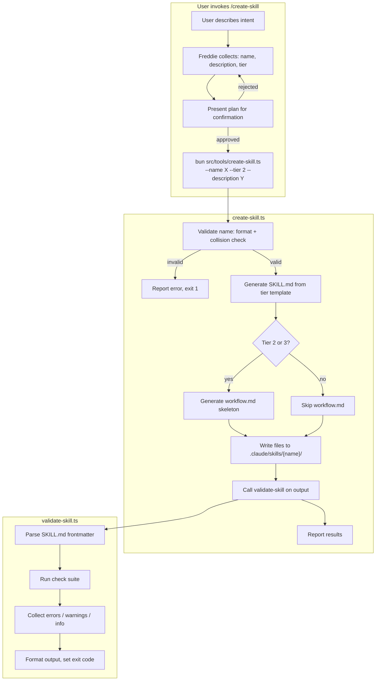
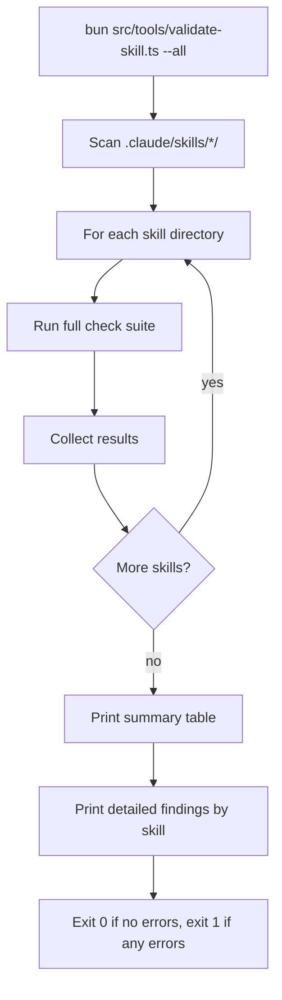
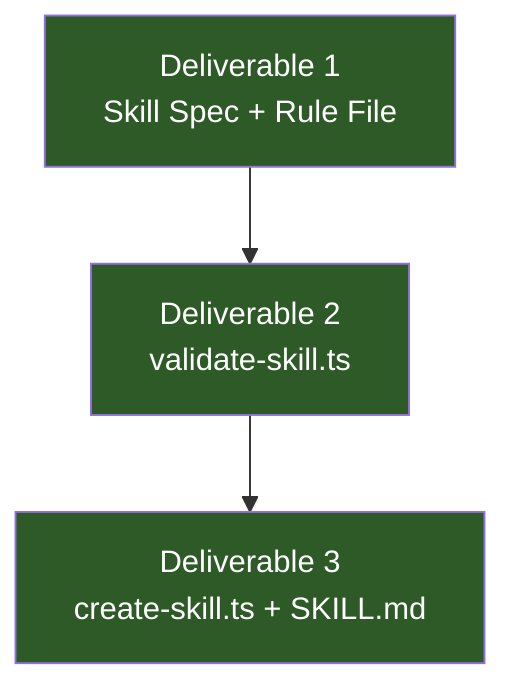

# ARCHITECTURE: Skill Specification, Validation, and Scaffolding

> Owner: McCall | Source: [[PRD]] | Status: draft

## Context & Scope

This system formalizes the implicit structural conventions governing 26 Claude Code skills, makes structural failures detectable, and provides guided scaffolding for new skills. It is fundamentally a **file scaffolder with a validation layer** -- not a plugin system, not a DSL, not a framework.

Three artifacts, in strict dependency order: a reference spec document, a CLI validator, and a CLI scaffolder wrapped in a skill.



## Constraints

Hard ceilings. These cannot change and must be respected before proposing anything.

| # | Constraint | Source | Impact |
|---|-----------|--------|--------|
| C-1 | CLI-first -- all tools are `bun src/tools/...`, no MCP for local use | CLAUDE.md, command-execution rule | Tool must be a single `.ts` file with CLI args |
| C-2 | Skills are pure markdown -- SKILL.md + workflow.md, no TypeScript runtime | Claude Code skill format | Validator checks files, not runtime behavior |
| C-3 | Confirm before generating -- user approves plan before scaffold writes | Generation safety rule | Scaffold must present plan, wait for approval |
| C-4 | No inline `bun -e` in workflow files | Command execution rule | Skill workflow calls the CLI tool, not inline code |
| C-5 | `out/` for drafts, `.claude/skills/{name}/` for final output | Project convention | Scaffold writes directly to skills dir after confirmation |
| C-6 | Single user -- no team registries, no multi-user scaffolding | Project scope | No sharing, publishing, or permission model |
| C-7 | Description <= 250 chars (Claude Code truncation) | Claude Code discovery mechanism | Hard error if exceeded |
| C-8 | Name: lowercase, hyphens only, 1-64 chars | Claude Code frontmatter spec | Hard error if violated |
| C-9 | `.claude/references/` directory does not exist yet | Codebase (verified) | Must be created as part of Deliverable 1 |
| C-10 | `tracknames` skill uses non-standard frontmatter (`allowed_tools` instead of `user-invocable`/`argument-hint`) | Codebase (verified) | Validator must handle variance gracefully -- warn, not error |

### Assumption Register

| # | Assumption | Risk if wrong | Validation |
|---|-----------|--------------|------------|
| A-1 | `user-invocable` and `argument-hint` are required by Claude Code for discovery | Skills become invisible | Verified: `tracknames` omits both and uses `allowed_tools` instead. This is a legacy format. Validator should warn on missing `user-invocable`, not error -- skill may still work. |
| A-2 | `.claude/references/` is the right home for the spec | Discoverability issue | No precedent in this repo. Alternative: `.claude/docs/`. Decision: references is correct because the spec is a reference document consulted during authoring, not a how-to guide. |
| A-3 | The three tiers (simple/medium/complex) are a valid categorization | Tiers are forced categories that don't reflect reality | Validated empirically (see Tier Analysis below). The tiers map cleanly to file structure, not to complexity. |
| A-4 | `agent` field is optional, not required | Inconsistent frontmatter across skills | Verified: `brain` and `tracknames` omit it. 24/26 skills include it. Decision: optional with `none` as recommended default. |

### Tier Analysis (Empirical)

Data from surveying all 26 skills:

| Tier | Criteria | Count | Line Range | Has workflow.md | Examples |
|------|----------|-------|-----------|----------------|---------|
| **Simple** | SKILL.md only, no workflow | 9 | 16-73 | No | morning (16), daily (21), weekly (22), save-raw (26), meeting (32), brain (35), minimax-art (36), minimax-video (40), penny (67) |
| **Medium** | SKILL.md + workflow.md, no assets/scripts | 12 | 53-221 | Yes | tracknames (53), lyrics (79), create-track-variant (102), create-music-card (126), pr-review (135), security-audit (133), code-review (162), create-brief (153), create-prd (172), create-task (157), dev-start (214), dev-end (221) |
| **Complex** | SKILL.md + workflow.md + assets/ or scripts/ | 5 | 37-320 | Yes | gemini (37+wf+assets+scripts), minimax-music (73+wf+assets+scripts), lyrics (79+wf+scripts), create-track (320+wf+assets), architect (220+wf) |

Note: `bye` (73 lines, no workflow) and `dev-end` (221 lines, no workflow) blur the simple/medium boundary. The distinguishing factor is whether the skill needs a separate workflow document for multi-phase execution, not line count. `architect` (220 lines + workflow, no assets) shows that assets/scripts are orthogonal to complexity -- they indicate external tool integration, not structural complexity.

**Revised tier definition:** The tiers should be defined by **file structure**, not complexity labels:
- **Tier 1:** SKILL.md only
- **Tier 2:** SKILL.md + workflow.md
- **Tier 3:** SKILL.md + workflow.md + subdirectories (assets/, scripts/)

This avoids the subjective "simple/medium/complex" labels that the PRD acknowledges are problematic for auto-detection.

## Architectural Decisions

### ADR-1: Spec Location

**Context & Drivers:** The skill spec needs a home. Three options considered. | **Drivers:** Must be discoverable by humans, referenceable by tools, and not duplicate content.

| Option | Pros | Cons |
|--------|------|------|
| **1. `.claude/references/skill-spec.md`** | Clean separation. Reference docs are for consultation. New directory establishes a pattern for future reference docs. | Directory doesn't exist yet (trivial). |
| **2. `.claude/docs/skill-spec.md`** | `docs/` is a more conventional name. | No `docs/` dir exists either. `docs/` implies how-to guides; this is a reference spec. |
| **3. `.claude/rules/skill-structure.md` (full spec in rule)** | Auto-loads when editing skills. Zero extra files. | Rule files should be concise summaries, not 200+ line specs. Clutters rule loading context. |

**Decision Outcome:** Chose **Option 1** (`.claude/references/skill-spec.md`) with a companion rule file (`.claude/rules/skill-structure.md`) that summarizes key points and links to the full spec. This gives auto-loading for the common case (editing skills) without bloating the rule system.

**Consequences:** Must create `.claude/references/` directory. Future reference docs (if any) follow this pattern. **Fallback:** If the references directory causes confusion, the spec can be moved to `.claude/docs/` with a one-line rule file redirect.

---

### ADR-2: `agent` Field -- Required or Optional

**Context & Drivers:** 24/26 skills include `agent` in frontmatter. 2 skills (`brain`, `tracknames`) omit it. `tracknames` also omits `user-invocable` and `argument-hint`, using `allowed_tools` instead. | **Drivers:** Spec must reflect reality, not aspirational uniformity.

| Option | Pros | Cons |
|--------|------|------|
| **1. Required with default `none`** | Uniform frontmatter. Validator can enforce consistency. | Forces retrofitting 2 existing skills. `tracknames` uses a different frontmatter schema entirely. |
| **2. Optional, recommended** | Reflects actual codebase state. No forced migration. | Less uniform. |

**Decision Outcome:** Chose **Option 2** (optional, recommended). The validator issues a **warning** (not error) when `agent` is absent. Rationale: the validator's job is to catch silent failures. A missing `agent` field does not cause silent failure in Claude Code discovery. It's a convention gap, not a structural defect. The `tracknames` skill demonstrates that Claude Code supports alternative frontmatter shapes.

**Consequences:** Spec documents `agent` as "recommended, default `none`". Validator warning guides authors toward consistency without blocking valid skills. **Fallback:** If future Claude Code versions require `agent`, promote from warning to error.

---

### ADR-3: Validation Architecture -- Single File vs. Library

**Context & Drivers:** The validator needs to perform 12+ checks. The scaffold also calls the validator. Both are CLI tools. | **Drivers:** C-1 (CLI-first), opinion #6 (don't over-engineer).

| Option | Pros | Cons |
|--------|------|------|
| **1. Single file `validate-skill.ts`** | Simple. One file, one tool. All checks inline. | Gets large if checks grow. Harder to test individual checks. |
| **2. Library (`src/libs/skill-validator/`) + CLI wrapper** | Separation of concerns. CLI wrapper is thin. Library is testable and importable by `create-skill.ts`. | More files. More structure for what is fundamentally a list of string checks on markdown files. |
| **3. Shared types file + two standalone tools** | Minimal sharing. Each tool owns its logic. | Duplicated validation logic if create-skill also validates. |

**Decision Outcome:** Chose **Option 1** (single file) with one export for programmatic use. The validator is a list of checks that read files and match patterns. It does not warrant a library directory. `create-skill.ts` calls the validator via CLI (`bun src/tools/validate-skill.ts {name}`) rather than importing it -- this keeps both tools independently deployable and testable via CLI.

The validator exports a `validateSkill(skillDir: string)` function for the case where `create-skill.ts` wants to call it in-process. But the primary interface is CLI.

**Consequences:** If check count exceeds ~20 and the file becomes unwieldy, extract to `src/libs/skill-validator/`. That's a refactor, not an architecture change. **Fallback:** The function export means switching to library mode requires no API change for callers.

---

### ADR-4: Tier Selection -- Explicit User Choice

**Context & Drivers:** PRD resolved this: explicit user selection for v1, auto-detection deferred. | **Drivers:** No training data for heuristic. Misclassification wastes user time (wrong scaffold).

| Option | Pros | Cons |
|--------|------|------|
| **1. Explicit selection with guidance** | User is in control. Guidance text explains when each tier applies. | One extra question in the flow. |
| **2. Auto-detect from intent keywords** | Fewer questions. Feels smarter. | Unreliable without training data. "I need a skill that dispatches a sub-agent" might match but "I need a skill for code analysis with review gates" might not. |

**Decision Outcome:** Chose **Option 1**. The `/create-skill` skill presents tier options with one-line descriptions drawn from the spec. The CLI tool accepts `--tier 1|2|3` as an argument.

**Consequences:** Users must understand the tiers. The spec document and the skill's guidance text must be clear enough that the choice is obvious. **Fallback:** If users consistently pick wrong, add a suggestion based on intent keywords in v2.

---

### ADR-5: Scaffold Content Policy -- Skeleton Only

**Context & Drivers:** PRD resolved this: structural skeleton only, no placeholder content. | **Drivers:** A-7 from PRD -- placeholder text risks being left in place.

**Decision Outcome:** Scaffold generates valid frontmatter, structural headings, and empty section bodies. For Tier 2/3, workflow.md gets TOC, phase headings, and a mermaid skeleton with placeholder node names. No instructional placeholder text ("TODO: fill in your workflow here"). The structure itself communicates what goes where.

**Consequences:** Authors must know what each section is for. The spec document serves as the guide. **Fallback:** If authors consistently struggle, add a `--annotated` flag that includes comment-style hints (<!-- This section defines... -->).

---

### ADR-6: Dead Glob Detection Strategy

**Context & Drivers:** Skills can reference file paths/globs (e.g., in rule annotations or workflow references). A dead glob = a path pattern that matches nothing on disk. | **Drivers:** Silent failure -- a dead glob means the skill references files that don't exist.

| Option | Pros | Cons |
|--------|------|------|
| **1. Regex scan for path-like patterns + glob resolution** | Catches most cases. Uses existing `glob` patterns in the codebase. | False positives on prose that looks like paths. |
| **2. Only check explicit file references (workflow.md, assets/, scripts/)** | High precision. Only flags references the validator can verify. | Misses globs embedded in skill instructions. |

**Decision Outcome:** Chose **Option 2** for v1. Check: (a) workflow.md exists if referenced, (b) assets/ and scripts/ dirs exist if referenced, (c) file paths in frontmatter resolve. Do NOT scan prose for path-like strings -- too many false positives. This is a precision-over-recall tradeoff appropriate for v1.

**Consequences:** Some dead references in prose will go undetected. Acceptable for v1 -- the highest-impact dead references (workflow.md, assets/) are caught. **Fallback:** v2 can add opt-in prose scanning with `--strict` flag.

## Solution Strategy

The system is three files plus a spec document. No shared libraries, no abstractions, no framework.

```
.claude/references/skill-spec.md       -- THE spec (human-readable reference)
.claude/rules/skill-structure.md       -- Auto-loading summary (points to spec)
src/tools/validate-skill.ts            -- CLI validator (reads skills, checks spec rules)
src/tools/create-skill.ts              -- CLI scaffolder (generates files, calls validator)
.claude/skills/create-skill/SKILL.md   -- The /create-skill slash command
```

### Data Flow



### Validation Flow (--all mode)



## Building Block View

### validate-skill.ts -- Internal Structure

The validator is a single file with this internal organization:

```
validate-skill.ts
├── CLI argument parsing (name, --all, --json)
├── validateSkill(skillDir: string): ValidationResult
│   ├── parseFrontmatter(content: string): FrontmatterResult
│   ├── checks[] -- array of check functions
│   │   ├── checkRequiredFields()
│   │   ├── checkNameFormat()
│   │   ├── checkNameMatchesDir()
│   │   ├── checkDescriptionLength()
│   │   ├── checkNameCollision()
│   │   ├── checkWorkflowRef()
│   │   ├── checkDeadGlobs()      -- assets/, scripts/ existence
│   │   ├── checkInternalLinks()
│   │   ├── checkMermaidExists()
│   │   ├── checkAgentKnown()
│   │   ├── checkDescriptionEmpty()
│   │   └── checkUserInvocableType()
│   └── aggregate results
├── formatHuman(results: ValidationResult[]): string
├── formatJson(results: ValidationResult[]): string
└── main() -- CLI entry point
```

### Type Definitions

```typescript
interface ValidationResult {
  skill: string;
  errors: ValidationFinding[];
  warnings: ValidationFinding[];
  info: ValidationFinding[];
}

interface ValidationFinding {
  check: string;           // e.g., "frontmatter.description-length"
  message: string;         // human-readable: what's wrong + how to fix
  file: string;            // SKILL.md or workflow.md
  line?: number;           // line number if applicable
}

// Return type for parseFrontmatter
interface FrontmatterResult {
  valid: boolean;
  fields: Record<string, unknown>;
  raw: string;
  errors: string[];        // parse-level errors (malformed YAML)
}
```

### create-skill.ts -- Internal Structure

```
create-skill.ts
├── CLI argument parsing (--name, --description, --tier, --agent, --dry-run)
├── validateName(name: string, skillsDir: string): { valid: boolean, error?: string }
├── generateSkillMd(config: SkillConfig): string
├── generateWorkflowMd(config: SkillConfig): string
├── scaffoldSkill(config: SkillConfig): ScaffoldResult
│   ├── create directory
│   ├── write SKILL.md
│   ├── write workflow.md (tier 2/3)
│   ├── create assets/ (tier 3, if applicable)
│   └── create scripts/ (tier 3, if applicable)
└── main() -- CLI entry point

interface SkillConfig {
  name: string;
  description: string;
  tier: 1 | 2 | 3;
  agent: string;           // default: "none"
  userInvocable: boolean;  // default: true
  argumentHint: string;    // default: ""
}

interface ScaffoldResult {
  created: string[];       // list of files/dirs created
  skipped: string[];       // list of files that already existed
}
```

## Check Inventory

Complete mapping of validation checks to PRD acceptance criteria:

| # | Check ID | Severity | What It Catches | PRD Trace | Implementation Notes |
|---|----------|----------|----------------|-----------|---------------------|
| 1 | `frontmatter.required-fields` | Error | Missing `name` or `description` | US-1 AC-2 | `user-invocable` and `argument-hint` are warnings, not errors (see A-1: tracknames omits both) |
| 2 | `frontmatter.name-format` | Error | Name not lowercase, has non-hyphen special chars, or > 64 chars | US-1 AC-2 | Regex: `/^[a-z][a-z0-9-]{0,63}$/` |
| 3 | `frontmatter.name-matches-dir` | Error | `name` value does not match skill directory name | US-1 AC-2 | Compare `frontmatter.name` to `path.basename(skillDir)` |
| 4 | `frontmatter.description-length` | Error | Description > 250 chars | US-1 AC-2 | Claude Code truncation = silent discovery failure |
| 5 | `frontmatter.description-empty` | Error | Description empty or whitespace | US-1 AC-2 | No description = not discoverable |
| 6 | `frontmatter.user-invocable-type` | Error | `user-invocable` present but not boolean | US-1 AC-2 | Only if field exists -- absence is a warning |
| 7 | `naming.collision` | Error | Another skill directory uses same name | US-1 AC-4 | Scan `.claude/skills/` dirs |
| 8 | `structure.workflow-ref` | Error | SKILL.md text references workflow.md but file missing | US-1 AC-5 | Case-insensitive text search for "workflow.md" |
| 9 | `structure.dead-subdirs` | Warning | SKILL.md references assets/ or scripts/ but dir missing | US-1 AC-6 | Check text refs, verify dir exists |
| 10 | `structure.internal-links` | Warning | `[PX-NNN]` IDs in SKILL.md without matching headers in workflow.md | US-1 AC-7 | Regex extract IDs, match against `## ... PX-NNN` |
| 11 | `structure.mermaid-exists` | Warning | Skill has workflow.md but no mermaid block in SKILL.md | US-1 AC-8 | Search for ` ```mermaid ` fence |
| 12 | `frontmatter.agent-known` | Warning | `agent` not `none` and not in `.claude/agents/` | US-5 AC-1/2 | List `.claude/agents/*.md`, strip extension |
| 13 | `frontmatter.user-invocable-missing` | Warning | `user-invocable` field absent | -- | Helps catch legacy format skills |
| 14 | `frontmatter.argument-hint-missing` | Info | `argument-hint` field absent | -- | Informational: skill works but loses discoverability hint |

**Note on check #1 vs PRD:** The PRD lists `user-invocable` and `argument-hint` as required (US-1 AC-2). The empirical data shows `tracknames` works without them. I am overriding the PRD here: `name` and `description` are the true hard requirements for Claude Code discovery. `user-invocable` and `argument-hint` are strong recommendations. The validator downgrades their absence from error to warning. This is a case where the postmortem reflex fires: "are these limits validated at deploy time or crash time?" -- the answer is that Claude Code does not crash on missing `user-invocable`; it degrades gracefully.

## Crosscutting Concerns

| Concern | Approach |
|---------|----------|
| Error handling | Both tools exit 0 on success, exit 1 on error. Validation errors are reported, not thrown. Filesystem errors (missing dirs, permission denied) throw with clear messages. |
| Frontmatter parsing | Use `gray-matter` (already in Bun ecosystem) or manual YAML frontmatter extraction between `---` delimiters. No external YAML parser needed -- frontmatter is simple key-value. |
| File I/O | `Bun.file()` for reading, `Bun.write()` for writing. `fs.mkdirSync` for directory creation. All paths relative to project root. |
| Idempotency | `create-skill.ts` refuses to overwrite existing skill directories unless `--force` is provided. Reports "skill already exists" and exits 1. |
| Testing | CLI testing via `bun src/tools/validate-skill.ts --all` on the 26 existing skills. No unit test framework needed for v1 -- the `--all` run is the integration test. |
| Output format | Default: human-readable with ANSI colors (if terminal). `--json` flag for programmatic consumption. |

## Failure Modes

| Failure | Detection | Impact | Recovery |
|---------|-----------|--------|----------|
| SKILL.md has malformed YAML frontmatter | Frontmatter parser returns error | Cannot extract fields -- all field checks skipped | Report "malformed frontmatter" as error with line number. Show the raw frontmatter block for debugging. |
| `.claude/skills/` directory doesn't exist | `fs.existsSync` check on startup | No skills to validate | Report "skills directory not found" and exit 1. |
| `.claude/references/skill-spec.md` doesn't exist | N/A -- validator encodes rules internally | None at runtime | The spec is a human-readable reference. The validator does not read the spec at runtime -- rules are hardcoded. Spec and validator must be updated together. |
| Scaffold creates files but validation fails | Validator runs post-scaffold, reports errors | Files exist but are invalid | Report the errors. Files remain on disk for the user to fix or delete. Do NOT auto-delete -- the user confirmed the scaffold. |
| Name collision detected during scaffold | Pre-scaffold name validation | Scaffold aborted | Report collision, suggest alternative name. Exit 1 before writing any files. |
| Disk full / permission denied during scaffold | Filesystem error propagates | Partial file creation | Catch, report, and list which files were successfully created vs. failed. No rollback -- partial state is better than silent cleanup. |

## Deliverable Breakdown for Task Docs

### Deliverable 1: Skill Spec + Rule File

**Files to create:**
- `.claude/references/skill-spec.md` -- full spec document
- `.claude/rules/skill-structure.md` -- auto-loading summary with glob `.claude/skills/**`

**Content scope for spec:**
1. Frontmatter fields table (name, type, required/optional, constraints, default)
2. Tier definitions (1/2/3) with file structure, criteria, and examples from existing skills
3. workflow.md conventions: TOC format, node ID pattern (`[PX-NNN]`), phase naming
4. Mermaid diagram expectations (required for tier 2/3 in SKILL.md)
5. Subdirectory conventions (assets/, scripts/)
6. Description length limit (250 chars) with Claude Code truncation rationale
7. Internal link conventions
8. Anti-patterns section (common mistakes to avoid)

**Content scope for rule file:**
1. Frontmatter quick-reference (required fields, constraints)
2. Tier selection guidance (one-line per tier)
3. Common mistakes (description length, dead workflow refs)
4. Link to full spec

**Dependencies:** None
**Estimated file overlap with other deliverables:** None -- these are standalone reference files

### Deliverable 2: validate-skill CLI

**Files to create:**
- `src/tools/validate-skill.ts`

**Interface:**
```
bun src/tools/validate-skill.ts {skill-name}     # validate one skill
bun src/tools/validate-skill.ts --all             # validate all skills
bun src/tools/validate-skill.ts {name} --json     # JSON output
```

**Dependencies:** Deliverable 1 (spec defines what to validate -- but rules are encoded in the tool, not read from spec at runtime)
**Estimated file overlap with Deliverable 3:** `create-skill.ts` calls `validate-skill.ts` via CLI subprocess

### Deliverable 3: create-skill CLI + Skill

**Files to create:**
- `src/tools/create-skill.ts`
- `.claude/skills/create-skill/SKILL.md`

**Interface:**
```
bun src/tools/create-skill.ts --name my-skill --description "..." --tier 2
bun src/tools/create-skill.ts --name my-skill --description "..." --tier 2 --dry-run
```

**Dependencies:** Deliverable 2 (scaffold calls validator post-creation)
**Estimated file overlap with Deliverable 2:** None -- calls validator via CLI, does not import

**Skill structure:** The `/create-skill` SKILL.md follows the meta-skill pattern established by `create-brief`, `create-prd`, `create-task`:
- Freddie orchestrates the interactive flow (intent collection, tier selection, confirmation)
- The CLI tool handles file generation
- No sub-agent dispatch needed -- this is a Tier 2 skill (SKILL.md + workflow.md, no assets)

### Task Dependency Graph



All three deliverables are **sequential** -- each depends on the previous. No parallelization possible. This is 3 task docs for Wick, executed in order.

## Risks & Technical Debt

| Risk | Likelihood | Impact | Mitigation | Contingency |
|------|-----------|--------|------------|-------------|
| Validator checks don't match reality of 26 existing skills | Medium | Medium | Run `--all` against existing skills as acceptance test for Deliverable 2. Adjust checks based on empirical results. | Demote unexpected failures from error to warning. Update spec to accommodate legitimate patterns. |
| Spec drifts from validator over time | Low | Medium | Spec and validator are coupled by design. The rule file links to the spec. Any validator change should update the spec. | Validator is the source of truth at runtime. Spec is the human-readable explanation. If they diverge, validator wins. |
| `tracknames` frontmatter format creates a "legacy exception" path | Low | Low | Warn on non-standard frontmatter. Don't error. Document in spec as "legacy format." | If more skills adopt non-standard frontmatter, revisit the spec to accommodate multiple valid formats. |
| Scaffold generates files that fail validation | Very Low | Medium | Create-skill uses the same rules as validate-skill. If the scaffold generates invalid output, it's a bug in the scaffold. | Validator runs post-scaffold and catches any issues. User sees the errors before they become silent failures. |

### Technical Debt (Accepted)

- **No unit tests for v1.** The `--all` flag running against 26 skills is the integration test. Unit tests are deferred until check count exceeds ~15 or a regression is found.
- **No auto-fix mode.** Validator reports only. Auto-remediation is v2.
- **No staleness detection.** No `last_reviewed` tracking. v2 concern per PRD.
- **Hardcoded rules in validator.** Rules are not read from the spec file at runtime. This is intentional -- the spec is for humans, the validator is for machines. But it means spec changes require validator code changes. Acceptable coupling for a single-user system.

## Unresolved Questions

* **Question:** Should the validator check for the `allowed_tools` field (used by `tracknames`) and treat it as an alternative frontmatter format, or simply ignore it?
* **Blocker Level:** Low
* **Resolution Plan:** Ignore for v1. The validator checks for the standard frontmatter fields. `allowed_tools` is legacy and the spec should note it as deprecated/non-standard. If the user wants to keep using it, that's their choice -- the validator won't error on extra fields.

* **Question:** The PRD specifies checking that `[PX-NNN]` node IDs in SKILL.md have matching headers in workflow.md (check #10). In practice, the ID format varies -- some skills use `S1-001`, others use `P1-001`, others use `P1_001`. Should the check normalize these?
* **Blocker Level:** Low
* **Resolution Plan:** Use a flexible regex: `/\[([A-Z][0-9][-_][0-9]{3})\]/g` to extract IDs. Match against workflow.md headers with the same flexibility. Don't enforce a single format -- detect what's used and check consistency within a skill.

* **Question:** Should the deprecated `save-raw` skill be excluded from `--all` validation, or validated and shown as having warnings?
* **Blocker Level:** Low
* **Resolution Plan:** Validate all skills equally. If `save-raw` has a `[DEPRECATED]` prefix in its description and that pushes it over 250 chars, that's a real finding. The validator does not have a concept of "deprecated skills."
