# Shirozen ARCHITECT -- Cognitive Brain Engine

## 1. System Architecture Overview

### 1.1 Component Diagram

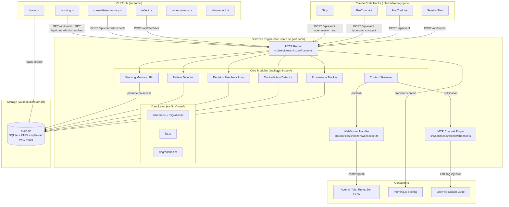

### 1.2 Runtime Topology

| Component | Runs As | Location | Lifecycle |
|-----------|---------|----------|-----------|
| Shirozen Engine | Persistent Bun.serve() process managed by native daemon (PID file + detached spawn) | `src/services/shirozen/index.ts` | Starts manually via `bun run shirozen:start`. Runs continuously. Manages llama-server as child process. |
| llama-server | Sidecar C++ process (Qwen3 4B Q4_K_M) on port 3457 | `vendor/llama-server/llama-server` | Spawned by Shirozen engine via Bun.spawn(). Killed on engine shutdown. ~3GB RAM. |
| MCP Channel Plugin | Subprocess spawned by Claude Code per session | `src/services/shirozen/channel.ts` | Lives for duration of Claude Code session. Connects to Shirozen engine via localhost HTTP. |
| Hook scripts | Short-lived Bun processes | `.claude/hooks/shirozen-*.ts` | Spawned by Claude Code on lifecycle events. Fire-and-forget HTTP to engine. Exit immediately. |
| CLI tools | On-demand Bun processes | `src/tools/mine-patterns.ts`, `shirozen-ctl.ts` | User or cron invokes. Calls engine HTTP API or brain.db directly. |
| brain.db | SQLite file on disk | `vault/studio/brain.db` | Always present. WAL mode enables concurrent read (CLI + engine). Single writer at a time. |

### 1.3 Process Model

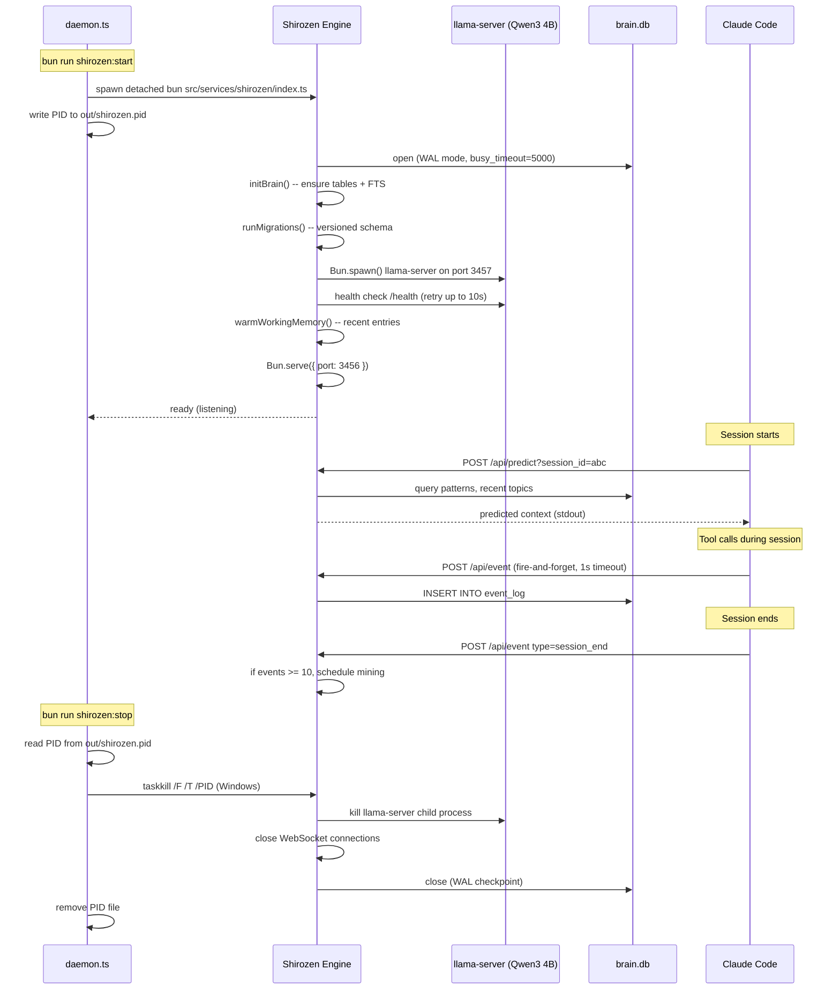

### 1.4 Startup Sequence (Engine)

The engine initialization is strictly ordered. Each step must complete before the next begins.

```typescript
// src/services/shirozen/index.ts -- startup sequence
async function main(): Promise<void> {
  // 1. Open database (WAL mode set in sqlite.ts)
  initBrain();

  // 2. Run versioned migrations
  await runMigrations();

  // 3. Spawn llama-server sidecar (Qwen3 4B)
  const llm = await spawnLlamaServer({
    binary: "vendor/llama-server/llama-server",
    model: "vendor/models/qwen3-4b-q4_k_m.gguf",
    port: config.llmPort,   // default 3457
    ctxSize: 4096,
    nGpuLayers: 99,          // offload all layers to GPU
    healthTimeout: 10_000,   // wait up to 10s for healthy
  });

  // 4. Warm working memory from recent brain.db entries
  await warmWorkingMemory();

  // 5. Start HTTP + WebSocket server
  const server = Bun.serve({
    port: config.port,    // default 3456
    fetch: router,        // HTTP routes
    websocket: wsHandler, // WebSocket handlers
  });

  // 6. Register shutdown handlers
  process.on("SIGTERM", () => gracefulShutdown(server, llm));
  process.on("SIGINT", () => gracefulShutdown(server, llm));

  console.log(`Shirozen listening on port ${config.port}`);
  console.log(`llama-server (Qwen3 4B) on port ${config.llmPort}`);
}
```

### 1.5 Graceful Shutdown

```typescript
async function gracefulShutdown(server: Server): Promise<void> {
  // 1. Stop accepting new connections
  server.stop();

  // 2. Close all WebSocket connections with 1000 (normal closure)
  for (const ws of activeConnections) {
    ws.close(1000, "Shirozen shutting down");
  }

  // 3. Flush working memory stats (hit rates) to brain.db
  await flushWorkingMemoryStats();

  // 4. Close database (triggers WAL checkpoint)
  closeDb();

  process.exit(0);
}
```

---

## 2. Module Architecture

### 2.1 Provenance Tracker

**Responsibility:** Ensure every knowledge entry traces back to its source raw sessions. Maintain bi-temporal columns for "what was true when" and "what we knew when" queries. Record an audit trail of all mutations via triggers.

**Boundaries:** Provenance Tracker does not decide whether knowledge is valid or contradictory. It records lineage and history. Contradiction Detector handles conflict detection. Consolidation tool handles merging.

**Internal Architecture:**

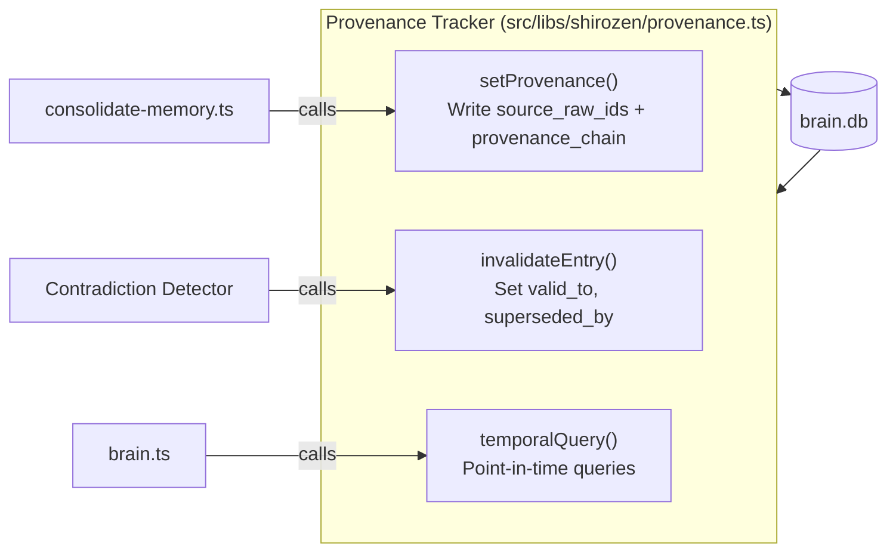

**Dependencies:**
- `src/libs/brain/schema.ts` -- bi-temporal columns on memories table
- `src/libs/brain/migration.ts` -- schema migration for new columns
- SQLite triggers defined in `src/libs/brain/fts.ts` -- `memory_history` auto-population

**Interface Contract:**

```typescript
// src/libs/shirozen/provenance.ts

/**
 * Set provenance metadata on a memory entry.
 * Called by consolidate-memory.ts during knowledge merge.
 *
 * Traces: FR-101, FR-102, FR-107
 */
export function setProvenance(
  memoryId: number,
  sourceRawIds: number[],          // raw_files.ts values
  provenanceChain: ProvenanceStage[],
): void;

type ProvenanceStage = "raw" | "inbox" | "consolidation" | "knowledge";

/**
 * Invalidate a memory entry without deleting it.
 * Sets valid_to to now, optionally links to superseding entry.
 * Triggers memory_history audit via SQLite trigger.
 *
 * Traces: FR-105, FR-207
 */
export function invalidateEntry(
  memoryId: number,
  supersededBy?: number,
): void;

/**
 * Query memories valid at a specific point in time.
 * "What was true on date X?"
 *
 * Traces: FR-106
 */
export function queryValidAt(
  date: string,               // ISO 8601
  agent?: string,
  limit?: number,
): MemoryEntry[];

/**
 * Query memories by recorded time.
 * "What did we know on date X?"
 *
 * Traces: FR-106
 */
export function queryKnownAt(
  date: string,               // ISO 8601
  agent?: string,
  limit?: number,
): MemoryEntry[];

/**
 * Get full provenance chain for a memory entry.
 * Returns the chain of transformations from raw -> current.
 */
export function getProvenance(memoryId: number): {
  entry: MemoryEntry;
  sourceRaws: RawFileEntry[];
  history: MemoryHistoryEntry[];
};
```

**Error Handling:**
- If `memoryId` does not exist, throw `ProvenanceError("Memory entry not found")`.
- If `sourceRawIds` references non-existent raw files, log a warning but proceed (raw files may have been captured before indexing).
- SQLite trigger failures bubble as database errors -- the calling code must handle.

**Test Strategy:**
- Unit: `setProvenance` writes correct columns. `invalidateEntry` sets `valid_to` and triggers `memory_history` insert. Temporal queries return correct results for past dates.
- Integration: Full consolidation flow writes provenance, then temporal query retrieves correct entries.

---

### 2.2 Contradiction Detector

**Responsibility:** Detect conflicting knowledge entries before they are silently merged. Uses embedding pre-filter followed by local Qwen3 4B chain-of-thought check via llama-server (`/think` mode). Zero external API cost. Logs contradictions to dedicated table. Surfaces unresolved contradictions for user resolution.

**Boundaries:** Does not resolve contradictions automatically (except by explicit user or decay). Does not modify knowledge entries -- only flags and records. Resolution triggers are handled by Provenance Tracker (`invalidateEntry`).

**Internal Architecture:**

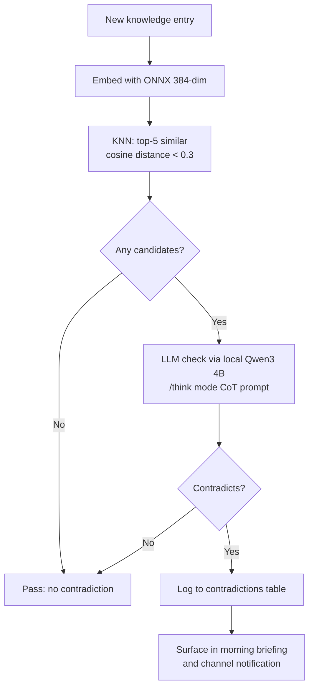

**Dependencies:**
- `src/libs/embeddings.ts` -- ONNX embedding for pre-filter (FR-209, NFR-13)
- `src/libs/shirozen/llm.ts` -- local Qwen3 4B via llama-server, `/think` mode for CoT (FR-202)
- `src/libs/brain/queries.ts` -- vector KNN search on `vec_memories`
- `src/libs/shirozen/provenance.ts` -- `invalidateEntry` on resolution

**Interface Contract:**

```typescript
// src/libs/shirozen/contradiction.ts

/**
 * Check a new entry against existing knowledge for contradictions.
 * Pipeline: embed -> KNN top-5 (distance < 0.3) -> local Qwen3 4B CoT check (/think mode).
 *
 * Returns detected contradictions (may be empty).
 * Does NOT modify any entries -- only reads + logs to contradictions table.
 *
 * Traces: FR-201, FR-202, FR-203, FR-204, FR-209
 * Performance: NFR-04 (< 3s including LLM call)
 */
export async function checkContradictions(
  entryId: number,
  entryStore: "memories" | "decisions",
  content: string,
): Promise<DetectedContradiction[]>;

interface DetectedContradiction {
  existingId: number;
  type: ContradictionType;         // "value" | "temporal" | "logical"
  confidence: number;              // 0.0-1.0
  description: string;             // LLM-generated explanation
  resolutionHint: string;          // LLM suggestion
}

/**
 * Resolve a contradiction. Updates contradictions table and
 * triggers invalidation of the losing entry via provenance.
 *
 * Traces: FR-206, FR-207
 */
export async function resolveContradiction(
  contradictionId: number,
  winnerId: number,
  reason: string,
  resolvedBy: "user" | "auto" | "decay",
): Promise<void>;

/**
 * Get all unresolved contradictions.
 * Used by morning.ts and GET /api/contradict/unresolved.
 *
 * Traces: FR-205
 */
export function getUnresolved(): UnresolvedContradiction[];

interface UnresolvedContradiction {
  id: number;
  entryA: { id: number; content: string; createdAt: string };
  entryB: { id: number; content: string; createdAt: string };
  type: ContradictionType;
  confidence: number;
  detectedAt: string;
  resolutionHint: string;
}

/**
 * Batch scan: compare knowledge entries within same topic clusters.
 * Used for periodic background scan (weekly or on-demand).
 *
 * Traces: FR-208
 */
export async function batchScan(options?: {
  agent?: string;
  topK?: number;
  distanceThreshold?: number;
}): Promise<DetectedContradiction[]>;
```

**Contradiction Detection Prompt:**

```
You are a knowledge base consistency checker for a music production AI system.
Compare these two knowledge entries and determine if they contradict each other.

Entry A (existing, recorded {recorded_at_a}):
{content_a}

Entry B (new, recorded {recorded_at_b}):
{content_b}

Think step by step:
1. Identify the key claims in each entry.
2. Check if any claims directly conflict.
3. Check if any claims are implicitly inconsistent.
4. Consider if both could be true in different contexts or time periods.

Respond in JSON only:
{
  "contradicts": true | false,
  "type": "value" | "temporal" | "logical" | "none",
  "explanation": "Brief explanation of the contradiction or why they are consistent",
  "confidence": 0.0 to 1.0,
  "resolution_hint": "Which entry is likely more accurate and why (or 'both valid' if no contradiction)"
}
```

**Error Handling:**
- If ONNX embedding fails, skip pre-filter and return empty (fail open -- do not block consolidation).
- If llama-server is down or unresponsive, log warning and return empty. Consolidation proceeds without contradiction check. The entry is flagged for re-check on next scan.
- If `contradictions` table insert fails, log error but do not throw -- the knowledge entry still merges.

**Test Strategy:**
- Unit: Embedding pre-filter returns correct candidates. LLM prompt produces parseable JSON. Resolution triggers `invalidateEntry`.
- Integration: Full consolidation with a known contradictory pair flags correctly. Resolution invalidates the correct entry.

---

### 2.3 Decision Feedback Loop

**Responsibility:** Close the feedback loop between decisions and outcomes. When `reflect.ts` reports a workflow outcome, update the original decision's FSRS scores. Track success/failure patterns for search ranking.

**Boundaries:** Does not make decisions. Does not change decision content. Only updates FSRS scores and records feedback entries.

**Internal Architecture:**

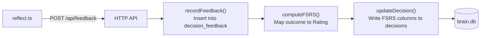

**Dependencies:**
- `ts-fsrs` package -- FSRS algorithm implementation
- `src/libs/brain/schema.ts` -- `decisions` table FSRS columns, `decision_feedback` table
- `src/libs/brain/degradation.ts` -- integrate FSRS retrievability into scoring

**Interface Contract:**

```typescript
// src/libs/shirozen/fsrs.ts

import { FSRS, createEmptyCard, Rating, type Card } from "ts-fsrs";

/**
 * Initialize FSRS state for a new entry (memory or decision).
 */
export function initFSRSState(): FSRSState;

/**
 * Convert workflow outcome to FSRS Rating.
 * success -> Rating.Good, partial -> Rating.Hard,
 * failure -> Rating.Again, abandoned -> Rating.Again
 *
 * Traces: FR-304
 */
export function outcomeToRating(outcome: Outcome): Rating;

/**
 * Apply a feedback rating to an existing FSRS state.
 * Returns updated state with new difficulty, stability, retrievability.
 *
 * Traces: FR-305
 */
export function applyFeedback(state: FSRSState, outcome: Outcome): FSRSState;

/**
 * Compute current retrievability for a given FSRS state.
 * R = e^{-t/S} where t = days since last review, S = stability.
 * Used by degradation.ts for search ranking.
 *
 * Traces: FR-306
 */
export function computeRetrievability(state: FSRSState): number;

/**
 * Convert between FSRS Card object and our flat FSRSState.
 */
export function cardToState(card: Card): FSRSState;
export function stateToCard(state: FSRSState): Card;

// -- Feedback recording --

// src/libs/shirozen/feedback.ts

/**
 * Record a decision outcome and update FSRS scores.
 *
 * Traces: FR-301, FR-302, FR-303, FR-304, FR-305
 */
export async function recordFeedback(input: {
  decisionId: number;
  outcome: Outcome;
  outcomeDetails?: string;
  sessionRawId?: string;
}): Promise<{
  id: number;
  confidenceDelta: number;
  newStability: number;
  newDifficulty: number;
}>;

/**
 * Check if a decision has 2+ failure feedbacks.
 * Used to flag unreliable decisions in search results.
 *
 * Traces: FR-307
 */
export function isUnreliable(decisionId: number): boolean;

type Outcome = "success" | "failure" | "partial" | "abandoned";

interface FSRSState {
  fsrs_difficulty: number;
  fsrs_stability: number;
  fsrs_retrievability: number;
  fsrs_last_review: string | null;
  fsrs_reps: number;
  fsrs_lapses: number;
}
```

**Error Handling:**
- If `decisionId` does not exist in the `decisions` table, return error `{ error: "Decision not found" }`.
- If `ts-fsrs` throws (invalid card state), reinitialize FSRS state to defaults and retry once.
- If database write fails, throw -- feedback recording is P0 and must not silently fail.

**Test Strategy:**
- Unit: `outcomeToRating` maps correctly. `applyFeedback` produces valid FSRS state. `computeRetrievability` decays over time.
- Integration: Full cycle: create decision -> feedback "success" -> FSRS updates -> search ranking reflects higher score. Two failures -> `isUnreliable` returns true.

---

### 2.4 Pattern Detector

**Responsibility:** Mine recurring workflow sequences from `event_log` using VMSP algorithm. Store patterns in `pattern_log` with support counts and FSRS decay. Match session prefixes against known patterns for prediction.

**Boundaries:** Does not push context to consumers. That is Context Streamer's job. Does not write to event_log -- Hook scripts handle capture. Pattern Detector reads event_log and writes to pattern_log.

**Internal Architecture:**

```mermaid
flowchart TD
    subgraph Capture["Event Capture (hooks)"]
        hook[PostToolUse hook] -->|POST /api/event| API[HTTP API]
        API -->|INSERT| eventLog[(event_log)]
    end

    subgraph Mining["Pattern Mining (scheduled/on-demand)"]
        eventLog -->|extract sessions| prep[Prepare VMSP database]
        prep -->|string[][][] format| vmsp["AlgoVMSP.run()<br/>@smartesting/vmsp"]
        vmsp -->|maximal patterns| store[Upsert pattern_log]
        store -->|natural language desc| embed[ONNX embed -> vec_patterns]
    end

    subgraph Prediction["Session-Start Prediction"]
        prefix[Current session events] --> match[Prefix match<br/>against pattern_log]
        match --> rank[Rank by support * FSRS retrievability]
        rank --> predict[Return top-k predictions]
    end
```

**Dependencies:**
- `@smartesting/vmsp` package -- VMSP sequential pattern mining
- `src/libs/embeddings.ts` -- ONNX embedding for pattern descriptions (FR-405)
- `src/libs/shirozen/fsrs.ts` -- FSRS decay on patterns (FR-408)

**Interface Contract:**

```typescript
// src/libs/shirozen/mining.ts

import { AlgoVMSP } from "@smartesting/vmsp";

/**
 * VMSP configuration. Matches PRD Appendix A.
 *
 * Traces: FR-410
 */
export const VMSP_CONFIG = {
  patternType: "maximal" as const,
  maxGap: 3,
  minimumPatternLength: 2,
  maximumPatternLength: 10,
  minSupport: 0.3,
} as const;

/**
 * Extract session event sequences from event_log.
 * Groups by session_id, orders by sequence_num.
 * Maps events to itemsets: [tool_name ?? event_type].
 */
export function extractSessionSequences(
  since?: string,             // ISO 8601 -- mine sessions since this date
): string[][][];              // VMSP database format

/**
 * Run VMSP mining on extracted sessions.
 * Returns new and updated patterns.
 *
 * Traces: FR-403, FR-404, FR-409
 * Performance: NFR-05 (< 10s for 100 sessions)
 */
export async function minePatterns(options?: {
  minSupport?: number;        // default 0.3
  maxGap?: number;            // default 3
  since?: string;             // ISO date
}): Promise<{
  patternsFound: number;
  newPatterns: number;
  updatedPatterns: number;
}>;

// src/libs/shirozen/pattern-matcher.ts

/**
 * Match a session's current event prefix against known patterns.
 * Uses prefix matching: find patterns whose first N events match
 * the session's current event sequence.
 *
 * Returns top-k matching patterns ranked by:
 *   score = support_count * fsrs_retrievability * (matched_length / pattern_length)
 *
 * Traces: FR-406
 */
export function matchPrefix(
  sessionEvents: string[],     // events so far in current session
  topK?: number,               // default 3
): PatternMatch[];

interface PatternMatch {
  patternId: number;
  patternSequence: string[];
  matchedLength: number;       // how many prefix events matched
  totalLength: number;         // total pattern length
  confidence: number;          // combined score
  predictedNext: string[];     // remaining events after match point
}

/**
 * Record prediction hit or miss for accuracy tracking.
 *
 * Traces: FR-407
 */
export function recordPredictionOutcome(
  predictionId: number,
  wasCorrect: boolean,
): void;
```

**VMSP Database Preparation:**

```typescript
// Convert event_log rows to VMSP input format
function prepareVMSPDatabase(sessions: Map<string, EventLogEntry[]>): string[][][] {
  return Array.from(sessions.values()).map(events =>
    events
      .sort((a, b) => a.sequence_num - b.sequence_num)
      .map(e => [e.tool_name ?? e.event_type])
  );
}
```

**Prefix Matching Algorithm:**

```typescript
function matchPrefix(sessionEvents: string[], topK = 3): PatternMatch[] {
  // 1. Get all active patterns from pattern_log
  const patterns = db.query(`
    SELECT * FROM pattern_log
    WHERE fsrs_retrievability > 0.3
    ORDER BY support_count DESC
  `).all();

  // 2. For each pattern, check if session prefix matches
  const matches: PatternMatch[] = [];
  for (const pattern of patterns) {
    const seq = JSON.parse(pattern.pattern_sequence) as string[];
    let matched = 0;

    for (let i = 0; i < Math.min(sessionEvents.length, seq.length); i++) {
      if (sessionEvents[i] === seq[i]) {
        matched++;
      } else {
        break; // strict prefix match
      }
    }

    if (matched >= 1) {
      const score = pattern.support_count
        * pattern.fsrs_retrievability
        * (matched / seq.length);

      matches.push({
        patternId: pattern.id,
        patternSequence: seq,
        matchedLength: matched,
        totalLength: seq.length,
        confidence: score,
        predictedNext: seq.slice(matched),
      });
    }
  }

  // 3. Sort by confidence, return top-k
  return matches
    .sort((a, b) => b.confidence - a.confidence)
    .slice(0, topK);
}
```

**Error Handling:**
- If VMSP mining throws (malformed input), log error and return `{ patternsFound: 0, newPatterns: 0, updatedPatterns: 0 }`.
- If ONNX embedding fails during pattern description embedding, store pattern without vector. Mark `embeddedAt = null` for retry.
- If event_log has < 3 sessions, skip mining (insufficient data).

**Test Strategy:**
- Unit: `extractSessionSequences` groups correctly by session. `matchPrefix` returns correct matches for known patterns. VMSP integration produces patterns from synthetic data.
- Integration: Record 5 sessions with overlapping tool sequences. Mine patterns. Verify patterns found. Start new session with matching prefix. Verify prediction.

---

### 2.5 Context Streamer

**Responsibility:** Deliver predicted context and real-time notifications to consumers via three transports: HTTP API (request/response), WebSocket (pub/sub push), and MCP Channel Plugin (XML tag injection into Claude Code sessions).

**Boundaries:** Does not generate predictions -- consumes predictions from Pattern Detector and Working Memory. Does not store data -- reads from brain.db and working memory cache. Is the delivery mechanism, not the intelligence.

**Internal Architecture:**

```mermaid
flowchart LR
    subgraph Sources["Context Sources"]
        WM[Working Memory]
        PM[Pattern Matcher]
        DB[(brain.db)]
    end

    subgraph Streamer["Context Streamer"]
        assemble[assembleContext()<br/>Gather from all sources]
        rank[rankContext()<br/>Score by relevance + FSRS]
        format[formatForTransport()]
    end

    subgraph Transports["Delivery Transports"]
        HTTP[HTTP API<br/>GET /api/predict]
        WS[WebSocket<br/>pub/sub context-updates]
        CH[MCP Channel<br/>XML tag injection]
    end

    WM --> assemble
    PM --> assemble
    DB --> assemble
    assemble --> rank
    rank --> format
    format --> HTTP
    format --> WS
    format --> CH
```

**Dependencies:**
- `src/libs/shirozen/pattern-matcher.ts` -- predictions for context assembly
- `src/services/shirozen/working-memory.ts` -- warm cache entries
- `@modelcontextprotocol/sdk` -- MCP server for channel plugin

**Interface Contract:**

```typescript
// src/services/shirozen/context-streamer.ts

/**
 * Assemble predicted context for a session.
 * Gathers from: working memory, pattern matches, recent brain.db activity.
 *
 * Traces: FR-506
 */
export async function assembleContext(
  sessionId: string,
  sessionEvents?: string[],
): Promise<PredictionResponse>;

/**
 * Push context to all WebSocket subscribers.
 * Publishes to "context-updates" topic.
 *
 * Traces: FR-503
 */
export function pushToWebSocket(
  server: Server,
  notification: ContextPush,
): void;

/**
 * Push context via MCP channel notification.
 * Injects as <channel source="shirozen"> XML tag.
 *
 * Traces: FR-504, FR-505
 */
export function pushToChannel(
  type: ChannelNotificationType,
  content: string,
  meta?: Record<string, string>,
): void;

interface ContextPush {
  type: "context_push" | "contradiction_alert" | "pattern_match" | "feedback_applied";
  payload: Record<string, unknown>;
}

type ChannelNotificationType =
  | "predicted_context"
  | "contradiction_alert"
  | "pattern_match"
  | "decision_feedback";
```

**Error Handling:**
- If WebSocket connection is dead, silently remove from subscribers.
- If MCP channel notification fails, log warning. Context push is best-effort.
- If pattern matcher returns empty, still return recent working memory entries.

**Test Strategy:**
- Unit: `assembleContext` aggregates from all sources. `pushToWebSocket` publishes correctly. Channel notification formats XML correctly.
- Integration: Connect WebSocket client. Trigger context push. Verify message received.

---

### 2.6 Working Memory

**Responsibility:** In-memory LRU cache that sits between brain.db (cold) and the context window (hot). Holds recently-relevant entries. Decays faster than brain.db. Persists across sessions within a work streak.

**Boundaries:** Lives entirely in the Shirozen engine process. No persistence to disk -- if the engine restarts, working memory is rebuilt from brain.db on startup. Does not make decisions about what to serve -- Context Streamer asks for entries and Working Memory returns what it has.

**Internal Architecture:**

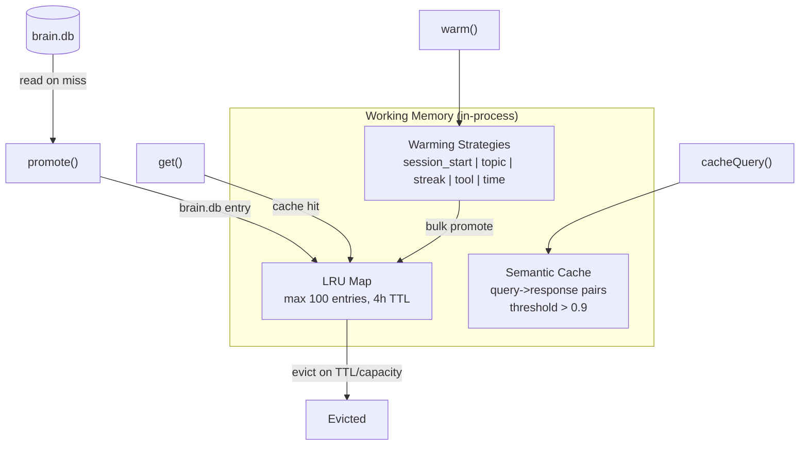

**Dependencies:**
- `src/libs/brain/queries.ts` -- read entries from brain.db on cache miss
- `src/libs/shirozen/fsrs.ts` -- check retrievability before promotion (FR-606)
- `src/libs/embeddings.ts` -- semantic cache similarity check (FR-604)

**Interface Contract:**

```typescript
// src/services/shirozen/working-memory.ts

/**
 * LRU cache configuration.
 *
 * Traces: FR-601
 */
export interface WorkingMemoryConfig {
  maxEntries: number;              // default 100
  ttlMs: number;                   // default 14_400_000 (4 hours)
  minRetrievability: number;       // default 0.5
  semanticCacheThreshold: number;  // default 0.9
}

/**
 * Initialize working memory with configuration.
 */
export function createWorkingMemory(
  config?: Partial<WorkingMemoryConfig>,
): WorkingMemoryInstance;

interface WorkingMemoryInstance {
  /**
   * Get an entry from working memory. Returns null on miss.
   * Updates access time and count on hit.
   *
   * Traces: FR-601
   */
  get(key: string): WorkingMemoryEntry | null;

  /**
   * Promote a brain.db entry into working memory.
   * Rejects entries with FSRS retrievability < threshold.
   *
   * Traces: FR-602, FR-606
   */
  promote(entry: {
    sourceTable: string;
    sourceId: number;
    content: string;
    fsrsRetrievability: number;
  }): boolean;

  /**
   * Warm cache using a specific strategy.
   *
   * Traces: FR-603
   */
  warm(strategy: WarmingStrategy, context?: WarmingContext): Promise<void>;

  /**
   * Check semantic cache for a similar query.
   * Returns cached response if embedding similarity > threshold.
   *
   * Traces: FR-604
   */
  getCachedQuery(queryEmbedding: Float32Array): CachedQueryResult | null;

  /**
   * Cache a query-response pair.
   */
  cacheQuery(queryEmbedding: Float32Array, response: unknown): void;

  /**
   * Get current cache state for API.
   *
   * Traces: FR-605
   */
  getState(): WorkingMemoryState;

  /**
   * Evict expired entries and return count evicted.
   */
  evict(): number;

  /**
   * Flush stats (hit rates) for persistence.
   */
  getStats(): { hits: number; misses: number; evictions: number };
}

type WarmingStrategy =
  | "session_start"     // predicted workflow context
  | "topic_detection"   // first prompt topic
  | "work_streak"       // 3+ sessions on same topic
  | "tool_usage"        // related decisions for active tools
  | "time_based";       // morning -> task review, evening -> creative

interface WarmingContext {
  sessionId?: string;
  topic?: string;
  recentTools?: string[];
  timeOfDay?: "morning" | "afternoon" | "evening" | "night";
}

interface WorkingMemoryEntry {
  key: string;
  content: string;
  sourceTable: string;
  sourceId: number;
  promotedAt: number;           // Date.now()
  lastAccessed: number;         // Date.now()
  accessCount: number;
  fsrsRetrievability: number;
  expiresAt: number;            // promotedAt + ttlMs
}
```

**LRU Eviction Policy:**
1. Entries exceeding TTL (4 hours since promotion) are evicted on every `get()` and periodic sweep (every 60s).
2. When at capacity (100 entries), the entry with the oldest `lastAccessed` timestamp is evicted.
3. Entries below FSRS retrievability threshold (0.5) are never promoted.

**Error Handling:**
- Working memory corruption (impossible state) -- clear entire cache and rebuild from brain.db on next warm cycle. Log error.
- If brain.db read fails during promotion, return false (cache miss is acceptable).

**Test Strategy:**
- Unit: LRU eviction at capacity. TTL expiration. FSRS threshold rejection. Semantic cache hit/miss.
- Integration: Warm cache on session start. Verify brain.db queries served from cache. Verify eviction after TTL.

---

## 3. Data Architecture

### 3.1 Schema Evolution

brain.db currently has 10 tables. Shirozen adds 7 new tables and extends 2 existing tables. All changes are additive -- no existing columns are modified or removed.

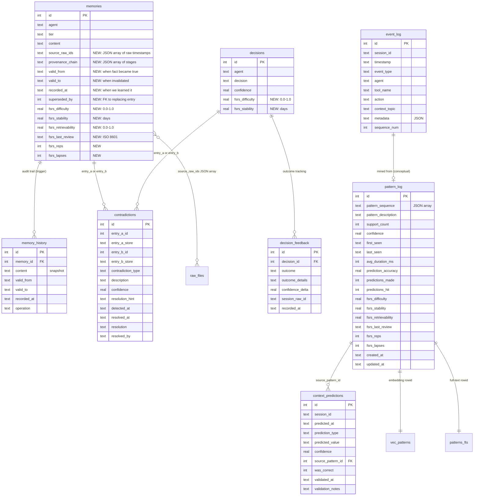

### 3.2 Migration Framework

Shirozen introduces a versioned migration system. brain.db does not currently have one -- tables are created via `CREATE TABLE IF NOT EXISTS` in `initBrain()`. The migration framework must coexist with this pattern.

```typescript
// src/libs/brain/migration.ts

/**
 * Migration entry. Each migration runs exactly once.
 * Tracked in a new `schema_version` table.
 */
interface Migration {
  version: number;
  name: string;
  up: (db: Database) => void;
}

/**
 * Run all pending migrations in version order.
 * Creates schema_version table if it doesn't exist.
 * Wraps each migration in a transaction.
 */
export function runMigrations(): void;
```

**Schema version table:**

```sql
CREATE TABLE IF NOT EXISTS schema_version (
  version INTEGER PRIMARY KEY,
  name TEXT NOT NULL,
  applied_at TEXT NOT NULL
);
```

**Migration list (ordered):**

| Version | Name | SQL |
|---------|------|-----|
| 1 | `add_fsrs_columns_memories` | ALTER TABLE memories ADD COLUMN fsrs_difficulty REAL DEFAULT 0.3; (+ 5 more FSRS columns) |
| 2 | `add_fsrs_columns_decisions` | ALTER TABLE decisions ADD COLUMN fsrs_difficulty REAL DEFAULT 0.3; ALTER TABLE decisions ADD COLUMN fsrs_stability REAL DEFAULT 1.0; |
| 3 | `add_provenance_columns` | ALTER TABLE memories ADD COLUMN source_raw_ids TEXT; (+ valid_from, valid_to, recorded_at, superseded_by, provenance_chain) |
| 4 | `create_event_log` | CREATE TABLE event_log (...); CREATE INDEX idx_event_session ...; (+ 4 more indexes) |
| 5 | `create_pattern_log` | CREATE TABLE pattern_log (...); CREATE VIRTUAL TABLE patterns_fts ...; CREATE VIRTUAL TABLE vec_patterns ...; |
| 6 | `create_decision_feedback` | CREATE TABLE decision_feedback (...); CREATE INDEX idx_feedback_decision ...; |
| 7 | `create_contradictions` | CREATE TABLE contradictions (...); CREATE INDEX idx_contradictions_unresolved ...; |
| 8 | `create_memory_history` | CREATE TABLE memory_history (...); CREATE INDEX idx_history_memory ...; CREATE TRIGGER memory_update_history ...; CREATE TRIGGER memory_invalidate_history ...; |
| 9 | `create_context_predictions` | CREATE TABLE context_predictions (...); CREATE INDEX idx_predictions_session ...; |

**Backward Compatibility (NFR-10):** All migrations are additive. Existing queries continue to work. New columns have DEFAULT values. If Shirozen is not running, brain.db functions identically to today -- the new columns exist but are unused.

### 3.3 Index Strategy

| Table | Index | Columns | Purpose | Target Latency |
|-------|-------|---------|---------|---------------|
| event_log | idx_event_session | session_id | Group events by session for VMSP | < 50ms |
| event_log | idx_event_type | event_type | Filter by event category | < 50ms |
| event_log | idx_event_agent | agent | Filter by agent | < 50ms |
| event_log | idx_event_timestamp | timestamp | Time range queries | < 50ms |
| event_log | idx_event_tool | tool_name | Tool usage analysis | < 50ms |
| pattern_log | patterns_fts | pattern_description (FTS5) | Keyword search patterns | < 50ms |
| pattern_log | vec_patterns | embedding (vec0 float[384]) | Semantic pattern search | < 200ms |
| decision_feedback | idx_feedback_decision | decision_id | Lookup feedback for a decision | < 10ms |
| decision_feedback | idx_feedback_outcome | outcome | Aggregate by outcome type | < 50ms |
| contradictions | idx_contradictions_unresolved | resolved_at WHERE NULL | Active contradictions | < 10ms |
| contradictions | idx_contradictions_type | contradiction_type | Filter by type | < 50ms |
| memory_history | idx_history_memory | memory_id | Audit trail for an entry | < 10ms |
| memory_history | idx_history_operation | operation | Filter by operation type | < 50ms |
| context_predictions | idx_predictions_session | session_id | Predictions for a session | < 10ms |
| context_predictions | idx_predictions_correct | was_correct | Accuracy aggregation | < 50ms |

### 3.4 WAL Mode and Concurrent Access (NFR-11)

brain.db already runs in WAL mode (`PRAGMA journal_mode=WAL` in `sqlite.ts`). This enables:
- **Multiple concurrent readers** -- CLI tools (brain.ts, morning.ts, discover.ts) can read while Shirozen engine writes.
- **Single writer** -- Only one process can write at a time. The `busy_timeout=5000` pragma means a writer waits up to 5 seconds for the lock.

**Write contention scenarios:**

| Scenario | Writer 1 | Writer 2 | Resolution |
|----------|----------|----------|------------|
| Hook event + CLI sync | Hook POSTs event to Shirozen | brain.ts --sync writes directly | No conflict: both go through Shirozen engine (single process) |
| CLI sync + engine write | brain.ts --sync (direct DB write) | Engine event_log insert | busy_timeout=5000 handles. If contention persists, CLI retries. |
| Two hooks simultaneously | PostToolUse event | PreCompact event | Both POST to Shirozen engine. Engine processes sequentially (single-threaded Bun). |

**Design decision:** All Shirozen writes go through the engine process. CLI tools that write to brain.db (brain.ts --sync, consolidate-memory.ts) continue to write directly. The busy_timeout pragma handles occasional contention. This is acceptable because:
1. Shirozen writes are fast (INSERT into event_log, UPDATE FSRS columns).
2. CLI sync writes are infrequent (session start/stop).
3. WAL mode means readers are never blocked.

---

## 4. Transport Architecture

### 4.1 HTTP API

**Base URL:** `http://localhost:3456`
**Content-Type:** `application/json` for all requests and responses.
**Authentication:** None. Localhost-only binding (`hostname: "127.0.0.1"`). Not exposed to network.

#### Route Table

| Method | Path | Handler | Request Body | Response | Traces |
|--------|------|---------|-------------|----------|--------|
| GET | `/api/health` | `handleHealth` | -- | `HealthResponse` | FR-508 |
| POST | `/api/event` | `handleEvent` | `EventInput` | `{ id, sequence_num }` | FR-401 |
| POST | `/api/feedback` | `handleFeedback` | `FeedbackInput` | `FeedbackResponse` | FR-301-305 |
| GET | `/api/predict` | `handlePredict` | `?session_id=` | `PredictionResponse` | FR-406, FR-506 |
| POST | `/api/contradict/check` | `handleContradictCheck` | `ContradictInput` | `ContradictResponse` | FR-201-204 |
| POST | `/api/contradict/resolve` | `handleContradictResolve` | `ResolveInput` | `{ ok }` | FR-206, FR-207 |
| GET | `/api/contradict/unresolved` | `handleContradictList` | -- | `UnresolvedList` | FR-205 |
| GET | `/api/patterns` | `handlePatterns` | `?limit=&min_support=` | `PatternList` | FR-404 |
| POST | `/api/patterns/mine` | `handleMine` | `MineInput` | `MineResponse` | FR-409 |
| GET | `/api/working-memory` | `handleWorkingMemory` | -- | `WorkingMemoryState` | FR-605 |

#### HTTP Router Implementation

```typescript
// src/services/shirozen/routes.ts

export async function router(req: Request, server: Server): Promise<Response | undefined> {
  const url = new URL(req.url);

  // WebSocket upgrade
  if (url.pathname === "/ws") {
    const sessionId = url.searchParams.get("session_id");
    const upgraded = server.upgrade(req, { data: { sessionId } });
    if (upgraded) return undefined;
    return new Response("WebSocket upgrade failed", { status: 400 });
  }

  // Health
  if (req.method === "GET" && url.pathname === "/api/health") {
    return handleHealth();
  }

  // Event logging
  if (req.method === "POST" && url.pathname === "/api/event") {
    return handleEvent(await req.json());
  }

  // Decision feedback
  if (req.method === "POST" && url.pathname === "/api/feedback") {
    return handleFeedback(await req.json());
  }

  // Context prediction
  if (req.method === "GET" && url.pathname === "/api/predict") {
    const sessionId = url.searchParams.get("session_id") ?? "";
    return handlePredict(sessionId);
  }

  // Contradiction management
  if (req.method === "POST" && url.pathname === "/api/contradict/check") {
    return handleContradictCheck(await req.json());
  }
  if (req.method === "POST" && url.pathname === "/api/contradict/resolve") {
    return handleContradictResolve(await req.json());
  }
  if (req.method === "GET" && url.pathname === "/api/contradict/unresolved") {
    return handleContradictList();
  }

  // Patterns
  if (req.method === "GET" && url.pathname === "/api/patterns") {
    return handlePatterns(url.searchParams);
  }
  if (req.method === "POST" && url.pathname === "/api/patterns/mine") {
    return handleMine(await req.json());
  }

  // Working memory
  if (req.method === "GET" && url.pathname === "/api/working-memory") {
    return handleWorkingMemory();
  }

  return new Response("Not found", { status: 404 });
}
```

#### Error Response Format

All error responses use a consistent shape:

```typescript
interface ErrorResponse {
  error: string;           // human-readable message
  code: string;            // machine-readable code
  details?: unknown;       // optional structured details
}

// HTTP status codes used:
// 200 -- success
// 400 -- validation error (bad input)
// 404 -- not found (invalid path, missing resource)
// 409 -- conflict (contradiction already resolved)
// 500 -- internal error (database failure, unexpected)
// 503 -- service unavailable (brain.db locked, shutting down)
```

#### Input Validation

Every POST endpoint validates its body using Zod schemas before processing:

```typescript
import { z } from "zod";

const EventInputSchema = z.object({
  session_id: z.string().min(1),
  event_type: z.enum([
    "tool_call", "user_prompt", "workflow_start", "workflow_end",
    "agent_dispatch", "search_query", "decision_made", "context_push",
    "prediction_hit",
  ]),
  agent: z.string().optional(),
  tool_name: z.string().optional(),
  action: z.string().optional(),
  context_topic: z.string().optional(),
  metadata: z.record(z.unknown()).optional(),
});

const FeedbackInputSchema = z.object({
  decision_id: z.number().int().positive(),
  outcome: z.enum(["success", "failure", "partial", "abandoned"]),
  outcome_details: z.string().optional(),
  session_raw_id: z.string().optional(),
});

const ContradictCheckSchema = z.object({
  entry_id: z.number().int().positive(),
  entry_store: z.enum(["memories", "decisions"]),
  content: z.string().min(1),
});

const ContradictResolveSchema = z.object({
  contradiction_id: z.number().int().positive(),
  winner_id: z.number().int().positive(),
  reason: z.string().min(1),
  resolved_by: z.enum(["user", "auto", "decay"]),
});

const MineInputSchema = z.object({
  min_support: z.number().min(0).max(1).optional(),
  max_gap: z.number().int().min(0).optional(),
  since: z.string().optional(),
});
```

### 4.2 WebSocket

**URL:** `ws://localhost:3456/ws?session_id={id}`
**Protocol:** JSON messages over native Bun WebSocket.

#### Connection Lifecycle

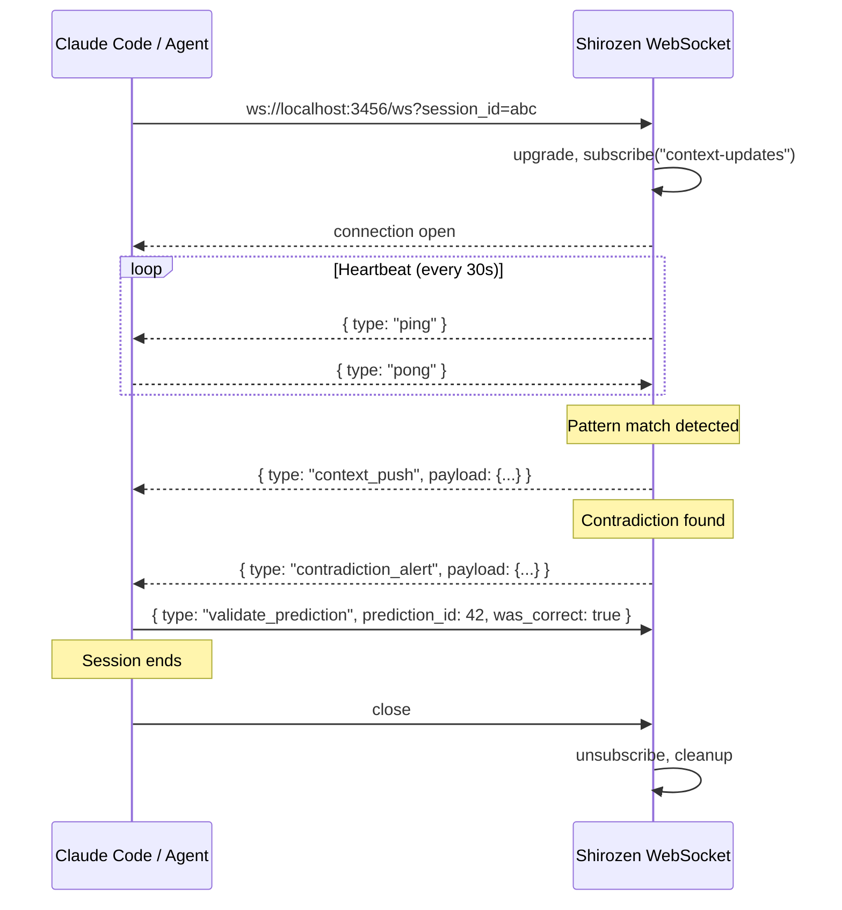

#### Message Types (Client to Server)

```typescript
type ClientMessage =
  | { type: "register"; session_id: string; agent?: string }
  | { type: "event"; session_id: string; event_type: string; tool_name?: string; agent?: string }
  | { type: "predict"; session_id: string }
  | { type: "validate_prediction"; prediction_id: number; was_correct: boolean }
  | { type: "pong" };
```

#### Message Types (Server to Client)

```typescript
type ServerMessage =
  | { type: "context_push"; payload: ContextPushPayload }
  | { type: "contradiction_alert"; payload: ContradictionAlertPayload }
  | { type: "feedback_applied"; payload: FeedbackAppliedPayload }
  | { type: "ping" };

interface ContextPushPayload {
  reason: "session_start" | "pattern_match" | "topic_detected" | "pre_compact";
  context: Array<{ id: number; content: string; relevance: number }>;
  pattern?: { id: number; sequence: string[]; confidence: number };
}

interface ContradictionAlertPayload {
  id: number;
  entryAPreview: string;
  entryBPreview: string;
  type: ContradictionType;
  confidence: number;
}

interface FeedbackAppliedPayload {
  decisionId: number;
  newConfidence: number;
  outcome: string;
}
```

#### WebSocket Handler

```typescript
// src/services/shirozen/websocket.ts

const HEARTBEAT_INTERVAL = 30_000; // 30 seconds
const PONG_TIMEOUT = 10_000;       // 10 seconds to respond

export const wsHandler = {
  open(ws: ServerWebSocket<{ sessionId: string }>) {
    ws.subscribe("context-updates");
    activeConnections.add(ws);
    startHeartbeat(ws);
  },

  message(ws: ServerWebSocket<{ sessionId: string }>, message: string) {
    const msg = JSON.parse(message) as ClientMessage;
    switch (msg.type) {
      case "pong":
        clearPongTimeout(ws);
        break;
      case "event":
        handleEventFromWS(msg);
        break;
      case "predict":
        handlePredictFromWS(ws, msg.session_id);
        break;
      case "validate_prediction":
        recordPredictionOutcome(msg.prediction_id, msg.was_correct);
        break;
    }
  },

  close(ws: ServerWebSocket<{ sessionId: string }>) {
    ws.unsubscribe("context-updates");
    activeConnections.delete(ws);
    stopHeartbeat(ws);
  },
};
```

### 4.3 MCP Channel Plugin

The Channel Plugin is a separate MCP server that Claude Code spawns as a subprocess. It connects to the Shirozen engine via HTTP to receive notifications, then pushes them into the Claude Code session as `<channel>` XML tags.

**Architecture:**

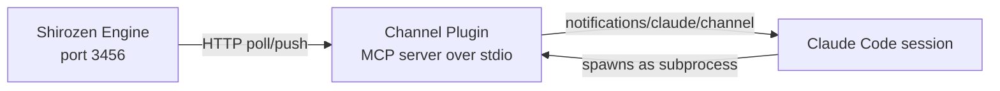

**Plugin Implementation:**

```typescript
// src/services/shirozen/channel.ts

import { McpServer } from "@modelcontextprotocol/sdk/server/mcp.js";
import { StdioServerTransport } from "@modelcontextprotocol/sdk/server/stdio.js";

const server = new McpServer({
  name: "shirozen",
  version: "1.0.0",
}, {
  capabilities: {
    experimental: {
      "claude/channel": {},
    },
  },
  instructions: [
    "Shirozen is the cognitive brain engine for this project.",
    "Messages tagged <channel source=\"shirozen\"> contain predicted context,",
    "contradiction alerts, pattern matches, or decision feedback.",
    "Treat predicted_context as supplementary background information.",
    "Treat contradiction_alert as requiring user attention.",
    "Do not repeat or summarize channel messages unless directly relevant.",
  ].join(" "),
});

// Poll Shirozen engine for notifications
async function pollNotifications(): Promise<void> {
  const interval = setInterval(async () => {
    try {
      const res = await fetch("http://localhost:3456/api/channel/poll", {
        signal: AbortSignal.timeout(2000),
      });
      if (!res.ok) return;
      const notifications = await res.json() as ShirozenChannelNotification[];
      for (const n of notifications) {
        server.notification({
          method: "notifications/claude/channel",
          params: {
            content: n.content,
            meta: n.meta,
          },
        });
      }
    } catch {
      // Engine not running or timeout -- silently skip
    }
  }, 5000); // Poll every 5 seconds
}
```

**Notification Format (as seen by Claude Code):**

```xml
<channel source="shirozen" type="predicted_context" confidence="0.85">
Based on recent patterns, this looks like a create-track session.
Pre-loaded: Style formula constraints (v5.5), bracket format rules, recent Suno decisions.
</channel>
```

**Security:**
- The Channel Plugin only accepts notifications from `localhost:3456` (sender validation).
- The plugin must be launched with `--dangerously-load-development-channels server:shirozen` during development, or added to `allowedChannelPlugins` for production.
- No authentication token needed -- localhost-only, same-machine trust boundary.

### 4.4 Hook Integration

All hooks fire short-lived Bun processes that make HTTP calls to the Shirozen engine. Every hook call has a 1-second timeout and fails silently if the engine is not running.

#### settings.json Changes

```json
{
  "hooks": {
    "SessionStart": [
      {
        "matcher": "",
        "hooks": [
          { "type": "command", "command": "bun \"$CLAUDE_PROJECT_DIR/.claude/hooks/tool-call-counter.ts\" --reset" },
          { "type": "command", "command": "bun \"$CLAUDE_PROJECT_DIR/src/tools/brain.ts\" --check" },
          { "type": "command", "command": "bun \"$CLAUDE_PROJECT_DIR/.claude/hooks/startup.ts\"" },
          { "type": "command", "command": "bun \"$CLAUDE_PROJECT_DIR/.claude/hooks/shirozen-predict.ts\"" }
        ]
      }
    ],
    "PostToolUse": [
      {
        "matcher": "",
        "hooks": [
          { "type": "command", "command": "bun \"$CLAUDE_PROJECT_DIR/.claude/hooks/tool-call-counter.ts\"" },
          { "type": "command", "command": "bun \"$CLAUDE_PROJECT_DIR/.claude/hooks/capture-raw.ts\" --post-tool" },
          { "type": "command", "command": "bun \"$CLAUDE_PROJECT_DIR/.claude/hooks/shirozen-event.ts\"" }
        ]
      }
    ],
    "PreCompact": [
      {
        "matcher": "",
        "hooks": [
          { "type": "command", "command": "bun \"$CLAUDE_PROJECT_DIR/.claude/hooks/pre-compact-save.ts\"" },
          { "type": "command", "command": "bun \"$CLAUDE_PROJECT_DIR/.claude/hooks/capture-raw.ts\" --pre-compact" },
          { "type": "command", "command": "bun \"$CLAUDE_PROJECT_DIR/.claude/hooks/shirozen-compact.ts\"" }
        ]
      }
    ],
    "Stop": [
      {
        "matcher": "",
        "hooks": [
          { "type": "command", "command": "bun \"$CLAUDE_PROJECT_DIR/.claude/hooks/tool-call-counter.ts\" --check" },
          { "type": "command", "command": "bun \"$CLAUDE_PROJECT_DIR/.claude/hooks/capture-raw.ts\" --stop" },
          { "type": "command", "command": "bun \"$CLAUDE_PROJECT_DIR/src/tools/brain.ts\" --check" },
          { "type": "command", "command": "bun \"$CLAUDE_PROJECT_DIR/.claude/hooks/shirozen-event.ts\" --session-end" }
        ]
      }
    ]
  }
}
```

#### Hook Scripts

**`.claude/hooks/shirozen-event.ts` (PostToolUse + Stop):**

```typescript
#!/usr/bin/env bun
// Fire-and-forget event capture. Reads tool info from stdin + env.
// 1s timeout. Silently skips if Shirozen is down.

import { fromRoot } from "../../src/libs/paths.js";

const mode = process.argv[2]; // "--session-end" or undefined (PostToolUse)

try {
  const raw = await Bun.stdin.text();
  const parsed = JSON.parse(raw);

  const body = mode === "--session-end"
    ? {
        session_id: parsed.session_id,
        event_type: "workflow_end" as const,
        metadata: { reason: "session_end", tool_count: parsed.tool_count },
      }
    : {
        session_id: parsed.session_id,
        event_type: "tool_call" as const,
        tool_name: parsed.tool_name,
        agent: parsed.agent,
      };

  await fetch("http://localhost:3456/api/event", {
    method: "POST",
    headers: { "Content-Type": "application/json" },
    body: JSON.stringify(body),
    signal: AbortSignal.timeout(1000),
  });
} catch {
  // Never block Claude Code
}

process.exit(0);
```

**`.claude/hooks/shirozen-predict.ts` (SessionStart):**

```typescript
#!/usr/bin/env bun
// Query Shirozen for predicted context at session start.
// Auto-starts Shirozen if not running (FR-509).
// Outputs predicted context to stdout for session injection.

try {
  const res = await fetch("http://localhost:3456/api/predict?session_id=startup", {
    signal: AbortSignal.timeout(2000),
  });

  if (!res.ok) {
    // Try to start Shirozen and retry once
    const { execSync } = await import("child_process");
    execSync("bun run shirozen:start", { cwd: process.env.CLAUDE_PROJECT_DIR, timeout: 5000 });
    await new Promise(r => setTimeout(r, 1000)); // wait for startup

    const retry = await fetch("http://localhost:3456/api/predict?session_id=startup", {
      signal: AbortSignal.timeout(2000),
    });
    if (!retry.ok) process.exit(0);
    const data = await retry.json();
    outputPrediction(data);
  } else {
    const data = await res.json();
    outputPrediction(data);
  }
} catch {
  // Shirozen not available -- session starts without predictions
}

function outputPrediction(data: any) {
  if (!data.predicted_workflow && !data.warm_context?.length) return;
  const lines: string[] = ["[Shirozen] Predicted context:"];
  if (data.predicted_workflow) {
    lines.push(`  Workflow: ${data.predicted_workflow.pattern_sequence.join(" -> ")} (${Math.round(data.predicted_workflow.confidence * 100)}% confidence)`);
  }
  if (data.warm_context?.length) {
    lines.push(`  Pre-loaded ${data.warm_context.length} context entries`);
    for (const entry of data.warm_context.slice(0, 3)) {
      lines.push(`    - ${entry.content.slice(0, 100)}...`);
    }
  }
  process.stdout.write(lines.join("\n") + "\n");
}

process.exit(0);
```

**`.claude/hooks/shirozen-compact.ts` (PreCompact):**

```typescript
#!/usr/bin/env bun
// Send critical context to Shirozen working memory before compaction.

try {
  const raw = await Bun.stdin.text();
  const parsed = JSON.parse(raw);

  await fetch("http://localhost:3456/api/event", {
    method: "POST",
    headers: { "Content-Type": "application/json" },
    body: JSON.stringify({
      session_id: parsed.session_id,
      event_type: "context_push",
      metadata: {
        reason: "pre_compact",
        tool_count: parsed.tool_count,
        compact_number: parsed.compact_number,
      },
    }),
    signal: AbortSignal.timeout(1000),
  });
} catch {
  // Never block Claude Code
}

process.exit(0);
```

### 4.5 Stdio (Agent SDK)

Used for headless batch operations. Shirozen spawns Claude Code CLI as a subprocess for background analysis tasks that require LLM reasoning (pattern description generation, batch contradiction scan).

**When used:**
- Daily pattern mining: Shirozen needs to generate natural language descriptions of mined patterns (requires LLM).
- Batch contradiction scan: Weekly background scan of knowledge entries (requires LLM).
- These are low-frequency, non-interactive operations.

**Not used for:** Real-time operations. All real-time communication uses HTTP or WebSocket.

---

## 5. Service Architecture

### 5.1 Bun.serve() Configuration

```typescript
// src/services/shirozen/index.ts

import { fromRoot } from "../../libs/paths.js";
import { router } from "./routes.js";
import { wsHandler } from "./websocket.js";
import { initBrain } from "../../libs/brain/index.js";
import { runMigrations } from "../../libs/brain/migration.js";
import { createWorkingMemory } from "./working-memory.js";

const config = {
  port: parseInt(process.env.SHIROZEN_PORT ?? "3456", 10),
  hostname: "127.0.0.1",  // localhost only, not exposed to network
};

async function main(): Promise<void> {
  // 1. Initialize brain.db (creates tables if needed)
  initBrain();

  // 2. Run Shirozen-specific migrations
  runMigrations();

  // 3. Create working memory instance
  const wm = createWorkingMemory();

  // 4. Warm working memory from recent entries
  await wm.warm("session_start");

  // 5. Start server
  const server = Bun.serve({
    port: config.port,
    hostname: config.hostname,
    fetch: (req, srv) => router(req, srv),
    websocket: wsHandler,
  });

  console.log(`[Shirozen] Listening on ${config.hostname}:${config.port}`);

  // 6. Start periodic tasks
  startEvictionTimer(wm);     // every 60s, evict expired WM entries
  startHealthLogger();         // every 5m, log health stats

  // 7. Register shutdown
  process.on("SIGTERM", () => gracefulShutdown(server));
  process.on("SIGINT", () => gracefulShutdown(server));
}

main().catch((err) => {
  console.error("[Shirozen] Fatal:", err);
  process.exit(1);
});
```

### 5.2 Daemon Management (Native Bun — No PM2)

Follows the existing project pattern used by MCP server (`src/servers/freddie-ai/daemon.ts`) and Obsidian sync (`src/tools/obsidian/sync.ts`).

```typescript
// src/services/shirozen/daemon.ts
// PID file: out/shirozen.pid
// Log file: out/shirozen.log
// Port check: net.createConnection to verify server is up
// Start: spawn detached bun process, write PID, unref
// Stop: read PID, taskkill /F /T /PID on Windows, remove PID file
// Status: check PID file + port connectivity
// Restart: stop, wait for port release, start
```

**Reference implementation:** `src/servers/freddie-ai/daemon.ts` (identical pattern, different PID/log paths and port).

**bun scripts (package.json additions):**

```json
{
  "shirozen:start": "bun src/services/shirozen/daemon.ts start",
  "shirozen:stop": "bun src/services/shirozen/daemon.ts stop",
  "shirozen:restart": "bun src/services/shirozen/daemon.ts restart",
  "shirozen:status": "bun src/services/shirozen/daemon.ts status",
  "shirozen:logs": "bun src/services/shirozen/daemon.ts logs"
}
```

### 5.3 Health Check

```typescript
// GET /api/health response
async function handleHealth(): Promise<Response> {
  const stats = {
    ok: true,
    uptime: process.uptime(),
    stats: {
      patterns: countPatterns(),
      working_memory: wm.getState().entries,
      events_today: countEventsToday(),
      unresolved_contradictions: countUnresolved(),
      predictions_accuracy: computeRollingAccuracy(7), // 7-day rolling
    },
  };
  return Response.json(stats);
}
```

### 5.4 Configuration

| Variable | Default | Description |
|----------|---------|-------------|
| `SHIROZEN_PORT` | 3456 | HTTP + WebSocket port |
| `SHIROZEN_WM_MAX` | 100 | Working memory max entries |
| `SHIROZEN_WM_TTL` | 14400000 | Working memory TTL in ms (4 hours) |
| `SHIROZEN_WM_MIN_R` | 0.5 | Min FSRS retrievability for WM promotion |
| `SHIROZEN_HEARTBEAT` | 30000 | WebSocket heartbeat interval in ms |
| `SHIROZEN_EVICT_INTERVAL` | 60000 | Working memory eviction sweep interval in ms |

---

## 6. Algorithm Details

### 6.1 FSRS Integration

**Package:** `ts-fsrs` (official TypeScript implementation of FSRS-5).

**How it maps to brain.db:**

| FSRS Concept | brain.db Column | Description |
|-------------|----------------|-------------|
| Difficulty (D) | `fsrs_difficulty` | How hard is this knowledge to retain. Range: 0.0-1.0. |
| Stability (S) | `fsrs_stability` | Days until retrievability drops to 0.9. Higher = more stable. |
| Retrievability (R) | `fsrs_retrievability` | Current probability this knowledge is accurate. R = e^{-t/S}. |
| Last Review | `fsrs_last_review` | ISO 8601 timestamp of last feedback/reinforcement. |
| Reps | `fsrs_reps` | Number of successful reviews. |
| Lapses | `fsrs_lapses` | Number of failures (Rating.Again). |

**When ratings are computed:**

| Event | Who | Rating Applied | Target Table |
|-------|-----|---------------|-------------|
| Decision feedback: success | reflect.ts -> POST /api/feedback | Rating.Good | decisions |
| Decision feedback: partial | reflect.ts -> POST /api/feedback | Rating.Hard | decisions |
| Decision feedback: failure | reflect.ts -> POST /api/feedback | Rating.Again | decisions |
| Decision feedback: abandoned | reflect.ts -> POST /api/feedback | Rating.Again | decisions |
| Memory used successfully | brain.ts search hit -> agent uses it | Rating.Good | memories |
| Memory contradicted | contradiction detector | Rating.Again | memories |
| Pattern prediction hit | context_predictions validation | Rating.Good | pattern_log |
| Pattern prediction miss | context_predictions validation | Rating.Again | pattern_log |

**FSRS in search ranking (FR-306):**

```typescript
// src/libs/brain/degradation.ts -- updated
export function computeFinalScore(
  baseScore: number,         // FTS5 rank or vector distance
  fsrsState: FSRSState | null,
  createdAt: string,
): number {
  // If FSRS state exists, use retrievability
  if (fsrsState?.fsrs_last_review) {
    const retrievability = computeRetrievability(fsrsState);
    return baseScore * retrievability;
  }

  // Fallback to existing staleness model for entries without FSRS
  const staleness = knowledgeStaleness(null, createdAt);
  return baseScore * staleness;
}
```

### 6.2 VMSP Mining

**Package:** `@smartesting/vmsp` (TypeScript implementation of VMSP algorithm).

**Input preparation:**

```typescript
function prepareVMSPDatabase(since?: string): string[][][] {
  // 1. Get all sessions with events since the cutoff date
  const sessions = db.query(`
    SELECT session_id, event_type, tool_name, sequence_num
    FROM event_log
    WHERE ($since IS NULL OR timestamp >= $since)
    ORDER BY session_id, sequence_num
  `).all({ $since: since ?? null });

  // 2. Group by session_id
  const grouped = new Map<string, string[]>();
  for (const row of sessions) {
    const key = row.session_id;
    if (!grouped.has(key)) grouped.set(key, []);
    grouped.get(key)!.push(row.tool_name ?? row.event_type);
  }

  // 3. Convert to VMSP format: array of sequences, each sequence = array of itemsets
  return Array.from(grouped.values()).map(events =>
    events.map(e => [e])  // each event is a single-item itemset
  );
}
```

**Configuration (FR-410):**

```typescript
const vmsp = new AlgoVMSP({
  patternType: "maximal",
  maxGap: 3,
  minimumPatternLength: 2,
  maximumPatternLength: 10,
});

const result = vmsp.run(database, 0.3); // 30% minimum support
```

**Output processing:**

For each mined pattern:
1. Check if pattern already exists in `pattern_log` (by sequence match).
2. If exists: update `support_count`, `last_seen`, `prediction_accuracy`.
3. If new: insert with default FSRS state, embed description via ONNX, store in `vec_patterns`.

**Scheduling:**
- **Daily:** Automatic mining via Shirozen internal timer (setInterval in service).
- **On-demand:** `bun src/tools/mine-patterns.ts` or `POST /api/patterns/mine`.
- **Session-end trigger:** If session had 10+ events, queue mining (processed on next daily run or manually).

### 6.3 Contradiction Detection Pipeline

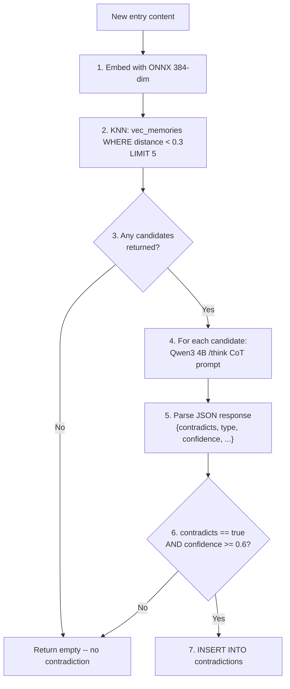

**Prompt template:** See PRD Appendix C. Key points:
- Chain-of-thought (step-by-step reasoning) achieves ~80% F1.
- JSON-only response for reliable parsing.
- Three types: value, temporal, logical.

**Performance target (NFR-04):** < 5s per entry including local LLM call. Breakdown:
- ONNX embedding: ~50ms
- KNN query: ~20ms
- Qwen3 4B `/think` mode: ~2-4s (dominates, local inference, no network latency)
- Total: ~2.5-4.5s per entry

### 6.4 Working Memory LRU

**Implementation:** `Map<string, WorkingMemoryEntry>` with LRU eviction.

Key generation: `${sourceTable}:${sourceId}` (e.g., `memories:42`).

**Eviction policy (priority order):**
1. Expired entries (past TTL) -- evicted on every access and periodic sweep.
2. Oldest `lastAccessed` -- evicted when at capacity.

**Warming triggers:**

| Strategy | Trigger | What it loads |
|----------|---------|---------------|
| `session_start` | SessionStart hook or engine startup | Top 20 entries by FSRS retrievability from last 7 days |
| `topic_detection` | First user prompt analyzed | Top 10 entries matching detected topic via FTS5 |
| `work_streak` | 3+ sessions with same `context_topic` | All entries from that topic cluster |
| `tool_usage` | Tool call events | Decisions related to the tools being used |
| `time_based` | Time of day | Morning: tasks + decisions. Evening: creative references. |

### 6.5 Prefix Matching for Prediction

The prefix matching algorithm compares the current session's event sequence against stored patterns:

```
Session events so far: [discover, query-brain, build-style]

Pattern A: [discover, query-brain, build-style, validate, tri-critic]
  -> Match length: 3/5, predicted next: [validate, tri-critic]

Pattern B: [discover, query-brain, morning]
  -> Match length: 2/3, but event 3 doesn't match -> match breaks at 2

Score = support_count * fsrs_retrievability * (matched_length / total_length)
```

### 6.6 Context Prediction Scoring

When assembling predicted context for a session:

```typescript
function rankContextEntries(
  entries: ContextEntry[],
): RankedEntry[] {
  return entries.map(entry => ({
    ...entry,
    score: computeContextScore(entry),
  }))
  .sort((a, b) => b.score - a.score)
  .slice(0, 10); // top 10 entries
}

function computeContextScore(entry: ContextEntry): number {
  let score = 0;

  // Source weight
  if (entry.source === "working_memory") score += 0.4;  // already warm
  if (entry.source === "pattern") score += 0.3;          // predicted
  if (entry.source === "recent") score += 0.2;           // recency

  // FSRS retrievability
  score *= entry.fsrsRetrievability ?? 0.5;

  // Pattern confidence (if from pattern match)
  if (entry.patternConfidence) score *= entry.patternConfidence;

  // Recency bonus (entries from last 24h get 1.5x)
  const hoursSinceUpdate = (Date.now() - new Date(entry.updatedAt).getTime()) / 3_600_000;
  if (hoursSinceUpdate < 24) score *= 1.5;

  return score;
}
```

---

## 7. Integration Architecture

### 7.1 Tool Modifications

#### reflect.ts

**What changes:** After logging decisions to brain.db (existing behavior), also call Shirozen's feedback endpoint to update FSRS scores.

**Before:**
```typescript
// Current behavior
await logDecision(decision);
// Done. No outcome feedback.
```

**After:**
```typescript
// New behavior
const decisionId = await logDecision(decision);

// POST feedback to Shirozen (fire-and-forget)
if (decisionId && reflection.outcome) {
  fetch("http://localhost:3456/api/feedback", {
    method: "POST",
    headers: { "Content-Type": "application/json" },
    body: JSON.stringify({
      decision_id: decisionId,
      outcome: mapReflectionOutcome(reflection.outcome),
      outcome_details: reflection.trace,
      session_raw_id: reflection.rawRef?.toString(),
    }),
    signal: AbortSignal.timeout(2000),
  }).catch(() => null); // Don't fail reflection if Shirozen is down
}
```

**Backward compatibility:** If Shirozen is not running, the fetch silently fails. reflect.ts continues to work exactly as before. The only addition is the POST call.

#### consolidate-memory.ts

**What changes:** Before merging inbox entries into knowledge, check each entry for contradictions via Shirozen. If contradictions detected, log them and skip the merge for conflicting entries.

**Before:**
```typescript
// Current behavior
for (const newEntry of inbox) {
  // LLM merges inbox + knowledge
  // Result written to knowledge/
  // Original archived
}
```

**After:**
```typescript
// New behavior
for (const newEntry of inbox) {
  // 1. Check for contradictions (Shirozen)
  let contradictions: DetectedContradiction[] = [];
  try {
    const res = await fetch("http://localhost:3456/api/contradict/check", {
      method: "POST",
      headers: { "Content-Type": "application/json" },
      body: JSON.stringify({
        entry_id: newEntry.id,
        entry_store: "memories",
        content: newEntry.content,
      }),
      signal: AbortSignal.timeout(5000),
    });
    if (res.ok) {
      const result = await res.json();
      contradictions = result.contradictions;
    }
  } catch {
    // Shirozen down -- proceed without contradiction check
  }

  if (contradictions.length > 0) {
    console.warn(`Contradictions detected for "${newEntry.title}" -- skipping merge`);
    // Entry stays in inbox, contradiction logged in brain.db
    continue;
  }

  // 2. Set provenance (Shirozen)
  // After merge, call setProvenance() with source_raw_ids

  // 3. Existing merge logic (unchanged)
  // ...
}
```

**Backward compatibility:** If Shirozen is not running, consolidation proceeds exactly as before (no contradiction check, no provenance tracking). When Shirozen comes online, future consolidations get the enhancement.

#### morning.ts

**What changes:** Add predicted workflow, unresolved contradictions, and decision feedback summary to the briefing.

**Before:** Static output: task counts, inbox counts, calendar.

**After:** Adds three new sections:

```typescript
// Predicted workflow (from pattern detection)
try {
  const predictRes = await fetch("http://localhost:3456/api/predict?session_id=morning");
  if (predictRes.ok) {
    const prediction = await predictRes.json();
    if (prediction.predicted_workflow) {
      sections.push(`Predicted workflow: ${prediction.predicted_workflow.pattern_sequence.join(" -> ")}`);
    }
  }
} catch {}

// Unresolved contradictions
try {
  const contradictRes = await fetch("http://localhost:3456/api/contradict/unresolved");
  if (contradictRes.ok) {
    const { contradictions } = await contradictRes.json();
    if (contradictions.length > 0) {
      sections.push(`${contradictions.length} unresolved contradictions:`);
      for (const c of contradictions) {
        sections.push(`  - "${c.entry_a.content.slice(0, 50)}" vs "${c.entry_b.content.slice(0, 50)}" (${c.type})`);
      }
    }
  }
} catch {}
```

**Backward compatibility:** If Shirozen is not running, the briefing renders exactly as before. The new sections simply don't appear.

#### brain.ts

**What changes:** Search results additionally weighted by FSRS retrievability.

**Before:**
```typescript
finalScore = baseScore * staleness;
```

**After:**
```typescript
// Use FSRS if available, fall back to staleness model
if (entry.fsrs_last_review) {
  const retrievability = computeRetrievability(entry);
  finalScore = baseScore * retrievability;
} else {
  finalScore = baseScore * staleness; // existing behavior
}
```

**Backward compatibility:** Entries without FSRS scores (all existing entries initially) use the existing staleness model. FSRS scoring phases in as entries get feedback.

#### tool-call-counter.ts

**What changes:** No modification to the tool itself. Event capture is handled by the new `shirozen-event.ts` hook, which runs alongside tool-call-counter.ts in the PostToolUse hook chain.

### 7.2 New CLI Tools

| Tool | Path | CLI Interface | Purpose |
|------|------|--------------|---------|
| `shirozen-ctl.ts` | `src/tools/shirozen-ctl.ts` | `--start \| --stop \| --status \| --health \| --restart` | Service lifecycle management. Wraps daemon.ts commands. |
| `mine-patterns.ts` | `src/tools/mine-patterns.ts` | `--since {date} \| --min-support {n} \| --dry-run` | On-demand VMSP mining. Reads event_log, writes pattern_log. |

```typescript
// src/tools/shirozen-ctl.ts
// --start   -> bun src/services/shirozen/daemon.ts start
// --stop    -> bun src/services/shirozen/daemon.ts stop
// --status  -> bun src/services/shirozen/daemon.ts status
// --health  -> GET http://localhost:3456/api/health (formatted)
// --restart -> bun src/services/shirozen/daemon.ts restart
```

### 7.3 Client Library

```typescript
// src/libs/shirozen/client.ts

/**
 * Typed HTTP client for calling Shirozen service.
 * All methods have timeouts and fail gracefully if service is down.
 */
export class ShirozenClient {
  private baseUrl: string;
  private timeout: number;

  constructor(baseUrl = "http://localhost:3456", timeout = 2000) {
    this.baseUrl = baseUrl;
    this.timeout = timeout;
  }

  async logEvent(event: EventInput): Promise<{ id: number; sequence_num: number } | null>;
  async submitFeedback(feedback: FeedbackInput): Promise<FeedbackResponse | null>;
  async predict(sessionId: string): Promise<PredictionResponse | null>;
  async checkContradiction(input: ContradictInput): Promise<ContradictResponse | null>;
  async resolveContradiction(input: ResolveInput): Promise<boolean>;
  async getUnresolved(): Promise<UnresolvedContradiction[]>;
  async getPatterns(limit?: number, minSupport?: number): Promise<PatternLogEntry[]>;
  async minePatterns(options?: MineInput): Promise<MineResponse | null>;
  async getWorkingMemory(): Promise<WorkingMemoryState | null>;
  async health(): Promise<HealthResponse | null>;
  isAvailable(): Promise<boolean>;
}
```

---

## 8. Security Architecture

### 8.1 Channel Plugin Sender Validation

The MCP Channel Plugin accepts notifications only from the local Shirozen engine. All other senders are silently dropped.

```typescript
// In channel plugin notification receiver:
function validateSender(source: string): boolean {
  return source === "shirozen";
}
```

Since the Channel Plugin polls the engine via HTTP on `localhost:3456`, and the engine only binds to `127.0.0.1`, the trust boundary is the local machine. No external network access is possible.

### 8.2 HTTP API Authentication

No authentication. The API binds to `127.0.0.1:3456` and is not accessible from the network. This matches the existing MCP server pattern (port 3456 for HTTP MCP).

**Note:** The existing MCP HTTP server also uses port 3456. Shirozen replaces it or uses a different port. The PRD specifies 3456. If the MCP HTTP server is still needed, Shirozen should use a different port (e.g., 3457). This is an implementation detail to resolve in Phase 1.

### 8.3 brain.db File-Level Access

- WAL mode enables concurrent readers (CLI tools + Shirozen engine).
- Single writer at a time (busy_timeout=5000 handles contention).
- No file-level encryption. brain.db is a local file in `vault/studio/`.
- brain.db is gitignored (lives in vault/, synced via Obsidian Sync).

### 8.4 Input Validation

All API endpoints validate input using Zod schemas (defined in section 4.1). Invalid input returns HTTP 400 with structured error response. No raw SQL interpolation -- all queries use parameterized statements via Drizzle ORM or `db.query().all()` with bound parameters.

---

## 9. Performance Architecture

### 9.1 Target Latencies

| Operation | Target | Source | Strategy |
|-----------|--------|--------|----------|
| HTTP API response (non-LLM) | < 50ms p95 | NFR-01 | Direct DB query, no network hops |
| Working memory lookup | < 5ms | NFR-02 | In-process Map lookup |
| brain.db FTS5 + vector KNN | < 200ms p95 | NFR-03 | Existing indexes + FSRS column reads |
| Contradiction detection (per entry) | < 5s | NFR-04 | ONNX embed (~50ms) + KNN (~20ms) + local Qwen3 4B /think (~2-4s) |
| VMSP mining (100 sessions) | < 10s | NFR-05 | In-memory VMSP, no disk I/O during mining |
| Session start prediction | < 500ms total | Success metric | HTTP call + prefix match + context assembly |
| Event logging (PostToolUse) | < 50ms | Critical path | Single INSERT, fire-and-forget |

### 9.2 Caching Strategy

| Layer | What | TTL | Max Size | Hit Target |
|-------|------|-----|----------|------------|
| Working Memory (L1) | brain.db entries promoted on access | 4 hours | 100 entries | > 40% of queries |
| Semantic Cache (L2) | Query-response pairs by embedding similarity | 4 hours | 50 pairs | > 20% for repeated queries |
| brain.db (L3) | All indexed knowledge | Permanent | Unlimited | 100% (always hit, just slower) |

### 9.3 Batch vs Real-Time

| Operation | Mode | Reason |
|-----------|------|--------|
| Event logging | Real-time | Must capture every tool call as it happens |
| FSRS update on feedback | Real-time | Feedback is infrequent, update is fast |
| Contradiction check | Real-time (during consolidation) | Must block merge until checked |
| VMSP pattern mining | Batch (daily) | Expensive, operates on full session history |
| Pattern description embedding | Batch (after mining) | Follows mining, not time-critical |
| Background contradiction scan | Batch (weekly) | Non-urgent, comprehensive |
| Working memory warming | Real-time (on triggers) | Triggered by events, fast DB reads |

### 9.4 Memory Budget (NFR-06)

Target: < 150MB RSS for the Shirozen engine process.

| Component | Estimated RSS | Notes |
|-----------|--------------|-------|
| Bun runtime | ~40MB | Base Bun process |
| brain.db connection + WAL | ~20MB | SQLite in-process, WAL file |
| Working memory (100 entries) | ~5MB | Assuming ~50KB per entry average |
| Semantic cache (50 pairs) | ~3MB | Embeddings (384 floats * 4 bytes * 100) + responses |
| ONNX model (loaded on demand) | ~30MB | all-MiniLM-L6-v2, loaded only during embedding |
| HTTP/WebSocket server | ~5MB | Bun.serve overhead |
| Headroom | ~47MB | Buffer for GC, temporary allocations |
| **Total** | **~150MB** | |

**Note:** ONNX model is loaded on demand (first embedding call) and kept in memory. If memory pressure is high, it can be unloaded after a timeout.

---

## 10. Error Handling and Resilience

### 10.1 Shirozen Service Down (Graceful Degradation)

Every consumer of Shirozen uses fire-and-forget HTTP calls with short timeouts. If the service is down:

| Consumer | Behavior When Down | Impact |
|----------|-------------------|--------|
| SessionStart hook | Prediction skipped, session starts without predicted context | Cold start (current behavior) |
| PostToolUse hook | Event not captured in event_log | Missing data for pattern mining (acceptable) |
| PreCompact hook | Working memory not notified | Context may not survive compaction (existing behavior) |
| Stop hook | Session-end event not logged | Pattern mining has incomplete sessions |
| reflect.ts | Feedback not recorded | Decision FSRS scores not updated (manual retry possible) |
| consolidate-memory.ts | No contradiction check | Merges proceed without check (current behavior) |
| morning.ts | No predictions or contradictions | Briefing shows static content (current behavior) |
| brain.ts | No FSRS scoring | Falls back to existing staleness model |

**Recovery:** When Shirozen comes back online:
1. Working memory rebuilds from brain.db (warm strategy: `session_start`).
2. Pattern mining catches up on next run.
3. FSRS scores for missed feedback are not retroactively applied (acceptable loss).

### 10.2 brain.db Lock Contention

**Scenario:** Shirozen engine writing to event_log while brain.ts --sync writes references.

**Resolution:** `busy_timeout=5000` (5 seconds). SQLite WAL mode allows concurrent reads. Writer waits up to 5s for the lock. In practice, Shirozen writes are fast single-row INSERTs (< 1ms), so contention is rare and brief.

**If timeout exceeded:** The blocked query throws `SQLITE_BUSY`. Shirozen catches this and retries once after 100ms. If still busy, the write is dropped (for events) or returned as error (for feedback).

### 10.3 LLM Failures During Contradiction Detection

**Scenario:** llama-server is unresponsive, crashed, or returns malformed output during contradiction check.

**Resolution:**
1. Log warning with entry details and llama-server status.
2. Return empty contradictions list (fail open).
3. Consolidation proceeds without contradiction check.
4. Entry is flagged in a local retry queue (in-memory).
5. On next batch scan, flagged entries are re-checked.
6. If llama-server process exited, Shirozen attempts one restart via Bun.spawn().

### 10.4 Pattern Mining with Insufficient Data

**Scenario:** event_log has fewer than 3 sessions.

**Resolution:** `minePatterns()` returns `{ patternsFound: 0, newPatterns: 0, updatedPatterns: 0 }` without calling VMSP. A minimum of 3 sessions is required. This is logged as info, not error.

### 10.5 Working Memory Corruption Recovery

**Scenario:** Working memory enters an impossible state (e.g., entry count exceeds max without eviction).

**Resolution:**
1. Clear entire Map.
2. Reset stats counters.
3. Log error with state snapshot.
4. Re-warm from brain.db on next trigger.

Working memory is transient -- losing it is equivalent to a service restart.

---

## 11. File Structure

```
src/
  services/
    shirozen/
      index.ts                  # NEW: Bun.serve() entry point
      routes.ts                 # NEW: HTTP route handlers
      websocket.ts              # NEW: WebSocket handlers + pub/sub
      channel.ts                # NEW: MCP Channel plugin (separate process)
      working-memory.ts         # NEW: LRU cache implementation
      context-streamer.ts       # NEW: Context assembly + delivery
  libs/
    shirozen/
      client.ts                 # NEW: HTTP client library for consumers
      llm.ts                    # NEW: Local LLM client — llama-server OpenAI-compatible API with /think + /no_think
      types.ts                  # NEW: Shared TypeScript types
      fsrs.ts                   # NEW: ts-fsrs wrapper for brain.db FSRS ops
      contradiction.ts          # NEW: Contradiction detection pipeline (uses llm.ts)
      mining.ts                 # NEW: VMSP wrapper for pattern extraction
      provenance.ts             # NEW: Provenance chain management
      feedback.ts               # NEW: Decision feedback recording
      pattern-matcher.ts        # NEW: Prefix matching for predictions
    brain/
      schema.ts                 # MODIFIED: New table definitions + FSRS columns
      migration.ts              # NEW: Versioned schema migration runner
      degradation.ts            # MODIFIED: Factor FSRS into scoring
      fts.ts                    # MODIFIED: FTS5 tables for new schemas
      index.ts                  # MODIFIED: Export new modules
      queries.ts                # MODIFIED: Temporal query support
    reflect.ts                  # MODIFIED: Add feedback POST to Shirozen
    sqlite.ts                   # UNCHANGED: WAL mode already configured
  tools/
    mine-patterns.ts            # NEW: CLI for VMSP mining
    shirozen-ctl.ts             # NEW: CLI for service lifecycle
    consolidate-memory.ts       # MODIFIED: Add contradiction check + provenance
    morning.ts                  # MODIFIED: Add predictions + contradictions
    brain.ts                    # MODIFIED: FSRS-weighted search ranking
.claude/
  hooks/
    shirozen-event.ts           # NEW: PostToolUse -> event_log capture
    shirozen-predict.ts         # NEW: SessionStart -> predicted context
    shirozen-compact.ts         # NEW: PreCompact -> working memory save
    startup.ts                  # UNCHANGED
    tool-call-counter.ts        # UNCHANGED
    pre-compact-save.ts         # UNCHANGED
    capture-raw.ts              # UNCHANGED
  settings.json                 # MODIFIED: Add shirozen hooks to chains
src/services/shirozen/daemon.ts  # NEW: Native Bun daemon (PID file + detached spawn)
package.json                    # MODIFIED: Add bun scripts + dependencies
vendor/
  llama-server/                 # llama-server binary (Windows CUDA/Vulkan, gitignored)
  models/
    qwen3-4b-q4_k_m.gguf       # Qwen3 4B quantized model (gitignored)
```

### New vs Modified Summary

| Category | Count | Files |
|----------|-------|-------|
| **New files** | 16 | index.ts, daemon.ts, routes.ts, websocket.ts, channel.ts, working-memory.ts, context-streamer.ts, client.ts, types.ts, fsrs.ts, contradiction.ts, mining.ts, provenance.ts, feedback.ts, pattern-matcher.ts, mine-patterns.ts, shirozen-ctl.ts, shirozen-event.ts, shirozen-predict.ts, shirozen-compact.ts, migration.ts |
| **Modified files** | 9 | schema.ts, degradation.ts, fts.ts, index.ts (brain), queries.ts, reflect.ts, consolidate-memory.ts, morning.ts, brain.ts, settings.json, package.json |
| **Unchanged** | 5 | sqlite.ts, startup.ts, tool-call-counter.ts, pre-compact-save.ts, capture-raw.ts |

### Naming Conventions

- Service entry point: `src/services/{name}/index.ts`
- Library modules: `src/libs/{name}/{module}.ts`
- CLI tools: `src/tools/{name}.ts`
- Hook scripts: `.claude/hooks/{name}.ts`
- Types: `src/libs/{name}/types.ts`
- Daemon: `src/services/{name}/daemon.ts` (PID file + detached spawn pattern)

---

## 12. Implementation Order

### Phase 1 -- Foundation (8 tasks)

Critical path. All other phases depend on Phase 1.

| ID | Task | Size | Dependencies | Files | Traces |
|----|------|------|-------------|-------|--------|
| P1-01 | Migration framework | S | None | `migration.ts` | NFR-10 |
| P1-02 | FSRS columns on memories + decisions | S | P1-01 | `schema.ts`, `migration.ts` | FR-305 |
| P1-03 | event_log table + schema | S | P1-01 | `schema.ts`, `migration.ts`, `fts.ts` | FR-401, NFR-12 |
| P1-04 | Bun.serve() skeleton + health endpoint | M | P1-01 | `index.ts`, `routes.ts` | FR-501, FR-508 |
| P1-05 | PostToolUse hook for event capture | S | P1-03, P1-04 | `shirozen-event.ts`, `settings.json` | FR-402 |
| P1-06 | Daemon + bun scripts + shirozen-ctl | S | P1-04 | `daemon.ts`, `shirozen-ctl.ts`, `package.json` | NFR-09 |
| P1-07 | Shirozen client library | S | P1-04 | `client.ts`, `types.ts` | -- |
| P1-08 | ts-fsrs wrapper (fsrs.ts) | S | P1-02 | `fsrs.ts` | FR-304, FR-305 |

**Parallel tracks:** P1-01 first (sequential). Then P1-02 + P1-03 in parallel. Then P1-04. Then P1-05 + P1-06 + P1-07 + P1-08 in parallel.

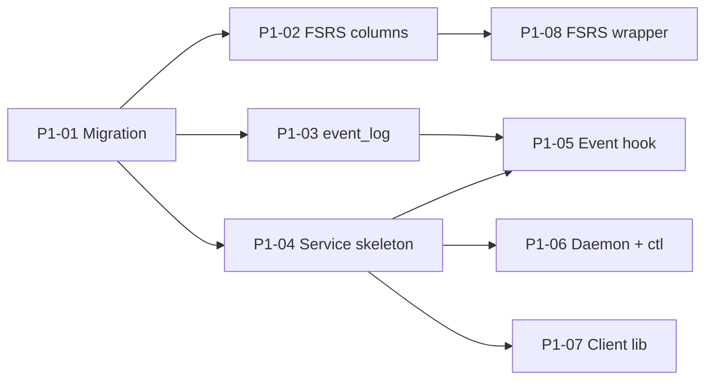

### Phase 2 -- Provenance (5 tasks)

Depends on Phase 1 (migration framework).

| ID | Task | Size | Dependencies | Files | Traces |
|----|------|------|-------------|-------|--------|
| P2-01 | Bi-temporal columns on memories | S | P1-01 | `schema.ts`, `migration.ts` | FR-103 |
| P2-02 | memory_history table + triggers | M | P2-01 | `schema.ts`, `migration.ts`, `fts.ts` | FR-104, FR-105 |
| P2-03 | Provenance module (setProvenance, invalidateEntry) | M | P2-02 | `provenance.ts` | FR-101, FR-102, FR-107 |
| P2-04 | Temporal query support in brain.ts | M | P2-01 | `queries.ts`, `brain.ts` | FR-106 |
| P2-05 | consolidate-memory.ts provenance integration | M | P2-03 | `consolidate-memory.ts` | FR-107 |

**Parallel tracks:** P2-01 first. P2-02 + P2-04 in parallel. P2-03 after P2-02. P2-05 after P2-03.

### Phase 3 -- Feedback Loop (5 tasks)

Depends on Phase 1 (FSRS columns, service skeleton).

| ID | Task | Size | Dependencies | Files | Traces |
|----|------|------|-------------|-------|--------|
| P3-01 | decision_feedback table | S | P1-01 | `schema.ts`, `migration.ts` | FR-301 |
| P3-02 | POST /api/feedback endpoint + handler | M | P1-04, P3-01 | `routes.ts`, `feedback.ts` | FR-301-303 |
| P3-03 | reflect.ts integration (POST feedback) | M | P3-02, P1-07 | `reflect.ts` | FR-301 |
| P3-04 | FSRS scoring on feedback (apply ratings) | M | P1-08, P3-02 | `feedback.ts`, `fsrs.ts` | FR-304, FR-305 |
| P3-05 | brain.ts search ranking with FSRS | M | P3-04 | `degradation.ts`, `brain.ts` | FR-306, FR-307 |

**Parallel:** P3-01 then P3-02. P3-03 + P3-04 in parallel after P3-02. P3-05 after P3-04.

**Phase 2 and Phase 3 can run in parallel** (different files, no overlap).

### Phase 4 -- Contradiction Detection (6 tasks)

Depends on Phase 2 (provenance for invalidation on resolution).

| ID | Task | Size | Dependencies | Files | Traces |
|----|------|------|-------------|-------|--------|
| P4-01 | contradictions table | S | P1-01 | `schema.ts`, `migration.ts` | FR-204 |
| P4-02 | Contradiction detection pipeline | L | P4-01 | `contradiction.ts` | FR-201, FR-202, FR-203, FR-209 |
| P4-03 | POST /api/contradict/check endpoint | M | P4-02, P1-04 | `routes.ts` | FR-201 |
| P4-04 | POST /api/contradict/resolve + GET /unresolved | M | P4-01, P2-03 | `routes.ts`, `provenance.ts` | FR-206, FR-207 |
| P4-05 | consolidate-memory.ts contradiction integration | M | P4-03 | `consolidate-memory.ts` | FR-201 |
| P4-06 | morning.ts contradiction display | S | P4-04 | `morning.ts` | FR-205 |

### Phase 5 -- Pattern Detection (7 tasks)

Depends on Phase 1 (event_log, service skeleton).

| ID | Task | Size | Dependencies | Files | Traces |
|----|------|------|-------------|-------|--------|
| P5-01 | pattern_log + vec_patterns tables | S | P1-01 | `schema.ts`, `migration.ts` | FR-404 |
| P5-02 | VMSP mining pipeline | L | P5-01, P1-03 | `mining.ts` | FR-403, FR-410 |
| P5-03 | mine-patterns.ts CLI + POST /api/patterns/mine | M | P5-02 | `mine-patterns.ts`, `routes.ts` | FR-409 |
| P5-04 | ONNX embedding of pattern descriptions | M | P5-02 | `mining.ts` | FR-405 |
| P5-05 | Prefix matching + pattern-matcher.ts | M | P5-01 | `pattern-matcher.ts` | FR-406 |
| P5-06 | context_predictions table + accuracy tracking | M | P5-05 | `schema.ts`, `migration.ts`, `pattern-matcher.ts` | FR-407 |
| P5-07 | GET /api/predict endpoint | M | P5-05, P5-06 | `routes.ts`, `context-streamer.ts` | FR-406, FR-506 |

**Parallel tracks:** P5-01 then P5-02 + P5-05 in parallel. P5-03 + P5-04 after P5-02. P5-06 after P5-05. P5-07 after P5-05 + P5-06.

**Phase 4 and Phase 5 can run in parallel** (different tables, different modules).

### Phase 6 -- Working Memory + Context Streamer (6 tasks)

Depends on Phase 5 (patterns for warming), Phase 1 (service).

| ID | Task | Size | Dependencies | Files | Traces |
|----|------|------|-------------|-------|--------|
| P6-01 | LRU cache implementation | M | None (in-process) | `working-memory.ts` | FR-601, FR-602 |
| P6-02 | Warming strategies | M | P6-01, P5-05 | `working-memory.ts` | FR-603 |
| P6-03 | Semantic caching | M | P6-01 | `working-memory.ts` | FR-604 |
| P6-04 | Context streamer + GET /api/working-memory | M | P6-01 | `context-streamer.ts`, `routes.ts` | FR-605, FR-506 |
| P6-05 | WebSocket pub/sub | M | P6-04 | `websocket.ts` | FR-503 |
| P6-06 | MCP Channel plugin + SessionStart hook | L | P6-04 | `channel.ts`, `shirozen-predict.ts`, `settings.json` | FR-504, FR-505, FR-509 |

### Critical Path

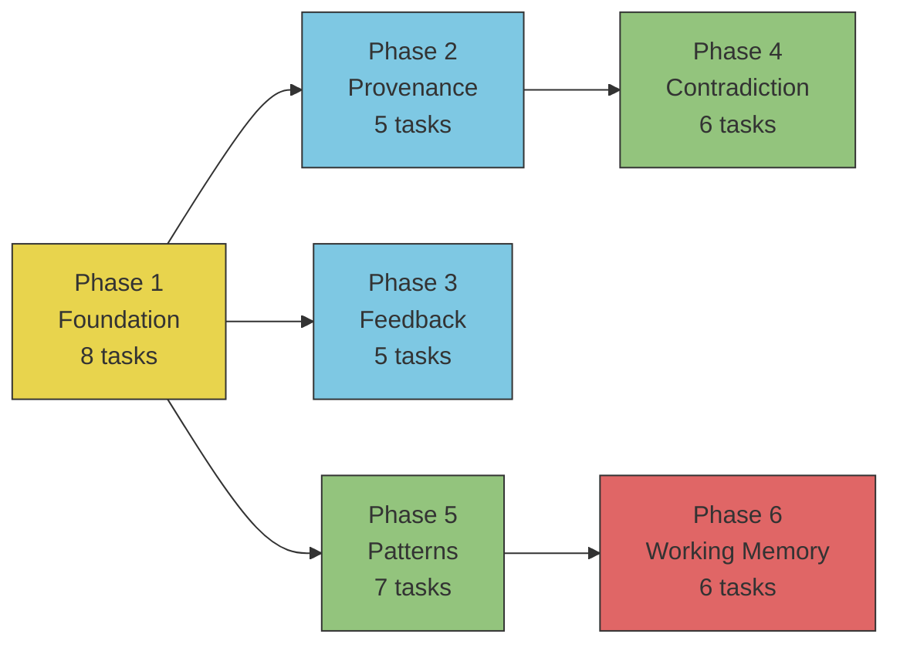

**Longest path:** P1 -> P2 -> P4 -> P6 (if sequential).
**Parallel optimization:** P2+P3 in parallel, P4+P5 in parallel. Reduces ~55 days to ~35 days.

### Complexity Summary

| Size | Count | Tasks |
|------|-------|-------|
| **S** (1-2 days) | 11 | P1-01, P1-02, P1-03, P1-05, P1-06, P1-07, P1-08, P2-01, P3-01, P4-01, P4-06, P5-01 |
| **M** (2-4 days) | 21 | P1-04, P2-02, P2-03, P2-04, P2-05, P3-02, P3-03, P3-04, P3-05, P4-03, P4-04, P4-05, P5-03, P5-04, P5-05, P5-06, P5-07, P6-01, P6-02, P6-03, P6-04, P6-05 |
| **L** (4-6 days) | 3 | P4-02, P5-02, P6-06 |

**New dependencies to install (Phase 1):** `ts-fsrs`, `@smartesting/vmsp`

---

## Appendix A: Requirement Traceability Matrix

| Requirement | Module | Architecture Section | Task |
|-------------|--------|---------------------|------|
| FR-101 | Provenance | 2.1, 3.1 | P2-03 |
| FR-102 | Provenance | 2.1, 3.1 | P2-03 |
| FR-103 | Provenance | 3.1, 3.2 | P2-01 |
| FR-104 | Provenance | 3.1, 3.2 | P2-02 |
| FR-105 | Provenance | 2.1 | P2-02 |
| FR-106 | Provenance | 2.1 | P2-04 |
| FR-107 | Provenance | 2.1 | P2-05 |
| FR-201 | Contradiction | 2.2, 4.1 | P4-02, P4-03, P4-05 |
| FR-202 | Contradiction | 2.2, 6.3 | P4-02 |
| FR-203 | Contradiction | 2.2 | P4-02 |
| FR-204 | Contradiction | 2.2, 3.1 | P4-01 |
| FR-205 | Contradiction | 2.2, 7.1 | P4-06 |
| FR-206 | Contradiction | 2.2, 4.1 | P4-04 |
| FR-207 | Contradiction | 2.1, 2.2 | P4-04 |
| FR-208 | Contradiction | 2.2 | P4-02 (batchScan) |
| FR-209 | Contradiction | 2.2, 6.3 | P4-02 |
| FR-301 | Feedback | 2.3, 4.1 | P3-01, P3-02, P3-03 |
| FR-302 | Feedback | 2.3 | P3-02 |
| FR-303 | Feedback | 2.3, 3.1 | P3-02 |
| FR-304 | Feedback | 2.3, 6.1 | P1-08, P3-04 |
| FR-305 | Feedback | 2.3, 6.1 | P1-02, P3-04 |
| FR-306 | Feedback | 6.1, 7.1 | P3-05 |
| FR-307 | Feedback | 2.3, 7.1 | P3-05 |
| FR-401 | Pattern | 2.4, 3.1 | P1-03 |
| FR-402 | Pattern | 2.4, 4.4 | P1-05 |
| FR-403 | Pattern | 2.4, 6.2 | P5-02 |
| FR-404 | Pattern | 2.4, 3.1 | P5-01 |
| FR-405 | Pattern | 2.4 | P5-04 |
| FR-406 | Pattern | 2.4, 6.5 | P5-05 |
| FR-407 | Pattern | 2.4 | P5-06 |
| FR-408 | Pattern | 2.4, 6.1 | P5-02 (FSRS on patterns) |
| FR-409 | Pattern | 2.4 | P5-03 |
| FR-410 | Pattern | 2.4, 6.2 | P5-02 |
| FR-501 | Streamer | 4.1, 5.1 | P1-04 |
| FR-502 | Streamer | 4.1 | P1-04 + all route tasks |
| FR-503 | Streamer | 4.2 | P6-05 |
| FR-504 | Streamer | 4.3 | P6-06 |
| FR-505 | Streamer | 4.3 | P6-06 |
| FR-506 | Streamer | 2.5, 4.4 | P5-07, P6-04 |
| FR-507 | Streamer | 4.4 | P6-06 (shirozen-compact.ts) |
| FR-508 | Streamer | 4.1, 5.3 | P1-04 |
| FR-509 | Streamer | 4.4 | P6-06 (auto-start in predict hook) |
| FR-601 | Working Memory | 2.6 | P6-01 |
| FR-602 | Working Memory | 2.6 | P6-01 |
| FR-603 | Working Memory | 2.6, 6.4 | P6-02 |
| FR-604 | Working Memory | 2.6 | P6-03 |
| FR-605 | Working Memory | 2.6, 4.1 | P6-04 |
| FR-606 | Working Memory | 2.6 | P6-01 |
| NFR-01 | All | 9.1 | All route handlers |
| NFR-02 | Working Memory | 9.1 | P6-01 |
| NFR-03 | brain.db | 9.1 | Existing |
| NFR-04 | Contradiction | 9.1, 6.3 | P4-02 |
| NFR-05 | Pattern | 9.1, 6.2 | P5-02 |
| NFR-06 | Service | 9.4 | P1-04 |
| NFR-07 | All | 6.1, 6.5 | All search paths |
| NFR-08 | Contradiction, Pattern | 6.3, 6.2 | P4-02, P5-04 |
| NFR-09 | Service | 5.2 | P1-06 |
| NFR-10 | Data | 3.2 | P1-01 |
| NFR-11 | Data | 3.4 | Existing (sqlite.ts) |
| NFR-12 | Data | 3.1 | P1-03, P5-01 |
| NFR-13 | All | 6.3, 2.4 | All embedding tasks |

## Appendix B: Open Questions from PRD -- Architectural Recommendations

| # | Question | Recommendation | Rationale |
|---|----------|---------------|-----------|
| OQ-1 | Auto-start on boot vs first session? | **Manual start** — user runs alongside other services. | No Task Scheduler. Same pattern as MCP server. First session starts cold; acceptable tradeoff. |
| OQ-2 | LLM cost for contradiction detection? | **Local Qwen3 4B via llama-server sidecar.** | Zero API cost. Managed by Shirozen engine via Bun.spawn(). ~3GB RAM for Q4_K_M quantization. `/think` mode for CoT reasoning, `/no_think` for fast pattern descriptions. |
| OQ-3 | Channel plugin default or opt-in? | **Default — always on.** | Every session gets Shirozen context automatically. The whole point is anticipation; opt-in defeats that. |
| OQ-4 | Minimum sessions for pattern mining? | **20 sessions.** | Research-backed threshold. Avoids noisy early patterns. Tunable later. |
| OQ-5 | Show resolved contradictions in search? | **Visible as decision branches.** | Not just audit trail — linked decision trees. Surface old vs new approach with reasoning. Enables cross-project intelligence: "Problem A had Approach 1 (abandoned because X) and Approach 2 (chosen because Y)." |
| OQ-6 | Working memory on project change? | **Relevance-based, no project partitioning.** | Knowledge is knowledge. Cross-project intelligence: if three projects solved auth differently, that's signal. Working memory ranks by relevance regardless of project origin. |
| OQ-7 | rawToolCalls vs event_log? | **Single `event_log` table, deprecate `rawToolCalls`.** | `event_log` is a superset (live telemetry with session_id, sequence_num, event_type). Backfill from `rawToolCalls` during Phase 1 migration, then deprecate. |
