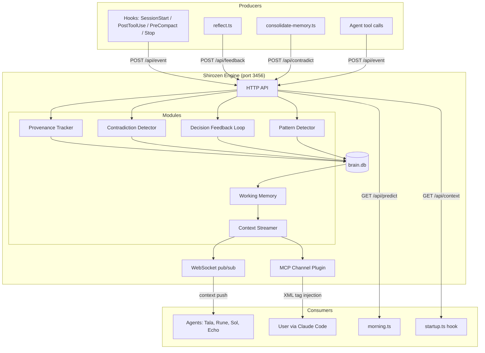
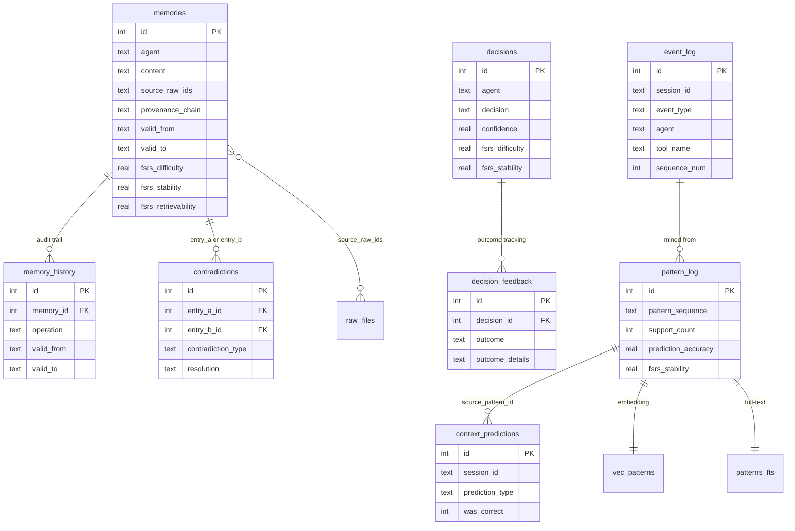
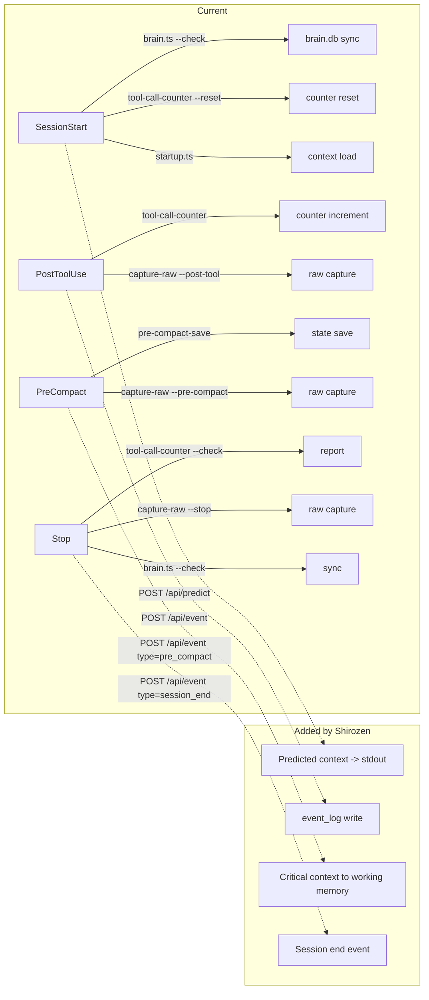
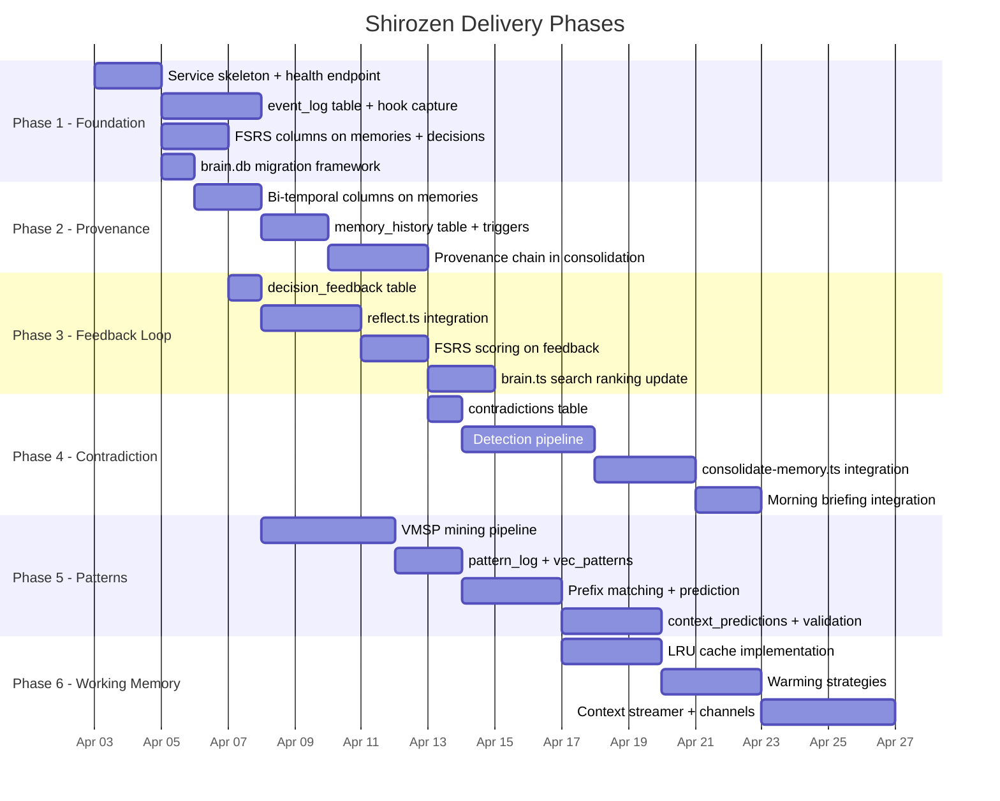

# Shirozen PRD — Cognitive Brain Engine

## 1. Overview

Shirozen is a persistent cognitive service that sits between brain.db and the agent layer. The current system is reactive: agents query brain.db when asked, reflect after workflows, and consolidate when inboxes fill. Knowledge exists but does not compound. Learnings drift during consolidation, decisions never close their feedback loop, and context loading is entirely manual.

Shirozen solves five specific problems:

| Problem | Symptom | Shirozen Response |
|---------|---------|-------------------|
| Memory drift | Consolidation rounds silently shift learnings; contradictions resolve by averaging | Provenance tracking + contradiction detection |
| No decision feedback | A decision that failed twice looks identical to one that succeeded twice | Outcome tracking updates FSRS confidence scores |
| Manual context loading | Agents wait to be asked; no anticipation of what is needed | Pattern detection + predictive context push |
| No pattern recognition | Recurring workflows exist in raw history but are not extracted | VMSP sequential mining from event_log |
| Cold session starts | Every session starts without context about recent trajectory | Working memory warm cache + session-start prediction |

Shirozen does not replace brain.db. It extends it with six new tables, adds FSRS columns to two existing tables, and exposes a Bun.serve() HTTP/WebSocket service on port 3456 that hooks, tools, and agents call. A local Qwen3 4B model via llama-server provides zero-cost reasoning for contradiction detection and pattern description — no external API dependency for core cognition.

### System-Level Data Flow



---

## 2. User Stories

### Agent Perspective

| ID     | As a...               | I want to...                                                        | So that...                                                               |
| ------ | --------------------- | ------------------------------------------------------------------- | ------------------------------------------------------------------------ |
| US-A01 | Agent (any)           | Receive predicted context at session start based on recent patterns | I do not start cold every time                                           |
| US-A02 | Agent (any)           | Know which knowledge entries have been validated vs. stale          | I prioritize reliable information over uncertain                         |
| US-A03 | reflect.ts            | Report decision outcomes back to brain.db                           | Past decisions gain or lose confidence based on real results             |
| US-A04 | consolidate-memory.ts | Be warned when a new entry contradicts an existing one              | I surface the conflict to the user instead of silently merging           |
| US-A05 | morning.ts            | Access predicted workflows and pre-loaded context for the briefing  | The morning briefing is trajectory-aware, not just a static inbox count  |
| US-A06 | Agent (any)           | Query working memory for recently-relevant knowledge                | Frequently-needed context is sub-millisecond, not a full brain.db search |

### User Perspective

| ID | As a... | I want to... | So that... |
|----|---------|-------------|------------|
| US-U01 | User | See contradictions surfaced in my morning briefing | I resolve conflicts explicitly instead of having the system silently guess |
| US-U02 | User | Have sessions pre-loaded with context based on my recent work trajectory | I do not repeat myself or wait for agents to "warm up" |
| US-U03 | User | See which decisions worked and which failed, with confidence scores | I can make informed choices about reusing past approaches |
| US-U04 | User | Know where every piece of knowledge came from (provenance) | I can verify claims and trace drift to its source |
| US-U05 | User | Have Shirozen running as a background service with simple start/stop controls | The system is always available without manual setup |

---

## 3. Functional Requirements

### Module 1: Provenance Tracker

| ID | Requirement | Priority |
|----|------------|----------|
| FR-101 | Every knowledge entry in `memories` tracks a `provenance_chain` field: an ordered list of transformation stages (raw -> inbox -> consolidation -> knowledge) | P0 |
| FR-102 | Every knowledge entry stores `source_raw_ids`: a JSON array of raw file timestamps that contributed to it | P0 |
| FR-103 | Bi-temporal columns on `memories`: `valid_from` (when fact became true), `valid_to` (when invalidated, NULL if current), `recorded_at` (when we learned it), `superseded_by` (ID of replacing entry) | P0 |
| FR-104 | `memory_history` table records every update/invalidation via SQLite triggers (audit trail) | P0 |
| FR-105 | Knowledge entries are never deleted. Invalidation sets `valid_to` and optionally `superseded_by` | P0 |
| FR-106 | Query support: "What was true on date X?" and "What did we know on date X?" via temporal filters | P1 |
| FR-107 | `consolidate-memory.ts` populates `provenance_chain` and `source_raw_ids` during consolidation | P0 |

### Module 2: Contradiction Detector

| ID | Requirement | Priority |
|----|------------|----------|
| FR-201 | During consolidation, before merging inbox entries into knowledge, run contradiction detection | P0 |
| FR-202 | Contradiction detection pipeline: embed new entry -> retrieve top-5 similar (cosine < 0.3 distance) -> local LLM check (Qwen3 4B via llama-server) via chain-of-thought prompt | P0 |
| FR-203 | Three contradiction types detected: value conflict, temporal conflict, logical conflict | P0 |
| FR-204 | Detected contradictions are logged to `contradictions` table, not silently merged | P0 |
| FR-205 | Unresolved contradictions surfaced in morning briefing with both entries, type, confidence, and resolution hint | P1 |
| FR-206 | User resolution: mark contradiction as resolved with winner, reason, and resolver (user/auto/decay) | P1 |
| FR-207 | Resolution triggers: invalidate losing entry (set `valid_to`), update `superseded_by`, record in `memory_history` | P1 |
| FR-208 | Periodic background scan: batch-compare knowledge entries within same topic clusters (weekly or on-demand) | P2 |
| FR-209 | Embedding pre-filter: only entries with embedding distance < 0.3 (same topic) are sent to local LLM for contradiction check | P0 |

### Module 3: Decision Feedback Loop

| ID | Requirement | Priority |
|----|------------|----------|
| FR-301 | `reflect.ts` logs decision outcomes to `decision_feedback` table after every workflow | P0 |
| FR-302 | Outcomes are one of: `success`, `failure`, `partial`, `abandoned` | P0 |
| FR-303 | Each feedback entry links to the original `decisions.id` and includes `outcome_details` and `session_raw_id` | P0 |
| FR-304 | On feedback write, compute FSRS rating: success -> `Rating.Good`, failure -> `Rating.Again`, partial -> `Rating.Hard`, abandoned -> `Rating.Again` | P0 |
| FR-305 | Update `decisions` table FSRS columns (`fsrs_difficulty`, `fsrs_stability`) using `ts-fsrs` after each feedback | P0 |
| FR-306 | `brain.ts --search` factors FSRS retrievability into ranking scores: `final_score = base_score * retrievability` | P1 |
| FR-307 | Decisions with 2+ failure feedbacks are flagged with a warning in search results | P1 |

### Module 4: Pattern Detector

| ID | Requirement | Priority |
|----|------------|----------|
| FR-401 | `event_log` table captures every tool call, workflow start/end, agent dispatch, and search query | P0 |
| FR-402 | Event capture extends existing `tool-call-counter.ts` hook (PostToolUse) to also write to `event_log` | P0 |
| FR-403 | Run VMSP mining (`@smartesting/vmsp`) on session event sequences to extract maximal workflow patterns | P0 |
| FR-404 | Store patterns in `pattern_log` with support count, confidence, first/last seen, and prediction accuracy | P0 |
| FR-405 | Embed workflow patterns as natural language descriptions using ONNX 384-dim model; store in `vec_patterns` | P1 |
| FR-406 | At session start, match current event prefix against known patterns via prefix matching | P1 |
| FR-407 | Prediction accuracy tracked: when a predicted pattern completes, record hit; when it diverges, record miss | P1 |
| FR-408 | Patterns not seen in 30+ days decay via FSRS (`fsrs_stability`, `fsrs_retrievability` on `pattern_log`) | P2 |
| FR-409 | VMSP mining runs as a scheduled background job (daily) or on-demand via CLI | P1 |
| FR-410 | VMSP configuration: `patternType: 'maximal'`, `maxGap: 3`, `minimumPatternLength: 2`, `maximumPatternLength: 10`, `minSupport: 0.3` | P0 |

### Module 5: Context Streamer

| ID | Requirement | Priority |
|----|------------|----------|
| FR-501 | `Bun.serve()` HTTP + WebSocket dual-protocol server on port 3456 | P0 |
| FR-502 | HTTP API: REST endpoints for query, predict, event logging, feedback, health, patterns, working memory | P0 |
| FR-503 | WebSocket: persistent connections with pub/sub on `context-updates` topic | P1 |
| FR-504 | MCP Channel Plugin: push `notifications/claude/channel` with `<channel source="shirozen">` XML tags into active Claude Code sessions | P1 |
| FR-505 | Four channel notification types: `predicted_context`, `contradiction_alert`, `pattern_match`, `decision_feedback` | P1 |
| FR-506 | SessionStart hook queries Shirozen for predicted context and outputs it into session startup | P0 |
| FR-507 | PreCompact hook sends critical context to Shirozen for preservation in working memory | P1 |
| FR-508 | Health endpoint: `GET /api/health` returns `{ ok, uptime, patterns, working_memory, event_count }` | P0 |
| FR-509 | Auto-start: if Shirozen is not running when a hook calls it, the hook starts it before retrying | P1 |

### Module 6: Working Memory

| ID | Requirement | Priority |
|----|------------|----------|
| FR-601 | In-memory LRU cache within Shirozen service, max 100 entries, 4-hour TTL | P0 |
| FR-602 | Entries promoted from brain.db to working memory on access | P0 |
| FR-603 | Five warming strategies: session start (predicted workflow), topic detection (first prompt), work streak (3+ sessions same topic), tool usage (related decisions), time-based (morning -> task review) | P1 |
| FR-604 | Semantic caching: cache query-response pairs from brain.db; return cached for queries with embedding similarity > 0.9 | P2 |
| FR-605 | `GET /api/working-memory` returns current cache state with entry count, oldest entry, and topic summary | P1 |
| FR-606 | Entries below FSRS retrievability threshold (< 0.5) are not promoted to working memory | P1 |

---

## 4. Non-Functional Requirements

| ID | Requirement | Target | Priority |
|----|------------|--------|----------|
| NFR-01 | HTTP API response latency (non-LLM paths) | < 50ms p95 | P0 |
| NFR-02 | Working memory lookup latency | < 5ms | P0 |
| NFR-03 | brain.db query latency (FTS5 + vector KNN) | < 200ms p95 | P0 |
| NFR-04 | Contradiction detection latency (per entry, including local LLM call) | < 5s | P1 |
| NFR-05 | VMSP mining latency (100 sessions) | < 10s | P1 |
| NFR-06 | Service memory footprint (Shirozen process only, excludes llama-server) | < 150MB RSS | P1 |
| NFR-06a | Local LLM memory footprint (llama-server + Qwen3 4B Q4_K_M) | < 3.5GB RSS | P1 |
| NFR-07 | No LLM calls during retrieval or search paths | Strict | P0 |
| NFR-08 | LLM calls (local Qwen3 4B only) during: contradiction detection, pattern description generation, resolution reasoning | Strict | P0 |
| NFR-08a | No external API calls (Gemini, etc.) for core cognitive operations | Strict | P0 |
| NFR-09 | Service availability: native Bun daemon with PID file management (same pattern as MCP server) | 99.9% uptime during work hours | P1 |
| NFR-10 | brain.db backward compatibility: existing queries continue to work without Shirozen running | Strict | P0 |
| NFR-11 | WAL mode on brain.db for concurrent read access from service + CLI | Required | P0 |
| NFR-12 | All new tables must have FTS5 virtual tables where content is searchable | Required | P0 |
| NFR-13 | All embeddings use the existing ONNX pipeline (all-MiniLM-L6-v2, 384-dim) | Required | P0 |

---

## 5. Data Model

### 5.1 New Tables

#### event_log

Tool call event sourcing. Primary input for pattern mining.

```sql
CREATE TABLE event_log (
  id INTEGER PRIMARY KEY AUTOINCREMENT,
  session_id TEXT NOT NULL,
  timestamp TEXT NOT NULL,                -- ISO 8601
  event_type TEXT NOT NULL,               -- tool_call | user_prompt | workflow_start | workflow_end | agent_dispatch | search_query | decision_made | context_push | prediction_hit
  agent TEXT,                             -- tala | rune | sol | echo | mccall | wick | freddie
  tool_name TEXT,                         -- brain.ts | discover.ts | validate-prompt | etc.
  action TEXT,                            -- specific action within tool (e.g. --search, --sync)
  context_topic TEXT,                     -- detected topic/workflow slug
  metadata TEXT,                          -- JSON: additional event data
  sequence_num INTEGER NOT NULL           -- ordering within session
);

CREATE INDEX idx_event_session ON event_log(session_id);
CREATE INDEX idx_event_type ON event_log(event_type);
CREATE INDEX idx_event_agent ON event_log(agent);
CREATE INDEX idx_event_timestamp ON event_log(timestamp);
CREATE INDEX idx_event_tool ON event_log(tool_name);
```

#### pattern_log

Workflow fingerprints mined from event_log via VMSP.

```sql
CREATE TABLE pattern_log (
  id INTEGER PRIMARY KEY AUTOINCREMENT,
  pattern_sequence TEXT NOT NULL,         -- JSON array: ["discover", "query-brain", "build-style", "validate"]
  pattern_description TEXT,               -- Natural language: "Track creation workflow: discover -> query -> build -> validate"
  support_count INTEGER DEFAULT 1,        -- number of sessions containing this pattern
  confidence REAL DEFAULT 0.5,
  first_seen TEXT NOT NULL,               -- ISO 8601
  last_seen TEXT NOT NULL,                -- ISO 8601
  avg_duration_ms INTEGER,                -- average time from first to last event in pattern
  prediction_accuracy REAL,               -- 0.0-1.0, updated on prediction validation
  predictions_made INTEGER DEFAULT 0,
  predictions_hit INTEGER DEFAULT 0,
  fsrs_difficulty REAL DEFAULT 0.3,
  fsrs_stability REAL DEFAULT 1.0,
  fsrs_retrievability REAL DEFAULT 1.0,
  fsrs_last_review TEXT,
  fsrs_reps INTEGER DEFAULT 0,
  fsrs_lapses INTEGER DEFAULT 0,
  created_at TEXT NOT NULL,
  updated_at TEXT NOT NULL
);

CREATE VIRTUAL TABLE patterns_fts USING fts5(
  pattern_description,
  content=pattern_log,
  content_rowid=id
);

CREATE VIRTUAL TABLE vec_patterns USING vec0(
  embedding float[384]
);
```

#### decision_feedback

Outcome tracking that closes the decision loop.

```sql
CREATE TABLE decision_feedback (
  id INTEGER PRIMARY KEY AUTOINCREMENT,
  decision_id INTEGER NOT NULL REFERENCES decisions(id),
  outcome TEXT NOT NULL,                  -- success | failure | partial | abandoned
  outcome_details TEXT,                   -- free-text: what happened
  confidence_delta REAL,                  -- computed: how much confidence changed
  session_raw_id TEXT,                    -- raw file timestamp for provenance
  recorded_at TEXT NOT NULL               -- ISO 8601
);

CREATE INDEX idx_feedback_decision ON decision_feedback(decision_id);
CREATE INDEX idx_feedback_outcome ON decision_feedback(outcome);
```

#### context_predictions

Tracks prediction accuracy for self-improvement.

```sql
CREATE TABLE context_predictions (
  id INTEGER PRIMARY KEY AUTOINCREMENT,
  session_id TEXT NOT NULL,
  predicted_at TEXT NOT NULL,             -- ISO 8601
  prediction_type TEXT NOT NULL,          -- workflow | topic | agent | tool
  predicted_value TEXT NOT NULL,          -- what was predicted (pattern ID or value)
  confidence REAL DEFAULT 0.5,
  source_pattern_id INTEGER,             -- FK to pattern_log.id (nullable for non-pattern predictions)
  was_correct INTEGER,                   -- NULL until validated, 0 or 1
  validated_at TEXT,
  validation_notes TEXT
);

CREATE INDEX idx_predictions_session ON context_predictions(session_id);
CREATE INDEX idx_predictions_correct ON context_predictions(was_correct);
```

#### contradictions

Flagged knowledge conflicts.

```sql
CREATE TABLE contradictions (
  id INTEGER PRIMARY KEY AUTOINCREMENT,
  entry_a_id INTEGER NOT NULL,            -- FK to memories.id (existing entry)
  entry_a_store TEXT NOT NULL DEFAULT 'memories',  -- which table: memories | decisions
  entry_b_id INTEGER NOT NULL,            -- FK to memories.id (new entry)
  entry_b_store TEXT NOT NULL DEFAULT 'memories',
  contradiction_type TEXT NOT NULL,       -- value | temporal | logical
  description TEXT NOT NULL,              -- LLM-generated explanation
  confidence REAL NOT NULL,               -- 0.0-1.0 from detection
  resolution_hint TEXT,                   -- LLM suggestion for which entry is likely correct
  detected_at TEXT NOT NULL,              -- ISO 8601
  resolved_at TEXT,
  resolution TEXT,                        -- free-text: which entry won and why
  resolved_by TEXT                        -- user | auto | decay
);

CREATE INDEX idx_contradictions_unresolved ON contradictions(resolved_at) WHERE resolved_at IS NULL;
CREATE INDEX idx_contradictions_type ON contradictions(contradiction_type);
```

#### memory_history

Bi-temporal audit trail for all knowledge mutations.

```sql
CREATE TABLE memory_history (
  id INTEGER PRIMARY KEY AUTOINCREMENT,
  memory_id INTEGER NOT NULL,             -- FK to memories.id
  content TEXT NOT NULL,                  -- snapshot of content at time of change
  valid_from TEXT NOT NULL,
  valid_to TEXT,
  recorded_at TEXT NOT NULL,              -- ISO 8601
  operation TEXT NOT NULL                 -- insert | update | invalidate
);

CREATE INDEX idx_history_memory ON memory_history(memory_id);
CREATE INDEX idx_history_operation ON memory_history(operation);
```

### 5.2 Columns Added to Existing Tables

#### memories (existing)

```sql
-- Provenance
ALTER TABLE memories ADD COLUMN source_raw_ids TEXT;        -- JSON array of raw file timestamps
ALTER TABLE memories ADD COLUMN provenance_chain TEXT;       -- JSON array: ["raw", "inbox", "consolidation", "knowledge"]

-- Bi-temporal
ALTER TABLE memories ADD COLUMN valid_from TEXT;             -- when fact became true
ALTER TABLE memories ADD COLUMN valid_to TEXT;               -- when invalidated (NULL = still valid)
ALTER TABLE memories ADD COLUMN recorded_at TEXT;            -- when we learned it
ALTER TABLE memories ADD COLUMN superseded_by INTEGER;       -- FK to memories.id of replacement

-- FSRS
ALTER TABLE memories ADD COLUMN fsrs_difficulty REAL DEFAULT 0.3;
ALTER TABLE memories ADD COLUMN fsrs_stability REAL DEFAULT 1.0;
ALTER TABLE memories ADD COLUMN fsrs_retrievability REAL DEFAULT 1.0;
ALTER TABLE memories ADD COLUMN fsrs_last_review TEXT;
ALTER TABLE memories ADD COLUMN fsrs_reps INTEGER DEFAULT 0;
ALTER TABLE memories ADD COLUMN fsrs_lapses INTEGER DEFAULT 0;
```

#### decisions (existing)

```sql
-- FSRS
ALTER TABLE decisions ADD COLUMN fsrs_difficulty REAL DEFAULT 0.3;
ALTER TABLE decisions ADD COLUMN fsrs_stability REAL DEFAULT 1.0;
```

### 5.3 SQLite Triggers

```sql
-- Auto-record history on memory update
CREATE TRIGGER memory_update_history
AFTER UPDATE ON memories
BEGIN
  INSERT INTO memory_history (memory_id, content, valid_from, valid_to, recorded_at, operation)
  VALUES (OLD.id, OLD.content, OLD.valid_from, OLD.valid_to, datetime('now'), 'update');
END;

-- Auto-record history on invalidation
CREATE TRIGGER memory_invalidate_history
AFTER UPDATE OF valid_to ON memories
WHEN NEW.valid_to IS NOT NULL AND OLD.valid_to IS NULL
BEGIN
  INSERT INTO memory_history (memory_id, content, valid_from, valid_to, recorded_at, operation)
  VALUES (OLD.id, OLD.content, OLD.valid_from, NEW.valid_to, datetime('now'), 'invalidate');
END;
```

### 5.4 Entity Relationship Diagram



---

## 6. API Design

### 6.1 HTTP Endpoints

Base URL: `http://localhost:3456`

#### Health & Status

```
GET /api/health
Response: {
  ok: boolean,
  uptime: number,          // seconds
  stats: {
    patterns: number,      // active patterns in pattern_log
    working_memory: number, // entries in warm cache
    events_today: number,  // event_log count for today
    unresolved_contradictions: number,
    predictions_accuracy: number  // rolling 7-day hit rate
  }
}
```

#### Event Logging

```
POST /api/event
Body: {
  session_id: string,
  event_type: "tool_call" | "user_prompt" | "workflow_start" | "workflow_end" | "agent_dispatch" | "search_query",
  agent?: string,
  tool_name?: string,
  action?: string,
  context_topic?: string,
  metadata?: Record<string, unknown>
}
Response: { id: number, sequence_num: number }
```

#### Decision Feedback

```
POST /api/feedback
Body: {
  decision_id: number,
  outcome: "success" | "failure" | "partial" | "abandoned",
  outcome_details?: string,
  session_raw_id?: string
}
Response: {
  id: number,
  confidence_delta: number,   // change in FSRS confidence
  new_stability: number,
  new_difficulty: number
}
```

#### Context Prediction

```
GET /api/predict?session_id={id}
Response: {
  predicted_workflow?: {
    pattern_id: number,
    pattern_sequence: string[],
    confidence: number,
    suggested_context: string[]   // knowledge entry IDs to pre-load
  },
  predicted_topics: string[],
  warm_context: Array<{
    id: number,
    content: string,
    source: "working_memory" | "pattern" | "recent",
    relevance: number
  }>
}
```

#### Contradiction Management

```
POST /api/contradict/check
Body: {
  entry_id: number,
  entry_store: "memories" | "decisions",
  content: string
}
Response: {
  contradictions: Array<{
    existing_id: number,
    type: "value" | "temporal" | "logical",
    confidence: number,
    description: string,
    resolution_hint: string
  }>
}

POST /api/contradict/resolve
Body: {
  contradiction_id: number,
  winner_id: number,        // which entry wins
  reason: string,
  resolved_by: "user" | "auto" | "decay"
}
Response: { ok: boolean }

GET /api/contradict/unresolved
Response: {
  contradictions: Array<{
    id: number,
    entry_a: { id: number, content: string, created_at: string },
    entry_b: { id: number, content: string, created_at: string },
    type: string,
    confidence: number,
    detected_at: string,
    resolution_hint: string
  }>
}
```

#### Pattern Management

```
GET /api/patterns?limit={n}&min_support={n}
Response: {
  patterns: Array<{
    id: number,
    sequence: string[],
    description: string,
    support_count: number,
    confidence: number,
    prediction_accuracy: number,
    last_seen: string
  }>
}

POST /api/patterns/mine
Body: {
  min_support?: number,    // default 0.3
  max_gap?: number,        // default 3
  since?: string           // ISO date, mine sessions since this date
}
Response: {
  patterns_found: number,
  new_patterns: number,
  updated_patterns: number
}
```

#### Working Memory

```
GET /api/working-memory
Response: {
  entries: number,
  max_entries: number,
  ttl_hours: number,
  oldest_entry: string,     // ISO timestamp
  topics: string[],         // unique topics in cache
  items: Array<{
    key: string,
    content_preview: string,
    source: string,          // brain.db table
    promoted_at: string,
    access_count: number,
    fsrs_retrievability: number
  }>
}
```

### 6.2 WebSocket Messages

Connection: `ws://localhost:3456/ws?session_id={id}`

#### Client -> Server

```typescript
// Register session for context push
{ type: "register", session_id: string, agent?: string }

// Report event (alternative to HTTP POST /api/event)
{ type: "event", session_id: string, event_type: string, tool_name?: string, agent?: string }

// Request current predictions
{ type: "predict", session_id: string }

// Validate a prediction (hit/miss)
{ type: "validate_prediction", prediction_id: number, was_correct: boolean }
```

#### Server -> Client

```typescript
// Predicted context push
{ type: "context_push", payload: {
  reason: "session_start" | "pattern_match" | "topic_detected" | "pre_compact",
  context: Array<{ id: number, content: string, relevance: number }>,
  pattern?: { id: number, sequence: string[], confidence: number }
}}

// Contradiction alert
{ type: "contradiction_alert", payload: {
  id: number,
  entry_a_preview: string,
  entry_b_preview: string,
  type: "value" | "temporal" | "logical",
  confidence: number
}}

// Decision feedback confirmation
{ type: "feedback_applied", payload: {
  decision_id: number,
  new_confidence: number,
  outcome: string
}}
```

### 6.3 MCP Channel Notifications

Channel plugin declares capability `claude/channel`. Notifications injected as XML tags.

```typescript
// Predicted context
server.notification({
  method: "notifications/claude/channel",
  params: {
    content: "Based on recent patterns, this looks like a create-track session. Pre-loaded: Style formula constraints (v5.5), bracket format rules, recent Suno decisions.",
    meta: {
      source: "shirozen",
      type: "predicted_context",
      confidence: "0.85",
      pattern_id: "42"
    }
  }
});

// Contradiction alert
server.notification({
  method: "notifications/claude/channel",
  params: {
    content: "Contradiction detected: 'Suno v5.5 handles pipe syntax differently' vs 'Pipe syntax unchanged since v5.0'. Type: temporal. The newer entry (Apr 1) is likely correct.",
    meta: {
      source: "shirozen",
      type: "contradiction_alert",
      confidence: "0.85",
      related_entries: "42,67"
    }
  }
});
```

---

## 7. Integration Points

### 7.1 Hook Modifications



| Hook | Current Behavior | Shirozen Addition |
|------|-----------------|-------------------|
| **SessionStart** | Reset counter, sync brain.db, load context | Query Shirozen for predicted context; auto-start service if not running |
| **PostToolUse** | Increment counter, capture raw | Write to `event_log` via `POST /api/event` |
| **PreCompact** | Save state, capture raw | Send critical context to Shirozen working memory via `POST /api/event` (type: `pre_compact`) |
| **Stop** | Report count, capture raw, sync | Write session_end event; trigger pattern extraction if session had 10+ events |

### 7.2 Tool Modifications

| Tool | Current | Shirozen Change |
|------|---------|-----------------|
| **reflect.ts** | Logs decisions to brain.db, writes inbox files | Also calls `POST /api/feedback` with outcome for each relevant decision |
| **consolidate-memory.ts** | Merges inbox into knowledge via LLM | Before merge: calls `POST /api/contradict/check` for each new entry (local Qwen3 4B); halts merge and logs contradiction if detected |
| **morning.ts** | Static: tasks, inbox counts, suggestions | Adds: predicted workflow from `GET /api/predict`, unresolved contradictions from `GET /api/contradict/unresolved`, decision feedback summary |
| **brain.ts** | FTS5 + vector search with staleness penalties | Search results additionally weighted by FSRS retrievability (`final_score = base_score * fsrs_retrievability`) |

### 7.3 New CLI Tools

| Tool | Path | Purpose |
|------|------|---------|
| `shirozen/index.ts` | `src/services/shirozen/index.ts` | Main service entry point (Bun.serve) — manages llama-server sidecar |
| `shirozen/client.ts` | `src/libs/shirozen/client.ts` | HTTP client library for tools/hooks to call Shirozen |
| `shirozen/llm.ts` | `src/libs/shirozen/llm.ts` | Local LLM client — calls llama-server OpenAI-compatible API with `/think` and `/no_think` mode support |
| `shirozen/channel.ts` | `src/services/shirozen/channel.ts` | MCP Channel plugin for Claude Code context push |
| `mine-patterns.ts` | `src/tools/mine-patterns.ts` | CLI: run VMSP on event_log, update pattern_log |
| `shirozen-ctl.ts` | `src/tools/shirozen-ctl.ts` | CLI: start/stop/status/health for the service + llama-server sidecar |

### 7.4 Hook-to-Tool Event Capture

The PostToolUse hook is the primary event capture mechanism. It must write to event_log without blocking the main session. The approach:

1. Hook script reads `$CLAUDE_TOOL_NAME`, `$CLAUDE_SESSION_ID` from environment
2. Fire-and-forget HTTP POST to Shirozen service
3. If Shirozen is down, silently skip (event capture is best-effort, not blocking)

```typescript
// .claude/hooks/shirozen-event.ts (new hook, added to PostToolUse)
const response = await fetch("http://localhost:3456/api/event", {
  method: "POST",
  headers: { "Content-Type": "application/json" },
  body: JSON.stringify({
    session_id: process.env.CLAUDE_SESSION_ID,
    event_type: "tool_call",
    tool_name: process.env.CLAUDE_TOOL_NAME,
    agent: process.env.CLAUDE_AGENT ?? "freddie",
  }),
  signal: AbortSignal.timeout(1000), // 1s timeout, don't block session
}).catch(() => null); // silently skip if service is down
```

---

## 8. Incremental Delivery Plan

Modules are ordered by dependency. Each module is independently useful -- later modules enhance earlier ones but do not gate them.



### Phase Dependencies

| Phase | Depends On | Can Ship Independently |
|-------|-----------|----------------------|
| **1: Foundation** | Nothing | Yes -- service skeleton, event capture, FSRS columns |
| **2: Provenance** | Phase 1 (migration framework) | Yes -- bi-temporal + audit trail works without other modules |
| **3: Feedback Loop** | Phase 1 (FSRS columns) | Yes -- decision outcomes tracked independently |
| **4: Contradiction** | Phase 2 (provenance, bi-temporal for invalidation) | Yes -- detection and surfacing work standalone |
| **5: Patterns** | Phase 1 (event_log, service) | Yes -- mining and prediction work without other modules |
| **6: Working Memory** | Phase 5 (patterns for warming), Phase 1 (service) | Partially -- cache works alone, warming needs patterns |

### Phase Details

**Phase 1 -- Foundation (10 days)**
- Bun.serve() skeleton with HTTP + WebSocket on port 3456
- `GET /api/health` endpoint
- `event_log` table with Drizzle schema
- PostToolUse hook extension for event capture
- FSRS columns on `memories` and `decisions` tables
- SQLite migration framework (versioned schema changes)
- Daemon bun scripts: `shirozen:start`, `shirozen:stop`, `shirozen:status` (native Bun daemon, same pattern as MCP server)
- `shirozen-ctl.ts` CLI tool
- llama-server sidecar management: Bun.spawn() on engine startup, health-check `/health`, graceful shutdown
- `llm.ts` client library: OpenAI-compatible fetch wrapper with `/think` and `/no_think` mode support for Qwen3 4B

**Phase 2 -- Provenance (7 days)**
- Bi-temporal columns on `memories`
- `memory_history` table + triggers
- `consolidate-memory.ts` updated to populate `provenance_chain` and `source_raw_ids`
- Temporal query support in `brain.ts`

**Phase 3 -- Feedback Loop (8 days)**
- `decision_feedback` table
- `POST /api/feedback` endpoint
- `reflect.ts` updated to call feedback endpoint after workflow
- `ts-fsrs` integration: compute ratings, update FSRS columns
- `brain.ts --search` factors retrievability into ranking

**Phase 4 -- Contradiction Detection (10 days)**
- `contradictions` table
- Contradiction detection pipeline (embed -> top-5 similar -> local Qwen3 4B CoT check via `/think` mode)
- `POST /api/contradict/check` and `POST /api/contradict/resolve` endpoints
- `consolidate-memory.ts` integration: check before merge
- `morning.ts` integration: show unresolved contradictions
- Resolution flow: invalidate loser, update `superseded_by`, record history

**Phase 5 -- Pattern Detection (12 days)**
- `@smartesting/vmsp` integration
- `mine-patterns.ts` CLI tool
- `pattern_log` + `vec_patterns` tables
- ONNX embedding of pattern descriptions
- Prefix matching at session start
- `context_predictions` table with accuracy tracking
- `POST /api/patterns/mine` and `GET /api/patterns` endpoints

**Phase 6 -- Working Memory + Context Streamer (10 days)**
- In-memory LRU cache with TTL
- Brain.db promotion on access
- Five warming strategies
- WebSocket pub/sub for context push
- MCP Channel plugin
- `GET /api/predict` endpoint for session-start context
- SessionStart hook integration

**Total estimated effort: 57 days** (single developer, sequential). Parallelization across Phases 2+3 and Phases 4+5 could reduce to ~37 days with two developers.

---

## 9. Success Metrics

| Metric | Target | Measurement Method | Phase |
|--------|--------|-------------------|-------|
| **Provenance coverage** | 100% of new knowledge entries have `source_raw_ids` | Query: `SELECT COUNT(*) FROM memories WHERE source_raw_ids IS NULL AND created_at > launch_date` | 2 |
| **Contradiction detection rate** | > 80% of real contradictions caught (F1 > 0.80) | Manual review of 20 known contradiction pairs | 4 |
| **Decision feedback coverage** | > 90% of decisions get outcome feedback within 7 days | Query: `SELECT COUNT(DISTINCT d.id) FROM decisions d LEFT JOIN decision_feedback df ON d.id = df.decision_id WHERE df.id IS NULL AND d.created_at > launch_date` | 3 |
| **FSRS adoption** | 100% of memories and decisions have FSRS scores after 30 days | Query on non-null FSRS columns | 3 |
| **Pattern accuracy** | > 60% prediction hit rate after 30 days of data | `context_predictions` table: `SUM(was_correct) / COUNT(*)` | 5 |
| **Context prediction latency** | < 200ms for `GET /api/predict` | Instrumented timing in client library | 5 |
| **Working memory hit rate** | > 40% of brain.db queries served from warm cache | Cache hit counter vs total queries | 6 |
| **Session start time** | < 500ms added by Shirozen hooks | Instrumented timing in SessionStart hook | 1 |
| **Service uptime** | > 99.9% during work hours (18:00-04:00 Manila) | Health endpoint monitoring + PID file checks | 1 |
| **Memory drift reduction** | Zero silent contradictions in knowledge files | Monthly audit: compare knowledge files against raw sources | 2+4 |
| **Search quality improvement** | Subjective: user reports better context loading in first 3 prompts of session | User feedback after 2 weeks of Phase 6 | 6 |

---

## 10. TypeScript Type Definitions

Core types for Shirozen's public interfaces. These define the contract between the service and its consumers.

```typescript
// ── FSRS Types ──────────────────────────────────────────────────

interface FSRSState {
  fsrs_difficulty: number;   // 0.0-1.0
  fsrs_stability: number;    // days until retrievability drops to 0.9
  fsrs_retrievability: number; // 0.0-1.0, current probability of accurate recall
  fsrs_last_review: string | null; // ISO 8601
  fsrs_reps: number;
  fsrs_lapses: number;
}

// ── Event Types ─────────────────────────────────────────────────

type EventType =
  | "tool_call"
  | "user_prompt"
  | "workflow_start"
  | "workflow_end"
  | "agent_dispatch"
  | "search_query"
  | "decision_made"
  | "context_push"
  | "prediction_hit";

interface EventLogEntry {
  id: number;
  session_id: string;
  timestamp: string;
  event_type: EventType;
  agent?: string;
  tool_name?: string;
  action?: string;
  context_topic?: string;
  metadata?: Record<string, unknown>;
  sequence_num: number;
}

// ── Pattern Types ───────────────────────────────────────────────

interface PatternLogEntry {
  id: number;
  pattern_sequence: string[];    // event type sequence
  pattern_description: string;
  support_count: number;
  confidence: number;
  first_seen: string;
  last_seen: string;
  avg_duration_ms?: number;
  prediction_accuracy?: number;
  predictions_made: number;
  predictions_hit: number;
  fsrs: FSRSState;
}

// ── Feedback Types ──────────────────────────────────────────────

type Outcome = "success" | "failure" | "partial" | "abandoned";

interface DecisionFeedback {
  id: number;
  decision_id: number;
  outcome: Outcome;
  outcome_details?: string;
  confidence_delta: number;
  session_raw_id?: string;
  recorded_at: string;
}

// ── Contradiction Types ─────────────────────────────────────────

type ContradictionType = "value" | "temporal" | "logical";

interface Contradiction {
  id: number;
  entry_a_id: number;
  entry_a_store: "memories" | "decisions";
  entry_b_id: number;
  entry_b_store: "memories" | "decisions";
  contradiction_type: ContradictionType;
  description: string;
  confidence: number;
  resolution_hint?: string;
  detected_at: string;
  resolved_at?: string;
  resolution?: string;
  resolved_by?: "user" | "auto" | "decay";
}

// ── Prediction Types ────────────────────────────────────────────

interface ContextPrediction {
  id: number;
  session_id: string;
  predicted_at: string;
  prediction_type: "workflow" | "topic" | "agent" | "tool";
  predicted_value: string;
  confidence: number;
  source_pattern_id?: number;
  was_correct?: boolean;
  validated_at?: string;
}

interface PredictionResponse {
  predicted_workflow?: {
    pattern_id: number;
    pattern_sequence: string[];
    confidence: number;
    suggested_context: number[];  // memory/decision IDs to pre-load
  };
  predicted_topics: string[];
  warm_context: Array<{
    id: number;
    content: string;
    source: "working_memory" | "pattern" | "recent";
    relevance: number;
  }>;
}

// ── Working Memory Types ────────────────────────────────────────

interface WorkingMemoryEntry {
  key: string;
  content: string;
  source_table: string;       // memories | decisions | references
  source_id: number;
  promoted_at: string;
  last_accessed: string;
  access_count: number;
  fsrs_retrievability: number;
  ttl_ms: number;
}

interface WorkingMemoryConfig {
  max_entries: number;         // default 100
  ttl_ms: number;              // default 14400000 (4 hours)
  min_retrievability: number;  // default 0.5
  semantic_cache_threshold: number; // default 0.9
}

// ── Channel Notification Types ──────────────────────────────────

type ChannelNotificationType =
  | "predicted_context"
  | "contradiction_alert"
  | "pattern_match"
  | "decision_feedback";

interface ShirozenChannelNotification {
  content: string;
  meta: {
    source: "shirozen";
    type: ChannelNotificationType;
    confidence: string;        // "0.0" to "1.0"
    pattern_id?: string;
    related_entries?: string;  // comma-separated IDs
  };
}
```

---

## 11. File Structure

```
src/
  services/
    shirozen/
      index.ts              # Bun.serve() entry point — spawns llama-server sidecar
      routes.ts             # HTTP route handlers
      websocket.ts          # WebSocket handlers + pub/sub
      channel.ts            # MCP Channel plugin
      working-memory.ts     # LRU cache implementation
      pattern-matcher.ts    # Prefix matching for predictions
  libs/
    shirozen/
      client.ts             # HTTP client for hooks/tools to call Shirozen
      llm.ts                # Local LLM client — llama-server OpenAI-compatible API with /think + /no_think
      types.ts              # Shared TypeScript types (from Section 10)
      fsrs.ts               # ts-fsrs wrapper for brain.db FSRS operations
      contradiction.ts      # Contradiction detection pipeline (uses llm.ts)
      mining.ts             # VMSP wrapper for pattern extraction
  tools/
    mine-patterns.ts        # CLI: run VMSP, update pattern_log
    shirozen-ctl.ts         # CLI: start/stop/status/health (includes llama-server)
  libs/brain/
    schema.ts               # (modified) New table definitions + FSRS columns
    migration.ts            # (new) Versioned schema migration runner
    degradation.ts          # (modified) Factor FSRS into scoring
    fts.ts                  # (modified) FTS5 tables for new schemas
.claude/
  hooks/
    shirozen-event.ts       # (new) PostToolUse -> event_log capture
    shirozen-predict.ts     # (new) SessionStart -> predicted context
    shirozen-compact.ts     # (new) PreCompact -> working memory save
vendor/
  llama-server/             # llama.cpp server binary (Windows CUDA/Vulkan build)
```

---

## 12. Open Questions (Resolved)

All questions resolved 2026-04-02.

| # | Question | Decision | Rationale |
|---|----------|----------|-----------|
| OQ-1 | Auto-start or manual? | **Manual start** — user runs alongside other services | No Task Scheduler. Same pattern as MCP server. First session starts cold; acceptable tradeoff. |
| OQ-2 | LLM cost for contradiction detection? | **Local Qwen3 4B via llama-server** | Zero API cost. llama-server sidecar managed by Shirozen engine via Bun.spawn(). ~3GB RAM for Q4_K_M quantization. `/think` mode for CoT reasoning on contradictions, `/no_think` for fast pattern descriptions. Replaces NLI + Gemini escalation entirely. |
| OQ-3 | Channel plugin default or opt-in? | **Default — always on** | Every session gets Shirozen context automatically. The whole point is anticipation; opt-in defeats that. |
| OQ-4 | Minimum sessions for pattern mining? | **20 sessions** | Research-backed threshold. Avoids noisy early patterns. Tunable later. |
| OQ-5 | Resolved contradictions in search? | **Visible as decision branches** | Not just audit trail — linked decision trees. Surface old vs new approach with reasoning. Enables cross-pollination: "Problem A had Approach 1 (abandoned because X) and Approach 2 (chosen because Y)." Informs future decisions in the same problem space. |
| OQ-6 | Working memory on project switch? | **Relevance-based, no project partitioning** | Knowledge is knowledge. Cross-project intelligence: if three projects solved auth differently, that's signal. Working memory ranks by relevance regardless of project origin. |
| OQ-7 | `rawToolCalls` vs `event_log`? | **Single `event_log` table, deprecate `rawToolCalls`** | `event_log` is a superset (live telemetry with session_id, sequence_num, event_type). Backfill from `rawToolCalls` during Phase 1 migration, then deprecate. One table, one source of truth. |

---

## Appendix A: VMSP Configuration Reference

```typescript
import { AlgoVMSP } from '@smartesting/vmsp';

const vmsp = new AlgoVMSP({
  patternType: 'maximal',      // maximal patterns (no superset with same support)
  maxGap: 3,                   // max 3 events gap between pattern items
  minimumPatternLength: 2,     // at least 2 events in a pattern
  maximumPatternLength: 10,    // at most 10 events in a pattern
});

// Database format: array of sequences, each sequence = array of itemsets
// For Shirozen: each session = one sequence, each tool call = one itemset
const database: string[][][] = sessions.map(session =>
  session.events.map(event => [event.tool_name ?? event.event_type])
);

const result = vmsp.run(database, 0.3); // 30% minimum support
```

## Appendix B: FSRS Integration Reference

```typescript
import { FSRS, Card, Rating, type RecordLog } from 'ts-fsrs';

const fsrs = new FSRS();

// Create card for new knowledge entry
function initFSRS(): FSRSState {
  const card = new Card();
  return {
    fsrs_difficulty: card.difficulty,
    fsrs_stability: card.stability,
    fsrs_retrievability: 1.0,
    fsrs_last_review: null,
    fsrs_reps: 0,
    fsrs_lapses: 0,
  };
}

// Update on feedback
function applyFeedback(state: FSRSState, outcome: Outcome): FSRSState {
  const card = cardFromState(state);
  const rating = outcomeToRating(outcome);
  const result = fsrs.repeat(card, new Date());
  const updated = result[rating].card;
  return {
    fsrs_difficulty: updated.difficulty,
    fsrs_stability: updated.stability,
    fsrs_retrievability: updated.retrievability ?? computeR(updated),
    fsrs_last_review: new Date().toISOString(),
    fsrs_reps: updated.reps,
    fsrs_lapses: updated.lapses,
  };
}

function outcomeToRating(outcome: Outcome): Rating {
  switch (outcome) {
    case "success": return Rating.Good;
    case "partial": return Rating.Hard;
    case "failure": return Rating.Again;
    case "abandoned": return Rating.Again;
  }
}
```

## Appendix C: Contradiction Detection Prompt

```
You are a knowledge base consistency checker for a music production AI system. Compare these two knowledge entries and determine if they contradict each other.

Entry A (existing, recorded {recorded_at_a}):
{content_a}

Entry B (new, recorded {recorded_at_b}):
{content_b}

Think step by step:
1. Identify the key claims in each entry.
2. Check if any claims directly conflict.
3. Check if any claims are implicitly inconsistent.
4. Consider if both could be true in different contexts or time periods.

Respond in JSON only:
{
  "contradicts": true | false,
  "type": "value" | "temporal" | "logical" | "none",
  "explanation": "Brief explanation of the contradiction or why they are consistent",
  "confidence": 0.0 to 1.0,
  "resolution_hint": "Which entry is likely more accurate and why (or 'both valid' if no contradiction)"
}
```

## Appendix D: Local LLM Architecture (llama-server + Qwen3 4B)

### Model

**Qwen3 4B Q4_K_M** (~2.7GB disk, ~3GB RAM). Apache 2.0 license. Supports `/think` (chain-of-thought reasoning) and `/no_think` (fast, direct output) toggles per request.

### Runtime

**llama-server** (llama.cpp) — bare C++ inference binary. No Python, no Docker, no Go runtime. Native Windows CUDA/Vulkan binaries ship with every llama.cpp release.

- Binary location: `vendor/llama-server/` (gitignored, downloaded on first `bun run shirozen:start`)
- Model location: `vendor/models/qwen3-4b-q4_k_m.gguf` (gitignored)
- Default port: `3457` (Shirozen on 3456, llama-server on 3457)

### Process Model

Shirozen manages llama-server as a child process via `Bun.spawn()`:

```typescript
// On engine startup
const llmProcess = Bun.spawn([
  "vendor/llama-server/llama-server",
  "--model", "vendor/models/qwen3-4b-q4_k_m.gguf",
  "--port", "3457",
  "--ctx-size", "4096",
  "--n-gpu-layers", "99",   // offload all layers to GPU if available
], {
  stdout: "pipe",
  stderr: "pipe",
});

// Health check: GET http://localhost:3457/health
// On engine shutdown: llmProcess.kill()
```

### API Usage

llama-server exposes an OpenAI-compatible API. Shirozen calls it via `fetch()`:

```typescript
// /think mode — contradiction detection, resolution reasoning
const response = await fetch("http://localhost:3457/v1/chat/completions", {
  method: "POST",
  headers: { "Content-Type": "application/json" },
  body: JSON.stringify({
    model: "qwen3-4b",
    messages: [{ role: "user", content: "/think\n" + contradictionPrompt }],
    response_format: { type: "json_object" },
    temperature: 0.3,
  }),
});

// /no_think mode — pattern descriptions (fast, no CoT overhead)
const response = await fetch("http://localhost:3457/v1/chat/completions", {
  method: "POST",
  headers: { "Content-Type": "application/json" },
  body: JSON.stringify({
    model: "qwen3-4b",
    messages: [{ role: "user", content: "/no_think\n" + descriptionPrompt }],
    temperature: 0.5,
  }),
});
```

### Graceful Degradation

If llama-server is down or unresponsive:
- Contradiction detection: skip, flag entry for re-check on next batch scan
- Pattern descriptions: store raw sequence without description, generate later
- Resolution reasoning: defer to user (surface contradiction without automated hint)
- Shirozen engine continues operating — all non-LLM paths (events, FSRS, working memory) work independently

### Fallback Model

If Qwen3 4B is too large or underperforms:
- **Qwen3 1.7B** (~1.2GB RAM) — same `/think` toggle, lower quality on nuanced reasoning
- **Phi-4-mini-reasoning** (~3.2GB RAM) — always-on thinking, stronger formal logic
