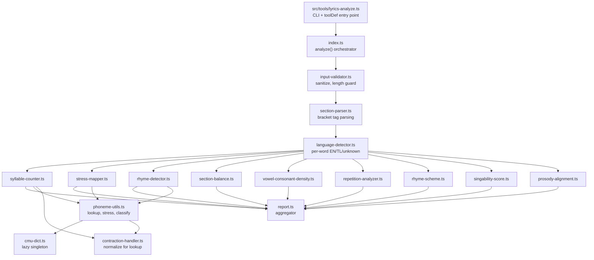
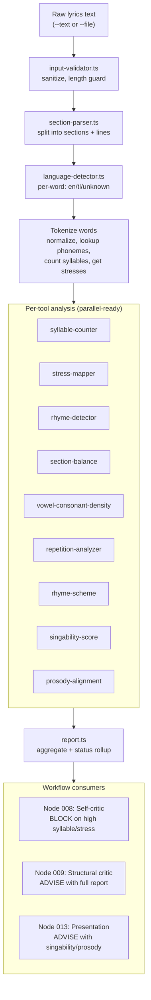
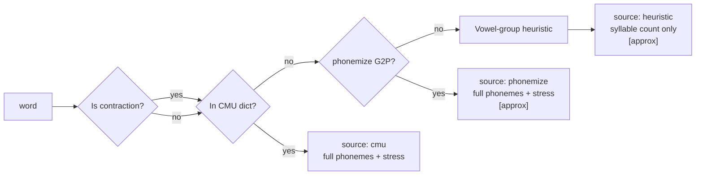

# Architecture: Songwriting and Lyrics Composition Improvement

## Overview

This document specifies the technical architecture for a 9-tool lyrics analysis toolkit that replaces LLM self-judgment with deterministic algorithms across syllable counting, stress mapping, rhyme detection, section balance, phonetic texture, repetition, rhyme scheme identification, singability scoring, and prosody alignment. The system supports English, Tagalog, and Taglish (code-switched) lyrics.

**Constraints (immutable):**

| # | Constraint | Source |
|---|-----------|--------|
| C1 | Bun + TypeScript only | Project-wide |
| C2 | Tool runner pattern (`bun run tool <name>`) | Architecture rule |
| C3 | CLI-first, never MCP from local | Architecture rule |
| C4 | All tools dual-mode: CLI + programmatic via registry `toolDef` | Architecture rule |
| C5 | Existing `phonetics.ts` patterns (CMU dict, ARPAbet) extended, not replaced | Codebase precedent |
| C6 | Tri-critic pipeline preserved | Working system |
| C7 | EN + TL + Taglish only. No pluggable language framework | Hard scope boundary |
| C8 | Craft references queried from brain.db on demand, never bulk-loaded | Context window efficiency |
| C9 | Rune's soul file unchanged | Agent architecture |
| C10 | Total execution < 500ms for a typical song (~50 lines) | Performance requirement |

**Assumptions requiring validation:**

| # | Assumption | Validation method | Blocks |
|---|-----------|-------------------|--------|
| A1 | `phonemize` npm runs under Bun | Spike: test 100 words | Phase 1 |
| A2 | `syllables` npm is more accurate than heuristic | Spike: compare against 100 known words | Phase 1 |
| A7 | Total tool overhead < 500ms | Profile after Phase 1 T1 tools complete | Phase 2 start |
| A9 | CMU-dict-miss is viable primary signal for Taglish detection | Test against 50+ manually labeled Taglish lines | Phase 1 |

## Components

### Module Structure

```
src/libs/lyrics-analyzer/
  index.ts                          -- barrel export + unified analyze() entry point
  types.ts                          -- all shared types and interfaces
  shared/
    cmu-dict.ts                     -- lazy-loaded CMU dict singleton
    phoneme-utils.ts                -- lookupPhonemes(), getStresses(), phoneme classification
    section-parser.ts               -- parse section headers from bracket tags
    language-detector.ts            -- per-word EN/TL/unknown classification
    contraction-handler.ts          -- normalize contractions for lookup, preserve originals
    input-validator.ts              -- sanitize input, reject malformed, length guard
  tools/
    syllable-counter.ts             -- T1: exact syllable counts per word/line
    stress-mapper.ts                -- T1: S/W pattern, metrical feet, dead zones
    rhyme-detector.ts               -- T1: end + internal rhymes, quality scoring 0.0-1.0
    section-balance.ts              -- T1: word count, TTR, syllable density, genre targets
    vowel-consonant-density.ts      -- T2: phoneme feature breakdown per section
    repetition-analyzer.ts          -- T2: hooks, refrains, anaphora, overuse detection
    rhyme-scheme.ts                 -- T2: AABB/ABAB/etc identification per section
    singability-score.ts            -- T3: composite 0-100 advisory score
    prosody-alignment.ts            -- T3: stress-to-beat mapping advisory
  report.ts                         -- unified report aggregator

src/tools/lyrics-analyze.ts         -- CLI entry point with sub-command routing + toolDef

src/libs/prompt-data/
  tagalog-stress-exceptions.ts      -- static exception list for Tagalog stress (NEW)
  tagalog-common-words.ts           -- optional 500-1000 word list for detection (NEW, Phase 1)
  phoneme-features.ts               -- ARPAbet phoneme to feature category mapping (NEW)
```

### Architecture Decision Records

**ADR-1: Directory module vs single file**

| Option | Pros | Cons |
|--------|------|------|
| Single file `lyrics-analyzer.ts` | Simpler imports | 1500+ lines, unmaintainable, all tools coupled |
| Directory with barrel `lyrics-analyzer/index.ts` | Clean boundaries, testable per-tool, parallel dev | More files |

**Decision:** Directory module. The existing `phonetics.ts` is 438 lines for 3 checks. Nine tools would exceed 1500 lines. Each tool has distinct data dependencies. Directory with barrel export preserves import ergonomics: `import { analyze } from "../libs/lyrics-analyzer"`. Council concurred unanimously.

**ADR-2: CLI structure**

| Option | Pros | Cons |
|--------|------|------|
| Single file with sub-commands | Matches tool runner discovery (one file = one tool), simple | Sub-command routing logic in one file |
| Directory `lyrics-analyze/index.ts` | Per-sub-command files | Tool runner discovers one entry point anyway, extra indirection |

**Decision:** Single file `src/tools/lyrics-analyze.ts` with sub-command routing. Sub-commands are positional args: `bun run tool lyrics-analyze syllable --text "..."`. Matches `charcount.ts` pattern.

**ADR-3: Language detection location**

| Option | Pros | Cons |
|--------|------|------|
| Per-tool (each tool detects) | No shared state | N * words redundant lookups, inconsistent tags |
| Shared utility, called once | Single pass, consistent | Slight coupling through shared context |

**Decision:** Shared utility, called once. The `analyze()` orchestrator calls `detectLanguage` during tokenization. Per-word language tags stored in `WordToken` and passed to all tools. Council concurred.

**ADR-4: Dependency strategy**

| Option | Pros | Cons |
|--------|------|------|
| Hard depend on phonemize + syllables | Best accuracy | Blocked if Bun spike fails |
| Optional depend with runtime feature detection | Graceful degradation | More complex code paths |
| Skip npm, extend CMU dict + heuristic only | Zero new deps | Lower accuracy for unknown words |

**Decision:** Optional depend with runtime feature detection. Import `phonemize` and `syllables` dynamically via try/catch. Fall back to CMU dict + vowel-group heuristic if they fail. Phase 1 unblocked regardless of spike. Note: packages are installed via `bun add` and run entirely within Bun's runtime — no Node.js process involved.

**ADR-5: Tagalog stress exception storage**

| Option | Pros | Cons |
|--------|------|------|
| Static TypeScript file in prompt-data/ | Fast, versioned, no DB overhead | Manual updates |
| brain.db-backed growing list | Self-learning, grows from user corrections | Adds DB query latency, complex |

**Decision:** Static TypeScript file. Small dataset (~100-500 entries), fast load, versioned. Migration to brain.db is a contained change if list grows beyond 1000 entries. Council concurred.

**ADR-6: Rhyme quality scoring approach**

| Component | Weight | What it measures |
|-----------|--------|-----------------|
| Stressed vowel match | 65% | Same stressed vowel = highest weight |
| Tail consonant similarity | 25% | Consonants after the stressed vowel |
| Onset similarity | 15% | Consonants before the stressed vowel |

Onset component refined per Gemini: scored as "onset dissimilarity" for perfect/slant classification, "onset similarity" for assonance/alliteration.

**Classification thresholds:**
- `score >= 0.85` → perfect
- `score >= 0.6` → slant
- `score >= 0.4` (vowel match, consonant miss) → assonance
- `score >= 0.4` (consonant match, vowel miss) → consonance
- Same word or homophone → identity (flagged "lazy rhyme", severity medium)
- Multisyllabic with 2+ syllable match → mosaic
- `score < 0.3` → flagged "weak rhyme", severity low

**ADR-7: Blocking policy location**

**Decision:** Blocking policy lives in the workflow layer, not in tools. Tools are pure functions returning facts. Policy is business logic in workflow nodes. Council concurred unanimously.

**ADR-8: Caching strategy**

**Decision:** Per-run word cache for phonemize results. Same word appears multiple times in a song. Cache within a single `analyze()` call. No cross-run persistence needed.

### Component Responsibilities



## Data Flow



### Phoneme Resolution Chain



Note: For Tagalog-detected words, the chain skips directly to the heuristic (CMU is English-only). Tagalog stress defaults to penultimate syllable with exceptions from the static exception list.

## Interface Definitions

### Base Types

```typescript
// types.ts

type Severity = "high" | "medium" | "low";
type SectionType = "verse" | "chorus" | "bridge" | "pre-chorus" | "outro" | "intro" | "hook" | "unknown";

interface Flag {
  line: number;                // 1-based line number in original text
  text: string;                // original line text
  issue: string;               // human-readable description
  severity: Severity;
  suggestion?: string;         // optional fix suggestion
  tool: string;                // originating tool name
}

interface ToolReport {
  tool: string;
  status: "pass" | "warn" | "fail";  // fail = any high flag, warn = any medium, pass = all low or none
  flags: Flag[];
  summary: string;
  executionMs: number;
}

interface ToolInput {
  sections: ParsedSection[];
  languageProfile: LanguageProfile;
  options?: Record<string, unknown>;
}
```

### Shared Utilities

```typescript
// section-parser.ts
interface ParsedSection {
  type: SectionType;
  label: string;               // original bracket text: "[Verse 1]"
  index: number;               // 1-based occurrence of this section type
  lines: ParsedLine[];
  metadata: Record<string, string>;  // typed bracket values
  startLine: number;
}

interface ParsedLine {
  text: string;
  lineNumber: number;
  words: WordToken[];
}

interface WordToken {
  original: string;            // as written: "don't"
  normalized: string;          // for lookup: stripped punctuation
  language: "en" | "tl" | "unknown";
  phonemes: string | null;     // ARPAbet phoneme string if resolved
  syllables: number;
  stresses: number[] | null;
  source: "cmu" | "phonemize" | "heuristic";
}

function parseSections(lyrics: string): ParsedSection[];

// language-detector.ts
interface LanguageProfile {
  totalWords: number;
  english: number;
  tagalog: number;
  unknown: number;
  dominantLanguage: "en" | "tl" | "mixed";
  perWordAssignments: Array<{ word: string; language: "en" | "tl" | "unknown"; confidence: "high" | "medium" | "low" }>;
}

function detectLanguage(word: string): { language: "en" | "tl" | "unknown"; confidence: "high" | "medium" | "low" };
function profileLanguage(words: string[]): LanguageProfile;

// Language detection chain:
// 1. CMU dict present AND not in Tagalog list → en (high)
// 2. In Tagalog list AND not in CMU dict → tl (high)
// 3. In both → en (medium, CMU takes precedence)
// 4. In neither → unknown (low, use vowel-group heuristic)

// cmu-dict.ts
function getDict(): Record<string, string>;  // lazy-load, cache forever

// phoneme-utils.ts
function lookupPhonemes(word: string): string | null;
function getStresses(word: string): number[] | null;
function getPhonemeSequence(word: string): string[];
function classifyPhoneme(phoneme: string): PhonemeFeature;

// contraction-handler.ts
function normalizeForLookup(word: string): string;
function isContraction(word: string): boolean;
function contractionSyllables(word: string): number | null;

// input-validator.ts
interface ValidationResult {
  valid: boolean;
  sanitized: string;
  warnings: string[];
}
function validateInput(lyrics: string): ValidationResult;
```

### Per-Tool Report Types

```typescript
// syllable-counter.ts
interface SyllableReport extends ToolReport {
  tool: "syllable-counter";
  perLine: Array<{
    lineNumber: number;
    text: string;
    syllableCount: number;
    perWord: Array<{ word: string; syllables: number; source: "cmu" | "phonemize" | "heuristic" }>;
  }>;
  perSection: Array<{
    section: string;
    avgSyllablesPerLine: number;
    totalSyllables: number;
  }>;
}

// stress-mapper.ts
interface StressReport extends ToolReport {
  tool: "stress-mapper";
  perLine: Array<{
    lineNumber: number;
    text: string;
    pattern: string;            // "S W S W S"
    metricalFeet: "iambic" | "trochaic" | "anapestic" | "dactylic" | "mixed";
    deadZones: Array<{ start: number; length: number }>;
  }>;
}

// rhyme-detector.ts
interface RhymeReport extends ToolReport {
  tool: "rhyme-detector";
  endRhymes: Array<{
    lineA: number;
    lineB: number;
    wordA: string;
    wordB: string;
    type: "perfect" | "slant" | "assonance" | "consonance" | "mosaic" | "identity";
    score: number;
    section: string;
  }>;
  internalRhymes: Array<{
    line: number;
    wordA: string;
    wordB: string;
    positionA: number;
    positionB: number;
    type: "perfect" | "slant" | "assonance" | "consonance" | "mosaic";
    score: number;
  }>;
  perSection: Array<{
    section: string;
    endRhymeCount: number;
    internalRhymeCount: number;
    internalRhymeDensity: number;
  }>;
}

// section-balance.ts
interface SectionBalanceReport extends ToolReport {
  tool: "section-balance";
  perSection: Array<{
    section: string;
    type: SectionType;
    wordCount: number;
    lineCount: number;
    uniqueWords: number;
    ttr: number;
    avgSyllablesPerLine: number;
    totalSyllables: number;
  }>;
  crossSectionFlags: Array<{
    sections: [string, string];
    metric: string;
    deviation: number;
  }>;
  genreTargetFlags: Array<{
    section: string;
    metric: string;
    actual: number;
    target: [number, number];
  }>;
}

// vowel-consonant-density.ts
interface VowelConsonantDensityReport extends ToolReport {
  tool: "vowel-consonant-density";
  perSection: Array<{
    section: string;
    openVowels: number;
    closedVowels: number;
    plosives: number;
    fricatives: number;
    nasals: number;
    liquids: number;
    glides: number;
    totalPhonemes: number;
    textureProfile: "open" | "percussive" | "liquid" | "balanced";
  }>;
  textureEnergyFlags: Flag[];
}

// repetition-analyzer.ts
interface RepetitionReport extends ToolReport {
  tool: "repetition-analyzer";
  exactRepeats: Array<{
    phrase: string;
    occurrences: number;
    locations: Array<{ section: string; line: number }>;
    structural: boolean;
  }>;
  nearMatches: Array<{
    phraseA: string;
    phraseB: string;
    similarity: number;
    locations: Array<{ section: string; line: number }>;
  }>;
  anaphora: Array<{
    pattern: string;
    lines: number[];
    section: string;
  }>;
  perSection: Array<{
    section: string;
    repetitionRatio: number;
    isStructural: boolean;
  }>;
}

// rhyme-scheme.ts
interface RhymeSchemeReport extends ToolReport {
  tool: "rhyme-scheme";
  perSection: Array<{
    section: string;
    scheme: string;             // "ABAB", "AABB", "FREE"
    confidence: number;
  }>;
  consistencyFlags: Array<{
    sectionType: SectionType;
    sections: string[];
    schemes: string[];
    issue: string;
  }>;
}

// singability-score.ts
interface SingabilityReport extends ToolReport {
  tool: "singability-score";
  composite: number;            // 0-100
  subScores: {
    lineLengthAlignment: number;
    vowelPlacement: number;
    breathPoints: number;
    consonantDensity: number;
    stressRegularity: number;
  };
  weights: Record<string, number>;
  calibrated: boolean;
}

// prosody-alignment.ts
interface ProsodyReport extends ToolReport {
  tool: "prosody-alignment";
  perLine: Array<{
    lineNumber: number;
    text: string;
    metricalGrid: string;
    violations: Array<{
      position: number;
      word: string;
      wordType: "content" | "function";
      gridPosition: "strong" | "weak";
      issue: string;
    }>;
  }>;
  targetMeter: "iambic" | "trochaic";
  strictness: number;
}
```

### Unified Report

```typescript
interface UnifiedReport {
  tools: ToolReport[];
  overall: "pass" | "warn" | "fail";
  language: LanguageProfile;
  sections: ParsedSection[];
  metadata: {
    linesAnalyzed: number;
    wordsAnalyzed: number;
    wordsNotFound: number;
    wordsApproximate: number;
    executionMs: number;
    toolsRun: string[];
  };
}

// Status rollup:
// Any tool status: "fail" (high-severity flags) → overall "fail"
// Any tool status: "warn" (medium, no high) → overall "warn"
// All tools "pass" → overall "pass"
// Individual tool errors (try/catch) → that tool "fail" with error flag, others still run
```

### Unified Entry Point

```typescript
// index.ts
interface AnalyzeOptions {
  tools?: string[];             // which tools to run. Default: all available
  json?: boolean;               // return JSON string instead of formatted text
  genreTargets?: GenreDensity;  // override genre density targets
  targetMeter?: "iambic" | "trochaic";
  prosodyStrictness?: number;
}

export async function analyze(lyrics: string, options?: AnalyzeOptions): Promise<UnifiedReport>;

// Re-exports all tool functions for granular programmatic use
export { countSyllables } from "./tools/syllable-counter";
export { mapStress } from "./tools/stress-mapper";
// ... etc
```

### CLI Entry Point

```typescript
// src/tools/lyrics-analyze.ts

// Sub-commands:
//   bun run tool lyrics-analyze syllable --text "..." | --file path.md [--json]
//   bun run tool lyrics-analyze stress --text "..." | --file path.md [--json]
//   bun run tool lyrics-analyze rhyme --text "..." | --file path.md [--json]
//   bun run tool lyrics-analyze balance --text "..." | --file path.md [--json]
//   bun run tool lyrics-analyze density --text "..." | --file path.md [--json]
//   bun run tool lyrics-analyze repetition --text "..." | --file path.md [--json]
//   bun run tool lyrics-analyze scheme --text "..." | --file path.md [--json]
//   bun run tool lyrics-analyze singability --text "..." | --file path.md [--json]
//   bun run tool lyrics-analyze prosody --text "..." | --file path.md [--json]
//   bun run tool lyrics-analyze --file path.md [--json]   (default: all tools)

export const toolDef: ToolDefinition = {
  name: "lyrics-analyze",
  description: "Analyze lyrics for syllable counts, stress patterns, rhyme quality, section balance, and more.",
  inputSchema: z.object({
    subcommand: z.string().optional(),
    text: z.string().optional(),
    file: z.string().optional(),
    json: z.boolean().optional(),
    all: z.boolean().optional(),
  }),
  tags: ["creative", "quality", "lyrics"],
  execute: async (args) => { /* ... */ },
};
```

## Technology Choices

| Choice | Selected | Alternatives Considered | Rationale |
|--------|----------|------------------------|-----------|
| Library structure | Directory with barrel export | Single file | 9 tools exceed 1500 lines. Per-tool testability. (ADR-1) |
| CLI structure | Single file + sub-commands | Directory | Matches tool runner discovery pattern. (ADR-2) |
| npm dependencies | Optional with dynamic import | Hard depend, skip npm | Graceful degradation. Phase 1 unblocked. (ADR-4) |
| Tagalog stress data | Static TS file | brain.db | Small dataset, fast, versioned. (ADR-5) |
| Rhyme scoring | ARPAbet 65/25/15 | N/A | Research-backed. Onset refinement from council. (ADR-6) |
| Blocking policy | Workflow layer | In tools | Separation of concerns. (ADR-7) |
| Caching | Per-run word cache | Cross-run, none | Same words repeat in a song. No persistence needed. (ADR-8) |

### npm Dependencies

| Package | Purpose | Bun risk | Fallback |
|---------|---------|----------|----------|
| `phonemize` | Pure JS G2P for unknown English words | Requires spike (A1) | CMU dict + vowel-group heuristic |
| `syllables` | CMU-backed syllable counting | Requires spike (A2) | Existing heuristic as fallback |

### Static Data Files

| File | Size estimate | Purpose |
|------|--------------|---------|
| `src/data/cmudict.json` | ~4MB, ~134k entries | Already in repo. No change |
| `src/libs/prompt-data/tagalog-common-words.ts` | ~500-1000 entries | New. Tagalog word list for language detection |
| `src/libs/prompt-data/tagalog-stress-exceptions.ts` | ~100-500 entries | New. Exceptions to penultimate stress rule |
| `src/libs/prompt-data/phoneme-features.ts` | ~80 entries | New. ARPAbet to feature category mapping |
| `src/libs/prompt-data/homographs.ts` | ~20 entries | Already in repo. Absorbed into new library |

## Council Analysis

### Reconciliation Table

| Dimension | Gemini | Grok | Decision |
|-----------|--------|------|----------|
| Directory vs single file | Justified | Justified | **Directory module** |
| Language detection location | Shared utility | Shared utility | **Shared, called once** |
| Phoneme resolution chain | Layered fallback, flag [approx] | CMU → phonemize → heuristic | **Layered chain** |
| Rhyme scoring | Refine onset dissimilarity | 65/25/15 aligns with research | **Adopt with Gemini's refinement** |
| Blocking location | Policy in workflow, not tools | Decouples concerns | **Policy in workflow** |
| Performance | Profile aggressively, cache | Likely under 500ms, benchmark | **Profile after Phase 1, cache per-run** |
| Tagalog stress storage | Start static, design for migration | Static, brain.db adds latency | **Static file** |
| Error handling | Important — try/catch per tool | Wrap each, return error status | **Each tool isolated** |
| Input validation | Important — add validation | Add input-validator.ts | **Adopted. New component.** |
| Test coverage | Comprehensive EN/TL/Taglish fixtures | 100% edge case coverage | **Adopted. Test strategy in Risks.** |
| Tagalog phonetic depth | Consider dedicated G2P | Not raised | **Bounded scope per C7** |
| Debug/verbose mode | Add --verbose flag | Not raised | **Adopted. --verbose flag.** |

### Council Findings Not Adopted

| Finding | Source | Reason for rejection |
|---------|--------|---------------------|
| Dedicated Tagalog G2P model | Gemini | Out of scope per C7. Tagalog's phonetic regularity makes rule-based sufficient |
| Trie-based CMU dict | Grok | Premature optimization. JSON + hash map is O(1). Profile first |
| Run-to-run caching with cacheKey | Grok | Over-engineering. Tool runs once per workflow |

## Workflow Integration

### Node 008 (Self-Critic) — MODIFIED

**Current:** Rune self-critiques → runs `bun run tool phonetics --file out/rune-draft.md` → fixes high LY2/LY5

**New:** Rune self-critiques → runs `bun run tool lyrics-analyze --file out/rune-draft.md --json` → receives UnifiedReport → syllable-counter or stress-mapper flags with severity "high" → MUST rewrite → all other flags → advisory → if rewritten, re-run tools (max 2 iterations) → tool output summary passed to tri-critics

### Node 009 (Structural Critic) — MODIFIED

**Current:** Critic prompt says "Run bun run tool phonetics". Non-English: "Skip phonetic analysis"

**New:** Tool report from node 008 included in critic input. Prompt: "Refer to the LYRICS ANALYSIS REPORT for meter, stress, rhyme, and texture data. Do not re-derive these metrics." Non-English skip clause REMOVED.

### Node 012 (Reconcile) — MINOR UPDATE

Reconciliation table gains "Source" column. Tool-originated high-severity flags that survived node 008 carry mandatory-fix weight.

### Node 013 (Present) — MODIFIED (Phase 3, Could Have)

Adds "Technical Notes (ADVISORY)" section with singability score and prosody warnings. If no T3 tools shipped: section omitted.

### Nodes 010, 011 (MiniMax + Grok Critics) — UNCHANGED

## Absorption Plan

### Files Absorbed

| Current file | Absorbed into | Fate |
|-------------|--------------|------|
| `src/libs/phonetics.ts` (438 lines) | `shared/cmu-dict.ts`, `shared/phoneme-utils.ts`, `tools/stress-mapper.ts`, `tools/vowel-consonant-density.ts`, `tools/syllable-counter.ts` | **Deleted** |
| `src/tools/phonetics.ts` (127 lines) | `src/tools/lyrics-analyze.ts` | **Deleted** |
| `src/libs/prompt-data/syllable-heuristic.ts` (70 lines) | `tools/syllable-counter.ts` (as internal fallback) | **Deleted** |
| `src/libs/prompt-data/homographs.ts` | **Kept in place.** New library imports from there | **Unchanged** |

### Callers to Update

| Caller | Current import | Action |
|--------|---------------|--------|
| `src/tools/phonetics.ts` | `from "../libs/phonetics.js"` | File deleted |
| `src/libs/prompt-data/index.ts` | Re-exports `syllable-heuristic.js` | Remove re-export |
| Any test files importing phonetics | `from "../../phonetics.js"` | Update to lyrics-analyzer |

### Backward Compatibility

Add alias in tool runner:
```typescript
const aliases: Record<string, string> = {
  research: "notebooklm",
  db: "brain",
  phonetics: "lyrics-analyze",  // backward compat
};
```

## Phasing

### Phase 1: Tools Foundation

| Task | Files | Dependencies | Parallel? |
|------|-------|-------------|-----------|
| 1a. Shared utilities + types | `types.ts`, `shared/*` | None | Foundational |
| 1b. Syllable counter | `tools/syllable-counter.ts` | 1a | Yes (parallel with 1c, 1d, 1e) |
| 1c. Stress mapper | `tools/stress-mapper.ts` | 1a | Yes |
| 1d. Rhyme detector | `tools/rhyme-detector.ts` | 1a | Yes |
| 1e. Section balance | `tools/section-balance.ts` | 1a | Yes |
| 1f. Report aggregator + index.ts | `report.ts`, `index.ts` | 1b-1e | Sequential |
| 1g. CLI entry point | `src/tools/lyrics-analyze.ts` | 1f | Sequential |
| 1h. Absorption + cleanup | Delete old files, update callers | 1g | Last |

### Phase 2: Tools Expansion

| Task | Files | Dependencies | Parallel? |
|------|-------|-------------|-----------|
| 2a. Vowel/consonant density | `tools/vowel-consonant-density.ts`, `phoneme-features.ts` | Phase 1 | Yes (parallel with 2b) |
| 2b. Repetition analyzer | `tools/repetition-analyzer.ts` | Phase 1 | Yes |
| 2c. Rhyme scheme | `tools/rhyme-scheme.ts` | Phase 1 (rhyme-detector) | After 2a/2b or parallel |
| 2d. Singability score | `tools/singability-score.ts` | Phase 1 outputs | After 2a |
| 2e. Prosody alignment | `tools/prosody-alignment.ts` | Phase 1 (stress-mapper) | After 2a/2b or parallel |
| 2f. Update report + CLI | `report.ts`, `index.ts`, CLI | 2a-2e | Last |

### Phase 3: Craft + Workflow Integration

| Task | Files | Dependencies | Parallel? |
|------|-------|-------------|-----------|
| 3a. Craft reference files | `vault/studio/references/lyrics/craft/*.md` | None | Yes (parallel with 3b) |
| 3b. Workflow node 008 update | `workflow.md` | Phase 1 | Yes |
| 3c. Node 009 + critic update | `workflow.md`, `lyrics-structural.md` | Phase 1 | After 3b |
| 3d. Node 013 update | `workflow.md` | Phase 2 | After 3c |
| 3e. Workflow gap fixes | `workflow.md` | Phase 1 | After 3b |
| 3f. Agent file updates | `rune.md` agent | 3a | After 3a |
| 3g. brain.db sync for craft refs | Existing infrastructure | 3a | After 3a |

## Decisions

| ADR | Decision | Alternatives rejected | Rationale |
|-----|----------|----------------------|-----------|
| ADR-1 | Directory module | Single file | 9 tools, 1500+ lines, distinct deps |
| ADR-2 | Single CLI with sub-commands | Directory CLI | Matches tool runner pattern |
| ADR-3 | Shared language detection | Per-tool | Single pass, consistent, no redundancy |
| ADR-4 | Optional npm deps | Hard depend, skip | Graceful degradation, Phase 1 unblocked |
| ADR-5 | Static Tagalog stress file | brain.db | Small, fast, versioned |
| ADR-6 | ARPAbet 65/25/15 scoring | N/A | Research-backed, onset refinement |
| ADR-7 | Blocking in workflow | In tools | Separation of concerns |
| ADR-8 | Per-run word cache | Cross-run, none | Words repeat in songs, no persistence needed |

## Risks

| # | Risk | L | I | Mitigation |
|---|------|---|---|-----------|
| R1 | npm packages fail under Bun | Low | Med | Optional depend + dynamic import. Fall back to CMU + heuristic |
| R2 | Singability score doesn't correlate | Med | High | Advisory only. Calibrate via reflect |
| R3 | Prosody false positives | Med | Med | Advisory only. Configurable threshold |
| R4 | Scope creep | Med | High | Phased delivery with exit criteria |
| R6 | Tool overhead >500ms | VLow | Low | Per-run cache. Profile after Phase 1 |
| R7 | CMU dict gaps | Med | Med | phonemize G2P fallback. Flag [approx] |
| R9 | Taglish detection <80% | Med | Med | Vowel-group heuristic fallback |
| R11 | "ng" digraph | High | Low | phoneme-features.ts: ng → nasal |
| R13 | Test corpus quality | Med | Med | Real user lyrics in test set |
| R14 | Rhyme weight tuning | Med | Low | Configurable weights |
| R-NEW-1 | Tool error cascade | Low | Med | Per-tool try/catch. Error isolates |
| R-NEW-2 | Absorption regression | Med | Med | Absorption is last step. Old files kept until new code passes |

### Failure Modes

| What breaks | What happens | Containment |
|-------------|-------------|-------------|
| CMU dict fails to load | Phoneme-dependent tools fail | getDict() returns empty. Text-only tools (balance, repetition) still work |
| phonemize import fails | No G2P for unknown words | Fall back to heuristic. Flag [approx] |
| Section parser fails | Tools receive no sections | Return entire text as single "unknown" section. Tools still run |
| Language detector misclassifies | Wrong pipeline per word | Worst case: falls to heuristic anyway. Degraded, not broken |

## Traceability Matrix

| User Story | Component(s) | Phase |
|-----------|-------------|-------|
| US-1 (Syllable) | syllable-counter, cmu-dict, phoneme-utils, contraction-handler, language-detector | 1 |
| US-2 (Stress) | stress-mapper, phoneme-utils, tagalog-stress-exceptions | 1 |
| US-3 (Rhyme) | rhyme-detector, phoneme-utils | 1 |
| US-4 (Balance) | section-balance, section-parser | 1 |
| US-5 (Scheme) | rhyme-scheme (consumes rhyme-detector) | 2 |
| US-6 (Density) | vowel-consonant-density, phoneme-features | 2 |
| US-7 (Repetition) | repetition-analyzer | 2 |
| US-8 (Singability) | singability-score (consumes syllable + stress + density) | 2 |
| US-9 (Prosody) | prosody-alignment (consumes stress-mapper) | 2 |
| US-10 (Unified CLI) | lyrics-analyze.ts, index.ts, report.ts | 1 |
| US-11 (Self-critic) | workflow.md node 008 | 3 |
| US-12 (Structural critic) | lyrics-structural.md, workflow.md node 009 | 3 |
| US-13 (Pre-presentation) | workflow.md node 013 | 3 |
| US-14 (Craft refs) | vault/studio/references/lyrics/craft/*.md, rune agent | 3 |
| US-15 (Workflow gaps) | workflow.md nodes 007, 008, 012, 014 | 3 |
| US-16 (Language detection) | language-detector, tagalog-common-words | 1 |

## Out of Scope

| Item | Reason |
|------|--------|
| Languages beyond EN + TL + Taglish | Hard boundary (C7) |
| Full Tagalog pronunciation dictionary | Rule-based sufficient |
| Melody prediction / audio analysis | Text-only pipeline |
| Pluggable language framework | Simple if/else, not extensible |
| Persona replacement | Soul file unchanged (C9) |
| Real-time / streaming analysis | Batch only |
| Cross-run caching | Per-run sufficient |
| MiniMax-specific tooling | Universal pipeline |
