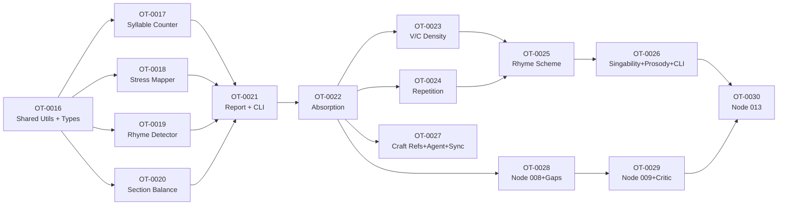

# Task Index

## Execution Order

```
Phase 1: Tools Foundation (7 tasks)
┌──────────────────────────────────────────────────────────────────────┐
│  Group 1:  OT-0016  Shared utilities + types (foundational)         │
│                                                                      │
│  Group 2:  OT-0017  Syllable counter ──┐                            │
│            OT-0018  Stress mapper    ──┤── all parallel after G1     │
│            OT-0019  Rhyme detector   ──┤                             │
│            OT-0020  Section balance  ──┘                            │
│                                                                      │
│  Group 3:  OT-0021  Report + index.ts + CLI entry point             │
│                                                                      │
│  Group 4:  OT-0022  Absorption + cleanup (last in Phase 1)          │
└──────────────────────────────────────────────────────────────────────┘

Phase 2: Tools Expansion (4 tasks)
┌──────────────────────────────────────────────────────────────────────┐
│  Group 5:  OT-0023  Vowel/consonant density ──┐── parallel          │
│            OT-0024  Repetition analyzer     ──┘                     │
│                                                                      │
│  Group 6:  OT-0025  Rhyme scheme identifier                         │
│                                                                      │
│  Group 7:  OT-0026  Singability + prosody + report/CLI update       │
└──────────────────────────────────────────────────────────────────────┘

Phase 3: Craft + Workflow Integration (4 tasks)
┌──────────────────────────────────────────────────────────────────────┐
│  Group 8:  OT-0027  Craft references + agent + brain.db ──┐ parallel│
│            OT-0028  Workflow node 008 + gap fixes        ──┘        │
│                                                                      │
│  Group 9:  OT-0029  Node 009 + critic update                        │
│                                                                      │
│  Group 10: OT-0030  Node 013 advisory gate                          │
└──────────────────────────────────────────────────────────────────────┘
```

## Dependency Graph



## Task List

| Task | Title | Phase | Group | Parallel | Depends On | Status |
|------|-------|-------|-------|----------|------------|--------|
| [OT-0016](OT-0016-shared-utilities-and-types.md) | Shared Utilities and Types | 1 | G1 | No | — | done |
| [OT-0017](OT-0017-syllable-counter-tool.md) | Syllable Counter Tool | 1 | G2 | Yes | OT-0016 | done |
| [OT-0018](OT-0018-stress-mapper-tool.md) | Stress Mapper Tool | 1 | G2 | Yes | OT-0016 | done |
| [OT-0019](OT-0019-rhyme-detector-tool.md) | Rhyme Detector Tool | 1 | G2 | Yes | OT-0016 | done |
| [OT-0020](OT-0020-section-balance-tool.md) | Section Balance Tool | 1 | G2 | Yes | OT-0016 | done |
| [OT-0021](OT-0021-report-aggregator-index-and-cli-entry-point.md) | Report + Index + CLI | 1 | G3 | No | OT-0017..0020 | done |
| [OT-0022](OT-0022-absorption-and-cleanup.md) | Absorption + Cleanup | 1 | G4 | No | OT-0021 | done |
| [OT-0023](OT-0023-vowel-consonant-density-analyzer.md) | Vowel/Consonant Density | 2 | G5 | Yes | OT-0022 | done |
| [OT-0024](OT-0024-repetition-analyzer.md) | Repetition Analyzer | 2 | G5 | Yes | OT-0022 | done |
| [OT-0025](OT-0025-rhyme-scheme-identifier.md) | Rhyme Scheme Identifier | 2 | G6 | No | OT-0023, OT-0024 | done |
| [OT-0026](OT-0026-singability-prosody-and-phase-2-cli-update.md) | Singability + Prosody + CLI | 2 | G7 | No | OT-0025 | done |
| [OT-0027](OT-0027-craft-references-agent-update-and-brain-db-sync.md) | Craft Refs + Agent + Sync | 3 | G8 | Yes | OT-0022 | done |
| [OT-0028](OT-0028-workflow-node-008-update-and-gap-fixes.md) | Node 008 + Gap Fixes | 3 | G8 | Yes | OT-0022 | done |
| [OT-0029](OT-0029-node-009-and-critic-prompt-update.md) | Node 009 + Critic Update | 3 | G9 | No | OT-0028 | done |
| [OT-0030](OT-0030-node-013-advisory-gate.md) | Node 013 Advisory Gate | 3 | G10 | No | OT-0026, OT-0029 | done |

## Consolidation Notes

Consolidated from 21 architecture sub-tasks to 15 implementable tasks:

- **1f + 1g → OT-0021**: Report, index, and CLI are tightly coupled
- **2d + 2e + 2f → OT-0026**: Both T3 tools + CLI update in one session
- **3a + 3f + 3g → OT-0027**: Craft refs + agent update + sync are all content authoring
- **3b + 3e → OT-0028**: Node 008 and gap fixes both touch workflow.md

Max parallel Ryan agents: 4 (Group 2)
